# 简介

## 【升级一】技术栈“除旧迎新”
剔除了JSP、EL、JSTL等过时技术，新增了企业端流行技术Thymeleaf，新增了热门的开发技术Vue和Axios框架，课程设计上不仅贴合企业实际生产环境，同时考虑学习者的技术成长，新增了自定义SSM框架的实现。

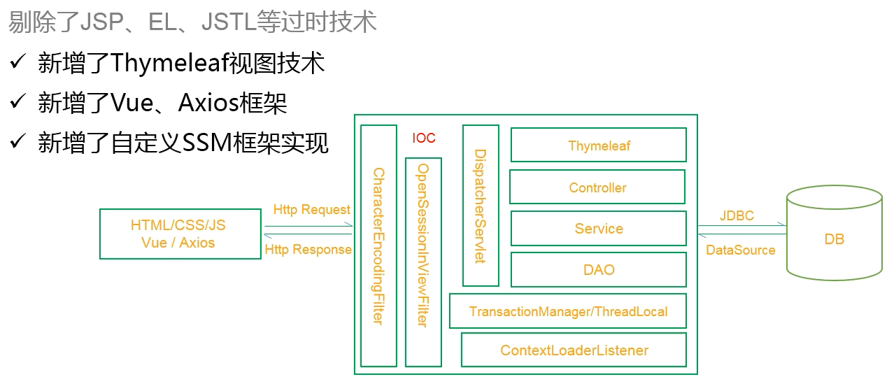

## 【升级二】源码级讲解
深入源码讲解原理，让学习者更加深刻地体会框架整体设计，知其然更知其所以然，避免学习者沦为工具的使用者，只懂皮毛限制技术成长。新版教程核心升级，是对学习者编程思维的升级，万丈高楼平地起，通过源码级讲解帮你打下牢固的地基。

站的高，看的远——从设计框架的角度出发去思考问题

**源码不能光看，一定要上手**

> 实现功能-->提出问题-->分析问题-->提出解决方案

## 【升级三】项目实战“超级大满足”
新版教程项目实战全面升级，整套教程通过三个项目串联所有知识点，让你学以致用融会贯通，避免一看视频就会一敲代码就废。学习JavaWeb使用本套教程，无需再找其他任何项目练习，真正的一套教程搞定JavaWeb！

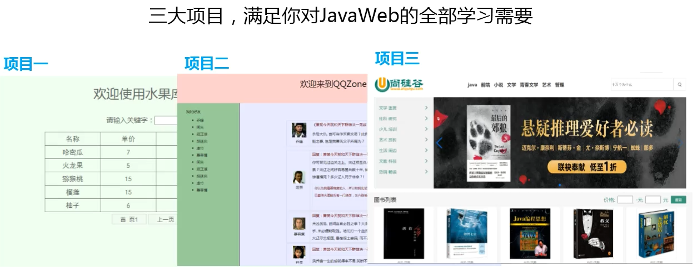

## 【升级四】全新的课程体系设计
新版教程的内容讲解顺序做了大幅调整。首先学习前端基础知识；然后学习后端基础知识；接下来直接对后端进行深度探索，提取了自定义框架；最后在介绍前后端分离时，再去学习前端框架。讲解顺序更加合理，课程逻辑更加清晰。

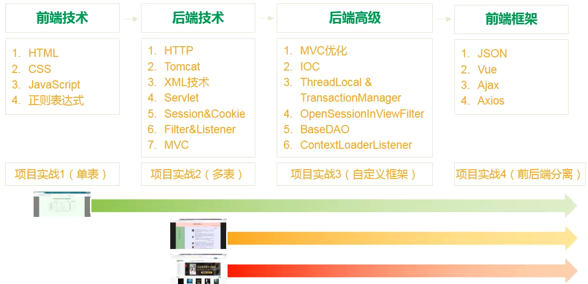


# HTML（HyperText Markup Language）

## HTML介绍
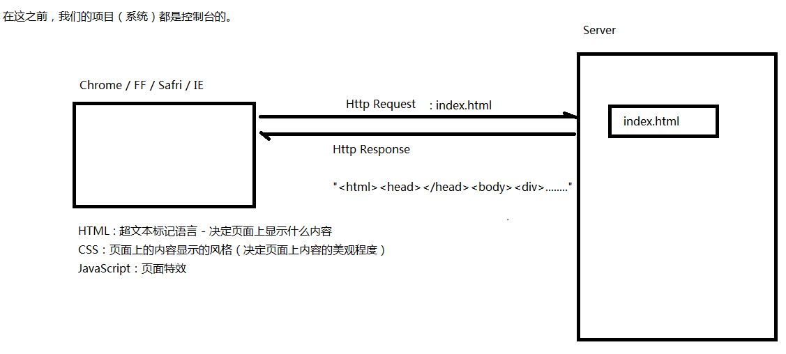

## HTML中的基础标签
[HTML 参考手册- (HTML5 标准) 功能排序](https://www.runoob.com/tags/ref-byfunc.html)


# CSS（Cascading Style Sheets）
[CSS 参考手册](https://www.runoob.com/cssref/css-reference.html)


# JavaScript
[JavaScript 和 HTML DOM 参考手册](https://www.runoob.com/jsref/jsref-tutorial.html)


# Web

## CS和BS的异同点
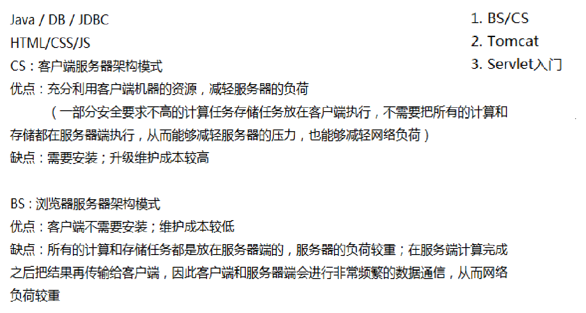


## Tomcat新建项目、部署、运行、访问
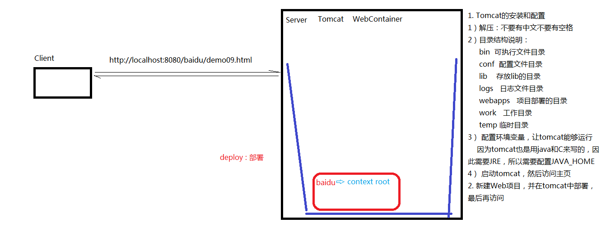

[Tomcat的安装和配置](https://github.com/xftxyz2001/ways/blob/main/Tomcat%E7%9A%84%E5%AE%89%E8%A3%85%E5%92%8C%E9%85%8D%E7%BD%AE.md)


## IDEA下的JavaWeb项目部署、运行
新建web模块：
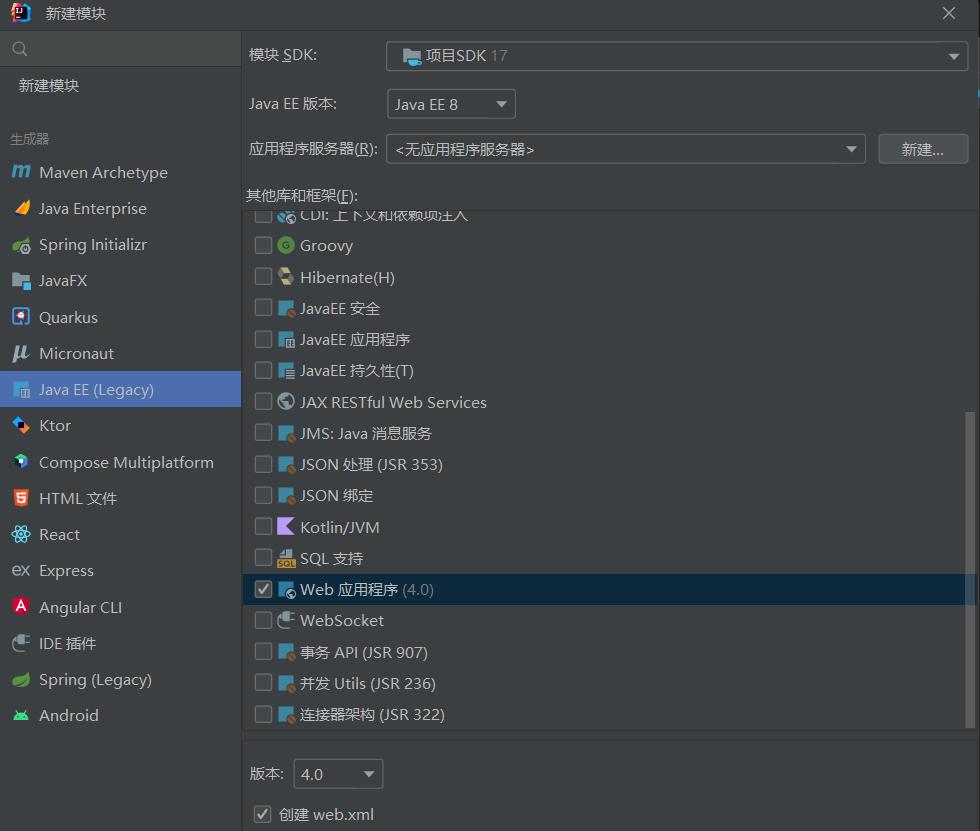
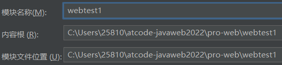

编辑运行、调试配置：
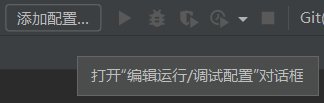
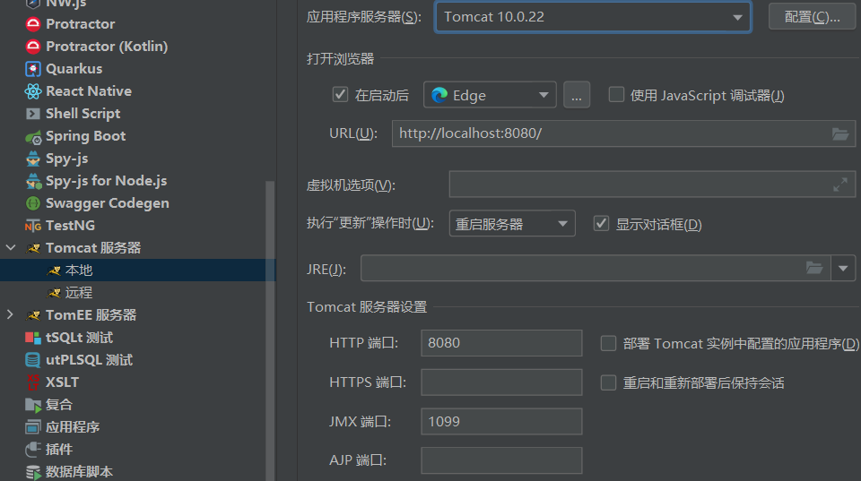
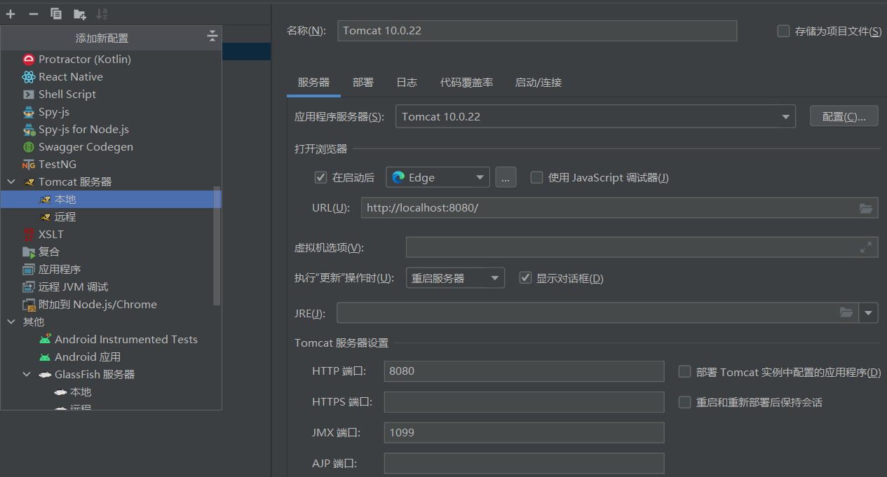

部署：


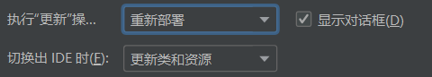


## Servlet入门-获取参数


web/add.html
```html
<form action="add" method="post">
    名称：<input type="text" name="fname"/><br/>
    价格：<input type="text" name="price"/><br/>
    库存：<input type="text" name="fcount"/><br/>
    备注：<input type="text" name="remark"/><br/>
    <input type="submit" value="添加"/>
</form>
```

web/WEB-INF/web.xml
```xml
<servlet>
    <servlet-name>AddServlet</servlet-name>
    <servlet-class>com.xftxyz.shuiguo.servlets.AddServlet</servlet-class>
</servlet>
<servlet-mapping>
    <servlet-name>AddServlet</servlet-name>
    <url-pattern>/add</url-pattern>
</servlet-mapping>
<!--
1. 用户发请求，action=add
2. 项目中，web.xml中找到url-pattern=/add对应的servlet-mapping
3. 获取该servlet-mapping的servlet-name=AddServlet
4. 找和servlet-mapping中servlet-name一致的servlet
5. 找该servlet的servlet-class=com.xftxyz.shuiguo.servlets.AddServlet
6. 用户发送的是post请求（method=post） ， 因此 tomcat会执行AddServlet中的doPost方法
-->
<!-- 补充：一个servlet是可以对应多个servlet-mapping的，再servlet中可以获取是从那个url发起的请求，从而进行不同的业务逻辑 -->
```

com.xftxyz.shuiguo.servlets.AddServlet.java
```java
public class AddServlet extends HttpServlet {
    @Override
    protected void doPost(HttpServletRequest req, HttpServletResponse resp) throws ServletException, IOException {
        String fname = req.getParameter("fname");
        String price = req.getParameter("price");
        String fcount = req.getParameter("fcount");
        String remark = req.getParameter("remark");
    }
}
```

## Review
1. 新建项目 - 新建模块
2. 在模块中添加web
3. 创建artifact - 部署包
4. lib - artifact
   - 先有artifact，后来才添加的mysql.jar。此时，这个jar包并没有添加到部署包中
   - 那么在projectSettings中有一个Problems中会有提示的，我们点击fix选择add to...
   - 另外，我们也可以直接把lib文件夹直接新建在WEB-INF下。
   - 这样不好的地方是这个lib只能是当前这个moudle独享。如果有第二个moudle我们需要再次重复的新建lib。
5. 在部署的时候，修改application Context。然后再回到server选项卡，检查URL的值。
   - URL的值指的是tomcat启动完成后自动打开你指定的浏览器，然后默认访问的网址。
   - 启动后，报错404.404意味着找不到指定的资源。
   - 如果我们的网址是：http://localhost:8080/pro01/ ，那么表明我们访问的是index.html.
   - 我们可以通过`<welcome-file-list>`标签进行设置欢迎页(在tomcat的web.xml中设置，或者在自己项目的web.xml中设置)
6. 405问题。当前请求的方法不支持。比如，我们表单method=post，那么Servlet必须对应doPost。否则报405错误。
7. 空指针或者是NumberFormatException。因为有价格和库存。如果价格取不到，结果你想对null进行Integer.parseInt()就会报错。错误的原因大部分是因为 name="price"此处写错了，结果在Servlet端还是使用request.getParameter("price")去获取。
8. `<url-pattern>`中以斜杠开头


# Servlet

## 请求参数乱码
1. get方式目前不需要设置编码（基于tomcat8）
   - 如果是get请求发送的中文数据，转码稍微有点麻烦（tomcat8之前）
     - String xxx = request.getParameter("xxx");
   - 1.将字符串打散成字节数组
     - byte[] bytes = xxx.getBytes("ISO-8859-1");
   - 2.将字节数组按照设定的编码重新组装成字符串
     - xxx = new String(bytes,"UTF-8");
2. post方式下，设置编码，防止中文乱码
   - `request.setCharacterEncoding("UTF-8");`
   - 需要注意的是，设置编码这一句代码必须在所有的获取参数动作之前


## Servlet继承关系及service方法
jakarta.servlet.Servlet.java
```java
public interface Servlet {
    public void init(ServletConfig config) throws ServletException;// 初始化方法
    public void service(ServletRequest req, ServletResponse res)
            throws ServletException, IOException;// 服务方法
    public void destroy();// 销毁方法
    // ...
}
```

jakarta.servlet.GenericServlet.java
```java
public abstract class GenericServlet implements Servlet, ServletConfig,
        java.io.Serializable {
    @Override
    public void init(ServletConfig config) throws ServletException {
        this.config = config;
        this.init();
    }
    public void init() throws ServletException {}
    @Override
    public abstract void service(ServletRequest req, ServletResponse res)
            throws ServletException, IOException;
    @Override
    public void destroy() {}
    // ...
}
```

jakarta.servlet.http.HttpServlet.java
```java
public abstract class HttpServlet extends GenericServlet {
    @Override
    public void service(ServletRequest req, ServletResponse res)
        throws ServletException, IOException {
        HttpServletRequest  request;
        HttpServletResponse response;
        try {
            request = (HttpServletRequest) req;
            response = (HttpServletResponse) res;
        } catch (ClassCastException e) {
            throw new ServletException(lStrings.getString("http.non_http"));
        }
        service(request, response);
    }
    // 服务方法：当有请求过来时，service方法会自动响应（其实是tomcat容器调用的）
    protected void service(HttpServletRequest req, HttpServletResponse resp)
        throws ServletException, IOException {
        String method = req.getMethod();
        // 在HttpServlet中分析请求的方式，决定调用的是哪个do开头的方法
        if (method.equals(METHOD_GET)) {
            long lastModified = getLastModified(req);
            if (lastModified == -1) {
                doGet(req, resp);
            } else {
                long ifModifiedSince;
                try {
                    ifModifiedSince = req.getDateHeader(HEADER_IFMODSINCE);
                } catch (IllegalArgumentException iae) {
                    ifModifiedSince = -1;
                }
                if (ifModifiedSince < (lastModified / 1000 * 1000)) {
                    maybeSetLastModified(resp, lastModified);
                    doGet(req, resp);
                } else {
                    resp.setStatus(HttpServletResponse.SC_NOT_MODIFIED);
                }
            }
        } else if (method.equals(METHOD_HEAD)) {
            long lastModified = getLastModified(req);
            maybeSetLastModified(resp, lastModified);
            doHead(req, resp);
        } else if (method.equals(METHOD_POST)) {
            doPost(req, resp);
        } else if (method.equals(METHOD_PUT)) {
            doPut(req, resp);
        } else if (method.equals(METHOD_DELETE)) {
            doDelete(req, resp);
        } else if (method.equals(METHOD_OPTIONS)) {
            doOptions(req,resp);
        } else if (method.equals(METHOD_TRACE)) {
            doTrace(req,resp);
        } else {
            String errMsg = lStrings.getString("http.method_not_implemented");
            Object[] errArgs = new Object[1];
            errArgs[0] = method;
            errMsg = MessageFormat.format(errMsg, errArgs);
            resp.sendError(HttpServletResponse.SC_NOT_IMPLEMENTED, errMsg);
        }
    }
    // 在HttpServlet中这些do方法默认都是405的实现风格-要我们子类去实现对应的方法，否则默认会报405错误
    protected void doGet(HttpServletRequest req, HttpServletResponse resp)
        throws ServletException, IOException {
        String msg = lStrings.getString("http.method_get_not_supported");
        sendMethodNotAllowed(req, resp, msg);
    }
    protected void doPost(HttpServletRequest req, HttpServletResponse resp)
        throws ServletException, IOException {

        String msg = lStrings.getString("http.method_post_not_supported");
        sendMethodNotAllowed(req, resp, msg);
    }
    // ...
}
```


## Servlet的生命周期
1. 生命周期：从出生到死亡的过程：对应Servlet中的三个方法：init(), service(), destroy()
2. 默认情况：
   - 第一次接收请求时，这个Servlet会进行实例化(调用构造方法)、初始化(调用init())、然后服务(调用service())
   - 从第二次请求开始，每一次都是服务
   - 当容器关闭时，其中的所有的servlet实例会被销毁，调用销毁方法
3. 案例发现：
   - Servlet实例tomcat只会创建一个，所有的请求都是这个实例去响应。
   - 默认情况下，第一次请求时，tomcat才会去实例化，初始化，然后再服务，以提高系统的启动速度。但第一次请求时，耗时较长。
   - 结论：如果需要提高系统的启动速度，当前默认情况就是这样。如果需要提高响应速度，应设置Servlet的初始化时机。
4. Servlet的初始化时机：
   - 默认是第一次接收请求时，实例化，初始化
   - 我们可以通过`<load-on-startup>`来设置servlet启动的先后顺序。数字越小，启动越靠前，最小值0
5. Servlet在容器中是：单例的、线程不安全的
   - 单例：所有的请求都是同一个实例去响应
   - 线程不安全：一个线程需要根据这个实例中的某个成员变量值去做逻辑判断。但是在中间某个时机，另一个线程改变了这个成员变量的值，从而导致第一个线程的执行路径发生了变化
   - 启发：尽量的不要在servlet中定义成员变量。如果不得不定义成员变量，那么不要进行如下操作
     - 修改成员变量的值
     - 根据成员变量的值做一些逻辑判断

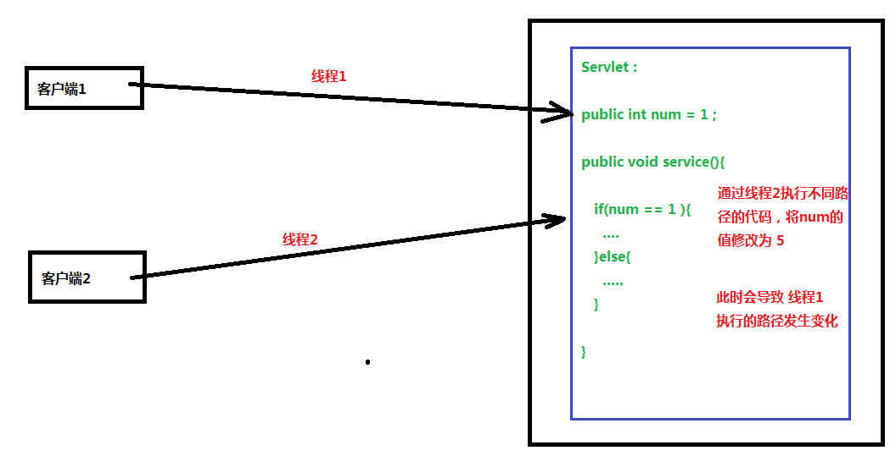


## HTTP协议

### 1、介绍
HTTP：Hyper Text Transfer Protocol超文本传输协议。HTTP最大的作用就是确定了请求和响应数据的格式。浏览器发送给服务器的数据：请求报文；服务器返回给浏览器的数据：响应报文。

### 2、请求报文
1. 在开发者工具中浏览报文源码
    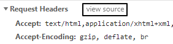
2. 请求报文的三个部分
    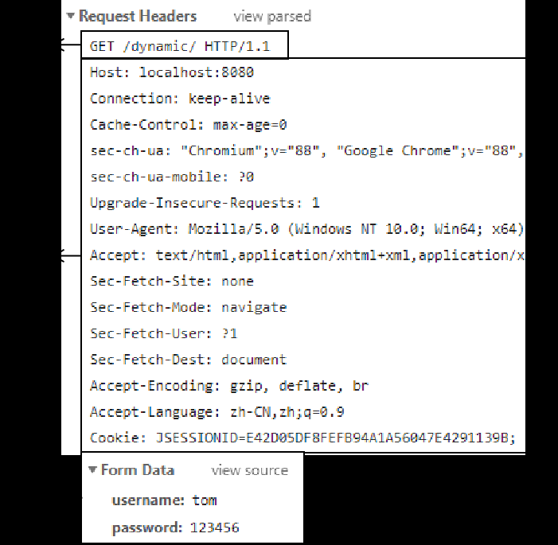
3. 请求行
   - 作用：展示当前请求的最基本信息
   - `POST /dynamic/target.jsp HTTP/1.1`
   - 请求方式
   - 访问地址
   - HTTP协议的版本
4. 请求消息头
   - 作用：通过具体的参数对本次请求进行详细的说明
   - 格式：键值对，键和值之间使用冒号隔开
   - 相对比较重要的请求消息头：
        | 名称           | 功能                                                 |
        | -------------- | ---------------------------------------------------- |
        | Host           | 服务器的主机地址                                     |
        | Accept         | 声明当前请求能够接受的『媒体类型』                   |
        | Referer        | 当前请求来源页面的地址                               |
        | Content-Length | 请求体内容的长度                                     |
        | Content-Type   | 请求体的内容类型，这一项的具体值是媒体类型中的某一种 |
        | Cookie         | 浏览器访问服务器时携带的Cookie数据                   |
5. 请求体
   - 作用：作为请求的主体，发送数据给服务器。具体来说其实就是POST请求方式下的请求参数。
   - GET:query string
   - POST:form data
     - 含义：当前请求体是一个表单提交的请求参数。
        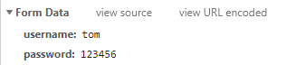
     - 查看源码后，发现格式如下：
        `username=tom&password=123456`
       - 每一组请求参数是一个键值对
       - 键和值中间是等号
       - 键值对之间是&号
   - JSON:request payload
     - 含义：整个请求体以某种特定格式来组织数据，例如JSON格式。
        

### 3、请求方式
1. HTTP1.1中共定义了八种请求方式：
   - GET：从服务器端获取数据
   - POST：将数据保存到服务器端
   - PUT：命令服务器对数据执行更新
   - DELETE：命令服务器删除数据
   - HEAD
   - CONNECT
   - OPTIONS
   - TRACE
2. GET请求
   - 特征1：没有请求体
   - 特征2：请求参数附着在URL地址后面
   - 特征3：请求参数在浏览器地址栏能够直接被看到，存在安全隐患
   - 特征4：在URL地址后面携带请求参数，数据容量非常有限。如果数据量大，那么超出容量的数据会丢失
   - 特征5：从报文角度分析，请求参数是在请求行中携带的，因为访问地址在请求行
3. POST请求
   - 特征1：有请求体
   - 特征2：请求参数放在请求体中
   - 特征3：请求体发送数据的空间没有限制
   - 特征4：可以发送各种不同类型的数据
   - 特征5：从报文角度分析，请求参数是在请求体中携带的
   - 特征6：由于请求参数是放在请求体中，所以浏览器地址栏看不到

### 4、媒体类型
1. HTTP协议中的MIME（Multipurpose Internet Mail Extensions）类型
2. 用途：为了让用户通过浏览器和服务器端交互的过程中有更好、更丰富的体验，HTTP协议需要支持丰富的数据类型。
3. MIME类型在HTTP报文中对应的是内容类型：Content-type
4. MIME类型定义参考：我们可以通过查看Tomcat解压目录下conf/web.xml配置文件，了解HTTP协议中定义的MIME类型。
```xml
<mime-mapping>
 <extension>扩展名</extension>
 <mime-type>大类/具体类型</mime-type>
</mime-mapping>
```

### 5、响应报文
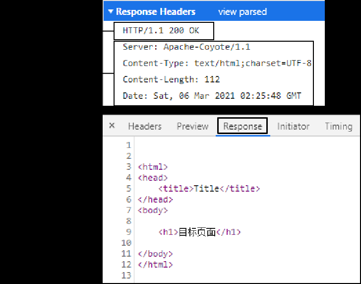
1. 响应状态行
    `HTTP/1.1 200 OK`
   - HTTP协议版本
   - 响应状态码
   - 响应状态的说明文字
2. 响应消息头
   - 响应体的说明书。
   - 服务器端对浏览器端设置数据，例如：服务器端返回Cookie信息。
        | 名称           | 功能                                             |
        | -------------- | ------------------------------------------------ |
        | Content-Type   | 响应体的内容类型                                 |
        | Content-Length | 响应体的内容长度                                 |
        | Set-Cookie     | 服务器返回新的Cookie信息给浏览器                 |
        | location       | 在重定向的情况下，告诉浏览器访问下一个资源的地址 |
3. 响应体：服务器返回的数据主体，有可能是各种数据类型。
   - HTML页面
   - 图片
   - 视频
   - 以下载形式返回的文件
   - CSS文件
   - JavaScript文件
4. 响应状态码
   - 作用：以编码的形式告诉浏览器当前请求处理的结果
        | 状态码 | 含义                                                      |
        | ------ | --------------------------------------------------------- |
        | 200    | 服务器成功处理了当前请求，成功返回响应                    |
        | 302    | 重定向                                                    |
        | 400    | [SpringMVC特定环境]请求参数问题                           |
        | 403    | 没有权限                                                  |
        | 404    | 找不到目标资源                                            |
        | 405    | 请求方式和服务器端对应的处理方式不一致                    |
        | 406    | [SpringMVC特定环境]请求扩展名和实际返回的响应体类型不一致 |
        | 50X    | 服务器端内部错误，通常都是服务器端抛异常了                |


## session会话跟踪技术


Http是无状态的
- HTTP 无状态：服务器无法判断这两次请求是同一个客户端发过来的，还是不同的客户端发过来的
- 无状态带来的现实问题：第一次请求是添加商品到购物车，第二次请求是结账；如果这两次请求服务器无法区分是同一个用户的，那么就会导致混乱
- 通过会话跟踪技术来解决无状态的问题

会话跟踪技术
- 客户端第一次发请求给服务器，服务器获取session，获取不到，则创建新的，然后响应给客户端
- 下次客户端给服务器发请求时，会把sessionID带给服务器，那么服务器就能获取到了，那么服务器就判断这一次请求和上次某次请求是同一个客户端，从而能够区分开客户端

常用API
HttpServletRequest
| 方法签名                                | 描述                                                                                                  |
| --------------------------------------- | ----------------------------------------------------------------------------------------------------- |
| HttpSession getSession()                | 返回与此请求关联的当前会话，如果请求没有会话，则创建一个会话。                                        |
| HttpSession getSession​(boolean create) | 返回与此请求相关联的当前HttpSession，或者，如果没有当前session并且create为true，返回一个新的session。 |

HttpSession
| 方法签名                                   | 描述                                                                                                                 |
| ------------------------------------------ | -------------------------------------------------------------------------------------------------------------------- |
| long getCreationTime()                     | 返回创建此会话的时间，以格林尼治标准时间1970年1月1日零点起的毫秒为单位。                                             |
| String getId()                             | 返回一个包含分配给此会话的唯一标识符的字符串。                                                                       |
| long getLastAccessedTime()                 | 返回客户机发送与此会话关联的请求的最后一次时间，作为1970 GMT时间1月1日午夜以来的毫秒数，并以容器接收请求的时间标记。 |
| int getMaxInactiveInterval()               | 返回servlet容器在客户端访问之间保持会话打开的最大时间间隔(以秒为单位)。                                              |
| void invalidate()                          | 使该会话无效，然后取消绑定到该会话的任何对象。                                                                       |
| boolean isNew()                            | 如果客户端还不知道会话，或者客户端选择不加入会话，则返回true。                                                       |
| void setMaxInactiveInterval​(int interval) | 指定客户端请求之间的时间(以秒为单位)，servlet容器将使此会话失效。                                                    |


## session保存作用域
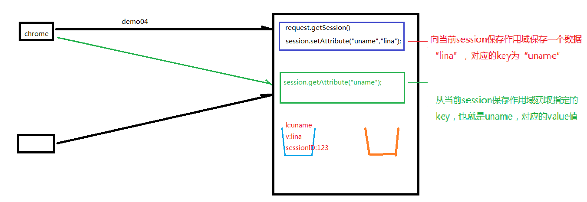

session保存作用域是和具体的某一个session对应的，所有Servlet共享。

常用API
HttpSession
| 方法签名                                      | 描述                                                                       |
| --------------------------------------------- | -------------------------------------------------------------------------- |
| Object getAttribute​(String name)             | 返回在此会话中与指定名称绑定的对象，如果该名称下没有绑定对象，则返回null。 |
| void removeAttribute​(String name)            | 从此会话中移除与指定名称绑定的对象。                                       |
| void setAttribute​(String name, Object value) | 使用指定的名称将对象绑定到此会话。                                         |


## 服务器转发和客户端重定向

### 服务器转发
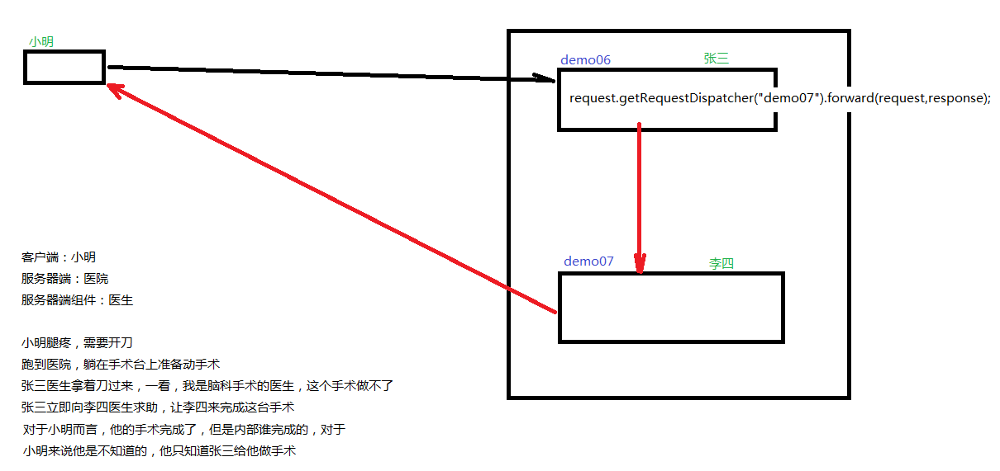

ServletRequest
| 方法签名                                             | 描述                                                                |
| ---------------------------------------------------- | ------------------------------------------------------------------- |
| RequestDispatcher getRequestDispatcher​(String path) | 返回一个RequestDispatcher对象，它充当位于给定路径上的资源的包装器。 |

RequestDispatcher
| 方法签名                                                        | 描述                                                                    |
| --------------------------------------------------------------- | ----------------------------------------------------------------------- |
| void forward​(ServletRequest request, ServletResponse response) | 将请求从servlet转发到服务器上的另一个资源(servlet、JSP文件或HTML文件)。 |

### 客户端重定向
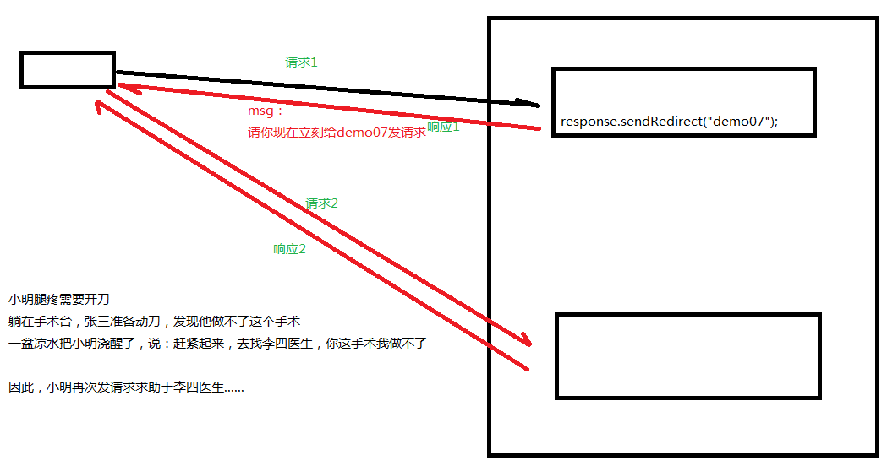

HttpServletResponse
| 方法签名                            | 描述                                                |
| ----------------------------------- | --------------------------------------------------- |
| void sendRedirect​(String location) | 使用指定的重定向位置URL向客户端发送临时重定向响应。 |


# Thymeleaf

## Thymeleaf快速入门
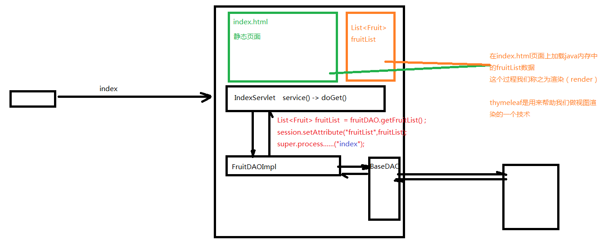

Thymeleaf的同行：JSP、Freemarker、Velocity等等，它们有一个共同的名字：服务器端（视图）模板技术。

### Thymeleaf的优势
- SpringBoot官方推荐使用的视图模板技术，和SpringBoot完美整合。
- 不经过服务器运算仍然可以直接查看原始值，对前端工程师更友好。
```html
<!DOCTYPE html>
<html lang="en" xmlns:th="http://www.thymeleaf.org">
<head>
    <meta charset="UTF-8">
    <title>Title</title>
</head>
<body>
    <p th:text="${hello}">Original Value</p>
</body>
</html>
```

### 物理视图和逻辑视图
1. 物理视图
   - 在Servlet中，将请求转发到一个HTML页面文件时，使用的完整的转发路径就是物理视图。eg.`/pages/user/login_success.html`
   - 如果我们把所有的HTML页面都放在某个统一的目录下，那么转发地址就会呈现出明显的规律：`/pages/user/login.html`、`/pages/user/login_success.html`、`/pages/user/regist.html /pages/user/regist_success.html`
   - 路径的开头都是：/pages/user/，路径的结尾都是：.html
   - 所以，路径开头的部分我们称之为视图前缀，路径结尾的部分我们称之为视图后缀。
2. 逻辑视图
   - 物理视图=视图前缀+逻辑视图+视图后缀
   - 上面的例子中：
        | 视图前缀     | 逻辑视图      | 视图后缀 | 物理视图                       |
        | ------------ | ------------- | -------- | ------------------------------ |
        | /pages/user/ | login         | .html    | /pages/user/login.html         |
        | /pages/user/ | login_success | .html    | /pages/user/login_success.html |

### 在服务器端引入Thymeleaf环境
1. 加入jar包
    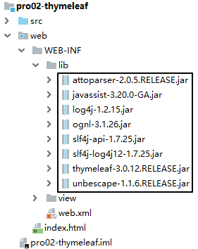
2. 配置上下文参数：web.xml
    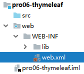
    ```xml
    <!-- 在上下文参数中配置视图前缀和视图后缀 -->
    <context-param>
        <param-name>view-prefix</param-name>
        <param-value>/WEB-INF/view/</param-value>
    </context-param>
    <context-param>
        <param-name>view-suffix</param-name>
        <param-value>.html</param-value>
    </context-param>
    ```
    说明：param-value中设置的前缀、后缀的值不是必须叫这个名字，可以根据实际情况和需求进行修改。
    > 为什么要放在WEB-INF目录下？
    > 原因：WEB-INF目录不允许浏览器直接访问，所以我们的视图模板文件放在这个目录下，是一种保护。以免外界可以随意访问视图模板文件。
    > 访问WEB-INF目录下的页面，都必须通过Servlet转发过来，简单说就是：不经过Servlet访问不了。
    > 这样就方便我们在Servlet中检查当前用户是否有权限访问。
    > 那放在WEB-INF目录下之后，重定向进不去怎么办？
    > 重定向到Servlet，再通过Servlet转发到WEB-INF下。
3. 创建Servlet基类：直接复制粘贴下面的代码即可，将来使用框架后，这些代码都将被取代。
    ```java
    public class ViewBaseServlet extends HttpServlet {
        private TemplateEngine templateEngine;
        @Override
        public void init() throws ServletException {
            // 1.获取ServletContext对象
            ServletContext servletContext = this.getServletContext();
            // 2.创建Thymeleaf解析器对象
            ServletContextTemplateResolver templateResolver = new ServletContextTemplateResolver(servletContext);
            // 3.给解析器对象设置参数
            // ①HTML是默认模式，明确设置是为了代码更容易理解
            templateResolver.setTemplateMode(TemplateMode.HTML);
            // ②设置前缀
            String viewPrefix = servletContext.getInitParameter("view-prefix");
            templateResolver.setPrefix(viewPrefix);
            // ③设置后缀
            String viewSuffix = servletContext.getInitParameter("view-suffix");
            templateResolver.setSuffix(viewSuffix);
            // ④设置缓存过期时间（毫秒）
            templateResolver.setCacheTTLMs(60000L);
            // ⑤设置是否缓存
            templateResolver.setCacheable(true);
            // ⑥设置服务器端编码方式
            templateResolver.setCharacterEncoding("utf-8");
            // 4.创建模板引擎对象
            templateEngine = new TemplateEngine();
            // 5.给模板引擎对象设置模板解析器
            templateEngine.setTemplateResolver(templateResolver);
        }
        protected void processTemplate(String templateName, HttpServletRequest req, HttpServletResponse resp) throws IOException {
            // 1.设置响应体内容类型和字符集
            resp.setContentType("text/html;charset=UTF-8");
            // 2.创建WebContext对象
            WebContext webContext = new WebContext(req, resp, getServletContext());
            // 3.处理模板数据
            templateEngine.process(templateName, webContext, resp.getWriter());
        }
    }
    ```
4. 使我们的Servlet继承ViewBaseServlet
    ```java
    //Servlet从3.0版本开始支持注解方式的注册
    @WebServlet("/index")
    public class IndexServlet extends ViewBaseServlet {
        @Override
        public void doGet(HttpServletRequest request , HttpServletResponse response) throws IOException, ServletException {
            FruitDAO fruitDAO = new FruitDAOImpl();
            List<Fruit> fruitList = fruitDAO.getFruitList();
            //保存到session作用域
            HttpSession session = request.getSession() ;
            session.setAttribute("fruitList", fruitList);
            //此处的视图名称是 index
            //那么thymeleaf会将这个 逻辑视图名称 对应到 物理视图 名称上去
            //逻辑视图名称 ：   index
            //物理视图名称 ：   view-prefix + 逻辑视图名称 + view-suffix
            //所以真实的视图名称是：      /       index       .html
            super.processTemplate("index", request, response);
        }
    }
    ```


## Thymeleaf渲染页面

### th名称空间
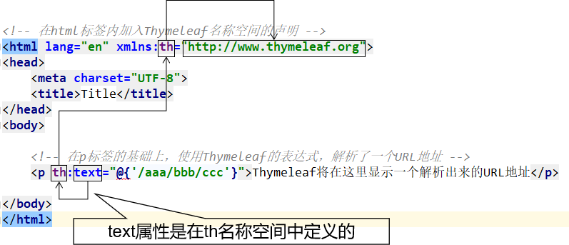

### 表达式语法
1. 修改标签文本值
    ```html
    <p th:text="标签体新值">标签体原始值</p>
    ```
   - th:text作用
     - 不经过服务器解析，直接用浏览器打开HTML文件，看到的是『标签体原始值』
     - 经过服务器解析，Thymeleaf引擎根据th:text属性指定的『标签体新值』去替换『标签体原始值』
   - 字面量
     - 『字面量』是一个经常会遇到的概念，我们可以对照『变量』来理解它的含义。
     - 变量：变量名字符串本身不是它的值，它指向的才是它的值
     - 字面量：它就是字面上的含义，我们从『字面』上看到的直接就是它的值
     - 现在我们在th:text属性中使用的就是『字面量』，它不指代任何其他值。
2. 修改指定属性值
    ```html
    <input type="text" name="username" th:value="文本框新值" value="文本框旧值" />
    ```
    语法：任何HTML标签原有的属性，前面加上『th:』就都可以通过Thymeleaf来设定新值。
3. 解析URL地址
    ```html
    <p th:text="@{/aaa/bbb/ccc}">标签体原始值</p>
    ```
    经过解析后得到：
    > /view/aaa/bbb/ccc
    
    所以@{}的作用是在字符串前附加『上下文路径』
    这个语法的好处是：实际开发过程中，项目在不同环境部署时，Web应用的名字有可能发生变化。所以上下文路径不能写死。而应通过@{}动态获取上下文路径！

    首页使用URL地址解析
    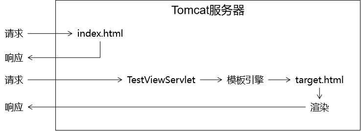
    如果我们直接访问index.html本身，那么index.html是不需要通过Servlet，当然也不经过模板引擎，所以index.html上的Thymeleaf的任何表达式都不会被解析。

    解决办法：通过Servlet访问index.html，这样就可以让模板引擎渲染页面了：
    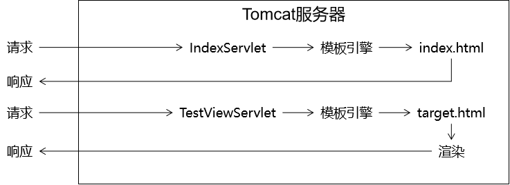
    所有和业务功能相关的请求都能够确保它们通过Servlet来处理，方便我们统一对这些请求进行特定规则的限定。

    给URL地址后面附加请求参数
    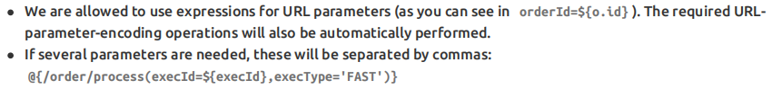
4. 直接执行表达式
   - Servlet代码：
        ```java
        request.setAttribute("reqAttrName", "<span>hello-value</span>");
        ```
   - 页面代码：
        ```html
        <p>有转义效果：[[${reqAttrName}]]</p>
        <p>无转义效果：[(${reqAttrName})]</p>
        ```
   - 执行效果：
        ```html
        <p>有转义效果：&lt;span&gt;hello-value&lt;/span&gt;</p>
        <p>无转义效果：<span>hello-value</span></p>
        ```


## 保存作用域

### 1、域对象
1. 请求域
   - 在请求转发的场景下，我们可以借助HttpServletRequest对象内部给我们提供的存储空间，帮助我们携带数据，把数据发送给转发的目标资源。
   - 请求域：HttpServletRequest对象内部给我们提供的存储空间
    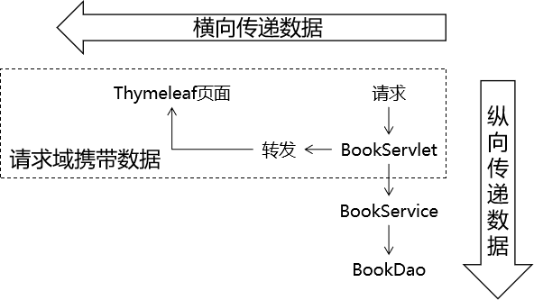
    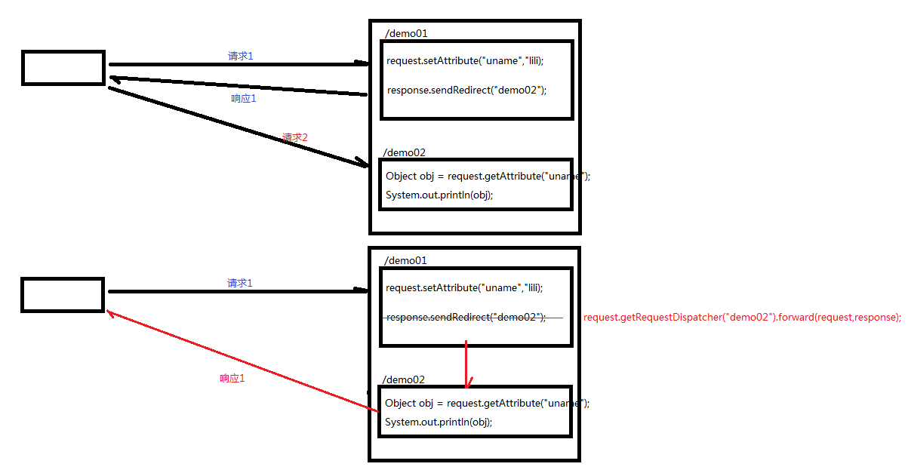
2. 会话域
    
    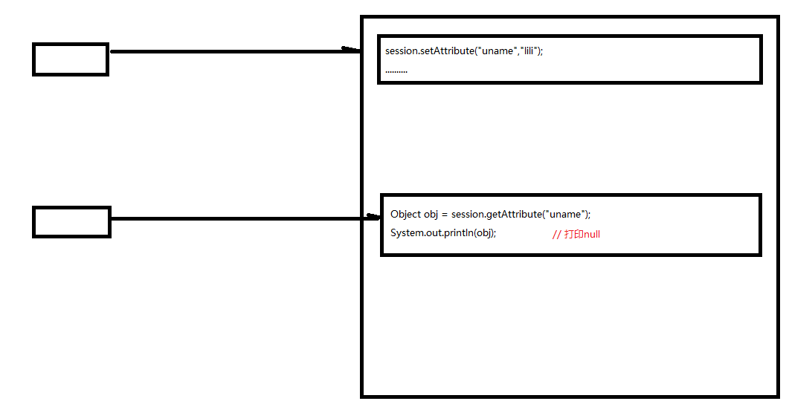
3. 应用域
    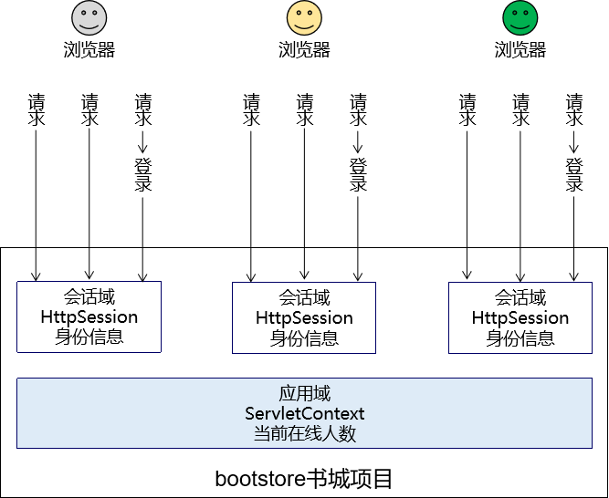
    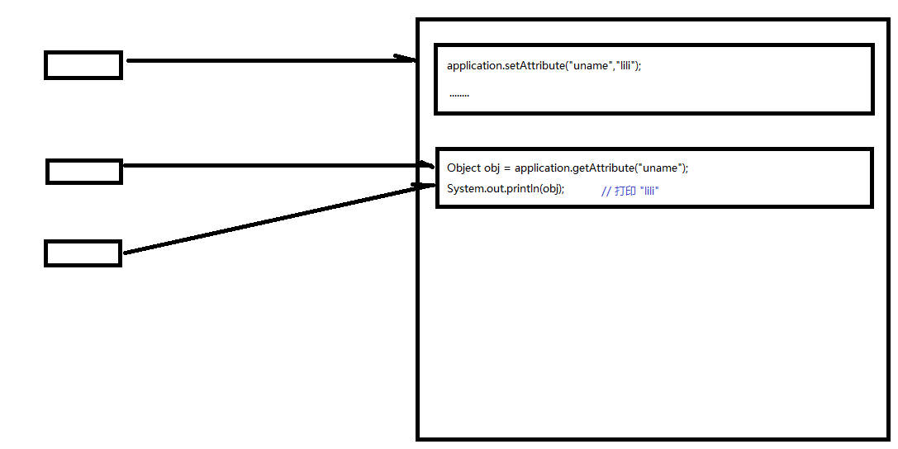

> PS：在我们使用的视图是JSP的时候，域对象有4个
> pageContext
> request：请求域
> session：会话域
> application：应用域
> 所以在JSP的使用背景下，我们可以说域对象有4个，现在使用Thymeleaf了，没有pageContext。

### 2、在Servlet中将数据存入属性域
1. 操作请求域
   - Servlet中代码：
        ```java
        String requestAttrName = "helloRequestAttr";
        String requestAttrValue = "helloRequestAttr-VALUE";
        request.setAttribute(requestAttrName, requestAttrValue);
        ```
   - Thymeleaf表达式：
        ```html
        <p th:text="${helloRequestAttr}">request field value</p>
        ```
2. 操作会话域
   - Servlet中代码：
        ```java
        // ①通过request对象获取session对象
        HttpSession session = request.getSession();
        // ②存入数据
        session.setAttribute("helloSessionAttr", "helloSessionAttr-VALUE");
        ```
   - Thymeleaf表达式：
        ```html
        <p th:text="${session.helloSessionAttr}">这里显示会话域数据</p>
        ```
3. 操作应用域
   - Servlet中代码：
        ```java
        // ①通过调用父类的方法获取ServletContext对象
        ServletContext servletContext = getServletContext();
        // ②存入数据
        servletContext.setAttribute("helloAppAttr", "helloAppAttr-VALUE");
        ```
   - Thymeleaf表达式：
        ```html
        <p th:text="${application.helloAppAttr}">这里显示应用域数据</p>
        ```


## 路径问题
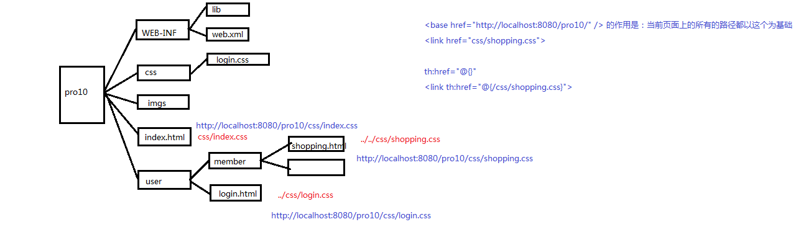

见：Thymeleaf渲染页面：th名称空间：表达式语法：解析URL地址


## 获取请求参数
具体来说，此处探讨的是在页面上（模板页面）获取请求参数。底层机制是：


1. 一个名字一个值
    ```html
    <p th:text="${param.username}">这里替换为请求参数的值</p>
    ```
    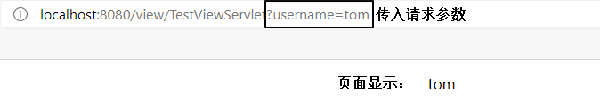
2. 一个名字多个值
    ```html
    <p th:text="${param.team}">这里替换为请求参数的值</p>
    ```
    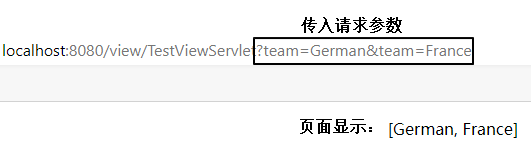
    如果想要精确获取某一个值，可以使用数组下标。页面代码：
    ```html
    <p th:text="${param.team[0]}">这里替换为请求参数的值</p>
    <p th:text="${param.team[1]}">这里替换为请求参数的值</p>
    ```


## 内置对象

### 1、概念
所谓内置对象其实就是在表达式中可以直接使用的对象。

### 2、基本内置对象
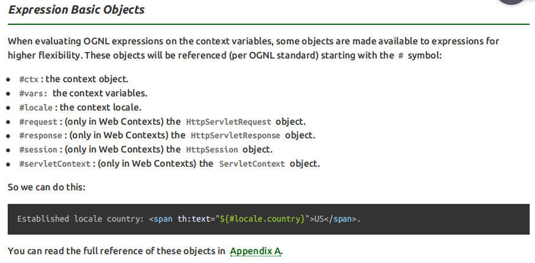

用法举例：
```html
<h3>表达式的基本内置对象</h3>
<p th:text="${#request.getClass().getName()}">这里显示#request对象的全类名</p>
<p th:text="${#request.getContextPath()}">调用#request对象的getContextPath()方法</p>
<p th:text="${#request.getAttribute('helloRequestAttr')}">调用#request对象的getAttribute()方法，读取属性域</p>
```

基本思路：
- 如果不清楚这个对象有哪些方法可以使用，那么就通过getClass().getName()获取全类名，再回到Java环境查看这个对象有哪些方法
- 内置对象的方法可以直接调用
- 调用方法时需要传参的也可以直接传入参数

### 3、公共内置对象
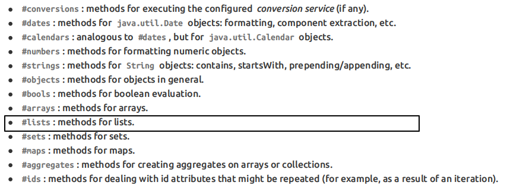

Servlet中将List集合数据存入请求域：
```java
request.setAttribute("aNotEmptyList", Arrays.asList("aaa","bbb","ccc"));
request.setAttribute("anEmptyList", new ArrayList<>());
```

页面代码：
```html
<p>#list对象isEmpty方法判断集合整体是否为空aNotEmptyList：<span th:text="${#lists.isEmpty(aNotEmptyList)}">测试#lists</span></p>
<p>#list对象isEmpty方法判断集合整体是否为空anEmptyList：<span th:text="${#lists.isEmpty(anEmptyList)}">测试#lists</span></p>
```

公共内置对象对应的源码位置：
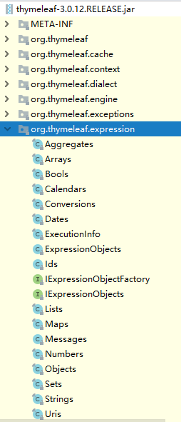


## ${}中的表达式本质是OGNL

### 1、OGNL
OGNL：Object-Graph Navigation Language对象-图 导航语言

### 2、对象图
从根对象触发，通过特定的语法，逐层访问对象的各种属性。
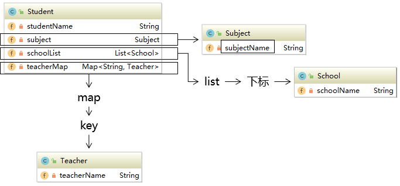

### 3、OGNL语法
在Thymeleaf环境下，${}中的表达式可以从下列元素开始：
- 访问属性域的起点
  - 请求域属性名
  - session
  - application
- param
- 内置对象
  - #request
  - #session
  - #lists
  - #strings

属性访问语法
- 访问对象属性：使用getXxx()、setXxx()方法定义的属性
  - 对象.属性名
- 访问List集合或数组
  - 集合或数组\[下标\]
- 访问Map集合
  - Map集合.key
  - Map集合\['key'\]


## 分支与迭代

### 1、分支
1. if和unless
    让标记了th:if、th:unless的标签根据条件决定是否显示。

    示例的实体类：
    ```java
    public class Employee {
        private Integer empId;
        private String empName;
        private Double empSalary;
    ```
    示例的Servlet代码：
    ```java
    protected void doGet(HttpServletRequest request, HttpServletResponse response) throws ServletException, IOException {
        // 1.创建ArrayList对象并填充
        List<Employee> employeeList = new ArrayList<>();
        employeeList.add(new Employee(1, "tom", 500.00));
        employeeList.add(new Employee(2, "jerry", 600.00));
        employeeList.add(new Employee(3, "harry", 700.00));
        // 2.将集合数据存入请求域
        request.setAttribute("employeeList", employeeList);
        // 3.调用父类方法渲染视图
        super.processTemplate("list", request, response);
    }
    ```
    示例的HTML代码：
    ```html
    <table>
        <tr>
            <th>员工编号</th>
            <th>员工姓名</th>
            <th>员工工资</th>
        </tr>
        <tr th:if="${#lists.isEmpty(employeeList)}">
            <td colspan="3">抱歉！没有查询到你搜索的数据！</td>
        </tr>
        <tr th:if="${not #lists.isEmpty(employeeList)}">
            <td colspan="3">有数据！</td>
        </tr>
        <tr th:unless="${#lists.isEmpty(employeeList)}">
            <td colspan="3">有数据！</td>
        </tr>
    </table>
    ```
    if配合not关键词和unless配合原表达式效果是一样的，看自己的喜好。
2. switch
    ```html
    <h3>测试switch</h3>
    <div th:switch="${user.memberLevel}">
        <p th:case="level-1">银牌会员</p>
        <p th:case="level-2">金牌会员</p>
        <p th:case="level-3">白金会员</p>
        <p th:case="level-4">钻石会员</p>
    </div>
    ```

### 2、迭代
```html
<h3>测试each</h3>
<table>
    <thead>
        <tr>
            <th>员工编号</th>
            <th>员工姓名</th>
            <th>员工工资</th>
        </tr>
    </thead>
    <tbody th:if="${#lists.isEmpty(employeeList)}">
        <tr>
            <td colspan="3">抱歉！没有查询到你搜索的数据！</td>
        </tr>
    </tbody>
    <tbody th:if="${not #lists.isEmpty(employeeList)}">
        <!-- 遍历出来的每一个元素的名字 : ${要遍历的集合} -->
        <tr th:each="employee : ${employeeList}">
            <td th:text="${employee.empId}">empId</td>
            <td th:text="${employee.empName}">empName</td>
            <td th:text="${employee.empSalary}">empSalary</td>
        </tr>
    </tbody>
</table>
```

在迭代过程中，可以参考下面的说明使用迭代状态：
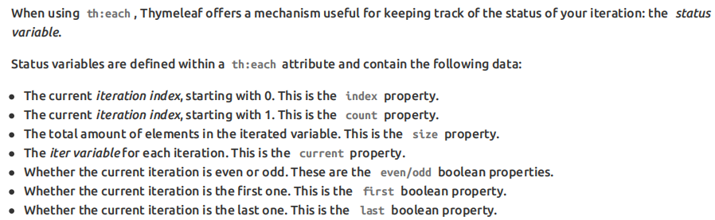

```html
<h3>测试each</h3>
<table>
    <thead>
        <tr>
            <th>员工编号</th>
            <th>员工姓名</th>
            <th>员工工资</th>
            <th>迭代状态</th>
        </tr>
    </thead>
    <tbody th:if="${#lists.isEmpty(employeeList)}">
        <tr>
            <td colspan="3">抱歉！没有查询到你搜索的数据！</td>
        </tr>
    </tbody>
    <tbody th:if="${not #lists.isEmpty(employeeList)}">
        <!-- 遍历出来的每一个元素的名字 : ${要遍历的集合} -->
        <tr th:each="employee,empStatus : ${employeeList}">
            <td th:text="${employee.empId}">empId</td>
            <td th:text="${employee.empName}">empName</td>
            <td th:text="${employee.empSalary}">empSalary</td>
            <td th:text="${empStatus.count}">count</td>
        </tr>
    </tbody>
</table>
```


## 包含其他模板文件

### 1、应用场景
抽取各个页面的公共部分：
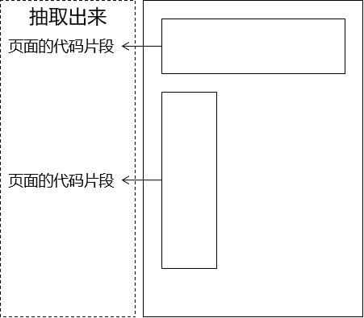

### 2、创建页面的代码片段
使用th:fragment来给这个片段命名：

```html
<div th:fragment="header">
    <p>被抽取出来的头部内容</p>
</div>
```

### 3、包含到有需要的页面
| 语法       | 效果                                                     |
| ---------- | -------------------------------------------------------- |
| th:insert  | 把目标的代码片段整个插入到当前标签内部                   |
| th:replace | 用目标的代码替换当前标签                                 |
| th:include | 把目标的代码片段去除最外层标签，然后再插入到当前标签内部 |

页面代码举例：
```html
<!-- 代码片段所在页面的逻辑视图 :: 代码片段的名称 -->
<div id="badBoy" th:insert="segment :: header">
    div标签的原始内容
</div>

<div id="worseBoy" th:replace="segment :: header">
    div标签的原始内容
</div>

<div id="worstBoy" th:include="segment :: header">
    div标签的原始内容
</div>
```


# 项目实战-水果库存管理

## 编辑、删除、添加
我们经常会用到普通字符串与表达式拼接的情况：
```html
<span th:text="'欢迎您:' + ${user.name} + '!'"></span>
```
字符串字面值需要用''，拼接起来非常麻烦，Thymeleaf对此进行了简化，使用一对|即可：
```html
<span th:text="|欢迎您:${user.name}|"></span>
```

### HTML
index.html
```html
<div id="div_container">
<div id="div_fruit_list">
    <p class="center f30">欢迎使用水果库存后台管理系统</p>
    <div style="border:0px solid red;width:60%;margin-left:20%;text-align:right;">
        <a th:href="@{/add.html}" style="border:0px solid blue;margin-bottom:4px;">添加新库存记录</a>
    </div>
    <table id="tbl_fruit">
        <tr>
            <th class="w20">名称</th>
            <th class="w20">单价</th>
            <th class="w20">库存</th>
            <th>操作</th>
        </tr>
        <tr th:if="${#lists.isEmpty(session.fruitList)}">
            <td colspan="4">对不起，库存为空！</td>
        </tr>
        <tr th:unless="${#lists.isEmpty(session.fruitList)}" th:each="fruit : ${session.fruitList}">
            <!-- <td><a th:text="${fruit.fname}" th:href="@{'/edit.do?fid='+${fruit.fid}}">苹果</a></td> -->
            <td><a th:text="${fruit.fname}" th:href="@{/edit.do(fid=${fruit.fid})}">苹果</a></td>
            <td th:text="${fruit.price}">5</td>
            <td th:text="${fruit.fcount}">20</td>
            <!-- <td></td> -->
            <td></td>
        </tr>
    </table>
</div>
</div>
```

edit.html
```html
<div id="div_container">
<div id="div_fruit_list">
    <p class="center f30">编辑库存信息</p>
    <form th:action="@{/update.do}" method="post" th:object="${fruit}">
        <!-- 隐藏域 ： 功能类似于文本框 ， 它的值会随着表单的发送也会发送给服务器，但是界面上用户看不到 -->
        <input type="hidden" name="fid" th:value="*{fid}"/>
        <table id="tbl_fruit">
            <tr>
                <th class="w20">名称：</th>
                <!-- <td><input type="text" name="fname" th:value="${fruit.fname}"/></td> -->
                <td><input type="text" name="fname" th:value="*{fname}"/></td>
            </tr>
            <tr>
                <th class="w20">单价：</th>
                <td><input type="text" name="price" th:value="*{price}"/></td>
            </tr>
            <tr>
                <th class="w20">库存：</th>
                <td><input type="text" name="fcount" th:value="*{fcount}"/></td>
            </tr>
            <tr>
                <th class="w20">备注：</th>
                <td><input type="text" name="remark" th:value="*{remark}"/></td>
            </tr>
            <tr>
                <th colspan="2">
                    <input type="submit" value="修改" />
                </th>
            </tr>
        </table>
    </form>
</div>
</div>
```

add.html
```html
<div id="div_container">
<div id="div_fruit_list">
    <p class="center f30">新增库存信息</p>
    <form action="@{/add.do}" method="post">
        <table id="tbl_fruit">
            <tr>
                <th class="w20">名称：</th>
                <!-- <td><input type="text" name="fname" th:value="${fruit.fname}"/></td> -->
                <td><input type="text" name="fname" /></td>
            </tr>
            <tr>
                <th class="w20">单价：</th>
                <td><input type="text" name="price" /></td>
            </tr>
            <tr>
                <th class="w20">库存：</th>
                <td><input type="text" name="fcount" /></td>
            </tr>
            <tr>
                <th class="w20">备注：</th>
                <td><input type="text" name="remark" /></td>
            </tr>
            <tr>
                <th colspan="2">
                    <input type="submit" value="添加" />
                </th>
            </tr>
        </table>
    </form>
</div>
</div>
```

### JS
index.js
```javascript
function delFruit(fid){
    if(confirm('是否确认删除？')){
        window.location.href='del.do?fid='+fid;
    }
}
```

### Servlet
```java
@WebServlet("/index")
public class IndexServlet extends ViewBaseServlet {
    @Override
    public void doGet(HttpServletRequest request , HttpServletResponse response) throws IOException, ServletException {
        FruitDAO fruitDAO = new FruitDAOImpl();
        List<Fruit> fruitList = fruitDAO.getFruitList();
        HttpSession session = request.getSession() ;
        session.setAttribute("fruitList", fruitList);
        super.processTemplate("index", request, response);
    }
}
```

```java
@WebServlet("/edit.do")
public class EditServlet extends ViewBaseServlet {
    private FruitDAO fruitDAO = new FruitDAOImpl();
    @Override
    public void doGet(HttpServletRequest request , HttpServletResponse response) throws IOException, ServletException {
        String fidStr = request.getParameter("fid");
        if(StringUtil.isNotEmpty(fidStr)){
            int fid = Integer.parseInt(fidStr);
            Fruit fruit = fruitDAO.getFruitByFid(fid);
            request.setAttribute("fruit", fruit);
            super.processTemplate("edit", request, response);
        }
    }
}
```

```java
@WebServlet("/update.do")
public class UpdateServlet extends ViewBaseServlet {
    private FruitDAO fruitDAO = new FruitDAOImpl();
    @Override
    protected void doPost(HttpServletRequest request, HttpServletResponse response) throws ServletException, IOException {
        //1.设置编码
        request.setCharacterEncoding("utf-8");
        //2.获取参数
        String fidStr = request.getParameter("fid");
        Integer fid = Integer.parseInt(fidStr);
        String fname = request.getParameter("fname");
        String priceStr = request.getParameter("price");
        int price = Integer.parseInt(priceStr);
        String fcountStr = request.getParameter("fcount");
        Integer fcount = Integer.parseInt(fcountStr);
        String remark = request.getParameter("remark");
        //3.执行更新
        fruitDAO.updateFruit(new Fruit(fid, fname, price, fcount, remark));
        //4.资源跳转
        //super.processTemplate("index",request,response);
        //request.getRequestDispatcher("index.html").forward(request,response);
        //此处需要重定向，目的是重新给IndexServlet发请求，重新获取furitList，然后覆盖到session中，这样index.html页面上显示的session中的数据才是最新的
        response.sendRedirect("index");
    }
}
```

```java
@WebServlet("/add.do")
public class AddServlet extends ViewBaseServlet {
    private FruitDAO fruitDAO = new FruitDAOImpl();
    @Override
    protected void doPost(HttpServletRequest request, HttpServletResponse response) throws ServletException, IOException {
        request.setCharacterEncoding("UTF-8");
        String fname = request.getParameter("fname");
        Integer price = Integer.parseInt(request.getParameter("price"));
        Integer fcount = Integer.parseInt(request.getParameter("fcount"));
        String remark = request.getParameter("remark");
        Fruit fruit = new Fruit(0, fname, fcount, remark);
        fruitDAO.addFruit(fruit);
        response.sendRedirect("index");
    }
}
```

```java
@WebServlet("/del.do")
public class DelServlet extends ViewBaseServlet {
    private FruitDAO fruitDAO = new FruitDAOImpl();
    @Override
    public void doGet(HttpServletRequest request , HttpServletResponse response)throws IOException, ServletException {
        String fidStr = request.getParameter("fid");
        if(StringUtil.isNotEmpty(fidStr)){
            int fid = Integer.parseInt(fidStr);
            fruitDAO.delFruit(fid);
            //super.processTemplate("index", request, response);
            response.sendRedirect("index");
        }
    }
}
```


## 分页

### HTML
index.html
```html
<div id="div_container">
<div id="div_fruit_list">
    <p class="center f30">欢迎使用水果库存后台管理系统</p>
    <div style="border:0px solid red;width:60%;margin-left:20%;text-align:right;">
        <a th:href="@{/add.html}" style="border:0px solid blue;margin-bottom:4px;">添加新库存记录</a>
    </div>
    <table id="tbl_fruit">
        <tr>
            <th class="w20">名称</th>
            <th class="w20">单价</th>
            <th class="w20">库存</th>
            <th>操作</th>
        </tr>
        <tr th:if="${#lists.isEmpty(session.fruitList)}">
            <td colspan="4">对不起，库存为空！</td>
        </tr>
        <tr th:unless="${#lists.isEmpty(session.fruitList)}" th:each="fruit : ${session.fruitList}">
            <!-- <td><a th:text="${fruit.fname}" th:href="@{'/edit.do?fid='+${fruit.fid}}">苹果</a></td> -->
            <td><a th:text="${fruit.fname}" th:href="@{/edit.do(fid=${fruit.fid})}">苹果</a></td>
            <td th:text="${fruit.price}">5</td>
            <td th:text="${fruit.fcount}">20</td>
            <!-- <td></td> -->
            <td></td>
        </tr>
    </table>
    <div style="width:60%;margin-left:20%;border:0px solid red;padding-top:4px;" class="center">
        <input type="button" value="首  页" class="btn" th:onclick="|page(1)|" th:disabled="${session.pageNo==1}"/>
        <input type="button" value="上一页" class="btn" th:onclick="|page(${session.pageNo-1})|" th:disabled="${session.pageNo==1}"/>
        <input type="button" value="下一页" class="btn" th:onclick="|page(${session.pageNo+1})|" th:disabled="${session.pageNo==session.pageCount}"/>
        <input type="button" value="尾  页" class="btn" th:onclick="|page(${session.pageCount})|" th:disabled="${session.pageNo==session.pageCount}"/>
    </div>
</div>
</div>
```

### JS
index.js
```javascript
function delFruit(fid){
    if(confirm('是否确认删除？')){
        window.location.href='del.do?fid='+fid;
    }
}
function page(pageNo){
    window.location.href="index?pageNo="+pageNo;
}
```

### Servlet
```java
@WebServlet("/index")
public class IndexServlet extends ViewBaseServlet {
    @Override
    public void doGet(HttpServletRequest request, HttpServletResponse response) throws IOException, ServletException {
        Integer pageNo = 1;
        String pageNoStr = request.getParameter("pageNo");
        if (StringUtil.isNotEmpty(pageNoStr)) {
            pageNo = Integer.parseInt(pageNoStr);
        }
        HttpSession session = request.getSession();
        session.setAttribute("pageNo", pageNo);
        FruitDAO fruitDAO = new FruitDAOImpl();
        List<Fruit> fruitList = fruitDAO.getFruitList(pageNo);
        session.setAttribute("fruitList", fruitList);
        int fruitCount = fruitDAO.getFruitCount(); // 总记录条数
        int pageCount = (fruitCount + 5 - 1) / 5; // 总页数
        session.setAttribute("pageCount", pageCount);
        super.processTemplate("index", request, response);
    }
}
```


## 关键字查询

### HTML
index.html
```html
<div id="div_container">
<div id="div_fruit_list">
    <p class="center f30">欢迎使用水果库存后台管理系统</p>
    <div style="border:0px solid red;width:60%;margin-left:20%;text-align:right;">
        <form th:action="@{/index}" method="post" style="float:left;width:60%;margin-left:20%;">
            <input type="hidden" name="oper" value="search"/>
            请输入关键字：<input type="text" name="keyword" th:value="${session.keyword}"/>
            <input type="submit" value="查询" class="btn"/>
        </form>
        <a th:href="@{/add.html}" style="border:0px solid blue;margin-bottom:4px;">添加新库存记录</a>
    </div>
    <table id="tbl_fruit">
        <tr>
            <th class="w20">名称</th>
            <th class="w20">单价</th>
            <th class="w20">库存</th>
            <th>操作</th>
        </tr>
        <tr th:if="${#lists.isEmpty(session.fruitList)}">
            <td colspan="4">对不起，库存为空！</td>
        </tr>
        <tr th:unless="${#lists.isEmpty(session.fruitList)}" th:each="fruit : ${session.fruitList}">
            <!-- <td><a th:text="${fruit.fname}" th:href="@{'/edit.do?fid='+${fruit.fid}}">苹果</a></td> -->
            <td><a th:text="${fruit.fname}" th:href="@{/edit.do(fid=${fruit.fid})}">苹果</a></td>
            <td th:text="${fruit.price}">5</td>
            <td th:text="${fruit.fcount}">20</td>
            <!-- <td></td> -->
            <td></td>
        </tr>
    </table>
    <div style="width:60%;margin-left:20%;border:0px solid red;padding-top:4px;" class="center">
        <input type="button" value="首  页1" class="btn" th:onclick="|page(1)|" th:disabled="${session.pageNo==1}"/>
        <input type="button" value="上一页" class="btn" th:onclick="|page(${session.pageNo-1})|" th:disabled="${session.pageNo==1}"/>
        <input type="button" value="下一页" class="btn" th:onclick="|page(${session.pageNo+1})|" th:disabled="${session.pageNo==session.pageCount}"/>
        <input type="button" value="尾  页" class="btn" th:onclick="|page(${session.pageCount})|" th:disabled="${session.pageNo==session.pageCount}"/>
    </div>
</div>
</div>
```

### Servlet
```java
@WebServlet("/index")
public class IndexServlet extends ViewBaseServlet {
    @Override
    protected void doPost(HttpServletRequest req, HttpServletResponse resp) throws ServletException, IOException {
        doGet(req, resp);
    }
    @Override
    public void doGet(HttpServletRequest request, HttpServletResponse response) throws IOException, ServletException {
        request.setCharacterEncoding("UTF-8");
        HttpSession session = request.getSession();
        Integer pageNo = 1;
        String oper = request.getParameter("oper");
        // 如果oper!=null 说明 通过表单的查询按钮点击过来的
        // 如果oper是空的，说明 不是通过表单的查询按钮点击过来的
        String keyword = null;
        if (StringUtil.isNotEmpty(oper) && "search".equals(oper)) {
            // 说明是点击表单查询发送过来的请求
            // 此时，pageNo应该还原为1 ， keyword应该从请求参数中获取
            pageNo = 1;
            keyword = request.getParameter("keyword");
            if (StringUtil.isEmpty(keyword)) {
                keyword = "";
            }
            session.setAttribute("keyword", keyword);
        } else {
            // 说明此处不是点击表单查询发送过来的请求（比如点击下面的上一页下一页或者直接在地址栏输入网址）
            // 此时keyword应该从session作用域获取
            String pageNoStr = request.getParameter("pageNo");
            if (StringUtil.isNotEmpty(pageNoStr)) {
                pageNo = Integer.parseInt(pageNoStr);
            }
            Object keywordObj = session.getAttribute("keyword");
            if (keywordObj != null) {
                keyword = (String) keywordObj;
            } else {
                keyword = "";
            }
        }
        session.setAttribute("pageNo", pageNo);
        FruitDAO fruitDAO = new FruitDAOImpl();
        List<Fruit> fruitList = fruitDAO.getFruitList(keyword, pageNo);
        session.setAttribute("fruitList", fruitList);
        int fruitCount = fruitDAO.getFruitCount(keyword);
        int pageCount = (fruitCount + 5 - 1) / 5;
        session.setAttribute("pageCount", pageCount);
        super.processTemplate("index", request, response);
    }
}
```


# MVC（Model View Controller）

## Servlet优化1
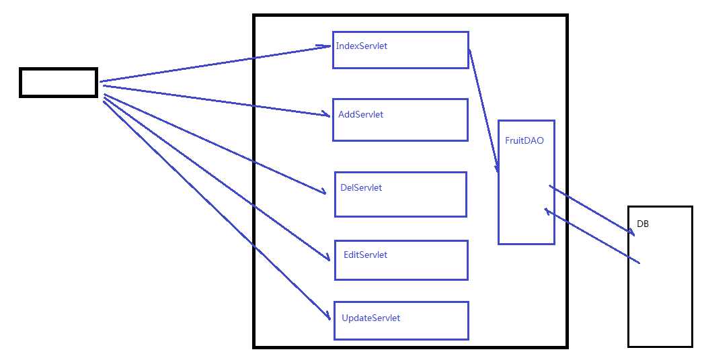
->
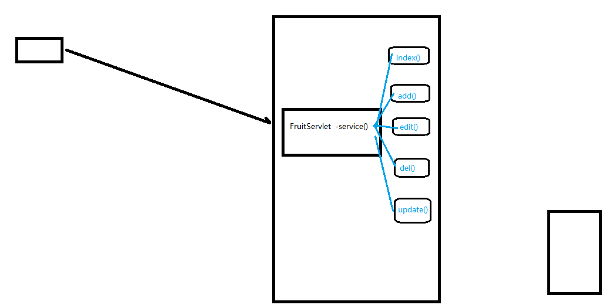

### HTML
index.html
```html
<div id="div_container">
<div id="div_fruit_list">
    <p class="center f30">欢迎使用水果库存后台管理系统</p>
    <div style="border:0px solid red;width:60%;margin-left:20%;text-align:right;">
        <form th:action="@{/fruit.do}" method="post" style="float:left;width:60%;margin-left:20%;">
            <input type="hidden" name="oper" value="search"/>
            请输入关键字：<input type="text" name="keyword" th:value="${session.keyword}"/>
            <input type="submit" value="查询" class="btn"/>
        </form>
        <a th:href="@{/add.html}" style="border:0px solid blue;margin-bottom:4px;">添加新库存记录</a>
    </div>
    <table id="tbl_fruit">
        <tr>
            <th class="w20">名称</th>
            <th class="w20">单价</th>
            <th class="w20">库存</th>
            <th>操作</th>
        </tr>
        <tr th:if="${#lists.isEmpty(session.fruitList)}">
            <td colspan="4">对不起，库存为空！</td>
        </tr>
        <tr th:unless="${#lists.isEmpty(session.fruitList)}" th:each="fruit : ${session.fruitList}">
            <!-- <td><a th:text="${fruit.fname}" th:href="@{'/edit.do?fid='+${fruit.fid}}">苹果</a></td> -->
            <td><a th:text="${fruit.fname}" th:href="@{/fruit.do(fid=${fruit.fid},operate='edit')}">苹果</a></td>
            <td th:text="${fruit.price}">5</td>
            <td th:text="${fruit.fcount}">20</td>
            <!-- <td></td> -->
            <td></td>
        </tr>
    </table>
    <div style="width:60%;margin-left:20%;border:0px solid red;padding-top:4px;" class="center">
        <input type="button" value="首  页1" class="btn" th:onclick="|page(1)|" th:disabled="${session.pageNo==1}"/>
        <input type="button" value="上一页" class="btn" th:onclick="|page(${session.pageNo-1})|" th:disabled="${session.pageNo==1}"/>
        <input type="button" value="下一页" class="btn" th:onclick="|page(${session.pageNo+1})|" th:disabled="${session.pageNo==session.pageCount}"/>
        <input type="button" value="尾  页" class="btn" th:onclick="|page(${session.pageCount})|" th:disabled="${session.pageNo==session.pageCount}"/>
    </div>
</div>
</div>
```

edit.html
```html
<div id="div_container">
<div id="div_fruit_list">
    <p class="center f30">编辑库存信息</p>
    <form th:action="@{/fruit.do}" method="post" th:object="${fruit}">
        <input type="hidden" name="operate" value="update">
        <!-- 隐藏域 ： 功能类似于文本框 ， 它的值会随着表单的发送也会发送给服务器，但是界面上用户看不到 -->
        <input type="hidden" name="fid" th:value="*{fid}"/>
        <table id="tbl_fruit">
            <tr>
                <th class="w20">名称：</th>
                <!-- <td><input type="text" name="fname" th:value="${fruit.fname}"/></td> -->
                <td><input type="text" name="fname" th:value="*{fname}"/></td>
            </tr>
            <tr>
                <th class="w20">单价：</th>
                <td><input type="text" name="price" th:value="*{price}"/></td>
            </tr>
            <tr>
                <th class="w20">库存：</th>
                <td><input type="text" name="fcount" th:value="*{fcount}"/></td>
            </tr>
            <tr>
                <th class="w20">备注：</th>
                <td><input type="text" name="remark" th:value="*{remark}"/></td>
            </tr>
            <tr>
                <th colspan="2">
                    <input type="submit" value="修改" />
                </th>
            </tr>
        </table>
    </form>
</div>
</div>
```

add.html
```html
<div id="div_container">
<div id="div_fruit_list">
    <p class="center f30">新增库存信息</p>
    <!--<form action="add.do" method="post">-->
    <!--<form th:action="@{/fruit.do}" method="post">-->
    <form action="fruit.do" method="post">
        <input type="hidden" name="operate" value="add"/>
        <table id="tbl_fruit">
            <tr>
                <th class="w20">名称：</th>
                <!-- <td><input type="text" name="fname" th:value="${fruit.fname}"/></td> -->
                <td><input type="text" name="fname" /></td>
            </tr>
            <tr>
                <th class="w20">单价：</th>
                <td><input type="text" name="price" /></td>
            </tr>
            <tr>
                <th class="w20">库存：</th>
                <td><input type="text" name="fcount" /></td>
            </tr>
            <tr>
                <th class="w20">备注：</th>
                <td><input type="text" name="remark" /></td>
            </tr>
            <tr>
                <th colspan="2">
                    <input type="submit" value="添加" />
                </th>
            </tr>
        </table>
    </form>
</div>
</div>
```

### JS
index.js
```javascript
function delFruit(fid){
    if(confirm('是否确认删除？')){
        window.location.href='fruit.do?fid='+fid+'&operate=del';
    }
}

function page(pageNo){
    window.location.href="fruit.do?pageNo="+pageNo;
}
```

### Servlet
```java
@WebServlet("/fruit.do")
public class FruitServlet extends ViewBaseServlet {
    private FruitDAO fruitDAO = new FruitDAOImpl();

    @Override
    protected void service(HttpServletRequest request, HttpServletResponse response)
            throws ServletException, IOException {
        // 1.设置编码
        request.setCharacterEncoding("utf-8");
        String operate = request.getParameter("operate");
        if (StringUtil.isEmpty(operate)) {
            operate = "index";
        }
        switch (operate) {
            case "index":
                index(request, response);
                break;
            case "add":
                add(request, response);
                break;
            case "del":
                del(request, response);
                break;
            case "edit":
                edit(request, response);
                break;
            case "update":
                update(request, response);
                break;
            default:
                throw new RuntimeException("没有该操作");
        }

    }

    private void update(HttpServletRequest request, HttpServletResponse response) throws ServletException, IOException {
        // 2.获取参数
        String fidStr = request.getParameter("fid");
        Integer fid = Integer.parseInt(fidStr);
        String fname = request.getParameter("fname");
        String priceStr = request.getParameter("price");
        int price = Integer.parseInt(priceStr);
        String fcountStr = request.getParameter("fcount");
        Integer fcount = Integer.parseInt(fcountStr);
        String remark = request.getParameter("remark");
        // 3.执行更新
        fruitDAO.updateFruit(new Fruit(fid, fname, price, fcount, remark));
        // 4.资源跳转
        response.sendRedirect("fruit.do");
    }

    private void edit(HttpServletRequest request, HttpServletResponse response) throws IOException, ServletException {
        String fidStr = request.getParameter("fid");
        if (StringUtil.isNotEmpty(fidStr)) {
            int fid = Integer.parseInt(fidStr);
            Fruit fruit = fruitDAO.getFruitByFid(fid);
            request.setAttribute("fruit", fruit);
            super.processTemplate("edit", request, response);
        }
    }

    private void del(HttpServletRequest request, HttpServletResponse response) throws IOException, ServletException {
        String fidStr = request.getParameter("fid");
        if (StringUtil.isNotEmpty(fidStr)) {
            int fid = Integer.parseInt(fidStr);
            fruitDAO.delFruit(fid);
            response.sendRedirect("fruit.do");
        }
    }

    private void add(HttpServletRequest request, HttpServletResponse response) throws ServletException, IOException {
        String fname = request.getParameter("fname");
        Integer price = Integer.parseInt(request.getParameter("price"));
        Integer fcount = Integer.parseInt(request.getParameter("fcount"));
        String remark = request.getParameter("remark");
        Fruit fruit = new Fruit(0, fname, price, fcount, remark);
        fruitDAO.addFruit(fruit);
        response.sendRedirect("fruit.do");
    }

    private void index(HttpServletRequest request, HttpServletResponse response) throws IOException, ServletException {
        HttpSession session = request.getSession();
        Integer pageNo = 1;
        String oper = request.getParameter("oper");
        // 如果oper!=null 说明 通过表单的查询按钮点击过来的
        // 如果oper是空的，说明 不是通过表单的查询按钮点击过来的
        String keyword = null;
        if (StringUtil.isNotEmpty(oper) && "search".equals(oper)) {
            // 说明是点击表单查询发送过来的请求
            // 此时，pageNo应该还原为1 ， keyword应该从请求参数中获取
            pageNo = 1;
            keyword = request.getParameter("keyword");
            // 如果keyword为null，需要设置为空字符串""，否则查询时会拼接成 %null% , 我们期望的是 %%
            if (StringUtil.isEmpty(keyword)) {
                keyword = "";
            }
            // 将keyword保存（覆盖）到session中
            session.setAttribute("keyword", keyword);
        } else {
            // 说明此处不是点击表单查询发送过来的请求（比如点击下面的上一页下一页或者直接在地址栏输入网址）
            // 此时keyword应该从session作用域获取
            String pageNoStr = request.getParameter("pageNo");
            if (StringUtil.isNotEmpty(pageNoStr)) {
                pageNo = Integer.parseInt(pageNoStr); // 如果从请求中读取到pageNo，则类型转换。否则，pageNo默认就是1
            }
            // 如果不是点击的查询按钮，那么查询是基于session中保存的现有keyword进行查询
            Object keywordObj = session.getAttribute("keyword");
            if (keywordObj != null) {
                keyword = (String) keywordObj;
            } else {
                keyword = "";
            }
        }
        // 重新更新当前页的值
        session.setAttribute("pageNo", pageNo);
        FruitDAO fruitDAO = new FruitDAOImpl();
        List<Fruit> fruitList = fruitDAO.getFruitList(keyword, pageNo);
        session.setAttribute("fruitList", fruitList);
        // 总记录条数
        int fruitCount = fruitDAO.getFruitCount(keyword);
        // 总页数
        int pageCount = (fruitCount + 5 - 1) / 5;
        session.setAttribute("pageCount", pageCount);
        // 此处的视图名称是 index
        // 那么thymeleaf会将这个 逻辑视图名称 对应到 物理视图 名称上去
        // 逻辑视图名称 ： index
        // 物理视图名称 ： view-prefix + 逻辑视图名称 + view-suffix
        // 所以真实的视图名称是： / index .html
        super.processTemplate("index", request, response);
    }
}
```


## dispatcherServlet引入
```java
@WebServlet("/fruit.do")
public class FruitServlet extends ViewBaseServlet {
    private FruitDAO fruitDAO = new FruitDAOImpl();
    @Override
    protected void service(HttpServletRequest request, HttpServletResponse response)
            throws ServletException, IOException {
        // 设置编码
        request.setCharacterEncoding("UTF-8");
        String operate = request.getParameter("operate");
        if (StringUtil.isEmpty(operate)) {
            operate = "index";
        }
        Method[] methods = this.getClass().getDeclaredMethods();
        for (Method method : methods) {
            String methodName = method.getName();
            if (operate.equals(methodName)) {
                try {
                    method.invoke(this, request, response);
                    return;
                } catch (IllegalAccessException e) {
                    e.printStackTrace();
                } catch (InvocationTargetException e) {
                    e.printStackTrace();
                }
            }
        }
        throw new RuntimeException("operate值非法!");
    }
    // update、    edit、    del、    add、    index方法同上
}
```


## dispatcherServlet
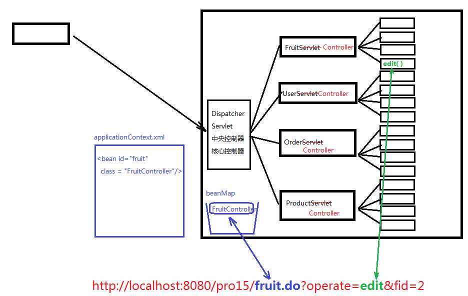

### XML
applicationContext.xml
```xml
<?xml version="1.0" encoding="utf-8"?>

<beans>
    <!-- 这个bean标签的作用是 将来servletpath中涉及的名字对应的是fruit，那么就要FruitController这个类来处理 -->
    <bean id="fruit" class="com.atguigu.fruit.controllers.FruitController"/>
</beans>

<!--
1. 概念
HTML : 超文本标记语言
XML : 可扩展的标记语言
HTML是XML的一个子集

2. XML包含三个部分：
1) XML声明，而且声明这一行代码必须在XML文件的第一行
2) DTD 文档类型定义
3) XML正文
-->
```

### JAVA
```java
@WebServlet("*.do")
public class DispatcherServlet extends HttpServlet {
    private Map<String, Object> beanMap = new HashMap<>();

    public void init() {
        try {
            InputStream inputStream = getClass().getClassLoader().getResourceAsStream("applicationContext.xml");
            // 1.创建DocumentBuilderFactory
            DocumentBuilderFactory documentBuilderFactory = DocumentBuilderFactory.newInstance();
            // 2.创建DocumentBuilder对象
            DocumentBuilder documentBuilder = documentBuilderFactory.newDocumentBuilder();
            // 3.创建Document对象
            Document document = documentBuilder.parse(inputStream);
            // 4.获取所有的bean节点
            NodeList beanNodeList = document.getElementsByTagName("bean");
            for (int i = 0; i < beanNodeList.getLength(); i++) {
                Node beanNode = beanNodeList.item(i);
                if (beanNode.getNodeType() == Node.ELEMENT_NODE) {
                    Element beanElement = (Element) beanNode;
                    String beanId = beanElement.getAttribute("id");
                    String className = beanElement.getAttribute("class");
                    Class controllerBeanClass = Class.forName(className);
                    Object beanObj = controllerBeanClass.newInstance();
                    Method setServletContextMethod = controllerBeanClass.getDeclaredMethod("setServletContext",
                            ServletContext.class);
                    setServletContextMethod.invoke(beanObj, this.getServletContext());
                    beanMap.put(beanId, beanObj);
                }
            }
        } catch (ParserConfigurationException e) {
            e.printStackTrace();
        } catch (SAXException e) {
            e.printStackTrace();
        } catch (IOException e) {
            e.printStackTrace();
        } catch (IllegalAccessException e) {
            e.printStackTrace();
        } catch (InstantiationException e) {
            e.printStackTrace();
        } catch (ClassNotFoundException e) {
            e.printStackTrace();
        } catch (NoSuchMethodException e) {
            e.printStackTrace();
        } catch (InvocationTargetException e) {
            e.printStackTrace();
        }
    }

    @Override
    protected void service(HttpServletRequest request, HttpServletResponse response)
            throws ServletException, IOException {
        // 设置编码
        request.setCharacterEncoding("UTF-8");
        // 假设url是： http://localhost:8080/pro15/hello.do
        // 那么servletPath是： /hello.do
        // 我的思路是：
        // 第1步： /hello.do -> hello 或者 /fruit.do -> fruit
        // 第2步： hello -> HelloController 或者 fruit -> FruitController
        String servletPath = request.getServletPath();
        servletPath = servletPath.substring(1);
        int lastDotIndex = servletPath.lastIndexOf(".do");
        servletPath = servletPath.substring(0, lastDotIndex);
        Object controllerBeanObj = beanMap.get(servletPath);
        String operate = request.getParameter("operate");
        if (StringUtil.isEmpty(operate)) {
            operate = "index";
        }
        try {
            Method method = controllerBeanObj.getClass().getDeclaredMethod(operate, HttpServletRequest.class,
                    HttpServletResponse.class);
            if (method != null) {
                method.setAccessible(true);
                method.invoke(controllerBeanObj, request, response);
            } else {
                throw new RuntimeException("operate值非法!");
            }
        } catch (NoSuchMethodException e) {
            e.printStackTrace();
        } catch (IllegalAccessException e) {
            e.printStackTrace();
        } catch (InvocationTargetException e) {
            e.printStackTrace();
        }
    }
}
```

```java
public class ViewBaseServlet extends HttpServlet {
    private TemplateEngine templateEngine;
    private ServletContext servletContext ;
    public void init(ServletContext servletContext) throws ServletException {
        this.servletContext = servletContext ;
        // 1.获取ServletContext对象
        //ServletContext servletContext = this.getServletContext();
        // 2.创建Thymeleaf解析器对象
        ServletContextTemplateResolver templateResolver = new ServletContextTemplateResolver(servletContext);
        // 3.给解析器对象设置参数
        // ①HTML是默认模式，明确设置是为了代码更容易理解
        templateResolver.setTemplateMode(TemplateMode.HTML);
        // ②设置前缀
        String viewPrefix = servletContext.getInitParameter("view-prefix");
        templateResolver.setPrefix(viewPrefix);
        // ③设置后缀
        String viewSuffix = servletContext.getInitParameter("view-suffix");
        templateResolver.setSuffix(viewSuffix);
        // ④设置缓存过期时间（毫秒）
        templateResolver.setCacheTTLMs(60000L);
        // ⑤设置是否缓存
        templateResolver.setCacheable(true);
        // ⑥设置服务器端编码方式
        templateResolver.setCharacterEncoding("utf-8");
        // 4.创建模板引擎对象
        templateEngine = new TemplateEngine();
        // 5.给模板引擎对象设置模板解析器
        templateEngine.setTemplateResolver(templateResolver);
    }

    protected void processTemplate(String templateName, HttpServletRequest req, HttpServletResponse resp) throws IOException {
        // 1.设置响应体内容类型和字符集
        resp.setContentType("text/html;charset=UTF-8");
        // 2.创建WebContext对象
        WebContext webContext = new WebContext(req, resp, this.servletContext);
        // 3.处理模板数据
        templateEngine.process(templateName, webContext, resp.getWriter());
    }
}
```

```java
public class FruitController extends ViewBaseServlet {
    //之前FruitServlet是一个Sevlet组件，那么其中的init方法一定会被调用
    //之前的init方法内部会出现一句话：super.init();
    public void setServletContext(ServletContext servletContext) throws ServletException {
        super.init(servletContext);
    }
    // ...
}
```


## 提取视图资源处理通用代码、在核心控制器中统一获取参数以及视图处理
```java
public class ViewBaseServlet extends HttpServlet {
    private TemplateEngine templateEngine;
    @Override
    public void init() throws ServletException {
        // 1.获取ServletContext对象
        ServletContext servletContext = this.getServletContext();
        // 2.创建Thymeleaf解析器对象
        ServletContextTemplateResolver templateResolver = new ServletContextTemplateResolver(servletContext);
        // 3.给解析器对象设置参数
        // ①HTML是默认模式，明确设置是为了代码更容易理解
        templateResolver.setTemplateMode(TemplateMode.HTML);
        // ②设置前缀
        String viewPrefix = servletContext.getInitParameter("view-prefix");
        templateResolver.setPrefix(viewPrefix);
        // ③设置后缀
        String viewSuffix = servletContext.getInitParameter("view-suffix");
        templateResolver.setSuffix(viewSuffix);
        // ④设置缓存过期时间（毫秒）
        templateResolver.setCacheTTLMs(60000L);
        // ⑤设置是否缓存
        templateResolver.setCacheable(true);
        // ⑥设置服务器端编码方式
        templateResolver.setCharacterEncoding("utf-8");
        // 4.创建模板引擎对象
        templateEngine = new TemplateEngine();
        // 5.给模板引擎对象设置模板解析器
        templateEngine.setTemplateResolver(templateResolver);
    }

    protected void processTemplate(String templateName, HttpServletRequest req, HttpServletResponse resp)
            throws IOException {
        // 1.设置响应体内容类型和字符集
        resp.setContentType("text/html;charset=UTF-8");
        // 2.创建WebContext对象
        WebContext webContext = new WebContext(req, resp, getServletContext());
        // 3.处理模板数据
        templateEngine.process(templateName, webContext, resp.getWriter());
    }
}
```

```java
@WebServlet("*.do")
public class DispatcherServlet extends ViewBaseServlet {
    private Map<String, Object> beanMap = new HashMap<>();

    public void init() throws ServletException {
        super.init();
        try {
            InputStream inputStream = getClass().getClassLoader().getResourceAsStream("applicationContext.xml");
            // 1.创建DocumentBuilderFactory
            DocumentBuilderFactory documentBuilderFactory = DocumentBuilderFactory.newInstance();
            // 2.创建DocumentBuilder对象
            DocumentBuilder documentBuilder = documentBuilderFactory.newDocumentBuilder();
            // 3.创建Document对象
            Document document = documentBuilder.parse(inputStream);
            // 4.获取所有的bean节点
            NodeList beanNodeList = document.getElementsByTagName("bean");
            for (int i = 0; i < beanNodeList.getLength(); i++) {
                Node beanNode = beanNodeList.item(i);
                if (beanNode.getNodeType() == Node.ELEMENT_NODE) {
                    Element beanElement = (Element) beanNode;
                    String beanId = beanElement.getAttribute("id");
                    String className = beanElement.getAttribute("class");
                    Class controllerBeanClass = Class.forName(className);
                    Object beanObj = controllerBeanClass.newInstance();
                    beanMap.put(beanId, beanObj);
                }
            }
        } catch (ParserConfigurationException e) {
            e.printStackTrace();
        } catch (SAXException e) {
            e.printStackTrace();
        } catch (IOException e) {
            e.printStackTrace();
        } catch (IllegalAccessException e) {
            e.printStackTrace();
        } catch (InstantiationException e) {
            e.printStackTrace();
        } catch (ClassNotFoundException e) {
            e.printStackTrace();
        }
    }

    @Override
    protected void service(HttpServletRequest request, HttpServletResponse response)
            throws ServletException, IOException {
        // 设置编码
        request.setCharacterEncoding("UTF-8");
        // 假设url是： http://localhost:8080/pro15/hello.do
        // 那么servletPath是： /hello.do
        // 我的思路是：
        // 第1步： /hello.do -> hello 或者 /fruit.do -> fruit
        // 第2步： hello -> HelloController 或者 fruit -> FruitController
        String servletPath = request.getServletPath();
        servletPath = servletPath.substring(1);
        int lastDotIndex = servletPath.lastIndexOf(".do");
        servletPath = servletPath.substring(0, lastDotIndex);
        Object controllerBeanObj = beanMap.get(servletPath);
        String operate = request.getParameter("operate");
        if (StringUtil.isEmpty(operate)) {
            operate = "index";
        }
        try {
            Method[] methods = controllerBeanObj.getClass().getDeclaredMethods();
            for (Method method : methods) {
                if (operate.equals(method.getName())) {
                    // 1.统一获取请求参数
                    // 1-1.获取当前方法的参数，返回参数数组
                    Parameter[] parameters = method.getParameters();
                    // 1-2.parameterValues 用来承载参数的值
                    Object[] parameterValues = new Object[parameters.length];
                    for (int i = 0; i < parameters.length; i++) {
                        Parameter parameter = parameters[i];
                        String parameterName = parameter.getName();
                        // 如果参数名是request,response,session 那么就不是通过请求中获取参数的方式了
                        if ("request".equals(parameterName)) {
                            parameterValues[i] = request;
                        } else if ("response".equals(parameterName)) {
                            parameterValues[i] = response;
                        } else if ("session".equals(parameterName)) {
                            parameterValues[i] = request.getSession();
                        } else {
                            // 从请求中获取参数值
                            String parameterValue = request.getParameter(parameterName);
                            String typeName = parameter.getType().getName();
                            Object parameterObj = parameterValue;
                            // 常见错误： IllegalArgumentException: argument type mismatch
                            if (parameterObj != null) {
                                if ("java.lang.Integer".equals(typeName)) {
                                    parameterObj = Integer.parseInt(parameterValue);
                                }
                            }
                            parameterValues[i] = parameterObj;
                        }
                    }
                    // 2.controller组件中的方法调用
                    method.setAccessible(true);
                    Object returnObj = method.invoke(controllerBeanObj, parameterValues);
                    // 3.视图处理
                    String methodReturnStr = (String) returnObj;
                    if (methodReturnStr.startsWith("redirect:")) { // 比如： redirect:fruit.do
                        String redirectStr = methodReturnStr.substring("redirect:".length());
                        response.sendRedirect(redirectStr);
                    } else {
                        super.processTemplate(methodReturnStr, request, response); // 比如： "edit"
                    }
                }
            }
            /*
             * }else{
             * throw new RuntimeException("operate值非法!");
             * }
             */
        } catch (IllegalAccessException e) {
            e.printStackTrace();
        } catch (InvocationTargetException e) {
            e.printStackTrace();
        }
    }
}
```

```java
public class FruitController {
    private FruitDAO fruitDAO = new FruitDAOImpl();
    private String update(Integer fid, String fname, Integer price, Integer fcount, String remark) {
        // 3.执行更新
        fruitDAO.updateFruit(new Fruit(fid, fname, price, fcount, remark));
        // 4.资源跳转
        return "redirect:fruit.do";
    }

    private String edit(Integer fid, HttpServletRequest request) {
        if (fid != null) {
            Fruit fruit = fruitDAO.getFruitByFid(fid);
            request.setAttribute("fruit", fruit);
            // super.processTemplate("edit",request,response);
            return "edit";
        }
        return "error";
    }

    private String del(Integer fid) {
        if (fid != null) {
            fruitDAO.delFruit(fid);
            return "redirect:fruit.do";
        }
        return "error";
    }

    private String add(String fname, Integer price, Integer fcount, String remark) {
        Fruit fruit = new Fruit(0, fname, price, fcount, remark);
        fruitDAO.addFruit(fruit);
        return "redirect:fruit.do";
    }

    private String index(String oper, String keyword, Integer pageNo, HttpServletRequest request) {
        HttpSession session = request.getSession();
        if (pageNo == null) {
            pageNo = 1;
        }
        if (StringUtil.isNotEmpty(oper) && "search".equals(oper)) {
            pageNo = 1;
            if (StringUtil.isEmpty(keyword)) {
                keyword = "";
            }
            session.setAttribute("keyword", keyword);
        } else {
            Object keywordObj = session.getAttribute("keyword");
            if (keywordObj != null) {
                keyword = (String) keywordObj;
            } else {
                keyword = "";
            }
        }
        // 重新更新当前页的值
        session.setAttribute("pageNo", pageNo);
        FruitDAO fruitDAO = new FruitDAOImpl();
        List<Fruit> fruitList = fruitDAO.getFruitList(keyword, pageNo);
        session.setAttribute("fruitList", fruitList);
        // 总记录条数
        int fruitCount = fruitDAO.getFruitCount(keyword);
        // 总页数
        int pageCount = (fruitCount + 5 - 1) / 5;
        session.setAttribute("pageCount", pageCount);
        return "index";
    }
}
```


## MVC-review1
1. 最初的做法：一个请求对应一个Servlet
   1. 存在问题：Servlet太多了
2. 把一系列的请求都对应一个Servlet
   1. IndexServlet、AddServlet、EditServlet、DelServlet、UpdateServlet -> 合并成FruitServlet
   2. 通过一个operate的值来决定调用FruitServlet中的哪一个方法：使用的是switch-case
   3. 存在问题：Servlet中充斥着大量的switch-case，随着项目的业务规模扩大，那么会有很多的Servlet，也就意味着会有很多的switch-case，这是一种代码冗余
3. 在Servlet中使用了反射技术
   1. 规定operate的值和方法名一致
   2. 接收到operate的值是什么就表明需要调用对应的方法进行响应，如果找不到对应的方法，则抛异常
   3. 存在问题：每一个Servlet中都有类似的反射技术的代码。
4. 继续抽取，设计中央控制器类：DispatcherServlet（DispatcherServlet这个类的工作分为两大部分）
   1. 根据url定位到能够处理这个请求的Controller组件：
      1. 从url中提取servletPath：/fruit.do -> fruit
      2. 根据fruit找到对应的组件：FruitController，这个对应的依据我们存储在applicationContext.xml中
            ```xml
            <bean id="fruit" class="com.atguigu.fruit.controllers.FruitController "></bean>
            ```
      3. 通过DOM技术我们去解析XML文件，在中央控制器中形成一个beanMap容器，用来存放所有的Controller组件
      4. 根据获取到的operate的值定位到我们FruitController中需要调用的方法
   2. 调用Controller组件中的方法：
      1. 获取参数
         1. 获取即将要调用的方法的参数签名信息: Parameter[] parameters = method.getParameters();
         2. 通过parameter.getName()获取参数的名称；
         3. 使用Object[] parameterValues这个数组用来存放对应参数的参数值
         4. 另外，我们需要考虑参数的类型问题，需要做类型转化的工作。通过parameter.getType()获取参数的类型
      2. 执行方法
            ```java
            Object returnObj = method.invoke(controllerBean, parameterValues);
            ```
      3. 视图处理
            ```java
            String returnStr = (String)returnObj;
            if(returnStr.startWith("redirect:")){
                ...
            }else if...
            ```


## servlet-api
Servlet生命周期：实例化、初始化、服务、销毁

Servlet中的初始化方法有两个：
```java
@Override
public void init(ServletConfig config) throws ServletException {
    this.config = config;
    this.init();
}
public void init() throws ServletException {
    // NOOP by default
}
```
可以重写init()方法在Servlet初始化时做一些准备工作

### ServletConfig初始化参数值的配置与获取
通过web.xml进行配置
```xml
<servlet>
    <servlet-name>Demo01Servlet</servlet-name>
    <servlet-class>com.atguigu.servlet.Demo01Servlet</servlet-class>
    <init-param>
        <param-name>hello</param-name>
        <param-value>world</param-value>
    </init-param>
    <init-param>
        <param-name>uname</param-name>
        <param-value>jim</param-value>
    </init-param>
</servlet>
<servlet-mapping>
    <servlet-name>Demo01Servlet</servlet-name>
    <url-pattern>/demo01</url-pattern>
</servlet-mapping>
```

通过注解进行配置
```java
@WebServlet(urlPatterns = { "/demo01" }, initParams = {
        @WebInitParam(name = "hello", value = "world"),
        @WebInitParam(name = "uname", value = "jim")
})
```

获取
```java
ServletConfig config = getServletConfig();
String initValue = config.getInitParameter("hello");
```

### ServletContext初始化参数值的配置与获取
通过web.xml进行配置
```xml
<context-param>
    <param-name>contextConfigLocation</param-name>
    <param-value>classpath:applicationContext.xml</param-value>
</context-param>
```

获取
```java
ServletContext servletContext = getServletContext();
String contextConfigLocation = servletContext.getInitParameter("contextConfigLocation");
```


## service引入
1. Model1和Model2
   1. Model1：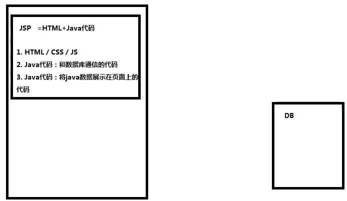
   2. MVC：Model（模型）、View（视图）、Controller（控制器）
      - 视图层：用于做数据展示以及和用户交互的一个界面
      - 控制层：能够接受客户端的请求，具体的业务功能还是需要借助于模型组件来完成
      - 模型层：模型分为很多种：有比较简单的pojo/vo(value object)，有业务模型组件，有数据访问层组件
        - 值对象模型（POJO）
        - 数据访问模型（DAO）
        - 业务逻辑模型（BO）
        - 数据传输对象（DTO）
2. 区分业务对象和数据访问对象：
   1. DAO中的方法都是单精度方法或者称之为细粒度方法。什么叫单精度？一个方法只考虑一个操作，比如添加，那就是insert操作、查询那就是select操作...
   2. BO中的方法属于业务方法，也实际的业务是比较复杂的，因此业务方法的粒度是比较粗的
      eg. 注册这个功能属于业务功能，也就是说注册这个方法属于业务方法。那么这个业务方法中包含了多个DAO方法。也就是说注册这个业务功能需要通过多个DAO方法的组合调用，从而完成注册功能的开发。
      1. 检查用户名是否已经被注册 - DAO中的select操作
      2. 向用户表新增一条新用户记录 - DAO中的insert操作
      3. 向用户积分表新增一条记录（新用户默认初始化积分100分） - DAO中的insert操作
      4. 向系统消息表新增一条记录（某某某新用户注册了，需要根据通讯录信息向他的联系人推送消息） - DAO中的insert操作
      5. 向系统日志表新增一条记录（某用户在某IP在某年某月某日某时某分某秒某毫秒注册） - DAO中的insert操作


```java
public interface FruitService {
    //获取指定页面的库存列表信息
    List<Fruit> getFruitList(String keyword , Integer pageNo);
    //添加库存记录信息
    void addFruit(Fruit fruit);
    //根据id查看指定库存记录
    Fruit getFruitByFid(Integer fid);
    //删除特定库存记录
    void delFruit(Integer fid);
    //获取总页数
    Integer getPageCount(String keyword);
    //修改特定库存记录
    void updateFruit(Fruit fruit);
}
```

```java
public class FruitServiceImpl implements FruitService {
    private FruitDAO fruitDAO = new FruitDAOImpl();
    @Override
    public List<Fruit> getFruitList(String keyword, Integer pageNo) {
        return fruitDAO.getFruitList(keyword, pageNo);
    }
    @Override
    public void addFruit(Fruit fruit) {
        fruitDAO.addFruit(fruit);
    }
    @Override
    public Fruit getFruitByFid(Integer fid) {
        return fruitDAO.getFruitByFid(fid);
    }
    @Override
    public void delFruit(Integer fid) {
        fruitDAO.delFruit(fid);
    }
    @Override
    public Integer getPageCount(String keyword) {
        int count = fruitDAO.getFruitCount(keyword);
        int pageCount = (count + 5 - 1) / 5;
        return pageCount;
    }
    @Override
    public void updateFruit(Fruit fruit) {
        fruitDAO.updateFruit(fruit);
    }
}
```

```java
public class FruitController {
    private FruitService fruitService = new FruitServiceImpl();
    private String update(Integer fid, String fname, Integer price, Integer fcount, String remark) {
        fruitService.updateFruit(new Fruit(fid, fname, price, fcount, remark));
        return "redirect:fruit.do";
    }
    private String edit(Integer fid, HttpServletRequest request) {
        if (fid != null) {
            Fruit fruit = fruitService.getFruitByFid(fid);
            request.setAttribute("fruit", fruit);
            return "edit";
        }
        return "error";
    }
    private String del(Integer fid) {
        if (fid != null) {
            fruitService.delFruit(fid);
            return "redirect:fruit.do";
        }
        return "error";
    }
    private String add(String fname, Integer price, Integer fcount, String remark) {
        Fruit fruit = new Fruit(0, fname, price, fcount, remark);
        fruitService.addFruit(fruit);
        return "redirect:fruit.do";
    }
    private String index(String oper, String keyword, Integer pageNo, HttpServletRequest request) {
        HttpSession session = request.getSession();
        if (pageNo == null) {
            pageNo = 1;
        }
        if (StringUtil.isNotEmpty(oper) && "search".equals(oper)) {
            pageNo = 1;
            if (StringUtil.isEmpty(keyword)) {
                keyword = "";
            }
            session.setAttribute("keyword", keyword);
        } else {
            Object keywordObj = session.getAttribute("keyword");
            if (keywordObj != null) {
                keyword = (String) keywordObj;
            } else {
                keyword = "";
            }
        }
        session.setAttribute("pageNo", pageNo);
        List<Fruit> fruitList = fruitService.getFruitList(keyword, pageNo);
        session.setAttribute("fruitList", fruitList);
        int pageCount = fruitService.getPageCount(keyword);
        session.setAttribute("pageCount", pageCount);
        return "index";
    }
}
```


## ioc实现
1. 耦合/依赖
   - 依赖指的是某某某离不开某某某
   - 在软件系统中，层与层之间是存在依赖的。我们也称之为耦合。
   - 我们系统架构或者是设计的一个原则是： 高内聚低耦合。
   - 层内部的组成应该是高度聚合的，而层与层之间的关系应该是低耦合的，最理想的情况0耦合（就是没有耦合）
2. IOC - 控制反转 / DI - 依赖注入

applicationContext.xml
```xml
<beans>
    <bean id="fruitDAO" class="com.atguigu.fruit.dao.impl.FruitDAOImpl"/>
    <bean id="fruitService" class="com.atguigu.fruit.service.impl.FruitServiceImpl">
        <!-- property标签用来表示属性；name表示属性名；ref表示引用其他bean的id值-->
        <property name="fruitDAO" ref="fruitDAO"/>
    </bean>
    <bean id="fruit" class="com.atguigu.fruit.controllers.FruitController">
        <property name="fruitService" ref="fruitService"/>
    </bean>
</beans>
<!--
Node 节点
    Element 元素节点
    Text 文本节点
<sname>jim</sname>
-->
```

```java
public class FruitServiceImpl implements FruitService {
    private FruitDAO fruitDAO = null;
    // ...
}

public class FruitController {
    private FruitService fruitService = new FruitServiceImpl();
    // ...
}
```

```java
public interface BeanFactory {
    Object getBean(String id);
}


public class ClassPathXmlApplicationContext implements BeanFactory {
    private Map<String, Object> beanMap = new HashMap<>();
    public ClassPathXmlApplicationContext() {
        try {
            InputStream inputStream = getClass().getClassLoader().getResourceAsStream("applicationContext.xml");
            // 1.创建DocumentBuilderFactory
            DocumentBuilderFactory documentBuilderFactory = DocumentBuilderFactory.newInstance();
            // 2.创建DocumentBuilder对象
            DocumentBuilder documentBuilder = documentBuilderFactory.newDocumentBuilder();
            // 3.创建Document对象
            Document document = documentBuilder.parse(inputStream);
            // 4.获取所有的bean节点
            NodeList beanNodeList = document.getElementsByTagName("bean");
            for (int i = 0; i < beanNodeList.getLength(); i++) {
                Node beanNode = beanNodeList.item(i);
                if (beanNode.getNodeType() == Node.ELEMENT_NODE) {
                    Element beanElement = (Element) beanNode;
                    String beanId = beanElement.getAttribute("id");
                    String className = beanElement.getAttribute("class");
                    Class beanClass = Class.forName(className);
                    // 创建bean实例
                    Object beanObj = beanClass.newInstance();
                    // 将bean实例对象保存到map容器中
                    beanMap.put(beanId, beanObj);
                    // 到目前为止，此处需要注意的是，bean和bean之间的依赖关系还没有设置
                }
            }
            // 5.组装bean之间的依赖关系
            for (int i = 0; i < beanNodeList.getLength(); i++) {
                Node beanNode = beanNodeList.item(i);
                if (beanNode.getNodeType() == Node.ELEMENT_NODE) {
                    Element beanElement = (Element) beanNode;
                    String beanId = beanElement.getAttribute("id");
                    NodeList beanChildNodeList = beanElement.getChildNodes();
                    for (int j = 0; j < beanChildNodeList.getLength(); j++) {
                        Node beanChildNode = beanChildNodeList.item(j);
                        if (beanChildNode.getNodeType() == Node.ELEMENT_NODE
                                && "property".equals(beanChildNode.getNodeName())) {
                            Element propertyElement = (Element) beanChildNode;
                            String propertyName = propertyElement.getAttribute("name");
                            String propertyRef = propertyElement.getAttribute("ref");
                            // 1) 找到propertyRef对应的实例
                            Object refObj = beanMap.get(propertyRef);
                            // 2) 将refObj设置到当前bean对应的实例的property属性上去
                            Object beanObj = beanMap.get(beanId);
                            Class beanClazz = beanObj.getClass();
                            Field propertyField = beanClazz.getDeclaredField(propertyName);
                            propertyField.setAccessible(true);
                            propertyField.set(beanObj, refObj);
                        }
                    }
                }
            }
        } catch (ParserConfigurationException e) {
            e.printStackTrace();
        } catch (SAXException e) {
            e.printStackTrace();
        } catch (IOException e) {
            e.printStackTrace();
        } catch (IllegalAccessException e) {
            e.printStackTrace();
        } catch (InstantiationException e) {
            e.printStackTrace();
        } catch (ClassNotFoundException e) {
            e.printStackTrace();
        } catch (NoSuchFieldException e) {
            e.printStackTrace();
        }
    }

    @Override
    public Object getBean(String id) {
        return beanMap.get(id);
    }
}
```

```java
@WebServlet("*.do")
public class DispatcherServlet extends ViewBaseServlet {
    private BeanFactory beanFactory;
    public void init() throws ServletException {
        super.init();
        beanFactory = new ClassPathXmlApplicationContext();
    }
    @Override
    protected void service(HttpServletRequest request, HttpServletResponse response)
            throws ServletException, IOException {
        request.setCharacterEncoding("UTF-8");
        String servletPath = request.getServletPath();
        servletPath = servletPath.substring(1);
        int lastDotIndex = servletPath.lastIndexOf(".do");
        servletPath = servletPath.substring(0, lastDotIndex);
        Object controllerBeanObj = beanFactory.getBean(servletPath);
        String operate = request.getParameter("operate");
        if (StringUtil.isEmpty(operate)) {
            operate = "index";
        }
        try {
            Method[] methods = controllerBeanObj.getClass().getDeclaredMethods();
            for (Method method : methods) {
                if (operate.equals(method.getName())) {
                    // 1.统一获取请求参数
                    // 1-1.获取当前方法的参数，返回参数数组
                    Parameter[] parameters = method.getParameters();
                    // 1-2.parameterValues 用来承载参数的值
                    Object[] parameterValues = new Object[parameters.length];
                    for (int i = 0; i < parameters.length; i++) {
                        Parameter parameter = parameters[i];
                        String parameterName = parameter.getName();
                        // 如果参数名是request,response,session 那么就不是通过请求中获取参数的方式了
                        if ("request".equals(parameterName)) {
                            parameterValues[i] = request;
                        } else if ("response".equals(parameterName)) {
                            parameterValues[i] = response;
                        } else if ("session".equals(parameterName)) {
                            parameterValues[i] = request.getSession();
                        } else {
                            // 从请求中获取参数值
                            String parameterValue = request.getParameter(parameterName);
                            String typeName = parameter.getType().getName();
                            Object parameterObj = parameterValue;
                            if (parameterObj != null) {
                                if ("java.lang.Integer".equals(typeName)) {
                                    parameterObj = Integer.parseInt(parameterValue);
                                }
                            }
                            parameterValues[i] = parameterObj;
                        }
                    }
                    // 2.controller组件中的方法调用
                    method.setAccessible(true);
                    Object returnObj = method.invoke(controllerBeanObj, parameterValues);
                    // 3.视图处理
                    String methodReturnStr = (String) returnObj;
                    if (methodReturnStr.startsWith("redirect:")) { // 比如： redirect:fruit.do
                        String redirectStr = methodReturnStr.substring("redirect:".length());
                        response.sendRedirect(redirectStr);
                    } else {
                        super.processTemplate(methodReturnStr, request, response); // 比如： "edit"
                    }
                }
            }
        } catch (IllegalAccessException e) {
            e.printStackTrace();
        } catch (InvocationTargetException e) {
            e.printStackTrace();
        }
    }
}
```


## MVC-review2
1. Servlet生命周期中的初始化方法：init(), init(config)
    ```java
    public void init(ServletConfig config) throws ServletException {
        this.config = config ;
        init();
    }
    ```
   - 可以重写无参的init方法，在初始化时执行一些自定义的操作
   - 通过getConfig()获取ServletConfig对象
   - 通过config.getInitParameter()获取初始化参数
2. 通过ServletContext获取配置的上下文参数
3. MVC： V：view 视图；C：Controller 控制器；M：Model 模型
4. IOC - 控制反转
   1. 之前在Servlet中，我们创建service对象，FruitService fruitService = new FruitServiceImpl();
   2. 这句话如果出现在servlet中的某个方法内部，那么这个fruitService的作用域（生命周期）应该就是这个方法级别；
   3. 如果这句话出现在servlet的类中，也就是说fruitService是一个成员变量，那么这个fruitService的作用域（生命周期）应该就是这个servlet实例级别
   4. 之后我们在applicationContext.xml中定义了这个fruitService。然后通过解析XML，产生fruitService实例，存放在beanMap中，这个beanMap在一个BeanFactory中
   5. 因此，我们转移（改变）了之前的service实例、dao实例等等他们的生命周期。控制权从程序员转移到BeanFactory。这个现象我们称之为控制反转
5. DI - 依赖注入
   1. 之前我们在控制层出现代码：FruitService fruitService = new FruitServiceImpl()；那么，控制层和service层存在耦合。
   2. 之后，我们将代码修改成FruitService fruitService = null; 然后，在配置文件中配置：
        ```xml
        <bean id="fruit" class="FruitController">
            <property name="fruitService" ref="fruitService"/>
        </bean>
        ```


## 过滤器Filter

### 过滤器简介
1. 通过类比了解过滤器作用
   1. 坐地铁 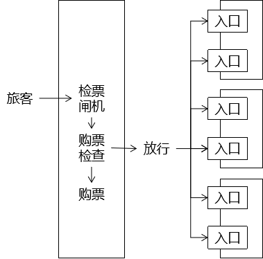
   2. 登录检查 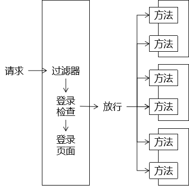
2. 过滤器的三要素
   1. 拦截：过滤器之所以能够对请求进行预处理，关键是对请求进行拦截，把请求拦截下来才能够做后续的操作。而且对于一个具体的过滤器，它必须明确它要拦截的请求，而不是所有请求都拦截。
   2. 过滤：根据业务功能实际的需求，看看在把请求拦截到之后，需要做什么检查或什么操作，写对应的代码即可。
   3. 放行：过滤器完成自己的任务或者是检测到当前请求符合过滤规则，那么可以将请求放行。所谓放行，就是让请求继续去访问它原本要访问的资源。
    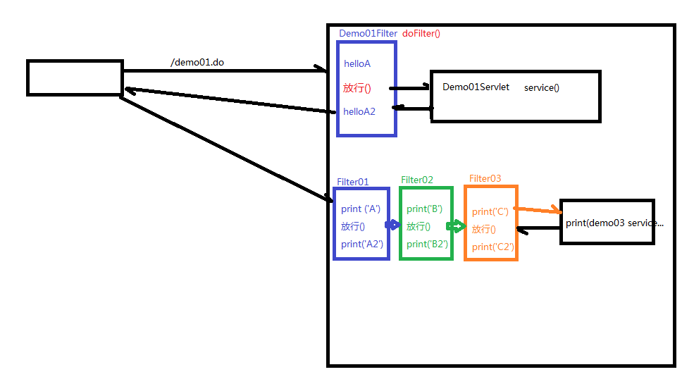
    
> 友情提示：将来学习SpringMVC时，会学习SpringMVC中的『拦截器』，同样具备三要素。

### HelloWorld
1. 思路 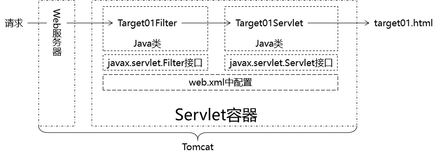
2. 操作步骤
   1. 准备工作
      - 创建module
      - 加入Thymeleaf环境
      - 完成首页访问功能
      - 创建Target01Servlet以及target01.html
      - 创建SpecialServlet以及special.html
   2. 创建Filter
      1. 创建Target01Filter类
         - 实现javax.servlet.Filter接口
         - 在doFilter()方法中执行过滤
         - 如果满足过滤条件使用 chain.doFilter(request, response);放行
         - 如果不满足过滤条件转发或重定向请求
         - 附带问题：Thymeleaf模板渲染。这里我们选择的解决办法是跳转到一个Servlet，由Servlet负责执行模板渲染返回页面。
         ```java
         public class Target01Filter implements Filter {
            @Override
            public void init(FilterConfig filterConfig) throws ServletException {}
            @Override
            public void doFilter(ServletRequest request, ServletResponse response, FilterChain chain) throws IOException, ServletException {
                // 1.打印一句话表明Filter执行了
                System.out.println("过滤器执行：Target01Filter");
                // 2.检查是否满足过滤条件
                // 人为设定一个过滤条件：请求参数message是否等于monster
                // 等于：放行
                // 不等于：将请求跳转到另外一个页面
                // ①获取请求参数
                String message = request.getParameter("message");
                // ②检查请求参数是否等于monster
                if ("monster".equals(message)) {
                    // ③执行放行
                    // FilterChain对象代表过滤器链
                    // chain.doFilter(request, response)方法效果：将请求放行到下一个Filter，
                    // 如果当前Filter已经是最后一个Filter了，那么就将请求放行到原本要访问的目标资源
                    chain.doFilter(request, response);
                }else{
                    // ④跳转页面
                    request.getRequestDispatcher("/SpecialServlet?method=toSpecialPage").forward(request, response);
                }
            }
            @Override
            public void destroy() {}
         }
         ```
      2. 配置Target01Filter类。这一步也可以叫『注册』。
        ```xml
        <!-- 配置Target01Filter -->
        <filter>
            <!-- 配置Filter的友好名称 -->
            <filter-name>Target01Filter</filter-name>
            <!-- 配置Filter的全类名，便于Servlet容器创建Filter对象 -->
            <filter-class>com.atguigu.filter.filter.Target01Filter</filter-class>
        </filter>

        <!-- 配置Filter要拦截的目标资源 -->
        <filter-mapping>
            <!-- 指定这个mapping对应的Filter名称 -->
            <filter-name>Target01Filter</filter-name>
            <!-- 通过请求地址模式来设置要拦截的资源 -->
            <url-pattern>/Target01Servlet</url-pattern>
        </filter-mapping>
        ```

        也可以使用注解进行配置
        ```java
        @WebFilter('/Target01Servlet')
        public class Target01Filter implements Filter {
        ```

### 过滤器生命周期
和Servlet生命周期类比，Filter生命周期的关键区别是：在Web应用启动时创建对象
| 生命周期阶段 | 执行时机         | 执行次数 |
| ------------ | ---------------- | -------- |
| 创建对象     | Web应用启动时    | 一次     |
| 初始化       | 创建对象后       | 一次     |
| 拦截请求     | 接收到匹配的请求 | 多次     |
| 销毁         | Web应用卸载前    | 一次     |

### 过滤器匹配规则
1. 精确匹配：指定被拦截资源的完整路径
    ```xml
    <!-- 配置Filter要拦截的目标资源 -->
    <filter-mapping>
        <!-- 指定这个mapping对应的Filter名称 -->
        <filter-name>Target01Filter</filter-name>
        <!-- 通过请求地址模式来设置要拦截的资源 -->
        <url-pattern>/Target01Servlet</url-pattern>
    </filter-mapping>
    ```
2. 模糊匹配：相比较精确匹配，使用模糊匹配可以让我们创建一个Filter就能够覆盖很多目标资源，不必专门为每一个目标资源都创建Filter，提高开发效率。
   1. 前杠后星：在我们配置了url-pattern为/user/*之后，请求地址只要是/user/开头的那么就会被匹配。
    ```xml
    <filter-mapping>
        <filter-name>Target02Filter</filter-name>
        <!-- 模糊匹配：前杠后星 -->
        <!-- /user/Target02Servlet
             /user/Target03Servlet
             /user/Target04Servlet -->
        <url-pattern>/user/*</url-pattern>
    </filter-mapping>
    ```
    极端情况：/*匹配所有请求
   2. 前星后缀：下面我们使用png图片来测试后缀拦截的效果，并不是只能拦截png扩展名。
    ```xml
    <filter-mapping>
        <filter-name>Target04Filter</filter-name>
        <url-pattern>*.png</url-pattern>
    </filter-mapping>
    ```
   3. 前杠后缀，星号在中间
    ```xml
    <url-pattern>/*.png</url-pattern>
    ```
    按照这个配置启动Web应用时会抛出异常：`java.lang.IllegalArgumentException: Invalid /*.png in filter mapping`
    结论：这么配是不允许的！
3. 匹配Servlet名称
    ```xml
    <filter-mapping>
        <filter-name>Target05Filter</filter-name>
        <!-- 根据Servlet名称匹配 -->
        <servlet-name>Target01Servlet</servlet-name>
    </filter-mapping>
    ```

### 过滤器链
- 多个Filter的拦截范围如果存在重合部分，那么这些Filter会形成Filter链。
- 浏览器请求重合部分对应的目标资源时，会依次经过Filter链中的每一个Filter。
- Filter链中每一个Filter执行的顺序是由web.xml中filter-mapping配置的顺序决定的。


执行顺序
- 如果采取的是注解的方式进行配置，那么过滤器链的拦截顺序是按照全类名的先后顺序排序的
- 如果采取的是xml的方式进行配置，那么按照配置的先后顺序进行排序

### 过滤器在水果库存管理项目中的应用
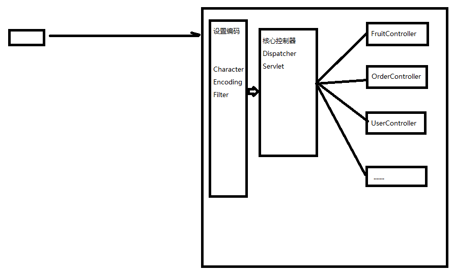

```java
@WebFilter(urlPatterns = { "*.do" }, initParams = { @WebInitParam(name = "encoding", value = "UTF-8") })
public class CharacterEncodingFilter implements Filter {
    private String encoding = "UTF-8";
    @Override
    public void init(FilterConfig filterConfig) throws ServletException {
        String encodingStr = filterConfig.getInitParameter("encoding");
        if (StringUtil.isNotEmpty(encodingStr)) {
            encoding = encodingStr;
        }
    }
    @Override
    public void doFilter(ServletRequest servletRequest, ServletResponse servletResponse, FilterChain filterChain)
            throws IOException, ServletException {
        ((HttpServletRequest) servletRequest).setCharacterEncoding(encoding);
        filterChain.doFilter(servletRequest, servletResponse);
    }
    @Override
    public void destroy() {}
}
```


## 事务管理前置知识
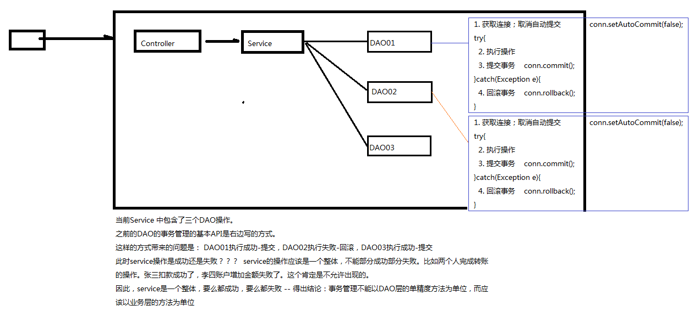
->
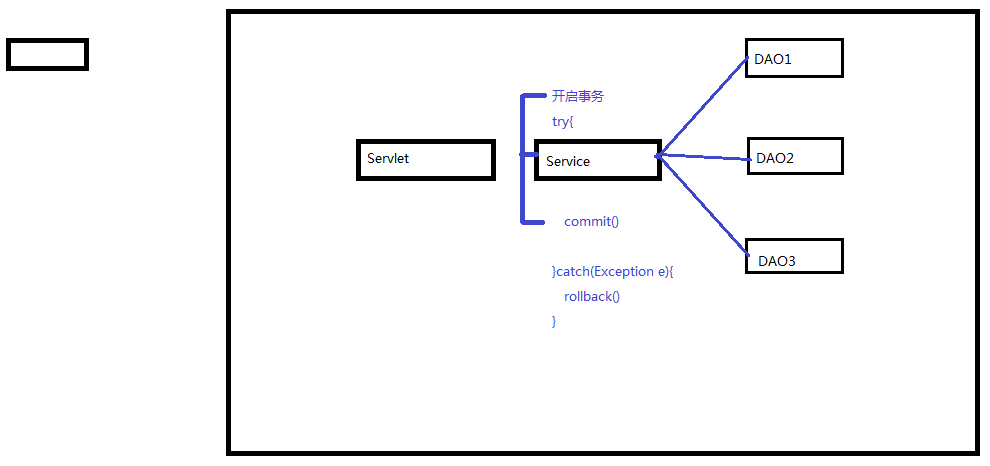
->
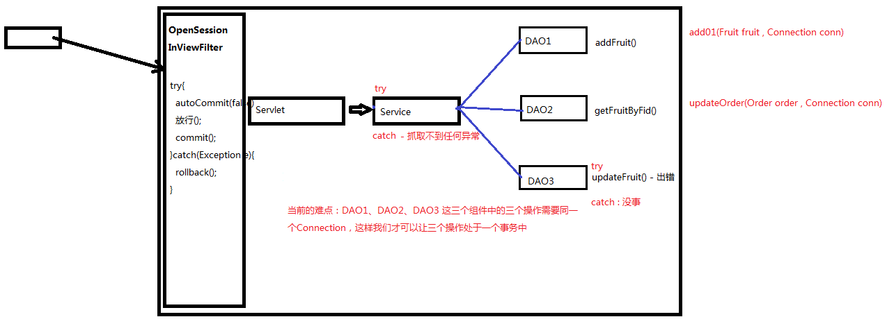

ThreadLocal：
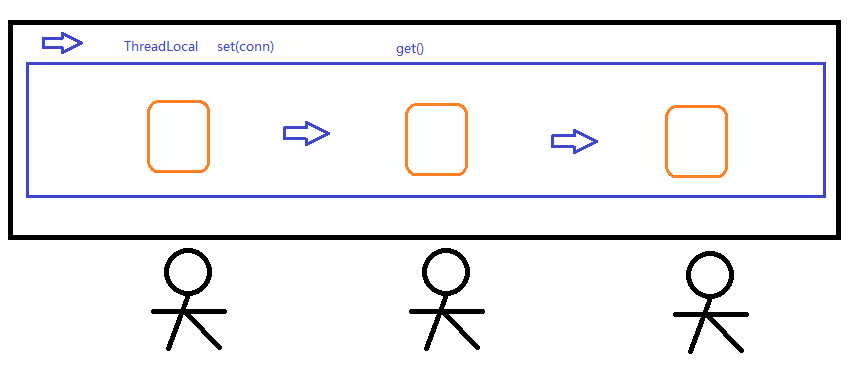


## 事务管理实现
```java
@WebFilter("*.do")
public class OpenSessionInViewFilter implements Filter {
    @Override
    public void init(FilterConfig filterConfig) throws ServletException {}
    @Override
    public void doFilter(ServletRequest servletRequest, ServletResponse servletResponse, FilterChain filterChain)
            throws IOException, ServletException {
        try {
            TransactionManager.beginTrans();
            filterChain.doFilter(servletRequest, servletResponse);
            TransactionManager.commit();
        } catch (Exception e) {
            e.printStackTrace();
            try {
                TransactionManager.rollback();
            } catch (SQLException ex) {
                ex.printStackTrace();
            }
        }
    }
    @Override
    public void destroy() {}
}
```

```java
public class TransactionManager {
    // 开启事务
    public static void beginTrans() throws SQLException {
        ConnUtil.getConn().setAutoCommit(false);
    }
    // 提交事务
    public static void commit() throws SQLException {
        Connection conn = ConnUtil.getConn();
        conn.commit();
        ConnUtil.closeConn();
    }
    // 回滚事务
    public static void rollback() throws SQLException {
        Connection conn = ConnUtil.getConn();
        conn.rollback();
        ConnUtil.closeConn();
    }
}
```

```java
public class ConnUtil {
    private static ThreadLocal<Connection> threadLocal = new ThreadLocal<>();

    public static final String DRIVER = "com.mysql.jdbc.Driver";
    public static final String URL = "jdbc:mysql://localhost:3306/fruitdb?useUnicode=true&characterEncoding=utf-8&useSSL=false";
    public static final String USER = "root";
    public static final String PWD = "123456";

    private static Connection createConn() {
        try {
            // 1.加载驱动
            Class.forName(DRIVER);
            // 2.通过驱动管理器获取连接对象
            return DriverManager.getConnection(URL, USER, PWD);
        } catch (ClassNotFoundException | SQLException e) {
            e.printStackTrace();
        }
        return null;
    }

    public static Connection getConn() {
        Connection conn = threadLocal.get();
        if (conn == null) {
            conn = createConn();
            threadLocal.set(conn);
        }
        return threadLocal.get();
    }

    public static void closeConn() throws SQLException {
        Connection conn = threadLocal.get();
        if (conn == null) {
            return;
        }
        if (!conn.isClosed()) {
            conn.close();
            threadLocal.set(null);
        }
    }
}
```

```java
@WebServlet("*.do")
public class DispatcherServlet extends ViewBaseServlet {
    private BeanFactory beanFactory;
    public void init() throws ServletException {
        super.init();
        beanFactory = new ClassPathXmlApplicationContext();
    }

    @Override
    protected void service(HttpServletRequest request, HttpServletResponse response)
            throws ServletException, IOException {
        String servletPath = request.getServletPath();
        servletPath = servletPath.substring(1);
        int lastDotIndex = servletPath.lastIndexOf(".do");
        servletPath = servletPath.substring(0, lastDotIndex);
        Object  BeanObj = beanFactory.getBean(servletPath);
        String operate = request.getParameter("operate");
        if (StringUtil.isEmpty(operate)) {
            operate = "index";
        }
        try {
            Method[] methods = controllerBeanObj.getClass().getDeclaredMethods();
            for (Method method : methods) {
                if (operate.equals(method.getName())) {
                    // 1.统一获取请求参数
                    // 1-1.获取当前方法的参数，返回参数数组
                    Parameter[] parameters = method.getParameters();
                    // 1-2.parameterValues 用来承载参数的值
                    Object[] parameterValues = new Object[parameters.length];
                    for (int i = 0; i < parameters.length; i++) {
                        Parameter parameter = parameters[i];
                        String parameterName = parameter.getName();
                        // 如果参数名是request,response,session 那么就不是通过请求中获取参数的方式了
                        if ("request".equals(parameterName)) {
                            parameterValues[i] = request;
                        } else if ("response".equals(parameterName)) {
                            parameterValues[i] = response;
                        } else if ("session".equals(parameterName)) {
                            parameterValues[i] = request.getSession();
                        } else {
                            // 从请求中获取参数值
                            String parameterValue = request.getParameter(parameterName);
                            String typeName = parameter.getType().getName();
                            Object parameterObj = parameterValue;
                            if (parameterObj != null) {
                                if ("java.lang.Integer".equals(typeName)) {
                                    parameterObj = Integer.parseInt(parameterValue);
                                }
                            }
                            parameterValues[i] = parameterObj;
                        }
                    }
                    // 2.controller组件中的方法调用
                    method.setAccessible(true);
                    Object returnObj = method.invoke(controllerBeanObj, parameterValues);
                    // 3.视图处理
                    String methodReturnStr = (String) returnObj;
                    if (methodReturnStr.startsWith("redirect:")) { // 比如： redirect:fruit.do
                        String redirectStr = methodReturnStr.substring("redirect:".length());
                        response.sendRedirect(redirectStr);
                    } else {
                        super.processTemplate(methodReturnStr, request, response); // 比如： "edit"
                    }
                }
            }
        } catch (Exception e) {
            e.printStackTrace();
            throw new DispatcherServletException("DispatcherServlet出错了...");
        }
    }
}
```

```java
package com.atguigu.myssm.basedao;

import java.lang.reflect.Field;
import java.lang.reflect.ParameterizedType;
import java.lang.reflect.Type;
import java.sql.*;
import java.util.ArrayList;
import java.util.List;

public abstract class BaseDAO<T> {
    protected Connection conn;
    protected PreparedStatement psmt;
    protected ResultSet rs;
    private Class entityClass;

    public BaseDAO() {
        // getClass() 获取Class对象，当前我们执行的是new FruitDAOImpl() , 创建的是FruitDAOImpl的实例
        // 那么子类构造方法内部首先会调用父类（BaseDAO）的无参构造方法
        // 因此此处的getClass()会被执行，但是getClass获取的是FruitDAOImpl的Class
        // 所以getGenericSuperclass()获取到的是BaseDAO的Class
        Type genericType = getClass().getGenericSuperclass();
        // ParameterizedType 参数化类型
        Type[] actualTypeArguments = ((ParameterizedType) genericType).getActualTypeArguments();
        // 获取到的<T>中的T的真实的类型
        Type actualType = actualTypeArguments[0];
        try {
            entityClass = Class.forName(actualType.getTypeName());
        } catch (ClassNotFoundException e) {
            e.printStackTrace();
            throw new DAOException("BaseDAO 构造方法出错了，可能的原因是没有指定<>中的类型");
        }
    }

    protected Connection getConn() {
        return ConnUtil.getConn();
    }

    protected void close(ResultSet rs, PreparedStatement psmt, Connection conn) {}

    // 给预处理命令对象设置参数
    private void setParams(PreparedStatement psmt, Object... params) throws SQLException {
        if (params != null && params.length > 0) {
            for (int i = 0; i < params.length; i++) {
                psmt.setObject(i + 1, params[i]);
            }
        }
    }

    // 执行更新，返回影响行数
    protected int executeUpdate(String sql, Object... params) {
        boolean insertFlag = false;
        insertFlag = sql.trim().toUpperCase().startsWith("INSERT");
        conn = getConn();
        try {
            if (insertFlag) {
                psmt = conn.prepareStatement(sql, Statement.RETURN_GENERATED_KEYS);
            } else {
                psmt = conn.prepareStatement(sql);
            }
            setParams(psmt, params);
            int count = psmt.executeUpdate();

            if (insertFlag) {
                rs = psmt.getGeneratedKeys();
                if (rs.next()) {
                    return ((Long) rs.getLong(1)).intValue();
                }
            }
            return 0;
        } catch (SQLException e) {
            e.printStackTrace();
            throw new DAOException("BaseDAO executeUpdate出错了");
        }
    }

    // 通过反射技术给obj对象的property属性赋propertyValue值
    private void setValue(Object obj, String property, Object propertyValue)
            throws NoSuchFieldException, IllegalAccessException {
        Class clazz = obj.getClass();
        // 获取property这个字符串对应的属性名 ， 比如 "fid" 去找 obj对象中的 fid 属性
        Field field = clazz.getDeclaredField(property);
        if (field != null) {
            field.setAccessible(true);
            field.set(obj, propertyValue);
        }
    }

    // 执行复杂查询，返回例如统计结果
    protected Object[] executeComplexQuery(String sql, Object... params) {
        conn = getConn();
        try {
            psmt = conn.prepareStatement(sql);
            setParams(psmt, params);
            rs = psmt.executeQuery();
            // 通过rs可以获取结果集的元数据
            // 元数据：描述结果集数据的数据 , 简单讲，就是这个结果集有哪些列，什么类型等等
            ResultSetMetaData rsmd = rs.getMetaData();
            // 获取结果集的列数
            int columnCount = rsmd.getColumnCount();
            Object[] columnValueArr = new Object[columnCount];
            // 6.解析rs
            if (rs.next()) {
                for (int i = 0; i < columnCount; i++) {
                    Object columnValue = rs.getObject(i + 1); // 33 苹果 5
                    columnValueArr[i] = columnValue;
                }
                return columnValueArr;
            }
        } catch (SQLException e) {
            e.printStackTrace();
            throw new DAOException("BaseDAO executeComplexQuery出错了");
        }
        return null;
    }

    // 执行查询，返回单个实体对象
    protected T load(String sql, Object... params) {
        conn = getConn();
        try {
            psmt = conn.prepareStatement(sql);
            setParams(psmt, params);
            rs = psmt.executeQuery();
            // 通过rs可以获取结果集的元数据
            // 元数据：描述结果集数据的数据 , 简单讲，就是这个结果集有哪些列，什么类型等等
            ResultSetMetaData rsmd = rs.getMetaData();
            // 获取结果集的列数
            int columnCount = rsmd.getColumnCount();
            // 6.解析rs
            if (rs.next()) {
                T entity = (T) entityClass.newInstance();
                for (int i = 0; i < columnCount; i++) {
                    String columnName = rsmd.getColumnName(i + 1); // fid fname price
                    Object columnValue = rs.getObject(i + 1); // 33 苹果 5
                    setValue(entity, columnName, columnValue);
                }
                return entity;
            }
        } catch (Exception e) {
            e.printStackTrace();
            throw new DAOException("BaseDAO load出错了");
        }
        return null;
    }

    // 执行查询，返回List
    protected List<T> executeQuery(String sql, Object... params) {
        List<T> list = new ArrayList<>();
        conn = getConn();
        try {
            psmt = conn.prepareStatement(sql);
            setParams(psmt, params);
            rs = psmt.executeQuery();
            // 通过rs可以获取结果集的元数据
            // 元数据：描述结果集数据的数据 , 简单讲，就是这个结果集有哪些列，什么类型等等
            ResultSetMetaData rsmd = rs.getMetaData();
            // 获取结果集的列数
            int columnCount = rsmd.getColumnCount();
            // 6.解析rs
            while (rs.next()) {
                T entity = (T) entityClass.newInstance();
                for (int i = 0; i < columnCount; i++) {
                    String columnName = rsmd.getColumnName(i + 1); // fid fname price
                    Object columnValue = rs.getObject(i + 1); // 33 苹果 5
                    setValue(entity, columnName, columnValue);
                }
                list.add(entity);
            }
        } catch (Exception e) {
            e.printStackTrace();
            throw new DAOException("BaseDAO executeQuery出错了");
        }
        return list;
    }
}
```


## ThreadLocal中的get和set源码分析
ThreadLocal称之为本地线程。我们可以通过set方法在当前线程上存储数据、通过get方法在当前线程上获取数据。

```java
public class ThreadLocal<T> {
    // ...
    public void set(T value) {
        Thread t = Thread.currentThread(); //获取当前的线程
        ThreadLocalMap map = getMap(t); //每一个线程都维护各自的一个容器（ThreadLocalMap）
        if (map != null) {
            map.set(this, value); //这里的key对应的是ThreadLocal，因为我们的组件中需要传输（共享）的对象可能会有多个（不止Connection）
        } else {
            createMap(t, value); //默认情况下map是没有初始化的，那么第一次往其中添加数据时，会去初始化
        }
    }
    public T get() {
        Thread t = Thread.currentThread(); //获取当前的线程
        ThreadLocalMap map = getMap(t); //获取和这个线程（企业）相关的ThreadLocalMap（也就是工作纽带的集合）
        if (map != null) {
            ThreadLocalMap.Entry e = map.getEntry(this); //this指的是ThreadLocal对象，通过它才能知道是哪一个工作纽带
            if (e != null) {
                @SuppressWarnings("unchecked")
                T result = (T)e.value; //entry.value就可以获取到工具箱了
                return result;
            }
        }
        return setInitialValue();
    }
    // ...
}
```


## 监听器Listener

### 观察者模式
- 观察者：监控『被观察者』的行为，一旦发现『被观察者』触发了事件，就会调用事先准备好的方法执行操作。
- 被观察者：『被观察者』一旦触发了被监控的事件，就会被『观察者』发现。

### 监听器简介
1. 概念
   - 监听器：专门用于对其他对象身上发生的事件或状态改变进行监听和相应处理的对象，当被监视的对象发生情况时，立即采取相应的行动。 Servlet监听器：Servlet规范中定义的一种特殊类，它用于监听Web应用程序中的ServletContext，HttpSession 和HttpServletRequest等域对象的创建与销毁事件，以及监听这些域对象中的属性发生修改的事件。
2. 分类 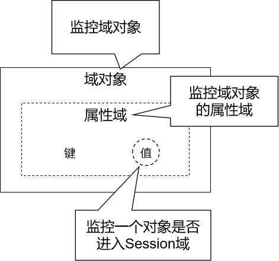
   - 域对象监听器
   - 域对象的属性域监听器
   - Session域中数据的监听器
3. 监听器列表
   1. ServletContextListener
      - 作用：监听ServletContext对象的创建与销毁

        | 方法名                                      | 作用                     |
        | ------------------------------------------- | ------------------------ |
        | contextInitialized(ServletContextEvent sce) | ServletContext创建时调用 |
        | contextDestroyed(ServletContextEvent sce)   | ServletContext销毁时调用 |
      - ServletContextEvent对象代表从ServletContext对象身上捕获到的事件，通过这个事件对象我们可以获取到ServletContext对象。
   2. HttpSessionListener
      - 作用：监听HttpSession对象的创建与销毁

        | 方法名                                 | 作用                      |
        | -------------------------------------- | ------------------------- |
        | sessionCreated(HttpSessionEvent hse)   | HttpSession对象创建时调用 |
        | sessionDestroyed(HttpSessionEvent hse) | HttpSession对象销毁时调用 |
      - HttpSessionEvent对象代表从HttpSession对象身上捕获到的事件，通过这个事件对象我们可以获取到触发事件的HttpSession对象。
   3. ServletRequestListener
      - 作用：监听ServletRequest对象的创建与销毁

        | 方法名                                      | 作用                         |
        | ------------------------------------------- | ---------------------------- |
        | requestInitialized(ServletRequestEvent sre) | ServletRequest对象创建时调用 |
        | requestDestroyed(ServletRequestEvent sre)   | ServletRequest对象销毁时调用 |
      - ServletRequestEvent对象代表从HttpServletRequest对象身上捕获到的事件，通过这个事件对象我们可以获取到触发事件的HttpServletRequest对象。另外还有一个方法可以获取到当前Web应用的ServletContext对象。
   4. ServletContextAttributeListener
      - 作用：监听ServletContext中属性的创建、修改和销毁

        | 方法名                                               | 作用                                 |
        | ---------------------------------------------------- | ------------------------------------ |
        | attributeAdded(ServletContextAttributeEvent scab)    | 向ServletContext中添加属性时调用     |
        | attributeRemoved(ServletContextAttributeEvent scab)  | 从ServletContext中移除属性时调用     |
        | attributeReplaced(ServletContextAttributeEvent scab) | 当ServletContext中的属性被修改时调用 |
      - ServletContextAttributeEvent对象代表属性变化事件，它包含的方法如下：

        | 方法名              | 作用                     |
        | ------------------- | ------------------------ |
        | getName()           | 获取修改或添加的属性名   |
        | getValue()          | 获取被修改或添加的属性值 |
        | getServletContext() | 获取ServletContext对象   |
   5. HttpSessionAttributeListener
      - 作用：监听HttpSession中属性的创建、修改和销毁

        | 方法名                                        | 作用                              |
        | --------------------------------------------- | --------------------------------- |
        | attributeAdded(HttpSessionBindingEvent se)    | 向HttpSession中添加属性时调用     |
        | attributeRemoved(HttpSessionBindingEvent se)  | 从HttpSession中移除属性时调用     |
        | attributeReplaced(HttpSessionBindingEvent se) | 当HttpSession中的属性被修改时调用 |
      - HttpSessionBindingEvent对象代表属性变化事件，它包含的方法如下：

        | 方法名       | 作用                          |
        | ------------ | ----------------------------- |
        | getName()    | 获取修改或添加的属性名        |
        | getValue()   | 获取被修改或添加的属性值      |
        | getSession() | 获取触发事件的HttpSession对象 |
   6. ServletRequestAttributeListener
      - 作用：监听ServletRequest中属性的创建、修改和销毁

        | 方法名                                               | 作用                                 |
        | ---------------------------------------------------- | ------------------------------------ |
        | attributeAdded(ServletRequestAttributeEvent srae)    | 向ServletRequest中添加属性时调用     |
        | attributeRemoved(ServletRequestAttributeEvent srae)  | 从ServletRequest中移除属性时调用     |
        | attributeReplaced(ServletRequestAttributeEvent srae) | 当ServletRequest中的属性被修改时调用 |
      - ServletRequestAttributeEvent对象代表属性变化事件，它包含的方法如下：

        | 方法名               | 作用                             |
        | -------------------- | -------------------------------- |
        | getName()            | 获取修改或添加的属性名           |
        | getValue()           | 获取被修改或添加的属性值         |
        | getServletRequest () | 获取触发事件的ServletRequest对象 |
   7. HttpSessionBindingListener
      - 作用：监听某个对象在Session域中的创建与移除

        | 方法名                                      | 作用                              |
        | ------------------------------------------- | --------------------------------- |
        | valueBound(HttpSessionBindingEvent event)   | 该类的实例被放到Session域中时调用 |
        | valueUnbound(HttpSessionBindingEvent event) | 该类的实例从Session中移除时调用   |
      - HttpSessionBindingEvent对象代表属性变化事件，它包含的方法如下：

        | 方法名       | 作用                          |
        | ------------ | ----------------------------- |
        | getName()    | 获取当前事件涉及的属性名      |
        | getValue()   | 获取当前事件涉及的属性值      |
        | getSession() | 获取触发事件的HttpSession对象 |
   8. HttpSessionActivationListener
      - 作用：监听某个对象在Session中的序列化与反序列化。

        | 方法名                                    | 作用                                  |
        | ----------------------------------------- | ------------------------------------- |
        | sessionWillPassivate(HttpSessionEvent se) | 该类实例和Session一起钝化到硬盘时调用 |
        | sessionDidActivate(HttpSessionEvent se)   | 该类实例和Session一起活化到内存时调用 |
      - HttpSessionEvent对象代表事件对象，通过getSession()方法获取事件涉及的HttpSession对象。

### ServletContextListener
1. 实用性
    将来学习SpringMVC的时候，会用到一个ContextLoaderListener，这个监听器就实现了ServletContextListener接口，表示对ServletContext对象本身的生命周期进行监控。
2. 具体用法
   1. 创建监听器类
        ```java
        public class AtguiguListener implements ServletContextListener {
            @Override
            public void contextInitialized(
                    // Event对象代表本次事件，通过这个对象可以获取ServletContext对象本身
                    ServletContextEvent sce) {
                System.out.println("Hello，我是ServletContext，我出生了！");

                ServletContext servletContext = sce.getServletContext();
                System.out.println("servletContext = " + servletContext);
            }

            @Override
            public void contextDestroyed(ServletContextEvent sce) {
                System.out.println("Hello，我是ServletContext，我打算去休息一会儿！");
            }
        }
        ```
   2. 注册监听器
        ```xml
        <!-- 每一个listener标签对应一个监听器配置，若有多个监听器，则配置多个listener标签即可 -->
        <listener>
            <!-- 配置监听器指定全类名即可 -->
            <listener-class>com.atguigu.listener.AtguiguListener</listener-class>
        </listener>
        ```

```java
//监听上下文启动，在上下文启动的时候去创建IOC容器,然后将其保存到application作用域
//后面中央控制器再从application作用域中去获取IOC容器
@WebListener
public class ContextLoaderListener implements ServletContextListener {
    @Override
    public void contextInitialized(ServletContextEvent servletContextEvent) {
        // 1.获取ServletContext对象
        ServletContext application = servletContextEvent.getServletContext();
        // 2.获取上下文的初始化参数
        String path = application.getInitParameter("contextConfigLocation");
        // 3.创建IOC容器
        BeanFactory beanFactory = new ClassPathXmlApplicationContext(path);
        // 4.将IOC容器保存到application作用域
        application.setAttribute("beanFactory", beanFactory);
    }

    @Override
    public void contextDestroyed(ServletContextEvent servletContextEvent) {}
}
```

```java
@WebServlet("*.do")
public class DispatcherServlet extends ViewBaseServlet {
    private BeanFactory beanFactory;

    public void init() throws ServletException {
        super.init();
        // 之前是在此处主动创建IOC容器的
        // 现在优化为从application作用域去获取
        // beanFactory = new ClassPathXmlApplicationContext();
        ServletContext application = getServletContext();
        Object beanFactoryObj = application.getAttribute("beanFactory");
        if (beanFactoryObj != null) {
            beanFactory = (BeanFactory) beanFactoryObj;
        } else {
            throw new RuntimeException("IOC容器获取失败！");
        }
    }
    // ...
```

```java
public class ClassPathXmlApplicationContext implements BeanFactory {
    private Map<String, Object> beanMap = new HashMap<>();
    private String path = "applicationContext.xml";
    public ClassPathXmlApplicationContext() {
        this("applicationContext.xml");
    }
    public ClassPathXmlApplicationContext(String path) {
        if (StringUtil.isEmpty(path)) {
            throw new RuntimeException("IOC容器的配置文件没有指定...");
        }
        try {
            InputStream inputStream = getClass().getClassLoader().getResourceAsStream(path);
            // 1.创建DocumentBuilderFactory
            DocumentBuilderFactory documentBuilderFactory = DocumentBuilderFactory.newInstance();
            // 2.创建DocumentBuilder对象
            DocumentBuilder documentBuilder = documentBuilderFactory.newDocumentBuilder();
            // 3.创建Document对象
            Document document = documentBuilder.parse(inputStream);
            // 4.获取所有的bean节点
            NodeList beanNodeList = document.getElementsByTagName("bean");
            for (int i = 0; i < beanNodeList.getLength(); i++) {
                Node beanNode = beanNodeList.item(i);
                if (beanNode.getNodeType() == Node.ELEMENT_NODE) {
                    Element beanElement = (Element) beanNode;
                    String beanId = beanElement.getAttribute("id");
                    String className = beanElement.getAttribute("class");
                    Class beanClass = Class.forName(className);
                    // 创建bean实例
                    Object beanObj = beanClass.newInstance();
                    // 将bean实例对象保存到map容器中
                    beanMap.put(beanId, beanObj);
                    // 到目前为止，此处需要注意的是，bean和bean之间的依赖关系还没有设置
                }
            }
            // 5.组装bean之间的依赖关系
            for (int i = 0; i < beanNodeList.getLength(); i++) {
                Node beanNode = beanNodeList.item(i);
                if (beanNode.getNodeType() == Node.ELEMENT_NODE) {
                    Element beanElement = (Element) beanNode;
                    String beanId = beanElement.getAttribute("id");
                    NodeList beanChildNodeList = beanElement.getChildNodes();
                    for (int j = 0; j < beanChildNodeList.getLength(); j++) {
                        Node beanChildNode = beanChildNodeList.item(j);
                        if (beanChildNode.getNodeType() == Node.ELEMENT_NODE
                                && "property".equals(beanChildNode.getNodeName())) {
                            Element propertyElement = (Element) beanChildNode;
                            String propertyName = propertyElement.getAttribute("name");
                            String propertyRef = propertyElement.getAttribute("ref");
                            // 1) 找到propertyRef对应的实例
                            Object refObj = beanMap.get(propertyRef);
                            // 2) 将refObj设置到当前bean对应的实例的property属性上去
                            Object beanObj = beanMap.get(beanId);
                            Class beanClazz = beanObj.getClass();
                            Field propertyField = beanClazz.getDeclaredField(propertyName);
                            propertyField.setAccessible(true);
                            propertyField.set(beanObj, refObj);
                        }
                    }
                }
            }
        } catch (ParserConfigurationException e) {
            e.printStackTrace();
        } catch (SAXException e) {
            e.printStackTrace();
        } catch (IOException e) {
            e.printStackTrace();
        } catch (IllegalAccessException e) {
            e.printStackTrace();
        } catch (InstantiationException e) {
            e.printStackTrace();
        } catch (ClassNotFoundException e) {
            e.printStackTrace();
        } catch (NoSuchFieldException e) {
            e.printStackTrace();
        }
    }

    @Override
    public Object getBean(String id) {
        return beanMap.get(id);
    }
}
```


## MVC-review3
MVC各个层的设计


目前为止mysmm的所有代码

### web
WEB-INF/web.xml
```xml
<?xml version="1.0" encoding="UTF-8"?>
<web-app xmlns="http://xmlns.jcp.org/xml/ns/javaee"
         xmlns:xsi="http://www.w3.org/2001/XMLSchema-instance"
         xsi:schemaLocation="http://xmlns.jcp.org/xml/ns/javaee http://xmlns.jcp.org/xml/ns/javaee/web-app_4_0.xsd"
         version="4.0">
    <!-- 配置上下文参数 -->
    <context-param>
        <param-name>view-prefix</param-name>
        <param-value>/</param-value>
    </context-param>
    <context-param>
        <param-name>view-suffix</param-name>
        <param-value>.html</param-value>
    </context-param>
    <context-param>
        <param-name>contextConfigLocation</param-name>
        <param-value>applicationContext.xml</param-value>
    </context-param>
</web-app>
```

### src
applicationContext.xml
```xml
<?xml version="1.0" encoding="utf-8"?>

<beans>
    <bean id="fruitDAO" class="com.atguigu.fruit.dao.impl.FruitDAOImpl"/>
    <bean id="fruitService" class="com.atguigu.fruit.service.impl.FruitServiceImpl">
        <!-- property标签用来表示属性；name表示属性名；ref表示引用其他bean的id值-->
        <property name="fruitDAO" ref="fruitDAO"/>
    </bean>
    <bean id="fruit" class="com.atguigu.fruit.controllers.FruitController">
        <property name="fruitService" ref="fruitService"/>
    </bean>
</beans>
```

### util
```java
public class StringUtil {
    // 判断字符串是否为null或者""
    public static boolean isEmpty(String str) {
        return str == null || "".equals(str);
    }
    public static boolean isNotEmpty(String str) {
        return !isEmpty(str);
    }
}
```

### trans
```java
public class TransactionManager {
    // 开启事务
    public static void beginTrans() throws SQLException {
        ConnUtil.getConn().setAutoCommit(false);
    }
    // 提交事务
    public static void commit() throws SQLException {
        Connection conn = ConnUtil.getConn();
        conn.commit();
        ConnUtil.closeConn();
    }
    // 回滚事务
    public static void rollback() throws SQLException {
        Connection conn = ConnUtil.getConn();
        conn.rollback();
        ConnUtil.closeConn();
    }
}
```

### myspringmvc
```java
public class ViewBaseServlet extends HttpServlet {
    private TemplateEngine templateEngine;
    @Override
    public void init() throws ServletException {
        // 1.获取ServletContext对象
        ServletContext servletContext = this.getServletContext();
        // 2.创建Thymeleaf解析器对象
        ServletContextTemplateResolver templateResolver = new ServletContextTemplateResolver(servletContext);
        // 3.给解析器对象设置参数
        // ①HTML是默认模式，明确设置是为了代码更容易理解
        templateResolver.setTemplateMode(TemplateMode.HTML);
        // ②设置前缀
        String viewPrefix = servletContext.getInitParameter("view-prefix");
        templateResolver.setPrefix(viewPrefix);
        // ③设置后缀
        String viewSuffix = servletContext.getInitParameter("view-suffix");
        templateResolver.setSuffix(viewSuffix);
        // ④设置缓存过期时间（毫秒）
        templateResolver.setCacheTTLMs(60000L);
        // ⑤设置是否缓存
        templateResolver.setCacheable(true);
        // ⑥设置服务器端编码方式
        templateResolver.setCharacterEncoding("utf-8");
        // 4.创建模板引擎对象
        templateEngine = new TemplateEngine();
        // 5.给模板引擎对象设置模板解析器
        templateEngine.setTemplateResolver(templateResolver);
    }

    protected void processTemplate(String templateName, HttpServletRequest req, HttpServletResponse resp)
            throws IOException {
        // 1.设置响应体内容类型和字符集
        resp.setContentType("text/html;charset=UTF-8");
        // 2.创建WebContext对象
        WebContext webContext = new WebContext(req, resp, getServletContext());
        // 3.处理模板数据
        templateEngine.process(templateName, webContext, resp.getWriter());
    }
}
```

```java
public class DispatcherServletException extends RuntimeException {
    public DispatcherServletException(String msg){
        super(msg);
    }
}
```

```java
@WebServlet("*.do")
public class DispatcherServlet extends ViewBaseServlet {
    private BeanFactory beanFactory;
    public DispatcherServlet() {}
    public void init() throws ServletException {
        super.init();
        ServletContext application = getServletContext();
        Object beanFactoryObj = application.getAttribute("beanFactory");
        if (beanFactoryObj != null) {
            beanFactory = (BeanFactory) beanFactoryObj;
        } else {
            throw new RuntimeException("IOC容器获取失败！");
        }
    }
    @Override
    protected void service(HttpServletRequest request, HttpServletResponse response)
            throws ServletException, IOException {
        String servletPath = request.getServletPath();
        servletPath = servletPath.substring(1);
        int lastDotIndex = servletPath.lastIndexOf(".do");
        servletPath = servletPath.substring(0, lastDotIndex);
        Object controllerBeanObj = beanFactory.getBean(servletPath);
        String operate = request.getParameter("operate");
        if (StringUtil.isEmpty(operate)) {
            operate = "index";
        }
        try {
            Method[] methods = controllerBeanObj.getClass().getDeclaredMethods();
            for (Method method : methods) {
                if (operate.equals(method.getName())) {
                    // 1.统一获取请求参数
                    // 1-1.获取当前方法的参数，返回参数数组
                    Parameter[] parameters = method.getParameters();
                    // 1-2.parameterValues 用来承载参数的值
                    Object[] parameterValues = new Object[parameters.length];
                    for (int i = 0; i < parameters.length; i++) {
                        Parameter parameter = parameters[i];
                        String parameterName = parameter.getName();
                        // 如果参数名是request,response,session 那么就不是通过请求中获取参数的方式了
                        if ("request".equals(parameterName)) {
                            parameterValues[i] = request;
                        } else if ("response".equals(parameterName)) {
                            parameterValues[i] = response;
                        } else if ("session".equals(parameterName)) {
                            parameterValues[i] = request.getSession();
                        } else {
                            // 从请求中获取参数值
                            String parameterValue = request.getParameter(parameterName);
                            String typeName = parameter.getType().getName();
                            Object parameterObj = parameterValue;
                            if (parameterObj != null) {
                                if ("java.lang.Integer".equals(typeName)) {
                                    parameterObj = Integer.parseInt(parameterValue);
                                }
                            }
                            parameterValues[i] = parameterObj;
                        }
                    }
                    // 2.controller组件中的方法调用
                    method.setAccessible(true);
                    Object returnObj = method.invoke(controllerBeanObj, parameterValues);
                    // 3.视图处理
                    String methodReturnStr = (String) returnObj;
                    if (methodReturnStr.startsWith("redirect:")) { // 比如： redirect:fruit.do
                        String redirectStr = methodReturnStr.substring("redirect:".length());
                        response.sendRedirect(redirectStr);
                    } else {
                        super.processTemplate(methodReturnStr, request, response); // 比如： "edit"
                    }
                }
            }
        } catch (Exception e) {
            e.printStackTrace();
            throw new DispatcherServletException("DispatcherServlet出错了...");
        }
    }
}
```

### listeners
```java
@WebListener
public class ContextLoaderListener implements ServletContextListener {
    @Override
    public void contextInitialized(ServletContextEvent servletContextEvent) {
        // 1.获取ServletContext对象
        ServletContext application = servletContextEvent.getServletContext();
        // 2.获取上下文的初始化参数
        String path = application.getInitParameter("contextConfigLocation");
        // 3.创建IOC容器
        BeanFactory beanFactory = new ClassPathXmlApplicationContext(path);
        // 4.将IOC容器保存到application作用域
        application.setAttribute("beanFactory", beanFactory);
    }
    @Override
    public void contextDestroyed(ServletContextEvent servletContextEvent) {}
}
```

### ioc
```java
public interface BeanFactory {
    Object getBean(String id);
}
```

```java
public class ClassPathXmlApplicationContext implements BeanFactory {
    private Map<String, Object> beanMap = new HashMap<>();
    private String path = "applicationContext.xml";
    public ClassPathXmlApplicationContext() {
        this("applicationContext.xml");
    }
    public ClassPathXmlApplicationContext(String path) {
        if (StringUtil.isEmpty(path)) {
            throw new RuntimeException("IOC容器的配置文件没有指定...");
        }
        try {
            InputStream inputStream = getClass().getClassLoader().getResourceAsStream(path);
            // 1.创建DocumentBuilderFactory
            DocumentBuilderFactory documentBuilderFactory = DocumentBuilderFactory.newInstance();
            // 2.创建DocumentBuilder对象
            DocumentBuilder documentBuilder = documentBuilderFactory.newDocumentBuilder();
            // 3.创建Document对象
            Document document = documentBuilder.parse(inputStream);
            // 4.获取所有的bean节点
            NodeList beanNodeList = document.getElementsByTagName("bean");
            for (int i = 0; i < beanNodeList.getLength(); i++) {
                Node beanNode = beanNodeList.item(i);
                if (beanNode.getNodeType() == Node.ELEMENT_NODE) {
                    Element beanElement = (Element) beanNode;
                    String beanId = beanElement.getAttribute("id");
                    String className = beanElement.getAttribute("class");
                    Class beanClass = Class.forName(className);
                    // 创建bean实例
                    Object beanObj = beanClass.newInstance();
                    // 将bean实例对象保存到map容器中
                    beanMap.put(beanId, beanObj);
                    // 到目前为止，此处需要注意的是，bean和bean之间的依赖关系还没有设置
                }
            }
            // 5.组装bean之间的依赖关系
            for (int i = 0; i < beanNodeList.getLength(); i++) {
                Node beanNode = beanNodeList.item(i);
                if (beanNode.getNodeType() == Node.ELEMENT_NODE) {
                    Element beanElement = (Element) beanNode;
                    String beanId = beanElement.getAttribute("id");
                    NodeList beanChildNodeList = beanElement.getChildNodes();
                    for (int j = 0; j < beanChildNodeList.getLength(); j++) {
                        Node beanChildNode = beanChildNodeList.item(j);
                        if (beanChildNode.getNodeType() == Node.ELEMENT_NODE
                                && "property".equals(beanChildNode.getNodeName())) {
                            Element propertyElement = (Element) beanChildNode;
                            String propertyName = propertyElement.getAttribute("name");
                            String propertyRef = propertyElement.getAttribute("ref");
                            // 1) 找到propertyRef对应的实例
                            Object refObj = beanMap.get(propertyRef);
                            // 2) 将refObj设置到当前bean对应的实例的property属性上去
                            Object beanObj = beanMap.get(beanId);
                            Class beanClazz = beanObj.getClass();
                            Field propertyField = beanClazz.getDeclaredField(propertyName);
                            propertyField.setAccessible(true);
                            propertyField.set(beanObj, refObj);
                        }
                    }
                }
            }
        } catch (ParserConfigurationException e) {
            e.printStackTrace();
        } catch (SAXException e) {
            e.printStackTrace();
        } catch (IOException e) {
            e.printStackTrace();
        } catch (IllegalAccessException e) {
            e.printStackTrace();
        } catch (InstantiationException e) {
            e.printStackTrace();
        } catch (ClassNotFoundException e) {
            e.printStackTrace();
        } catch (NoSuchFieldException e) {
            e.printStackTrace();
        }
    }
    @Override
    public Object getBean(String id) {
        return beanMap.get(id);
    }
}
```

### filters
```java
@WebFilter(urlPatterns = { "*.do" }, initParams = { @WebInitParam(name = "encoding", value = "UTF-8") })
public class CharacterEncodingFilter implements Filter {
    private String encoding = "UTF-8";
    @Override
    public void init(FilterConfig filterConfig) throws ServletException {
        String encodingStr = filterConfig.getInitParameter("encoding");
        if (StringUtil.isNotEmpty(encodingStr)) {
            encoding = encodingStr;
        }
    }
    @Override
    public void doFilter(ServletRequest servletRequest, ServletResponse servletResponse, FilterChain filterChain)
            throws IOException, ServletException {
        ((HttpServletRequest) servletRequest).setCharacterEncoding(encoding);
        filterChain.doFilter(servletRequest, servletResponse);
    }
    @Override
    public void destroy() {}
}
```

```java
@WebFilter("*.do")
public class OpenSessionInViewFilter implements Filter {
    @Override
    public void init(FilterConfig filterConfig) throws ServletException {}
    @Override
    public void doFilter(ServletRequest servletRequest, ServletResponse servletResponse, FilterChain filterChain)
            throws IOException, ServletException {
        try {
            TransactionManager.beginTrans();
            System.out.println("开启事务....");
            filterChain.doFilter(servletRequest, servletResponse);
            TransactionManager.commit();
            System.out.println("提交事务...");
        } catch (Exception e) {
            e.printStackTrace();
            try {
                TransactionManager.rollback();
                System.out.println("回滚事务....");
            } catch (SQLException ex) {
                ex.printStackTrace();
            }
        }
    }
    @Override
    public void destroy() {}
}
```

### basedao
```java
public abstract class BaseDAO<T> {
    protected Connection conn;
    protected PreparedStatement psmt;
    protected ResultSet rs;

    // T的Class对象
    private Class entityClass;

    public BaseDAO() {
        // getClass() 获取Class对象，当前我们执行的是new FruitDAOImpl() , 创建的是FruitDAOImpl的实例
        // 那么子类构造方法内部首先会调用父类（BaseDAO）的无参构造方法
        // 因此此处的getClass()会被执行，但是getClass获取的是FruitDAOImpl的Class
        // 所以getGenericSuperclass()获取到的是BaseDAO的Class
        Type genericType = getClass().getGenericSuperclass();
        // ParameterizedType 参数化类型
        Type[] actualTypeArguments = ((ParameterizedType) genericType).getActualTypeArguments();
        // 获取到的<T>中的T的真实的类型
        Type actualType = actualTypeArguments[0];

        try {
            entityClass = Class.forName(actualType.getTypeName());
        } catch (ClassNotFoundException e) {
            e.printStackTrace();
            throw new DAOException("BaseDAO 构造方法出错了，可能的原因是没有指定<>中的类型");
        }
    }

    protected Connection getConn() {
        return ConnUtil.getConn();
    }

    protected void close(ResultSet rs, PreparedStatement psmt, Connection conn) {}

    // 给预处理命令对象设置参数
    private void setParams(PreparedStatement psmt, Object... params) throws SQLException {
        if (params != null && params.length > 0) {
            for (int i = 0; i < params.length; i++) {
                psmt.setObject(i + 1, params[i]);
            }
        }
    }

    // 执行更新，返回影响行数
    protected int executeUpdate(String sql, Object... params) {
        boolean insertFlag = false;
        insertFlag = sql.trim().toUpperCase().startsWith("INSERT");
        conn = getConn();
        try {
            if (insertFlag) {
                psmt = conn.prepareStatement(sql, Statement.RETURN_GENERATED_KEYS);
            } else {
                psmt = conn.prepareStatement(sql);
            }
            setParams(psmt, params);
            int count = psmt.executeUpdate();
            if (insertFlag) {
                rs = psmt.getGeneratedKeys();
                if (rs.next()) {
                    return ((Long) rs.getLong(1)).intValue();
                }
            }
            return 0;
        } catch (SQLException e) {
            e.printStackTrace();
            throw new DAOException("BaseDAO executeUpdate出错了");
        }
    }

    // 通过反射技术给obj对象的property属性赋propertyValue值
    private void setValue(Object obj, String property, Object propertyValue)
            throws NoSuchFieldException, IllegalAccessException {
        Class clazz = obj.getClass();

        // 获取property这个字符串对应的属性名 ， 比如 "fid" 去找 obj对象中的 fid 属性
        Field field = clazz.getDeclaredField(property);
        if (field != null) {
            field.setAccessible(true);
            field.set(obj, propertyValue);
        }

    }

    // 执行复杂查询，返回例如统计结果
    protected Object[] executeComplexQuery(String sql, Object... params) {
        conn = getConn();
        try {
            psmt = conn.prepareStatement(sql);
            setParams(psmt, params);
            rs = psmt.executeQuery();
            // 通过rs可以获取结果集的元数据
            // 元数据：描述结果集数据的数据 , 简单讲，就是这个结果集有哪些列，什么类型等等
            ResultSetMetaData rsmd = rs.getMetaData();
            // 获取结果集的列数
            int columnCount = rsmd.getColumnCount();
            Object[] columnValueArr = new Object[columnCount];
            // 6.解析rs
            if (rs.next()) {
                for (int i = 0; i < columnCount; i++) {
                    Object columnValue = rs.getObject(i + 1); // 33 苹果 5
                    columnValueArr[i] = columnValue;
                }
                return columnValueArr;
            }
        } catch (SQLException e) {
            e.printStackTrace();
            throw new DAOException("BaseDAO executeComplexQuery出错了");
        }
        return null;
    }

    // 执行查询，返回单个实体对象
    protected T load(String sql, Object... params) {
        conn = getConn();
        try {
            psmt = conn.prepareStatement(sql);
            setParams(psmt, params);
            rs = psmt.executeQuery();
            // 通过rs可以获取结果集的元数据
            // 元数据：描述结果集数据的数据 , 简单讲，就是这个结果集有哪些列，什么类型等等
            ResultSetMetaData rsmd = rs.getMetaData();
            // 获取结果集的列数
            int columnCount = rsmd.getColumnCount();
            // 6.解析rs
            if (rs.next()) {
                T entity = (T) entityClass.newInstance();

                for (int i = 0; i < columnCount; i++) {
                    String columnName = rsmd.getColumnName(i + 1); // fid fname price
                    Object columnValue = rs.getObject(i + 1); // 33 苹果 5
                    setValue(entity, columnName, columnValue);
                }
                return entity;
            }
        } catch (Exception e) {
            e.printStackTrace();
            throw new DAOException("BaseDAO load出错了");
        }
        return null;
    }

    // 执行查询，返回List
    protected List<T> executeQuery(String sql, Object... params) {
        List<T> list = new ArrayList<>();
        conn = getConn();
        try {
            psmt = conn.prepareStatement(sql);
            setParams(psmt, params);
            rs = psmt.executeQuery();
            // 通过rs可以获取结果集的元数据
            // 元数据：描述结果集数据的数据 , 简单讲，就是这个结果集有哪些列，什么类型等等
            ResultSetMetaData rsmd = rs.getMetaData();
            // 获取结果集的列数
            int columnCount = rsmd.getColumnCount();
            // 6.解析rs
            while (rs.next()) {
                T entity = (T) entityClass.newInstance();

                for (int i = 0; i < columnCount; i++) {
                    String columnName = rsmd.getColumnName(i + 1); // fid fname price
                    Object columnValue = rs.getObject(i + 1); // 33 苹果 5
                    setValue(entity, columnName, columnValue);
                }
                list.add(entity);
            }
        } catch (Exception e) {
            e.printStackTrace();
            throw new DAOException("BaseDAO executeQuery出错了");
        }
        return list;
    }
}
```

```java
public class ConnUtil {

    private static ThreadLocal<Connection> threadLocal = new ThreadLocal<>();
    // private static ThreadLocal<Object> threadLocal2 = new ThreadLocal<>();
    // private static ThreadLocal<Object> threadLocal3 = new ThreadLocal<>();

    public static final String DRIVER = "com.mysql.jdbc.Driver";
    public static final String URL = "jdbc:mysql://localhost:3306/fruitdb?useUnicode=true&characterEncoding=utf-8&useSSL=false";
    public static final String USER = "root";
    public static final String PWD = "123456";

    private static Connection createConn() {
        try {
            // 1.加载驱动
            Class.forName(DRIVER);
            // 2.通过驱动管理器获取连接对象
            return DriverManager.getConnection(URL, USER, PWD);
        } catch (ClassNotFoundException | SQLException e) {
            e.printStackTrace();
        }
        return null;
    }

    public static Connection getConn() {
        Connection conn = threadLocal.get();
        if (conn == null) {
            conn = createConn();
            threadLocal.set(conn);
        }
        return threadLocal.get();
    }

    public static void closeConn() throws SQLException {
        Connection conn = threadLocal.get();
        if (conn == null) {
            return;
        }
        if (!conn.isClosed()) {
            conn.close();
            threadLocal.set(null);
        }
    }
}
```

```java
public class DAOException extends RuntimeException {
    public DAOException(String msg) {
        super(msg);
    }
}
```


# 项目实战-QQZone

## 需求分析和数据库设计

### QQZone业务需求
1. 用户登录
2. 登录成功，显示主界面。左侧显示好友列表；上端显示欢迎词。如果不是自己的空间，显示超链接：返回自己的空间；下端显示日志列表
3. 查看日志详情：
   - 日志本身的信息（作者头像、昵称、日志标题、日志内容、日志的日期）
   - 回复列表（回复者的头像、昵称、回复内容、回复日期）
   - 主人回复信息
4. 删除日志
5. 删除特定回复
6. 删除特定主人回复
7. 添加日志、添加回复、添加主人回复
8. 点击左侧好友链接，进入好友的空间

### 数据库设计
1. 抽取实体：用户登录信息、用户详情信息、日志、回贴、主人回复
2. 分析其中的属性：
   - 用户登录信息：账号、密码、头像、昵称
   - 用户详情信息：真实姓名、星座、血型、邮箱、手机号...
   - 日志：标题、内容、日期、作者
   - 回复：内容、日期、作者、日志
   - 主人回复：内容、日期、作者、回复
3. 分析实体之间的关系
   - 用户登录信息：用户详情信息 -> 1：1 PK
   - 用户：日志 -> 1：N
   - 日志：回复 -> 1：N
   - 回复：主人回复 -> 1：1 UK
   - 用户：好友 -> M：N


```sql
CREATE DATABASE `qqzonedb2` CHAR SET utf8;

USE qqzonedb2;

CREATE TABLE `t_friend` (
  `id` INT(11) NOT NULL AUTO_INCREMENT,
  `uid` INT(11) DEFAULT NULL,
  `fid` INT(11) DEFAULT NULL,
  PRIMARY KEY (`id`),
  KEY `FK_friend_basic_uid` (`uid`),
  KEY `FK_friend_basic_fid` (`fid`),
  CONSTRAINT `FK_friend_basic_fid` FOREIGN KEY (`fid`) REFERENCES `t_user_basic` (`id`),
  CONSTRAINT `FK_friend_basic_uid` FOREIGN KEY (`uid`) REFERENCES `t_user_basic` (`id`)
) ENGINE=INNODB AUTO_INCREMENT=11 DEFAULT CHARSET=utf8;

/*Data for the table `t_friend` */

INSERT  INTO `t_friend`(`id`,`uid`,`fid`) VALUES (1,1,2),(2,1,3),(3,1,4),(4,1,5),(5,2,3),(6,2,1),(7,2,4),(8,3,1),(9,3,2),(10,5,1);

/*Table structure for table `t_host_reply` */

CREATE TABLE `t_host_reply` (
  `id` INT(11) NOT NULL AUTO_INCREMENT,
  `content` VARCHAR(500) NOT NULL,
  `hostReplyDate` DATETIME NOT NULL,
  `author` INT(11) NOT NULL,
  `reply` INT(11) NOT NULL,
  PRIMARY KEY (`id`),
  KEY `FK_host_basic` (`author`),
  KEY `FK_host_reply` (`reply`),
  CONSTRAINT `FK_host_basic` FOREIGN KEY (`author`) REFERENCES `t_user_basic` (`id`),
  CONSTRAINT `FK_host_reply` FOREIGN KEY (`reply`) REFERENCES `t_reply` (`id`)
) ENGINE=INNODB DEFAULT CHARSET=utf8;

/*Data for the table `t_host_reply` */

/*Table structure for table `t_reply` */

CREATE TABLE `t_reply` (
  `id` INT(11) NOT NULL AUTO_INCREMENT,
  `content` VARCHAR(500) NOT NULL,
  `replyDate` DATETIME NOT NULL,
  `author` INT(11) NOT NULL,
  `topic` INT(11) NOT NULL,
  PRIMARY KEY (`id`),
  KEY `FK_reply_basic` (`author`),
  KEY `FK_reply_topic` (`topic`),
  CONSTRAINT `FK_reply_basic` FOREIGN KEY (`author`) REFERENCES `t_user_basic` (`id`),
  CONSTRAINT `FK_reply_topic` FOREIGN KEY (`topic`) REFERENCES `t_topic` (`id`)
) ENGINE=INNODB AUTO_INCREMENT=6 DEFAULT CHARSET=utf8;

/*Data for the table `t_reply` */

INSERT  INTO `t_reply`(`id`,`content`,`replyDate`,`author`,`topic`) VALUES (3,'回复','2021-07-14 16:16:54',2,8),(4,'回复2222','2021-07-14 16:17:11',3,8),(5,'这里是第三个回复','2021-07-14 16:30:49',1,8);

/*Table structure for table `t_topic` */

CREATE TABLE `t_topic` (
  `id` INT(11) NOT NULL AUTO_INCREMENT,
  `title` VARCHAR(100) NOT NULL,
  `content` VARCHAR(500) NOT NULL,
  `topicDate` DATETIME NOT NULL,
  `author` INT(11) NOT NULL,
  PRIMARY KEY (`id`),
  KEY `FK_topic_basic` (`author`),
  CONSTRAINT `FK_topic_basic` FOREIGN KEY (`author`) REFERENCES `t_user_basic` (`id`)
) ENGINE=INNODB AUTO_INCREMENT=9 DEFAULT CHARSET=utf8;

/*Data for the table `t_topic` */

INSERT  INTO `t_topic`(`id`,`title`,`content`,`topicDate`,`author`) VALUES (3,'我的空间开通了，先做自我介绍！','大家好，我是铁锤妹妹！','2021-06-18 11:25:30',2),(8,'我的空间','我的空间','2021-07-14 16:16:40',1);

/*Table structure for table `t_user_basic` */

CREATE TABLE `t_user_basic` (
  `id` INT(11) NOT NULL AUTO_INCREMENT,
  `loginId` VARCHAR(20) NOT NULL,
  `nickName` VARCHAR(50) NOT NULL,
  `pwd` VARCHAR(20) NOT NULL,
  `headImg` VARCHAR(20) DEFAULT NULL,
  PRIMARY KEY (`id`),
  UNIQUE KEY `loginId` (`loginId`)
) ENGINE=INNODB AUTO_INCREMENT=6 DEFAULT CHARSET=utf8;

/*Data for the table `t_user_basic` */

INSERT  INTO `t_user_basic`(`id`,`loginId`,`nickName`,`pwd`,`headImg`) VALUES (1,'u001','jim','ok','h1.jpeg'),(2,'u002','tom','ok','h2.jpeg'),(3,'u003','kate','ok','h3.jpeg'),(4,'u004','lucy','ok','h4.jpeg'),(5,'u005','张三丰','ok','h5.jpeg');

/*Table structure for table `t_user_detail` */

CREATE TABLE `t_user_detail` (
  `id` INT(11) NOT NULL,
  `realName` VARCHAR(20) DEFAULT NULL,
  `tel` VARCHAR(11) DEFAULT NULL,
  `email` VARCHAR(30) DEFAULT NULL,
  `birth` DATETIME DEFAULT NULL,
  `star` VARCHAR(10) DEFAULT NULL,
  PRIMARY KEY (`id`),
  CONSTRAINT `FK_detail_basic` FOREIGN KEY (`id`) REFERENCES `t_user_basic` (`id`)
) ENGINE=INNODB DEFAULT CHARSET=utf8;

/*Data for the table `t_user_detail` */

/*!40101 SET SQL_MODE=@OLD_SQL_MODE */;
/*!40014 SET UNIQUE_CHECKS=@OLD_UNIQUE_CHECKS */;
/*!40111 SET SQL_NOTES=@OLD_SQL_NOTES */;
```

数据库的范式：
1. 第一范式：列不可再分
2. 第二范式：一张表只表达一层含义（只描述一件事情）
3. 第三范式：表中的每一列和主键都是直接依赖关系，而不是间接依赖

数据库设计的范式和数据库的查询性能很多时候是相悖的，我们需要根据实际的业务情况做一个选择：
- 查询频次不高的情况下，我们更倾向于提高数据库的设计范式，从而提高存储效率
- 查询频次较高的情形，我们更倾向于牺牲数据库的规范度，降低数据库设计的范式，允许特定的冗余，从而提高查询的性能


## POJO、DAO、Service

### pojo
```java
public class UserBasic {
    private Integer id;
    private String loginId;
    private String nickName;
    private String pwd;
    private String headImg;

    private UserDetail userDetail; // 1:1
    private List<Topic> topicList; // 1:N
    private List<UserBasic> friendList;// M:N
    // ...
```

```java
public class UserDetail {
    private Integer id;
    private String realName;
    private String tel;
    private String email;
    private Date birth;
    private String star;
    // ...
```

```java
public class Topic {
    private Integer id;
    private String title;
    private String content;
    private Date topicDate;
    private UserBasic author; // M:1

    private List<Reply> replyList; // 1:N
    // ...
```

```java
public class Reply {
    private Integer id;
    private String content;
    private Date replyDate;
    private UserBasic author; // M:1
    private Topic topic; // M:1

    private HostReply hostReply; // 1:1
    // ...
```

```java
public class HostReply {
    private Integer id;
    private String content;
    private Date hostReplyDate;
    private UserBasic author; // M:1
    private Reply reply; // 1:1
    // ...
```

### dao
```java
public interface UserBasicDAO {
    // 根据账号和密码获取特定用户信息
    public UserBasic getUserBasic(String loginId, String pwd);
    // 获取指定用户的所有好友列表
    public List<UserBasic> getUserBasicList(UserBasic userBasic);
    // 根据id查询UserBasic的信息
    UserBasic getUserBasicById(Integer id);
}
```

```java
public interface TopicDAO {
    // 获取指定用户的日志列表
    public List<Topic> getTopicList(UserBasic userBasic);
    // 添加日志
    public void addTopic(Topic topic);
    // 删除日志
    void delTopic(Topic topic);
    // 获取特定日志信息
    Topic getTopic(Integer id);
}
```

```java
public interface ReplyDAO {
    // 获取指定日志的回复列表
    List<Reply> getReplyList(Topic topic);
    // 添加回复
    void addReply(Reply reply);
    // 删除回复
    void delReply(Integer id);
}
```

### dao.impl
```java
public class UserBasicDAOImpl extends BaseDAO<UserBasic> implements UserBasicDAO {
    @Override
    public UserBasic getUserBasic(String loginId, String pwd) {
        return super.load("select * from t_user_basic where loginId = ? and pwd = ? " , loginId , pwd);
    }

    @Override
    public List<UserBasic> getUserBasicList(UserBasic userBasic) {
        String sql = "SELECT fid as 'id' FROM t_friend WHERE uid = ?";
        return super.executeQuery(sql,userBasic.getId());
    }

    @Override
    public UserBasic getUserBasicById(Integer id) {
        return load("select * from t_user_basic where id = ? " , id);
    }
}
```

```java
public class TopicDAOImpl extends BaseDAO<Topic> implements TopicDAO {
    @Override
    public List<Topic> getTopicList(UserBasic userBasic) {
        return super.executeQuery("select * from t_topic where author = ? " , userBasic.getId());
    }
    // ...
```

### service
```java
public interface UserBasicService {
    UserBasic login(String loginId, String pwd);
    List<UserBasic> getFriendList(UserBasic userBasic);
}
```

```java
public interface TopicService {
    // 查询特定用户的日志列表
    List<Topic> getTopicList(UserBasic userBasic);
}
```

### service.impl
```java
public class UserBasicServiceImpl implements UserBasicService {
    private UserBasicDAO userBasicDAO = null;

    @Override
    public UserBasic login(String loginId, String pwd) {
        UserBasic userBasic = userBasicDAO.getUserBasic(loginId, pwd);
        return userBasic;
    }

    @Override
    public List<UserBasic> getFriendList(UserBasic userBasic) {
        List<UserBasic> userBasicList = userBasicDAO.getUserBasicList(userBasic);
        List<UserBasic> friendList = new ArrayList<>(userBasicList.size());
        for (int i = 0; i < userBasicList.size(); i++) {
            UserBasic friend = userBasicList.get(i);
            friend = userBasicDAO.getUserBasicById(friend.getId());
            friendList.add(friend);
        }
        return friendList;
    }
}
```

```java
public class TopicServiceImpl implements TopicService {
    private TopicDAO topicDAO = null ;

    @Override
    public List<Topic> getTopicList(UserBasic userBasic) {
        return topicDAO.getTopicList(userBasic);
    }
}
```


## Controller及异常解决

### controller
```java
public class UserController {
    private UserBasicService userBasicService;
    private TopicService topicService;
    public String login(String loginId, String pwd, HttpSession session) {
        // 1.登录验证
        UserBasic userBasic = userBasicService.login(loginId, pwd);
        if (userBasic != null) {
            // 1-1 获取相关的好友信息
            List<UserBasic> friendList = userBasicService.getFriendList(userBasic);
            // 1-2 获取相关的日志列表信息(但是，日志只有id，没有其他信息）
            List<Topic> topicList = topicService.getTopicList(userBasic);
            userBasic.setFriendList(friendList);
            userBasic.setTopicList(topicList);
            asession.setAttribute("userBasic", userBasic);
            return "index";
        } else {
            return "login";
        }
    }
}
```

applicationContext.xml
```xml
<?xml version="1.0" encoding="utf-8"?>

<!-- 文档类型定义 -->
<!DOCTYPE beans [
    <!ELEMENT beans (bean*)>
    <!ELEMENT bean (property*)>
    <!ELEMENT property (#PCDATA)>

    <!ATTLIST bean id ID #REQUIRED>
    <!ATTLIST bean class CDATA #IMPLIED>
    <!ATTLIST property name CDATA #IMPLIED>
    <!ATTLIST property ref IDREF #IMPLIED>
]>

<beans>
    <bean id="userBasicDAO" class="com.atguigu.qqzone.dao.impl.UserBasicDAOImpl"/>
    <bean id="topicDAO" class="com.atguigu.qqzone.dao.impl.TopicDAOImpl"/>

    <bean id="userBasicService" class="com.atguigu.qqzone.service.impl.UserBasicServiceImpl">
        <property name="userBasicDAO" ref="userBasicDAO"/>
    </bean>

    <bean id="topicService" class="com.atguigu.qqzone.service.impl.TopicServiceImpl">
        <property name="topicDAO" ref="topicDAO"/>
    </bean>

    <bean id="user" class="com.atguigu.qqzone.controller.UserController">
        <property name="userBasicService" ref="userBasicService"/>
        <property name="topicService" ref="topicService"/>
    </bean>
</beans>
```

### 异常解决
1. 数据库
    ```java
    public class ConnUtil {
        public static final String URL = "jdbc:mysql://localhost:3306/qqzonedb?useUnicode=true&characterEncoding=utf-8&useSSL=false";
    ```
2. rsmd.getColumnName && rsmd.getColumnLabel
   1. getColumnName 获取指定列的名称，只能取到查询的数据库表的字段名称
   2. getColumnLabel 获取用于打印输出和显示的指定列的建议标题，即别名
3. IllegalArgumentException
    ```java
    public abstract class BaseDAO<T> {
        //通过反射技术给obj对象的property属性赋propertyValue值
        private void setValue(Object obj ,  String property , Object propertyValue) throws NoSuchFieldException, IllegalAccessException, ClassNotFoundException, NoSuchMethodException, InvocationTargetException, InstantiationException {
            Class clazz = obj.getClass();
            //获取property这个字符串对应的属性名 ， 比如 "fid"  去找 obj对象中的 fid 属性
            Field field = clazz.getDeclaredField(property);
            if(field!=null){
                //获取当前字段的类型名称
                String typeName = field.getType().getName();
                //判断如果是自定义类型，则需要调用这个自定义类的带一个参数的构造方法，创建出这个自定义的实例对象，然后将实例对象赋值给这个属性
                if(isMyType(typeName)){
                    //假设typeName是"com.atguigu.qqzone.pojo.UserBasic"
                    Class typeNameClass = Class.forName(typeName);
                    Constructor constructor = typeNameClass.getDeclaredConstructor(java.lang.Integer.class);
                    propertyValue = constructor.newInstance(propertyValue);
                }
                field.setAccessible(true);
                field.set(obj,propertyValue);
            }
        }
        private static boolean isNotMyType(String typeName){
            return "java.lang.Integer".equals(typeName)
                    || "java.lang.String".equals(typeName)
                    || "java.util.Date".equals(typeName)
                    || "java.sql.Date".equals(typeName);
        }
        private static boolean isMyType(String typeName){
            return !isNotMyType(typeName);
        }
        // ...
    }
    ```

    ```java
    public class UserBasic {
        public UserBasic(Integer id) {
            this.id = id;
        }
        // ...
    ```


## 登录验证、展示好友列表


### HTML
login.html
```html
<div id="div0">
<div id="div_container">
    <p class="center">用户登录</p>
    <form th:action="@{/user.do}" method="get">
        <input type="hidden" name="operate" value="login"/>
        <table>
            <tr>
                <th>用户名：</th>
                <td><input type="text" name="loginId" value="u001"/></td>
            </tr>
            <tr>
                <th>密码：</th>
                <td><input type="password" name="pwd" value="ok"/></td>
            </tr>
            <tr>
                <th colspan="2">
                    <input type="submit" value="登录"/>
                    <input type="button" value="还没有账号？"/>
                </th>
            </tr>
        </table>
    </form>
</div>
</div>
```

index.html
```html
<div id="div0">
    <div id="div_top"><iframe height="118px" src="frames/top.html" width="100%" frameborder="no"></iframe></div>
    <div id="div_left"><iframe src="/frames/left.html" width="100%" frameborder="no"  onload="this.style.height = window.frames[1].document.body.scrollHeight+'px';"></iframe></div>
    <div id="div_main"><iframe src="/frames/main.html" scrolling="no" width="100%" frameborder="no"  onload="this.style.height = Math.max(window.frames[1].document.body.scrollHeight,window.frames[2].document.body.scrollHeight)+'px';"></iframe></div>
    <div id="div_bottom">
        <p class="center" >版权所有&reg;，欢迎盗版</p>
    </div>
</div>
```

left.html
```html
<div id="div_friendList" >
    我的好友<br/>
    <ul>
        <li th:if="${#lists.isEmpty(session.userBasic.friendList)}">一个好友也没有</li>
        <li th:unless="${#lists.isEmpty(session.userBasic.friendList)}" th:each="friend : ${session.userBasic.friendList}" th:text="${friend.nickName}"></li>
    </ul>
</div>
```

### 发现问题：left.html页面没有样式，同时数据不展示。
原因：直接请求的静态页面资源，没有执行super.processTemplate()，也就是thymeleaf没有起作用，(之前的表单也是这个原因：th:action="@{fruit.do}")
解决方案：

index.html
```html
<div id="div0">
    <div id="div_top"><iframe height="118px" src="@{/page.do?operate=page&page=frames/top}" width="100%" frameborder="no"></iframe></div>
    <div id="div_left"><iframe th:src="@{/page.do?operate=page&page=frames/left}" width="100%" frameborder="no"  onload="this.style.height = window.frames[1].document.body.scrollHeight+'px';"></iframe></div>
    <div id="div_main"><iframe th:src="@{/page.do?operate=page&page=frames/main}" scrolling="no" width="100%" frameborder="no"  onload="this.style.height = Math.max(window.frames[1].document.body.scrollHeight,window.frames[2].document.body.scrollHeight)+'px';"></iframe></div>
    <div id="div_bottom">
        <p class="center" >版权所有&reg;，欢迎盗版</p>
    </div>
</div>
```

myssm.myspringmvc.PageController.java
```java
public class PageController {
    public String page(String page) {
        return page; // frames/left
    }
}
```

applicationContext.xml
```xml
<bean id="page" class="com.atguigu.myssm.myspringmvc.PageController"/>
```

此时访问首页应使用/page.do?operate=page&page=login


## 展示日志列表
mail.html
```html
<div id="div_topic_list">
    <div id="div_to_add">
        <p class="right8">发表新日志</p>
    </div>
    <table id="tbl_topic_list">
        <tr>
            <th>ID</th>
            <th>标题</th>
            <th>日期</th>
            <th>操作</th>
        </tr>
        <tr th:if="${#lists.isEmpty(session.userBasic.topicList)}">
            <td>暂无日志列表</td>
        </tr>
        <tr th:unless="${#lists.isEmpty(session.userBasic.topicList)}" th:each="topic : ${session.userBasic.topicList}">
            <td th:text="${topic.id}">2</td>
            <td class="left"><a href="detail.html" th:text="${topic.title}">我乔峰要走，你们谁可阻拦</a></td>
            <td th:text="${topic.topicDate}">2021-09-01 12:30:55</td>
            <td>删除</td>
        </tr>
    </table>
</div>
```


## QQZone-review1


[DTD 教程](https://www.runoob.com/dtd/dtd-tutorial.html)


## 点击左侧链接，修改top页面信息
1. top.html页面显示登录者昵称、判断是否是自己的空间
   1. 显示登录者昵称：${session.userBasic.nickName}
   2. 判断是否是自己的空间：${session.userBasic.id!=session.friend.id}
   3. 如果不是期望的效果，首先考虑将两者的id都显示出来
2. 点击左侧的好友链接，进入好友空间
   1. 根据id获取指定userBasic信息，查询这个userBasic的topicList，然后覆盖friend对应的value
   2. main页面应该展示friend中的topicList，而不是userBasic中的topicList
   3. 跳转后，在左侧（left）中显示整个index页面
      - 问题：在left页面显示整个index布局
      - 解决：给超链接添加target属性：target="_top" 保证在顶层窗口显示整个index页面
   4. top.html页面需要修改："欢迎进入${session.friend}"
      - top.html页面的返回自己空间的超链接需要修改：
        ```html
        <a th:href="@{|/user.do?operate=friend&id=${session.userBasic.id}|}" target="_top"></a>
        ```


## 展示日志详情
1. 已知topic的id，需要根据topic的id获取特定topic
2. 获取这个topic关联的所有的回复
3. 如果某个回复有主人回复，需要查询出来
   - 在TopicController中获取指定的topic
   - 具体这个topic中关联多少个Reply，由ReplyService内部实现
4. 获取到的topic中的author只有id，那么需要在topicService的getTopic方法中封装，在查询topic本身信息时，同时调用userBasicService中的获取userBasic方法，给author属性赋值
5. 同理，在reply类中也有author，而且这个author也是只有id，那么我们也需要根据id查询得到author，最后设置关联


## 其他
1. 添加回复
2. 删除回复
   1. 如果回复有关联的主人回复，需要先删除主人回复
   2. 删除回复 `Cannot delete or update a parent row: a foreign key constraint fails (`qqzonedb`.`t_host_reply`, CONSTRAINT `FK_host_reply` FOREIGN KEY (`reply`) REFERENCES `t_reply` (`id`))`
      - 我们在删除回复表记录时，发现删除失败，原因是：在主人回复表中仍然有记录引用待删除的回复这条记录
      - 如果需要删除主表数据，需要首先删除子表数据
3. 删除日志
   - 删除日志，首先需要考虑是否有关联的回复
   - 删除回复，首先需要考虑是否有关联的主人回复
   - 另外，如果不是自己的空间，则不能删除日志


## QQZone-review2
1. 日期和字符串之间的格式化
    ```java
    // String -> java.util.Date
    String dateStr1 = "2021-12-30 12:59:59";
    SimpleDateFormat sdf = new SimpleDateFormat("yyyy-MM-dd HH:mm:ss");
    try {
        Date date1 = sdf.parse(dateStr1);
    } catch (ParseException e) {
        e.printStackTrace();
    }

    // Date -> String
    Date date2 = new Date();
    String dateStr2 = sdf.format(date2);
    ```
2. thymeleaf中使用#dates这个公共的内置对象
    ```java
   ${#dates.format(topic.topicDate ,'yyyy-MM-dd HH:mm:ss')}
    ```
3. 系统启动时，我们访问的页面是： http://localhost:8080/pro23/page.do?operate=page&page=login
   - 为什么不是：http://localhost:8080/pro23/login.html  ？
   - 答：如果是后者，那么属于直接访问静态页面。那么页面上的thymeleaf表达式（标签）浏览器是不能识别的
   - 我们访问前者的目的其实就是要执行ViewBaseServlet中的processTemplete()
4. http://localhost:8080/pro23/page.do?operate=page&page=login 访问这个URL，执行的过程是什么样的？
   答：
   http://  localhost  :8080  /pro23         /page.do                  ?operate=page&page=login
   协议     ServerIP    port   context root  request.getServletPath()  query string
   1. DispatcherServlet -> urlPattern：*.do 拦截/page.do
   2. request.getServletPath() -> /page.do
   3. 解析处理字符串，将/page.do -> page
   4. 拿到page这个字符串，然后去IOC容器（BeanFactory）中寻找id=page的那个bean对象   -> PageController.java
   5. 获取operate的值 -> page 因此得知，应该执行 PageController中的page()方法
   6. PageController中的page方法定义如下：
        ```java
        public String page(String page){return page;}
        ```
   7. 在queryString：?operate=page&page=login 中获取请求参数，参数名是page，参数值是login
      - 因此page方法的参数page值会被赋上"login"
      - 然后return "login" , return 给 谁？？
   8. 因为PageController的page方法是DispatcherServlet通过反射调用的
      - method.invoke(...);
      - 因此，字符串"login"返回给DispatcherServlet
   9. DispatcherServlet接收到返回值，然后处理视图
      - 目前处理视图的方式有两种：1.带前缀redirect:  2.不带前缀
      - 当前，返回"login"，不带前缀
      - 那么执行 super.processTemplete("login", request, response);
   10. 此时ViewBaseServlet中的processTemplete方法会执行，效果是：
       - 在"login"这个字符串前面拼接 "/"  (其实就是配置文件中view-prefixe配置的值)
       - 在"login"这个字符串后面拼接 ".html" (其实就是配置文件中view-suffix配置的值)
       - 最后进行服务器转发

### 目前我们进行javaweb项目开发的“套路”
1. 拷贝myssm包
2. 新建配置文件applicationContext.xml或者可以不叫这个名字，在web.xml中指定文件名
3. 在web.xml文件中配置：
   1. 配置前缀和后缀，这样thymeleaf引擎就可以根据我们返回的字符串进行拼接，再跳转
        ```xml
        <context-param>
            <param-name>view-prefix</param-name>
            <param-value>/</param-value>
        </context-param>
        <context-param>
            <param-name>view-suffix</param-name>
            <param-value>.html</param-value>
        </context-param>
        ```
   2. 配置监听器要读取的参数，目的是加载IOC容器的配置文件（也就是applicationContext.xml）
        ```xml
        <context-param>
            <param-name>contextConfigLocation</param-name>
            <param-value>applicationContext.xml</param-value>
        </context-param>
        ```
4. 开发具体的业务模块：
   1. 一个具体的业务模块纵向上由几个部分组成：
      - html页面
      - POJO类
      - DAO接口和实现类
      - Service接口和实现类
      - Controller 控制器组件
   2. 如果html页面有thymeleaf表达式，一定不能够直接访问，必须要经过PageController
   3. 在applicationContext.xml中配置 DAO、Service、Controller，以及三者之间的依赖关系
   4. DAO实现类中，继承BaseDAO，然后实现具体的接口，需要注意，BaseDAO后面的泛型不能写错。
        ```java
        public class UserDAOImpl extends BaseDAO<User> implements UserDAO{}
        ```
   5. Service是业务控制类，这一层我们只需要记住一点：
      - 业务逻辑我们都封装在service这一层，不要分散在Controller层。也不要出现在DAO层（我们需要保证DAO方法的单精度特性）
      - 当某一个业务功能需要使用其他模块的业务功能时，尽量的调用别人的service，而不是深入到其他模块的DAO细节
   6. Controller类的编写规则
      1. 在applicationContext.xml中配置Controller
            ```xml
            <bean id="user" class="com.atguigu.qqzone.controllers.UserController"></bean>
            ```
         - 那么，用户在前端发请求时，对应的servletpath就是 /user.do，其中的“user”就是对应此处的bean的id值
      2. 在Controller中设计的方法名需要和operate的值一致
            ```java
            public String login(String loginId , String pwd , HttpSession session){
                return "index";
            }
            ```
         - 因此，我们的登录验证的表单如下：
            ```xml
            <form th:action="@{/user.do}" method="post">
                <inut type="hidden" name="operate" value="login"/>
            </form>
            ```
      3. 在表单中，组件的name属性和Controller中方法的参数名一致
            ```xml
            <input type="text" name="loginId" />
            ```
            ```java
            public String login(String loginId , String pwd , HttpSession session){
            ```
      4. 另外，需要注意的是：Controller中的方法中的参数不一定都是通过请求参数获取的
            
            if("request".equals...)
                // 直接赋值
            else if("response".equals...)
                // 直接赋值
            else if("session".equals...){
                // 直接赋值
            }else{
                // 此处才是从request的请求参数中获取
                request.getParameter("loginId") .....
            }
            
   7. DispatcherServlet中步骤大致分为：
      1. 从application作用域获取IOC容器（只执行一次）
      2. 解析servletPath，在IOC容器中寻找对应的Controller组件
      3. 准备operate指定的方法所要求的参数
      4. 调用operate指定的方法
      5. 接收到执行operate指定的方法的返回值，对返回值进行处理 - 视图处理
   8. 为什么DispatcherServlet能够从application作用域获取到IOC容器？
        ContextLoaderListener在容器启动时会执行初始化任务，而它的操作就是：
      1. 解析IOC的配置文件，创建一个一个的组件，并完成组件之间依赖关系的注入
      2. 将IOC容器保存到application作用域
5. 修改BaseDAO，让其支持properties文件以及druid数据源连接池
   1. 直接自己配置properties，然后读取，然后加载驱动...
   2. 使用druid连接池技术，那么properties中的key是有要求的


## QQZone主要代码展示（DAO略）

### HTML
login.html
```html
<div id="div0">
    <div id="div_container">
        <p class="center">用户登录</p>
        <form th:action="@{/user.do}" method="get">
            <input type="hidden" name="operate" value="login"/>
            <table>
                <tr>
                    <th>用户名：</th>
                    <td><input type="text" name="loginId" value="u001"/></td>
                </tr>
                <tr>
                    <th>密码：</th>
                    <td><input type="password" name="pwd" value="ok"/></td>
                </tr>
                <tr>
                    <th colspan="2">
                        <input type="submit" value="登录"/>
                        <input type="button" value="还没有账号？"/>
                    </th>
                </tr>
            </table>
        </form>
    </div>
</div>
```

index.html
```html
<div id="div0">
    <div id="div_top"><iframe height="118px" th:src="@{/page.do?operate=page&page=frames/top}" width="100%" frameborder="no"></iframe></div>
    <div id="div_left"><iframe th:src="@{/page.do?operate=page&page=frames/left}" width="100%" frameborder="no"  onload="this.style.height = window.frames[1].document.body.scrollHeight+'px';"></iframe></div>
    <div id="div_main"><iframe th:src="@{/page.do?operate=page&page=frames/main}" scrolling="no" width="100%" frameborder="no"  onload="this.style.height = Math.max(window.frames[1].document.body.scrollHeight,window.frames[2].document.body.scrollHeight)+'px';"></iframe></div>
    <div id="div_bottom">
        <p class="center" >版权所有&reg;，欢迎盗版</p>
    </div>
</div>
```

top.html
```html
<div id="top_title" >欢迎来到QQZone1！</div>
<div id="top_link_div" >
    <span th:text="|欢迎进入${session.friend.nickName}的空间！|">欢迎进入Jim的空间！</span>
    <span th:if="${session.userBasic.id!=session.friend.id}">
        <a th:href="@{|/user.do?operate=friend&id=${session.userBasic.id}|}" target="_top">返回自己的空间!</a>
    </span>
</div>
```

left.html
```html
<div id="div_friendList" >
    我的好友<br/>
    <ul>
        <li th:if="${#lists.isEmpty(session.userBasic.friendList)}">一个好友也没有</li>
        <li th:unless="${#lists.isEmpty(session.userBasic.friendList)}" th:each="friend : ${session.userBasic.friendList}">
            <a th:href="@{|/user.do?operate=friend&id=${friend.id}|}" th:text="${friend.nickName}" target="_top">张三</a>
        </li>
    </ul>
</div>
```

main.html
```html
<div id="div_topic_list">
    <div id="div_to_add">
        <p class="right8">发表新日志</p>
    </div>
    <table id="tbl_topic_list">
        <tr>
            <th>ID</th>
            <th>标题</th>
            <th>日期</th>
            <th>操作</th>
        </tr>
        <tr th:if="${#lists.isEmpty(session.friend.topicList)}">
            <th colspan="4">暂无日志列表</th>
        </tr>
        <tr th:unless="${#lists.isEmpty(session.friend.topicList)}" th:each="topic : ${session.friend.topicList}">
            <td th:text="${topic.id}">2</td>
            <td class="left"><a th:href="@{|/topic.do?operate=topicDetail&id=${topic.id}|}" th:text="${topic.title}">我乔峰要走，你们谁可阻拦</a></td>
            <td th:text="${topic.topicDate}">2021-09-01 12:30:55</td>
            <td><input type="button" value="删除" th:if="${session.userBasic.id==session.friend.id}" th:onclick="|delTopic(${topic.id})|"/></td>
        </tr>
    </table>
</div>
```

detail.html
```html
<head>
    <script language="JavaScript">
        function showDelImg(imgId){
            var obj = document.getElementById(imgId) ;
            if(obj){
                obj.style.display='inline';
            }

        }
        function hiddenDelImg(imgId){
            var obj = document.getElementById(imgId) ;
            if(obj){
                obj.style.display='none';
            }
        }
        function delReply(replyId , topicId){
            if(window.confirm("是否确认删除？")){
                window.location.href='reply.do?operate=delReply&replyId='+replyId+'&topicId='+topicId;
            }
        }
    </script>
</head>
<body>
    <div id="div_back_to_topic_list">
        <a href="main.html">返回日志列表</a>
    </div>
    <div id="div_topic_detail">
        <div id="div_topic_info">
            <!-- topic自身信息 -->
            <table id="tbl_topic_info">
                <tr>
                    <td rowspan="2" class="w14 h96">
                        <div class="h64 center " style="width:100%;">
                            
                        </div>
                        <div class="h32 center" style="width:100%;" th:text="${session.topic.author.nickName}">乔峰</div>
                    </td>
                    <td class="topic_title" onmousemove="showDelImg('img01')" onmouseout="hiddenDelImg('img01')">
                        
                        <span th:text="${session.topic.title}">《萧某今天就和天下群雄决一死战，你们一起上吧！》</span>
                        <span class="title_date_right" th:text="${session.topic.topicDate}">2021-09-01 12:30:55</span>
                    </td>
                </tr>
                <tr>
                    <td th:text="${session.topic.content}">杀母大仇, 岂可当作买卖交易？此仇能报便报, 如不能报, 则我父子毕命于此便了。这等肮脏之事, 岂是我萧氏父子所屑为？</td>
                </tr>
            </table>
        </div>
        <div id="div_reply_list">
            <table class="tbl_reply_info" th:each="reply : ${session.topic.replyList}">
                <tr>
                    <td rowspan="2" class="w14 h88">
                        <div class="h56 center" style="width:100%;">
                            
                        </div>
                        <div class="h32 center" style="width:100%;" th:text="${reply.author.nickName}">段誉</div>
                    </td>
                    <td class="reply_title" th:onmouseover="|showDelImg('img${reply.id}')|" th:onmouseout="|hiddenDelImg('img${reply.id}')|">
                        <span th:text="|回复：${session.topic.title}|">萧某今天就和天下群雄决一死战，你们一起上吧！</span>
                        <!--
                            出现删除这个小图标的条件：
                            1. 在我自己的空间（那当然我对自己的空间拥有所有的操作权限）
                            2. 当前回复的作者就是我（那我可以删除自己的回复）
                         -->
                        
                        <span class="title_date_right" th:text="${reply.replyDate}">2021-09-01 14:35:15</span>
                    </td>
                </tr>
                <tr>
                    <td th:onmouseover="|showDelImg('a${reply.id}')|" th:onmouseout="|hiddenDelImg('a${reply.id}')|">
                        <span th:text="${reply.content}">你可曾见过边关之上、宋辽相互仇杀的惨状？可曾见过宋人辽人妻离子散、家破人亡的情景？宋辽之间好容易罢兵数十年, 倘若刀兵再起, 契丹铁骑侵入南朝, 你可知将有多少宋人惨遭横死？多少辽人死于非命？!</span><br/>
                        <ul style="width: 96%;border:1px dotted lightgray;list-style-type: none;padding-left:8px;padding-right:8px;" th:if="${reply.hostReply!=null}">
                            <li style="color:#6e0000;font-size:12px;width: 100%;border:0px solid red;" th:text="${reply.hostReply.content}">你以为我是慕容复的人，所以和我比试？段兄弟年纪轻轻，就有如此武学修为，实属罕见！武林早已盛传大理段氏有一门绝学，叫六脉神剑，能以无形剑气杀人，果然真有此门神功！</li>
                            <li style="color:#6e0000;font-size:12px;width:100%;border:0px solid blue;text-align: right;margin-right: 8px;" th:text="|主人回复于${reply.hostReply.hostReplyDate}|">主人回复于2021/10/01 11:50:30</li>
                        </ul>
                        <a th:id="|a${reply.id}|" th:unless="${reply.hostReply!=null}"  href="#" style="float: right;display: none;">主人回复</a>
                    </td>
                </tr>
            </table>
        </div>
    </div>
    <div id="div_add_reply">
        <p class="add_reply_title">添加回复</p>
        <form action="reply.do" method="post">
            <input type="hidden" name="operate" value="addReply"/>
            <input type="hidden" name="topicId" th:value="${session.topic.id}"/>
            <table>
                <tr>
                    <th style="width: 25%">回复日志：</th>
                    <td><input type="text" th:value="|《${session.topic.title}》|" value="《萧某今天就和天下群雄决一死战，你们一起上吧！》" readonly /></td>
                </tr>
                <tr>
                    <th>回复内容1：</th>
                    <td><textarea name="content" rows="3">这里是另一个回复！</textarea></td>
                </tr>
                <tr>
                    <th colspan="2">
                        <input type="submit" value=" 回 复 "/>
                        <input type="reset" value=" 重 置 "/>
                    </th>
                </tr>
            </table>
        </form>
    </div>
</body>
```

### Controller
```java
public class UserController {
    private UserBasicService userBasicService;
    private TopicService topicService;
    public String login(String loginId, String pwd, HttpSession session) {
        // 1.登录验证
        UserBasic userBasic = userBasicService.login(loginId, pwd);
        if (userBasic != null) {
            // 1-1 获取相关的好友信息
            List<UserBasic> friendList = userBasicService.getFriendList(userBasic);
            // 1-2 获取相关的日志列表信息(但是，日志只有id，没有其他信息）
            List<Topic> topicList = topicService.getTopicList(userBasic);
            userBasic.setFriendList(friendList);
            userBasic.setTopicList(topicList);
            // userBasic这个key保存的是登陆者的信息
            // friend这个key保存的是当前进入的是谁的空间
            session.setAttribute("userBasic", userBasic);
            session.setAttribute("friend", userBasic);
            return "index";
        } else {
            return "login";
        }
    }

    public String friend(Integer id, HttpSession session) {
        // 1.根据id获取指定的用户信息
        UserBasic currFriend = userBasicService.getUserBasicById(id);
        List<Topic> topicList = topicService.getTopicList(currFriend);
        currFriend.setTopicList(topicList);
        session.setAttribute("friend", currFriend);
        return "index";
    }
}
```

```java
public class TopicController {
    private TopicService topicService;
    public String topicDetail(Integer id, HttpSession session) {
        Topic topic = topicService.getTopicById(id);
        session.setAttribute("topic", topic);
        return "frames/detail";
    }

    public String delTopic(Integer topicId) {
        topicService.delTopic(topicId);
        return "redirect:topic.do?operate=getTopicList";
    }

    public String getTopicList(HttpSession session) {
        // 从session中获取当前用户信息
        UserBasic userBasic = (UserBasic) session.getAttribute("userBasic");
        // 再次查询当前用户关联的所有的日志
        List<Topic> topicList = topicService.getTopicList(userBasic);
        // 设置一下关联的日志列表(因为之前session中关联的friend的topicList和此刻数据库中不一致）
        userBasic.setTopicList(topicList);
        // 重新覆盖一下friend中的信息(为什么不覆盖userbasic中？因为main.html页面迭代的是friend这个key中的数据)
        session.setAttribute("friend", userBasic);
        return "frames/main";
    }
}
```

```java
public class ReplyController {
    private ReplyService replyService;
    public String addReply(String content, Integer topicId, HttpSession session) {
        UserBasic author = (UserBasic) session.getAttribute("userBasic");
        Reply reply = new Reply(content, new Date(), author, new Topic(topicId));
        replyService.addReply(reply);
        return "redirect:topic.do?operate=topicDetail&id=" + topicId;
        // detail.html
    }

    public String delReply(Integer replyId, Integer topicId) {
        replyService.delReply(replyId);
        return "redirect:topic.do?operate=topicDetail&id=" + topicId;
    }
}
```

### service
```java
public interface UserBasicService {
    UserBasic login(String loginId, String pwd );
    List<UserBasic> getFriendList(UserBasic userBasic);
    //根据id获取指定用户信息
    UserBasic getUserBasicById(Integer id);
}
```

```java
public interface TopicService {
    // 查询特定用户的日志列表
    List<Topic> getTopicList(UserBasic userBasic);
    // 根据id获取特定topic
    Topic getTopicById(Integer id);
    // 根据id获取指定的topic信息，包含这个topic关联的作者信息
    public Topic getTopic(Integer id);
    // 删除特定的topic
    void delTopic(Integer id);
}
```

```java
public interface ReplyService {
    // 根据topic的id获取关联的所有的回复
    List<Reply> getReplyListByTopicId(Integer topicId);
    // 添加回复
    void addReply(Reply reply);
    // 删除指定的回复
    void delReply(Integer id);
    // 删除指定的日志关联的所有的回复
    void delReplyList(Topic topic);
}
```

```java
public interface HostReplyService {
    HostReply getHostReplyByReplyId(Integer replyId);
    void delHostReply(Integer id);
}
```

### service.impl
```java
public class UserBasicServiceImpl implements UserBasicService {
    private UserBasicDAO userBasicDAO = null;

    @Override
    public UserBasic login(String loginId, String pwd) {
        UserBasic userBasic = userBasicDAO.getUserBasic(loginId, pwd);
        return userBasic;
    }

    @Override
    public List<UserBasic> getFriendList(UserBasic userBasic) {
        List<UserBasic> userBasicList = userBasicDAO.getUserBasicList(userBasic);
        List<UserBasic> friendList = new ArrayList<>(userBasicList.size());
        for (int i = 0; i < userBasicList.size(); i++) {
            UserBasic friend = userBasicList.get(i);
            friend = userBasicDAO.getUserBasicById(friend.getId());
            friendList.add(friend);
        }
        return friendList;
    }

    @Override
    public UserBasic getUserBasicById(Integer id) {
        return userBasicDAO.getUserBasicById(id);
    }
}
```

```java
public class TopicServiceImpl implements TopicService {
    private TopicDAO topicDAO = null;
    // 此处引用的是replyService，而不是replyDAO
    private ReplyService replyService;
    private UserBasicService userBasicService;

    @Override
    public List<Topic> getTopicList(UserBasic userBasic) {
        return topicDAO.getTopicList(userBasic);
    }

    @Override
    public Topic getTopic(Integer id) {
        Topic topic = topicDAO.getTopic(id);
        UserBasic author = topic.getAuthor();
        author = userBasicService.getUserBasicById(author.getId());
        topic.setAuthor(author);
        return topic;
    }

    @Override
    public void delTopic(Integer id) {
        Topic topic = topicDAO.getTopic(id);
        if (topic != null) {
            replyService.delReplyList(topic);
            topicDAO.delTopic(topic);
        }
    }

    @Override
    public Topic getTopicById(Integer id) {
        Topic topic = getTopic(id);
        List<Reply> replyList = replyService.getReplyListByTopicId(topic.getId());
        topic.setReplyList(replyList);

        return topic;
    }
}
```

```java
public class ReplyServiceImpl implements ReplyService {
    private ReplyDAO replyDAO;
    // 此处引入的是其他POJO对应的Service接口，而不是DAO接口
    // 其他POJO对应的业务逻辑是封装在service层的，我需要调用别人的业务逻辑方法，而不要去深入考虑人家内部的细节
    private HostReplyService hostReplyService;
    private UserBasicService userBasicService;

    @Override
    public List<Reply> getReplyListByTopicId(Integer topicId) {
        List<Reply> replyList = replyDAO.getReplyList(new Topic(topicId));
        for (int i = 0; i < replyList.size(); i++) {
            Reply reply = replyList.get(i);
            // 1.将关联的作者设置进去
            UserBasic author = userBasicService.getUserBasicById(reply.getAuthor().getId());
            reply.setAuthor(author);

            // 2.将关联的HostReply设置进去
            HostReply hostReply = hostReplyService.getHostReplyByReplyId(reply.getId());
            reply.setHostReply(hostReply);
        }
        return replyList;
    }

    @Override
    public void addReply(Reply reply) {
        replyDAO.addReply(reply);
    }

    @Override
    public void delReply(Integer id) {
        // 1.根据id获取到reply
        Reply reply = replyDAO.getReply(id);
        if (reply != null) {
            // 2.如果reply有关联的hostReply，则先删除hostReply
            HostReply hostReply = hostReplyService.getHostReplyByReplyId(reply.getId());
            if (hostReply != null) {
                hostReplyService.delHostReply(hostReply.getId());
            }
            // 3.删除reply
            replyDAO.delReply(id);
        }
    }

    @Override
    public void delReplyList(Topic topic) {
        List<Reply> replyList = replyDAO.getReplyList(topic);
        if (replyList != null) {
            for (Reply reply : replyList) {
                delReply(reply.getId());
            }
        }
    }
}
```

```java
public class HostReplyServiceImpl implements HostReplyService {
    private HostReplyDAO hostReplyDAO;

    @Override
    public HostReply getHostReplyByReplyId(Integer replyId) {
        return hostReplyDAO.getHostReplyByReplyId(replyId);
    }

    @Override
    public void delHostReply(Integer id) {
        hostReplyDAO.delHostReply(id);
    }
}
```

### applicationContext.xml
```xml
<?xml version="1.0" encoding="utf-8"?>

<!DOCTYPE beans [
    <!ELEMENT beans (bean*)>
    <!ELEMENT bean (property*)>
    <!ELEMENT property (#PCDATA)>

    <!ATTLIST bean id ID #REQUIRED>
    <!ATTLIST bean class CDATA #IMPLIED>
    <!ATTLIST property name CDATA #IMPLIED>
    <!ATTLIST property ref IDREF #IMPLIED>
]>

<beans>
    <bean id="userBasicDAO" class="com.atguigu.qqzone.dao.impl.UserBasicDAOImpl"/>
    <bean id="topicDAO" class="com.atguigu.qqzone.dao.impl.TopicDAOImpl"/>
    <bean id="replyDAO" class="com.atguigu.qqzone.dao.impl.ReplyDAOImpl"/>
    <bean id="hostReplyDAO" class="com.atguigu.qqzone.dao.impl.HostReplyDAOImpl"/>

    <bean id="userBasicService" class="com.atguigu.qqzone.service.impl.UserBasicServiceImpl">
        <property name="userBasicDAO" ref="userBasicDAO"/>
    </bean>

    <bean id="topicService" class="com.atguigu.qqzone.service.impl.TopicServiceImpl">
        <property name="topicDAO" ref="topicDAO"/>
        <property name="replyService" ref="replyService"/>
        <property name="userBasicService" ref="userBasicService"/>
    </bean>
    <bean id="replyService" class="com.atguigu.qqzone.service.impl.ReplyServiceImpl">
        <property name="replyDAO" ref="replyDAO"/>
        <property name="hostReplyService" ref="hostReplyService"/>
        <property name="userBasicService" ref="userBasicService"/>
    </bean>
    <bean id="hostReplyService" class="com.atguigu.qqzone.service.impl.HostReplyServiceImpl">
        <property name="hostReplyDAO" ref="hostReplyDAO"/>
    </bean>

    <bean id="user" class="com.atguigu.qqzone.controller.UserController">
        <property name="userBasicService" ref="userBasicService"/>
        <property name="topicService" ref="topicService"/>
    </bean>
    <bean id="topic" class="com.atguigu.qqzone.controller.TopicController">
        <property name="topicService" ref="topicService"/>
    </bean>
    <bean id="reply" class="com.atguigu.qqzone.controller.ReplyController">
        <property name="replyService" ref="replyService"/>
    </bean>

    <bean id="page" class="com.atguigu.myssm.myspringmvc.PageController"/>
</beans>
```


## myssm0.1.jar

### basedao
```java
//
// Source code recreated from a .class file by IntelliJ IDEA
// (powered by FernFlower decompiler)
//

package com.atguigu.myssm.basedao;

import java.lang.reflect.Constructor;
import java.lang.reflect.Field;
import java.lang.reflect.InvocationTargetException;
import java.lang.reflect.ParameterizedType;
import java.lang.reflect.Type;
import java.sql.Connection;
import java.sql.PreparedStatement;
import java.sql.ResultSet;
import java.sql.ResultSetMetaData;
import java.sql.SQLException;
import java.util.ArrayList;
import java.util.List;

public abstract class BaseDAO<T> {
    protected Connection conn;
    protected PreparedStatement psmt;
    protected ResultSet rs;
    private Class entityClass;

    public BaseDAO() {
        Type genericType = this.getClass().getGenericSuperclass();
        Type[] actualTypeArguments = ((ParameterizedType)genericType).getActualTypeArguments();
        Type actualType = actualTypeArguments[0];

        try {
            this.entityClass = Class.forName(actualType.getTypeName());
        } catch (ClassNotFoundException var5) {
            var5.printStackTrace();
            throw new DAOException("BaseDAO 构造方法出错了，可能的原因是没有指定<>中的类型");
        }
    }

    protected Connection getConn() {
        return ConnUtil.getConn();
    }

    protected void close(ResultSet rs, PreparedStatement psmt, Connection conn) {
    }

    private void setParams(PreparedStatement psmt, Object... params) throws SQLException {
        if (params != null && params.length > 0) {
            for(int i = 0; i < params.length; ++i) {
                psmt.setObject(i + 1, params[i]);
            }
        }

    }

    protected int executeUpdate(String sql, Object... params) {
        boolean insertFlag = false;
        insertFlag = sql.trim().toUpperCase().startsWith("INSERT");
        this.conn = this.getConn();

        try {
            if (insertFlag) {
                this.psmt = this.conn.prepareStatement(sql, 1);
            } else {
                this.psmt = this.conn.prepareStatement(sql);
            }

            this.setParams(this.psmt, params);
            int count = this.psmt.executeUpdate();
            if (insertFlag) {
                this.rs = this.psmt.getGeneratedKeys();
                if (this.rs.next()) {
                    return Long.valueOf(this.rs.getLong(1)).intValue();
                }
            }

            return 0;
        } catch (SQLException var5) {
            var5.printStackTrace();
            throw new DAOException("BaseDAO executeUpdate出错了");
        }
    }

    private void setValue(Object obj, String property, Object propertyValue) throws NoSuchFieldException, IllegalAccessException, ClassNotFoundException, NoSuchMethodException, InvocationTargetException, InstantiationException {
        Class clazz = obj.getClass();
        Field field = clazz.getDeclaredField(property);
        if (field != null) {
            String typeName = field.getType().getName();
            if (isMyType(typeName)) {
                Class typeNameClass = Class.forName(typeName);
                Constructor constructor = typeNameClass.getDeclaredConstructor(Integer.class);
                propertyValue = constructor.newInstance(propertyValue);
            }

            field.setAccessible(true);
            field.set(obj, propertyValue);
        }

    }

    private static boolean isNotMyType(String typeName) {
        return "java.lang.Integer".equals(typeName) || "java.lang.String".equals(typeName) || "java.util.Date".equals(typeName) || "java.sql.Date".equals(typeName) || "java.lang.Double".equals(typeName);
    }

    private static boolean isMyType(String typeName) {
        return !isNotMyType(typeName);
    }

    protected Object[] executeComplexQuery(String sql, Object... params) {
        this.conn = this.getConn();

        try {
            this.psmt = this.conn.prepareStatement(sql);
            this.setParams(this.psmt, params);
            this.rs = this.psmt.executeQuery();
            ResultSetMetaData rsmd = this.rs.getMetaData();
            int columnCount = rsmd.getColumnCount();
            Object[] columnValueArr = new Object[columnCount];
            if (!this.rs.next()) {
                return null;
            } else {
                for(int i = 0; i < columnCount; ++i) {
                    Object columnValue = this.rs.getObject(i + 1);
                    columnValueArr[i] = columnValue;
                }

                return columnValueArr;
            }
        } catch (SQLException var8) {
            var8.printStackTrace();
            throw new DAOException("BaseDAO executeComplexQuery出错了");
        }
    }

    protected T load(String sql, Object... params) {
        this.conn = this.getConn();

        try {
            this.psmt = this.conn.prepareStatement(sql);
            this.setParams(this.psmt, params);
            this.rs = this.psmt.executeQuery();
            ResultSetMetaData rsmd = this.rs.getMetaData();
            int columnCount = rsmd.getColumnCount();
            if (!this.rs.next()) {
                return null;
            } else {
                T entity = this.entityClass.newInstance();

                for(int i = 0; i < columnCount; ++i) {
                    String columnName = rsmd.getColumnName(i + 1);
                    Object columnValue = this.rs.getObject(i + 1);
                    this.setValue(entity, columnName, columnValue);
                }

                return entity;
            }
        } catch (Exception var9) {
            var9.printStackTrace();
            throw new DAOException("BaseDAO load出错了");
        }
    }

    protected List<T> executeQuery(String sql, Object... params) {
        List<T> list = new ArrayList();
        this.conn = this.getConn();

        try {
            this.psmt = this.conn.prepareStatement(sql);
            this.setParams(this.psmt, params);
            this.rs = this.psmt.executeQuery();
            ResultSetMetaData rsmd = this.rs.getMetaData();
            int columnCount = rsmd.getColumnCount();

            while(this.rs.next()) {
                T entity = this.entityClass.newInstance();

                for(int i = 0; i < columnCount; ++i) {
                    String columnName = rsmd.getColumnLabel(i + 1);
                    Object columnValue = this.rs.getObject(i + 1);
                    this.setValue(entity, columnName, columnValue);
                }

                list.add(entity);
            }

            return list;
        } catch (Exception var10) {
            var10.printStackTrace();
            throw new DAOException("BaseDAO executeQuery出错了");
        }
    }
}
```

```java
//
// Source code recreated from a .class file by IntelliJ IDEA
// (powered by FernFlower decompiler)
//

package com.atguigu.myssm.basedao;

import com.alibaba.druid.pool.DruidDataSourceFactory;
import java.io.IOException;
import java.io.InputStream;
import java.sql.Connection;
import java.sql.SQLException;
import java.util.Properties;
import javax.sql.DataSource;

public class ConnUtil {
    private static ThreadLocal<Connection> threadLocal = new ThreadLocal();
    static Properties properties = new Properties();

    public ConnUtil() {
    }

    private static Connection createConn() {
        try {
            DataSource druidDataSource = DruidDataSourceFactory.createDataSource(properties);
            return druidDataSource.getConnection();
        } catch (SQLException var1) {
            var1.printStackTrace();
        } catch (Exception var2) {
            var2.printStackTrace();
        }

        return null;
    }

    public static Connection getConn() {
        Connection conn = (Connection)threadLocal.get();
        if (conn == null) {
            conn = createConn();
            threadLocal.set(conn);
        }

        return (Connection)threadLocal.get();
    }

    public static void closeConn() throws SQLException {
        Connection conn = (Connection)threadLocal.get();
        if (conn != null) {
            if (!conn.isClosed()) {
                conn.close();
                threadLocal.remove();
            }

        }
    }

    static {
        InputStream is = ConnUtil.class.getClassLoader().getResourceAsStream("jdbc.properties");

        try {
            properties.load(is);
        } catch (IOException var2) {
            var2.printStackTrace();
        }

    }
}
```

```java
//
// Source code recreated from a .class file by IntelliJ IDEA
// (powered by FernFlower decompiler)
//

package com.atguigu.myssm.basedao;

public class DAOException extends RuntimeException {
    public DAOException(String msg) {
        super(msg);
    }
}
```

### filters
```java
//
// Source code recreated from a .class file by IntelliJ IDEA
// (powered by FernFlower decompiler)
//

package com.atguigu.myssm.filters;

import com.atguigu.myssm.util.StringUtil;
import java.io.IOException;
import javax.servlet.Filter;
import javax.servlet.FilterChain;
import javax.servlet.FilterConfig;
import javax.servlet.ServletException;
import javax.servlet.ServletRequest;
import javax.servlet.ServletResponse;
import javax.servlet.annotation.WebFilter;
import javax.servlet.annotation.WebInitParam;
import javax.servlet.http.HttpServletRequest;

@WebFilter(
    urlPatterns = {"*.do"},
    initParams = {@WebInitParam(
    name = "encoding",
    value = "UTF-8"
)}
)
public class CharacterEncodingFilter implements Filter {
    private String encoding = "UTF-8";

    public CharacterEncodingFilter() {
    }

    public void init(FilterConfig filterConfig) throws ServletException {
        String encodingStr = filterConfig.getInitParameter("encoding");
        if (StringUtil.isNotEmpty(encodingStr)) {
            this.encoding = encodingStr;
        }

    }

    public void doFilter(ServletRequest servletRequest, ServletResponse servletResponse, FilterChain filterChain) throws IOException, ServletException {
        ((HttpServletRequest)servletRequest).setCharacterEncoding(this.encoding);
        filterChain.doFilter(servletRequest, servletResponse);
    }

    public void destroy() {
    }
}
```

```java
//
// Source code recreated from a .class file by IntelliJ IDEA
// (powered by FernFlower decompiler)
//

package com.atguigu.myssm.filters;

import com.atguigu.myssm.trans.TransactionManager;
import java.io.IOException;
import java.sql.SQLException;
import javax.servlet.Filter;
import javax.servlet.FilterChain;
import javax.servlet.FilterConfig;
import javax.servlet.ServletException;
import javax.servlet.ServletRequest;
import javax.servlet.ServletResponse;
import javax.servlet.annotation.WebFilter;

@WebFilter({"*.do"})
public class OpenSessionInViewFilter implements Filter {
    public OpenSessionInViewFilter() {
    }

    public void init(FilterConfig filterConfig) throws ServletException {
    }

    public void doFilter(ServletRequest servletRequest, ServletResponse servletResponse, FilterChain filterChain) throws IOException, ServletException {
        try {
            TransactionManager.beginTrans();
            filterChain.doFilter(servletRequest, servletResponse);
            TransactionManager.commit();
        } catch (Exception var7) {
            var7.printStackTrace();

            try {
                TransactionManager.rollback();
            } catch (SQLException var6) {
                var6.printStackTrace();
            }
        }

    }

    public void destroy() {
    }
}
```

### ioc
```java
//
// Source code recreated from a .class file by IntelliJ IDEA
// (powered by FernFlower decompiler)
//

package com.atguigu.myssm.ioc;

public interface BeanFactory {
    Object getBean(String id);
}
```

```java
//
// Source code recreated from a .class file by IntelliJ IDEA
// (powered by FernFlower decompiler)
//

package com.atguigu.myssm.ioc;

import com.atguigu.myssm.util.StringUtil;
import java.io.IOException;
import java.io.InputStream;
import java.lang.reflect.Field;
import java.util.HashMap;
import java.util.Map;
import javax.xml.parsers.DocumentBuilder;
import javax.xml.parsers.DocumentBuilderFactory;
import javax.xml.parsers.ParserConfigurationException;
import org.w3c.dom.Document;
import org.w3c.dom.Element;
import org.w3c.dom.Node;
import org.w3c.dom.NodeList;
import org.xml.sax.SAXException;

public class ClassPathXmlApplicationContext implements BeanFactory {
    private Map<String, Object> beanMap;
    private String path;

    public ClassPathXmlApplicationContext() {
        this("applicationContext.xml");
    }

    public ClassPathXmlApplicationContext(String path) {
        this.beanMap = new HashMap();
        this.path = "applicationContext.xml";
        if (StringUtil.isEmpty(path)) {
            throw new RuntimeException("IOC容器的配置文件没有指定...");
        } else {
            try {
                InputStream inputStream = this.getClass().getClassLoader().getResourceAsStream(path);
                DocumentBuilderFactory documentBuilderFactory = DocumentBuilderFactory.newInstance();
                DocumentBuilder documentBuilder = documentBuilderFactory.newDocumentBuilder();
                Document document = documentBuilder.parse(inputStream);
                NodeList beanNodeList = document.getElementsByTagName("bean");

                int i;
                Node beanNode;
                Element beanElement;
                String beanId;
                for(i = 0; i < beanNodeList.getLength(); ++i) {
                    beanNode = beanNodeList.item(i);
                    if (beanNode.getNodeType() == 1) {
                        beanElement = (Element)beanNode;
                        beanId = beanElement.getAttribute("id");
                        String className = beanElement.getAttribute("class");
                        Class beanClass = Class.forName(className);
                        Object beanObj = beanClass.newInstance();
                        this.beanMap.put(beanId, beanObj);
                    }
                }

                for(i = 0; i < beanNodeList.getLength(); ++i) {
                    beanNode = beanNodeList.item(i);
                    if (beanNode.getNodeType() == 1) {
                        beanElement = (Element)beanNode;
                        beanId = beanElement.getAttribute("id");
                        NodeList beanChildNodeList = beanElement.getChildNodes();

                        for(int j = 0; j < beanChildNodeList.getLength(); ++j) {
                            Node beanChildNode = beanChildNodeList.item(j);
                            if (beanChildNode.getNodeType() == 1 && "property".equals(beanChildNode.getNodeName())) {
                                Element propertyElement = (Element)beanChildNode;
                                String propertyName = propertyElement.getAttribute("name");
                                String propertyRef = propertyElement.getAttribute("ref");
                                Object refObj = this.beanMap.get(propertyRef);
                                Object beanObj = this.beanMap.get(beanId);
                                Class beanClazz = beanObj.getClass();
                                Field propertyField = beanClazz.getDeclaredField(propertyName);
                                propertyField.setAccessible(true);
                                propertyField.set(beanObj, refObj);
                            }
                        }
                    }
                }
            } catch (ParserConfigurationException var21) {
                var21.printStackTrace();
            } catch (SAXException var22) {
                var22.printStackTrace();
            } catch (IOException var23) {
                var23.printStackTrace();
            } catch (IllegalAccessException var24) {
                var24.printStackTrace();
            } catch (InstantiationException var25) {
                var25.printStackTrace();
            } catch (ClassNotFoundException var26) {
                var26.printStackTrace();
            } catch (NoSuchFieldException var27) {
                var27.printStackTrace();
            }

        }
    }

    public Object getBean(String id) {
        return this.beanMap.get(id);
    }
}
```

### listeners
```java
//
// Source code recreated from a .class file by IntelliJ IDEA
// (powered by FernFlower decompiler)
//

package com.atguigu.myssm.listeners;

import com.atguigu.myssm.ioc.BeanFactory;
import com.atguigu.myssm.ioc.ClassPathXmlApplicationContext;
import javax.servlet.ServletContext;
import javax.servlet.ServletContextEvent;
import javax.servlet.ServletContextListener;
import javax.servlet.annotation.WebListener;

@WebListener
public class ContextLoaderListener implements ServletContextListener {
    public ContextLoaderListener() {
    }

    public void contextInitialized(ServletContextEvent servletContextEvent) {
        ServletContext application = servletContextEvent.getServletContext();
        String path = application.getInitParameter("contextConfigLocation");
        BeanFactory beanFactory = new ClassPathXmlApplicationContext(path);
        application.setAttribute("beanFactory", beanFactory);
    }

    public void contextDestroyed(ServletContextEvent servletContextEvent) {
    }
}
```

### myspringmvc
```java
//
// Source code recreated from a .class file by IntelliJ IDEA
// (powered by FernFlower decompiler)
//

package com.atguigu.myssm.myspringmvc;

import com.atguigu.myssm.ioc.BeanFactory;
import com.atguigu.myssm.util.StringUtil;
import java.io.IOException;
import java.lang.reflect.Method;
import java.lang.reflect.Parameter;
import javax.servlet.ServletContext;
import javax.servlet.ServletException;
import javax.servlet.annotation.WebServlet;
import javax.servlet.http.HttpServletRequest;
import javax.servlet.http.HttpServletResponse;

@WebServlet({"*.do"})
public class DispatcherServlet extends ViewBaseServlet {
    private BeanFactory beanFactory;

    public DispatcherServlet() {
    }

    public void init() throws ServletException {
        super.init();
        ServletContext application = this.getServletContext();
        Object beanFactoryObj = application.getAttribute("beanFactory");
        if (beanFactoryObj != null) {
            this.beanFactory = (BeanFactory)beanFactoryObj;
        } else {
            throw new RuntimeException("IOC容器获取失败！");
        }
    }

    protected void service(HttpServletRequest request, HttpServletResponse response) throws ServletException, IOException {
        String servletPath = request.getServletPath();
        servletPath = servletPath.substring(1);
        int lastDotIndex = servletPath.lastIndexOf(".do");
        servletPath = servletPath.substring(0, lastDotIndex);
        Object controllerBeanObj = this.beanFactory.getBean(servletPath);
        String operate = request.getParameter("operate");
        if (StringUtil.isEmpty(operate)) {
            operate = "index";
        }

        try {
            Method[] methods = controllerBeanObj.getClass().getDeclaredMethods();
            Method[] var8 = methods;
            int var9 = methods.length;

            for(int var10 = 0; var10 < var9; ++var10) {
                Method method = var8[var10];
                if (operate.equals(method.getName())) {
                    Parameter[] parameters = method.getParameters();
                    Object[] parameterValues = new Object[parameters.length];

                    String parameterName;
                    for(int i = 0; i < parameters.length; ++i) {
                        Parameter parameter = parameters[i];
                        parameterName = parameter.getName();
                        if ("request".equals(parameterName)) {
                            parameterValues[i] = request;
                        } else if ("response".equals(parameterName)) {
                            parameterValues[i] = response;
                        } else if ("session".equals(parameterName)) {
                            parameterValues[i] = request.getSession();
                        } else {
                            String parameterValue = request.getParameter(parameterName);
                            String typeName = parameter.getType().getName();
                            Object parameterObj = parameterValue;
                            if (parameterValue != null && "java.lang.Integer".equals(typeName)) {
                                parameterObj = Integer.parseInt(parameterValue);
                            }

                            parameterValues[i] = parameterObj;
                        }
                    }

                    method.setAccessible(true);
                    Object returnObj = method.invoke(controllerBeanObj, parameterValues);
                    String methodReturnStr = (String)returnObj;
                    if (methodReturnStr.startsWith("redirect:")) {
                        parameterName = methodReturnStr.substring("redirect:".length());
                        response.sendRedirect(parameterName);
                    } else {
                        super.processTemplate(methodReturnStr, request, response);
                    }
                }
            }

        } catch (Exception var20) {
            var20.printStackTrace();
            throw new DispatcherServletException("DispatcherServlet出错了...");
        }
    }
}
```

```java
//
// Source code recreated from a .class file by IntelliJ IDEA
// (powered by FernFlower decompiler)
//

package com.atguigu.myssm.myspringmvc;

public class DispatcherServletException extends RuntimeException {
    public DispatcherServletException(String msg) {
        super(msg);
    }
}
```

```java
//
// Source code recreated from a .class file by IntelliJ IDEA
// (powered by FernFlower decompiler)
//

package com.atguigu.myssm.myspringmvc;

public class PageController {
    public PageController() {
    }

    public String page(String page) {
        return page;
    }
}
```

```java
//
// Source code recreated from a .class file by IntelliJ IDEA
// (powered by FernFlower decompiler)
//

package com.atguigu.myssm.myspringmvc;

import java.io.IOException;
import javax.servlet.ServletContext;
import javax.servlet.ServletException;
import javax.servlet.http.HttpServlet;
import javax.servlet.http.HttpServletRequest;
import javax.servlet.http.HttpServletResponse;
import org.thymeleaf.TemplateEngine;
import org.thymeleaf.context.WebContext;
import org.thymeleaf.templatemode.TemplateMode;
import org.thymeleaf.templateresolver.ServletContextTemplateResolver;

public class ViewBaseServlet extends HttpServlet {
    private TemplateEngine templateEngine;

    public ViewBaseServlet() {
    }

    public void init() throws ServletException {
        ServletContext servletContext = this.getServletContext();
        ServletContextTemplateResolver templateResolver = new ServletContextTemplateResolver(servletContext);
        templateResolver.setTemplateMode(TemplateMode.HTML);
        String viewPrefix = servletContext.getInitParameter("view-prefix");
        templateResolver.setPrefix(viewPrefix);
        String viewSuffix = servletContext.getInitParameter("view-suffix");
        templateResolver.setSuffix(viewSuffix);
        templateResolver.setCacheTTLMs(60000L);
        templateResolver.setCacheable(true);
        templateResolver.setCharacterEncoding("utf-8");
        this.templateEngine = new TemplateEngine();
        this.templateEngine.setTemplateResolver(templateResolver);
    }

    protected void processTemplate(String templateName, HttpServletRequest req, HttpServletResponse resp) throws IOException {
        resp.setContentType("text/html;charset=UTF-8");
        WebContext webContext = new WebContext(req, resp, this.getServletContext());
        this.templateEngine.process(templateName, webContext, resp.getWriter());
    }
}
```

### trans
```java
//
// Source code recreated from a .class file by IntelliJ IDEA
// (powered by FernFlower decompiler)
//

package com.atguigu.myssm.trans;

import com.atguigu.myssm.basedao.ConnUtil;
import java.sql.Connection;
import java.sql.SQLException;

public class TransactionManager {
    public TransactionManager() {
    }

    public static void beginTrans() throws SQLException {
        ConnUtil.getConn().setAutoCommit(false);
    }

    public static void commit() throws SQLException {
        Connection conn = ConnUtil.getConn();
        conn.commit();
        ConnUtil.closeConn();
    }

    public static void rollback() throws SQLException {
        Connection conn = ConnUtil.getConn();
        conn.rollback();
        ConnUtil.closeConn();
    }
}
```

### util
```java
//
// Source code recreated from a .class file by IntelliJ IDEA
// (powered by FernFlower decompiler)
//

package com.atguigu.myssm.util;

public class StringUtil {
    public StringUtil() {
    }

    public static boolean isEmpty(String str) {
        return str == null || "".equals(str);
    }

    public static boolean isNotEmpty(String str) {
        return !isEmpty(str);
    }
}
```


# 项目实战-书城

## 需求分析和数据库设计
1. 需求分析（略）
2. 数据库设计
   1. 实体分析
      - 图书  Book
      - 用户  User
      - 订单  OrderBean
      - 订单详情  OrderItem
      - 购物车项  CartItem
   2. 实体属性分析
      - 图书：书名、作者、价格、销量、库存、封面、状态
      - 用户：用户名、密码、邮箱
      - 订单：订单编号、订单日期、订单金额、订单数量、订单状态、用户
      - 订单详情：图书、数量、所属订单
      - 购物车项：图书、数量、所属用户

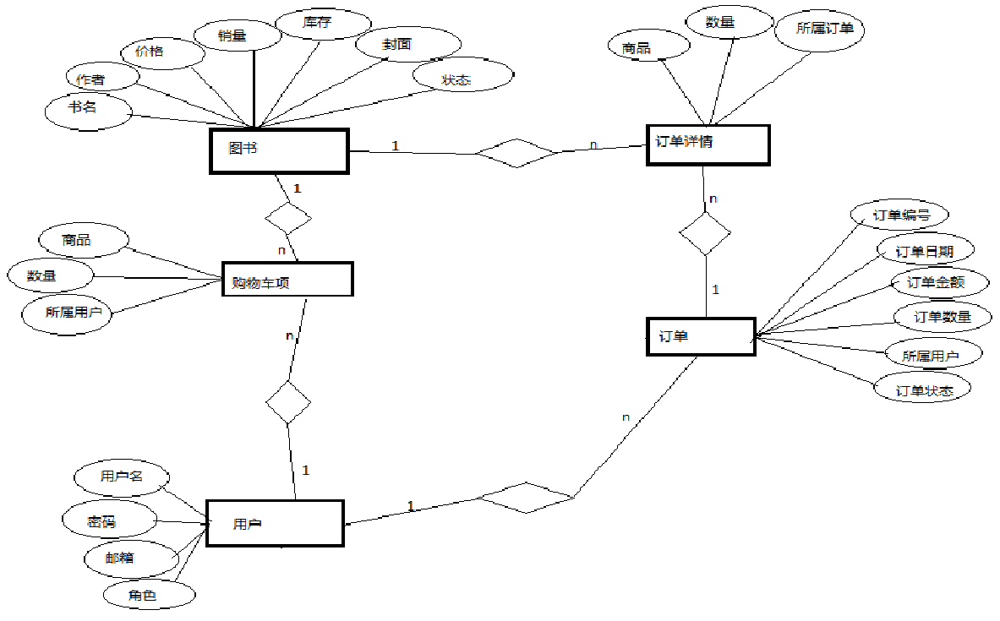

```sql
CREATE DATABASE bookdb CHAR SET utf8;
USE bookdb ;
CREATE TABLE `t_book` (
  `id` int(11) NOT NULL AUTO_INCREMENT,
  `bookImg` varchar(200) NOT NULL,
  `bookName` varchar(20) DEFAULT NULL,
  `price` double(10,2) DEFAULT NULL,
  `author` varchar(20) DEFAULT NULL,
  `saleCount` int(11) DEFAULT NULL,
  `bookCount` int(11) DEFAULT NULL,
  PRIMARY KEY (`id`)
) ENGINE=InnoDB AUTO_INCREMENT=12 DEFAULT CHARSET=utf8;

/*Data for the table `t_book` */

insert  into `t_book`(`id`,`bookImg`,`bookName`,`price`,`author`,`saleCount`,`bookCount`) values (1,'cyuyanrumenjingdian.jpg','C语言入门经典',99.00,'亚历山大',8,197),(2,'santi.jpg','三体',48.95,'周杰伦',18,892),(3,'ailuntulingzhuan.jpg','艾伦图灵传',50.00,'刘若英',12,143),(4,'bainiangudu.jpg','百年孤独',40.00,'王力宏',3,98),(5,'biancheng.jpg','边城',30.00,'刘德华',2,99),(6,'jieyouzahuodian.jpg','解忧杂货店',27.00,'东野圭吾',5,100),(7,'zhongguozhexueshi.jpg','中国哲学史',45.00,'冯友兰',3,100),(8,'huranqiri.jpg','忽然七日',19.00,'劳伦',50,200),(9,'sudongpozhuan.jpg','苏东坡传',20.00,'林语堂',50,300),(10,'fusang.jpg','扶桑',20.00,'严歌岑',10,89),(11,'geihaizideshi.jpg','给孩子的诗',23.00,'北岛',5,99);


CREATE TABLE `t_user` (
  `id` int(11) NOT NULL AUTO_INCREMENT,
  `uname` varchar(20) NOT NULL,
  `pwd` varchar(32) NOT NULL,
  `email` varchar(100) DEFAULT NULL,
  `role` int(11) DEFAULT NULL,
  PRIMARY KEY (`id`),
  UNIQUE KEY `uname` (`uname`)
) ENGINE=InnoDB AUTO_INCREMENT=17 DEFAULT CHARSET=utf8;

/*Data for the table `t_user` */

insert  into `t_user`(`id`,`uname`,`pwd`,`email`,`role`) values (1,'lina','ok','lina@sina.com.cn',0),(2,'kate','ok','hello_kate@126.com',1),(3,'鸠摩智','ok','jiujiu@126.com',0),(4,'宝2021','ok','bao2021@sohu.com.cn',0),(5,'宝2022','123','bao2022@sohu.com.cn',0);


/*Table structure for table `t_cart_item` */

CREATE TABLE `t_cart_item` (
  `id` int(11) NOT NULL AUTO_INCREMENT,
  `book` int(11) DEFAULT NULL,
  `buyCount` int(11) DEFAULT NULL,
  `userBean` int(11) DEFAULT NULL,
  PRIMARY KEY (`id`),
  KEY `FK_cart_book` (`book`),
  KEY `FK_cart_user` (`userBean`),
  CONSTRAINT `FK_cart_book` FOREIGN KEY (`book`) REFERENCES `t_book` (`id`),
  CONSTRAINT `FK_cart_user` FOREIGN KEY (`userBean`) REFERENCES `t_user` (`id`)
) ENGINE=InnoDB AUTO_INCREMENT=21 DEFAULT CHARSET=utf8;

/*Data for the table `t_cart_item` */

insert  into `t_cart_item`(`id`,`book`,`buyCount`,`userBean`) values (9,1,1,2),(10,5,1,1),(11,1,2,1),(12,2,13,1),(13,3,2,1),(14,4,1,1),(15,6,1,1),(16,7,1,1),(17,8,1,1),(18,9,1,1),(19,10,1,1),(20,11,4,1);

/*Table structure for table `t_order` */

CREATE TABLE `t_order` (
  `id` int(11) NOT NULL AUTO_INCREMENT,
  `orderNo` varchar(128) NOT NULL,
  `orderDate` datetime DEFAULT NULL,
  `orderUser` int(11) DEFAULT NULL,
  `orderMoney` double(10,2) DEFAULT NULL,
  `orderStatus` int(11) DEFAULT NULL,
  PRIMARY KEY (`id`),
  UNIQUE KEY `orderNo` (`orderNo`),
  KEY `FK_order_user` (`orderUser`),
  CONSTRAINT `FK_order_user` FOREIGN KEY (`orderUser`) REFERENCES `t_user` (`id`)
) ENGINE=InnoDB AUTO_INCREMENT=12 DEFAULT CHARSET=utf8;

/*Data for the table `t_order` */

insert  into `t_order`(`id`,`orderNo`,`orderDate`,`orderUser`,`orderMoney`,`orderStatus`) values (4,'5eaab6146dc54e0482fdb8b6120c229b_20211025112519','2021-10-25 11:25:20',1,506.90,0),(5,'f5a22aac925d42eabc6b49c45a3eb74f_20211025113004','2021-10-25 11:30:04',1,48.95,0),(6,'8a245df4359e4224b531cf121c4acab3_20211025113019','2021-10-25 11:30:20',1,0.00,0),(7,'b521cd49ab2943f0bbc0630c95978f1c_20211025113039','2021-10-25 11:30:40',1,48.95,0),(8,'d4f366a82cd4491c9899b181753804b4_20211025113151','2021-10-25 11:31:52',1,48.95,0),(9,'8f5869a839f4483e947bd2c3163f3c23_20211025113159','2021-10-25 11:31:59',1,48.95,0),(10,'c5fcd95dbe7f49669f96b4ad6444ae6b_20211025120531','2021-10-25 12:05:32',1,147.95,0),(11,'6240ec3e5ac04e3583e1beb75a9e94ec_20211025120542','2021-10-25 12:05:42',1,147.95,0);

/*Table structure for table `t_order_item` */

CREATE TABLE `t_order_item` (
  `id` int(11) NOT NULL AUTO_INCREMENT,
  `book` int(11) DEFAULT NULL,
  `buyCount` int(11) DEFAULT NULL,
  `orderBean` int(11) DEFAULT NULL,
  PRIMARY KEY (`id`),
  KEY `FK_detail_book` (`book`),
  KEY `FK_detail_order` (`orderBean`),
  CONSTRAINT `FK_detail_book` FOREIGN KEY (`book`) REFERENCES `t_book` (`id`),
  CONSTRAINT `FK_detail_order` FOREIGN KEY (`orderBean`) REFERENCES `t_order` (`id`)
) ENGINE=InnoDB AUTO_INCREMENT=19 DEFAULT CHARSET=utf8;

/*Data for the table `t_order_item` */

insert  into `t_order_item`(`id`,`book`,`buyCount`,`orderBean`) values (6,1,1,4),(7,2,2,4),(8,10,1,4),(9,3,5,4),(10,4,1,4),(11,2,1,5),(12,2,1,7),(13,2,1,8),(14,2,1,9),(15,1,1,10),(16,2,1,10),(17,1,1,11),(18,2,1,11);
```


## 登录功能实现

### pojo
```java
public class Book {
    private Integer id;
    private String bookImg;
    private String bookName;
    private Double price;
    private String author;
    private Integer saleCount;
    private Integer bookCount;
    private Integer bookStatus = 0;
    // ...
```

```java
//我们应该还需要设计一个Cart类，代表购物车这个实体
public class CartItem {
    private Integer id;
    private Book book;
    private Integer buyCount;
    private User uesr;
    // ...
```

```java
public class OrderBean {
    private Integer id;
    private String orderNo;
    private Date orderDate;
    private User orderUser;
    private Double orderMoney;
    private Integer orderStatus;

    private List<OrderItem> orderItemList; // 1:N
    // ...
```

```java
public class OrderItem {
    private Integer id;
    private Book book; // M:1
    private Integer buyCount;
    private OrderBean orderBean; // M:1
    // ...
```

```java
public class User {
    private Integer id;
    private String uname;
    private String pwd;
    private String email;
    private Integer role;
    // ...
```

### dao
```java
public interface UserDAO {
    User getUser(String uname, String pwd);
}
```

```java
public class UserDAOImpl extends BaseDAO<User> implements UserDAO {
    @Override
    public User getUser(String uname, String pwd) {
        return load("select * from t_user where uname like ? and pwd like ? ", uname, pwd);
    }
}
```

### service
```java
public interface UserService {
    User login(String uname, String pwd);
}
```

```java
public class UserServiceImpl implements UserService {
    private UserDAO userDAO;
    @Override
    public User login(String uname, String pwd) {
        return userDAO.getUser(uname, pwd);
    }
}
```

### controller
```java
public class UserController {
    private UserService userService;
    public String login(String uname, String pwd) {
        User user = userService.login(uname, pwd);
        System.out.println("user = " + user);
        return "index";
    }
}
```

### HTML
login.html
```html
<form th:action="@{/user.do}" method="post">
    <input type="hidden" name="operate" value="login"/>
    <label>用户名称：</label>
    <input class="itxt" type="text" placeholder="请输入用户名" autocomplete="off" tabindex="1" name="uname" id="username" value="lina" />
    <br /><br />
    <label>用户密码：</label>
    <input class="itxt" type="password" placeholder="请输入密码" autocomplete="off" tabindex="1" name="pwd" id="password" value="ok"/>
    <br /><br />
    <input type="submit" value="登录" id="sub_btn" />
</form>
```


## 展示图书列表、添加展示购物车、结账、查看订单
1. 首页展示图书列表
   - 新建BookDAO、BookDAOImpl：getBookList()
   - 新建BookService、BookServiceImpl：getBookList()
   - 新建BookController：index()
   - 编辑index.html
2. 首页上登录成功之后显示欢迎语和购物车数量
3. 点击具体图书的添加到购物车按钮
4. 购物车详情
5. 结账
   - 订单表添加一条记录
   - 订单详情表添加7条记录
   - 购物车项表中需要删除对应的7条记录
6. 关于订单信息中的订单数量问题
7. 编辑购物车
8. 关于金额的精度问题
9. 过滤器判断是否是合法用户：
   - 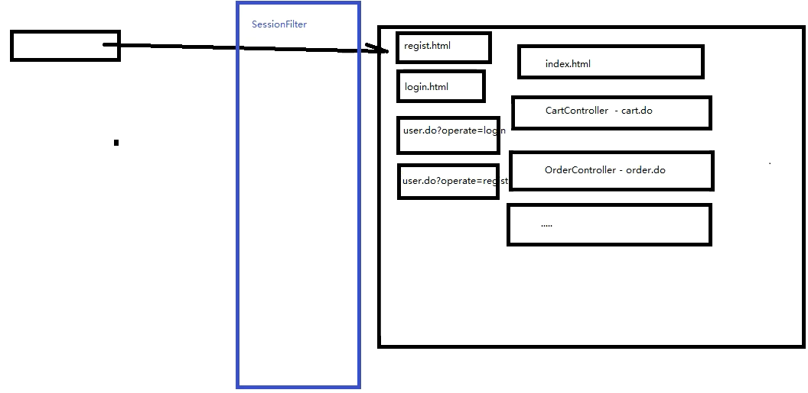
   - 解决方法：新建SessionFilter，用来判断session中是否保存了currUser
   - 如果没有currUser，表明当前不是一个登录合法的用户，应该跳转到登录页面让其登录
   - 现在添加了过滤器之后，出现了如下错误：
     - localhost 将您重定向的次数过多。尝试清除 Cookie. ERR_TOO_MANY_REDIRECTS

### web主要部分代码
index.html
```html
<script language="JavaScript" th:src="@{/static/script/index.js}"></script>
<div class="topbar-right" th:if="${session.currUser==null}">
    <a href="user/login.html" class="login">登录</a>
    <a href="user/regist.html" class="register">注册</a>
    <a href="cart/cart.html" class="cart iconfont icon-gouwuche">
        购物车
        <div class="cart-num">0</div>
    </a>
    <a href="manager/book_manager.html" class="admin">后台管理</a>
</div>
<div class="topbar-right" th:unless="${session.currUser==null}">
    <!--登录后风格-->
    <span>欢迎你<b th:text="${session.currUser.getUname()}">张总</b></span>
    <a href="#" class="register">注销</a>
    <a th:href="@{/cart.do}" class="cart iconfont icon-gouwuche">
        购物车
        <div class="cart-num" th:text="${session.currUser.cart.totalCount}">3</div>
    </a>
    <a href="./pages/manager/book_manager.html" class="admin">后台管理</a>
</div>
```

index.js
```javascript
function addCart(bookId){
    window.location.href='cart.do?operate=addCart&bookId='+bookId;
}
```

order.html
```html
<h3>欢迎<span th:text="${session.currUser.uname}">张总</span>光临尚硅谷书城</h3>
<div class="order"><a th:href="@{/order.do(operate='getOrderList')}">我的订单</a></div>

<tr th:each="orderBean : ${session.currUser.orderList}" th:object="${orderBean}">
    <td th:text="*{orderNo}">12354456895</td>
    <td th:text="*{orderDate}">
    2015.04.23
    </td>
    <td th:text="*{orderMoney}">90.00</td>
    <td th:text="*{totalBookCount}">88</td>
    <td><a href="" class="send">等待发货</a></td>
    <td><a href="">查看详情</a></td>
</tr>
```

cart.html
```html
<script language="JavaScript" th:src="@{/static/script/cart.js}"></script>

<h3>欢迎<span th:text="${session.currUser.uname}">张总</span>光临尚硅谷书城</h3>
<div class="order"><a th:href="@{/order.do(operate='getOrderList')}">我的订单</a></div>

<tr th:each="cartItem : ${session.currUser.cart.cartItemMap.values()}">
    <td>
    
    </td>
    <td th:text="${cartItem.book.bookName}">活着</td>
    <td>
    <span class="count" th:onclick="|editCart(${cartItem.id} , ${cartItem.buyCount-1})|">-</span>
    <input class="count-num" type="text" value="1" th:value="${cartItem.buyCount}"/>
    <span class="count" th:onclick="|editCart(${cartItem.id} , ${cartItem.buyCount+1})|">+</span>
    </td>
    <td th:text="${cartItem.book.price}">36.8</td>
    <td th:text="${cartItem.xj}">36.8</td>
    <td><a href="">删除</a></td>
</tr>

<div>共<span th:text="${session.currUser.cart.totalBookCount}">3</span>件商品</div>
<div class="total-price">总金额<span th:text="${session.currUser.cart.totalMoney}">99.9</span>元</div>
<a class="pay" th:href="@{/order.do(operate='checkout')}">去结账</a>
```

cart.js
```javascript
function editCart(cartItemId , buyCount){
    window.location.href='cart.do?operate=editCart&cartItemId='+cartItemId+"&buyCount="+buyCount;
}
```

### Filter
```java
@WebFilter(urlPatterns = { "*.do", "*.html" }, initParams = {
        @WebInitParam(name = "bai", value = "/pro25/page.do?operate=page&page=user/login,/pro25/user.do?null")
})
public class SessionFilter implements Filter {
    List<String> baiList = null;

    @Override
    public void init(FilterConfig config) throws ServletException {
        String bai = config.getInitParameter("bai");
        String[] baiArr = bai.split(",");
        baiList = Arrays.asList(baiArr);
    }

    @Override
    public void doFilter(ServletRequest servletRequest, ServletResponse servletResponse, FilterChain filterChain)
            throws IOException, ServletException {
        HttpServletRequest request = (HttpServletRequest) servletRequest;
        HttpServletResponse response = (HttpServletResponse) servletResponse;

        // http://localhost:8080/pro25/page.do?operate=page&page=user/login
        System.out.println("request.getRequestURI() = " + request.getRequestURI());
        System.out.println("request.getQueryString() = " + request.getQueryString());

        String uri = request.getRequestURI();
        String queryString = request.getQueryString();
        String str = uri + "?" + queryString;
        if (baiList.contains(str)) {
            filterChain.doFilter(request, response);
        } else {
            HttpSession session = request.getSession();
            Object currUserObj = session.getAttribute("currUser");

            if (currUserObj == null) {
                response.sendRedirect("page.do?operate=page&page=user/login");
            } else {
                filterChain.doFilter(request, response);
            }
        }
    }
    @Override
    public void destroy() {}
}
```

### Controller
```java
public class BookController {
    private BookService bookService;
    public String index(HttpSession session) {
        List<Book> bookList = bookService.getBookList();
        session.setAttribute("bookList", bookList);
        return "index";
    }
}
```

```java
public class CartController {
    private CartItemService cartItemService;
    // 加载当前用户的购物车信息
    public String index(HttpSession session) {
        User user = (User) session.getAttribute("currUser");
        Cart cart = cartItemService.getCart(user);
        user.setCart(cart);
        session.setAttribute("currUser", user);
        return "cart/cart";
    }
    public String addCart(Integer bookId, HttpSession session) {
        User user = (User) session.getAttribute("currUser");
        CartItem cartItem = new CartItem(new Book(bookId), 1, user);
        // 将指定的图书添加到当前用户的购物车中
        cartItemService.addOrUpdateCartItem(cartItem, user.getCart());
        return "redirect:cart.do";
    }
    public String editCart(Integer cartItemId, Integer buyCount) {
        cartItemService.updateCartItem(new CartItem(cartItemId, buyCount));
        return "redirect:cart.do";
    }
}
```

```java
public class OrderController {
    private OrderService orderService;
    // 结账
    public String checkout(HttpSession session) {
        OrderBean orderBean = new OrderBean();
        Date now = new Date();
        int year = now.getYear();
        int month = now.getMonth();
        int day = now.getDate();
        int hour = now.getHours();
        int min = now.getMinutes();
        int sec = now.getSeconds();
        orderBean.setOrderNo(UUID.randomUUID().toString() + "_" + year + month + day + hour + min + sec);
        orderBean.setOrderDate(now);
        User user = (User) session.getAttribute("currUser");
        orderBean.setOrderUser(user);
        orderBean.setOrderMoney(user.getCart().getTotalMoney());
        orderBean.setOrderStatus(0);
        orderService.addOrderBean(orderBean);
        return "index";
    }
    // 查看订单列表
    public String getOrderList(HttpSession session) {
        User user = (User) session.getAttribute("currUser");
        List<OrderBean> orderList = orderService.getOrderList(user);
        user.setOrderList(orderList);
        session.setAttribute("currUser", user);
        return "order/order";
    }
}
```

```java
public class UserController {
    private UserService userService;
    private CartItemService cartItemService;

    public String login(String uname, String pwd, HttpSession session) {
        User user = userService.login(uname, pwd);
        if (user != null) {
            Cart cart = cartItemService.getCart(user);
            user.setCart(cart);
            session.setAttribute("currUser", user);
            return "redirect:book.do";
        }
        return "user/login";
    }
}
```

### Service
```java
public interface BookService {
    List<Book> getBookList();
    Book getBook(Integer id);
}

public class BookServiceImpl implements BookService {
    private BookDAO bookDAO;
    @Override
    public List<Book> getBookList() {
        return bookDAO.getBookList();
    }
    @Override
    public Book getBook(Integer id) {
        return bookDAO.getBook(id);
    }
}
```

```java
public interface CartItemService {
    void addCartItem(CartItem cartItem);
    void updateCartItem(CartItem cartItem);
    void addOrUpdateCartItem(CartItem cartItem, Cart cart);
    // 获取指定用户的所有购物车项列表（需要注意的是，这个方法内部查询的时候，会将book的详细信息设置进去）
    List<CartItem> getCartItemList(User user);
    // 加载特定用户的购物车信息
    Cart getCart(User user);
}

public class CartItemServiceImpl implements CartItemService {
    private CartItemDAO cartItemDAO;
    private BookService bookService;

    @Override
    public void addCartItem(CartItem cartItem) {
        cartItemDAO.addCartItem(cartItem);
    }

    @Override
    public void updateCartItem(CartItem cartItem) {
        cartItemDAO.updateCartItem(cartItem);
    }

    @Override
    public void addOrUpdateCartItem(CartItem cartItem, Cart cart) {
        // 1.如果当前用户的购物车中已经存在这个图书了，那么将购物车中这本图书的数量+1
        // 2.否则，在我的购物车中新增一个这本图书的CartItem，数量是1
        // 判断当前用户的购物车中是否有这本书的CartItem，有->update , 无->add
        if (cart != null) {
            Map<Integer, CartItem> cartItemMap = cart.getCartItemMap();
            if (cartItemMap == null) {
                cartItemMap = new HashMap<>();
            }

            if (cartItemMap.containsKey(cartItem.getBook().getId())) {
                CartItem cartItemTemp = cartItemMap.get(cartItem.getBook().getId());
                cartItemTemp.setBuyCount(cartItemTemp.getBuyCount() + 1);
                updateCartItem(cartItemTemp);
            } else {
                addCartItem(cartItem);
            }
        } else { // 连购物车都没有的情况
            addCartItem(cartItem);
        }
    }

    @Override
    public List<CartItem> getCartItemList(User user) {
        List<CartItem> cartItemList = cartItemDAO.getCartItemList(user);
        for (CartItem cartItem : cartItemList) {
            Book book = bookService.getBook(cartItem.getBook().getId());
            cartItem.setBook(book);
        }

        return cartItemList;
    }

    @Override
    public Cart getCart(User user) {
        List<CartItem> cartItemList = getCartItemList(user);
        Map<Integer, CartItem> cartItemMap = new HashMap<>();
        for (CartItem cartItem : cartItemList) {
            cartItemMap.put(cartItem.getBook().getId(), cartItem);
        }
        Cart cart = new Cart();
        cart.setCartItemMap(cartItemMap);

        return cart;
    }
}
```

```java
public interface OrderService {
    void addOrderBean(OrderBean orderBean);
    List<OrderBean> getOrderList(User user);
}

public class OrderServiceImpl implements OrderService {
    private OrderDAO orderDAO;
    private OrderItemDAO orderItemDAO;
    private CartItemDAO cartItemDAO;

    @Override
    public void addOrderBean(OrderBean orderBean) {
        // 1) 订单表添加一条记录
        // 2) 订单详情表添加7条记录
        // 3) 购物车项表中需要删除对应的7条记录
        // 第1步：
        orderDAO.addOrderBean(orderBean); // 执行完这一步，orderBean中的id是有值的
        // 第2步：
        // orderBean中的orderItemList是空的，此处我们应该根据用户的购物车中的购物车项去转换成一个一个的订单项
        User currUser = orderBean.getOrderUser();
        Map<Integer, CartItem> cartItemMap = currUser.getCart().getCartItemMap();
        for (CartItem cartItem : cartItemMap.values()) {
            OrderItem orderItem = new OrderItem();
            orderItem.setBook(cartItem.getBook());
            orderItem.setBuyCount(cartItem.getBuyCount());
            orderItem.setOrderBean(orderBean);
            orderItemDAO.addOrderItem(orderItem);
        }
        // 第3步：
        for (CartItem cartItem : cartItemMap.values()) {
            cartItemDAO.delCartItem(cartItem);
        }
    }

    @Override
    public List<OrderBean> getOrderList(User user) {
        List<OrderBean> orderBeanList = orderDAO.getOrderList(user);

        for (OrderBean orderBean : orderBeanList) {
            Integer totalBookCount = orderDAO.getOrderTotalBookCount(orderBean);
            orderBean.setTotalBookCount(totalBookCount);
        }

        return orderBeanList;
    }
}
```

### DAO
```java
public interface BookDAO {
    List<Book> getBookList();
    Book getBook(Integer id);
}

public class BookDAOImpl extends BaseDAO<Book> implements BookDAO {
    @Override
    public List<Book> getBookList() {
        return executeQuery("select * from t_book where bookStatus=0");
    }
    @Override
    public Book getBook(Integer id) {
        return load("select * from t_book where id = ? ", id);
    }
}
```

```java
public interface CartItemDAO {
    // 新增购物车项
    void addCartItem(CartItem cartItem);
    // 修改特定的购物车项
    void updateCartItem(CartItem cartItem);
    // 获取特定用户的所有购物车项
    List<CartItem> getCartItemList(User user);
    // 删除特定的购物车项
    void delCartItem(CartItem cartItem);
}

public class CartItemDAOImpl extends BaseDAO<CartItem> implements CartItemDAO {
    @Override
    public void addCartItem(CartItem cartItem) {
        executeUpdate("insert into t_cart_item values(0,?,?,?)", cartItem.getBook().getId(), cartItem.getBuyCount(),
                cartItem.getUserBean().getId());
    }
    @Override
    public void updateCartItem(CartItem cartItem) {
        executeUpdate("update t_cart_item set buyCount = ? where id = ? ", cartItem.getBuyCount(), cartItem.getId());
    }
    @Override
    public List<CartItem> getCartItemList(User user) {
        return executeQuery("select * from t_cart_item where userBean = ? ", user.getId());
    }
    @Override
    public void delCartItem(CartItem cartItem) {
        super.executeUpdate("delete from t_cart_item where id = ?", cartItem.getId());
    }
}
```

```java
public interface OrderDAO {
    // 添加订单
    void addOrderBean(OrderBean orderBean);
    // 获取指定用户的订单列表
    List<OrderBean> getOrderList(User user);
    Integer getOrderTotalBookCount(OrderBean orderBean);
}

public class OrderDAOImpl extends BaseDAO<OrderBean> implements OrderDAO {
    @Override
    public void addOrderBean(OrderBean orderBean) {
        int orderBeanId = super.executeUpdate("insert into t_order values(0,?,?,?,?,?)", orderBean.getOrderNo(),
                orderBean.getOrderDate(), orderBean.getOrderUser().getId(), orderBean.getOrderMoney(),
                orderBean.getOrderStatus());
        orderBean.setId(orderBeanId);
        // 思考： 此处为什么需要接受executeUpdate的返回值，然后设置到OrderBean中的id属性上？
    }

    @Override
    public List<OrderBean> getOrderList(User user) {
        return executeQuery("SELECT * FROM t_order WHERE orderUser = ?", user.getId());
    }

    @Override
    public Integer getOrderTotalBookCount(OrderBean orderBean) {
        String sql = "SELECT SUM(t3.buyCount) AS totalBookCount , t3.orderBean FROM " +
                "(" +
                "SELECT t1.id , t2.buyCount , t2.orderBean FROM t_order t1 INNER JOIN t_order_item t2 " +
                "ON t1.id = t2.orderBean WHERE t1.orderUser = ? " +
                ") t3 WHERE t3.orderBean = ? GROUP BY t3.orderBean";
        return ((BigDecimal) executeComplexQuery(sql, orderBean.getOrderUser().getId(), orderBean.getId())[0])
                .intValue();
    }
}
```

```java
public interface OrderItemDAO {
    // 添加订单项
    void addOrderItem(OrderItem orderItem);
}

public class OrderItemDAOImpl extends BaseDAO<OrderItem> implements OrderItemDAO {
    @Override
    public void addOrderItem(OrderItem orderItem) {
        super.executeUpdate("insert into t_order_item values(0,?,?,?)", orderItem.getBook().getId(),
                orderItem.getBuyCount(), orderItem.getOrderBean().getId());
    }
}
```

### pojo
```java
public class User {
    private Cart cart;
    private List<OrderBean> orderList; // 1:N
    // ...
```

```java
public class OrderBean {
    private Integer totalBookCount;
    // ...
```

```java
//我们应该还需要设计一个Cart类，代表购物车这个实体
public class CartItem {
    private Double xj;
    public Double getXj() {
        BigDecimal bigDecimalPrice = new BigDecimal("" + getBook().getPrice());
        BigDecimal bigDecimalBuyCount = new BigDecimal("" + buyCount);
        BigDecimal bigDecimalXJ = bigDecimalPrice.multiply(bigDecimalBuyCount);
        xj = bigDecimalXJ.doubleValue();
        return xj;
    }
    // ...
```

```java
public class Cart {
    private Map<Integer, CartItem> cartItemMap; // 购物车中购物车项的集合 , 这个Map集合中的key是Book的id
    private Double totalMoney; // 购物车的总金额
    private Integer totalCount; // 购物车中购物项的数量
    private Integer totalBookCount; // 购物车中书本的总数量，而不是购物车项的总数量

    public Map<Integer, CartItem> getCartItemMap() {
        return cartItemMap;
    }

    public void setCartItemMap(Map<Integer, CartItem> cartItemMap) {
        this.cartItemMap = cartItemMap;
    }

    public Double getTotalMoney() {
        totalMoney = 0.0;
        if (cartItemMap != null && cartItemMap.size() > 0) {
            Set<Map.Entry<Integer, CartItem>> entries = cartItemMap.entrySet();
            for (Map.Entry<Integer, CartItem> cartItemEntry : entries) {
                CartItem cartItem = cartItemEntry.getValue();
                totalMoney = totalMoney + cartItem.getBook().getPrice() * cartItem.getBuyCount();
            }
        }
        return totalMoney;
    }

    public Integer getTotalCount() {
        totalCount = 0;
        if (cartItemMap != null && cartItemMap.size() > 0) {
            totalCount = cartItemMap.size();
        }
        return totalCount;
    }

    public Integer getTotalBookCount() {
        totalBookCount = 0;
        if (cartItemMap != null && cartItemMap.size() > 0) {
            for (CartItem cartItem : cartItemMap.values()) {
                totalBookCount = totalBookCount + cartItem.getBuyCount();
            }
        }
        return totalBookCount;
    }
}
```


## Cookie了解

### 1、HTTP协议和会话控制
HTTP协议本身是无状态的。单靠HTTP协议本身无法判断一个请求来自于哪一个浏览器，所以也就没法识别用户的身份状态。
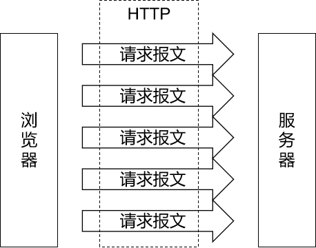

### 2、Cookie介绍
1. 本质
   - 在浏览器端临时存储数据
   - 键值对
   - 键和值都是字符串类型
   - 数据量很小
2. Cookie在浏览器和服务器之间的传递
   - 没有Cookie的状态：在服务器端没有创建Cookie并返回的情况下，浏览器端不会保存Cookie信息。双方在请求和响应的过程中也不会携带Cookie的数据。
   - 创建Cookie对象并返回
        ```java
        // 1.创建Cookie对象
        Cookie cookie = new Cookie("cookie-message", "hello-cookie");
        // 2.将Cookie对象添加到响应中
        response.addCookie(cookie);
        // 3.返回响应
        // processTemplate("page-target", request, response);
        request.getRequestDispatcher("hello.html").forward(request, response);
        ```
   - 服务器端返回Cookie的响应消息头 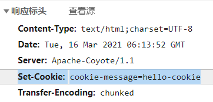
   - 浏览器拿到Cookie之后，以后的每一个请求都会携带Cookie信息。 
   - 服务器端读取Cookie的信息
    ```java
        // 1.通过request对象获取Cookie的数组
        Cookie[] cookies = request.getCookies();
        // 2.遍历数组
        for (Cookie cookie : cookies) {
            System.out.println("cookie.getName() = " + cookie.getName());
            System.out.println("cookie.getValue() = " + cookie.getValue());
            System.out.println();
        }
        ```
3. Cookie时效性
   - 理论
     - 会话级Cookie
       - 服务器端并没有明确指定Cookie的存在时间
       - 在浏览器端，Cookie数据存在于内存中
       - 只要浏览器还开着，Cookie数据就一直都在
       - 浏览器关闭，内存中的Cookie数据就会被释放
     - 持久化Cookie
       - 服务器端明确设置了Cookie的存在时间
       - 在浏览器端，Cookie数据会被保存到硬盘上
       - Cookie在硬盘上存在的时间根据服务器端限定的时间来管控，不受浏览器关闭的影响
       - 持久化Cookie到达了预设的时间会被释放
     - 服务器端返回Cookie时附带过期时间的响应消息头如下：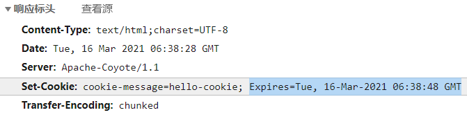
     - 服务器通知浏览器删除Cookie时的响应消息头如下：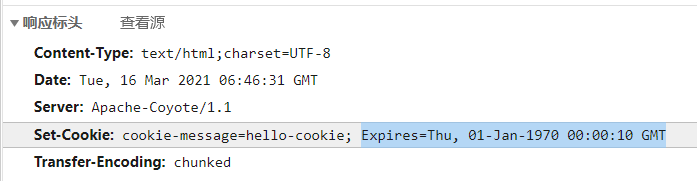
   - 代码
   ```java
    // ※给Cookie设置过期时间
    // 正数：Cookie的过期时间，以秒为单位
    // 负数：表示这个Cookie是会话级的Cookie，浏览器关闭时释放
    // 0：通知浏览器立即删除这个Cookie
    cookie.setMaxAge(20);
    ```
   - 会话和持久化Cookie对比 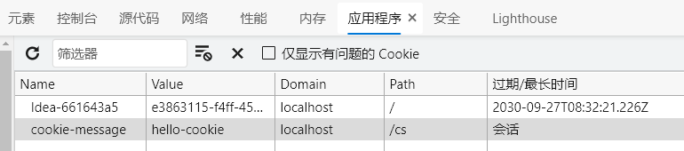
4. Cookie的domain和path
    上网时间长了，本地会保存很多Cookie。对浏览器来说，访问互联网资源时不能每次都把所有Cookie带上。浏览器会使用Cookie的domain和path属性值来和当前访问的地址进行比较，从而决定是否携带这个Cookie。
    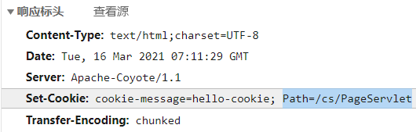


## 注册页面-验证码

### HTML
```html
<form th:action="@{/user.do}" method="post">
    <input type="hidden" name="operate" value="regist" />
    <div class="form-item">
        <div>
        <label>用户名称:</label>
        <input type="text" placeholder="请输入用户名" name="uname" value="宝2023" />
        </div>
        <span class="errMess">用户名应为6~16位数字和字母组成</span>
    </div>
    <div class="form-item">
        <div>
        <label>用户密码:</label>
        <input type="password" placeholder="请输入密码" name="pwd" value="ok" />
        </div>
        <span class="errMess">密码的长度至少为8位</span>
    </div>
    <div class="form-item">
        <div>
        <label>确认密码:</label>
        <input type="password" placeholder="请输入确认密码" value="ok" />
        </div>
        <span class="errMess">密码两次输入不一致</span>
    </div>
    <div class="form-item">
        <div>
        <label>用户邮箱:</label>
        <input type="text" placeholder="请输入邮箱" name="email" value="bao@126.com" />
        </div>
        <span class="errMess">请输入正确的邮箱格式</span>
    </div>
    <div class="form-item">
        <div>
        <label>验证码:</label>
        <div class="verify">
            <input type="text" name="verifyCode" placeholder="" />
            
        </div>
        </div>
        <span class="errMess">请输入正确的验证码</span>
    </div>
    <button class="btn">注册</button>
</form>
```

web.xml
```xml
<servlet>
    <servlet-name>KaptchaServlet</servlet-name>
    <servlet-class>com.google.code.kaptcha.servlet.KaptchaServlet</servlet-class>
    <init-param>
        <param-name>kaptcha.border.color</param-name>
        <param-value>red</param-value>
    </init-param>
    <init-param>
        <param-name>kaptcha.textproducer.char.string</param-name>
        <param-value>abcdefg</param-value>
    </init-param>
    <init-param>
        <param-name>kaptcha.noise.impl</param-name>
        <param-value>com.google.code.kaptcha.impl.NoNoise</param-value>
    </init-param>
    <init-param>
        <param-name>kaptcha.image.width</param-name>
        <param-value>120</param-value>
    </init-param>
    <init-param>
        <param-name>kaptcha.image.height</param-name>
        <param-value>40</param-value>
    </init-param>
    <init-param>
        <param-name>kaptcha.textproducer.font.size</param-name>
        <param-value>28</param-value>
    </init-param>
</servlet>
<servlet-mapping>
    <servlet-name>KaptchaServlet</servlet-name>
    <url-pattern>/kaptch.jpg</url-pattern>
</servlet-mapping>
```

### Java
```java
public class UserController {
    public String regist(String verifyCode, String uname, String pwd, String email, HttpSession session,
            HttpServletResponse response) throws IOException {
        Object kaptchaCodeObj = session.getAttribute("KAPTCHA_SESSION_KEY");
        if (kaptchaCodeObj == null || !verifyCode.equals(kaptchaCodeObj)) {
            response.setCharacterEncoding("UTF-8");
            response.setContentType("text/html;charset=UTF-8");
            PrintWriter out = response.getWriter();
            // out.println("<script
            // language='javascript'>alert('验证码不正确！');window.location.href='page.do?operate=page&page=user/regist';</script>");
            out.println("<script language='javascript'>alert('验证码不正确！');</script>");
            // return "user/regist";
            return "user/regist";
        } else {
            if (verifyCode.equals(kaptchaCodeObj)) {
                userService.regist(new User(uname, pwd, email, 0));
                return "user/login";
            }
        }
        return "user/login";
    }
}
```

```java
public class UserServiceImpl implements UserService {
    @Override
    public void regist(User user) {
        userDAO.addUser(user);
    }
    // ...
```

```java
public class UserDAOImpl extends BaseDAO<User> implements UserDAO {
    @Override
    public void addUser(User user) {
        executeUpdate("insert into t_user values(0,?,?,?,0)", user.getUname(), user.getPwd(), user.getEmail());
    }
    // ...
```


## 正则表达式快速了解
[JS&正则表达式](./JS&正则表达式.md)

1. 正则表达式的使用三步骤：
   1. 定义正则表达式对象（两个方式）
      1. 对象形式 var reg = new RegExp("abc")
      2. 直接量形式 var reg = /abc/;
   2. 匹配模式：
      - g 全局匹配
      - i 忽略大小写匹配
      - m 多行匹配
      - gim这三个可以组合使用，不区分先后顺序
            例如：var reg = /abc/gim, var reg = new RegExp("abc", "gim");
   3. 定义待校验的字符串
   4. 校验
2. 元字符  `. , \w , \W , \s , \S , \d , \D , \b , ^ , $`
3. []表示集合
   - `[abc]` 表示a或者b或者c
   - `[^abc]` 表示取反，只要不是a不是b不是c就匹配
   - `[a-c]` 表示a到c这个范围匹配
4. 出现的次数
   - `*` 表示多次（0 ~n）
   - `+` 至少一次（>=1）
   - `?` 最多一次（0~1）
   - `{n}` 出现n次
   - `{n,}` 出现n次或者多次
   - `{n,m}` 出现n到m次


## 注册页面的表单验证、判断用户名是否被注册
1. 注册页面表单验证
   1. form有一个事件 onsubmit
      - onsubmit="return false"，那么表单点击提交按钮时不会提交
      - onsubmit="return true"，那么表单点击提交按钮时会提交
   2. 获取文档中某一个节点的方式：
        ```javascript
        //DOM:Document
        //var unameTxt = document.getElementById("unameTxt");
        //BOM:Browser
        //document.forms[0].uname
        ```
2. 原生的Ajax（了解）
   1. 客户端发送异步请求；并绑定对结果处理的回调函数
      1. `<input type="text" name="uname" onblur="ckUname()"/>`
      2. 定义ckUname方法：
         - 创建XMLHttpRequest对象
         - XMLHttpRequest对象操作步骤：
         - open(url, "GET", true)
         - onreadyStateChange 设置回调
         - send() 发送请求
       - 在回调函数中需要判断XMLHttpRequest对象的状态:
         - readyState(0-4), status(200)
   2. 服务器端做校验，然后将校验结果响应给客户端

### web
regist.html
```html
<script language="JavaScript" th:src="@{/static/script/regist.js}"></script>

<form th:action="@{/user.do}" method="post" onsubmit="return preRegist() ;">
    <input type="hidden" name="operate" value="regist"/>
    <div class="form-item">
    <div>
        <label>用户名称:</label>
        <input id="unameTxt" type="text" placeholder="请输入用户名" name="uname" value="hello2022" onblur="ckUname(this.value)"/>
    </div>
    <span id="unameSpan" class="errMess">用户名应为6~16位数字和字母组成</span>
    </div>
    <div class="form-item">
    <div>
        <label>用户密码:</label>
        <input id="pwdTxt" type="password" placeholder="请输入密码" name="pwd" value="ok"/>
    </div>
    <span id="pwdSpan" class="errMess">密码的长度至少为8位</span>
    </div>
    <div class="form-item">
    <div>
        <label>确认密码:</label>
        <input id="pwdTxt2" type="password" placeholder="请输入确认密码" value="ok"/>
    </div>
    <span id="pwdSpan2" class="errMess">密码两次输入不一致</span>
    </div>
    <div class="form-item">
    <div>
        <label>用户邮箱:</label>
        <input id="emailTxt" type="text" placeholder="请输入邮箱" name="email" value="bao@126.com"/>
    </div>
    <span id="emailSpan" class="errMess">请输入正确的邮箱格式</span>
    </div>
    <div class="form-item">
    <div>
        <label>验证码:</label>
        <div class="verify">
        <input type="text" name="verifyCode" placeholder="" />
        
        </div>
    </div>
    <span class="errMess">请输入正确的验证码</span>
    </div>
    <button class="btn">注册</button>
</form>
```

regist.js
```javascript
function $(id) {
    return document.getElementById(id);
}

function preRegist() {
    //用户名不能为空，而且是6~16位数字和字母组成
    var unameReg = /[0-9a-zA-Z]{6,16}/;
    var unameTxt = $("unameTxt");
    var uname = unameTxt.value;
    var unameSpan = $("unameSpan");
    if (!unameReg.test(uname)) {
        unameSpan.style.visibility = "visible";
        return false;
    } else {
        unameSpan.style.visibility = "hidden";
    }

    //密码的长度至少为8位
    var pwdTxt = $("pwdTxt");
    var pwd = pwdTxt.value;
    var pwdReg = /[\w]{8,}/; // /^(?![0-9]+$)(?![a-zA-Z]+$)[0-9A-Za-z]{8,}$/;
    var pwdSpan = $("pwdSpan");
    if (!pwdReg.test(pwd)) {
        pwdSpan.style.visibility = "visible";
        return false;
    } else {
        pwdSpan.style.visibility = "hidden";
    }

    //密码两次输入不一致
    var pwd2 = $("pwdTxt2").value;
    var pwdSpan2 = $("pwdSpan2");
    if (pwd2 != pwd) {
        pwdSpan2.style.visibility = "visible";
        return false;
    } else {
        pwdSpan2.style.visibility = "hidden";
    }

    //请输入正确的邮箱格式
    var email = $("emailTxt").value;
    var emailSpan = $("emailSpan");
    var emailReg = /^[a-zA-Z0-9_\.-]+@([a-zA-Z0-9-]+[\.]{1})+[a-zA-Z]+$/;
    if (!emailReg.test(email)) {
        emailSpan.style.visibility = "visible";
        return false;
    } else {
        emailSpan.style.visibility = "hidden";
    }

    return true;
}

//如果想要发送异步请求，我们需要一个关键的对象 XMLHttpRequest
var xmlHttpRequest;

function createXMLHttpRequest() {
    if (window.XMLHttpRequest) {
        //符合DOM2标准的浏览器 ，xmlHttpRequest的创建方式
        xmlHttpRequest = new XMLHttpRequest();
    } else if (window.ActiveXObject) {//IE浏览器
        try {
            xmlHttpRequest = new ActiveXObject("Microsoft.XMLHTTP");
        } catch (e) {
            xmlHttpRequest = new ActiveXObject("Msxml2.XMLHTTP")
        }
    }
}

function ckUname(uname) {
    createXMLHttpRequest();
    var url = "user.do?operate=ckUname&uname=" + uname;
    xmlHttpRequest.open("GET", url, true);
    //设置回调函数
    xmlHttpRequest.onreadystatechange = ckUnameCB;
    //发送请求
    xmlHttpRequest.send();
}

function ckUnameCB() {
    if (xmlHttpRequest.readyState == 4 && xmlHttpRequest.status == 200) {
        //xmlHttpRequest.responseText 表示 服务器端响应给我的文本内容
        //alert(xmlHttpRequest.responseText);
        var responseText = xmlHttpRequest.responseText;
        // {'uname':'1'}
        //alert(responseText);
        if (responseText == "{'uname':'1'}") {
            alert("用户名已经被注册！");
        } else {
            alert("用户名可以注册！");
        }
    }
}
```

### DispatcherServlet
```java
package com.atguigu.myssm.myspringmvc;

import com.atguigu.myssm.ioc.BeanFactory;
import com.atguigu.myssm.util.StringUtil;

import javax.servlet.ServletContext;
import javax.servlet.ServletException;
import javax.servlet.annotation.WebServlet;
import javax.servlet.http.HttpServletRequest;
import javax.servlet.http.HttpServletResponse;
import java.io.IOException;
import java.io.PrintWriter;
import java.lang.reflect.Method;
import java.lang.reflect.Parameter;

@WebServlet("*.do")
public class DispatcherServlet extends ViewBaseServlet {
    private BeanFactory beanFactory;

    public void init() throws ServletException {
        super.init();
        // 之前是在此处主动创建IOC容器的
        // 现在优化为从application作用域去获取
        // beanFactory = new ClassPathXmlApplicationContext();
        ServletContext application = getServletContext();
        Object beanFactoryObj = application.getAttribute("beanFactory");
        if (beanFactoryObj != null) {
            beanFactory = (BeanFactory) beanFactoryObj;
        } else {
            throw new RuntimeException("IOC容器获取失败！");
        }
    }

    @Override
    protected void service(HttpServletRequest request, HttpServletResponse response)
            throws ServletException, IOException {
        // 设置编码
        // request.setCharacterEncoding("UTF-8");
        // 假设url是： http://localhost:8080/pro15/hello.do
        // 那么servletPath是： /hello.do
        // 我的思路是：
        // 第1步： /hello.do -> hello 或者 /fruit.do -> fruit
        // 第2步： hello -> HelloController 或者 fruit -> FruitController
        String servletPath = request.getServletPath();
        servletPath = servletPath.substring(1);
        int lastDotIndex = servletPath.lastIndexOf(".do");
        servletPath = servletPath.substring(0, lastDotIndex);

        Object controllerBeanObj = beanFactory.getBean(servletPath);

        String operate = request.getParameter("operate");
        if (StringUtil.isEmpty(operate)) {
            operate = "index";
        }

        try {
            Method[] methods = controllerBeanObj.getClass().getDeclaredMethods();
            for (Method method : methods) {
                if (operate.equals(method.getName())) {
                    // 1.统一获取请求参数
                    // 1-1.获取当前方法的参数，返回参数数组
                    Parameter[] parameters = method.getParameters();
                    // 1-2.parameterValues 用来承载参数的值
                    Object[] parameterValues = new Object[parameters.length];
                    for (int i = 0; i < parameters.length; i++) {
                        Parameter parameter = parameters[i];
                        String parameterName = parameter.getName();
                        // 如果参数名是request,response,session 那么就不是通过请求中获取参数的方式了
                        if ("request".equals(parameterName)) {
                            parameterValues[i] = request;
                        } else if ("response".equals(parameterName)) {
                            parameterValues[i] = response;
                        } else if ("session".equals(parameterName)) {
                            parameterValues[i] = request.getSession();
                        } else {
                            // 从请求中获取参数值
                            String parameterValue = request.getParameter(parameterName);
                            String typeName = parameter.getType().getName();

                            Object parameterObj = parameterValue;

                            if (parameterObj != null) {
                                if ("java.lang.Integer".equals(typeName)) {
                                    parameterObj = Integer.parseInt(parameterValue);
                                }
                            }

                            parameterValues[i] = parameterObj;
                        }
                    }
                    // 2.controller组件中的方法调用
                    method.setAccessible(true);
                    Object returnObj = method.invoke(controllerBeanObj, parameterValues);

                    // 3.视图处理
                    String methodReturnStr = (String) returnObj;
                    if (methodReturnStr.startsWith("redirect:")) { // 比如： redirect:fruit.do
                        String redirectStr = methodReturnStr.substring("redirect:".length());
                        response.sendRedirect(redirectStr);
                    } else if (methodReturnStr.startsWith("json:")) {
                        String jsonStr = methodReturnStr.substring("json:".length());
                        PrintWriter out = response.getWriter();
                        out.print(jsonStr);
                        out.flush();
                    } else {
                        super.processTemplate(methodReturnStr, request, response); // 比如： "edit"
                    }
                }
            }
        } catch (Exception e) {
            e.printStackTrace();
            throw new DispatcherServletException("DispatcherServlet出错了...");
        }
    }
}
```

### Controller
```java
public class UserController{
    public String ckUname(String uname){
        User user = userService.getUser(uname);
        if(user!=null){
            //用户名已经被占用，不可以注册
            return "json:{'uname':'1'}";
            //return "ajax:1";
        }else{
            //用户名可以注册
            return "json:{'uname':'0'}";
            //return "ajax:0";
        }
    }
}
```

### 回顾
- Ajax：异步的JavaScript and XML
- 目的：用来发送异步的请求，然后当服务器给我响应的时候再进行回调操作
- 好处：提高用户体验；局部刷新：降低服务器负担、减轻浏览器压力、减轻网络带宽压力
- 开发步骤：
  1. 创建XMLHttpRequest
  2. 调用open进行设置："GET", URL, true
  3. 绑定状态改变时执行的回调函数 - onreadystatechange
  4. 发送请求 - send()
  5. 编写回调函数，在回调函数中，我们只对XMLHttpRequest的readystate为4的时候感兴趣，我们只对XMLHttpRequest的status为200的时候感兴趣

---
- 0 － （未初始化）还没有调用send()方法
- 1 － （载入）已调用send()方法，正在发送请求
- 2 － （载入完成）send()方法执行完成，已经接收到全部响应内容
- 3 － （交互）正在解析响应内容
- 4 － （完成）响应内容解析完成，可以在客户端调用了


# Vue.js

## Vue.js简介

### 1、框架
- 任何编程语言在最初的时候都是没有框架的，后来随着在实际开发过程中不断总结『经验』，积累『最佳实践』，慢慢的人们发现很多『特定场景』下的『特定问题』总是可以『套用固定解决方案』。
- 于是有人把成熟的『固定解决方案』收集起来，整合在一起，就成了『框架』。
- 在使用框架的过程中，我们往往只需要告诉框架『做什么（声明）』，而不需要关心框架『怎么做（编程）』。
- 对于Java程序来说，我们使用框架就是导入那些封装了『固定解决方案』的jar包，然后通过『配置文件』告诉框架做什么，就能够大大简化编码，提高开发效率。我们使用过的junit其实就是一款单元测试框架。
- 而对于JavaScript程序来说，我们使用框架就是导入那些封装了『固定解决方案』的『js文件』，然后在框架的基础上编码。
> 用洗衣服来类比框架：
> 典型应用场景：洗衣服
> 输入数据：衣服、洗衣液、水
> 不使用框架：手洗
> 使用框架：使用洗衣机，对人来说，只需要按键，具体操作是洗衣机完成的。人只是告诉洗衣机做什么，具体的操作是洗衣机完成的。

实际开发中使用框架时，我们也主要是告诉框架要做什么，具体操作是框架完成的。

### 2、Vue.js
1. Vue.js的作者
   - 在为AngularJS工作之后，Vue的作者尤雨溪开Vue.js。他声称自己的思路是提取Angular中自己喜欢的部分，构建出一款相当轻量的框架。
   - Vue最早发布于2014年2月。作者在Hacker News、Echo JS与 Reddit的JavaScript版块发布了最早的版本。一天之内，Vue 就登上了这三个网站的首页。
   - Vue是Github上最受欢迎的开源项目之一。同时，在JavaScript框架/函数库中， Vue所获得的星标数已超过React，并高于Backbone.js、Angular 2、jQuery等项目。
2. Vue.js的官网介绍
   - Vue (读音 /vjuː/，类似于view) 是一套用于构建用户界面的渐进式框架。与其它大型框架不同的是，Vue 被设计为可以自底向上逐层应用。Vue 的核心库只关注视图层，不仅易于上手，还便于与第三方库或既有项目整合。另一方面，当与现代化的工具链 (opens new window)以及各种支持类库 (opens new window)结合使用时，Vue 也完全能够为复杂的单页应用提供驱动。


## 准备Vue.js环境

### 1、开发中的最佳实践
『最佳实践』是实际开发中，针对特定问题提炼出来的最好的解决方案。把『最佳实践』抽取出来，封装到各自编程语言的程序包中，就是框架的基础。
- Java语言的程序包：jar包
- JavaScript语言的程序包：外部js文件

对于Java程序来说，框架=jar包+配置文件。对于Vue来说，导入Vue的外部js文件就能够使用Vue框架了。

### 2、Vue框架的js文件获取
官网提供的下载地址：https://cdn.jsdelivr.net/npm/vue/dist/vue.js

### 3、本地创建vue.js文件
- 第一步：在HBuilderX中创建工程
- 第二步：在工程目录下创建script目录用来存放vue.js文件
- 第三步：创建空vue.js文件
- 第四步：将官网提供的vue.js文件的内容复制粘贴到本地vue.js文件中

### 4、创建HTML文档并引入vue.js
```html
<script src="/pro03-vue/script/vue.js" type="text/javascript" charset="utf-8"></script>
```


## 声明式渲染

### 1、概念
1. 声明式
    『声明式』是相对于『编程式』而言的。
   - 声明式：告诉框架做什么，具体操作由框架完成
   - 编程式：自己编写代码完成具体操作
2. 渲染 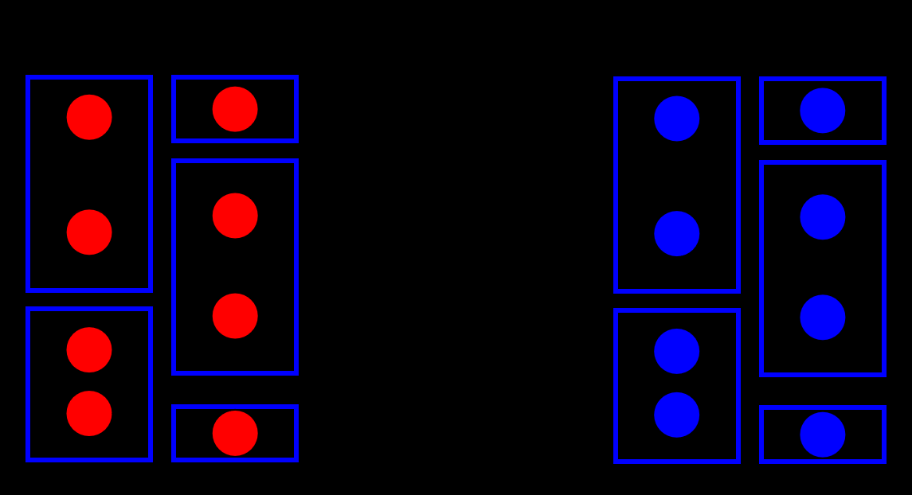
   - 蓝色方框：HTML标签
   - 红色圆形：动态、尚未确定的数据
   - 蓝色圆形：经过程序运算以后，计算得到的具体的，可以直接在页面上显示的数据、
   - 渲染：程序计算动态数据得到具体数据的过程

### 2、demo
1. HTML代码
    ```html
    <!-- 使用{{}}格式，指定要被渲染的数据 -->
    <div id="app">{{message}}</div>
    ```
2. vue代码
    ```javascript
    // 1.创建一个JSON对象，作为new Vue时要使用的参数
    var argumentJson = {
        
        // el用于指定Vue对象要关联的HTML元素。el就是element的缩写
        // 通过id属性值指定HTML元素时，语法格式是：#id
        "el":"#app",
        
        // data属性设置了Vue对象中保存的数据
        "data":{
            "message":"Hello Vue!"
        }
    };

    // 2.创建Vue对象，传入上面准备好的参数
    var app = new Vue(argumentJson);
    ```
    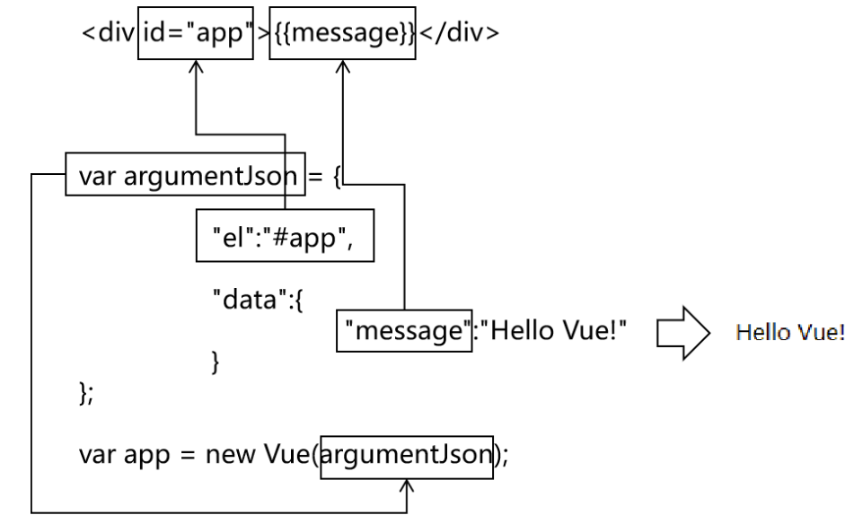

### 3、查看声明式渲染的响应式效果
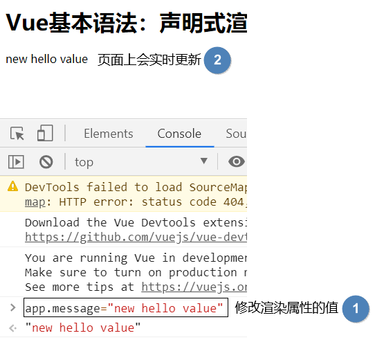

通过验证Vue对象的『响应式』效果，我们看到Vue对象和页面上的HTML标签确实是始终保持着关联的关系，同时看到Vue在背后确实是做了大量的工作。


## 绑定元素属性

### 1、基本语法
v-bind:HTML标签的原始属性名

### 2、demo
1. HTML代码
    ```html
    <div id="app">
        <!-- v-bind:value表示将value属性交给Vue来进行管理，也就是绑定到Vue对象 -->
        <!-- vueValue是一个用来渲染属性值的表达式，相当于标签体中加{{}}的表达式 -->
        <input type="text" v-bind:value="vueValue" />
        
        <!-- 同样的表达式，在标签体内通过{{}}告诉Vue这里需要渲染； -->
        <!-- 在HTML标签的属性中，通过v-bind:属性名="表达式"的方式告诉Vue这里要渲染 -->
        <p>{{vueValue}}</p>
    </div>
    ```
2. Vue代码
    ```javascript
    // 创建Vue对象，挂载#app这个div标签
    var app = new Vue({
        "el":"#app",
        "data":{
            "vueValue":"太阳当空照"
        }
    });
    ```

### 3、小结
本质上，v-bind:属性名="表达式"它们都是用Vue对象来渲染页面。只不过：
- 文本标签体：使用形式
- 属性：使用v-bind:属性名="表达式"形式


## 双向数据绑定


### 1、提出问题
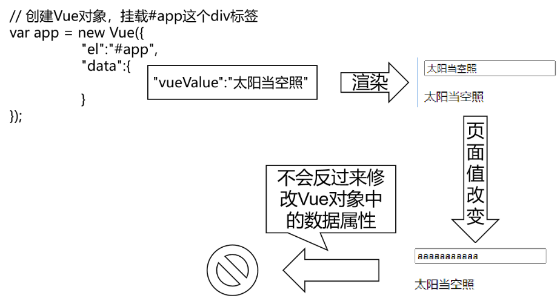
而使用了双向绑定后，就可以实现：页面上数据被修改后，Vue对象中的数据属性也跟着被修改。

### 2、demo
1. HTML代码
    ```html
    <div id="app">
        <!-- v-bind:属性名 效果是从Vue对象渲染到页面 -->
        <!-- v-model:属性名 效果不仅是从Vue对象渲染到页面，而且能够在页面上数据修改后反向修改Vue对象中的数据属性 -->
        <input type="text" v-model:value="vueValue" />
        
        <p>{{vueValue}}</p>
    </div>
    ```
2. Vue代码
    ```javascript
    // 创建Vue对象，挂载#app这个div标签
    var app = new Vue({
        "el":"#app",
        "data":{
            "vueValue":"太阳当空照"
        }
    });
    ```
3. p标签内的数据能够和文本框中的数据实现同步修改：
    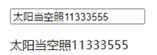

### 3、去除前后空格
1. :value可以省略
    ```html
    <input type="text" v-model="vueValue" />
    ```
2. .trim修饰符
   - 实际开发中，要考虑到用户在输入数据时，有可能会包含前后空格。而这些前后的空格对我们程序运行来说都是干扰因素，要去掉。在v-model后面加上.trim修饰符即可实现。
    ```html
    <input type="text" v-model.trim="vueValue" />
    ```
    Vue会帮助我们在文本框失去焦点时自动去除前后空格。


## 条件渲染
根据Vue对象中，数据属性的值来判断是否对HTML页面内容进行渲染。

### 1、v-if
1. HTML代码
    ```html
    <div id="app">
        <h3>if</h3>
        
        
    </div>
    ```
2. Vue代码
    ```javascript
    var app = new Vue({
        "el":"#app",
        "data":{
            "flag":true
        }
    });
    ```

### 2、v-if和v-else 中间不能有其他的结点
1. HTML代码
    ```html
    <div id="app02">
        <h3>if/else</h3>
        
        
    </div>
    ```
2. Vue代码
    ```javascript
    var app02 = new Vue({
        "el":"#app02",
        "data":{
            "flag":true
        }
    });
    ```

### 3、v-show 与if-else不一样，是通过样式表来控制显示
1. HTML代码
    ```html
    <div id="app03">
        <h3>v-show</h3>
        
    </div>
    ```
2. Vue代码
    ```javascript
    var app03 = new Vue({
        "el":"#app03",
        "data":{
            "flag":true
        }
    });
    ```


## 列表渲染

### 1、迭代一个简单的数组
1. HTML代码
    ```html
    <div id="app01">
        <ul>
            <!-- 使用v-for语法遍历数组 -->
            <!-- v-for的值是语法格式是：引用数组元素的变量名 in Vue对象中的数组属性名 -->
            <!-- 在文本标签体中使用{{引用数组元素的变量名}}渲染每一个数组元素 -->
            <li v-for="fruit in fruitList">{{fruit}}</li>
        </ul>
    </div>
    ```
2. Vue代码
    ```javascript
    var app01 = new Vue({
        "el":"#app01",
        "data":{
            "fruitList": [
                "apple",
                "banana",
                "orange",
                "grape",
                "dragonfruit"
            ]
        }
    });
    ```

### 2、迭代一个对象数组
1. HTML代码
    ```html
    <div id="app">
        <table>
            <tr>
                <th>编号</th>
                <th>姓名</th>
                <th>年龄</th>
                <th>专业</th>
            </tr>
            <tr v-for="employee in employeeList">
                <td>{{employee.empId}}</td>
                <td>{{employee.empName}}</td>
                <td>{{employee.empAge}}</td>
                <td>{{employee.empSubject}}</td>
            </tr>
        </table>
    </div>
    ```
2. Vue代码
    ```javascript
    var app = new Vue({
        "el":"#app",
        "data":{
            "employeeList":[
                {
                    "empId":11,
                    "empName":"tom",
                    "empAge":111,
                    "empSubject":"java"
                },
                {
                    "empId":22,
                    "empName":"jerry",
                    "empAge":222,
                    "empSubject":"php"
                },
                {
                    "empId":33,
                    "empName":"bob",
                    "empAge":333,
                    "empSubject":"python"
                }
            ]
        }
    });
    ```


## 事件驱动

### 1、demo：字符串顺序反转
1. HTML代码
    ```html
    <div id="app">
        <p>{{message}}</p>
        
        <!-- v-on:事件类型="事件响应函数的函数名" -->
        <button v-on:click="reverseMessage">Click me,reverse message</button>
    </div>
    ```
2. Vue代码
    ```javascript
    var app = new Vue({
        "el":"#app",
        "data":{
            "message":"Hello Vue!"
        },
        "methods":{
            "reverseMessage":function(){
                this.message = this.message.split("").reverse().join("");
            }
        }
    });
    ```

### 2、demo：获取鼠标移动时的坐标信息
1. HTML代码
    ```html
    <div id="app">
        <div id="area" v-on:mousemove="recordPosition"></div>
        <p id="showPosition">{{position}}</p>
    </div>
    ```
2. Vue代码
    ```javascript
    var app = new Vue({
        "el":"#app",
        "data":{
            "position":"暂时没有获取到鼠标的位置信息"
        },
        "methods":{
            "recordPosition":function(event){
                this.position = event.clientX + " " + event.clientY;
            }
        }
    });
    ```


## 侦听属性

### 1、提出需求
```html
<div id="app">
    <p>尊姓：{{firstName}}</p>
    <p>大名：{{lastName}}</p>
    尊姓：<input type="text" v-model="firstName" /><br/>
    大名：<input type="text" v-model="lastName" /><br/>
    <p>全名：{{fullName}}</p>
</div>
```

在上面代码的基础上，我们希望firstName或lastName属性发生变化时，修改fullName属性。此时需要对firstName或lastName属性进行『侦听』。
具体来说，所谓『侦听』就是对message属性进行监控，当firstName或lastName属性的值发生变化时，调用我们准备好的函数。

### 2、Vue代码
在watch属性中声明对firstName和lastName属性进行『侦听』的函数：
```javascript
var app = new Vue({
    "el":"#app",
    "data":{
        "firstName":"jim",
        "lastName":"green",
        "fullName":"jim green"
    },
    "watch":{
        "firstName":function(inputValue){
            this.fullName = inputValue + " " + this.lastName;
        },
        "lastName":function(inputValue){
            this.fullName = this.firstName + " " + inputValue;
        }
    }
});
```


## 简化写法

### 1、v-bind的简化写法
正常写法：
```html
<input type="text" v-bind:value="message" />
```

简化以后：
```html
<input type="text" :value="message" />
```

### 2、v-on的简化写法
正常写法：
```html
<button v-on:click="sayHello">SayHello</button>
```

简化以后：
```html
<button @click="sayHello">SayHello</button>
```


## Vue对象生命周期

### 1、概念
在我们各种语言的编程领域中，『生命周期』都是一个非常常见的概念。一个对象从创建、初始化、工作再到释放、清理和销毁，会经历很多环节的演变。比如我们在JavaSE阶段学习过线程的生命周期，今天学习Vue对象的生命周期，将来还要学习Servlet、Filter等Web组件的生命周期。

### 2、Vue对象的生命周期


### 3、生命周期钩子函数
Vue允许我们在特定的生命周期环节中通过钩子函数来加入我们的代码。

```html
<div id="app">
    <p id="content">{{message}}</p>
    <button @click="changeValue">点我</button>
</div>
```

```javascript
new Vue({
    "el":"#app",
    "data":{
        "message":"hello"
    },
    "methods":{
        "changeValue":function(){
            this.message = "new hello";
        }
    },
    
    // 1.实例创建之前
    "beforeCreate":function(){
        console.log("beforeCreate:"+this.message);
    },
    
    // 2.实例创建完成
    "created":function(){
        console.log("created:"+this.message);
    },
    
    // 3.数据挂载前
    "beforeMount":function(){
        console.log("beforeMount:"+document.getElementById("content").innerText);
    },
    
    // 4.数据已经挂载
    "mounted":function(){
        console.log("mounted:"+document.getElementById("content").innerText);
    },
    
    // 5.数据更新前
    "beforeUpdate":function(){
        console.log("beforeUpdate:"+document.getElementById("content").innerText);
    },
    
    // 6.数据更新之后
    "updated":function(){
        console.log("updated:"+document.getElementById("content").innerText);
    }
});
```


# Axios Ajax

## Ajax概述

### 1、服务器端渲染
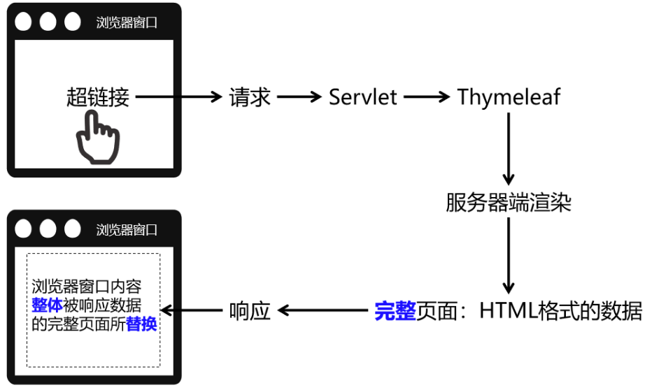

### 2、Ajax渲染（局部更新）
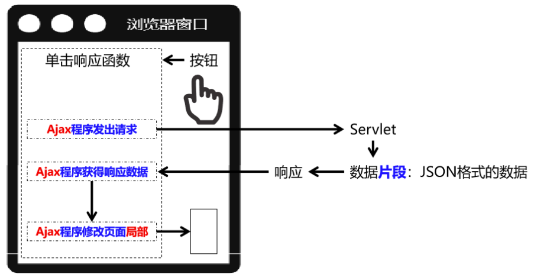

### 3、前后端分离
彻底舍弃服务器端渲染，数据全部通过Ajax方式以JSON格式来传递。

### 4、同步与异步
Ajax本身就是Asynchronous JavaScript And XML的缩写，直译为：异步的JavaScript和XML。在实际应用中Ajax指的是：不刷新浏览器窗口，不做页面跳转，局部更新页面内容的技术。

『同步』和『异步』是一对相对的概念，那么什么是同步，什么是异步呢？

1. 同步
    多个操作按顺序执行，前面的操作没有完成，后面的操作就必须等待。所以同步操作通常是串行的。
    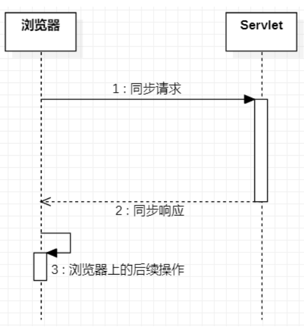
2. 异步
    多个操作相继开始并发执行，即使开始的先后顺序不同，但是由于它们各自是在自己独立的进程或线程中完成，所以互不干扰，谁也不用等谁。
    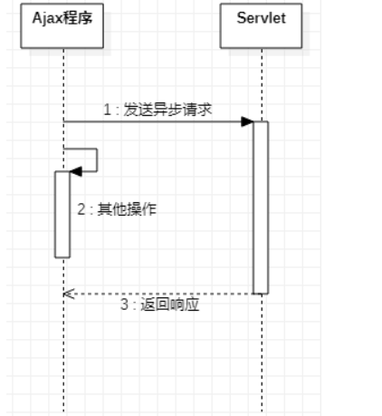

### 5、Axios简介
使用原生的JavaScript程序执行Ajax极其繁琐，所以一定要使用框架来完成。而Axios就是目前最流行的前端Ajax框架。

[Axios官网](http://www.axios-js.com/)

使用Axios和使用Vue一样，导入对应的*.js文件即可。官方提供的script标签引入方式为：

```html
<script src="https://unpkg.com/axios/dist/axios.min.js"></script>
```
我们可以把这个axios.min.js文件下载下来保存到本地来使用。


## Axios基本用法

### 0、在前端页面引入开发环境
```html
<script type="text/javascript" src="/demo/static/vue.js"></script>
<script type="text/javascript" src="/demo/static/axios.min.js"></script>
```

### 1、发送普通请求参数
1. 前端代码
    ```html
    <div id="app">
        <button @click="commonParam">普通请求参数</button>
    </div>
    ```
    ```javascript
    new Vue({
        "el":"#app",
        "data":{},
        "methods":{
            "commonParam":function () {
                axios({
                    "method":"post",
                    "url":"/demo/AjaxServlet?method=commonParam",
                    "params":{
                        "userName":"tom",
                        "userPwd":"123456"
                    }
                }).then(function (response) {
                    console.log(response);
                }).catch(function (error) {
                    console.log(error);
                });
            }
        }
    });
    ```
    效果：所有请求参数都被放到URL地址后面了，哪怕我们现在用的是POST请求方式。
    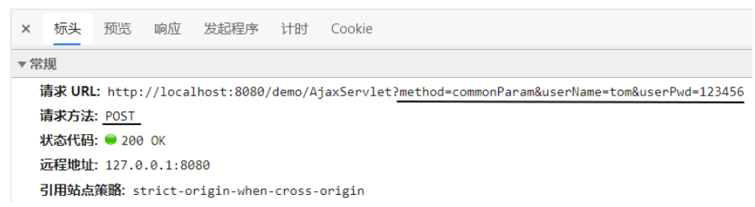
2. 后端代码
    ```java
    public class AjaxServlet extends ModelBaseServlet {
        protected void commonParam(HttpServletRequest request, HttpServletResponse response) throws ServletException, IOException {

            String userName = request.getParameter("userName");
            String userPwd = request.getParameter("userPwd");

            System.out.println("userName = " + userName);
            System.out.println("userPwd = " + userPwd);

            response.setContentType("text/html;charset=UTF-8");
            response.getWriter().write("服务器端返回普通文本字符串作为响应");

        }
    }
    ```
    > P.S.：由于我们不需要Thymeleaf了，所以ModelBaseServlet可以跳过ViewBaseServlet直接继承HttpServlet。

    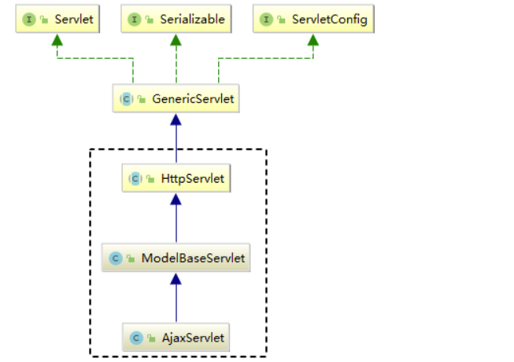
3. axios程序接收到的响应对象结构
    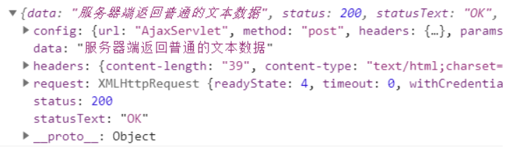
    | 属性名     | 作用                                             |
    | ---------- | ------------------------------------------------ |
    | config     | 调用axios(config对象)方法时传入的JSON对象        |
    | data       | 服务器端返回的响应体数据                         |
    | headers    | 响应消息头                                       |
    | request    | 原生JavaScript执行Ajax操作时使用的XMLHttpRequest |
    | status     | 响应状态码                                       |
    | statusText | 响应状态码的说明文本                             |
4. 服务器端处理请求失败后
    ```javascript
    catch(function (error) {     // catch()服务器端处理请求出错后，会调用

        console.log(error);         // error就是出错时服务器端返回的响应数据
        console.log(error.response);        // 在服务器端处理请求失败后，获取axios封装的JSON格式的响应数据对象
        console.log(error.response.status); // 在服务器端处理请求失败后，获取响应状态码
        console.log(error.response.statusText); // 在服务器端处理请求失败后，获取响应状态说明文本
        console.log(error.response.data);   // 在服务器端处理请求失败后，获取响应体数据

    });
    ```
    在给catch()函数传入的回调函数中，error对象封装了服务器端处理请求失败后相应的错误信息。其中，axios封装的响应数据对象，是error对象的response属性。response属性对象的结构如下图所示： 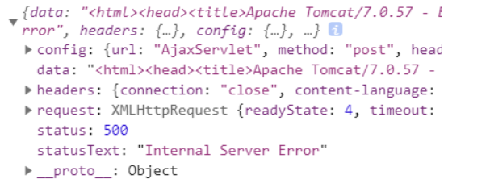
    
    可以看到，response对象的结构还是和then()函数传入的回调函数中的response是一样的： 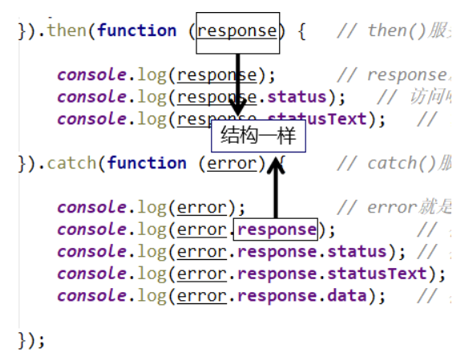

    > 回调函数：开发人员声明，但是调用时交给系统来调用。像单击响应函数、then()、catch()里面传入的都是回调函数。回调函数是相对于普通函数来说的，普通函数就是开发人员自己声明，自己调用：
    ```javascript
    function sum(a, b) {
        return a+b;
    }

    var result = sum(3, 2);
    console.log("result="+result);
    ```

### 2、发送请求体JSON
1. 前端代码
    ```html
    <button @click="requestBodyJSON">请求体JSON</button>
    ```
    ```javascript
    "methods":{
        "requestBodyJSON":function () {
            axios({
                "method":"post",
                "url":"/demo/AjaxServlet?method=requestBodyJSON",
                "data":{
                    "stuId": 55,
                    "stuName": "tom",
                    "subjectList": [
                        {
                            "subjectName": "java",
                            "subjectScore": 50.55
                        },
                        {
                            "subjectName": "php",
                            "subjectScore": 30.26
                        }
                    ],
                    "teacherMap": {
                        "one": {
                            "teacherName":"tom",
                            "tearcherAge":23
                        },
                        "two": {
                            "teacherName":"jerry",
                            "tearcherAge":31
                        },
                    },
                    "school": {
                        "schoolId": 23,
                        "schoolName": "atguigu"
                    }
                }
            }).then(function (response) {
                console.log(response);
            }).catch(function (error) {
                console.log(error);
            });
        }
    }
    ```
    效果： 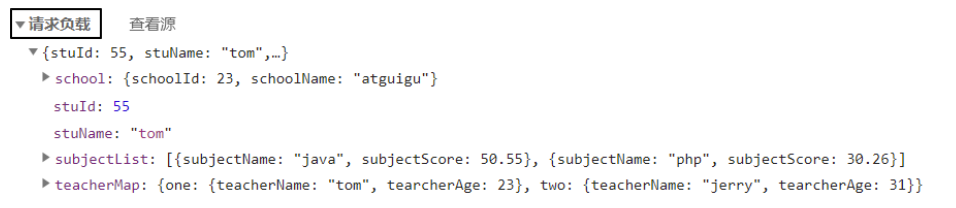
    > P.S.：Chrome浏览器中将『请求负载』显示为英文：『Request Payload』。
2. 后端代码
   1. 加入Gson包
        Gson是Google研发的一款非常优秀的JSON数据解析和生成工具，它可以帮助我们将数据在JSON字符串和Java对象之间互相转换。
   2. Servlet代码
        ```java
        protected void requestBodyJSON(HttpServletRequest request, HttpServletResponse response) throws ServletException, IOException {
            // 1.由于请求体数据有可能很大，所以Servlet标准在设计API的时候要求我们通过输入流来读取
            BufferedReader reader = request.getReader();
            // 2.创建StringBuilder对象来累加存储从请求体中读取到的每一行
            StringBuilder builder = new StringBuilder();
            // 3.声明临时变量
            String bufferStr = null;
            // 4.循环读取
            while((bufferStr = reader.readLine()) != null) {
                builder.append(bufferStr);
            }
            // 5.关闭流
            reader.close();
            // 6.累加的结果就是整个请求体
            String requestBody = builder.toString();
            // 7.创建Gson对象用于解析JSON字符串
            Gson gson = new Gson();
            // 8.将JSON字符串还原为Java对象
            Student student = gson.fromJson(requestBody, Student.class);
            System.out.println("student = " + student);
            System.out.println("requestBody = " + requestBody);
            response.setContentType("text/html;charset=UTF-8");
            response.getWriter().write("服务器端返回普通文本字符串作为响应");
        }
        ```
    > P.S.：看着很麻烦是吧？别担心，将来我们有了SpringMVC之后，一个@RequestBody注解就能够搞定，非常方便！

### 3、服务器端返回JSON数据
1. 前端代码
    ```javascript
    axios({
        "method":"post",
        "url":"/demo/AjaxServlet?method=responseBodyJSON"
    }).then(function (response) {
        console.log(response);
    }).catch(function (error) {
        console.log(error);
    });
    ```
    then()中获取到的response在控制台打印效果如下：我们需要通过data属性获取响应体数据
    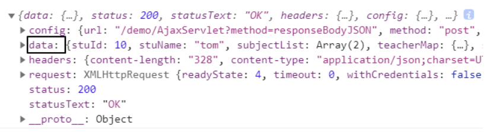

2. 后端代码
   1. 加入Gson包：仍然需要Gson支持，不用多说
   2. Servlet代码
        ```java
        protected void responseBodyJSON(HttpServletRequest request, HttpServletResponse response) throws ServletException, IOException {
            // 1.准备数据对象
            Student student = new Student();
            student.setStuId(10);
            student.setStuName("tom");
            student.setSchool(new School(11,"atguigu"));
            student.setSubjectList(Arrays.asList(new Subject("java", 95.5), new Subject("php", 93.3)));
            Map<String, Teacher> teacherMap = new HashMap<>();
            teacherMap.put("t1", new Teacher("lili", 25));
            teacherMap.put("t2", new Teacher("mary", 26));
            teacherMap.put("t3", new Teacher("katty", 27));
            student.setTeacherMap(teacherMap);
            // 2.创建Gson对象
            Gson gson = new Gson();
            // 3.将Java对象转换为JSON对象
            String json = gson.toJson(student);
            // 4.设置响应体的内容类型
            response.setContentType("application/json;charset=UTF-8");
            response.getWriter().write(json);
        }
        ```

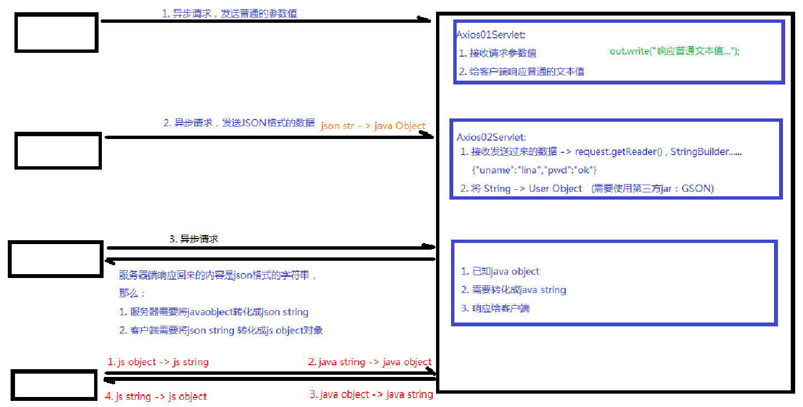


# 书城-使用Axios和vue改造
1. 使用Axios和vue改造购物车模块
2. 展示购物车详情-计算小计
3. 计算数量和总金额

## HTML
cart.html
```html
<script language="JavaScript" th:src="@{/static/script/vue.js}"></script>
<script language="JavaScript" th:src="@{/static/script/axios.min.js}"></script>
<script language="JavaScript" th:src="@{/static/script/cart.js}"></script>

<div class="list" id="cart_div">
<div class="w">
    <table>
    <thead>
        <tr>
        <th>图片</th>
        <th>商品名称</th>

        <th>数量</th>
        <th>单价</th>
        <th>金额</th>
        <th>操作</th>
        </tr>
    </thead>
    <tbody>
        <tr v-for="cartItem in cart.cartItemMap">
        <td>
            
        </td>
        <td>{{cartItem.book.bookName}}</td>

        <td>
            <span class="count" @click="editCart(cartItem.id,cartItem.buyCount-1)">-</span>
            <input class="count-num" type="text" value="1" v-bind:value="cartItem.buyCount" />
            <span class="count" @click="editCart(cartItem.id,cartItem.buyCount+1)">+</span>
        </td>
        <td>{{cartItem.book.price}}</td>
        <td>{{cartItem.xj}}</td>
        <td><a href="">删除</a></td>
        </tr>
    </tbody>
    </table>
    <div class="footer">
    <div class="footer-left">
        <a href="#" class="clear-cart">清空购物车</a>
        <a href="#">继续购物</a>
    </div>
    <div class="footer-right">
        <div>共<span>{{cart.totalBookCount}}</span>件商品</div>
        <div class="total-price">总金额<span>{{cart.totalMoney}}</span>元</div>
        <a class="pay" th:href="@{/order.do(operate='checkout')}">去结账</a>
    </div>
    </div>
</div>
</div>
```

cart.js
```javascript
window.onload = function () {
    var vue = new Vue({
        el: "#cart_div",
        data: {
            cart: {}
        },
        methods: {
            getCart: function () {
                axios({
                    method: "POST",
                    url: "cart.do",
                    params: {
                        operate: 'cartInfo'
                    }
                })
                    .then(function (value) {
                        var cart = value.data;
                        vue.cart = cart;
                    })
                    .catch(function (reason) { });
            },
            editCart: function (cartItemId, buyCount) {
                axios({
                    method: "POST",
                    url: "cart.do",
                    params: {
                        operate: 'editCart',
                        cartItemId: cartItemId,
                        buyCount: buyCount
                    }
                })
                    .then(function (value) {
                        vue.getCart();
                    })
                    .catch(function (reason) { });
            }
        },
        mounted: function () {
            this.getCart();
        }
    });
}
```


## JAVA
DispatcherServlet中加入对JSON处理
```java
//3.视图处理
String methodReturnStr = (String)returnObj ;
if(StringUtil.isEmpty(methodReturnStr)){
    return ;
}
if(methodReturnStr.startsWith("redirect:")){        //比如：  redirect:fruit.do
    String redirectStr = methodReturnStr.substring("redirect:".length());
    response.sendRedirect(redirectStr);
}else if(methodReturnStr.startsWith("json:")){
    response.setCharacterEncoding("utf-8");
    response.setContentType("application/json;charset=utf-8");
    String jsonStr = methodReturnStr.substring("json:".length());
    PrintWriter out = response.getWriter();
    out.print(jsonStr);
    out.flush();
}else{
    super.processTemplate(methodReturnStr,request,response);    // 比如：  "edit"
}
```

CartController
```java
public class CartController {
    public String editCart(Integer cartItemId, Integer buyCount) {
        cartItemService.updateCartItem(new CartItem(cartItemId, buyCount));
        return "";
    }

    public String cartInfo(HttpSession session) {
        User user = (User) session.getAttribute("currUser");
        Cart cart = cartItemService.getCart(user);

        // 调用Cart中的三个属性的get方法，目的是在此处计算这三个属性的值，否则这三个属性为null，
        // 导致的结果就是下一步的gson转化时，为null的属性会被忽略
        cart.getTotalBookCount();
        cart.getTotalCount();
        cart.getTotalMoney();

        Gson gson = new Gson();
        String cartJsonStr = gson.toJson(cart);
        return "json:" + cartJsonStr;
    }
    // ...
```
