# 第1章 Java语言概述
[JAVA学习路线](http://www.atguigu.com/download.shtml#java)

Java基础知识图解
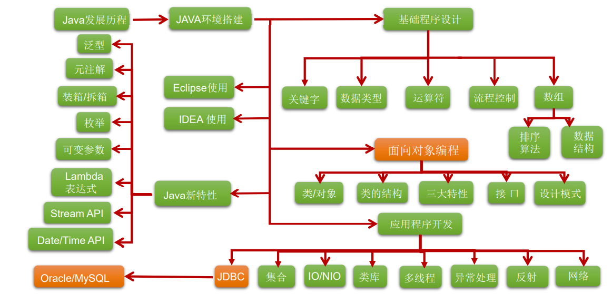

- 第一部分：编程语言核心结构
    > 主要知识点：变量、基本语法、分支、循环、数组、...
- 第二部分：Java面向对象的核心逻辑
    > 主要知识点：OOP、封装、继承、多态、接口、...
- 第三部分：开发Java SE高级应用程序
    > 主要知识点：异常、集合、I/O、多线程、反射机制、网络编程、......
- 第四部分：实训项目
    > 项目一：家庭收支记账软件  
    > 项目二：客户信息管理软件  
    > 项目三：开发团队人员调度软件  
    > 附加项目一：银行业务管理软件  
    > 附件项目二：单机考试管理软件  

## 1-1 软件开发介绍

- 软件开发
    > 软件，即一系列按照特定顺序组织的计算机数据和指令的集合。有**系统软件**和**应用软件**之分。
- 人机交互方式
  - **图形化界面**(Graphical User Interface GUI)这种方式简单直观，使用者易于接受，容易上手操作。
  - **命令行方式**(Command Line Interface CLI)：需要有一个控制台，输入特定的指令，让计算机完成一些操作。较为麻烦，需要记录住一些命令。

- Pascal之父Nicklaus Wirth： “Algorithms+Data tructures=Programs”

- 常用的DOS命令
  - dir : 列出当前目录下的文件以及文件夹
  - md : 创建目录
  - rd : 删除目录
  - cd : 进入指定目录
  - cd.. : 退回到上一级目录
  - cd\\: 退回到根目录
  - del : 删除文件
  - exit : 退出 dos 命令行
  -  补充：echo javase>1.doc
-  常用快捷键
-  ← →：移动光标
-  ↑ ↓：调阅历史操作命令
-  Delete和Backspace：删除字符

## 1-2 计算机编程语言介绍

- 什么是计算机语言
    - 语言：是人与人之间用于沟通的一种方式。例如：中国人与中国人用普通话沟通。而中国人要和英国人交流，就要学习英语。
    - **计算机语言：人与计算机交流的方式。**  
      - 如果人要与计算机交流，那么就要学习计算机语言。  
      - 计算机语言有很多种。如：C ,C++ ,Java ,PHP , Kotlin，Python，Scala等。

    - 第一代语言:  机器语言。指令以二进制代码形式存在。
    - 第二代语言:  汇编语言。使用助记符表示一条机器指令。

    - 第三代语言：高级语言
      - C、Pascal、Fortran面向过程的语言
      - C++面向过程/面向对象
      - Java跨平台的纯面向对象的语言
      - .NET跨语言的平台
      - Python、Scala...

## 1-3 Java语言概述

- 是SUN(Stanford University Network，斯坦福大学网络公司 ) 1995年推出的一门高级编程语言。
- 是一种面向Internet的编程语言。Java一开始富有吸引力是因为Java程序可以在Web浏览器中运行。这些Java程序被称为Java小程序（applet）。applet使用现代的图形用户界面与Web用户进行交互。 applet内嵌在HTML代码中。
- 随着Java技术在web方面的不断成熟，已经成为Web应用程序的首选开发语言。
  
Java简史
- 1991年 Green项目，开发语言最初命名为Oak (橡树)
- 1994年，开发组意识到Oak 非常适合于互联网
- 1996年，发布JDK 1.0，约8.3万个网页应用Java技术来制作
- 1997年，发布JDK 1.1，JavaOne会议召开，创当时全球同类会议规模之最
- 1998年，发布JDK 1.2，同年发布企业平台J2EE
- 1999年，Java分成J2SE、J2EE和J2ME，JSP/Servlet技术诞生
- 2004年，发布里程碑式版本：JDK 1.5，为突出此版本的重要性，更名为JDK 5.0
- 2005年，J2SE -> JavaSE，J2EE -> JavaEE，J2ME -> JavaME
- 2009年，Oracle公司收购SUN，交易价格74亿美元
- 2011年，发布JDK 7.0
- 2014年，发布JDK 8.0，是继JDK 5.0以来变化最大的版本
- 2017年，发布JDK 9.0，最大限度实现模块化
- 2018年3月，发布JDK 10.0，版本号也称为18.3
- 2018年9月，发布JDK 11.0，版本号也称为18.9

### Java技术体系平台

**Java SE(Java Standard Edition)标准版**  
> 支持面向桌面级应用（如Windows下的应用程序）的Java平台，提供了完整的Java核心API，此版本以前称为J2SE

---
**Java EE(Java Enterprise Edition)企业版**  
> 是为开发企业环境下的应用程序提供的一套解决方案。该技术体系中包含的技术如:Servlet 、Jsp等，主要针对于Web应用程序开发。版本以前称为J2EE

---
Java ME(Java Micro Edition)小型版  
> 支持Java程序运行在移动终端（手机、PDA）上的平台，对Java API有所精简，并加入了针对移动终端的支持，此版本以前称为J2ME

---
Java Card  
> 支持一些Java小程序（Applets）运行在小内存设备（如智能卡）上的平台

### Java的应用领域

- **企业级应用**：主要指复杂的大企业的软件系统、各种类型的网站。Java的安全机制以及它的跨平台的优势，使它在分布式系统领域开发中有广泛应用。应用领域包括金融、电信、交通、电子商务等。
- **Android平台应用**：Android应用程序使用Java语言编写。Android开发水平的高低很大程度上取决于Java语言核心能力是否扎实。
- **大数据平台开发**：各类框架有Hadoop，spark，storm，flink等，就这类技术生态圈来讲，还有各种中间件如flume，kafka，sqoop等等 ，这些框架以及工具大多数是用Java编写而成，但提供诸如Java，scala，Python，R等各种语言API供编程。
- 移动领域应用：主要表现在消费和嵌入式领域，是指在各种小型设备上的应用，包括手机、PDA、机顶盒、汽车通信设备等。

### 主要特性

- **Java语言是易学的**。Java语言的语法与C语言和C++语言很接近，使得大多数程序员很容易学习和使用Java。
- **Java语言是强制面向对象的**。Java语言提供类、接口和继承等原语，为了简单起见，只支持类之间的单继承，但支持接口之间的多继承，并支持类与接口之间的实现机制（关键字为implements）。
- **Java语言是分布式的**。Java语言支持Internet应用的开发，在基本的Java应用编程接口中有一个网络应用编程接口（java net），它提供了用于网络应用编程的类库，包括URL、URLConnection、Socket、ServerSocket等。Java的RMI（远程方法激活）机制也是开发分布式应用的重要手段。
- **Java语言是健壮的**。Java的强类型机制、异常处理、垃圾的自动收集等是Java程序健壮性的重要保证。对指针的丢弃是Java的明智选择。
- **Java语言是安全的**。Java通常被用在网络环境中，为此，Java提供了一个安全机制以防恶意代码的攻击。如：安全防范机制（类ClassLoader），如分配不同的名字空间以防替代本地的同名类、字节代码检查。
- **Java语言是体系结构中立的**。Java程序（后缀为java的文件）在Java平台上被编译为体系结构中立的字节码格式（后缀为class的文件），然后可以在实现这个Java平台的任何系统中运行。
- **Java语言是解释型的**。如前所述，Java程序在Java平台上被编译为字节码格式，然后可以在实现这个Java平台的任何系统的解释器中运行。
- **Java是性能略高的**。与那些解释型的高级脚本语言相比，Java的性能还是较优的。
- **Java语言是原生支持多线程的**。在Java语言中，线程是一种特殊的对象，它必须由Thread类或其子（孙）类来创建。

## 1-4 Java程序运行机制及运行过程

### Java语言的特点

1. 特点一：面向对象
   - 两个基本概念：类、对象
   - 三大特性：封装、继承、多态
2. 特点二：健壮性
   - 吸收了C/C++语言的优点，但去掉了其影响程序健壮性的部分（如指针、内存的申请与释放等），提供了一个相对安全的内存管理和访问机制
3. 特点三：跨平台性
   - 跨平台性：通过Java语言编写的应用程序在不同的系统平台上都可以运行。“Write once , Run Anywhere”
   - 原理：只要在需要运行 java 应用程序的操作系统上，先安装一个Java虚拟机 (JVM Java Virtual Machine) 即可。由JVM来负责Java程序在该系统中的运行。

### Java两种核心机制

1. 核心机制—Java虚拟机  
   - JVM是一个虚拟的计算机，具有指令集并使用不同的存储区域。负责执行指令，管理数据、内存、寄存器。
   - 对于不同的平台，有不同的虚拟机。
   - 只有某平台提供了对应的java虚拟机，java程序才可在此平台运行
   - Java虚拟机机制屏蔽了底层运行平台的差别，实现了“一次编译，到处运行”
2. 核心机制—垃圾回收
   - 不再使用的内存空间应回收—— 垃圾回收。
   - 在C/C++等语言中，由程序员负责回收无用内存。
   - Java 语言消除了程序员回收无用内存空间的责任：它提供一种系统级线程跟踪存储空间的分配情况。并在JVM空闲时，检查并释放那些可被释放的存储空间。
   - 垃圾回收在Java程序运行过程中自动进行，程序员无法精确控制和干预。
   - **Java程序还会出现内存泄漏和内存溢出问题吗？Yes!**

## 1-5 Java语言的环境搭建

**JDK(Java Development Kit Java开发工具包)**  
JDK是提供给Java开发人员使用的，其中包含了java的开发工具，也包括了JRE。所以安装了JDK，就不用在单独安装JRE了。
> 其中的开发工具：编译工具(javac.exe) 打包工具(jar.exe)等

---
**JRE(Java Runtime Environment Java运行环境)**  
包括Java虚拟机(JVM Java Virtual Machine)和Java程序所需的核心类库等，如果想要运行一个开发好的Java程序，计算机中只需要安装JRE即可。

Java架构


官方网址：
[oracle](www.oracle.com)
[sun](java.sun.com)

安装JDK
- 傻瓜式安装，下一步即可。
- **建议：安装路径不要有中文或者空格等特殊符号。**
- 如果操作系统是64位的，软件尽量选择支持64位的（除非软件本身不区分）。
- 当提示安装 JRE 时，正常在JDK安装时已经装过了，但是为了后续使用Eclipse等开发工具不报错，建议也根据提示安装JRE。

### 配置环境变量path

根据windows系统在查找可执行程序的原理，可以将java工具所在路径定义到path 环境变量中，让系统帮我们去找运行执行的程序。  
配置方法：
  - 我的电脑--属性--高级系统设置--环境变量
  - 编辑 path 环境变量，在变量值开始处加上java工具所在目录，后面用 “ ; ”和其他值分隔开即可。
  - 打开DOS命令行，任意目录下敲入javac。如果出现javac 的参数信息，配置成功。

## 1-6 开发体验— HelloWorld

步骤：
1. 将 Java 代码编写到扩展名为 .java 的文件中。
2. 通过 javac 命令对该 java 文件进行编译。
3. 通过 java 命令对生成的 class 文件进行运行。

## 1-7 常见问题及解决方法

- 源文件名不存在或者写错
- 当前路径错误
- 后缀名隐藏问题
- 类文件名写错，尤其文件名与类名不一致时，要小心
- 类文件不在当前路径下，或者不在classpath指定路径下
- 声明为public的类应与文件名一致，否知编译失败
- 编译失败，注意错误出现的行数，再到源代码中指定位置改错

**总结：**  
学习编程最容易犯的错是**语法错误**。Java要求你必须按照语法规则编写代码。如果你的程序违反了语法规则，例如：忘记了分号、大括号、引号，或者拼错了单词，java编译器都会报语法错误。**尝试着去看懂编译器会报告的错误信息**。

## 1-8 注释(Comment)

- 用于注解说明解释程序的文字就是注释。
- Java中的注释类型：
  - 单行注释
    - 格式： //注释文字
  - 多行注释
    - 格式： /* 注释文字 */
    - 多行注释里面不允许有多行注释嵌套。
  - 文档注释 (java特有)
    ```java
    /**
    @author 指定java程序的作者
    @version 指定源文件的版本
    */
    ```
    - 注释内容可以被JDK提供的工具 javadoc 所解析，生成一套以网页文件形式体现的该程序的说明文档。
- 提高了代码的阅读性；调试程序的重要方法。
- 注释是一个程序员必须要具有的良好编程习惯。
- 将自己的思想通过注释先整理出来，再用代码去体现

### 小结第一个程序

- Java源文件以“java”为扩展名。源文件的基本组成部分是类（class），如本例中的HelloWorld类。
- Java应用程序的执行入口是main()方法。它有固定的书写格式：
```java
public static void main(String[] args) {...}
```
- Java语言严格区分大小写。
- Java方法由一条条语句构成，每个语句以“;”结束。
- 大括号都是成对出现的，缺一不可。
- 一个源文件中最多只能有一个public类。其它类的个数不限，如果源文件包含一个public类，则文件名必须按该类名命名。

## 1-9 Java API文档

- API （Application Programming Interface,应用程序编程接口）是 Java 提供的基本编程接口。
- Java语言提供了大量的基础类，因此 Oracle 也为这些基础类提供了相应的API文档，用于告诉开发者如何使用这些类，以及这些类里包含的方法。
- 下载API：
http://www.oracle.com/technetwork/java/javase/downloads/index.html
- Additional Resources-Java SE 8 Documentation下载。

## 1-10 良好的编程风格

正确的注释和注释风格
- 使用文档注释来注释整个类或整个方法。
- 如果注释方法中的某一个步骤，使用单行或多行注释。
- 正确的缩进和空白
- 使用一次tab操作，实现缩进
- 运算符两边习惯性各加一个空格。比如：2 + 4 * 5。
- 块的风格: Java API 源代码选择了行尾风格

## 1-11 常用的Java开发工具(Integrated Development Environment)

1. 文本编辑工具：
   - 记事本
   - UltraEdit
   - EditPlus 
   - TextPad
   - NotePad
2. Java集成开发环境（IDE)：
   - JBuilder
   - NetBeans
   - **Eclipse**
   - MyEclipse
   - **IntelliJ IDEA**

## 章末练习题

1. java语言的特点：
  > 面向对象性：两个基本概念：类、对象；三大特性：封装、继承、多态  
  > 健壮性：吸收了C/C++语言的优点，但去掉了其影响程序健壮性的部分（如指针、内存的申请与释放等），提供了一个相对安全的内存管理和访问机制  
  > 跨平台性：通过Java语言编写的应用程序在不同的系统平台上都可以运行。“Write once , Run Anywhere”
2. 问题：System.out.println()和System.out.print()什么区别呢？  
  System.out.println();打印完后，会换行。  
  System.out.print();打印完后，不会换行。
3. 一个".java"源文件中可以包括多个类（不是内部类）但最多只有一个类名声明为public，与文件名相同。
4. 从来没有人说过Java的class名字必须和其文件名相同。但public class的名字必须和文件名相同。
5. 设置path的目的是为了在控制台的任何文件路径下，都可以调用jdk指定目录下的所有指令。
6. JDK包含JRE，JRE包含JVM.
7. GC是垃圾收集的意思（Gabage Collection）,内存处理是编程人员容易出现问题的地方，忘记或者错误的内存回收会导致程序或系统的不稳定甚至崩溃，Java提供的GC功能可以自动监测对象是否超过作用域从而达到自动回收内存的目的，Java语言没有提供释放已分配内存的显示操作方法。
8. 对于GC来说，当程序员创建对象时，GC就开始监控这个对象的地址、大小以及使用情况。通常，GC采用有向图的方式记录和管理堆(heap)中的所有对象。通过这种方式确定哪些对象是"可达的"，哪些对象是"不可达的"。当GC确定一些对象为"不可达"时，GC就有责任回收这些内存空间。可以。程序员可以手动执行System.gc()，通知GC运行，但是Java语言规范并不保证GC一定会执行。


# 第2章 基本语法(上)：变量与运算符

## 2-1 关键字与保留字

- 关键字(keyword)的定义和特点
  - 定义：被Java语言赋予了特殊含义，用做专门用途的字符串（单词）
  - 特点：关键字中所有字母都为小写

用于定义数据类型的关键字:
> class、 interface、 enum、 byte、 short、 int、 long、 float、 double、 char、 boolean、 void

用于定义流程控制的关键字:
> if、 else、 switch、 case、 default、 while、 do、 for、 break、 continue、 return

用于定义访问权限修饰符的关键字:
> private、 protected、 public

用于定义类，函数，变量修饰符的关键字:
> abstract、 final、 static、 synchronized

用于定义类与类之间关系的关键字:
> extends、 implements

用于定义建立实例及引用实例，判断实例的关键字:
> new、 this、 super、 instanceof

用于异常处理的关键字:
> try、 catch、 finally、 throw、 throws

用于包的关键字:
> package、 import

其他修饰符关键字:
> native、 strictfp、 transient、 volatile、 assert

*用于定义数据类型值的字面值:
> true false null

- 保留字(reserved word)
  - Java保留字：现有Java版本尚未使用，但以后版本可能会作为关键字使用。自己命名标识符时要避免使用这些保留字: goto 、const

## 2-2 标识符(Identifier)

标识符：
- Java 对各种**变量**、**方法**和**类**等要素命名时使用的字符序列称为标识符
- 技巧：凡是自己可以起名字的地方都叫标识符。

定义合法标识符规则：
- 由26个英文字母大小写，0-9 ，_或 $ 组成
- 数字不可以开头。
- 不可以使用关键字和保留字，但能包含关键字和保留字。
- Java中严格区分大小写，长度无限制。
- 标识符不能包含空格。

### Java中的名称命名规范

Java中的名称命名规范：
- 包名：多单词组成时所有字母都小写：xxxyyyzzz
- 类名、接口名：多单词组成时，所有单词的首字母大写：XxxYyyZzz
- 变量名、方法名：多单词组成时，第一个单词首字母小写，第二个单词开始每个单词首字母大写：xxxYyyZzz
- 常量名：所有字母都大写。多单词时每个单词用下划线连接：XXX_YYY_ZZZ

注意1：在起名字时，为了提高阅读性，要尽量有意义，“见名知意”。（使用完整的词汇会更具有描述性）  
注意2：java采用unicode字符集，因此标识符也可以使用汉字声明，但是不建议使用。

## 2-3 变量

变量的概念：（存储在计算机内存中的一个值）
- 内存中的一个存储区域
- 该区域的数据可以在同一类型范围内不断变化
- 变量是程序中最基本的存储单元。包含**变量类型**、**变量名**和**存储的值**

变量的作用：
- 用于在内存中保存数据

使用变量注意：
- Java中每个变量必须先声明，后使用
- 使用变量名来访问这块区域的数据
- 变量的作用域：其定义所在的一对{ }内
- 变量只有在其作用域内才有效
- 同一个作用域内，不能定义重名的变量

声明变量
- 语法：\<数据类型\> \<变量名称\>
- 例如：datatype var1, var2, ..., varn;

变量的赋值
- 语法：\<变量名称\> = \<值\>
- 例如：var = 10;

- 声明和赋值变量
- 语法： \<数据类型\> \<变量名\> = \<初始化值\>
- 例如：int var = 10;

### 变量的分类-按数据类型

对于每一种数据都定义了明确的具体数据类型（强类型语言），在内存中分
配了不同大小的内存空间。

数据类型
- 基本数据类型(primitive type)
  - 数值型
    - 整数类型(byte,short,int,long)
    - 浮点类型(float,double)
  - 字符型(char)
  - 布尔型(boolean)
- 引用数据类型(reference type)：只可能存储两类值：null  或  地址值（含变量的类型）
  - 类(class)
    - 字符串(String)
  - 接口(interface)
  - 数组([ ])

补充：变量的分类-按声明的位置的不同
- 在方法体外，类体内声明的变量称为**成员变量**。
- 在方法体内部声明的变量称为**局部变量**。

- 成员变量
  - 实例变量（不以static修饰）
  - 类变量（以static修饰）
- 局部变量
  - 形参（方法、构造器中定义的变量）
  - 方法局部变量（在方法内定义）
  - 代码块局部变量（在代码块内定义）

注意：二者在初始化值方面的异同:  
同：都有生命周期 异：局部变量除形参外，需显式初始化。

### 整数类型：byte、short、int、long
- Java各整数类型有固定的表数范围和字段长度，不受具体OS的影响，以保证java程序的可移植性。
- 只要整形字面值是在目标变量允许的范围内，那么将整形字面值赋给short型或byte型变量时，无需显式的类型转换。
- java的整型常量默认为 int 型，声明long型常量须后加‘l’或‘L’
- java程序中变量通常声明为int型，除非不足以表示较大的数，才使用long
- 为了提高可读性，Java允许在一个数值型字面值的两个数字间使用下划线

| 类 型 | 占用存储空间 | 表数范围                |
| ----- | ------------ | ----------------------- |
| byte  | 1字节=8bit位 | -128 ~ 127              |
| short | 2字节        | -2^15 ~2^15-1           |
| int   | 4字节        | -2^31 ~ 2^31-1 (约21亿) |
| long  | 8字节        | -2^63 ~ 2^63-1          |

### 浮点类型：float、double
- 与整数类型类似，Java 浮点类型（实数）也有固定的表数范围和字段长度，不受具体操作系统的影响。
- 浮点型常量有两种表示形式：
  - 十进制数形式：如：5.12 512.0f .512 (必须有小数点）
  - 科学计数法形式：如：5.12e2 512E2 100E-2

- float:单精度，尾数可以精确到7位有效数字。很多情况下，精度很难满足需求。
- double:双精度，精度是float的两倍。通常采用此类型。

注意：Java 的浮点型常量默认为double型，声明float型常量，须后加'f'或'F'。

| 类 型        | 占用存储空间 | 表数范围               |
| ------------ | ------------ | ---------------------- |
| 单精度float  | 4字节        | -3.403E38 ~ 3.403E38   |
| 双精度double | 8字节        | -1.798E308 ~ 1.798E308 |

### 字符类型：char

- char 型数据用来表示通常意义上“字符”(2字节)
- Java中的所有字符都使用Unicode编码，故一个字符可以存储一个字母，**一个汉字**，或其他书面语的一个字符。
- 字符型变量的三种表现形式：
  - 字符常量是用单引号(' ')括起来的单个字符。例如：`char c1 = 'a'; char c2 = '中'; char c3 = '9';`
  -  Java中还允许使用**转义字符**'\'来将其后的字符转变为特殊字符型常量。例如：`char c3 = ‘\n’; // '\n'表示换行符`
  - 直接使用 Unicode 值来表示字符型常量：'\uXXXX'。其中，XXXX代表一个十六进制整数。如：`\u000a` 表示 `\n`。
- char类型是可以进行运算的。因为它都对应有Unicode码。
  - 自增自减可以得到相邻Unicode字符。
  - 可以转换为任意一种数据类型，反之亦然。将整数转换成char仅保留数据的低16位。

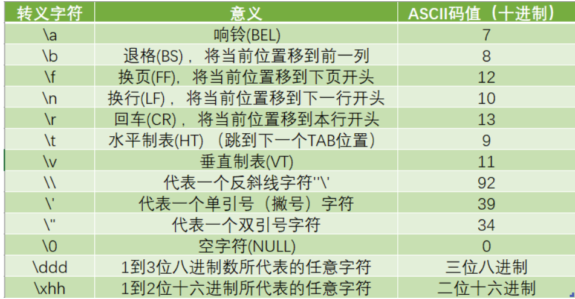

Character相关方法：
- `isDigit​(ch)`：确定指定的字符是否为数字。
- `isLetter​(char ch)`:确定指定的字符是否为字母。
- `isLetterOrDigit​(char ch)`：确定指定的字符是字母还是数字。
- `isLowerCase​(char ch)`：确定指定的字符是否为小写字符。
- `isUpperCase​(char ch)`：确定指定的字符是否为大写字符。
- `toLowerCase​(char ch)`：使用UnicodeData文件中的大小写映射信息将字符参数转换为小写。
- `toUpperCase​(char ch)`：使用UnicodeData文件中的大小写映射信息将字符参数转换为大写。

### 了解：ASCII 码

- 在计算机内部，所有数据都使用**二进制**表示。每一个二进制位（bit）有 0 和 1 两种状态，因此 8 个二进制位就可以组合出 **256 种**状态，这被称为一个字节（byte）。一个字节一共可以用来表示 256 种不同的状态，每一个状态对应一个符号，就是 256 个符号，从0000000 到 11111111。
-  ASCII码：上个世纪60年代，美国制定了一套字符编码，对英语字符与二进制位之间的关系，做了统一规定。这被称为ASCII码。ASCII码一共规定了128个字符的编码，比如空格“SPACE”是32（二进制00100000），大写的字母A是65（二进制01000001）。这128个符号（包括32个不能打印出来的控制符号），只占用了一个字节的后面7位，最前面的1位统一规定为0。
- 缺点：
  -  不能表示所有字符。
  -  相同的编码表示的字符不一样：比如，130在法语编码中代表了é，在希伯来语编码中却代表(ג) 了字母Gim

### 了解： Unicode 编码

- 乱码：世界上存在着多种编码方式，同一个二进制数字可以被解释成不同的符号。因此，要想打开一个文本文件，就必须知道它的编码方式，否则用错误的编码方式解读，就会出现乱码。
- Unicode：一种编码，将世界上所有的符号都纳入其中。每一个符号都给予一个独一无二的编码，使用 Unicode 没有乱码的问题。
- Unicode 的缺点：Unicode 只规定了符号的二进制代码，却没有规定这个二进制代码应该如何存储：无法区别 Unicode 和 ASCII：计算机无法区分三个字节表示一个符号还是分别表示三个符号。另外，我们知道，英文字母只用一个字节表示就够了，如果unicode统一规定，每个符号用三个或四个字节表示，那么每个英文字母前都必然有二到三个字节是0，这对于存储空间来说是极大的浪费。

### 了解： UTF-8

- UTF-8 是在互联网上使用最广的一种 Unicode 的实现方式。
- UTF-8 是一种变长的编码方式。它可以使用 1-6 个字节表示一个符号，根据不同的符号而变化字节长度。
- UTF-8的编码规则：
  - 对于单字节的UTF-8编码，该字节的最高位为0，其余7位用来对字符进行编码（等同于ASCII码）。
  - 对于多字节的UTF-8编码，如果编码包含 n 个字节，那么第一个字节的前 n 位为1，第一个字节的第 n+1 位为0，该字节的剩余各位用来对字符进行编码。在第一个字节之后的所有的字节，都是最高两位为"10"，其余6位用来对字符进行编码。

### 布尔类型：boolean

- boolean 类型用来判断逻辑条件，一般用于程序流程控制：
  - if条件控制语句；
  - while循环控制语句；
  - do-while循环控制语句；
  - for循环控制语句；
- boolean类型数据只允许取值true和false，无null。
  - 不可以使用0或非 0 的整数替代false和true，这点和C语言不同。
  - Java虚拟机中没有任何供boolean值专用的字节码指令，Java语言表达所操作的boolean值，在编译之后都使用java虚拟机中的int数据类型来代替：true用1表示，false用0表示。———《java虚拟机规范 8版》

### 基本数据类型转换

- **自动类型转换**：容量小的类型自动转换为容量大的数据类型。数据类型按容量大小排序为：


- 有多种类型的数据混合运算时，系统首先自动将所有数据转换成容量最大的那种数据类型，然后再进行计算。
- 说明：此时的容量大小指的是，表示数的范围的大和小。比如：float容量要大于long的容量
- byte , short , char之间不会相互转换，他们三者在计算时首先转换为int类型。(即便是他们与自身运算byte + byte)
- java在做运算的时候，如果操作数均在int范围内，那么一律在int的空间内运算。
- boolean类型不能与其它数据类型运算。
- 当把任何基本数据类型的值和字符串(String)进行连接运算时(+)，基本数据类型的值将自动转化为字符串(String)类型。
- **强制类型转换**：自动类型提升运算的逆运算。
  1. 需要使用强转符：( )
  2. 注意点：强制类型转换，可能导致精度损失。
     1. 浮点型 -> 整型：截断
     2. 整型常量，默认类型为int型。如果为long类型需要后面加l或L，当long字面值在int范围内时，赋值给long会发生自动类型提升。
        1. 字面值：程序中直接出现的常量值
     3. 浮点型常量，默认类型为double型。如果为float类型需要后面加f或F，或者使用强制类型转换。
     4. `byte b = 12;`
     5. `byte b1 = b + 1`;//编译失败，1是int型。
     6. `float f1 = b + 12.3`;//编译失败，12.3是double型。对于上面的两种失败，某些情况下使用复合赋值或强制类型转换解决。

### 字符串类型：String

- String不是基本数据类型，属于引用数据类型
  1. String属于**引用数据类型**，翻译为：字符串
  2. 声明String类型变量时，使用一对""
  3. String可以和8种基本数据类型变量做运算，且运算只能是连接运算：+
  4. 运算的结果仍然是String类型
- 使用方式与基本数据类型一致。例如：`String str = "abcd";`
- 一个字符串可以串接另一个字符串，也可以直接串接其他类型的数据。
  - `System.out.println('*' + '\t' + "*");`注意前面两个字符（*和制表符）相加为int后与后面的字符串连接。

### 强制类型转换

- 自动类型转换的逆过程，将容量大的数据类型转换为容量小的数据类型。使用时要加上强制转换符：( )，但可能造成精度降低或溢出,格外要注意。
- 通常，字符串不能直接转换为基本类型，但通过**基本类型对应的包装类**则可以实现把字符串转换成基本类型。
  - 如： `String a = "43"; int i = Integer.parseInt(a);`
  - boolean类型不可以转换为其它的数据类型。

### 关于进制
- 所有数字在计算机底层都以二进制形式存在。
- 对于整数，有四种表示方式：
  - 二进制(binary)：0,1 ，满2进1 ， 以0b或0B开头。
  - 十进制(decimal)：0-9 ，满10进1。
  - 八进制(octal)：0-7 ，满8进1. 以数字0开头表示。
  - 十六进制(hex)：0-9及A-F，满16进1. 以0x或0X开头表示。此处的A-F不区分大小写。

| 十进制 | 十六进制 | 八进制 | 二进制 | *** | 十进制 | 十六进制 | 八进制 | 二进制 |
| ------ | -------- | ------ | ------ | --- | ------ | -------- | ------ | ------ |
| 0      | 0        | 0      | 0      |     | 9      | 9        | 11     | 1001   |
| 1      | 1        | 1      | 1      |     | 10     | A        | 12     | 1010   |
| 2      | 2        | 2      | 10     |     | 11     | B        | 13     | 1011   |
| 3      | 3        | 3      | 11     |     | 12     | C        | 14     | 1100   |
| 4      | 4        | 4      | 100    |     | 13     | D        | 15     | 1101   |
| 5      | 5        | 5      | 101    |     | 14     | E        | 16     | 1110   |
| 6      | 6        | 6      | 110    |     | 15     | F        | 17     | 1111   |
| 7      | 7        | 7      | 111    |     | 16     | 10       | 20     | 10000  |
| 8      | 8        | 10     | 1000   |     | 17     | 11       | 21     | 10001  |


### 二进制

- Java整数常量默认是int类型，当用二进制定义整数时，其第32位是符号位；当是long类型时，二进制默认占64位，第64位是符号位
- 二进制的整数有如下三种形式：
  - 原码：直接将一个数值换成二进制数。最高位是符号位
  - 负数的反码：是对原码按位取反，只是最高位（符号位）确定为1。
  - 负数的补码：其反码加1。
- 计算机以二进制补码的形式保存所有的整数。
  - 正数的原码、反码、补码都相同
  - 负数的补码是其反码+1

为什么要使用原码、反码、补码表示形式呢？
> 计算机辨别“符号位”显然会让计算机的基础电路设计变得十分复杂! 于是人们想出了将符号位也参与运算的方法. 我们知道, 根据运算法则减去一个正数等于加上一个负数, 即: 1-1 = 1 + (-1) = 0 , 所以机器可以只有加法而没有减法, 这样计算机运算的设计就更简单了。

> 对于正数来讲：原码、反码、补码是相同的：三码合一。  
计算机底层都是使用二进制表示的数值  
计算机底层都是使用的数值的补码保存数据的。

### 进制间转化

进制的基本转换（在Integer类中有相应的转换方法）
- 十进制 二进制互转
  -  二进制转成十进制 乘以2的幂数
  -  十进制转成二进制 除以2取余数
- 二进制 八进制互转
- 二进制 十六进制互转
- 十进制 八进制互转
- 十进制 十六进制互转

| 10进制转化其他进制 | 对应的方法,参数:n(原10进制数据),r(进制) | 返回值            |
| ------------------ | --------------------------------------- | ----------------- |
| 10进制转2进制      | Integer.toBinaryString(n);              | 一个二进制字符串. |
| 10进制转8进制      | Integer.toOctalString(n);               | 一个八进制字符串  |
| 10进制转16进制     | Integer.toHexString(n);                 | 一个16进制字符串  |
| 10进制转 r 进制    | Integer.toString(n, r);                 | 一个r进制字符串   |

## 2-4 运算符

运算符是一种特殊的符号，用以表示数据的运算、赋值和比较等。

### 2.4.1 运算符：算术运算符

| 运算符 | 运算                     | 范例       | 结果    |
| ------ | ------------------------ | ---------- | ------- |
| +      | 正号                     | +3         | 3       |
| -      | 负号                     | b=4; -b    | -4      |
| +      | 加                       | 5+5        | 10      |
| -      | 减                       | 6-4        | 2       |
| *      | 乘                       | 3*4        | 12      |
| /      | 除                       | 5/5        | 1       |
| %      | 取模(取余)               | 7%5        | 2       |
| ++i    | 自增（前）：先运算后取值 | a=2;b=++a; | a=3;b=3 |
| i++    | 自增（后）：先取值后运算 | a=2;b=a++; | a=3;b=2 |
| --i    | 自减（前）：先运算后取值 | a=2;b=--a  | a=1;b=1 |
| i--    | 自减（后）：先取值后运算 | a=2;b=a--  | a=1;b=2 |
| +      | 字符串连接               | "He"+"llo" | "Hello" |

### 算术运算符的注意问题

- 如果对负数取模，可以把模数负号忽略不记，如：5%-2=1。 但被模数是负数则不可忽略。此外，取模运算的结果不一定总是整数。(只有当被除数是负数时，余数才是负的)
- 对于除号“/”，它的整数除和小数除是有区别的：整数之间做除法时，只保留整数部分而舍弃小数部分。 例如：`int x=3510;x=x/1000*1000;`
- "+"除字符串相加功能外，还能把非字符串转换成字符串.例如：`System.out.println("5+5="+5+5);`
- 自增自减运算不会改变本身变量的数据类型
  - `short s1 = 10;`
	- `s1 = s1 + 1; //编译失败`
	- `s1 = (short)(s1 + 1); //正确的`
	- `s1++; //正确的`

### 2.4.2 运算符：赋值运算符

- 符号：=
  - 当"="两侧数据类型不一致时，可以使用自动类型转换或使用强制类型转换原则进行处理。
  - 支持连续赋值。
- 扩展赋值运算符(增强赋值运算符)： +=, -=, *=, /=, %=
  - 扩展赋值运算不会改变本身变量的数据类型(还是会发生溢出的)
  - 两个符号中间是没有空格的

### 2.4.3 运算符：比较运算符

| 运算符     | 运算               | 范例                      | 结果  |
| ---------- | ------------------ | ------------------------- | ----- |
| ==         | 相等于             | 4==3                      | false |
| !=         | 不等于             | 4!=3                      | true  |
| <          | 小于               | 4<3                       | false |
| >          | 大于               | 4>3                       | true  |
| <=         | 小于等于           | 4<=3                      | false |
| >=         | 大于等于           | 4>=3                      | true  |
| instanceof | 检查是否是类的对象 | "Hello" instanceof String | true  |

- 比较运算符的结果都是boolean型，也就是要么是true，要么是false。
  - 比较运算符 "==" 不能误写成 "=" 。

### 2.4.4 运算符：逻辑运算符

| a     | b     | a&b(逻辑与) | a&&b(短路与) | a\|b(逻辑或) | a\|\|b(短路或) | !a(逻辑非) | a^b(逻辑亦或) |
| ----- | ----- | ----------- | ------------ | ------------ | -------------- | ---------- | ------------- |
| true  | true  | true        | true         | true         | true           | false      | false         |
| true  | false | false       | false        | true         | true           | false      | true          |
| false | true  | false       | false        | true         | true           | true       | true          |
| false | false | false       | false        | false        | false          | true       | false         |

- 逻辑运算符用于连接布尔型表达式，在Java中不可以写成3\<x\<6，应该写成x\>3 & x\<6 。
- “&”和“&&”的区别：
  - 单&时，左边无论真假，右边都进行运算；
  - 双&时，如果左边为真，右边参与运算，如果左边为假，那么右边不参与运算。
- “|”和“||”的区别同理，||表示：当左边为真，右边不参与运算。
- 实际开发中，优先使用短路运算符。
- 异或( ^ )与或( | )的不同之处是：当左右都为true时，结果为false。
  - 理解：异或，追求的是“异”!

### 2.4.5 运算符：位运算符

| 运算符 | 运算                           | 范例                          | 细节                                                                                       |
| ------ | ------------------------------ | ----------------------------- | ------------------------------------------------------------------------------------------ |
| \<\<   | 左移                           | 3 \<\< 2 = 12 --\> 3\*2\*2=12 | 空位补0，被移除的高位丢弃，空缺位补0。                                                     |
| \>\>   | 右移                           | 3 \>\> 1 = 1 --\> 3/2=1       | 被移位的二进制最高位是0，右移后，空缺位补0；最高位是1，空缺位补1。                         |
| \>\>\> | 无符号**右移**(没有无符号左移) | 3 \>\>\> 1 = 1 --\> 3/2=1     | 被移位二进制最高位无论是0或者是1，空缺位都用0补。                                          |
| &      | 与运算                         | 6 & 3 = 2                     | 二进制位进行&运算，只有1&1时结果是1，否则是0;                                              |
| \|     | 或运算                         | 6 \| 3 = 7                    | 二进制位进行 \| 运算，只有0 \| 0时结果是0，否则是1;                                        |
| ^      | 异或运算                       | 6 ^ 3 = 5                     | 相同二进制位进行 ^ 运算，结果是0；1^1=0 , 0^0=0不相同二进制位 ^ 运算结果是1。1^0=1 , 0^1=1 |
| ~      | 取反运算                       | ~6 = -7                       | 正数取反，各二进制码按补码各位取反； 负数取反，各二进制码按补码各位取反                    |

位运算是直接对**整数**的二进制进行的运算

### 2.4.6 运算符：三元运算符

- 格式: ( 条件表达式 ) ? 表达式1 ： 表达式2 ；  
   - 条件表达式运算结果为true，运算后的结果是表达式1；  
   - 条件表达式运算结果为false，运算后的结果是表达式2；
- 表达式1 和 表达式2 为同种类型
- 三元运算符可以嵌套使用
- 三元运算符与 if-else 的联系与区别：
    1. 三元运算符可简化 if-else 语句
    2. 三元运算符要求必须返回一个结果。
    3. if 后的代码块可有多个语句
- 如果程序既可以使用三元运算符，又可以使用if-else结构，那么优先选择三元运算符。原因：简洁、执行效率高。

### 运算符的优先级

- 运算符有不同的优先级，所谓优先级就是表达式运算中的运算顺序。如右表，上一行运算符总优先于下一行。
- 只有单目运算符、三元运算符、赋值运算符是从右向左运算的。

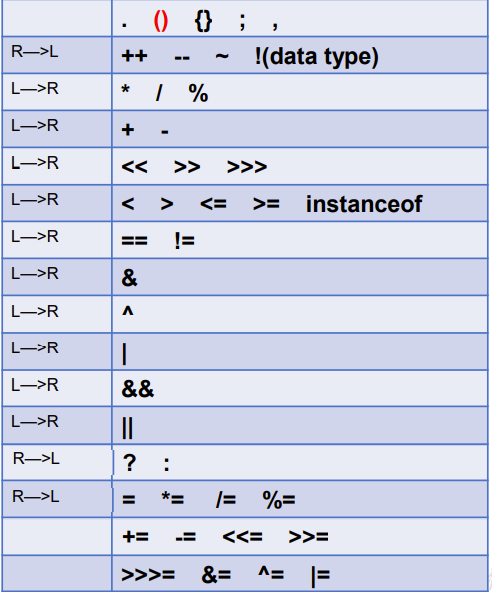


# 第2章 基本语法(下)：程序流程控制

## 2-5 程序流程控制

- 流程控制语句是用来控制程序中各语句执行顺序的语句，可以把语句组
合成能完成一定功能的小逻辑模块。
- 其流程控制方式采用结构化程序设计中规定的三种基本流程结构，即：
  - 顺序结构：程序从上到下逐行地执行，中间没有任何判断和跳转。
  - 分支结构：根据条件，选择性地执行某段代码。有 if...else 和 switch-case 两种分支语句。
  - 循环结构：根据循环条件，重复性的执行某段代码。有 while、do ... while、for三种循环语句。jdk1.5提供了foreach

### 2-5-1 顺序结构

Java中定义成员变量时采用合法的前向引用。（变量在使用**前**要定义）

### 2-5-2 分支语句1：if-else结构

if语句三种格式：
```java
if(条件表达式){
  执行代码块；
}
```
```java
if(条件表达式){ // 二选一
  执行代码块1;
}
else{
  执行代码块2;
}
```
```java
if(条件表达式1){ // 多选一
  执行代码块1;
}
else if (条件表达式2){
  执行代码块2;
}
......
else{
  执行代码块n;
}
```

分支结构：if-else使用说明
- 条件表达式必须是布尔表达式（关系表达式或逻辑表达式）、布尔变量
- 语句块只有一条执行语句时，一对{}可以省略，但建议保留以增强可读性，方便后期添加代码逻辑。
- if-else语句结构，根据需要可以嵌套使用
- 当if-else结构是"多选一"时，最后的else是可选的，根据需要可以省略
  - 可能会产生无法覆盖所有情况的时候，所以很多时候还是加上else的
  - else的**就近原则**，else总是和上文最近的if配对。（注意没有花括号的那种if）
- 当多个条件是"互斥"关系时，条件判断语句及执行语句间顺序无所谓；
- 当多个条件有"交集"关系时，考虑清楚应该将哪个结构声明在上面。
- 当多个条件是"包含"关系时，"小上大下 / 子上父下"（范围小的声明在范围大的上面。否则，范围小的就没机会执行了。）

从键盘获取不同类型的变量  
使用Scanner类步骤：
1. 导包：`import java.util.Scanner;`
2. Scanner的实例化：`Scanner scan = new Scanner(System.in);`
3. 调用Scanner类的相关方法（next() / nextXxx()），来获取指定类型的变量

注意：
- 需要根据相应的方法，来输入指定类型的值。如果输入的数据类型与要求的类型不匹配时，会报异常：InputMisMatchException导致程序终止。
- Scanner没有提供char型获取相关的方法。只能获取一个字符串，可以使用`scan.next().charAt(0);`来获取一个字符。但是这样的话控制台将会有一个字符串被取出。
- 为了避免输入错误，程序中不要在基于标记的输入（如next、nextXxx）之后使用基于行的输入（nextLine）。因为基于标记的输入会将换行符号留在缓冲区。

获取一个 [ a , b ) 的随机数：`Math.random() * (b - a) + a`

### 2-5-3 分支语句2：switch-case结构

```java
switch(表达式){
  case 常量1:
    语句1;
    // break;
  case 常量2:
    语句2;
    // break;
  ... ...
  case 常量N:
    语句N;
    // break;
  default:
    语句;
    // break;
}
```

switch语句有关规则
- switch(表达式)中表达式的值必须是下述几种类型之一：**byte，short，char，int，枚举 (jdk 5.0)，String (jdk 7.0)；**
- case子句中的值必须是常量，不能是范围，不能是变量名或不确定的表达式值；
- 同一个switch语句，所有case子句中的常量值互不相同；
- break语句用来在执行完一个case分支后使程序跳出switch语句块；如果没有break，程序会顺序执行到switch结尾（落空行为）
  - 计算switch表达式中的值
  - 依次匹配各个case中的常量。
  - 匹配成功，则进入相应case结构中，调用其执行语句。
  - 当调用完执行语句以后，则仍然继续向下执行其他case结构中的执行语句，直到遇到break关键字或此switch-case结构末尾结束为止。
- default子句是可任选的。同时，位置也是灵活的。当没有匹配的case时，执行default。注意：当default不在最后时，如果不加break，当没有匹配的case时，会执行default及以后的case代码，直到遇到break或此switch-case结构末尾结束为止。

switch和if语句的对比
- 如果判断的具体数值不多，而且符合byte、short 、char、int、String、枚举等几种类型。虽然两个语句都可以使用，建议使用swtich语句。因为效率稍高。
- 其他情况：对区间判断，对结果为boolean类型判断，使用if，if的使用范围更广。也就是说，使用switch-case的，都可以改写为if-else。反之不成立。

```java
switch(score){
		case 0:		case 1:		case 2:			...
		case 100:
}
switch(score / 10){
		case 0:		case 1:		case 2:		case 3:		case 4:		case 5:
			System.out.println("不及格");
			break;
		case 6:		case 7:		case 8:		case 9:		case 10:
			System.out.println("及格");
			break;
}
// 当一个switch中case过多时，考虑进行合并。
switch(score / 60){
		case 0:			System.out.println("不及格");			break;
		case 1:			System.out.println("及格");			break;
}
```

一个不错的switch案例：
计算这是这一年的第多少天
```java
switch(month){
		case 12:		sumDays += 30;
		case 11:		sumDays += 31;
		case 10:		sumDays += 30;
		case 9:			sumDays += 31;
		case 8:			sumDays += 31;
		case 7:			sumDays += 30;
		case 6:			sumDays += 31;
		case 5:			sumDays += 30;
		case 4:			sumDays += 31;
		case 3:			sumDays += ((year % 4 == 0 && year % 100 != 0 ) || year % 400 == 0)?29:28;
		case 2:			sumDays += 31; // 上个月的
		case 1:			sumDays += day; // 当月的
}
```

### 2-5-4 循环结构

- 循环结构
  - 在某些条件满足的情况下，反复执行特定代码的功能
- 循环语句分类
  - for 循环
  - while 循环
  - do-while 循环

循环语句的四个组成部分
- 初始化部分(init_statement)
- 循环条件部分(test_exp)
- 循环体部分(body_statement)
- 迭代部分(alter_statement)

### 2-5-5 循环结构1：for循环

```java
for (①初始化部分; ②循环条件部分; ④迭代部分)｛
  ③循环体部分;
｝
```
说明：
- ②循环条件部分为boolean类型表达式（缺省为true），当值为false时，退出循环。
- ①初始化部分可以声明多个变量（同类型），或者为多个变量赋值，用逗号分隔。作用域为当前for循环。
- ④每次迭代后的动作：可以是0个或多个用逗号隔开的语句（通常用于变量更新）。
- 控制变量必须在循环控制结构体内或循环前说明。如果循环控制变量只在循环内使用而不在其他地方使用，那么在 for 循环的初始操作中声明它是一个良好的编程习惯。如果在循环控制结构体内声明变量，那么在循环外不能引用它。

```java
//获取最大公约数
int min = (m <= n)? m : n;//1.获取两个数中的较小值
for(int i = min;i >= 1 ;i--){//2.遍历
  if(m % i == 0 && n % i == 0){
    System.out.println("最大公约数为：" + i);
    break;//一旦在循环中执行到break，就跳出循环
  }
}
//获取最小公倍数
int max = (m >= n)? m : n;//1.获取两个数中的较大值
for(int i = max;i <= m * n;i++){//2.遍历
  if(i % m == 0 && i % n == 0){
    System.out.println("最小公倍数：" + i);
    break;
  }
}
// 警惕差一错误：
// [0,n]->n+1
// [0,n)->n
// [1,n]->n
// [1,n)->n-1
```

### 2-5-6 循环结构2：while循环

```java
①初始化部分
while(②循环条件部分)｛
  ③循环体部分;
  ④迭代部分;
}
```

说明：
- 注意不要忘记声明④迭代部分。否则，循环将不能结束，变成死循环。
- for循环和while循环可以相互转换
  - 区别：for循环和while循环的初始化条件部分的作用范围不同。

### 2-5-7 循环结构3：do-while循环

```java
①初始化部分;
do{
  ③循环体部分
  ④迭代部分
}while(②循环条件部分); // 不要忘记这里的分号
```

- while和for称为前测循环，do-while称为后测循环
- do-while循环**至少执行一次循环体**。当循环体超过一次被执行时，与while一致，但习惯上使用while。

> 最简单"无限" 循环格式：while(true) , for(;;),无限循环存在的原因是并不知道循环多少次，需要根据循环体内部某些条件，来控制循环的结束。结束循环的两种方式，方式一：循环条件部分返回false；方式二：在循环体中，执行break。

### 2-5-8 嵌套循环(多重循环)

1. 嵌套循环：将一个循环结构A声明在另一个循环结构B的循环体中,就构成了嵌套循环。其中，for ,while ,do...while均可以作为外层循环或内层循环。
2. 外层循环：循环结构B ； 内层循环：循环结构A （内外是相对的）
3. 说明：内层循环结构遍历一遍，只相当于外层循环循环体执行了一次
   - 实质上，嵌套循环就是把内层循环当成外层循环的循环体。当只有内层循环的循环条件为false时，才会完全跳出内层循环，才可结束外层的当次循环，开始下一次的循环。
   - 设外层循环次数为m次，内层为n次，则内层循环体实际上需要执行m*n次。
4. 技巧：外层循环控制行数，内层循环控制列数

### 2-5-9 特殊关键字的使用：break、continue

- break 语句
  - break语句用于终止某个语句块的执行

  ```java
  { 
    ......
    break;
    ......
  }
  ```

  - break语句出现在多层嵌套的语句块中时，可以通过标签指明要终止的是哪一层语句块

  ```java
  label1: { ......
  label2:   { ......
  label3:     { ......
                break label2;
                ......
              }
            }
          }
  ```

- continue 语句
  - continue只能使用在循环结构中
  - continue语句用于跳过其所在循环语句块的一次执行，继续下一次循环
  - continue语句出现在多层嵌套的循环语句体中时，可以通过标签指明要跳过的是哪一层循环

- 附加：特殊流程控制语句3
  - return：并非专门用于结束循环的，它的功能是结束一个方法。当一个方法执行到一个return语句时，这个方法将被结束。
  - 与break和continue不同的是，return直接结束整个方法，不管这个return处于多少层循环之内
  - 当循环层数过多时，可以考虑抽取为方法，使用return结束当前方法，返回相应值。

```java
// 经典案例：质数计数。
label:for(int i = 2;i <= 100000;i++){ //遍历100000以内的自然数
    for(int j = 2;j <= Math.sqrt(i);j++) //Math.sqrt(i)优化
		    if(i % j == 0) //i被j除尽
				    continue label;//优化
    count++;//能执行到此步骤的，都是质数
}
```

### 特殊流程控制语句说明

- break只能用于switch语句和循环语句中。
- continue 只能用于循环语句中。
- 二者功能类似，但continue是终止本次循环，break是终止本层循环。
- break、continue之后不能有其他的语句，因为程序永远不会执行其后的语句。(这些代码被称为死代码，编译时可能都过不了)。注意后面不包括外面，当遇到一个 } 时，控制结束。
- 标号语句必须紧接在循环的头部。标号语句不能用在非循环语句的前面。
- 很多语言都有goto语句，goto语句可以随意将控制转移到程序中的任意一条语句上，然后执行它。但使程序容易出错。Java中的break和continue是不同于goto的。
- 警告：不要比较浮点值是否相等来进行循环控制。因为浮点值都是近似值，使用它们可能导致不精确的循环次数和不准确的结果。如果一定要使用请尽量不要进行相等判断，累加时先加较小的数值以减少误差。

## 补充：计算机字符编码

1. 有关编码的基础知识
   1. 位 bit 最小的单元
   2. 字节 byte 机器语言的单位 1byte=8bits
      1. 1KB=1024byte
      2. 1MB=1024KB
      3. 1GB=1024MB
2. 进制
   1. 二进制 binary
   2. 八进制 octal
   3. 十进制 decimal
   4. 十六进制 hex
3. 字符
   1. 字符：是各种文字和符号的总称，包括各个国家的文字，标点符号，图形符号，数字等。
   2. 字符集：字符集是多个符号的集合，每个字符集包含的字符个数不同。
   3. 字符编码：字符集只是规定了有哪些字符，而最终决定采用哪些字符，每一个字符用多少字节表示等问题，则是由编码来决定的。计算机要准确的处理各种字符集文字，需要进行字符编码，以便计算机能够识别和存储各种文字。
4. ANSI 在中国大陆即为 GBK（以前是 GB2312），最常用的是 GBK 和 UTF8 无 BOM 编码格式。
5. 有 BOM 头的文本格式，UCS-2 即为人们常说的 Unicode 编码，又分为大端、小端。
   1. 所谓 BOM 头（Byte Order Mark）就是文本文件中开始的几个并不表示任何字符的字节，用二进制编辑器（如 bz.exe）就能看到了。
      1. UTF8 的 BOM 头为 0xEF 0xBB 0xBF
      2. Unicode 大端模式为 0xFE 0xFF
      3. Unicode 小端模式为 0xFF 0xFE
6. ASCII 码
   1. 计算机一开始发明的时候是用来解决数字计算的问题，后来人们发现，计算机还可以做更多的事，例如文本处理。但由于计算机只识“数”，因此人们必须告诉计算机哪个数字来代表哪个特定字符，例如 65 代表字母‘A’，66 代表字母‘B’，以此类推。但是计算机之间字符-数字的对应关系必须得一致，否则就会造成同一段数字在不同计算机上显示出来的字符不一样。因此美国国家标准协会 ANSI 制定了一个标准，规定了常用字符的集合以及每个字符对应的编号，这就是 ASCII 字符集（Character Set），也称 ASCII 码。那时候的字符编解码系统非常简单，就是简单的查表过程。例如将字符序列编码为二进制流写入存储设备，只需要在 ASCII 字符集中依次找到字符对应的字节，然后直接将该字节写入存储设备即可。解码二进制流的过程也是类似。
   2. 0～31 及 127(共 33 个)是控制字符或通信专用字符（其余为可显示字符），如控制符：LF（换行）、CR（回车）、FF（换页）、DEL（删除）、BS（退格)
   3. 32～126(共 95 个)是字符(32 是空格），其中 48～57 为 0 到 9 十个阿拉伯数字。
   4. 65～90 为 26 个大写英文字母，97～122 号为 26 个小写英文字母，其余为一些标点符号、运算符号等。
   5. 后 128 个称为扩展 ASCII 码。许多基于 x86 的系统都支持使用扩展（或“高”）ASCII。扩展ASCII 码允许将每个字符的第 8 位用于确定附加的 128 个特殊符号字符、外来语字母和图形符号。
7. OEM 字符集的衍生
   1. 当计算机开始发展起来的时候，人们逐渐发现，ASCII 字符集里那可怜的 128 个字符已经不能再满足他们的需求了。人们就在想，一个字节能够表示的数字（编号）有 256 个，而 ASCII 字符只用到了 0x00~0x7F，也就是占用了前 128 个，后面 128 个数字不用白不用，因此很多人打起了后面这 128 个数字的主意。可是问题在于，很多人同时有这样的想法，但是大家对于0x80-0xFF 这后面的 128 个数字分别对应什么样的字符，却有各自的想法。这就导致了当时销往世界各地的机器上出现了大量各式各样的 OEM 字符集。大家对于 0x00~0x7F 这个范围的解释基本是相同的，而对于后半部分 0x80~0xFF 的解释却不一定相同。甚至有时候同样的字符在不同 OEM 字符集中对应的字节也是不同的。不同的 OEM 字符集导致人们无法跨机器交流各种文档。例如职员甲发了一封简历 résumés 给职员乙，结果职员乙看到的却是 r?sum?s，因为é字符在职员甲机器上的 OEM 字符集中对应的字节是 0x82，而在职员乙的机器上，由于使用的 OEM 字符集不同，对 0x82 字节解码后得到的字符却是?。
8. 多字节字符集（MBCS）和中文字符集
   1. 上面我们提到的字符集都是基于单字节编码，也就是说，一个字节翻译成一个字符。这对于拉丁语系国家来说可能没有什么问题，因为他们通过扩展第8个比特，就可以得到256个字符了，足够用了。
   2. 但是对于亚洲国家来说，256 个字符是远远不够用的。因此这些国家的人为了用上电脑，又要保持和 ASCII 字符集的兼容，就发明了多字节编码方式，相应的字符集就称为多字节字符集（Muilti-Bytes Charecter Set）。例如中国使用的就是双字节字符集编码。例如目前最常用的中文字符集 GB2312，涵盖了所有简体字符以及一部分其他字符；GBK（K 代表扩展的意思）则在 GB2312 的基础上加入了对繁体字符等其他非简体字符。这两个字符集的字符都是使用 1-2 个字节来表示。Windows 系统采用 936 代码页来实现对 GBK 字符集的编解码。在解析字节流的时候，如果遇到字节的最高位是 0 的话，那么就使用 936 代码页中的第 1 张码表进行解码，这就和单字节字符集的编解码方式一致了。如果遇到字节的最高位是 1 的话，那么就表示需要两个字节值才能对应一个字符。假如你使用 GB2312 写了这么一句话： 我叫 ABC 它的二进制编码是这样的： 11001110 11010010 10111101 11010000 01000001 01000002 01000003
   3. 全角是一种电脑字符，且每个全角字符占用两个标准字符（或半角字符）位置。通常的英文字母、数字键、符号键都是半角的，半角的显示内码都是一个字节。为了排列整齐，英文和其它拉丁文的字符和标点也提供了全角格式。在中文输入法中，切换全角和半角格式的快捷键为SHIFT+空格。
9. ANSI 标准、国家标准、ISO 标准
   1.  不同 ASCII 衍生字符集的出现，让文档交流变得非常困难，因此各种组织都陆续进行了标准化流程。例如美国 ANSI 组织制定了 ANSI 标准字符编码（注意，我们现在通常说到 ANSI 编码，通常指的是平台的默认编码，例如英文操作系统中是 ISO-8859-1，中文系统是 GBK），ISO 组织制定的各种 ISO 标准字符编码，还有各国也会制定一些国家标准字符集，例如中国的 GBK，GB2312 和 GB18030。
   2.  操作系统在发布的时候，通常会往机器里预装这些标准的字符集还有平台专用的字符集，这样只要你的文档是使用标准字符集编写的，通用性就比较高了。例如你用 GB2312 字符集编写的文档，在中国大陆内的任何机器上都能正确显示。同时，我们也可以在一台机器上阅读多个国家不同语言的文档了，前提是本机必须安装该文档使用的字符集。
10. Unicode 的出现
    1.  虽然通过使用不同字符集，我们可以在一台机器上查阅不同语言的文档，但是我们仍然无法解决一个问题：如果一份文档中含有不同国家的不同语言的字符，那么无法在一份文档中显示所有字符。为了解决这个问题，我们需要一个全人类达成共识的巨大的字符集，这就是 Unicode字符集。
    2.  Unicode 字符集涵盖了目前人类使用的所有字符，并为每个字符进行统一编号，分配唯一的字符码（Code Point）。Unicode 字符集将所有字符按照使用上的频繁度划分为 17 个层面（Plane），每个层面上有 2^16=65536 个字符码空间。
    3.  其中第 0 个层面 BMP，基本涵盖了当今世界用到的所有字符。其他的层面要么是用来表示一些远古时期的文字，要么是留作扩展。我们平常用到的 Unicode 字符，一般都是位于 BMP 层面上的。目前 Unicode 字符集中尚有大量字符空间未使用。
11. 编码系统的变化
    1.  在 Unicode 出现之前，所有的字符集都是和具体编码方案绑定在一起的（即字符集≈编码方式），都是直接将字符和最终字节流绑定死了，例如 ASCII 编码系统规定使用 7 比特来编码 ASCII 字符集；GB2312 以及 GBK 字符集，限定了使用最多 2 个字节来编码所有字符，并且规定了字节序。这样的编码系统通常用简单的查表，也就是通过代码页就可以直接将字符映射为存储设备上的字节流了。
    2.  Unicode 同样也不完美，这里就有三个问题：
        1.  一个是，我们已经知道，英文字母只用一个字节表示就够了
        2.  第二个问题是如何才能区别 Unicode 和 ASCII？计算机怎么知道两个字节表示一个符号，而不是分别表示两个符号呢？
        3.  第三个，如果和 GBK 等双字节编码方式一样，用最高位是 1 或 0 表示两个字节和一个字节，就少了很多值无法用于表示字符，不够表示所有字符。Unicode 在很长一段时间内无法推广，直到互联网的出现，为解决 Unicode 如何在网络上传输的问题，于是面向传输的众多 UTF（UCS Transfer Format）标准出现了，顾名思义，UTF-8 就是每次 8 个位传输数据，而 UTF-16 就是每次 16 个位。UTF-8 就是在互联网上使用最广的一种Unicode 的实现方式，这是为传输而设计的编码，并使编码无国界，这样就可以显示全世界上所有文化的字符了。UTF-8 最大的一个特点，就是它是一种变长的编码方式。它可以使用 1~4 个字节表示一个符号。从 unicode 到 uft-8 并不是直接的对应，而是要过一些算法和规则来转换（即 Uncidoe 字符集≠UTF-8 编码方式）。
        4.  因此，Unicode 只是定义了一个庞大的、全球通用的字符集，并为每个字符规定了唯一确定的编号，具体存储成什么样的字节流，取决于字符编码方案。推荐的 Unicode 编码是 UTF-16 和UTF-8。早期字符编码、字符集和代码页等概念都是表达同一个意思。例如 GB2312 字符集、GB2312编码，936 代码页，实际上说的是同个东西。但是对于 Unicode 则不同，Unicode 字符集只是定义了字符的集合和唯一编号，Unicode 编码，则是对UTF-8、UCS-2/UTF-16 等具体编码方案的统称而已，并不是具体的编码方案。所以当需要用到字符编码的时候，你可以写 gb2312，codepage936，utf-8，utf-16，但请不要写 Unicode。造成乱码的原因就是因为使用了错误的字符编码去解码字节流，因此当我们在思考任何跟文本显示有关的问题时，请时刻保持清醒：当前使用的字符编码是什么。只有这样，我们才能正确分析和处理乱码问题。

## Eclipse 的使用配置

1. Eclipse 的安装 https://www.eclipse.org/downloads/packages/  将 Eclipse 解压或安装到没有中文且没有空格的路径下。
2. 设置 workspace。首次启动,选择指定的工作空间(workspace)，用于存放 java 代码。中间的复选框,不建议打钩.如果打钩,每次 Eclipse 会自动进入上面选中的workspace 中.不利于 Eclipse 开启其他 workspace。
3. 可以去掉 welcome 页面右下角的钩，避免每次启动都显示。设置透视图(perspective)
4. 添加透视图需要显示的结构
   1. Package Explorer 
   2. Package Explorer 
   3. Outline
   4. Console
5. 关闭其它不需要的结构
6. 设置编码集：Windows -> Preferences -> General -> Workspace -> Text file encoding Other UTF-8
7. 设置字体,字形,字体大小：Windows -> Preferences -> General -> Appearance -> Color and Fonts -> Basic -> Text Font
8. 设置 package explorer 中右键:new 下显示的结构：Windows -> Perspective -> Customize Perspectives -> Menu Visibility -> File -> New
9. 保存当前透视图：Windows -> Perspective -> Save Perspective As -> Java EE

常见问题
1. 双击 Eclipse 启动图标，不能正常启动 Eclipse
   1. 启动不了的原因有很多种，这里需要大家从如下几个方面排查：
   2. 环境变量是否正确配置，需要在命令行输入 javac.exe 或 java.exe 进行检查
   3. 是否正确的安装了 JDK 和 JRE
   4. 安装的 JDK 的版本（32 位还是 64 位），必须与 Eclipse 版本一致
   5. 修改 Eclipse 安装目录下的 eclipse.ini 配置文件
2. 进入 Eclipse 时，没有可选择的 workspace
   1. 由于勾选了之前的复选框，所以再次启动 Eclipse 时，不再显示可选择的 workspace。
   2. 在 windows – Preferences - General - Startup and Shutdown - Workspaces下将Prompt for workspace on start勾上。
3. 如何导入已有的工程
   1. File - Import - Existing Projects into Workspace
   2. Copy projects into workspace
4. 如何导入已有的一个源文件：直接复制（ctrl + c）此源文件，直接在指定的工程的包下粘贴（ctrl + v）即可。
5. 如何删除一个工程：右键delete
6. 工程中的代码有乱码，上面的字符集设置出现问题。
7. 修改透视图：windows – Preferences - General - Perspectives
8. 我们对 Eclipse 做的设置，只对当前使用的 workspace 有效。设置的数据保存在相应 workspace 文件夹下的.metadata 文件夹中。如果创建了新的 workspace，则需要重新设置。

常用快捷键(General - Keys)
1. 补全代码的声明：alt + /
2. 快速修复: ctrl + 1  
3. 批量导包：ctrl + shift + o
4. 使用单行注释：ctrl + /
5. 使用多行注释： ctrl + shift + /   
6. 取消多行注释：ctrl + shift + \\
7. 复制指定行的代码：ctrl + alt + down 或 ctrl + alt + up
8. 删除指定行的代码：ctrl + d
9. 上下移动代码：alt + up  或 alt + down
10. 切换到下一行代码空位：shift + enter
11. 切换到上一行代码空位：ctrl + shift + enter
12. 如何查看源码：ctrl + 选中指定的结构   或  ctrl + shift + t
13. 退回到前一个编辑的页面：alt + left 
14. 进入到下一个编辑的页面(针对于上面那条来说的)：alt + right
15. 光标选中指定的类，查看继承树结构：ctrl + t
16. 复制代码： ctrl + c
17. 撤销： ctrl + z
18. 反撤销： ctrl + y
19. 剪切：ctrl + x 
20. 粘贴：ctrl + v
21. 保存： ctrl + s
22. 全选：ctrl + a
23. 格式化代码： ctrl + shift + f
24. 选中数行，整体往后移动：tab
25. 选中数行，整体往前移动：shift + tab
26. 在当前类中，显示类结构，并支持搜索指定的方法、属性等：ctrl + o
27. 批量修改指定的变量名、方法名、类名等：alt + shift + r
28. 选中的结构的大小写的切换：变成大写： ctrl + shift + x
29. 选中的结构的大小写的切换：变成小写：ctrl + shift + y
30. 调出生成getter/setter/构造器等结构： alt + shift + s
31. 显示当前选择资源(工程 or 文件)的属性：alt + enter
32. 快速查找：参照选中的Word快速定位到下一个 ：ctrl + k
33. 关闭当前窗口：ctrl + w
34. 关闭所有的窗口：ctrl + shift + w
35. 查看指定的结构使用过的地方：ctrl + alt + g
36. 查找与替换：ctrl + f
37. 最大化当前的View：ctrl + m
38. 直接定位到当前行的首位：home
39. 直接定位到当前行的末位：end


# 第3章 数组

## 3-1 数组的概述

- 数组(Array)，是多个**相同类型数据**按**一定顺序排列**的集合，并使用一个名字命名，并通过**编号**的方式对这些数据进行统一管理。
- 数组的常见概念
  - 数组名
  - 下标 ( 或索引 )
  - 元素
  - 数组的长度 ( 元素的个数 )

- 数组本身是**引用数据类型**，而数组中的元素可以是**任何数据类型**，包括基本数据类型和引用数据类型。
- 创建数组对象会在内存中开辟一整块**连续的空间**，而数组名中引用的是这块连续空间的首地址。
- 数组是有序排列的
- 数组的长度一旦确定，就**不能修改**。
- 我们可以直接通过下标(或索引)的方式调用指定位置的元素，速度很快。
- 数组的分类：
  - 按照维度：一维数组、二维数组、三维数组、...
  - 按照元素的数据类型分：基本数据类型元素的数组、引用数据类型元素的数组(即对象数组)

## 3-2 一维数组的使用

### 3.2 一维数组的使用：声明

一维数组的声明方式：`elementType[] arrayRedvar`

或 `elementType arrayRedvar[]`（c/c++风格，不推荐）

Java语言中**声明数组时**不能指定其长度(数组中元素的数)

### 3.2 一维数组的使用：初始化

动态初始化：数组声明且为数组元素分配空间与赋值的操作分开进行(数组的初始化和数组元素的赋值操作分开进行)

```java
int[] arr = new int[3];
arr[0] = 3;arr[1] = 9;arr[2] = 8;
```

静态初始化：在定义数组的同时就为数组元素分配空间并赋值。(数组的初始化和数组元素的赋值操作同时进行)

```java
int arr[] = new int[]{3, 9, 8}; //常规写法
new int[]{3, 9, 8}; //匿名数组，用于方法参数传递
int[] arr = {3,9,8}; //类型推断
int[] arr;arr = {3,9,8}; //错误写法
//总结：数组一旦初始化(静态、动态)完成，其长度(arr.length)就确定了。
```

### 3.2 一维数组的使用：数组元素的引用

- 定义并用运算符new为之分配空间后，才可以引用数组中的每个元素；
- 数组元素的引用方式：`数组名[数组元素下标]`
  - 数组元素下标可以是整型常量或整型表达式。如`a[3] , b[i] , c[6*i];`
  - 数组元素下标从0开始；长度为n的数组合法下标取值范围: 0 —> n-1；如`int a[]=new int[3]`; 可引用的数组元素为`a[0]、a[1]、a[2]`
- 每个数组都有一个属性length指明它的长度，例如：`a.length` 指明数组a的长度(元素个数)
  - 数组一旦初始化，其长度是不可变的
- 当一个数组传递给方法是数组的引用被传递给方法，当方法返回一个数组时，数组的引用被返回。

### 3.2 一维数组的使用：数组元素的默认初始化值

数组是引用类型，它的元素相当于类的成员变量，因此数组一经分配空间，其中的每个元素也被按照成员变量同样的方式被隐式初始化。例如：`int a[]= new int[5];`，其中每个项被初始化为0

- 对于基本数据类型而言，默认初始化值各有不同
- 对于引用数据类型而言，默认初始化值为null (注意与0不同！)。当使用new操作符创建对象数组后，这个数组中的每个元素都是默认值为null的引用变量。

| 数组元素类型 | 元素默认初始值              |
| ------------ | --------------------------- |
| byte         | 0                           |
| short        | 0                           |
| int          | 0                           |
| long         | 0L                          |
| float        | 0.0F                        |
| double       | 0.0                         |
| char         | 0 或写为:`\u0000`(表现为空) |
| boolean      | false                       |
| 引用类型     | null（没有调用构造器）      |

jvm内存解析


## 3-3 多维数组的使用

- Java 语言里提供了支持多维数组的语法。
- 如果说可以把一维数组当成几何中的线性图形，那么二维数组就相当于是一个表格，像Excel中的表格一样。
- 对于二维数组的理解，我们可以看成是一维数组array1又作为另一个一维数组array2的元素而存在。其实，**从数组底层的运行机制来看，其实没有多维数组。**

二维数组\[\]\[\]：数组中的数组

---

格式1（动态初始化）：`int[][] arr = new int[3][2];`  
> 定义了名称为arr的二维数组  
二维数组中有3个一维数组  
每一个一维数组中有2个元素  
一维数组的名称分别为`arr[0], arr[1], arr[2]`  
给第一个一维数组1脚标位赋值为78写法是：`arr[0][1] = 78;`

---

格式2（动态初始化）：`int[][] arr = new int[3][];`  
> 二维数组中有3个一维数组。  
每个一维数组都是默认初始化值null (注意：区别于格式1）  
可以对这个三个一维数组分别进行初始化  
`arr[0] = new int[3]; arr[1] = new int[1]; arr[2] = new int[2];`  
注：`int[][]arr = new int[][3]; //非法`

---

格式3（静态初始化）：`int[][] arr = new int[][]{{3,8,2},{2,7},{9,0,1,6}};`
> 定义一个名称为arr的二维数组，二维数组中有三个一维数组  
每一个一维数组中具体元素也都已初始化  
第一个一维数组 `arr[0] = {3,8,2};`  
第二个一维数组 `arr[1] = {2,7};`  
第三个一维数组 `arr[2] = {9,0,1,6};`  
第三个一维数组的长度表示方式：`arr[2].length;`  
- 注意特殊写法情况：int[] x, y[]; x是一维数组，y是二维数组。
- Java中多维数组不必都是规则矩阵形式

二维数组元素的默认初始化值 
- 针对于初始化方式一：比如：`int[][] arr = new int[4][3];`
  - 外层元素的初始化值为：地址值
  - 内层元素的初始化值为：与一维数组初始化情况相同
- 针对于初始化方式二：比如：`int[][] arr = new int[4][];`
  - 外层元素的初始化值为：null
  - 内层元素的初始化值为：不能调用，否则报错。

## 3-4 数组中涉及到的常见算法

1. 数组元素的赋值(杨辉三角、回形数\[不是回文数\]等)
2. 求数值型数组中元素的最大值、最小值、平均数、总和等
3. 数组的复制、反转(注意arr.length/2)、查找(线性查找、二分法查找)
4. 数组元素的**排序算法**
5. 随机不重复问题：随机取出可能导致重复，应当打乱(洗牌)后顺序取出。

在 Java 中实现数组复制分别有以下 4 种方法：
- Arrays 类的 copyOf() 方法
- Arrays 类的 copyOfRange() 方法
- System 类的 arraycopy() 方法
- Object 类的 clone() 方法

### 3.4 数组中涉及到的常见算法：排序算法

1. **排序**：假设含有n个记录的序列为{R1，R2，...,Rn},其相应的关键字序列为{K1，K2，...,Kn}。将这些记录重新排序为{Ri1,Ri2,...,Rin},使得相应的关键字值满足条Ki1\<=Ki2\<=...\<=Kin,这样的一种操作称为排序。
   - 通常来说，排序的目的是快速查找。
   衡量排序算法的优劣：
   1. 时间复杂度：分析关键字的比较次数和记录的移动次数
   2. 空间复杂度：分析排序算法中需要多少辅助内存
   3. 稳定性：若两个记录A和B的关键字值相等，但排序后A、B的先后次序保持不变，则称这种排序算法是稳定的。

   排序算法分类：内部排序和外部排序。
   - 内部排序：整个排序过程不需要借助于外部存储器（如磁盘等），所有排序操作都在内存中完成。
   - 外部排序：参与排序的数据非常多，数据量非常大，计算机无法把整个排序过程放在内存中完成，必须借助于外部存储器（如磁盘）。外部排序最常见的是多路归并排序。可以认为外部排序是由多次内部排序组成。

2. 十大内部排序算法
   - 选择排序
     - 直接选择排序、**堆排序**
   - 交换排序
     - **冒泡排序**、**快速排序**
   - 插入排序
     - 直接插入排序、折半插入排序、Shell排序
   - **归并排序**
   - 桶式排序
   - 基数排序

3. 算法的5大特征

| 特征                            | 详情                                                                                 |
| ------------------------------- | ------------------------------------------------------------------------------------ |
| 输入（Input）                   | 有0个或多个输入数据，这些输入必须有清楚的描述和定义                                  |
| 输出（Output）                  | 至少有1个或多个输出结果，不可以没有输出结果                                          |
| 有穷性（有限性，Finiteness）    | 算法在有限的步骤之后会自动结束而不会无限循环，并且每一个步骤可以在可接受的时间内完成 |
| 确定性（明确性，Definiteness）  | 算法中的每一步都有确定的含义，不会出现二义性                                         |
| 可行性（有效性，Effectiveness） | 算法的每一步都是清楚且可行的，能让用户用纸笔计算而求出答案                           |

说明：满足确定性的算法也称为：确定性算法。现在人们也关注更广泛的概念，例如考虑各种非确定性的算法，如并行算法、概率算法等。另外，人们也关注并不要求终止的计算描述，这种描述有时被称为过程（procedure）。

4. 冒泡排序
   1. 介绍:冒泡排序的原理非常简单，它重复地走访过要排序的数列，一次比较两个元素，如果他们的顺序错误就把他们交换过来。
   2. 排序思想：
      1. 比较相邻的元素。如果第一个比第二个大（升序），就交换他们两个。
      2. 对每一对相邻元素作同样的工作，从开始第一对到结尾的最后一对。这步做完后，最后的元素会是最大的数。
      3. 针对所有的元素重复以上的步骤，除了最后一个。
      4. 持续每次对越来越少的元素重复上面的步骤，直到没有任何一对数字需要比较为止。
5. 快速排序
   1. 介绍：快速排序通常明显比同为O(nlogn)的其他算法更快，因此常被采用，而且快排采用了分治法的思想，所以在很多笔试面试中能经常看到快排的影子。可见掌握快排的重要性。
   2. 快速排序（Quick Sort）由图灵奖获得者Tony Hoare发明，被列为20世纪十大算法之一，是迄今为止所有内排序算法中速度最快的一种。冒泡排序的升级版，交换排序的一种。快速排序的时间复杂度为O(nlog(n))。
   3. 排序思想：
      1. 从数列中挑出一个元素，称为"基准"（pivot），
      2. 重新排序数列，所有元素比基准值小的摆放在基准前面，所有元素比基准值大的摆在基准的后面（相同的数可以到任一边）。在这个分区结束之后，该基准就处于数列的中间位置。这个称为分区（partition）操作。
      3. 递归地（recursive）把小于基准值元素的子数列和大于基准值元素的子数列排序。
      4. 递归的最底部情形，是数列的大小是零或一，也就是永远都已经被排序好了。虽然一直递归下去，但是这个算法总会结束，因为在每次的迭代（iteration）中，它至少会把一个元素摆到它最后的位置去。
  ```java
  /* 快速排序 : 通过一趟排序将待排序记录分割成独立的两部分，其中一部分记录的关键字均比另一部分关键字小，则分别对这两部分继续进行排序，直到整个序列有序。  */
  public class QuickSort {
    private static void swap(int[] data, int i, int j) {
      int temp = data[i];      data[i] = data[j];      data[j] = temp;
    }
    private static void subSort(int[] data, int start, int end) {
      if (start < end) {
        int base = data[start];
        int low = start;
        int high = end + 1;
        while (true) {
          while (low < end && data[++low] - base <= 0);
          while (high > start && data[--high] - base >= 0);
          if (low < high) {swap(data, low, high);} else {break;}
        }
        swap(data, start, high);
        subSort(data, start, high - 1);//递归调用
        subSort(data, high + 1, end);
      }
    }
    public static void quickSort(int[] data){
      subSort(data,0,data.length-1);
    }
  }
  ```
6. 排序算法性能对比
  
7. 各种内部排序方法性能比较
   1. 从**平均时间**而言：**快速排序最佳**。但在最坏情况下时间性能不如堆排序和归并排序。
   2. 从**算法简单性**看：由于直接选择排序、直接插入排序和冒泡排序的算法比较简单，将其认为是简单算法。对于Shell排序、堆排序、快速排序和归并排序算法，其算法比较复杂，认为是复杂排序。
   3. 从**稳定性**看：直接插入排序、冒泡排序和归并排序时稳定的；而直接选择排序、快速排序、 Shell排序和堆排序是不稳定排序
   4. 从**待排序的记录数**n的大小看，n较小时，宜采用简单排序；而n较大时宜采用改进排序。
8. **排序算法的选择**
   1. 若n较小(如n≤50)，可采用直接插入或直接选择排序。当记录规模较小时，直接插入排序较好；否则因为直接选择移动的记录数少于直接插入，应选直接选择排序为宜。
   2. 若文件初始状态基本有序(指正序)，则应选用直接插入、冒泡或随机的快速排序为宜；
   3. 若n较大，则应采用时间复杂度为O(nlgn)的排序方法：快速排序、堆排序或归并排序。

## 3-5 Arrays工具类的使用

java.util.Arrays类即为操作数组的工具类，包含了用来操作数组（比如排序和搜索）的各种方法。

| 序号 | 方法签名(雾)                      | 功能描述                               |
| ---- | --------------------------------- | -------------------------------------- |
| 1    | boolean equals(int[] a,int[] b)   | 判断两个数组是否相等。                 |
| 2    | String toString(int[] a)          | 输出数组信息。                         |
| 3    | void fill(int[] a,int val)        | 将指定值填充到数组之中。               |
| 4    | void sort(int[] a)                | 对数组进行排序。                       |
| 5    | int binarySearch(int[] a,int key) | 对排序后的数组进行二分法检索指定的值。 |

关于binarySearch的说明：搜索关键字的索引，如果它包含在指定范围内的数组中; 否则， (-(insertion point) - 1) 。 插入点定义为键将插入到数组中的点：范围中第一个元素的索引大于键，或者如果范围中的所有元素都小于指定键， toIndex 。 请注意，当且仅当找到密钥时，这才能保证返回值> = 0。

## 3-6 数组使用中的常见异常(编译时，不报错！！)

数组脚标越界异常(ArrayIndexOutOfBoundsException)

```java
int[] arr = new int[2];
System.out.println(arr[2]);
System.out.println(arr[-1]);
```

访问到了数组中的不存在的脚标时发生。

---

空指针异常(NullPointerException)

```java
int[] arr = null;
System.out.println(arr[0]);
```

arr引用没有指向实体，却在操作实体中的元素时。


# 第4章 面向对象编程(上)

1. Java类及类的成员：属性、方法、构造器；代码块、内部类
2. 面向对象的三大特征：封装性、继承性、多态性、(抽象性)
3. 其它关键字：this、super、static、final、abstract、interface、package、import等

## 4-1 面向过程与面向对象

首先解释一下“思想”。  
先问你个问题：你想做个怎样的人？  
可能你会回答：我想做个好人，孝敬父母，尊重长辈，关爱亲朋......  
你看，这就是思想。这是你做人的思想，或者说，是你做人的原则。  
做人有做人的原则，编程也有编程的原则。这些编程的原则呢，就是编程思想。

- 面向过程(Procedure Oriented Programming) 与 面向对象(Object Oriented Programming)
  - 二者都是一种思想，面向对象是相对于面向过程而言的。面向过程，强调的是功能行为，以函数为最小单位，考虑怎么做。面向对象，将功能封装进对象，强调具备了功能的对象，以类/对象为最小单位，考虑谁来做。
  - 面向对象更加强调运用人类在日常的思维逻辑中采用的思想方法与原则，如抽象、分类、继承、聚合、多态等。
- 面向对象的三大特征
  - 封装 (Encapsulation)
  - 继承 (Inheritance)
  - 多态 (Polymorphism)

### 面向对象的思想概述

- 程序员从面向过程的**执行者**转化成了面向对象的**指挥者**
- 面向对象分析方法分析问题的思路和步骤：
  - 根据问题需要，选择问题所针对的**现实世界中的实体**。
  - 从实体中寻找解决问题相关的属性和功能，这些属性和功能就形成了**概念世界中的类**。
  - 把抽象的实体用计算机语言进行描述，形成**计算机世界中类的定义**。即借助某种程序语言，把类构造成计算机能够识别和处理的数据结构。
  - 将**类实例化成计算机世界中的对象**。对象是计算机世界中解决问题的最终工具。

## 4-2 Java语言的基本元素：类和对象

面向对象的思想概述
- 类(Class)和对象(Object)是面向对象的核心概念。
  - 类是对一类事物的描述，是抽象的、概念上的定义
  - 对象是实际存在的该类事物的每个个体，因而也称为实例(instance)。
- “万事万物皆对象”
  - 可以理解为：类 = 抽象概念的人；对象 = 实实在在的某个人
  - 面向对象程序设计的重点是**类的设计**
  - 类的设计，**其实就是类的成员的设计**
- 理解“万事万物皆对象”
  1. 在Java语言范畴中，我们都将功能、结构等封装到类中，通过类的实例化，来调用具体的功能结构；Scanner,String等；文件：File；网络资源：URL
  2. 涉及到Java语言与前端Html、后端的数据库交互时，前后端的结构在Java层面交互时，都体现为类、对象。

### Java类及类的成员

- 现实世界的生物体，大到鲸鱼，小到蚂蚁，都是由最基本的细胞构成的。同理，Java代码世界是由诸多个不同功能的类构成的。
- 现实生物世界中的细胞又是由什么构成的呢？细胞核、细胞质、... 那么，Java中用类class来描述事物也是如此。常见的类的成员有：
  - 属 性：对应类中的成员变量(Field = 属性 = 成员变量 = 域、字段)
  - 行 为：对应类中的成员方法(Method = (成员)方法 = 函数)

### 类的语法格式

```java
修饰符 class 类名 {
  属性声明;
  方法声明;
}
```

说明：修饰符public：类可以被任意访问; 类的正文要用{ }括起来

创建Java自定义类步骤：
1. 定义类（考虑修饰符、类名）
2. 编写类的属性（考虑修饰符、属性类型、属性名、初始化值）
3. 编写类的方法（考虑修饰符、返回值类型、方法名、形参等）

## 4-3 对象的创建和使用

- 创建对象语法： `类名 对象名 = new 类名();`
- 使用`对象名.对象成员`的方式访问对象成员（包括属性和方法）

> 如果创建了一个类的多个对象，对于类中定义的属性（非static的），每个对象都拥有各自的一套副本，且互不干扰。(修改一个对象的属性a，不影响另外一个对象属性a的值。)

类的访问机制：
- 在一个类中的访问机制：类中的方法可以直接访问类中的成员变量。（例外：static方法访问非static，编译不通过。）
- 在不同类中的访问机制：先创建要访问类的对象，再用对象访问类中定义的成员。

### 内存解析


- 堆（Heap），此内存区域的唯一目的就是存放对象实例，几乎所有的对象实例都在这里分配内存。这一点在Java虚拟机规范中的描述是：所有的对象实例以及数组都要在堆上分配。
- 通常所说的栈（Stack），是指虚拟机栈。虚拟机栈用于存储局部变量等。局部变量表存放了编译期可知长度的各种基本数据类型（boolean、byte、char 、 short 、 int 、 float 、 long 、double）、对象引用（reference类型，它不等同于对象本身，是对象在堆内存的首地址）。 方法执行完，自动释放。
- 方法区（Method Area），用于存储已被虚拟机加载的类信息、常量、静态变量、即时编译器编译后的代码等数据。

### 匿名对象

- 我们也可以不定义对象的句柄，而直接调用这个对象的方法。这样的对象叫做匿名对象。`new Person().shout(); `。理解：我们创建的对象，没有显式的赋给一个变量名。即为匿名对象。
- 使用情况
  - 匿名对象只能调用一次，如果对一个对象只需要进行一次方法调用，那么就可以使用匿名对象。
  - 我们经常将匿名对象作为实参传递给一个方法调用。

## 4-4 类的成员之一：属性(field) 

- 语法格式：
`修饰符 数据类型 属性名 = 初始化值; `
  - 说明1: 修饰符
    - 常用的权限修饰符有：private、缺省、protected、public
    - 其他修饰符：static、final (暂不考虑)
  - 说明2：数据类型
    - 任何基本数据类型(如int、Boolean) 或 任何引用数据类型。
  - 说明3：属性名
    - 属于标识符，符合命名规则和规范即可。

### 变量的分类：成员变量与局部变量

- 在方法体外，类体内声明的变量称为成员变量。
- 在方法体内部声明的变量称为局部变量。

变量
- 成员变量(属性)
  - 实例变量（不以static修饰）
  - 类变量（以static修饰）
- 局部变量
  - 形参（方法、构造器中定义的变量）
  - 方法局部变量（在方法内定义）
  - 代码块局部变量（在代码块内定义）

注意：二者在初始化值方面的异同:  
  同：都有生命周期  
  异：局部变量除形参外，均需显式初始化。  

| 比较项目     | 成员变量                         | 局部变量                                 |
| ------------ | -------------------------------- | ---------------------------------------- |
| 声明的位置   | 直接声明在类中                   | 方法形参或内部、代码块内、构造器内等     |
| 修饰符       | private、public、static、final等 | 不能用权限修饰符修饰，可以用final修饰    |
| 初始化值     | 有默认初始化值                   | 没有默认初始化值，必须显式赋值，方可使用 |
| 内存加载位置 | 堆空间 或 静态域内               | 栈空间                                   |

### 对象属性的默认初始化赋值

当一个对象被创建时，会对其中各种类型的**成员变量**自动进行初始化赋值。除了基本数据类型之外的变量类型都是引用类型，如上面的Person及前面讲过的数组。

### 属性（成员变量） vs 局部变量

1. 相同点：
   1. 定义变量的格式：数据类型  变量名 = 变量值
   2. 先声明，后使用
   3. 变量都有其对应的作用域 
2. 不同点：
   1. 在类中声明的位置的不同。属性：直接定义在类的一对{}内，局部变量：声明在方法内、方法形参、代码块内、构造器形参、构造器内部的变量
   2. 关于权限修饰符的不同。属性：可以在声明属性时，指明其权限，使用权限修饰符。
      1. 常用的权限修饰符：private、public、缺省、protected  --->封装性
      2. 局部变量：不可以使用权限修饰符。
   3.  默认初始化值的情况：	属性：类的属性，根据其类型，都有默认初始化值。		整型（byte、short、int、long）：0；		浮点型（float、double）：0.0；		字符型（char）：0  （或'\u0000'）；		布尔型（boolean）：false；		引用数据类型（类、数组、接口）：null。	局部变量：没有默认初始化值。	意味着，我们在调用局部变量之前，一定要显式赋值。		特别地：形参在调用时，我们赋值即可。
	 4. 在内存中加载的位置：  	属性：加载到堆空间中   （非static）	；局部变量：加载到栈空间

## 4-5 类的成员之二：方法(method)

什么是方法(method、函数):
- 方法是类或对象行为特征的抽象，描述类应该具有的功能，用来完成某个功能操作的语句组。在某些语言中也称为函数或过程。
- 将功能封装为方法的目的是，可以实现代码重用，简化代码
- Java里的方法不能独立存在，所有的方法必须定义在类里。

方法的声明格式：

```java
修饰符 返回值类型 方法名（参数类型 形参1, 参数类型 形参2, ....）｛//方法头
  方法体程序代码; // 方法体
  return 返回值; // return语句对于void方法不是必须的
｝
```

其中：  
- 修饰符：public , protected , 缺省 , private等，static、final、abstract 来修饰的方法，后面再讲。
- 返回值类型：
  - 没有返回值：void。
  - 有返回值，声明出返回值的类型。与方法体中“return 返回值”搭配使用
- 方法签名：
  - 方法名：属于标识符，命名时遵循标识符命名规则和规范，“见名知意”
  - 形参列表：可以包含零个，一个或多个参数。多个参数时，中间用“,”隔开
- 返回值：方法在执行完毕后返还给调用它的程序的数据。

方法的分类：按照是否有形参及返回值
| 形参   | 无返回值(void)            | 有返回值                          |
| ------ | ------------------------- | --------------------------------- |
| 无形参 | void 方法名（）{}         | 返回值的类型 方法名（）{}         |
| 有形参 | void 方法名（形参列表）{} | 返回值的类型 方法名（形参列表）{} |

方法通过方法名被调用，且只有被调用才会执行。

- 方法被调用一次，就会执行一次
- 没有具体返回值的情况，返回值类型用关键字void表示，那么方法体中可以不必使用return语句。如果使用，仅用来结束方法。（不是必须的，但可能是有用的）
- 定义方法时，方法的结果应该返回给调用者，交由调用者处理。
- 方法中只能调用方法或属性，不可以在方法内部定义方法。
- 注意：return关键字后面不可以声明执行语句。

## 4-6 再谈方法

### 再谈方法1：方法的重载(overload)

1. 重载的概念  
在**同一个类**中，允许存在一个以上的**同名**方法，只要它们的参数个数或者参数类型不同即可。
2. 重载的特点：  
与返回值类型无关，只看参数列表，且参数列表必须不同。(参数个数或参数类型)。调用时，根据方法参数列表的不同来区别。

### 再谈方法2：可变个数的形参

JavaSE 5.0 中提供了Varargs(variable number of arguments)机制，允许直接定义能和多个实参相匹配的形参。从而，可以用一种更简单的方式，来传递个数可变的实参。

```java
//JDK 5.0以前：采用数组形参来定义方法，传入多个同一类型变量
public static void test(int a ,String[] books);
//JDK5.0：采用可变个数形参来定义方法，传入多个同一类型变量
public static void test(int a ,String...books);
```

说明：
1. 声明格式：方法名(参数的类型名 ...参数名)
2. 可变参数：方法参数部分指定类型的参数个数是可变多个：0个，1个或多个
3. 可变个数形参的方法与同名的方法之间，彼此构成重载
4. 可变参数方法的使用与方法参数部分使用数组是一致的（两者不构成重载）
5. 方法的参数部分有可变形参，需要放在形参声明的最后
6. 在一个方法的形参位置，最多只能声明一个可变个数形参（其实还是5，因为如果有多个那么前面的一定不符合形参声明的最后这一条件）

```java
public void show(String s){} // 1
// 以下两个方法只是形式上不同而已，本质上是一样的，同时定义会报错
public void show(String ... strs){} // 2
public void show(String[] strs){}
// 调用
test.show(); // 0个参数
test.show("hello"); // 1
test.show(new String[]{"AA","BB","CC"});
test.show("AA","BB","CC"); // 同上
```

Java变长参数与数组参数的对比：
- 对于变长参数，在编译时会被转化为数组形参，并在class文件里作上一个记号，表明这是个实参个数可变的方法。
- 变长参数方法与相对应的数组参数方法是冲突的，是无法重载的。
- **可变形参是兼容数组类实参的，但是数组类形参却无法兼容可变实参**。
  - 变长参数可以传入0个参数，接收到的参数为长度为0的数组，而数组不传入参数会报错。
- 可变参数类型必须作为参数列表的最后一项，而不能放在定长参数的前面。
  - （如果有多个那么前面的一定最后一项），而数组参数可以声明多个放在任意位置。
- 能匹配定长的方法，那么优先匹配该方法。含有不定参数的那个重载方法是最后被选中的。
- main方法的参数就是一个数组类型的，那么它其实也是可以改成不定参数类型。
  - 如果运行程序是没有传递字符串，那么java解释器使用new String\[0\]创建数组，在这种情况下该数组是长度为0的空数组，args是对这个空数组的引用，因此args不是null，但是args.length为0。

### 再谈方法3：方法参数的值传递机制！

关于变量的赋值：
- 如果变量是基本数据类型，此时赋值的是变量所保存的数据值。
- 如果变量是引用数据类型（只有两种值，null或地址值），此时赋值的是变量所保存的数据的地址值。

方法，必须由其所在类或对象调用才有意义。若方法含有参数：

- 形参：方法声明时的参数
- 实参：方法调用时实际传给形参的参数值

**Java里方法的参数传递方式只有一种：值传递。** 即将实际参数值的副本（复制品）传入方法内，而参数本身不受影响。

- 形参是基本数据类型：将实参基本数据类型变量真实存储的“数据值”传递给形参
- 形参是引用数据类型：将实参引用数据类型变量存储数据的“地址值”传递给形参

几道有趣的面试题
```java
public static void main(String[] args) {
		int a = 10, b = 10;
		method(a, b); // 需要在method方法被调用后,仅打印出a=100,b=200
		System.out.println("a=" + a);
		System.out.println("b=" + b);
}
//法一:
public static void method(int a, int b) {
  a *= 10;		b *= 20;
  System.out.println("a=" + a);
  System.out.println("b=" + b);
  System.exit(0);
}
//法二:
public static void method(int a, int b) {
  System.setOut(new PrintStream(System.out) {
    @Override
    public void println(String x) {
      if ("a=10".equals(x))			x = "a=100";
      else if ("b=10".equals(x))		x = "b=200";
      super.println(x);
    }
	});
}
// 微软:一个int型的数组arr,让每个位置上的值除以首位置的元素得到的结果作为该位置的新值.
for(int i = 0; i < arr.length; i++)arr[i]/=arr[0]; // 错误
for(int i = arr.length - 1; i >= 0; i--)arr[i] /= arr[0]; // 正确,或者使用一个临时变量保存一下首元素的值
int[] arr = new int[] { 1, 2, 3 };
System.out.println(arr);// 地址值 (println(Object x))
char[] arr1 = new char[] { 'a', 'b', 'c' };
System.out.println(arr1); // abc (println(char[] x))
```

### 再谈方法4：递归(recursion)方法

- 递归方法：一个方法体内调用它自身。
  - 方法递归包含了一种隐式的循环，它会重复执行某段代码，但这种重复执行无须循环控制。
  - 递归一定要向已知方向递归，否则这种递归就变成了无穷递归，类似于死循环。

经典的递归算法：
- 阶乘:`public int f(int n) {return n == 1 ? 1 : n * f(n - 1);}`
- 斐波那契数列、汉诺塔、快速排序。

## 4-7 面向对象特征之一：封装与隐藏

问题的引入：当我们创建一个类的对象以后，我们可以通过"对象.属性"的方式，对对象的属性进行赋值。这里，赋值操作要受到属性的数据类型和存储范围的制约。除此之外，没有其他制约条件。但是，在实际问题中，我们往往需要给属性赋值加入额外的限制条件。这个条件就不能在属性声明时体现，我们只能通过方法进行限制条件的添加。同时，我们需要避免用户再使用"对象.属性"的方式对属性进行赋值。则需要将属性声明为私有的(private).-->此时，针对于属性就体现了封装性。

程序设计追求“高内聚，低耦合”。
- 高内聚 ：类的内部数据操作细节自己完成，不允许外部干涉；
- 低耦合 ：仅对外暴露少量的方法用于使用。

隐藏对象内部的复杂性，只对外公开简单的接口。便于外界调用，从而提高系统的可扩展性、可维护性。通俗的说，把该隐藏的隐藏起来，该暴露的暴露出来。这就是封装性的设计思想。

封装性主要体现在以下四个方面
1. 将数据声明为私有的(private)，再提供公共的（public）方法:getXxx()和setXxx()实现对该属性的操作。
2. 不对外暴露的私有的方法
3. 单例模式（将构造器私有化）
4. 如果不希望类在包外被使用，可以将类设置为缺省的

### 信息的封装和隐藏

Java中通过将数据声明为私有的(private)，再提供公共的（public）方法:getXxx()和setXxx()实现对该属性的操作，以实现下述目的：
- 隐藏一个类中不需要对外提供的实现细节；
- 使用者只能通过事先定制好的方法来访问数据，可以方便地加入控制逻辑，限制对属性的不合理操作；
- 便于修改，增强代码的可维护性；

### 四种访问权限修饰符

- Java权限修饰符public、protected、(缺省)、private置于类的成员定义前，用来限定对象对该类成员的访问权限。
- 权限修饰符可以用来修饰类及类的内部结构：属性、方法、构造器、内部类
- 工程已经是最大的范围了，无法跨工程访问。想要访问工程外的类，就要拷贝或引用到当前工程了。

| 修饰符    | 类内部 | 同一个包 | 不同包的子类 | 同一个工程 |
| --------- | ------ | -------- | ------------ | ---------- |
| private   | Yes    |
| (缺省)    | Yes    | Yes      |
| protected | Yes    | Yes      | Yes          |
| public    | Yes    | Yes      | Yes          | Yes        |

对于class的权限修饰只可以用public和default(缺省)。
- public类可以在任意地方被访问。
- default类只可以被同一个包内部的类访问。

> A man and woman are in a computer programming lecture. The man touches the woman's breasts.  "Hey!" she says. "Those are private!"  The man says, "But we're in the same class!"

## 4-8 类的成员之三：构造器(或构造方法)

- 构造器(constructor)的特征
  - 它具有与类相同的名称
  - 它不声明返回值类型。（与声明为void不同），不能有return语句返回值
  - 不能被static、final、synchronized、abstract、native修饰
- 构造器的作用：**创建对象；给对象进行初始化**
  - 如：`Order o = new Order(); Person p = new Person("Peter",15);`
  - 如同我们规定每个“人”一出生就必须先洗澡，我们就可以在“人”的构造器中加入完成“洗澡”的程序代码，于是每个“人”一出生就会自动完成“洗澡”，程序就不必再在每个人刚出生时一个一个地告诉他们要“洗澡”了。

语法格式：
```java
修饰符 类名 (参数列表) {
  初始化语句；
} 
```

- 根据参数不同，构造器可以分为如下两类：
  - 隐式无参构造器（系统**默认**提供）
  - **显式**定义一个或多个构造器（无参、有参）
- 注意：
  - Java语言中，每个类都至少有一个构造器
  - **默认构造器的修饰符与所属类的修饰符一致**
  - 一旦显式定义了构造器，则系统**不再**提供默认构造器
  - 一个类可以创建多个**重载**的构造器
  - 父类的构造器不可被子类继承

### 构造器重载

- 构造器一般用来创建对象的同时初始化对象。
- 构造器重载使得对象的创建更加灵活，方便创建各种不同的对象。
- 构造器重载，参数列表必须不同

### 小结：属性赋值过程

赋值的位置（顺序）：
1. 默认初始化
2. 显式初始化
3. 构造器中初始化
4. 通过“对象.属性“或“对象.方法”的方式赋值

### 拓展知识：JavaBean

- JavaBean是一种Java语言写成的可重用组件。
- 所谓javaBean，是指符合如下标准的Java类：
  - 类是公共的
  - 有一个**无参的公共的**构造器（伏笔：反射）
  - 有属性，且有对应的get、set方法
- 用户可以使用JavaBean将功能、处理、值、数据库访问和其他任何可以用Java代码创造的对象进行打包，并且其他的开发者可以通过内部的JSP页面、Servlet、其他JavaBean、applet程序或者应用来使用这些对象。用户可以认为JavaBean提供了一种随时随地的复制和粘贴的功能，而不用关心任何改变。

### 拓展知识：UML类图

1. \+ 表示 public 类型， \- 表示 private 类型，\# 表示protected类型
2. 属性：“：”前是属性名，“：”后是属性的类型
3. 方法的写法: 方法的类型(+、-) 方法名(参数名： 参数类型)：返回值类型
4. 若方法有下划线表示为构造器（或静态属性、方法）

在UML类图中，类一般由三部分组成：
1. 第一部分是类名：每个类都必须有一个名字，类名是一个字符串。
2. 第二部分是类的属性(Attributes)：属性是指类的性质，即类的成员变量。一个类可以有任意多个属性，也可以没有属性
   1. UML规定属性的表示方式为：`可见性 名称:类型 [ = 缺省值 ]`
   2. “可见性”表示该属性对于类外的元素而言是否可见，包括公有(public)、私有(private)和受保护(protected)三种，在类图中分别用符号+、-和#表示。
   3. “名称”表示属性名，用一个字符串表示。
   4. “类型”表示属性的数据类型，可以是基本数据类型，也可以是用户自定义类型。
   5. “缺省值”是一个可选项，即属性的初始值。
3. 第三部分是类的操作(Operations)：操作是类的任意一个实例对象都可以使用的行为，是类的成员方法。
   1. UML规定操作的表示方式为：`可见性 名称(参数列表) [ : 返回类型]`
   2. “可见性”的定义与属性的可见性定义相同。
   3. “名称”即方法名，用一个字符串表示。
   4. “参数列表”表示方法的参数，其语法与属性的定义相似，参数个数是任意的，多个参数之间用逗号“，”隔开。
   5. “返回类型”是一个可选项，表示方法的返回值类型，依赖于具体的编程语言，可以是基本数据类型，也可以是用户自定义类型，还可以是空类型(void)，如果是构造方法，则无返回类型。

## 4-9 关键字：this的使用

- 在Java中，this关键字比较难理解，它的作用和其词义很接近。
  - 它在方法内部使用，即这个方法所属对象的引用；
  - 它在构造器内部使用，表示该构造器正在初始化的对象。
- this 可以调用类的属性、方法和构造器
- 什么时候使用this关键字呢？
  - 当在方法内需要用到调用该方法的对象时，就用this。
> 具体的：我们可以用this来区分属性和局部变量。比如：`this.name = name;`

1. 在任意方法或构造器内，如果使用当前类的成员变量或成员方法可以在其前面添加this，增强程序的阅读性。不过，通常我们都习惯省略this。
2. 当形参与成员变量同名时，如果在方法内或构造器内需要使用成员变量，必须添加this来表明该变量是类的成员变量
3. 使用this访问属性和方法时，如果在本类中未找到，会从父类中查找
4. this可以作为一个类中构造器相互调用的特殊格式

当前正在操作本方法的对象称为当前对象。

注意：
- 可以在类的构造器中使用"this(形参列表)"的方式，调用本类中重载的其他的构造器！
- 明确：构造器中不能通过"this(形参列表)"的方式调用自身构造器
- 如果一个类中声明了n个构造器，则最多有 n - 1个构造器中使用了"this(形参列表)"
- "this(形参列表)"必须声明在类的构造器的首行！
- 在类的一个构造器中，最多只能声明一个"this(形参列表)"

## 4-10 关键字：package、import的使用

package语句作为Java源文件的第一条语句，指明该文件中定义的类所在的包。(若缺省该语句，则指定为无名包)。它的格式为：`package 顶层包名.子包名;`

- 包对应于文件系统的目录，package语句中，用 “.” 来指明包(目录)的层次；
- 包通常用小写单词标识。通常使用所在公司域名的倒置：com.atguigu.xxx

---
package关键字的使用
1. 为了更好的实现项目中类的管理，提供包的概念
2. 使用package声明类或接口所属的包，声明在源文件的首行（第一条语句）
3. 包，属于标识符，遵循标识符的命名规则、规范(xxxyyyzzz)、“见名知意”
4. 每"."一次，就代表一层文件目录。
5. 补充：同一个包下，不能命名同名的接口、类。不同的包下，可以命名同名的接口、类。

包的作用：
- 包帮助管理大型软件系统：将功能相近的类划分到同一个包中。比如：**MVC的设计模式**
- 包可以包含类和子包，划分项目层次，便于管理
- 解决类命名冲突的问题
- 控制访问权限

### MVC设计模式

MVC是常用的设计模式之一，将整个程序分为三个层次：视图模型层，控制器层，与数据模型层。这种将程序输入输出、数据处理，以及数据的展示分离开来的设计模式使程序结构变的灵活而且清晰，同时也描述了程序各个对象间的通信方式，降低了程序的耦合性。

模型层 model 主要处理数据
> 数据对象封装 model.bean/domain  
> 数据库操作类 model.dao  
> 数据库 model.db

视图层 view 显示数据
> 相关工具类 view.utils  
> 自定义view view.ui

控制层 controller 处理业务逻辑
> 应用界面相关 controller.activity  
> 存放fragment controller.fragment   
> 显示列表的适配器 controller.adapter  
> 服务相关的 controller.service  
> 抽取的基类 controller.base

### JDK中主要的包介绍

1. java.lang ----包含一些Java语言的核心类，如String、Math、Integer、 System和Thread，提供常用功能
2. java.net ----包含执行与网络相关的操作的类和接口。
3. java.io ----包含能提供多种输入/输出功能的类。
4. java.util ----包含一些实用工具类，如定义系统特性、接口的集合框架类、使用与日期日历相关的函数。
5. java.text ----包含了一些java格式化相关的类
6. java.sql ----包含了java进行JDBC数据库编程的相关类/接口
7. java.awt ----包含了构成抽象窗口工具集（abstract window toolkits）的多个类，这些类被用来构建和管理应用程序的图形用户界面(GUI)。 B/S C/S

为使用定义在不同包中的Java类，需用import语句来引入指定包层次下所需要的类或全部类(.*)。import语句告诉编译器到哪里去寻找类。

语法格式：
`import 包名. 类名;`

注意：
1. 在源文件中使用import显式的导入指定包下的类或接口
2. 声明在包(Package)的声明和类(Class)的声明之间。
3. 如果需要导入多个类或接口，那么就并列显式多个import语句即可
4. 可以使用"xxx.\*"的方式，表示可以导入xxx包下的所有结构。举例：可以使用java.util.\*的方式，一次性导入util包下所有的类或接口。
5. 如果导入的类或接口是java.lang包下的，或者是当前包下的，则可以省略此import语句。
6. 如果在代码中使用不同包下的同名的类。那么就需要使用类的全类名的方式指明调用的是哪个类。
7. 如果已经导入java.xxx包下的类。那么如果需要使用xxx包的子包下的类的话，仍然需要导入。
8. **import static组合的使用：导入指定类或接口中的静态结构:属性或方法。**

### Java的内存管理之垃圾回收（了解）

分配：由JVM自动为其分配相应的内存空间  
释放：由JVM提供垃圾回收机制自动的释放内存空间  

垃圾回收机制（GC：Garbage Collection）：将垃圾对象所占用的堆内存进行回收。Java的垃圾回收机制是JVM提供的能力，由单独的系统级垃圾回收线程在空闲时间以不定时的方式动态回收。   
垃圾对象：不再被任何引用指向的对象。

面试题：
问：在程序中是否可以通知垃圾回收机制过来回收垃圾？  
能，通过调用System.gc();或Runtime.getRuntime().gc();但是该调用并不会立刻启动垃圾回收机制开始回收，但会加快垃圾回收机制的运行。

# 第5章 面向对象编程(中)

## 5-1 面向对象特征之二：继承性

多个类中存在相同属性和行为时，将这些内容抽取到单独一个类中，那么多个类无需再定义这些属性和行为，只要继承那个类即可。

- 此处的多个类称为子类(派生类)，单独的这个类称为父类(基类或超类)。可以理解为:"子类 is a 父类"
  - 不是所有的“是一种”（isa）关系都该用继承来建模。例如：正方形是一种长方形，但是用长宽来描述正方形就有些多余。
- 类继承语法规则:

```java
class Subclass extends SuperClass{ }
```

- 作用（优点）：
  - 继承的出现减少了代码冗余，提高了代码的复用性。
  - 继承的出现，更有利于功能的扩展。
  - 继承的出现让类与类之间产生了关系，提供了多态的前提。
- 注意：不要仅为了获取其他类中某个功能而去继承

---

- 子类继承了父类，就继承了父类声明的所有的方法和属性。
  - 特别的，父类中声明为private的属性或方法，子类继承父类以后，仍然认为获取了父类中私有的结构。
  - 只是因为封装性的影响，使得子类不能直接调用父类的结构而已。
- 在子类中，可以使用父类中定义的方法和属性，还可以声明自己特有的属性或方法：实现功能的拓展。（子类和父类的关系，不同于子集和集合的关系。）
- 在Java 中，继承的关键字用的是"extends"，即子类不是父类的子集，而是对父类的"扩展"。

关于继承的规则：  
- 子类不能**直接**访问父类中私有的(private)的成员变量和方法。
- Java只支持单继承（指的是类的单继承，接口是可以多实现的）和多层继承，不允许多重继承
  1. 一个类可以被多个子类继承。
  2. Java中类的**单继承**性：一个类只能有一个父类
  3. 子父类是相对的概念。
  4. 子类直接继承的父类，称为：直接父类。间接继承的父类称为：间接父类
  5. 子类继承父类以后，就获取了直接父类以及所有间接父类中声明的属性和方法
- 如果我们没有显式的声明一个类的父类的话，则此类继承于java.lang.Object类
  - 所有的java类（除java.lang.Object类之外）都直接或间接的继承于java.lang.Object类
  - 意味着，所有的java类具有java.lang.Object类声明的功能。

Debug的一些概念：
| 英文          | 中文 | 解释                                                           |
| ------------- | ---- | -------------------------------------------------------------- |
| step into     | 跳入 | 进入当前行所调用的方法中                                       |
| step over     | 跳过 | 执行完当前行的语句，进入下一行                                 |
| step return   | 跳回 | 执行完当前行所在的方法，进入下一行                             |
| drop to frame |      | 回到当前行所在方法的第一行                                     |
| resume        | 恢复 | 执行完当前行所在断点的所有代码，进入下一个断点，如果没有就结束 |
| Terminate     | 终止 | 停止JVM,后面的程序不会再执行                                   |

关于Eclipse Debug中step into功能失灵的问题：Debug Configurations - JRE - Alternate JRE：（这里应该是jdk中的jre而不是独立安装的jre）

## 5-2 方法的重写(override/overwrite)

- 定义：在子类中可以根据需要对从父类中继承来的方法进行改造，也称为方法的重置、覆盖。在程序执行时，子类的方法将覆盖父类中同名同参数的方法。
- 应用：重写以后，当创建子类对象以后，通过子类对象调用子父类中的同名同参数的方法时，实际执行的是子类重写父类的方法。
- 约定俗称：子类中的叫重写的方法，父类中的叫被重写的方法
- 要求： `方法的声明： 权限修饰符  返回值类型  方法名(形参列表) throws 异常的类型{}`
  1. 子类重写的方法必须和父类被重写的方法具有相同的方法签名（方法名称、参数列表）
  2. 子类重写的方法的返回值类型**不能大于**父类被重写的方法的返回值类型
     1. 父类被重写的方法的返回值类型是void，则子类重写的方法的返回值类型只能是void
     2. 父类被重写的方法的返回值类型是A类型，则子类重写的方法的返回值类型可以是A类或A类的子类
     3. 父类被重写的方法的返回值类型是基本数据类型(比如：double)，则子类重写的方法的返回值类型必须是相同的基本数据类型(必须也是double)。此处应该考虑包装类的继承关系，而不是自动类型提升。
  3. 子类重写的方法使用的访问权限**不能小于**父类被重写的方法的访问权限
     1. 子类不能重写父类中声明为private权限的方法
  4. 子类方法抛出的异常**不能大于**父类被重写方法的异常
-  注意：  
子类与父类中同名同参数的方法必须同时声明为非static的(即为重写)，或者同时声明为static的（不是重写）。因为static方法是属于类的，子类无法覆盖父类的方法。

## 5-3 四种访问权限修饰符

见 4-7 面向对象特征之一：封装与隐藏

- 同一个包中的其他类，不可以调用该类中**私有**的属性、方法
- 不同包中的子类，不可以调用该类中私有的和缺省的属性、方法
- 不同包中的非子类，只能调用该类中**公共**的属性、方法

## 5-4 关键字：super

- 在Java类中使用super来调用父类中的指定操作：
  - super可用于访问父类中定义的属性
  - super可用于调用父类中定义的成员方法
  - super可用于在子类构造器中调用父类的构造器
- 注意：
  - 尤其当子父类出现同名成员时，可以用super表明调用的是父类中的成员
    - 我们可以在子类的方法或构造器中。通过使用"super.属性"或"super.方法"的方式，显式的调用父类中声明的属性或方法。但是，通常情况下，我们习惯省略"super."
    - 当子类和父类中定义了同名的属性时，我们要想在子类中调用父类中声明的属性，则必须显式的使用"super.属性"的方式，表明调用的是父类中声明的属性。
    - 当子类重写了父类中的方法以后，我们想在子类的方法中调用父类中被重写的方法时，则必须显式的使用"super.方法"的方式，表明调用的是父类中被重写的方法。
  - super的追溯不仅限于直接父类
  - super和this的用法相像，this代表本类对象的引用，super代表父类的内存空间的标识

### 调用父类的构造器

- 子类中所有的构造器默认都会访问父类中空参数的构造器
- 当父类中没有空参数的构造器时，子类的构造器必须通过this(参数列表)或者super(参数列表)语句指定调用本类或者父类中相应的构造器。同时，只能”二选一”，且必须放在构造器的首行
- 如果子类构造器中既未显式调用父类或本类的构造器，且父类中又没有无参的构造器，则编译出错。
  - 通常在设计一个可以被继承的类时，提供一个无参的构造方法。

---

1. 我们可以在子类的构造器中显式的使用"super(形参列表)"的方式，调用父类中声明的指定的构造器
2. "super(形参列表)"的使用，必须声明在子类构造器的首行！
3. 我们在类的构造器中，针对于"this(形参列表)"或"super(形参列表)"只能二选一，不能同时出现
4. 在构造器的首行，没有显式的声明"this(形参列表)"或"super(形参列表)"，则默认调用的是父类中空参的构造器：super()
5. 在类的多个构造器中，至少有一个类的构造器中使用了"super(形参列表)"，调用父类中的构造器

### this和super的区别

| No. | 区别点     | this                                                   | super                                    |
| --- | ---------- | ------------------------------------------------------ | ---------------------------------------- |
| 1   | 访问属性   | 访问本类中的属性，如果本类没有此属性则从父类中继续查找 | 直接访问父类中的属性                     |
| 2   | 调用方法   | 访问本类中的方法，如果本类没有此方法则从父类中继续查找 | 直接访问父类中的方法                     |
| 3   | 调用构造器 | 调用本类构造器，必须放在构造器的首行                   | 调用父类构造器，必须放在子类构造器的首行 |

## 5-5 子类对象实例化过程

子类对象实例化的全过程
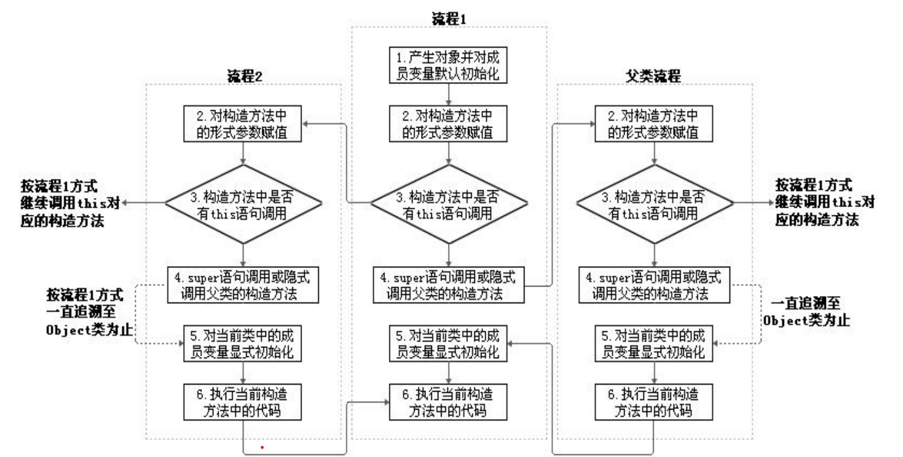
1. 从结果上来看：（继承性）
   1. 子类继承父类以后，就获取了父类中声明的属性或方法。
   2. 创建子类的对象，在堆空间中，就会加载所有父类中声明的属性。
2. 从过程上来看：
   1. 当我们通过子类的构造器创建子类对象时，我们一定会直接或间接的调用其父类的构造器，进而调用父类的父类的构造器，...
   2. 直到调用了java.lang.Object类中空参的构造器为止。正因为加载过所有的父类的结构，所以才可以看到内存中有父类中的结构，子类对象才可以考虑进行调用。
3. 明确：虽然创建子类对象时，调用了父类的构造器，但是自始至终就创建过一个对象，即为new的子类对象。

## 5-6 面向对象特征之三：多态性

- 多态性，是面向对象中最重要的概念（一个事物的多种形态），在Java中的体现：
  - 对象的多态性：父类的引用指向子类的对象（子类的对象赋给父类的引用）
  - 可以直接应用在抽象类和接口上
- Java引用变量有两个类型：编译时类型和运行时类型。编译时类型由声明该变量时使用的类型决定，运行时类型由实际赋给该变量的对象决定。简称：编译时，看左边；运行时，看右边。
  - 若编译时类型和运行时类型不一致，就出现了对象的多态性(Polymorphism)
  - 多态情况下，（编译，看左边；运行，看右边。）
    - “看左边”：看的是父类的引用（父类中不具备子类特有的方法）
    - “看右边”：看的是子类的对象（实际运行的是子类重写父类的方法）

对象的多态 —— 在Java中,子类的对象可以替代父类的对象使用
  - 一个变量只能有一种确定的数据类型
  - 一个引用类型变量可能指向(引用)多种不同类型的对象

向上转型(upcasting)：子类可看做是特殊的父类，所以父类类型的引用可以指向子类的对象。

一个引用类型变量如果声明为父类的类型，但实际引用的是子类对象，那么该变量就不能再访问子类中添加的属性和方法
  - 属性是在编译时确定的，编译时父类类型，没有子类定义的成员变量，因而编译错误。

### 多态性应用举例

- 前提：  ① 类的继承关系  ② 方法的重写
- 方法声明的形参类型为**父类**类型，可以使用**子类的对象**作为实参调用该方法
- 虚拟方法调用：当调用子父类同名同参数的方法时，实际执行的是子类重写父类的方法

### 虚拟方法调用(Virtual Method Invocation)

子类中定义了与父类同名同参数的方法（重写），在多态情况下，将此时父类的方法称为虚拟方法，父类根据赋给它的不同子类对象，动态调用属于子类的该方法。这样的方法调用在编译期是无法确定的。

编译时类型和运行时类型  
动态绑定：编译时的父类类型，而方法的调用是在运行时确定的，所以调用的是子类的对应重写方法。

### 从编译和运行的角度看：

重载，是指允许存在多个同名方法，而这些方法的参数不同。编译器根据方法不同的参数表，对同名方法的名称做修饰。对于编译器而言，这些同名方法就成了不同的方法。**它们的调用地址在编译期就绑定了**。Java的重载是可以包括父类和子类的，即子类可以重载父类的同名不同参数的方法。

所以：对于重载而言，在方法调用之前，编译器就已经确定了所要调用的方法，这称为 **“早绑定”或“静态绑定”** ；

而对于多态，只有等到方法调用的那一刻，解释运行器才会确定所要调用的具体方法，这称为 **“晚绑定”或“动态绑定”** 。

匹配方法的签名和绑定方法的实现是两个不同的问题。引用变量的声明类型决定了编译时匹配哪个方法。在编译时，编译器会根据参数类型、参数个数和参数顺序找到匹配的方法。一个方法可能在沿着继承链的多个类中实现。Java 虚拟机在运行时动态绑定方法的实现，这是由变量的实际类型决定的。引用一句Bruce Eckel的话：“不要犯傻，如果它不是晚绑定，它就不是多态。”

### 多态小结

- 多态作用：
  - 提高了代码的通用性，常称作接口重用
- 前提：
  - 需要存在继承或者实现关系
  - 有方法的重写
- 成员方法：
  - 编译时：要查看引用变量所声明的类中是否有所调用的方法。
  - 运行时：调用实际new的对象所属的类中的重写方法。
- 成员变量：
  - 不具备多态性，只看引用变量所声明的类。

### instanceof 操作符

有了对象的多态性以后，内存中实际上是加载了子类特有的属性和方法的，但是由于变量声明为父类类型，导致编译时，只能调用父类中声明的属性和方法。子类特有的属性和方法不能调用。  
向下转型（使用强制类型转换符）之后才能调用子类特有的属性和方法。但是使用强转时，可能出现ClassCastException的异常。

`x instanceof A`：检验x是否为类A的对象（实例），返回值为boolean型。如果是，返回true；如果不是，返回false。
- 要求x所属的类与类A必须是子类和父类的关系，否则编译错误。（因为编译阶段即可断定两者不是子父类关系）
- 如果x属于类A的子类B，x instanceof A 值也为true。
  - a instanceof A返回true，则 a instanceof B也返回true。其中，类B是类A的父类。
- 使用情境：为了避免在向下转型时出现ClassCastException的异常，我们在向下转型之前，先进行instanceof的判断，一旦返回true，就进行向下转型。如果返回false，不进行向下转型。

```java
//问题一：编译时通过，运行时不通过
Person p3 = new Woman();		Man m3 = (Man)p3;
Person p4 = new Person();		Man m4 = (Man)p4;
Object o = new Date();		String str1 = (String)o;
//问题二：编译通过，运行时也通过
Object obj = new Woman();		Person p = (Person)obj;
//问题三：编译不通过
Man m5 = new Woman();
String str = new Date();
```

### 对象类型转换 (Casting)

- 基本数据类型的Casting：
  - 自动类型转换：小的数据类型可以自动转换成大的数据类型  如`long g=20; double d=12.0f`
  - 强制类型转换：可以把大的数据类型强制转换(casting)成小的数据类型  如 `float f=(float)12.0; int a=(int)1200L`
- 对Java对象的强制类型转换称为**造型**
  - 从子类到父类的类型转换可以自动进行
  - 从父类到子类的类型转换必须通过造型(强制类型转换)实现
  - 无继承关系的引用类型间的转换是非法的
  - 在造型前可以使用instanceof操作符测试一个对象的类型

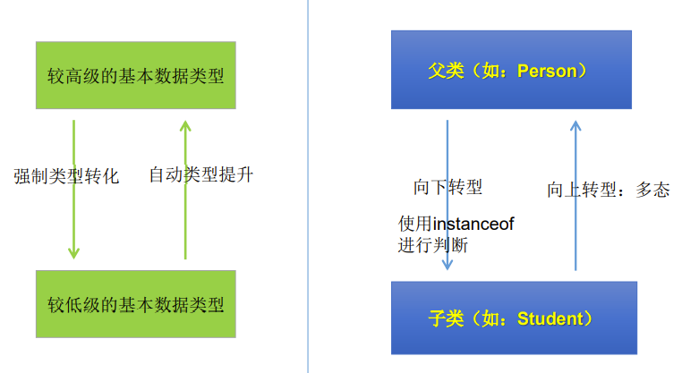

子类继承父类
- 若子类重写了父类方法，就意味着子类里定义的方法彻底**覆盖**了父类里的同名方法，系统将不可能把父类里的方法转移到子类中：编译看左边，运行看右边
- 对于实例变量则不存在这样的现象，即使子类里定义了与父类完全相同的实例变量，这个实例变量依然不可能覆盖父类中定义的实例变量：编译运行都看左边

```java
//笔试题(多态性)
public class InterviewTest {
	public static void main(String[] args) {
		Base base = new Sub();		base.add(1, 2, 3); // sub_1
		Sub s = (Sub)base;		s.add(1,2,3); // sub_2
	}
}
class Base {
	public void add(int a, int... arr) {System.out.println("base");}
}
class Sub extends Base {
	public void add(int a, int[] arr) {System.out.println("sub_1");}
	public void add(int a, int b, int c) {System.out.println("sub_2");}
}
```

Tips：
1. 对象成员访问操作符(.)优先于类型转换操作符。使用圆括号保证在点操作符之前进行转换。
2. 对基本类型值进行转换不同于对对象引用进行转换。转换一个基本类型值返回一个新的值。
3. 而转换一个对象引用不会创建一个新的对象。

## 5-7 Object类的使用

- Object类是所有Java类的根父类
  - 数组也作为Object类的子类出现，可以调用Object类中声明的方法。一个公共的属性length
- 如果在类的声明中未使用extends关键字指明其父类，则默认父类为`java.lang.Object`类

Object类中的功能(属性、方法)就具有通用性。
- 属性：无
- 方法：`equals() / toString() / getClass()[反射] /hashCode()[集合] / clone() / finalize() / wait() 、 notify()、notifyAll()[多线程]`
- Object类只声明了一个空参的构造器

```java
public class Person {...}
```

等价于：

```java
public class Person extends Object {...}
```

- 例：method(Object obj){...} //可以接收任何类作为其参数

### Object类中的主要结构

| NO. | 方法名称                          | 类型 | 描述           |
| --- | --------------------------------- | ---- | -------------- |
| 1   | public Object()                   | 构造 | 构造器         |
| 2   | public boolean equals(Object obj) | 普通 | 对象比较       |
| 3   | public int hashCode()             | 普通 | 取得Hash码     |
| 4   | public String toString()          | 普通 | 对象打印时调用 |

### ==操作符与equals方法

- = =：
  - 基本类型比较值：只要两个变量的值相等，即为true。
  - 引用类型比较引用(是否指向同一个对象)：只有指向同一个对象时，==才返回true。
    - 如果比较的是基本数据类型变量：比较两个变量保存的数据是否相等。（不一定类型要相同）
    - 如果比较的是引用数据类型变量：比较两个对象的地址值是否相同.即两个引用是否指向同一个对象实体
  - 用“==”进行比较时，符号两边的数据类型必须兼容(可自动转换的基本数据类型除外)，否则编译出错（== 符号使用时，必须保证符号左右两边的变量类型一致。）

- equals()：所有类都继承了Object，也就获得了equals()方法。还可以重写。
  - 是一个方法，而非运算符。只能比较引用类型；
  - Object类中定义的equals()和==的作用是相同的，比较两个对象的地址值是否相同。即判断两个引用是否指向同一个对象实体
  - 函数定义：`public boolean equals(Object obj) {return (this == obj);}`
  - 格式：obj1.equals(obj2)

  - 特例：当用equals()方法进行比较时，对类File、String、Date及包装类（Wrapper Class）来说，是比较类型及内容而不考虑引用的是否是同一个对象；
    - 原因：在这些类中重写了Object类的equals()方法。
  - 当自定义使用equals()时，可以重写。用于比较两个对象的“内容”是否都相等

重写equals()方法的原则

- 自反性：x.equals(x)必须返回是"true"。
- 对称性：如果x.equals(y)返回是"true"，那么y.equals(x)也应该返回是"true"。
- 传递性：如果x.equals(y)返回是"true"，而且y.equals(z)返回是"true"，那么z.equals(x)也应该返回是"true"。
- 一致性：如果x.equals(y)返回是"true"，只要x和y内容一直不变，不管你重复x.equals(y)多少次，返回都是"true"。
- 任何情况下，x.equals(null)，永远返回是"false"；x.equals(和x不同类型的对象)永远返回是"false"。

```java
// 在jdk17中String类重写的equals方法如下
public boolean equals(Object anObject) {
  if (this == anObject) {
    return true;
  }
  return (anObject instanceof String aString)
      && (!COMPACT_STRINGS || this.coder == aString.coder)
      && StringLatin1.equals(value, aString.value);
}
// StringLatin1中的equals
@IntrinsicCandidate
public static boolean equals(byte[] value, byte[] other) {
  if (value.length == other.length) {
    for (int i = 0; i < value.length; i++) {
      if (value[i] != other[i]) {
        return false;
      }
    }
    return true;
  }
  return false;
}
```

### 面试题：==和equals的区别

1. == 既可以比较基本类型也可以比较引用类型。对于基本类型就是比较值，对于引用类型就是比较内存地址
2. equals的话，它是属于java.lang.Object类里面的方法，如果该方法没有被重写过默认也是==;我们可以看到String等类的equals方法是被重写过的，而且String类在日常开发中用的比较多，久而久之，形成了equals是比较值的错误观点。
3. 具体要看自定义类里有没有重写Object的equals方法来判断。
4. 通常情况下，重写equals方法，会比较类中的相应属性是否都相等。

### toString() 方法

- toString()方法在Object类中定义，其返回值是String类型，返回类名和它的引用地址。
  - 函数定义：`public String toString() {return getClass().getName() + "@" + Integer.toHexString(hashCode());}`
- 在进行String与其它类型数据的连接操作时，自动调用toString()方法
- 当我们输出一个对象的引用时，实际上就是调用当前对象的toString()
  ```java
  s = null;
  System.out.println(s);//null 此处是valueOf的保护机制return (obj == null) ? "null" : obj.toString();
  System.out.println(s.toString());//出现NullPointerException
  ```
- 可以根据需要在用户自定义类型中重写toString()方法
  - 如String 类重写了toString()方法，返回字符串的值。
  - 像Date、File等都重写了Object类中的toString()方法。使得在调用对象的toString()时，返回"实体内容"信息
  - 自定义类也可以重写toString()方法，当调用此方法时，返回对象的"实体内容"
- 基本类型数据转换为String类型时，调用了对应包装类的toString()方法

### Java(Eclipse)中的JUnit单元测试

步骤：
1. 选中当前工程 - 右键选择：build path - add libraries - JUnit 4 - 下一步
2. 创建Java类，进行单元测试。此时的Java类要求：① 此类是public的  ②此类提供公共的无参的构造器
3. 此类中声明单元测试方法。此时的单元测试方法：方法的权限是public,没有返回值，没有形参
4. 此单元测试方法上需要声明注解：@Test,并在单元测试类中导入：import org.junit.Test;
5. (真正开发的时候都是直接声明注解：@Test，然后让IDE自动完成上面的步骤)
6. 声明好单元测试方法以后，就可以在方法体内测试相关的代码。
7. 写完代码以后，左键双击单元测试方法名，右键：run as - JUnit Test

说明：
1. 如果执行结果没有任何异常：绿条
2. 如果执行结果出现异常：红条

## 5-8 包装类(Wrapper)的使用

- 针对八种基本数据类型定义相应的引用类型 —— 包装类（封装类）
- 包装类使得基本数据类型的变量具有类的特征，有了类的特点，就可以调用类中的方法，Java才是真正的面向对象
- 注意：基本数据类型的包装类的默认值并不是其所对应的基本数据类型的默认值，而是引用类型的默认值null
- 下表中前6种类型（数值型）的基本数据类型的包装类拥有共同的父类Number

| 基本数据类型 | 包装类    |
| ------------ | --------- |
| byte         | Byte      |
| short        | Short     |
| int          | Integer   |
| long         | Long      |
| float        | Float     |
| double       | Double    |
| boolean      | Boolean   |
| char         | Character |

- 基本数据类型包装成包装类的实例 —— 装箱
  - 通过包装类的构造器实现：

  ```java
  int i = 500; Integer t = new Integer(i);
  ```

  - 还可以通过字符串参数构造包装类对象：

  ```java
  Float f = new Float("4.56");
  Long l = new Long("asdf"); //NumberFormatException
  ```

- 获得包装类对象中包装的基本类型变量 —— 拆箱
  - 调用包装类的.xxxValue()方法：

  ```java
  boolean b = bObj.booleanValue();
  ```

- JDK1.5之后，支持自动装箱，自动拆箱。但类型必须匹配。

- 字符串转换成基本数据类型
  - 通过包装类的构造器实现：

  ```java
  int i = new Integer("12");
  ```

  - 通过包装类的parseXxx(String s)静态方法：

  ```java
  Float f = Float.parseFloat("12.1");
  ```

- 基本数据类型转换成字符串
  - 调用字符串重载的valueOf()方法：

  ```java
  String fstr = String.valueOf(2.34f);
  ```
  - 更直接的方式：

  ```java
  String intStr = 5 + ""
  ```

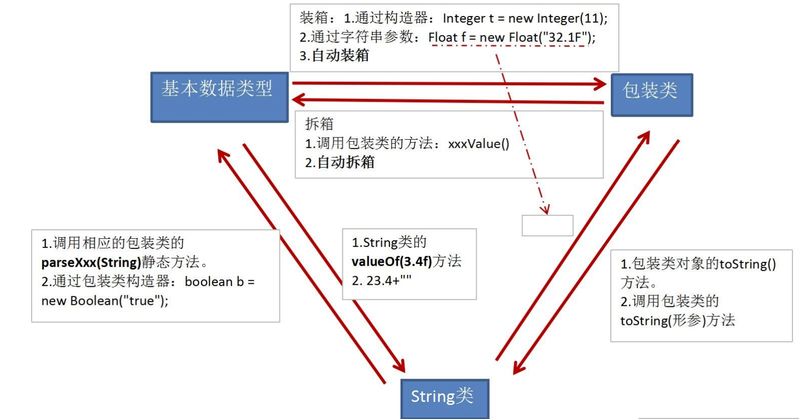

包装类用法举例
- 装箱：包装类使得一个基本数据类型的数据变成了类。有了类的特点，可以调用类中的方法。
- 拆箱：将数字包装类中内容变为基本数据类型。包装类在实际开发中用的最多的在于字符串变为基本数据类型。(parseXxx)

关于包装类使用的面试题

```java
Object o1 = true ? new Integer(1) : new Double(2.0);
System.out.println(o1); // 1.0

Object o2;
if (true)	o2 = new Integer(1);
else	o2 = new Double(2.0);
System.out.println(o2); // 1

Integer i = new Integer(1);Integer j = new Integer(1);
System.out.println(i == j);// false
// Integer内部定义了IntegerCache结构，IntegerCache中定义了static final Integer[] cache;保存了从-128~127范围的整数。如果我们使用自动装箱的方式，给Integer赋值的范围在-128~127范围内时，可以直接使用数组中的元素，不用再去new了。目的：提高效率
Integer m = 1;Integer n = 1;
System.out.println(m == n);// true
Integer x = 128;Integer y = 128;
System.out.println(x == y);// false
```

## 补充

### 垃圾回收机制关键点

- 垃圾回收机制只回收JVM堆内存里的对象空间。
- 对其他物理连接，比如数据库连接、输入流输出流、Socket连接无能为力
- 现在的JVM有多种垃圾回收实现算法，表现各异。
- 垃圾回收发生具有不可预知性，程序无法精确控制垃圾回收机制执行。
- 可以将对象的引用变量设置为null，暗示垃圾回收机制可以回收该对象。
- 程序员可以通过System.gc()或者Runtime.getRuntime().gc()来通知系统进行垃圾回收，会有一些效果，但是系统是否进行垃圾回收依然不确定。
- 垃圾回收机制回收任何对象之前，总会先调用它的finalize方法（如果覆盖该方法，让一个新的引用变量重新引用该对象，则会重新激活对象）。
- 永远不要主动调用某个对象的finalize方法，应该交给垃圾回收机制调用。

### native 关键的理解

使用 native 关键字说明这个方法是原生函数，也就是这个方法是用 C/C++等非Java 语言实现的，并且被编译成了 DLL，由 java 去调用。

1. 为什么要用 native 方法  
java 使用起来非常方便，然而有些层次的任务用 java 实现起来不容易，或者我们对程序的效率很在意时，问题就来了。例如：有时 java 应用需要与 java 外面的环境交互。这是本地方法存在的主要原因，你可以想想 java 需要与一些底层系统如操作系统或某些硬件交换信息时的情况。本地方法正是这样一种交流机制：它为我们提供了一个非常简洁的接口，而且我们无需去了解 java 应用之外的繁琐的细节。

2. native 声明的方法，对于调用者，可以当做和其他 Java 方法一样使用一个 native method 方法可以返回任何 java 类型，包括非基本类型，而且同样可以进行异常控制。native method 的存在并不会对其他类调用这些本地方法产生任何影响，实际上调用这些方法的其他类甚至不知道它所调用的是一个本地方法。JVM 将控制调用本地方法的所有细节。如果一个含有本地方法的类被继承，子类会继承这个本地方法并且可以用 java语言重写这个方法（如果需要的话）

### 类与类之间的关系说明

1. 依赖关系（Dependency）  
对象之间最弱的一种关联方式，是临时性的关联。代码中一般指由局部变量、函数参数、返回值建立的对于其他对象的调用关系。

2. 关联关系（Association）  
   1. 对象之间一种引用关系，比如客户类与订单类之间的关系。这种关系通常使用类的属性表达。  
   2. 关联可以有方向，即导航。一般不作说明的时候，导航是双向的，不需要在线上标出箭头。
   3. 关联表示类之间的“持久”关系，这种关系一般表示一种重要的业务之间的关系，需要保存的，或者说需要“持久化”的，或者说需要保存到数据库中的。另外，依赖表示类之间的是一种“临时、短暂”关系，这种关系是不需要保存的.

3. 聚合（Aggregation）
   1. 聚合（关联关系的一种）：表示 has-a 的关系。与关联关系一样，聚合关系也是通过实例变量来实现这样关系的。关联关系和聚合关系来语法上是没办法区分的，从语义上才能更好的区分两者的区别。
   2. 如汽车类与引挚类，轮胎类之间的关系就是整体与个体的关系。与关联关系一样，聚合关系也是通过实例变量来实现的。空心菱形
   3. 关联和聚集（聚合）的区别：
      1. 关联关系所涉及的两个对象是处在同一个层次上的。比如人和自行车就是一种关联关系，而不是聚合关系，因为人不是由自行车组成的。聚合关系涉及的两个对象处于不平等的层次上，一个代表整体，一个代表部分。比如电脑和它的显示器、键盘、主板以及内存就是聚集关系，因为主板是电脑的组成部分。

4. 组合（Composite）
   1. 对象 A 包含对象 B，对象 B 离开对象 A 没有实际意义。是一种更强的关联关系。人包含手，手离开人的躯体就失去了它应有的作用。
   2. 组合：表示 contains-a 的关系，是一种强烈的包含关系。组合类负责被组合类的生命周期。也使用属性表达组合关系，是关联关系的一种，是比聚合关系强的关系。

```java
// 有点不可思议的操作：（以下的代码都是没有问题的）
Object obj = 123;
int i = (int)obj;
```


# 第6章 面向对象编程(下)

## 6-1 关键字：static

当我们编写一个类时，其实就是在描述其对象的属性和行为，而并没有产生实质上的对象，只有通过new关键字才会产生出对象，这时系统才会分配内存空间给对象，其方法才可以供外部调用。我们有时候希望无论是否产生了对象或无论产生了多少对象的情况下，**某些特定的数据在内存空间里只有一份**，例如所有的中国人都有个国家名称，每一个中国人都共享这个国家名称，不必在每一个中国人的实例对象中都单独分配一个用于代表国家名称的变量。

实例变量(instance variable)，它属于类的每一个对象，不能被同一个类的不同对象所共享。如果想让一个类的所有实例共享数据，就用类变量！

### 类属性、类方法的设计思想

- 类属性作为该类各个对象之间共享的变量。在设计类时,分析哪些属性不因对象的不同而改变，将这些属性设置为类属性。相应的方法设置为类方法。
- 如果方法与调用者无关，则这样的方法通常被声明为类方法，由于不需要创建对象就可以调用类方法，从而简化了方法的调用。

- static使用范围：
  - 在Java类中，可用static修饰属性、方法、代码块、内部类
- 被修饰后的成员具备以下特点：
  - 随着类的加载而加载
  - 优先于对象存在
  - 修饰的成员，被所有对象所共享
  - 访问权限允许时，可不创建对象，直接被类调用

### 类变量(class Variable)&&类方法(class method) 

- 类变量（类属性）由该类的所有实例共享
- 没有对象的实例时，可以用类名.方法名()的形式访问由static修饰的类方法。
- 在static方法内部只能访问类的static修饰的属性或方法，不能访问类的非static的结构。
- 因为不需要实例就可以访问static方法，因此static方法内部不能有this。(也不能有super)
- static修饰的方法不能被重写

### 使用static修饰属性：静态变量（或类变量）

1. 属性，按是否使用static修饰，又分为：静态属性  vs 非静态属性(实例变量)
   1. 实例变量：我们创建了类的多个对象，每个对象都独立的拥有一套类中的非静态属性。当修改其中一个对象中的非静态属性时，不会导致其他对象中同样的属性值的修改。
   2. 静态变量：我们创建了类的多个对象，多个对象共享同一个静态变量。当通过某一个对象修改静态变量时，会导致其他对象调用此静态变量时，是修改过了的。
2. static修饰属性的其他说明：
   1. 静态变量随着类的加载而加载。可以通过"类.静态变量"的方式进行调用
   2. 静态变量的加载要早于对象的创建。
   3. 由于类只会加载一次，则静态变量在内存中也只会存在一份：存在方法区的静态域中。
3. 静态属性举例：System.out; Math.PI;

### 使用static修饰方法：静态方法

1. 随着类的加载而加载，可以通过"类.静态方法"的方式进行调用
2. 静态方法中，只能调用静态的方法或属性；非静态方法中，既可以调用非静态的方法或属性，也可以调用静态的方法或属性

static注意点：
1. 在静态的方法内，不能使用this关键字、super关键字
2. 关于静态属性和静态方法的使用，大家都从生命周期的角度去理解。
 
如果一个变量或方法不依赖于类的某个具体实例，就应该将他定义为静态变量或静态方法。

开发中，如何确定一个属性是否要声明为static的？
- 属性是可以被多个对象所共享的，不会随着对象的不同而不同的。
- 类中的常量也常常声明为static

开发中，如何确定一个方法是否要声明为static的？
- 操作静态属性的方法，通常设置为static的
- 工具类中的方法，习惯上声明为static的。 比如：Math、Arrays、Collections

### 单例 (Singleton)设计模式

- 设计模式是在大量的实践中总结和理论化之后优选的代码结构、编程风格、以及解决问题的思考方式。设计模免去我们自己再思考和摸索。就像是经典的棋谱，不同的棋局，我们用不同的棋谱。“套路”
- 
- 所谓类的单例设计模式，就是采取一定的方法保证在整个的软件系统中，对某个类**只能存在一个对象实例**，并且该类只提供一个取得其对象实例的方法。如果我们要让类在一个虚拟机中只能产生一个对象，我们首先必须将**类的构造器的访问权限设置为private**，这样，就不能用new操作符在类的外部产生类的对象了，但在类内部仍可以产生该类的对象。因为在类的外部开始还无法得到类的对象，只能调用该类的某个静态方法以返回类内部创建的对象，静态方法只能访问类中的静态成员变量，所以，指向类内部产生的**该类对象的变量也必须定义成静态的**。
- 通常情况下在创建实例时要执行一些操作。一般使用静态代码块或提供公共的静态的方法，返回当前类的对象。如果明确不需要进行初始化操作可以使用这样的饿汉式操作`public static final Singleton single = new Singleton();`，final运算符防止恶意修改。

1. 单例 (Singleton)设计模式 —— 饿汉式

```java
class Singleton {
  private Singleton() {  } // 1.私有化构造器
  // 2.内部提供一个当前类的实例
  // 4.此实例也必须静态化
  private static Singleton single = new Singleton();
  // 3.提供公共的静态的方法，返回当前类的对象
  public static Singleton getInstance() {
    return single;
  }
}
```

2. 单例(Singleton)设计模式 —— 懒汉式

(懒汉式暂时还存在线程安全问题，讲到多线程时，可修复)
```java
class Singleton {
  private Singleton() {  }
  private static Singleton single;
  public static Singleton getInstance() {
    if(single == null) {
      single = new Singleton();
    }
    return single;
  }
}
```

饿汉式：坏处：对象加载时间过长。好处：饿汉式是线程安全的  
懒汉式：好处：延迟对象的创建。目前的写法坏处：线程不安全。--->到多线程内容时，再修改

单例模式的优点：  
由于单例模式只生成一个实例，减少了系统性能开销，当一个对象的产生需要比较多的资源时，如读取配置、产生其他依赖对象时，则可以通过在应用启动时直接产生一个单例对象，然后永久驻留内存的方式来解决。 java.lang.Runtime就是使用的这种设计模式。

### 单例(Singleton)设计模式-应用场景

- 网站的**计数器**，一般也是单例模式实现，否则难以同步。
- 应用程序的**日志**应用，一般都使用单例模式实现，这一般是由于共享的日志文件一直处于打开状态，因为只能有一个实例去操作，否则内容不好追加。
- **数据库连接池**的设计一般也是采用单例模式，因为数据库连接是一种数据库资源。
- 项目中，读取**配置**文件的类，一般也只有一个对象。没有必要每次使用配置文件数据，都生成一个对象去读取。
- **Application** 也是单例的典型应用
- Windows的Task Manager (任务管理器)就是很典型的单例模式
- Windows的Recycle Bin (回收站)也是典型的单例应用。在整个系统运行过程中，回收站一直维护着仅有的一个实例。

## 6-2 理解main方法的语法

- 由于Java虚拟机需要调用类的main()方法，所以该方法的访问权限必须是public，又因为Java虚拟机在执行main()方法时不必创建对象，所以该方法必须是static的，该方法接收一个String类型的数组参数，该数组中保存执行Java命令时传递给所运行的类的参数。
- 又因为main() 方法是静态的，我们不能直接访问该类中的非静态成员，必须创建该类的一个实例对象后，才能通过这个对象去访问类中的非静态成员，这种情况，我们在之前的例子中多次碰到。
- main()方法作为程序的入口
- main()方法也是一个普通的静态方法
- main()方法可以作为我们与控制台交互的方式。（之前：使用Scanner）String[] args

小结：一叶知秋 `public static void main( string[ ] args ){//方法体}`
- 权限修饰符：private 缺省protected pubilc --> 封装性
- 修饰符：static \ final \ abstract \ native 可以用来修饰方法
- 返回值类型：无返回值/有返回值 --> return
- 方法名：需要满足标识符命名的规则、规范；"见名知意"
- 形参列表：重载vs重写；参数的值传递机制；体现对象的多态性方法体:来体现方法的功能

## 6-3 类的成员之四：代码块

- 代码块(或初始化块)的作用：
  - 对Java类或对象进行初始化
- 代码块(或初始化块)的分类：
  - 一个类中代码块若有修饰符，则只能被static修饰，称为静态代码块(static block)，没有使用static修饰的，为非静态代码块。
- static代码块通常用于初始化static的属性

```java
class Person {
  public static int total;
  static {
    total = 100;//为total赋初值
  }
  ...... //其它属性或方法声明
}
```

- **静态代码块**：用static 修饰的代码块
  1. 可以有输出语句，可以对类的属性、类的声明进行初始化操作。
  2. 作用：初始化类的信息
  3. 不可以对非静态的属性初始化。即：不可以调用非静态的属性和方法。
  4. 若有多个静态的代码块，那么按照从上到下（声明的先后）的顺序依次执行。实际开发中通常不会声明多个代码块。
  5. 静态代码块的执行要先于非静态代码块。
  6. 静态代码块随着类的加载而加载，且只执行一次。（只要当前类未重新加载，静态代码块不会再次执行）
- **非静态代码块**：没有static修饰的代码块
  1. 可以有输出语句，可以对类的属性、类的声明进行初始化操作。
  2. 作用：可以在创建对象时，对对象的属性等进行初始化
  3. 除了调用非静态的结构外，还可以调用静态的变量或方法。
  4. 若有多个非静态的代码块，那么按照从上到下（声明的先后）的顺序依次执行。
  5. 非静态代码块随着对象的创建而执行，每次创建对象的时候，都会执行一次。且先于构造器执行。

程序中成员变量赋值的执行顺序
1. 声明成员变量的默认初始化
2. 显式初始化、多个初始化块依次被执行（同级别下按先后顺序执行）
   1. 显式初始化和初始化块本质上是一样的。
3. 构造器再对成员进行初始化操作
4. 有了对象以后，通过"对象.属性"或"对象.方法"的方式，可多次进行赋值

Son.java
```java
class Father {
	static {System.out.println(1);}
	{System.out.println(2);}
	public Father() {System.out.println(3);}
}
public class Son extends Father {
	static {System.out.println(4);}
	{System.out.println(5);}
	public Son() {System.out.println(6);}
	public static void main(String[] args) { // 由父及子 静态先行
		System.out.println(7);//1 4 7
		System.out.println("*");//*
		new Son();//2 3 5 6
		System.out.println("*");//*
		new Father();//2 3
	}
}

```

LeafTest.java
```java
class Root{
	static{System.out.println("Root的静态初始化块");}
	{System.out.println("Root的普通初始化块");}
	public Root(){System.out.println("Root的无参数的构造器");}
}
class Mid extends Root{
	static{System.out.println("Mid的静态初始化块");}
	{System.out.println("Mid的普通初始化块");}
	public Mid(){System.out.println("Mid的无参数的构造器");}
	public Mid(String msg){//通过this调用同一类中重载的构造器
		this();
		System.out.println("Mid的带参数构造器，其参数值："+ msg);
	}
}
class Leaf extends Mid{
	static{System.out.println("Leaf的静态初始化块");}
	{System.out.println("Leaf的普通初始化块");}	
	public Leaf(){//通过super调用父类中有一个字符串参数的构造器
		super("尚硅谷");
		System.out.println("Leaf的构造器");
	}
}
public class LeafTest{
	public static void main(String[] args){
		new Leaf(); 
	}
}
/* Root的静态初始化块
 * Mid的静态初始化块 
 * Leaf的静态初始化块
 * Root的普通初始化块
 * Root的无参数的构造器
 * Mid的普通初始化块
 * Mid的无参数的构造器
 * Mid的带参数构造器，其参数值：尚硅谷
 * Leaf的普通初始化块
 * Leaf的构造器*/
```

## 6-4 关键字：final

在Java中声明类、变量和方法时，可使用关键字final来修饰,表示“最终的”。
- final标记的类不能被继承。提高安全性，提高程序的可读性。
  - String类、System类、StringBuffer类
- final标记的方法不能被子类重写。
  - 比如：Object类中的getClass()。
- final标记的变量(成员变量或局部变量)即称为常量。名称大写，且只能被赋值一次。
  - final修饰属性：可以考虑赋值的位置有：显式初始化、代码块中初始化、构造器中初始化
  - final标记的成员变量必须在声明时或在每个构造器中或代码块中显式赋值，然后才能使用。
  - final修饰局部变量：尤其是使用final修饰形参时，表明此形参是一个常量。当我们调用此方法时，给常量形参赋一个实参。一旦赋值以后，就只能在方法体内使用此形参，但不能进行重新赋值。
  - static final 用来修饰属性：全局常量
    - public static final double E = 2.7182818284590452354;
    - public static final double PI = 3.14159265358979323846;

```java
// 某面试题，这里的i++是没有问题的，因为final修饰的是o，而不是内部的属性
public void addOne(final Other o){o.i++;}
class Other {public int o;}
```

小结：
1. final修饰类：不能被继承
2. final修饰方法：不能被重写
3. final修饰变量：值不能被修改，常量名要大写（规范）。static final：全局常量

## 6-5 抽象类与抽象方法

随着继承层次中一个个新子类的定义，类变得越来越具体，而父类则更一般，更通用。类的设计应该保证父类和子类能够共享特征。有时将一个父类设计得非常抽象，以至于它没有具体的实例，这样的类叫做抽象类。用来模型化那些父类无法确定全部实现，而是由其子类提供具体实现的对象的类。(Java允许类设计者指定：超类声明一个方法但不提供实现，该方法的实现由子类提供。这样的方法称为抽象方法。有一个或更多抽象方法的类称为抽象类。通常将抽象类的相关构造器、字段、方法声明为protected，因为它只被子类使用)

- 用abstract关键字来修饰一个类，这个类叫做抽象类。
- 用abstract来修饰一个方法，该方法叫做抽象方法。
  - 抽象方法：只有方法的声明，没有方法的实现。以分号结束：比如：`public abstract void talk();`
- 含有抽象方法的类必须被声明为抽象类。
- 抽象类不能被实例化。抽象类是用来被继承的，抽象类的子类必须重写父类的抽象方法，并提供方法体。若没有重写全部的抽象方法，仍为抽象类。
- 不能用abstract修饰变量、代码块、构造器；
- 不能用abstract修饰私有方法、静态方法、final的方法、final的类。

---

1. abstract修饰类：抽象类
   1. 此类不能实例化
   2. 抽象类中一定有构造器，便于子类实例化时调用（涉及：子类对象实例化的全过程）
   3. 开发中，都会提供抽象类的子类，让子类对象实例化，完成相关的操作
2. abstract修饰方法：抽象方法
	 1. 抽象方法只有方法的声明，没有方法体
	 2. 包含抽象方法的类，一定是一个抽象类。反之，抽象类中可以没有抽象方法的。
	 3. 若子类重写了父类中的所有的抽象方法后，此子类方可实例化；若子类没有重写父类中的所有的抽象方法，则此子类也是一个抽象类，需要使用abstract修饰
3. abstract使用上的注意点：
   1. abstract不能用来修饰：属性、构造器等结构
   2. abstract不能用来修饰私有方法、静态方法、final的方法、final的类

```java
method(new Person(){ // 匿名类的匿名对象
  @Override
  public void eat() {  }
});
```

关于抽象类的几点说明：
1. 抽象方法不能包含在非抽象类中。如果抽象父类的子类不能实现所有的抽象方法，那么子类也必须定义为抽象的。即在继承自抽象类的非抽象子类中，必须实现所有的抽象方法。
2. 抽象方法是非静态的。
3. 抽象类不能使用 new操作符来初始化。但是，仍然可以定义它的构造方法，这个构造方法在它的子类的构造方法中调用。
4. 包含抽象方法的类必须是抽象的。然而，可以定义一个不包含抽象方法的抽象类。这个抽象类用于作为定义新子类的基类。
5. 子类可以重写父类的方法并将它定义为抽象的。在这种情况下，子类必须定义为抽象的。
6. 即使子类的父类是具体的，这个子类也可以是抽象的。所有的抽象类都是Object类的子类。
7. 不能使用 new 操作符从一个抽象类创建一个实例，但是抽象类可以用作一种数据类型。（可以动态初始化一个抽象类的数组）

```java
public abstract class Number extends Object implements Serializable{
  //已知直接子类：AtomicInteger ， AtomicLong ， BigDecimal ， BigInteger ， Byte ， Double ， DoubleAccumulator ， DoubleAdder ， Float ， Integer ， Long ， LongAccumulator ， LongAdder ， Short
  byte byteValue(); //返回指定数字的值 byte。
  abstract double doubleValue(); //返回指定数字的值 double。
  abstract float floatValue(); //返回指定数字的值 float。
  abstract int intValue(); //以 int 返回指定数字的 int。
  abstract long longValue(); //以 long 返回指定数字的值。
  short shortValue(); //返回指定数字的值 short。
}
```

### 多态的应用：模板方法设计模式(TemplateMethod)

抽象类体现的就是一种模板模式的设计，抽象类作为多个子类的通用模板，子类在抽象类的基础上进行扩展、改造，但子类总体上会保留抽象类的行为方式。

解决的问题：
- 当功能内部一部分实现是确定的，一部分实现是不确定的。这时可以把不确定的部分暴露出去，让子类去实现。
- 换句话说，在软件开发中实现一个算法时，整体步骤很固定、通用，这些步骤已经在父类中写好了。但是某些部分易变，易变部分可以抽象出来，供不同子类实现。这就是一种模板模式。

模板方法设计模式是编程中经常用得到的模式。各个框架、类库中都有他的影子，比如常见的有：
- 数据库访问的封装
- Junit单元测试
- JavaWeb的Servlet中关于doGet / doPost方法调用
- Hibernate中模板程序
- Spring中JDBCTemlate、HibernateTemplate等

## 6-6 接口(interface)

- 一方面，有时必须从几个类中派生出一个子类，继承它们所有的属性和方法。但是，Java不支持多重继承。有了接口，就可以得到多重继承的效果。
- 另一方面，有时必须从几个类中抽取出一些共同的行为特征，而它们之间又没有is-a的关系，仅仅是具有相同的行为特征而已。例如：鼠标、键盘、打印机、扫描仪、摄像头、充电器、MP3机、手机、数码相机、移动硬盘等都支持USB连接。
- 接口就是规范，定义的是一组规则，体现了现实世界中“如果你是/要...则必须能...”的思想。继承是一个"是不是"的关系，而接口实现则是 "能不能"的关系。
- 接口的本质是契约，标准，规范，就像我们的法律一样。制定好后大家都要遵守。

- 接口(interface)是抽象方法和常量值定义的集合。
- 接口的特点：
  - 用interface来定义。
  - 接口中的所有成员变量都**默认**是由public static final修饰的。
  - 接口中的所有抽象方法都**默认**是由public abstract修饰的。
  - 接口中**没有构造器**。
  - 接口采用多继承(实现)机制。
- 接口定义举例

```java
public interface Runner {
  int ID = 1;//public static final int ID = 1;
  void start();//public abstract void start();
  public void run();//public abstract void run();
  void stop();//public abstract void stop();
}
```

- 定义Java类的语法格式：先写extends，后写implements

```java
class SubClass extends SuperClass implements InterfaceA{ }
```

- 一个类可以实现多个接口，接口也可以继承其它接口。
- 实现接口的类中必须提供接口中所有方法的具体实现内容，方可实例化。否则，仍为抽象类。
- 接口的主要用途就是被实现类实现。（面向接口编程）
- 与继承关系类似，接口与实现类之间存在多态性
- 接口和类是并列关系，或者可以理解为一种特殊的类。从本质上讲，接口是一种特殊的抽象类，这种抽象类中只包含常量和方法的定义(JDK7.0及之前)，而没有变量和方法的实现。

---

- 一个类可以实现多个无关的接口
- 与继承关系类似，接口与实现类之间存在多态性

---

小结：
1. 接口使用interface来定义
2. Java中，接口和类是并列的两个结构
3. 如何定义接口：定义接口中的成员
   1. JDK7及以前：只能定义全局常量和抽象方法
      1. 全局常量：public static final的.但是书写时，可以省略不写
      2. 抽象方法：public abstract的
	 2. JDK8：除了定义全局常量和抽象方法之外，还可以定义静态方法、默认方法（略）
4. 接口中不能定义构造器的！意味着接口不可以实例化
5. Java开发中，接口通过让类去实现(implements)的方式来使用.
   1. 如果实现类覆盖了接口中的所有抽象方法，则此实现类就可以实例化
   2. 如果实现类没有覆盖接口中所有的抽象方法，则此实现类仍为一个抽象类
6. Java类可以实现多个接口   --->弥补了Java单继承性的局限性。格式：`class AA extends BB implements CC,DD,EE`
7. 接口与接口之间可以继承，而且可以多继承`interface A extends B, C`
8. 接口的具体使用，体现多态性
9.  接口，实际上可以看做是一种规范

```java
// Cloneable接口拓展：这是一个标记接口（既不包括常量也不包括方法，用来表示一个类希望具有的特征），用来标注一个对象可以被克隆
// 数组调用clone方法的返回类型和该数组的类型是一样的。
int[] list={1,2};int[] list1=list.clone();
// 实现Cloneable接口的类应重写Object类中的clone方法。
protected native Object clone() throws CloneNotSupportedException;
// native：表明这个方法不是用Java写的，但它是JVM针对本地平台实现的。
// CloneNotSupportedException：如果对象不是Cloneable类型的，clone方法会抛出该异常。
// Object类中的clone方法默认是进行浅复制：即基本类型复制值，引用类型复制引用。
```
1. Objecct类中的clone方法定义为protected，而不是public。**不是每个对象都可以被克隆**的，如果子类的对象是可克隆的，Java 的设计者故意强制子类重写该方法。
2. clone方法不是定义在Cloneable接口中。因为Java提供了一个本地方法来执行一个浅复制以克隆一个对象。由于接口中的方法是抽象的，该本地方法不能在接口中实现。
3. 可以在类中重写clone方法，而不调用Object类中的clone方法，此时类无需实现Cloneable接口。

### 接口的应用：代理模式(Proxy)

概述：代理模式是Java开发中使用较多的一种设计模式。代理设计就是为其他对象提供一种代理以控制对这个对象的访问。

- 应用场景：
  - 安全代理：屏蔽对真实角色的直接访问。
  - 远程代理：通过代理类处理远程方法调用（RMI）
  - 延迟加载：先加载轻量级的代理对象，真正需要再加载真实对象比如你要开发一个大文档查看软件，大文档中有大的图片，有可能一个图片有100MB，在打开文件时，不可能将所有的图片都显示出来，这样就可以使用代理模式，当需要查看图片时，用proxy来进行大图片的打开。
- 分类
  - 静态代理（静态定义代理类）
  - 动态代理（动态生成代理类）
- JDK自带的动态代理，需要反射等知识

### 接口的应用：工厂模式

工厂模式：实现了创建者与调用者的分离，即将创建对象的具体过程屏蔽隔离起来，达到提高灵活性的目的。

其实设计模式和面向对象设计原则都是为了使得开发项目更加容易扩展和维护，解决方式就是一个“分工”。社会的发展也是这样，分工越来越细。

原始社会的人：人什么都要会，自己种，自己打猎，自己织衣服，自己治病  
现在的人：可以只会一样，其他都不会，只会 Java 也能活，不会做饭，不会开车，不会....

1. 面向对象的设计原则(共六个)

   1. OCP（开闭原则，Open-Closed Principle） 
一个软件的实体应当对扩展开放，对修改关闭。当我们写完的代码，不能因为需求变化就修改。我们可以通过新增代码的方式来解决变化的需求。如果每次需求变动都去修改原有的代码，那原有的代码就存在被修改错误的风险，当然这其中存在有意和无意的修改，都会导致原有正常运行的功能失效的风险，这样很有可能会展开可怕的蝴蝶效应，使维护工作剧增。说到底，开闭原则除了表面上的可扩展性强以外，在企业中更看重的是维护成本。所以，开闭原则是设计模式的第一大原则。  
  潜台词是：控制需求变动风险，缩小维护成本。

   2. DIP（依赖倒转原则，Dependence Inversion Principle） 
要针对接口编程，不要针对实现编程。  
如果 A 中关联 B，那么尽量使得 B 实现某个接口，然后 A 与接口发生关系，不与 B 实现类发生关联关系。  
  潜台词是：面向抽象编程，解耦调用和被调用者。

   3. LOD（迪米特法则，Law Of Demeter） 
只与你直接的朋友通信，而避免和陌生人通信。  
要求尽量的封装，尽量的独立，尽量的使用低级别的访问修饰符。这是封装特性的典型体现。  
一个类如果暴露太多私用的方法和字段，会让调用者很茫然。并且会给类造成不必要的判断代码。所以，我们使用尽量低的访问修饰符，让外界不知道我们的内部。这也是面向对象的基本思路。这是迪米特原则的一个特性，无法了解类更多的私有信息。  
另外，迪米特原则要求类之间的直接联系尽量的少，两个类的访问，通过第三个中介类来实现。  
  潜台词是：不和陌生人说话，有事去中介。

2. 工厂模式的分类：
   - 简单工厂模式：用来生产同一等级结构中的任意产品。（对于增加新的产品，需要修改已有代码）
   - 工厂方法模式：用来生产同一等级结构中的固定产品。（支持增加任意产品）
   - 抽象工厂模式：用来生产不同产品族的全部产品。（对于增加新的产品，无能为力；支持增加产品族）

GOF 在《设计模式》一书中将工厂模式分为两类：工厂方法模式（Factory Method）与抽象工厂模式（Abstract Factory）。将简单工厂模式（Simple Factory）看为工厂方法模式的一种特例，两者归为一类。

核心本质：
   - 实例化对象，用工厂方法代替 new 操作。
   - 将选择实现类、创建对象统一管理和控制。从而将调用者跟我们的实现类解耦。

**无工厂模式**

```java
package com.atguigu.pattern.factory.nofactory;
interface Car{void run();}
class Audi implements Car{
  public void run() {  System.out.println("奥迪在跑");  }
}
class BYD implements Car{
  public void run() {  System.out.println("比亚迪在跑");  }
}
public class Client01 {
  public static void main(String[] args) {
    Car a = new Audi();
    Car b = new BYD();
  }
}
```

**简单工厂模式**

调用者只要知道他要什么，从哪里拿，如何创建，不需要知道。分工，多出了一个专门生产 Car 的实现类对象的工厂类。把调用者与创建者分离。

小结：
简单工厂模式也叫静态工厂模式，就是工厂类一般是使用静态方法，通过接收的参数的不同来返回不同的实例对象。  
缺点：对于增加新产品，不修改代码的话，是无法扩展的。违反了开闭原则（对扩展开放；对修改封闭）。

```java
package com.atguigu.pattern.factory.simple;
//两辆车的声明同上
//工厂类
class CarFactory {
  //方式一
  public static Car getCar(String type) {
    if ("奥迪".equals(type)) {
      return new Audi();
    } else if ("比亚迪".equals(type)) {
      return new BYD();
    } else {
      return null;
    }
  }
  //方式二
  public static Car getAudi() {
    return new Audi();
  }
  public static Car getByd() {
    return new BYD();
  }
}
public class Client02 {
  public static void main(String[] args) {
    Car a = CarFactory.getCar("奥迪");
    Car b = CarFactory.getCar("比亚迪");
  }
}
```

**工厂方法模式**

为了避免简单工厂模式的缺点，不完全满足 OCP（对扩展开放，对修改关闭）。工厂方法模式和简单工厂模式最大的不同在于，简单工厂模式只有一个（对于一个项目或者一个独立的模块而言）工厂类，而工厂方法模式有一组实现了相同接口的工厂类。这样在简单工厂模式里集中在工厂方法上的压力可以由工厂方法模式里不同的工厂子类来分担。

```java
//两辆车的声明同上
//工厂接口
interface Factory{Car getCar();}
//两个工厂类
class AudiFactory implements Factory{
  public Audi getCar(){
    return new Audi();
  }
}
class BydFactory implements Factory{
  public BYD getCar(){
    return new BYD();
  }
}
public class Client {
  public static void main(String[] args) {
    Car a = new AudiFactory().getCar();
    Car b = new BydFactory().getCar();
  }
}
```

简单工厂模式与工厂方法模式真正的避免了代码的改动了？没有。在简单工厂模式中，新产品的加入要修改工厂角色中的判断语句；而在工厂方法模式中，要么将判断逻辑留在抽象工厂角色中，要么在客户程序中将具体工厂角色写死（就像上面的例子一样）。而且产品对象创建条件的改变必然会引起工厂角色的修改。面对这种情况，Java 的反射机制与配置文件的巧妙结合突破了限制——这在Spring 中完美的体现了出来。

**抽象工厂模式**

抽象工厂模式和工厂方法模式的区别就在于需要创建对象的复杂程度上。而且抽象工厂模式是三个里面最为抽象、最具一般性的。

抽象工厂模式的用意为：给客户端提供一个接口，可以创建多个产品族中的产品对象。

而且使用抽象工厂模式还要满足一下条件：
1. 系统中有多个产品族，而系统一次只可能消费其中一族产品。
2. 同属于同一个产品族的产品以其使用。

### 接口和抽象类之间的对比

| No. | 区别点       | 抽象类                                   | 接口                                        |
| --- | ------------ | ---------------------------------------- | ------------------------------------------- |
| 1   | 定义         | 包含抽象方法的类                         | 主要是抽象方法和全局常量的集合              |
| 2   | 组成         | 构造方法、抽象方法、普通方法、常量、变量 | 常量、抽象方法、(jdk8.0:默认方法、静态方法) |
| 3   | 使用         | 子类继承抽象类(extends)                  | 子类实现接口(implements)                    |
| 4   | 关系         | 抽象类可以实现多个接口                   | 接口不能继承抽象类，但允许继承多个接口      |
| 5   | 常见设计模式 | 模板方法                                 | 简单工厂、工厂方法、代理模式                |
| 6   | 对象         | 都通过对象的多态性产生实例化对象         |
| 7   | 局限         | 抽象类有单继承的局限                     | 接口没有此局限                              |
| 8   | 实际         | 作为一个模板                             | 是作为一个标准或是表示一种能力              |
| 9   | 选择         | 如果抽象类和接口都可以使用的话，         | 优先使用接口，因为避免单继承的局限          |

在开发中，常看到一个类不是去继承一个已经实现好的类，而是要么继承抽象类，要么实现接口。

```java
// 一道关于接口的笔试题目
interface Playable {	void play();}
interface Bounceable{	void play();}
interface Rollable extends Playable, Bounceable{
	Ball ball = new Ball("PingPang");
}
class Ball implements Rollable{
	private String name;
	public String getName() {	return name;}
	public Ball(String name) {	this.name = name;}
	public void play(){ // 此处的重写认为是重写的两个接口的方法
		ball = new Ball("Football"); // 注意从Rollable接口实现来的ball是静态常量，不可修改。
		System.out.println(ball.getName());
	}
}
```

### Java 8中关于接口的改进

Java 8中，你可以为接口添加静态方法和默认方法。从技术角度来说，这是完全合法的，只是它看起来违反了接口作为一个抽象定义的理念。

- 静态方法：使用 static 关键字修饰。仅支持通过接口直接调用静态方法，并执行其方法体。我们经常在相互一起使用的类中使用静态方法。你可以在标准库中找到像Collection/Collections或者Path/Paths这样成对的接口和类。
- 默认方法：默认方法使用 default 关键字修饰。可以通过实现类对象来调用。我们在已有的接口中提供新方法的同时，还保持了与旧版本代码的兼容性。
  比如：java 8 API中对Collection、List、Comparator等接口提供了丰富的默认方法。

### 接口中的默认方法

- 若一个接口中定义了一个默认方法，而另外一个接口中也定义了一个同名同参数的方法（不管此方法是否是默认方法），在实现类同时实现了这两个接口时，会出现：**接口冲突**。
  - 解决办法：实现类必须覆盖接口中同名同参数的方法，来解决冲突。
- 若一个接口中定义了一个默认方法，而父类中也定义了一个同名同参数的非抽象方法，则不会出现冲突问题。因为此时遵守：**类优先原则**。接口中具有相同名称和参数的默认方法会被忽略。

小结：
1. 接口中定义的静态方法，只能通过接口来调用。
2. 通过实现类的对象，可以调用接口中的默认方法。如果实现类重写了接口中的默认方法，调用时，仍然调用的是重写以后的方法
3. 如果子类(或实现类)继承的父类和实现的接口中声明了同名同参数的默认方法，那么子类在没有重写此方法的情况下，默认调用的是父类中的同名同参数的方法。-->类优先原则
4. 如果实现类实现了多个接口，而这多个接口中定义了同名同参数的默认方法，那么在实现类没有重写此方法的情况下，报错。-->接口冲突。这就需要我们必须在实现类中重写此方法
5. 如何在子类(或实现类)的方法中调用父类、接口中被重写的方法（真实开发的时候我们很少定义出这么多重名的方法）

```java
public void myMethod(){
  method();           //调用自己定义的重写的方法
  super.method();     //调用的是父类中声明的
  CompareA.super.method();//调用接口中的默认方法
}
```

## 6-7 类的内部成员之五：内部类

- 当一个事物的内部，还有一个部分需要一个完整的结构进行描述，而这个内部的完整的结构又只为外部事物提供服务，那么整个内部的完整结构最好使用内部类。
- 在Java中，允许一个类的定义位于另一个类的内部，前者称为内部类，后者称为外部类。
- Inner class一般用在定义它的类或语句块之内，在外部引用它时必须给出完整的名称。
  -Inner class的名字不能与包含它的外部类类名相同；
- 分类： 
  - 成员内部类（static成员内部类和非static成员内部类）
  - 局部内部类(方法内、代码块内、构造器内)（不谈修饰符）、匿名内部类

---

- 成员内部类作为类的成员的角色：
  - 和外部类不同，Inner class还可以声明为private或protected（可以被4种不同的权限修饰）；
  - 可以调用外部类的结构
  - Inner class 可以声明为static的，但此时就不能再使用外层类的非static的成员变量；
- 成员内部类作为类的角色：
  - 可以在内部定义属性、方法、构造器等结构
  - 可以声明为abstract类 ，因此可以被其它的内部类继承
  - 可以声明为final的，表示此类不能被继承。言外之意，不使用final，就可以被继承
  - 编译以后生成OuterClass$InnerClass.class字节码文件（也适用于局部内部类）

【注意】
1. 非static的成员内部类中的成员不能声明为static的，只有在外部类或static的成员内部类中才可声明static成员。
2. 外部类访问成员内部类的成员，需要“内部类.成员”或“内部类对象.成员”的方式
3. 成员内部类可以直接使用外部类的所有成员，包括私有的数据
4. 当想要在外部类的静态成员部分使用内部类时，可以考虑内部类声明为静态的

- 如何声明局部内部类
  ```java
  class 外部类{
    方法(){
      class 局部内部类{ }
    }
    {
      class 局部内部类{ }
    }
  }
  ```

- 如何使用局部内部类
  - 只能在声明它的方法或代码块中使用，而且是先声明后使用。除此之外的任何地方都不能使用该类
  - 但是它的对象可以通过外部方法的返回值返回使用，返回值类型只能是局部内部类的父类或父接口类型

- 局部内部类的特点
  - 内部类仍然是一个独立的类，在编译之后内部类会被编译成独立的.class文件，但是前面冠以外部类的类名和$符号，以及数字编号。
  - 只能在声明它的方法或代码块中使用，而且是先声明后使用。除此之外的任何地方都不能使用该类。
  - 局部内部类可以使用外部类的成员，包括私有的。
  - **局部内部类可以使用外部方法的局部变量，但是必须是final的。** 由局部内部类和局部变量的声明周期不同所致。
  - 局部内部类和局部变量地位类似，不能使用public,protected,缺省,private
  - 局部内部类不能使用static修饰，因此也不能包含静态成员

关于内部类的使用代码演示

```java
// 1. 如何实例化成员内部类的对象
// 2. 如何在成员内部类中区分调用外部类的结构
// 3. 开发中局部内部类的使用
public class InnerClassTest {
	public static void main(String[] args) {
		Person.Dog dog = new Person.Dog();//创建Dog实例(静态的成员内部类):
		//创建Bird实例(非静态的成员内部类):
		//Person.Bird bird = new Person.Bird();//错误的
		Person p = new Person();
		Person.Bird bird = p.new Bird();
	}
}
class Person{
	String name;	int age;
	public void eat(){System.out.println("人：吃饭");}
	//静态成员内部类
	static class Dog{
		String name;		int age;
		public void show(){System.out.println("卡拉是条狗");}
	}
	//非静态成员内部类
	class Bird{
		String name;
		public Bird(){}
		public void sing(){
			System.out.println("我是一只小小鸟");
			Person.this.eat();//调用外部类的非静态属性
		}
		public void display(String name){
			System.out.println(name);//方法的形参
			System.out.println(this.name);//内部类的属性
			System.out.println(Person.this.name);//外部类的属性
		} // 如果没有重名的时候是不需要这样的。
	}
}
```

### 匿名内部类

- 匿名内部类不能定义任何静态成员、方法和类，只能创建匿名内部类的一个实例。一个匿名内部类一定是在new的后面，用其隐含实现一个接口或实现一个类。不一定是抽象类或接口，普通的类也可以以这样的方式创建一个子类对象，只不过一般不这样做。
- 格式：

```java
new 父类构造器(实参列表) | 实现接口(){
//匿名内部类的类体部分
}
```

- 匿名内部类的特点
  - 匿名内部类必须继承父类或实现接口
  - 匿名内部类只能有一个对象
  - 匿名内部类对象只能使用多态形式引用

小知识：  
在局部内部类的方法中（比如：show）如果调用局部内部类所声明的方法(比如：method)中的局部变量(比如：num)的话,要求此局部变量声明为final的。
- jdk 7及之前版本：要求此局部变量显式的声明为final的
- jdk 8及之后的版本：可以省略final的声明
- 原因：局部变量出作用域就不能用了，但是该内部类在作用域外仍可用。相当于用的是该局部变量的一个副本。所以无法修改其值。这里不同于Python的闭包。


# 第7章 异常处理

## 7-1 异常概述与异常体系结构

在使用计算机语言进行项目开发的过程中，即使程序员把代码写得尽善尽美，在系统的运行过程中仍然会遇到一些问题，因为很多问题不是靠代码能够避免的，比如：客户输入数据的格式，读取文件是否存在，网络是否始终保持通畅等等。

- 异常：在Java语言中，将程序执行中发生的不正常情况称为“异常”。(开发过程中的语法错误和逻辑错误不是异常)
- Java程序在执行过程中所发生的异常事件可分为两类：
  - Error：Java虚拟机无法解决的严重问题。如：JVM系统内部错误、资源耗尽等严重情况。比如：StackOverflowError和OOM(Out Of Memory)。一般不编写针对性的代码进行处理。
    - 栈溢出：java.lang.StackOverflowError
    - 堆溢出：java.lang.OutOfMemoryError 
  - Exception: 其它因编程错误或偶然的外在因素导致的一般性问题，可以使用针对性的代码进行处理。例如：
    - 空指针访问
    - 试图读取不存在的文件
    - 网络连接中断
    - 数组角标越界
- 对于这些错误，一般有两种**解决方法**：一是遇到错误就终止程序的运行。另一种方法是由程序员在编写程序时，就考虑到错误的检测、错误消息的提示，以及错误的处理。
- 捕获错误最理想的是在**编译期间**，但有的错误只有在运行时才会发生。比如：除数为0，数组下标越界等
  - 分类：编译时异常和运行时异常
- 异常处理最根本的优势就是将检测错误（由被调用的方法完成）从处理错误（由调用方法完成）中分离出来。

1. 运行时异常
   - 是指编译器不要求强制处置的异常。一般是指编程时的逻辑错误，是程序员应该积极避免其出现的异常。java.lang.RuntimeException类及它的子类都是运行时异常。
   - 对于这类异常，可以不作处理，因为这类异常很普遍，若全处理可能会对程序的可读性和运行效率产生影响。
2. 编译时异常
   - 是指编译器要求必须处置的异常。即程序在运行时由于外界因素造成的一般性异常。编译器要求Java程序必须捕获或声明所有编译时异常。
   - 对于这类异常，如果程序不处理，可能会带来意想不到的结果。

## 7-2 常见异常

- java.lang.Throwable
  - java.lang.Error:由JVM抛出，一般不编写针对性的代码进行处理。
    - LinkageError：一个类依赖于另一个类，但是在编译前者后，后者进行了修改，出现不兼容
    - VirtualMachineError：Java 虚拟机崩溃，或者继续运行所必需的资源已经耗尽
      - OutOfMemoryError
      - StackOverflowError
  - java.lang.Exception:可以进行异常的处理
    - 编译时异常(checked)：
      - CloneNotSupportedException
      - java.sql.SQLException
      - IOException 
        - FileNotFoundException
        - EOFException
      - java.lang.ReflectiveOperationException
        - ClassNotFoundException：试图使用一个不存在的类。
    - java.lang.RuntimeException（运行时异常(unchecked)，通常是程序设计错误）
      - ClassCastException
      - IndexOutOfBoundsException(Array、String)：数组的下标超出范围
      - NullPointerException：试图通过一个 null 引用变量访问一个对象
      - ArithmeticException：一个整数除以 0。注意，浮点数的算术运算不抛出异常。
      - java.lang.IllegalArgumentException：传递给方法的参数非法或不合适
        - NumberFormatException
      - java.util.NoSuchElementException
        - InputMismatchException
    - java.lang.InterruptedException

## 7-3 异常处理机制一：try-catch-finally

在编写程序时，经常要在可能出现错误的地方加上检测的代码，如进行x/y运算时，要检测分母为0，数据为空，输入的不是数据而是字符等。过多的if-else分支会导致程序的代码加长、臃肿，可读性差。因此采用异常处理机制。

Java异常处理  
Java采用的异常处理机制，是将异常处理的程序代码集中在一起，与正常的程序代码分开，使得程序简洁、优雅，并易于维护。

- Java提供的是异常处理的**抓抛模型**。
- Java程序的执行过程中如出现异常，会生成一个异常类对象，该异常对象将被提交给Java运行时系统，这个过程称为抛出(throw)异常。一旦抛出对象以后，其后的代码就不再执行。
- 异常对象的生成
  - 由虚拟机自动生成：程序运行过程中，虚拟机检测到程序发生了问题，如果在当前代码中没有找到相应的处理程序，就会在后台自动创建一个对应异常类的实例对象并抛出——自动抛出
  - 由开发人员手动创建：Exception exception = new ClassCastException();——创建好的异常对象不抛出对程序没有任何影响，和创建一个普通对象一样

- 如果一个方法内抛出异常，该异常对象会被抛给调用者方法中处理。如果异常没有在调用者方法中处理，它继续被抛给这个调用方法的上层方法。这个过程将一直继续下去，直到异常被处理。这一过程称为捕获(catch)异常。
- 如果一个异常回到main()方法，并且main()也不处理，则程序运行终止。
- 程序员通常只能处理Exception，而对Error无能为力。

异常处理是通过try-catch-finally语句实现的。

```java
try{
...... //可能产生异常的代码
}catch( ExceptionName1 e ){
...... //当产生ExceptionName1型异常时的处置措施
}catch( ExceptionName2 e ){
...... //当产生ExceptionName2型异常时的处置措施
}[ finally{
...... //无论是否发生异常，都无条件执行的语句
} ]
// 注意：对于使用同样的代码处理多种异常的情况，可以使用多捕获特征（JDK7）
catch (Exception1 | Exception2 I ... | Exceptionk ex){}
// 每个异常类型使用竖线（|）与下一个分隔。如果其中一个异常被捕获，则执行处理的代码。
```

- try
捕获异常的第一步是用try{...}语句块选定捕获异常的范围，将可能出现异常的代码放在try语句块中。在try结构中声明的变量，再出了try结构以后，就不能再被调用。

- catch (Exceptiontype e)
在catch语句块中是对异常对象进行处理的代码。每个try语句块可以伴随一个或多个catch语句，用于处理可能产生的不同类型的异常对象。
  > 如果明确知道产生的是何种异常，可以用该异常类作为catch的参数；也可以用其父类作为catch的参数。比如：可以用 ArithmeticException 类作为参数的地方，就可以用RuntimeException类作为参数，或者用所有异常的父类Exception类作为参数。但不能是与ArithmeticException类无关的异常，如NullPointerException（catch中的语句将不会执行）。catch中的异常类型如果没有子父类关系，则谁声明在上，谁声明在下无所谓。catch中的异常类型如果满足子父类关系，则要求子类一定声明在父类的上面。否则会导致编译错误。
  - 捕获异常的有关信息：与其它对象一样，可以访问一个异常对象的成员变量或调用它的方法。
    - getMessage() 获取异常信息，返回字符串
    - printStackTrace() 获取异常类名和异常信息，以及异常出现在程序中的位置。返回值void。

- finally
  - 捕获异常的最后一步是通过finally语句为异常处理提供一个统一的出口，使得在控制流转到程序的其它部分以前，能够对程序的状态作统一的管理。
  - 不论在try代码块中是否发生了异常事件，catch语句是否执行，catch语句是否有异常，catch语句中是否有return，finally块中的语句都会被执行。先执行finally中的代码再返回值。如果finally中含有return应以finally中的为准。
  - finally语句和catch语句是任选的
  - 像数据库连接、输入输出流、网络编程Socket等资源，JVM是不能自动的回收的，我们需要自己手动的进行资源的释放。此时的资源释放，就需要声明在finally中。

思考：  
1. 使用try将可能出现异常代码包装起来，在执行过程中，一旦出现异常，就会生成一个对应异常类的对象，根据此对象的类型，去catch中进行匹配
2. 一旦try中的异常对象匹配到某一个catch时，就进入catch中进行异常的处理。一旦处理完成，就跳出当前的try-catch结构（在没有写finally的情况）。继续执行其后的代码
3. try-catch-finally结构可以嵌套

体会：
1. 使用try-catch-finally处理编译时异常，是得程序在编译时就不再报错，但是运行时仍可能报错。相当于我们使用try-catch-finally将一个编译时可能出现的异常，延迟到运行时出现。  
2. 开发中，由于运行时异常比较常见，所以我们通常就不针对运行时异常编写try-catch-finally了。（只要有成员访问就有可能空指针，有数组就可能下标越界...），针对于编译时异常，我们说一定要考虑异常的处理。（我们的目的是完成功能，而不是失败时给出友好提示。所以出现异常时优先考虑的是解决问题，而不是处理异常）

### 不捕获异常时的情况

- 前面使用的异常都是RuntimeException类或是它的子类，这些类的异常的特点是：即使没有使用try和catch捕获，Java自己也能捕获，并且编译通过( 但运行时会发生异常使得程序运行终止 )。
- 如果抛出的异常是IOException等类型的非运行时异常，则必须捕获，否则编译错误。也就是说，我们必须处理编译时异常，将异常进行捕捉，转化为运行时异常

## 7-4 异常处理机制二：throws

- 声明抛出异常是Java中处理异常的第二种方式
  - 如果一个方法(中的语句执行时)可能生成某种异常，但是并不能确定如何处理这种异常，则此方法应显示地声明抛出异常，表明该方法将不对这些异常进行处理，而由该方法的调用者负责处理。
  - 在方法声明中用throws语句可以声明抛出异常的列表，throws后面的异常类型可以是方法中产生的异常类型，也可以是它的父类。

---

1. "throws + 异常类型"写在方法的声明处。指明此方法执行时，可能会抛出的异常类型。一旦当方法体执行时，出现异常，仍会在异常代码处生成一个异常类的对象，此对象满足throws后异常类型时，就会被抛出。异常代码后续的代码，就不再执行！
2. 体会：try-catch-finally:真正的将异常给处理掉了。throws的方式只是将异常抛给了方法的调用者。并没有真正将异常处理掉。
3. 开发中如何选择使用try-catch-finally 还是使用throws？
   1. 如果父类中被重写的方法没有throws方式处理异常，则子类重写的方法也不能使用throws，意味着如果子类重写的方法中有异常，必须使用try-catch-finally方式处理。
	 2. 执行的方法m中，先后又调用了另外的几个方法，这几个方法是递进关系执行的。我们建议这几个方法使用throws的方式进行处理。而执行的方法m可以考虑使用try-catch-finally方式进行处理。（因为当其中一个方法出现异常时，后续的代码通常也无法正常运行）

### 重写方法声明抛出异常的原则

子类重写的方法不能抛出比父类被重写方法范围更大的异常类型。  
在多态的情况下，对方法的调用-异常的捕获按父类声明的异常处理。

## 7-5 手动抛出异常

Java异常类对象除在程序执行过程中出现异常时由系统自动生成并抛出，也可根据需要使用人工创建并抛出。
- 首先要生成异常类对象，然后通过throw语句实现抛出操作(提交给Java运行环境)。
- 可以抛出的异常必须是Throwable或其子类的实例。

## 7-6 用户自定义异常类

- 一般地，用户自定义异常类都是RuntimeException的子类。
  - 用户自己的异常类必须继承现有的异常类。
  - 更建议继承Exception，这样异常就成为必检的，可以在程序中强制捕获这些异常，以免忘记。
- 自定义异常类通常需要编写几个重载的构造器。
- 自定义异常需要提供serialVersionUID（全局常量）
- 自定义的异常通过throw抛出。
- 自定义异常最重要的是异常类的名字，当异常出现时，可以根据名字判断异常类型。

```java
// Throwable
public String getMessage();// 返回描述该异常对象的信息
public String toString(){
  String s = getClass().getName();
  String message = getLocalizedMessage();
  return (message != null) ? (s + ": " + message) : s;
}
// 在控制台上打印 Throwable 对象和它的调用栈的跟踪信息
public void printStackTrace();
// 返回一个栈跟踪元素的数组，表示和该异常对象相关的栈的跟踪信息
public StackTraceElement[] getStackTrace();
```

异常处理的5个关键字
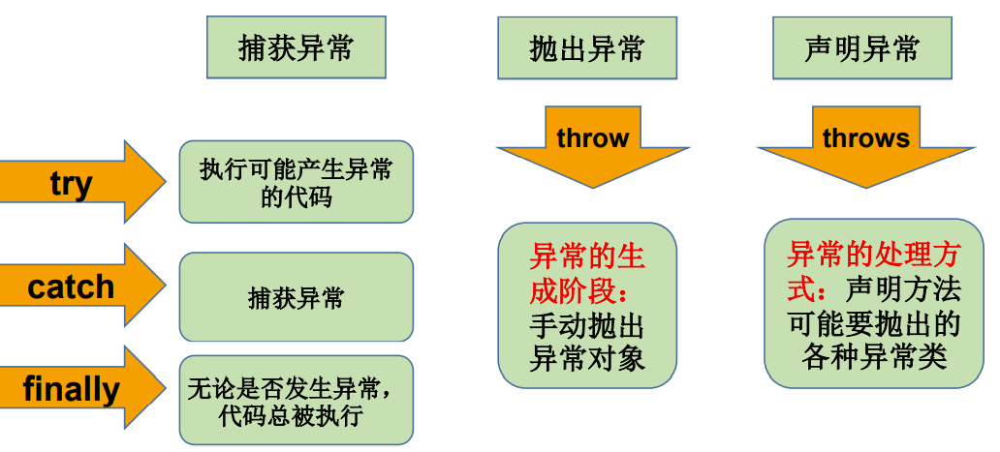

- 世界上最遥远的**距离**，是我在if里你在else里，似乎一直相伴又永远分离；
- 世界上最痴心的**等待**，是我当case你是switch，或许永远都选不上自己；
- 世界上最真情的**相依**，是你在try我在catch。无论你发神马脾气，我都默默承受，静静处理。到那时，再来期待我们的finally。

### 补充

try{}里有一个return语句，那么紧跟在这个try后的finally{}里的code会在return前执行

重新抛出异常：如果异常处理器catch不能处理一个异常，或者只是简单的希望它的调用者注意到该异常，Java允许该异常处理器重新抛出异常。

链式异常：有时候我们可以把捕获到的异常包装成一个新的异常，然后在新的异常里添加对原始异常的引用，再把新的异常抛出，就像链式反应，一个接着另一个。这种情况就叫做异常链。注:新的异常中包含原始异常的所有信息

```java
//方法一
RuntimeException newExc = new RuntimeException("新的异常"); //用指定的详细消息构造一个新的运行时异常
newExc.initCause(e); //通过调用initCause()方法去调用原始异常
throw newExc;  //抛出异常
//方法二(与上面的方法效果相同)
throw new RuntimeException("新的异常", e);
```


# 第8章 多线程

## IntelliJ IDEA 的安装、配置与使用(详见另一本笔记)

## 8-1 基本概念：程序、进程、线程

- 程序(program)是为完成特定任务、用某种语言编写的一组指令的集合。即指一段静态的代码，静态对象。
- 进程(process)是程序的一次执行过程，或是**正在运行的一个程序**。是一个动态的过程：有它自身的产生、存在和消亡的过程。——生命周期
  - 如：运行中的QQ，运行中的MP3播放器
  - 程序是静态的，进程是动态的
  - **进程作为资源分配的单位**，系统在运行时会为每个进程分配不同的内存区域
- 线程(thread)，进程可进一步细化为线程，是一个程序内部的一条执行路径。
  - 若一个进程同一时间并行执行多个线程，就是支持多线程的
  - 线程作为调度和执行的单位，每个线程拥有独立的运行栈和程序计数器(pc)，线程切换的开销小
  - 一个进程中的多个线程共享相同的内存单元/内存地址空间->它们从同一堆中分配对象，可以访问相同的变量和对象。这就使得线程间通信更简便、高效。但多个线程操作共享的系统资源可能就会带来**安全的隐患**。

- 单核CPU和多核CPU的理解
  - 单核CPU，其实是一种假的多线程，因为在一个时间单元内，也只能执行一个线程的任务。例如：虽然有多车道，但是收费站只有一个工作人员在收费，只有收了费才能通过，那么CPU就好比收费人员。如果有某个人不想交钱，那么收费人员可以把他“挂起”（晾着他，等他想通了，准备好了钱，再去收费）。但是因为CPU时间单元特别短，因此感觉不出来。
  - 如果是多核的话，才能更好的发挥多线程的效率。（现在的服务器都是多核的）
  - 一个Java应用程序java.exe，其实至少有三个线程：main()主线程，gc()垃圾回收线程，异常处理线程。当然如果发生异常，会影响主线程。
- 并行与并发
  - 并行：多个CPU同时执行多个任务。比如：多个人同时做不同的事。（车辆并行）
  - 并发：一个CPU(采用时间片)同时执行多个任务。比如：秒杀、多个人做同一件事。（多人打球）

### 使用多线程的优点

背景：以单核CPU为例，只使用单个线程先后完成多个任务（调用多个方法），肯定比用多个线程来完成用的时间更短，为何仍需多线程呢？

多线程程序的优点：
1. 提高应用程序的响应。对图形化界面更有意义，可增强用户体验。
2. 提高计算机系统CPU的利用率
3. 改善程序结构。将既长又复杂的进程分为多个线程，独立运行，利于理解和修改

### 何时需要多线程

- 程序需要同时执行两个或多个任务。
- 程序需要实现一些需要等待的任务时，如用户输入、文件读写操作、网络操作、搜索等。
- 需要一些后台运行的程序时。

## 8-2 线程的创建和使用

### 线程的创建和启动

- Java语言的JVM允许程序运行多个线程，它通过java.lang.Thread类来体现。
- Thread类的特性
  - 每个线程都是通过某个特定Thread对象的run()方法来完成操作的，经常把run()方法的主体称为**线程体**
  - 通过该Thread对象的start()方法来启动这个线程，而非直接调用run()

### Thread类 构造器
- Thread()：创建新的Thread对象
- Thread(String threadname)：创建线程并指定线程实例名
- Thread(Runnable target)：指定创建线程的目标对象，它实现了Runnable接口中的run方法
- Thread(Runnable target, String name)：创建新的Thread对象

### API中创建线程的两种方式

- JDK1.5之前创建新执行线程有两种方法：
  - 继承Thread类的方式
  - 实现Runnable接口的方式

- 方式一：继承Thread类
  1. 定义子类继承Thread类。
  2. 子类中重写Thread类中的run方法。--> 将此线程执行的操作声明在run()中
  3. 创建Thread子类对象，即创建了线程对象。
  4. 调用线程对象start方法：启动线程（①启动当前线程 ②调用当前线程的run()）
  - 注意点：
    1. 如果自己手动调用run()方法，那么就只是普通方法，没有启动多线程模式。
    2. run()方法由JVM调用，什么时候调用，执行的过程控制都有操作系统的CPU调度决定。
    3. 想要启动多线程，必须调用start方法。
    4. 一个线程对象只能调用一次start()方法启动，如果重复调用了，则将抛出以上的异常“IllegalThreadStateException”。如果想要并行执行同样的逻辑，需要重新创建一个线程的对象。
    5. 一种匿名子类的方式：`new Thread(){public void run(){}}.start();`

- 方式二：实现Runnable接口
  1. 定义子类，实现Runnable接口。
  2. 子类中重写Runnable接口中的run方法。
  3. 创建实现类的对象：通过Thread类含参构造器创建线程对象。
  4. 将Runnable接口的子类对象作为实际参数传递给Thread类的构造器中，创建Thread类的对象。
  5. 调用Thread类的start方法：（① 启动线程 ②调用当前线程的run()-->调用了Runnable类型的target的run()）

### 继承方式和实现方式的联系与区别

- 联系
  ```java
  public class Thread extends Object implements Runnable
  ```
- 相同点：两种方式都需要重写run(),将线程要执行的逻辑声明在run()中。
- 区别
  - 继承Thread：线程代码存放Thread子类run方法中。
  - 实现Runnable：线程代码存在接口的子类的run方法。
- 实现Runnable接口方式的好处
  - 避免了类的单继承的局限性
  - 共享数据：多个线程可以共享同一个接口实现类的对象，非常适合多个相同线程来处理同一份资源。

### Thread类的有关方法

- void start(): 启动线程，并执行对象的run()方法
- run(): 线程在被调度时执行的操作。通常需要重写Thread类中的此方法，将创建的线程要执行的操作声明在此方法中
- String getName():获取当前线程的名字
- void setName(String name):设置当前线程的名字
- static Thread currentThread(): 静态方法，返回执行当前代码的线程。在Thread子类中就是this，通常用于主线程和Runnable实现类
- static void yield()：线程让步
  - 暂停当前正在执行的线程，释放当前cpu的执行权，把执行机会让给优先级相同或更高的线程
  - 若队列中没有同优先级的线程，忽略此方法
- join() ：当某个程序执行流中调用其他线程的 join() 方法时，调用线程将被阻塞，直到 join() 方法加入的 join 线程执行完为止
  - 低优先级的线程也可以获得执行
  - 例：在线程a中调用线程b的join(),此时线程a就进入阻塞状态，直到线程b完全执行完以后，线程a才结束阻塞状态。
- static void sleep(long millis)：(指定时间:毫秒)
  - 让当前线程“睡眠”指定的millitime毫秒。在指定的millitime毫秒时间内，当前线程是阻塞状态。
  - 令当前活动线程在指定时间段内放弃对CPU控制,使其他线程有机会被执行,时间到后重排队。
  - 抛出InterruptedException异常
- stop(): 强制线程生命期结束，不推荐使用（已过时。）
- boolean isAlive()：返回boolean，判断当前线程是否存活

### 线程的调度

- 调度策略
  - 时间片
  - 抢占式：高优先级的线程抢占CPU
- Java的调度方法
  - 同优先级线程组成先进先出队列（先到先服务），使用时间片策略
  - 对高优先级，使用优先调度的抢占式策略

### 线程的优先级

- 线程的优先级等级
  - MAX_PRIORITY：10 
  - MIN _PRIORITY：1 
  - NORM_PRIORITY：5 -->默认优先级
- 涉及的方法
  - getPriority() ：获取线程的优先级
  - setPriority(int newPriority) ：设置线程的优先级
- 说明
  - 线程创建时继承父线程的优先级
  - 高优先级的线程要抢占低优先级线程cpu的执行权。
  - 低优先级只是获得调度的概率低，并非一定是在高优先级线程之后才被调用

### 补充：线程的分类

Java中的线程分为两类：一种是守护线程，一种是用户线程。
- 它们在几乎每个方面都是相同的，唯一的区别是判断JVM何时离开。
- 守护线程是用来服务用户线程的，通过在start()方法前调用thread.setDaemon(true)可以把一个用户线程变成一个守护线程。
- Java垃圾回收就是一个典型的守护线程。
- 若JVM中都是守护线程，当前JVM将退出。
- 形象理解：兔死狗烹，鸟尽弓藏

## 8-3 线程的生命周期

JDK中用Thread.State类定义了线程的几种状态

要想实现多线程，必须在主线程中创建新的线程对象。Java语言使用Thread类及其子类的对象来表示线程，在它的一个完整的生命周期中通常要经历如下的五种状态：
- 新建： 当一个Thread类或其子类的对象被声明并创建时，新生的线程对象处于新建状态
- 就绪：处于新建状态的线程被start()后，将进入线程队列等待CPU时间片，此时它已具备了运行的条件，只是没分配到CPU资源
- 运行：当就绪的线程被调度并获得CPU资源时,便进入运行状态， run()方法定义了线程的操作和功能
- 阻塞：在某种特殊情况下，被人为挂起或执行输入输出操作时，让出 CPU 并临时中止自己的执行，进入阻塞状态
- 死亡：线程完成了它的全部工作或线程被提前强制性地中止或出现异常导致结束


## 8-4 线程的同步

问题的提出
- 多个线程执行的不确定性引起执行结果的不稳定
- 多个线程对账本的共享，会造成操作的不完整性，会破坏数据。

1. 多线程出现了安全问题（卖票过程中，出现了重票、错票）
2. 问题的原因：当多条语句在操作同一个线程**共享数据**时，一个线程对多条语句只执行了一部分，还没有执行完，另一个线程参与进来执行。导致共享数据的错误。
3. 解决办法：对多条操作共享数据的语句，只能让一个线程都执行完，在执行过程中，其他线程不可以参与执行。当一个线程在操作的时候，其他线程不能参与进来。直到该线程操作完成时，其他线程才可以开始操作。这种情况即使该线程出现了阻塞，也不能被改变。

### Synchronized的使用方法

Java对于多线程的安全问题提供了专业的解决方式：**同步机制**

1. 同步代码块：
    ```java
    synchronized (同步监视器对象){
    // 需要被同步的代码；
    }
    ```
   1. 操作共享数据的代码，即为需要被同步的代码。-->不能包含代码多了（不和需求），也不能包含代码少了（不能完成同步）。
   2. 共享数据：多个线程共同操作的变量。比如：ticket就是共享数据。
   3. 同步监视器，俗称：锁。任何一个类的对象，都可以充当锁。要求：多个线程必须要共用同一把锁。
   4. 补充：在实现Runnable接口创建多线程的方式中，我们可以考虑使用this充当同步监视器。
   5. 在继承Thread类创建多线程的方式中，慎用this充当同步监视器（当前类的对象不唯一时this不唯一），考虑使用当前类充当同步监视器。
   6. 同步的方式，解决了线程的安全问题。（好处）操作同步代码时，只能有一个线程参与，其他线程等待。相当于是一个单线程的过程，效率低。（局限性）

2. synchronized还可以放在方法声明中，表示整个方法为同步方法。
    ```java
    public synchronized void m (String arg){ ... }
    ```
   1. 同步方法仍然涉及到同步监视器，只是不需要我们显式的声明。
   2. 非静态的同步方法，同步监视器是：this
   3. 静态的同步方法，同步监视器是：当前类本身

### 同步机制中的锁

- 同步锁机制： 
在《Thinking in Java》中，是这么说的：对于并发工作，你需要某种方式来防止两个任务访问相同的资源（其实就是共享资源竞争）。 防止这种冲突的方法就是当资源被一个任务使用时，在其上加锁。第一个访问某项资源的任务必须锁定这项资源，使其他任务在其被解锁之前，就无法访问它了，而在其被解锁之时，另一个任务就可以锁定并使用它了。
- synchronized的锁是什么？
  - 任意对象都可以作为同步锁。所有对象都自动含有单一的锁（监视器）。
  - 同步方法的锁：静态方法（类名.class）、非静态方法（this）
  - 同步代码块：自己指定，很多时候也是指定为this或类名.class
- 注意：
  - 必须确保使用同一个资源的多个线程共用一把锁，这个非常重要，否则就无法保证共享资源的安全
  - 一个线程类中的所有静态方法共用同一把锁（类名.class），所有非静态方法共用同一把锁（this），同步代码块（指定需谨慎）

### 同步的范围

1. 如何找问题，即代码是否存在线程安全？（非常重要）
   1. 明确哪些代码是多线程运行的代码
   2. 明确多个线程是否有共享数据
   3. 明确多线程运行代码中是否有多条语句操作共享数据
2. 如何解决呢？（非常重要）:对多条操作共享数据的语句，只能让一个线程都执行完，在执行过程中，其他线程不可以参与执行。即所有操作共享数据的这些语句都要放在同步范围中
3. 切记：
   - 范围太小：没锁住所有有安全问题的代码
   - 范围太大：没发挥多线程的功能。

### 释放锁的操作

- 当前线程的同步方法、同步代码块执行结束。
- 当前线程在同步代码块、同步方法中遇到break、return终止了该代码块、该方法的继续执行。
- 当前线程在同步代码块、同步方法中出现了未处理的Error或Exception，导致异常结束。
- 当前线程在同步代码块、同步方法中执行了线程对象的wait()方法，当前线程暂停，并释放锁。

### 不会释放锁的操作

- 线程执行同步代码块或同步方法时，程序调用Thread.sleep()、Thread.yield()方法暂停当前线程的执行
- 线程执行同步代码块时，其他线程调用了该线程的suspend()方法将该线程挂起，该线程不会释放锁（同步监视器）。
  - 应尽量避免使用suspend()和resume()来控制线程

单例设计模式之懒汉式(线程安全)

```java
class Singleton {
  private static Singleton instance = null;
  private Singleton(){}
  public static Singleton getInstance(){
    if(instance == null){
      synchronized(Singleton.class){
        if(instance == null){
          instance = new Singleton();
        } 
      } 
    }
    return instance;
  }
}
```

### 线程的死锁问题

- 死锁
  - 不同的线程分别占用对方需要的同步资源不放弃，都在等待对方放弃自己需要的同步资源，就形成了线程的死锁
  - 出现死锁后，不会出现异常，不会出现提示，只是所有的线程都处于阻塞状态，无法继续
- 解决方法(使用同步时，要避免出现死锁。)
  - 专门的算法、原则
  - 尽量减少同步资源的定义
  - 尽量避免嵌套同步

```java
//死锁的演示
class A {
	public synchronized void foo(B b) { // 同步监视器：A类的对象：a
		System.out.println("当前线程名: " + Thread.currentThread().getName() + " 进入了A实例的foo方法");
		System.out.println("当前线程名: " + Thread.currentThread().getName() + " 企图调用B实例的last方法");
		b.last();
	}
	public synchronized void last() {// 同步监视器：A类的对象：a
		System.out.println("进入了A类的last方法内部");
	}
}
class B {
	public synchronized void bar(A a) {// 同步监视器：b
		System.out.println("当前线程名: " + Thread.currentThread().getName() + " 进入了B实例的bar方法");
		System.out.println("当前线程名: " + Thread.currentThread().getName() + " 企图调用A实例的last方法");
		a.last();
	}
	public synchronized void last() {// 同步监视器：b
		System.out.println("进入了B类的last方法内部");
	}
}
public class DeadLock implements Runnable {
	A a = new A();
	B b = new B();
	public void init() {
		Thread.currentThread().setName("主线程");
		a.foo(b);// 调用a对象的foo方法
		System.out.println("进入了主线程之后");
	}
	public void run() {
		Thread.currentThread().setName("副线程");
		b.bar(a);// 调用b对象的bar方法
		System.out.println("进入了副线程之后");
	}
	public static void main(String[] args) {
		DeadLock dl = new DeadLock();
		new Thread(dl).start();
		dl.init();
	}
}
```

### Lock(锁)

- 从JDK 5.0开始，Java提供了更强大的线程同步机制 —— 通过显式定义同步锁对象来实现同步。同步锁使用Lock对象充当。
- java.util.concurrent.locks.Lock接口是控制多个线程对共享资源进行访问的工具。锁提供了对共享资源的独占访问，每次只能有一个线程对Lock对象加锁，线程开始访问共享资源之前应先获得Lock对象。
- ReentrantLock 类实现了 Lock ，它拥有与 synchronized 相同的并发性和内存语义，在实现线程安全的控制中，比较常用的是ReentrantLock，可以显式加锁、释放锁。

```java
class A{
  private final ReentrantLock lock = new ReenTrantLock();
  public void m(){
    lock.lock();
    try{
      //保证线程安全的代码;
    }
    finally{
      //注意：如果同步代码有异常，要将unlock()写入finally语句块
      lock.unlock(); 
    }
  }
}
```

### synchronized 与 Lock 的对比

1. Lock是显式锁（手动开启和关闭锁，别忘记关闭锁），synchronized是隐式锁，出了作用域自动释放
2. Lock只有代码块锁，synchronized有代码块锁和方法锁
3. 使用Lock锁，JVM将花费较少的时间来调度线程，性能更好。并且具有更好的扩展性（提供更多的子类）

优先使用顺序：
Lock -> 同步代码块（已经进入了方法体，分配了相应资源） -> 同步方法（在方法体之外）

关于多线程问题的思考：  
- 是否是多线程问题？ 
- 是否有共享数据？
- 是否有线程安全问题？

## 8-5 线程的通信

- wait() 与 notify() 和 notifyAll()
  - wait()：令当前线程挂起并放弃CPU、同步资源进入阻塞状态，释放同步监视器并等待，使别的线程可访问并修改共享资源，而当前线程排队等候其他线程调用notify()或notifyAll()方法唤醒，唤醒后等待重新获得对监视器的所有权后才能继续执行。
  - notify()：唤醒正在排队等待同步资源的线程中优先级最高者结束等待
  - notifyAll ()：唤醒正在排队等待资源的所有线程结束等待.
- 这三个方法只有在synchronized同步代码块或synchronized同步方法中才能使用，三个方法的调用者必须是同步代码块或同步方法中的同步监视器。否则会报java.lang.IllegalMonitorStateException异常。
- 因为这三个方法必须有锁对象调用，而任意对象都可以作为synchronized的同步锁（对象监视器），因此这三个方法只能在java.lang.Object类中声明。（同步监视器为this时可以省略对象名）

### wait() 方法

- 在当前线程中调用方法： 对象名.wait()
- 使当前线程进入等待（某对象）状态 ，直到另一线程对该对象发出 notify (或notifyAll) 为止。
- 调用方法的必要条件：当前线程必须具有对该对象的监控权（加锁）
- 调用此方法后，当前线程将释放对象监控权 ，然后进入等待
- 在当前线程被notify后，要重新获得监控权，然后从断点处继续代码的执行。

### notify()/notifyAll()

- 在当前线程中调用方法： 对象名.notify()
- 功能：唤醒等待该对象监控权的一个/所有线程。
- 调用方法的必要条件：当前线程必须具有对该对象的监控权（加锁）

面试题：sleep() 和 wait()的异同？  
1. 相同点：一旦执行方法，都可以使得当前的线程进入阻塞状态。
2. 不同点：
   1. 两个方法声明的位置不同：Thread类中声明sleep() , Object类中声明wait()
   2. 调用的要求不同：sleep()可以在任何需要的场景下调用。 wait()必须使用在同步代码块或同步方法中
   3. 关于是否释放同步监视器：如果两个方法都使用在同步代码块或同步方法中，sleep()不会释放锁，wait()会释放锁。

```java
/* 线程通信的应用：经典例题：生产者/消费者问题
 * 生产者(Productor)将产品交给店员(Clerk)，而消费者(Customer)从店员处取走产品，
 * 店员一次只能持有固定数量的产品(比如:20），如果生产者试图生产更多的产品，店员
 * 会叫生产者停一下，如果店中有空位放产品了再通知生产者继续生产；如果店中没有产品
 * 了，店员会告诉消费者等一下，如果店中有产品了再通知消费者来取走产品。
 * 分析：
 * 1. 是否是多线程问题？是，生产者线程，消费者线程
 * 2. 是否有共享数据？是，店员（或产品）
 * 3. 如何解决线程的安全问题？同步机制,有三种方法
 * 4. 是否涉及线程的通信？是 */
class Clerk{
    private int productCount = 0;
    public synchronized void produceProduct() {//生产产品
        if(productCount < 20){
            productCount++;
            System.out.println(Thread.currentThread().getName() + ":开始生产第" + productCount + "个产品");
            notify();
        }else{//等待
            try {
                wait();
            } catch (InterruptedException e) {
                e.printStackTrace();
            }
        }
    }
    public synchronized void consumeProduct() {//消费产品
        if(productCount > 0){
            System.out.println(Thread.currentThread().getName() + ":开始消费第" + productCount + "个产品");
            productCount--;
            notify();
        }else{//等待
            try {
                wait();
            } catch (InterruptedException e) {
                e.printStackTrace();
            }
        }
    }
}
class Producer extends Thread{//生产者
    private Clerk clerk;
    public Producer(Clerk clerk) {
        this.clerk = clerk;
    }
    @Override
    public void run() {
        System.out.println(getName() + ":开始生产产品.....");
        while(true){
            try {
                Thread.sleep(10);
            } catch (InterruptedException e) {
                e.printStackTrace();
            }
            clerk.produceProduct();
        }
    }
}
class Consumer extends Thread{//消费者
    private Clerk clerk;
    public Consumer(Clerk clerk) {
        this.clerk = clerk;
    }
    @Override
    public void run() {
        System.out.println(getName() + ":开始消费产品.....");
        while(true){
            try {
                Thread.sleep(20);
            } catch (InterruptedException e) {
                e.printStackTrace();
            }
            clerk.consumeProduct();
        }
    }
}
public class ProductTest {
    public static void main(String[] args) {
        Clerk clerk = new Clerk();
        Producer p1 = new Producer(clerk);
        p1.setName("生产者1");
        Consumer c1 = new Consumer(clerk);
        c1.setName("消费者1");
        Consumer c2 = new Consumer(clerk);
        c2.setName("消费者2");
        p1.start();
        c1.start();
        c2.start();
    }
}
```

## 8-6 JDK5.0新增线程创建方式

### 新增方式一：实现Callable接口

- 与使用Runnable相比， Callable功能更强大些
  - 相比run()方法，call()可以有返回值
  - call()方法可以抛出异常，被外面的操作捕获，获取异常的信息
  - Callable是支持泛型的返回值
  - 需要借助FutureTask类，比如获取返回结果

- Future接口
  - 可以对具体Runnable、Callable任务的执行结果进行取消、查询是否完成、获取结果等。
  - FutrueTask是Futrue接口的唯一的实现类
  - FutureTask 同时实现了Runnable, Future接口。它既可以作为Runnable被线程执行，又可以作为Future得到Callable的返回值

使用步骤：  
1. 创建一个实现Callable的实现类
2. 实现call()方法，将此线程需要执行的操作声明在call()中
3. 创建Callable接口实现类的对象
4. 将此Callable接口实现类的对象作为参数传递到FutureTask构造器中，创建FutureTask的对象
5. 将FutureTask的对象作为参数传递到Thread类的构造器中，创建Thread对象，并调用start()
6. 获取Callable中call()方法的返回值，调用FutureTask的对象的get()方法的返回值即为FutureTask构造器参数Callable实现类重写的call()的返回值。

### 新增方式二：使用线程池

- 背景：经常创建和销毁、使用量特别大的资源，比如并发情况下的线程，对性能影响很大。
- 思路：提前创建好多个线程，放入线程池中，使用时直接获取，使用完放回池中。可以避免频繁创建销毁、实现重复利用。类似生活中的公共交通工具。
- 好处：
  - 提高响应速度（减少了创建新线程的时间）
  - 降低资源消耗（重复利用线程池中线程，不需要每次都创建）
  - 便于线程管理：ThreadPoolExecutor
    - corePoolSize：核心池的大小
    - maximumPoolSize：最大线程数
    - keepAliveTime：线程没有任务时最多保持多长时间后会终止

### 线程池相关API

- JDK 5.0起提供了线程池相关API：ExecutorService 和 Executors
- ExecutorService：真正的线程池接口。常见子类ThreadPoolExecutor
  - void execute(Runnable command) ：执行任务/命令，没有返回值，一般用来执行Runnable
  - \<T\> Future\<T\> submit(Callable\<T\> task)：执行任务，有返回值，一般用来执行Callable
  - void shutdown() ：关闭连接池
- Executors：工具类、线程池的工厂类，用于创建并返回不同类型的线程池
  - Executors.newCachedThreadPool()：创建一个可根据需要创建新线程的线程池
  - Executors.newFixedThreadPool(int nThreads); 创建一个可重用固定线程数的线程池
  - Executors.newSingleThreadExecutor() ：创建一个只有一个线程的线程池
  - Executors.newScheduledThreadPool(n)：创建一个线程池，它可安排在给定延迟后运行命令或者定期地执行。

## 章节练习

1. 在jdk5.0以前，对于多线程有两种实现方法，分别是继承Thread类与实现Runnable接口。  
   - 用synchronized关键字修饰同步方法，反对使用stop()，是因为它不安全。它会解除由线程获取的所有锁定，而且如果对象处于一种不连贯状态，那么其他线程能在那种状态下检查和修改它们。结果很难检查出真正的问题所在。
   - suspend()方法容易发生死锁。调用suspend()的时候，目标线程会停下来，但却仍然持有在这之前获得的锁定。此时，其他任何线程都不能访问锁定的资源，除非被"挂起"的线程恢复运行。对任何线程来说，如果它们想恢复目标线程，同时又试图使用任何一个锁定的资源，就会造成死锁。所以不应该使用suspend()，而应在自己的Thread类中置入一个标志，指出线程应该活动还是挂起。若标志指出线程应该挂起，便用wait()命其进入等待状态。若标志指出线程应当恢复，则用一个notify()重新启动线程。
2. sleep & wait 
   - sleep是线程类（Thread）的方法，导致此线程暂停执行指定时间，给执行机会给其他线程，但是监控状态依然保持，到时后会自动恢复。调用sleep不会释放对象锁。  
   - wait是Object类的方法，对此对象调用wait方法导致本线程放弃对象锁，进入等待此对象的等待锁定池，只有针对此对象发出notify方法（或notifyAll）后本线程才进入对象锁定池准备获得对象锁进入运行状态。
3. 同步和异步  
   - 如果数据将在线程间共享。例如正在写的数据以后可能被另一个线程读到，或者正在读的数据可能已经被另一个线程写过了，那么这些数据就是共享数据，必须进行同步存取。
   - 当应用程序在对象上调用了一个需要花费很长时间来执行的方法，并且不希望让程序等待方法的返回时，就应该使用异步编程，在很多情况下采用异步途径往往更有效率。
4. run() & start()  
  启动一个线程是调用start()方法，使线程所代表的虚拟处理机处于可运行状态，这意味着它可以由JVM调度并执行。这并不意味着线程就会立即运行。run()方法就是正常的对象调用方法的执行，并不是使用分线程来执行的。
5. 一个对象的一个synchronized方法只能由一个线程访问。
6. 线程同步  
   - wait():使一个线程处于等待状态，并且释放所持有的对象的lock。
   - sleep():使一个正在运行的线程处于睡眠状态，是一个静态方法，调用此方法要捕捉InterruptedException异常。
   - notify():唤醒一个处于等待状态的线程，注意的是在调用此方法的时候，并不能确切的唤醒某一个等待状态的线程，而是由JVM确定唤醒哪个线程，而且不是按优先级。
   - notityAll():唤醒所有处入等待状态的线程，注意并不是给所有唤醒线程一个对象的锁，而是让它们竞争。
7. 多线程有两种实现方法，分别是继承Thread类与实现Runnable接口同步的实现方面有两种，分别是synchronized,wait与notify
8. 线程指在程序执行过程中，能够执行程序代码的一个执行单位，每个程序至少都有一个线程，也就是程序本身。Java中的线程有四种状态分别是：**创建、就绪、运行、阻塞、结束**
9. synchronized & java.util.concurrent.locks.Lock
   - Lock能完成synchronized所实现的所有功能
   - Lock有比synchronized更精确的线程语义和更好的性能。synchronized会自动释放锁，而Lock一定要求程序员手工释放，并且必须在finally从句中释放。
10. Java为什么要引入线程机制，线程、程序、进程之间的关系是怎样的。
   - 线程可以彼此独立的执行，它是一种实现并发机制的有效手段，可以同时使用多个线程来完成不同的任务，并且一般用户在使用多线程时并不考虑底层处理的细节。
   - 程序是一段静态的代码，是软件执行的蓝本。进程是程序的一次动态执行过程，即是处于运行过程中的程序。线程是比进程更小的程序执行单位，一个进程可以启动多个线程同时运行，不同线程之间可以共享相同的内存区域和数据。多线程程序是运行时间后嗣可能出现在一个进程之内的、有一个以上线程同时运行的情况的程序。
11. Runnable接口中仅有run()抽象方法。Thread类主要域有：MAX_PRIORITY,MIN_PRIORITY,NORM_PRIORITY。
主要方法有start(),run(),sleep(),currentThread(),setPriority(),getPriority(),join()等。
12. Thread & Runnable
    1. 继承Thread类
       1. 定义类继承Thread类。
       2. 覆盖Thread类中的run方法。
       3. 创建Thread子类对象，即创建了线程对象。
       4. 调用线程对象start方法：启动线程，调用run方法。
    2. 实现Runnable接口
       1. 定义类，实现Runnable接口。
       2. 覆盖Runnable接口中的run方法。
       3. 通过Thread类建立线程对象。
       4. 将Runnable接口的子类对象作为实际参数传递给Thread类的构造方法中。
       5. 调用Thread类的start方法：开启线程，调用Runnable子类接口的run方法。

    3. 【区别】
       - 继承Thread: 线程代码存放Thread子类run方法中。
       - 实现Runnable：线程代码存在接口的子类的run方法。
    4. 【实现方法的好处】
       1. 避免了单继承的局限性
       2. 多个线程可以共享同一个接口子类的对象，非常适合多个相同线程来处理同一份资源。


# 第9章 Java常用类

## 9-1 字符串相关的类

### 9.1 字符串相关的类：String

String的特性
- String类：代表字符串。Java 程序中的所有字符串字面值（使用一对""引起来表示，如 "abc"）都作为此类的实例实现。
- String是一个final类，代表**不可变的字符序列** （不可变性），不可被继承。
- 字符串是常量，用双引号引起来表示。它们的值在创建之后不能更改。
- String对象的字符内容是存储在一个final的字符数组value[]中的。
  - 当对字符串重新赋值时，需要重写指定内存区域赋值，不能使用原有的value进行赋值。
  - 当对现有的字符串进行连接操作时，也需要重新指定内存区域赋值，不能使用原有的value进行赋值。
  - 当调用String的replace()方法修改指定字符或字符串时，也需要重新指定内存区域赋值，不能使用原有的value进行赋值。
- 实现了Serializable接口：表示字符串是支持序列化的。
- 实现了Comparable接口：表示String可以比较大小

String的实例化方式：
1. 方式一：通过字面量定义的方式：字符串常量存储在字符串常量池，目的是共享`String str1 = "abc";`，通过字面量的方式（区别于new）给一个字符串赋值，此时的字符串值声明在字符串常量池中。字符串常量池中不会存储相同内容的字符串。
2. 通过new + 构造器的方式：字符串非常量对象存储在堆中。`String str2 = new String("abc");`，value[]还是存在常量池中。

面试题：`String s = new String("abc");`方式创建对象，在内存中创建了两个:一个是堆空间中new结构，另一个是char[]对应的常量池中的数据："abc"。

字符串的特性
- 常量与常量的拼接结果在常量池。且常量池中不会存在相同内容的常量。
- 只要其中有一个是变量，结果就在堆中
- 如果拼接的结果调用intern()方法，返回值就在常量池中

String使用陷阱
- `String s1 = "a"; `
  - 说明：在字符串常量池中创建了一个字面量为"a"的字符串。
- `s1 = s1 + "b"; `
  - 说明：实际上原来的"a"字符串对象已经丢弃了，现在在堆空间中产生了一个字符串s1+"b"（也就是"ab")。如果多次执行这些改变串内容的操作，会导致大量副本字符串对象存留在内存中，降低效率。如果这样的操作放到循环中，会极大影响程序的性能。
- `String s2 = "ab";`
  - 说明：直接在字符串常量池中创建一个字面量为"ab"的字符串。
- `String s3 = "a" + "b";`
  - 说明：s3指向字符串常量池中已经创建的"ab"的字符串。
- `String s4 = s1.intern();`
  - 说明：堆空间的s1对象在调用intern()之后，会将常量池中已经存在的"ab"字符串赋值给s4。

### 9.1 字符串相关的类：String常用方法

- int length()：返回字符串的长度： return value.length
- char charAt(int index)： 返回某索引处的字符return value\[index\]
- boolean isEmpty()：判断是否是空字符串：return value.length == 0
- String toLowerCase()：使用默认语言环境，将 String 中的所有字符转换为小写
- String toUpperCase()：使用默认语言环境，将 String 中的所有字符转换为大写
- String trim()：返回字符串的副本，忽略前导空白和尾部空白
- boolean equals(Object obj)：比较字符串的内容是否相同
- boolean equalsIgnoreCase(String anotherString)：与equals方法类似，忽略大小写
- String concat(String str)：将指定字符串连接到此字符串的结尾。 等价于用“+”
- int compareTo(String anotherString)：比较两个字符串的大小
- int compareToIgnoreCase(String anotherString)：忽略大小写比较两个字符串的大小
- String substring(int beginIndex)：返回一个新的字符串，它是此字符串的从beginIndex开始截取到最后的一个子字符串。
- String substring(int beginIndex, int endIndex) ：返回一个新字符串，它是此字符串从beginIndex开始截取到endIndex(不包含)的一个子字符串。

---

- boolean endsWith(String suffix)：测试此字符串是否以指定的后缀结束
- boolean startsWith(String prefix)：测试此字符串是否以指定的前缀开始
- boolean startsWith(String prefix, int toffset)：测试此字符串从指定索引开始的子字符串是否以指定前缀开始

---

- boolean contains(CharSequence s)：当且仅当此字符串包含指定的char值序列（子串）时，返回 true
- int indexOf(String str)：返回指定子字符串在此字符串中第一次出现处的索引
- int indexOf(String str, int fromIndex)：返回指定子字符串在此字符串中第一次出现处的索引，从指定的索引开始
- int lastIndexOf(String str)：返回指定子字符串在此字符串中最右边出现处的索引
- int lastIndexOf(String str, int fromIndex)：返回指定子字符串在此字符串中最后一次出现处的索引，从指定的索引开始反向搜索
**注：indexOf和lastIndexOf方法如果未找到都是返回-1**，有相应的字符的重载方法。

---

- String replace(char oldChar, char newChar)：返回一个新的字符串，它是通过用 newChar 替换此字符串中出现的所有 oldChar 得到的。
- String replace(CharSequence target, CharSequence replacement)：使用指定的字面值替换序列替换此字符串所有匹配字面值目标序列的子字符串。
- String replaceAll(String regex, String replacement) ： 使用给定的replacement 替换此字符串所有匹配给定的正则表达式的子字符串。
- String replaceFirst(String regex, String replacement) ： 使用给定的replacement 替换此字符串匹配给定的正则表达式的第一个子字符串。

---

- boolean matches(String regex)：告知此字符串是否匹配给定的正则表达式。

---

- String[] split(String regex)：根据给定正则表达式的匹配拆分此字符串。
- String[] split(String regex, int limit)：根据匹配给定的正则表达式来拆分此字符串，最多不超过limit个，如果超过了，剩下的全部都放到最后一个元素中。

---

static String	format​(String format, Object... args)：使用指定的格式字符串和参数（与printf类似）返回格式化字符串。

### 9.1 字符串相关的类：String与基本数据类型转换

- 字符串 -> 基本数据类型、包装类
  - Integer包装类的public static int parseInt(String s)：可以将由“数字”字符组成的字符串转换为整型。
  - 类似地,使用java.lang包中的Byte、Short、Long、Float、Double类调相应的类方法可以将由“数字”字符组成的字符串，转化为相应的基本数据类型。
- 基本数据类型、包装类 -> 字符串
  - 调用String类的public String valueOf(int n)可将int型转换为字符串
  - 相应的valueOf(byte b)、valueOf(long l)、valueOf(float f)、valueOf(double d)、valueOf(boolean b)可由参数的相应类型到字符串的转换

### 9.1 字符串相关的类：String与字符数组转换

- 字符数组 -> String（字符串）
  - String类的构造器：`String(char[])` 和 `String(char[]，int offset，int length)` 分别用字符数组中的全部字符和部分字符创建字符串对象。
  - String类的静态方法：`valueOf(char[] data)`
- String（字符串） -> 字符数组
  - `public char[] toCharArray()`：将字符串中的全部字符存放在一个字符数组中的方法。
  - `public void getChars(int srcBegin, int srcEnd, char[] dst, int dstBegin)`：提供了将指定索引范围内的字符串存放到数组中的方法。

### 9.1 字符串相关的类：String与字节数组转换

- 字节数组 -> String（字符串） （解码）
  - `String(byte[])`：通过使用平台的默认字符集解码指定的 byte 数组，构造一个新的 String。
  - `String(byte[]，int offset，int length)` ：用指定的字节数组的一部分，即从数组起始位置offset开始取length个字节构造一个字符串对象。
  - 解码时，要求解码使用的字符集必须与编码时使用的字符集一致，编码集和解码集不一致可能会导致乱码
- String（字符串） -> 字节数组 （解码）
  - `public byte[] getBytes()` ：使用平台的默认字符集将此 String 编码为byte 序列，并将结果存储到一个新的 byte 数组中。
  - `public byte[] getBytes(String charsetName)` ：使用指定的字符集将此 String 编码到 byte 序列，并将结果存储到新的 byte 数组。

### 9.1 字符串相关的类：StringBuffer

- java.lang.StringBuffer代表可变的字符序列，JDK1.0中声明，可以对字符串内容进行增删，此时不会产生新的对象。
- 很多方法与String相同。
- 作为参数传递时，方法内部可以改变值。

- StringBuffer类不同于String，其对象必须使用构造器生成。有三个构造器：
  - StringBuffer()：初始容量为16的字符串缓冲区
  - StringBuffer(int size)：构造指定容量的字符串缓冲区
  - StringBuffer(String str)：将内容初始化为指定字符串内容

StringBuffer类的常用方法

- `StringBuffer append(xxx)`：提供了很多的append()方法，用于进行字符串拼接
- `StringBuffer delete(int start,int end)`：删除指定位置的内容
- `StringBuffer deleteAtChar(int index)`：删除指定位置的字符
- `StringBuffer replace(int start, int end, String str)`：把[start,end)位置替换为str
- `StringBuffer insert(int offset, xxx)`：在指定位置插入xxx
- `StringBuffer reverse()` ：把当前字符序列逆转

  - 当append和insert时，如果原来value数组长度不够，可扩容。默认情况下，扩容为原来容量的2倍 + 2，同时将原有数组中的元素复制到新的数组中。
    - 指导意义：开发中优先使用：StringBuffer(int capacity) 或 StringBuilder(int capacity)
  - 如上这些方法支持方法链操作。
  - 方法链的原理：`return this`

- `public int capacity()`：返回当前容量。
- `public int indexOf(String str)`
- `public String substring(int start)`：返回一个从start开始的子字符串
- `public String substring(int start, int end)`：返回一个从start开始到end索引结束的左闭右开区间的子字符串
- `public int length()`：返回字符串的字符数
- `public void setLength​(int newLength)`	：设置字符序列的长度。
- `public char charAt(int n)`：返回指定下标位置的字符
- `public void setCharAt(int n ,char ch)`：设置指定下标位置的字符
- `public void trimToSize()`：尝试减少用于字符序列的存储空间。

总结：
- 增：append(xxx)
- 删：delete(int start,int end)
- 改：setCharAt(int n ,char ch) / replace(int start, int end, String str)
- 查：charAt(int n)
- 插：insert(int offset, xxx)
- 长度：length();
- 遍历(不常用)：for() + charAt() / toString()

### 9.1 字符串相关的类：StringBuilder

- StringBuilder 和 StringBuffer 非常类似，均代表可变的字符序列，而且提供相关功能的方法也一样
- 面试题：对比String、StringBuffer、StringBuilder
  - String(JDK1.0)：不可变字符序列
  - StringBuffer(JDK1.0)：可变字符序列、效率低(相对StringBuilder而言)、线程安全
  - StringBuilder(JDK 5.0)：可变字符序列、效率高、线程不安全

String、StringBuffer、StringBuilder三者的异同？
- String:不可变的字符序列；底层使用char[]存储
- StringBuffer:可变的字符序列；线程安全的，效率低；底层使用char[]存储
- StringBuilder:可变的字符序列；jdk5.0新增的，线程不安全的，效率高；底层使用char[]存储
- 注意：作为参数传递的话，方法内部String不会改变其值，StringBuffer和StringBuilder会改变其值。如果一个字符串不需要任何改变，使用String会更高效。
- 相互转换：String -> SB：调用SB的构造器；SB -> String：String的构造器或SB对象的toString
- 三者的效率：从高到低排列：StringBuilder \> StringBuffer \> String

```java
/* 算法题目：获取两个字符串中最大相同子串。
比如：str1 = "abcwerthelloyuiodefabcdef";str2 = "cvhellobnm"
提示：将短的那个串进行长度依次递减的子串与较长的串比较。
如果存在多个长度相同的最大相同子串此时先返回String[]，后面可以用集合中的ArrayList替换，较方便 */
public String[] getMaxSameString(String str1, String str2) {
  if (str1 != null && str2 != null) {
    StringBuffer sBuffer = new StringBuffer();
    String maxString = (str1.length() > str2.length()) ? str1 : str2;
    String minString = (str1.length() > str2.length()) ? str2 : str1;
    int len = minString.length();
    for (int i = 0; i < len; i++) {
      for (int x = 0, y = len - i; y <= len; x++, y++) {
        String subString = minString.substring(x, y);
        if (maxString.contains(subString)) {
          sBuffer.append(subString + ",");
        }
      }
      if (sBuffer.length() != 0)break;
    }
    String[] split = sBuffer.toString().replaceAll(",$", "").split("\\,");
    return split;
  }
  return null;
}
```

## 9-2 JDK8之前日期时间API

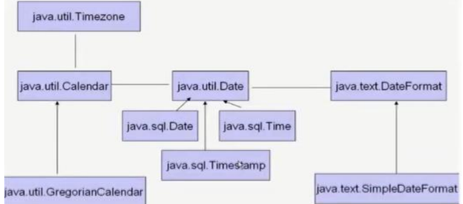

### 1.java.lang.System类  
- System类提供的`public static long currentTimeMillis()`用来返回当前时间与1970年1月1日0时0分0秒之间以毫秒为单位的时间差。（时间戳）
  - 此方法适于计算时间差。
- 计算世界时间的主要标准有：
  - UTC(Coordinated Universal Time)
  - GMT(Greenwich Mean Time)
  - CST(Central Standard Time)

### 2.java.util.Date类
- 表示特定的瞬间，精确到毫秒
- 构造器：
  - Date()：创建一个对应当前时间的Date对象，获取本地当前时间。
  - Date(long date)：创建指定毫秒数的Date对象
- 常用方法
  - getTime():返回自 1970 年 1 月 1 日 00:00:00 GMT 以来此 Date 对象表示的毫秒数。（时间戳）
  - toString():把此 Date 对象转换为以下形式的 String： dow mon dd hh:mm:ss zzz yyyy 其中： dow 是一周中的某一天 (Sun, Mon, Tue, Wed, Thu, Fri, Sat)，zzz是时间标准。
  - 其它很多方法都过时了。
  ```java
  // java.sql.Date对应着数据库中的日期类型的变量，是java.util.Date的子类
  // 将java.util.Date对象转换为java.sql.Date对象
  java.util.Date utilDate = new java.util.Date();
  java.sql.Date sqlDate = new java.sql.Date(utilDate.getTime());
  ```

### 3.java.text.SimpleDateFormat类
- Date类的API不易于国际化，大部分被废弃了，java.text.SimpleDateFormat类是一个不与语言环境有关的方式来格式化和解析日期的具体类，对日期Date类的格式化和解析。
- 它允许进行 格式化：日期 -> 文本；解析：文本 -> 日期
- 格式化：
  - `SimpleDateFormat()` ：默认的模式和语言环境创建对象
  - `public SimpleDateFormat(String pattern)`：该构造方法可以用参数pattern指定的格式创建一个对象，该对象调用：（关于pattern写法详见api）
  - `public String format(Date date)`：方法格式化时间对象date
- 解析：
  - `public Date parse(String source)`：从给定字符串的开始解析文本，以生成一个日期。要求字符串必须是符合SimpleDateFormat识别的格式(通过构造器参数体现),否则，抛ParseException异常。

### 4.java.util.Calendar(日历)类
- Calendar是一个抽象基类，主用用于完成日期字段之间相互操作的功能。
- 获取Calendar实例的方法
  - 使用`Calendar.getInstance()`方法
  - 调用它的子类GregorianCalendar的构造器。
- 一个Calendar的实例是系统时间的抽象表示，通过`get(int field)`方法来取得想要的时间信息。比如YEAR、MONTH、DAY_OF_MONTH、HOUR_OF_DAY、MINUTE、SECOND
  - `public void set(int field,int value)`
  - `public void add(int field,int amount)`（amount参数可以为负值）
  - `public final Date getTime()`
  - `public final void setTime(Date date)`
- 注意:
  - 获取月份时：一月是0，二月是1，以此类推，12月是11
  - 获取星期时：周日是1，周二是2 ， ... 周六是7

| 常量                 | 含义                                                            |
| -------------------- | --------------------------------------------------------------- |
| YEAR                 | 当前年                                                          |
| MONTH                | 当前月(从0开始)                                                 |
| DAY_OF_MONTH         | 当前日                                                          |
| DATE                 | 当前日(与DAY_OF_MONTH意思一样)                                  |
| HOUR_OF_DAY          | 当前小时(24小时制)                                              |
| HOUR                 | 当前小时(12小时制)                                              |
| MINUTE               | 当前分钟                                                        |
| SECOND               | 当前秒                                                          |
| DAY_OF_WEEK          | 当前星期几(用数字（1~7）表示（星期日~星期六），用的时候需要 -1) |
| AM_PM                | 当前是上午还是下午(0-上午；1-下午)                              |
| WEEK_OF_YEAR         | 当前年的第几周                                                  |
| WEEK_OF_MONTH        | 当前月的星期数                                                  |
| DAY_OF_WEEK_IN_MONTH | 当前月的第几个星期                                              |
| DAY_OF_YEAR          | 当前年的第几天                                                  |

## 9-3 JDK8中新日期时间API

### 新日期时间API出现的背景

如果我们可以跟别人说：“我们在1502643933071见面，别晚了！”那么就再简单不过了。但是我们希望时间与昼夜和四季有关，于是事情就变复杂了。JDK 1.0中包含了一个java.util.Date类，但是它的大多数方法已经在JDK 1.1引入Calendar类之后被弃用了。而Calendar并不比Date好多少。它们面临的问题是：

- 可变性：像日期和时间这样的类应该是不可变的。
- 偏移性：Date中的年份是从1900开始的，而月份都从0开始。
- 格式化：格式化只对Date有用，Calendar则不行。

此外，它们也不是线程安全的；不能处理**闰秒**等。  
总结：对日期和时间的操作一直是Java程序员最痛苦的地方之一。

关于不可变类：要使一个类成为不可变的，必须满足下面的要求：
- 所有数据域都是私有的。
- 没有修改器方法。
- 没有返回一个指向可变数据域的引用的访问器方法。

### 新时间日期API

- 第三次引入的API是成功的，并且Java 8中引入的java.time API 已经纠正了过去的缺陷，将来很长一段时间内它都会为我们服务。
- Java 8 吸收了 Joda-Time 的精华，以一个新的开始为 Java 创建优秀的 API。新的 java.time 中包含了所有关于本地日期（LocalDate）、本地时间（LocalTime）、本地日期时间（LocalDateTime）、时区（ZonedDateTime）和持续时间（Duration）的类。历史悠久的 Date 类新增了 toInstant() 方法，用于把 Date 转换成新的表示形式。这些新增的本地化时间日期 API 大大简化了日期时间和本地化的管理。

---

- java.time – 包含值对象的基础包
- java.time.chrono – 提供对不同的日历系统的访问
- java.time.format – 格式化和解析时间和日期
- java.time.temporal – 包括底层框架和扩展特性
- java.time.zone – 包含时区支持的类

说明：大多数开发者只会用到基础包和format包，也可能会用到temporal包。因此，尽管有68个新的公开类型，大多数开发者，大概将只会用到其中的三分之一。

### 9.3.1 LocalDate、LocalTime、LocalDateTime

- LocalDate、LocalTime、LocalDateTime 类是其中较重要的几个类，它们的实例是**不可变的对象**，分别表示使用 ISO-8601日历系统的日期、时间、日期和时间。它们提供了简单的本地日期或时间，并不包含当前的时间信息，也不包含与时区相关的信息。
  - LocalDate代表IOS格式（yyyy-MM-dd）的日期,可以存储 生日、纪念日等日期。
  - LocalTime表示一个时间，而不是日期。
  - LocalDateTime是用来表示日期和时间的，这是一个**最常用**的类之一。（其实有点类似于类似于Calendar）

注：ISO-8601日历系统是国际标准化组织制定的现代公民的日期和时间的表示法，也就是公历。

| 方法                                                             | 描述                                                         |
| ---------------------------------------------------------------- | ------------------------------------------------------------ |
| now() / \* now(ZoneId zone)                                      | 静态方法，根据当前时间创建对象 / 指定时区的对象              |
| of()                                                             | 静态方法，根据指定日期/时间创建对象                          |
| getDayOfMonth() / getDayOfYear()                                 | 获得月份天数(1-31) /获得年份天数(1-366)                      |
| getDayOfWeek()                                                   | 获得星期几(返回一个 DayOfWeek 枚举值)                        |
| getMonth()                                                       | 获得月份, 返回一个 Month 枚举值                              |
| getMonthValue()/getYear()                                        | 获得月份(1-12) /获得年份                                     |
| getHour()/getMinute()/getSecond()                                | 获得当前对象对应的小时、分钟、秒                             |
| withDayOfMonth()/withDayOfYear()/withMonth()/withYear()          | 将月份天数、年份天数、月份、年份修改为指定的值并返回新的对象 |
| plusDays(), plusWeeks(), plusMonths(), plusYears(),plusHours()   | 向当前对象添加几天、几周、几个月、几年、几小时               |
| minusMonths()/minusWeeks()/minusDays()/minusYears()/minusHours() | 从当前对象减去几月、几周、几天、几年、几小时                 |

1. now()：获取当前的日期LocalDate、时间LocalTime、日期+时间LocalDateTime
2. of()：设置指定的年、月、日、时、分、秒。没有偏移量
3. getXxx()：获取相关的属性
4. withXxx()：设置相关的属性，返回新对象，体现不可变性
5. plusXxx()、minusXxx()：增加减少，返回新对象，体现不可变性

### 9.3.2 瞬时：Instant

- Instant：时间线上的一个瞬时点。 这可能被用来记录应用程序中的事件时间戳。（类似于 java.util.Date类）
- 在处理时间和日期的时候，我们通常会想到年,月,日,时,分,秒。然而，这只是时间的一个模型，是面向人类的。第二种通用模型是面向机器的，或者说是连续的。在此模型中，时间线中的一个点表示为一个很大的数，这有利于计算机处理。在UNIX中，这个数从1970年开始，以秒为的单位；同样的，在Java中，也是从1970年开始，但以毫秒为单位。
- java.time包通过值类型Instant提供机器视图，不提供处理人类意义上的时间单位。Instant表示时间线上的一点，而不需要任何上下文信息，例如，时区。概念上讲，它只是简单的表示自1970年1月1日0时0分0秒（UTC）开始的秒数。因为java.time包是基于纳秒计算的，所以Instant的精度可以达到纳秒级。

| 方法                          | 描述                                                                                                          |
| ----------------------------- | ------------------------------------------------------------------------------------------------------------- |
| now()                         | 静态方法，返回默认UTC时区的Instant类的对象                                                                    |
| ofEpochMilli(long epochMilli) | 静态方法，返回在1970-01-01 00:00:00基础上加上指定毫秒数之后的Instant类的对象（类似于构造器Date(long millis)） |
| atOffset(ZoneOffset offset)   | 结合即时的偏移来创建一个 OffsetDateTime                                                                       |
| toEpochMilli()                | 返回1970-01-01 00:00:00到当前时间的毫秒数，即为时间戳（类似于Date类的getTime()）                              |

时间戳是指格林威治时间1970年01月01日00时00分00秒(北京时间1970年01月01日08时00分00秒)起至现在的总秒数。

### 9.3.3 格式化与解析日期或时间

java.time.format.DateTimeFormatter 类：该类提供了三种格式化方法：
- 预定义的标准格式。如：ISO_LOCAL_DATE_TIME;ISO_LOCAL_DATE;ISO_LOCAL_TIME
- 本地化相关的格式。如：ofLocalizedDateTime(FormatStyle.LONG)
  - FormatStyle.LONG / FormatStyle.MEDIUM / FormatStyle.SHORT :适用于LocalDateTime
  - FormatStyle.FULL / FormatStyle.LONG / FormatStyle.MEDIUM / FormatStyle.SHORT: 适用于LocalDate
- 自定义的格式。如：ofPattern(“yyyy-MM-dd hh:mm:ss”)
- （类似于SimpleDateFormat）

| 方 法                      | 描 述                                               |
| -------------------------- | --------------------------------------------------- |
| ofPattern(String pattern)  | 静态方法，返回一个指定字符串格式的DateTimeFormatter |
| format(TemporalAccessor t) | 格式化一个日期、时间，返回字符串                    |
| parse(CharSequence text)   | 将指定格式的字符序列解析为一个日期、时间            |

### 9.3.4 其它API

- ZoneId：该类中包含了所有的时区信息，一个时区的ID，如 Europe/Paris
- ZonedDateTime：一个在ISO-8601日历系统时区的日期时间，如 2007-12-03T10:15:30+01:00 Europe/Paris。
  - 其中每个时区都对应着ID，地区ID都为“{区域}/{城市}”的格式，例如：Asia/Shanghai等
- Clock：使用时区提供对当前即时、日期和时间的访问的时钟。
- 持续时间：Duration，用于计算两个“时间”间隔
- 日期间隔：Period，用于计算两个“日期”间隔
- TemporalAdjuster : 时间校正器。有时我们可能需要获取例如：将日期调整到“下一个工作日”等操作。
- TemporalAdjusters : 该类通过静态方法(firstDayOfXxx()/lastDayOfXxx()/nextXxx())提供了大量的常用TemporalAdjuster 的实现。
- 详情见API

### 9.3.5 参考：与传统日期处理的转换

| 类                                                       | To 遗留类                             | From 遗留类                 |
| -------------------------------------------------------- | ------------------------------------- | --------------------------- |
| java.time.Instant与java.util.Date                        | Date.from(instant)                    | date.toInstant()            |
| java.time.Instant与java.sql.Timestamp                    | Timestamp.from(instant)               | timestamp.toInstant()       |
| java.time.ZonedDateTime与java.util.GregorianCalendar     | GregorianCalendar.from(zonedDateTime) | cal.toZonedDateTime()       |
| java.time.LocalDate与java.sql.Time                       | Date.valueOf(localDate)               | date.toLocalDate()          |
| java.time.LocalTime与java.sql.Time                       | Date.valueOf(localDate)               | date.toLocalTime()          |
| java.time.LocalDateTime与java.sql.Timestamp              | Timestamp.valueOf(localDateTime)      | timestamp.toLocalDateTime() |
| java.time.ZoneId与java.util.TimeZone                     | Timezone.getTimeZone(id)              | timeZone.toZoneId()         |
| java.time.format.DateTimeFormatter与java.text.DateFormat | formatter.toFormat()                  | 无                          |

## 9-4 Java比较器

- 在Java中经常会涉及到对象数组的排序问题，那么就涉及到对象之间的比较问题。
  - 说明：Java中的对象，正常情况下，只能进行比较：==  或  != 。不能使用 > 或 < 的但是在开发场景中，我们需要对多个对象进行排序，言外之意，就需要比较对象的大小。如何实现？使用两个接口中的任何一个：Comparable 或 Comparator
- Java实现对象排序的方式有两种：
  - 自然排序：java.lang.Comparable
  - 定制排序：java.util.Comparator
- Comparable接口与Comparator的使用的对比：Comparable接口的方式一旦一定，保证Comparable接口实现类的对象在任何位置都可以比较大小。Comparator接口属于临时性的比较。

### 方式一：自然排序：java.lang.Comparable

- Comparable接口强行对实现它的每个类的对象进行整体排序。这种排序被称为类的**自然排序**。
- 实现 Comparable 的类必须实现 compareTo(Object obj) 方法，两个对象即通过 compareTo(Object obj) 方法的返回值来比较大小。
  - **如果当前对象this大于形参对象obj，则返回正整数；**
  - **如果当前对象this小于形参对象obj，则返回负整数；**
  - **如果当前对象this等于形参对象obj，则返回零。**
- 实现Comparable接口的对象列表（和数组）可以通过 Collections.sort 或Arrays.sort进行自动排序。实现此接口的对象可以用作有序映射中的键或有序集合中的元素，无需指定比较器。
- 对于自定义类来说，如果需要排序，我们可以让自定义类实现Comparable接口，重写compareTo(obj)方法。在compareTo(obj)方法中指明如何排序。
- 对于类 C 的每一个 e1 和 e2 来说，当且仅当 e1.compareTo(e2) == 0 与e1.equals(e2) 具有相同的 boolean 值时，类 C 的自然排序才叫做与 equals 一致。建议（虽然不是必需的）最好使自然排序与 equals 一致。

- Comparable 的典型实现：(默认都是从小到大排列的)
  - 像String、包装类等实现了Comparable接口，重写了compareTo(obj)方法，给出了比较两个对象大小的方式。
  - String：按照字符串中字符的Unicode值进行比较
  - Character：按照字符的Unicode值来进行比较
  - 数值类型对应的包装类以及BigInteger、BigDecimal：按照它们对应的数值大小进行比较
  - Boolean：true 对应的包装类实例大于 false 对应的包装类实例
  - Date、Time等：后面的日期时间比前面的日期时间大

### 方式二：定制排序：java.util.Comparator

- 背景：当元素的类型没有实现java.lang.Comparable接口而又不方便修改代码，或者实现了java.lang.Comparable接口的排序规则不适合当前的操作，那么可以考虑使用 Comparator 的对象来排序，强行对多个对象进行整体排序的比较。
- 重写compare(Object o1,Object o2)方法，比较o1和o2的大小：
  - 如果方法返回正整数，则表示o1大于o2；
  - 如果返回0，表示相等；
  - 返回负整数，表示o1小于o2。
- 可以将 Comparator 传递给 sort 方法（如 Collections.sort 或 Arrays.sort），从而允许在排序顺序上实现精确控制。
- 还可以使用 Comparator 来控制某些数据结构（如有序 set或有序映射）的顺序，或者为那些没有自然顺序的对象 collection 提供排序。

## 9-5 System类

- System类代表系统，系统级的很多属性和控制方法都放置在该类的内部。该类位于java.lang包。
- 由于该类的构造器是private的，所以无法创建该类的对象，也就是无法实例化该类。其内部的成员变量和成员方法都是static的，所以也可以很方便的进行调用。
- 成员变量
  - System类内部包含in、out和err三个成员变量，分别代表标准输入流(键盘输入)，标准输出流(显示器)和标准错误输出流(显示器)。有其相应的set方法。
- 成员方法
  - `arraycopy​(Object src, int srcPos, Object dest, int destPos, int length)`：将指定源数组中的数组从指定位置开始复制到目标数组的指定位置。
  - `native long currentTimeMillis()`：该方法的作用是返回当前的计算机时间，时间的表达格式为当前计算机时间和GMT时间(格林威治时间)1970年1月1号0时0分0秒所差的毫秒数。
  - `void exit(int status)`：该方法的作用是退出程序。其中status的值为0代表正常退出，非零代表异常退出。使用该方法可以在图形界面编程中实现程序的退出功能等。
  - `void gc()`：该方法的作用是请求系统进行垃圾回收。至于系统是否立刻回收，则取决于系统中垃圾回收算法的实现以及系统执行时的情况。
  - `String getProperty(String key)`：该方法的作用是获得系统中属性名为key的属性对应的值。
  - `String setProperty​(String key, String value)`：设置指定键指示的系统属性。系统中常见的属性名以及属性的作用如下表所示：


## 9-6 Math类

类java.lang.Math包含用于执行基本数字运算的方法，例如基本指数，对数，平方根和三角函数。其方法的参数和返回值类型一般为double型。

两个常量：
```java
public static final double E = 2.7182818284590452354;
public static final double PI = 3.14159265358979323846;
```

三角函数相关：
- sin​(double a)：返回角度（弧度单位）的三角正弦值。
- cos(double a)：返回角度（弧度单位）的三角余弦值。
- tan​(double a)：返回角度（弧度单位）的三角正切值。
- toRadians(double angdeg) ：将以度为单位测量的角度转换为以弧度为单位测量的近似等效角度。
- toDegrees(double angrad) ：将以弧度测量的角度转换为以度为单位测量的近似等效角度。
- asin​(double a)	：返回值的反正弦值; 返回的角度在-pi / 2到pi / 2的范围内。
- acos​(double a)	：返回值的反余弦值; 返回的角度在0.0到pi的范围内。
- atan​(double a)	：返回值的反正切值; 返回的角度在-pi / 2到pi / 2的范围内。

指数函数相关：
- exp​(double a)：返回e的a次方。
- log​(double a)：返回 double值的自然对数（基数e）。
- log10​(double a)：返回 double值的基数10对数。
- pow​(double a, double b)：返回第一个参数的值，该值是第二个参数的幂。（即a的b次幂）
- sqrt​(double a)：返回 double值的正确舍入正平方根。
- hypot​(double x, double y)：返回sqrt(x^2 + y^2)，没有中间溢出或下溢。

取整相关：
- ceil​(double a)	：向上取整。
- floor​(double a)：向下取整。
- rint​(double a)	：取整为最接近的整数，同样近取偶数。
- round​(a)：四舍五入：如果x为单精度返回(int)floor(x+0.5)，如果x为双精度返回(long)floor(x+0.5)。

其他：
- abs：对int、long、float或double取绝对值
- max：返回两个数的最大值
- min：返回两个数的最小值
- random() ：返回0.0到1.0的随机数[0,1)。
  - tips:返回a到a+b的随机数[a,a+b):a+random()*b。

## 9-7 BigInteger与BigDecimal

### BigInteger类

- Integer类作为int的包装类，能存储的最大整型值为2^31-1，Long类也是有限的，最大为2^63-1。如果要表示再大的整数，不管是基本数据类型还是他们的包装类都无能为力，更不用说进行运算了。
- java.math包的**BigInteger可以表示不可变的任意精度的整数**。BigInteger 提供所有 Java 的基本整数操作符的对应物，并提供 java.lang.Math 的所有相关方法。另外，BigInteger 还提供以下运算：模算术、GCD 计算、质数测试、素数生成、位操作以及一些其他操作。
- 构造器
  - `BigInteger(String val)`：根据字符串构建BigInteger对象
- 常用方法
  - `public BigInteger abs()`：返回此 BigInteger 的绝对值的 BigInteger。
  - `BigInteger add(BigInteger val)` ：返回其值为 (this + val) 的 BigInteger
  - `BigInteger subtract(BigInteger val)` ：返回其值为 (this \- val) 的 BigInteger
  - `BigInteger multiply(BigInteger val)` ：返回其值为 (this \* val) 的 BigInteger
  - `BigInteger divide(BigInteger val)` ：返回其值为 (this / val) 的 BigInteger。整数相除只保留整数部分。
  - `BigInteger remainder(BigInteger val)` ：返回其值为 (this % val) 的 BigInteger。
  - `BigInteger[] divideAndRemainder(BigInteger val)`：返回包含 (this / val) 后跟(this % val) 的两个 BigInteger 的数组。
  - `BigInteger pow(int exponent)` ：返回其值为 (this^exponent) 的 BigInteger。

### BigDecimal类

- 一般的Float类和Double类可以用来做科学计算或工程计算，但在商业计算中，要求数字精度比较高，故用到java.math.BigDecimal类。
- BigDecimal类支持不可变的、任意精度的有符号十进制定点数。
- 构造器
  - `public BigDecimal(double val)`
  - `public BigDecimal(String val)`
- 常用方法
  - `public BigDecimal add(BigDecimal augend)`
  - `public BigDecimal subtract(BigDecimal subtrahend)`
  - `public BigDecimal multiply(BigDecimal multiplicand)`
  - `public BigDecimal divide(BigDecimal divisor, int scale, int roundingMode)`


# 第10章 枚举类与注解

## 10-1 枚举类的使用

- 如何自定义枚举类
- 如何使用关键字enum定义枚举类
- Enum类的主要方法
- 实现接口的枚举类

### 10.1.1 枚举类的使用：入门

- 类的对象只有有限个，确定的，我们称此类为枚举类。举例如下：
  - 星期：Monday(星期一)、......、Sunday(星期天)
  - 性别：Man(男)、Woman(女)
  - 季节：Spring(春节)......Winter(冬天)
  - 支付方式：Cash（现金）、WeChatPay（微信）、Alipay(支付宝)、BankCard(银行卡)、CreditCard(信用卡)
  - 就职状态：Busy、Free、Vocation、Dimission
  - 订单状态：Nonpayment（未付款）、Paid（已付款）、Delivered（已发货）、Return（退货）、Checked（已确认）Fulfilled（已配货）、
  - 线程状态：创建、就绪、运行、阻塞、死亡
- 当需要定义一组常量时，强烈建议使用枚举类

- 枚举类的实现
  - JDK1.5之前需要自定义枚举类
  - JDK 1.5 新增的 enum 关键字用于定义枚举类
- 若枚举只有一个对象, 则可以作为一种单例模式的实现方式。
- 枚举类的属性
  - 枚举类对象的属性不应允许被改动, 所以应该使用 **private final** 修饰
  - 枚举类的使用 private final 修饰的属性应该在构造器中为其赋值
  - 若枚举类显式的定义了带参数的构造器, 则在列出枚举值时也必须对应的传入参数

### 10.1.2 自定义枚举类

1. 私有化类的构造器，保证不能在类的外部创建其对象
2. 在类的内部创建枚举类的实例。声明为：public static final 
3. 对象如果有实例变量，应该声明为private final，并在构造器中初始化
4. 其他诉求：获取枚举类对象的属性getter、toString()

### 10.1.3 使用enum定义枚举类

- 使用说明
  - 使用 enum 定义的枚举类默认继承了 java.lang.Enum类，因此不能再继承其他类
  - 枚举类的构造器只能使用 private 权限修饰符
  - 枚举类的所有实例必须在枚举类中显式列出(, 分隔 ; 结尾)。列出的实例系统会自动添加 public static final 修饰
  - 必须在枚举类的第一行声明枚举类对象
  - `enum Week {Monday, Tuesday, Wednesday, Thursday, Friday, Saturday, Sunday;}`
- JDK 1.5 中可以在 switch 表达式中使用Enum定义的枚举类的对象作为表达式, case 子句可以直接使用枚举值的名字, 无需添加枚举类作为限定。

### 10.1.4 Enum类的主要方法


- values()方法：返回枚举类型的对象数组。该方法可以很方便地遍历所有的枚举值。
- valueOf(String str)：可以把一个字符串转为对应的枚举类对象。要求字符串必须是枚举类对象的“名字”。如不是，会有运行时异常：IllegalArgumentException。
- toString()：返回当前枚举类对象常量的名称。

### 10.1.5 实现接口的枚举类

- 和普通 Java 类一样，枚举类可以实现一个或多个接口
- 若每个枚举值在调用实现的接口方法呈现相同的行为方式，则只要统一实现该方法即可。
- 若需要每个枚举值在调用实现的接口方法呈现出不同的行为方式, 则可以让每个枚举值分别来实现该方法

```java
interface Info {    void show();}
enum Season implements Info {
    SPRING("春天", "春暖花开") {
        @Override
        public void show() {
            System.out.println("春天在哪里？");
        }
    },
    SUMMER("夏天", "夏日炎炎") {
        @Override
        public void show() {
            System.out.println("宁夏");
        }
    },
    AUTUMN("秋天", "秋高气爽") {
        @Override
        public void show() {
            System.out.println("秋天不回来");
        }
    },
    WINTER("冬天", "冰天雪地") {
        @Override
        public void show() {
            System.out.println("大约在冬季");
        }
    };
    private final String seasonName;
    private final String seasonDesc;
    private Season(String seasonName, String seasonDesc) {
        this.seasonName = seasonName;
        this.seasonDesc = seasonDesc;
    }
}
```

## 10-2 注解(Annotation)

- 注解(Annotation)概述
- 常见的Annotation示例
- 自定义Annotation
- JDK中的元注解
- 利用反射获取注解信息（在反射部分涉及）
- JDK 8中注解的新特性

### 10.2.1 注解 (Annotation) 概述

- 从 JDK 5.0 开始, Java 增加了对元数据(MetaData) 的支持, 也就是Annotation(注解)
- Annotation 其实就是代码里的**特殊标记**, 这些标记可以在编译, 类加载, 运行时被读取, 并执行相应的处理。通过使用 Annotation, 程序员可以在不改变原有逻辑的情况下, 在源文件中嵌入一些补充信息。代码分析工具、开发工具和部署工具可以通过这些补充信息进行验证或者进行部署。
- Annotation 可以像修饰符一样被使用, 可用于修饰包,类, 构造器, 方法, 成员变量, 参数, 局部变量的声明, 这些信息被保存在 Annotation 的 “name=value” 对中。

- 在JavaSE中，注解的使用目的比较简单，例如标记过时的功能，忽略警告等。在JavaEE/Android中注解占据了更重要的角色，例如用来配置应用程序的任何切面，代替JavaEE旧版中所遗留的繁冗代码和XML配置等。
- 未来的开发模式都是基于注解的，JPA是基于注解的，Spring2.5以上都是基于注解的，Hibernate3.x以后也是基于注解的，现在的Struts2有一部分也是基于注解的了，注解是一种趋势，一定程度上可以说：框架 = 注解 + 反射 + 设计模式。

### 10.2.2 常见的Annotation示例

- 使用 Annotation 时要在其前面增加 @ 符号, 并把该 Annotation 当成一个修饰符使用。用于修饰它支持的程序元素

- 示例一：生成文档相关的注解
  - @author 标明开发该类模块的作者，多个作者之间使用,分割
  - @version 标明该类模块的版本
  - @see 参考转向，也就是相关主题
  - @since 从哪个版本开始增加的
  - @param 对方法中某参数的说明，如果没有参数就不能写
  - @return 对方法返回值的说明，如果方法的返回值类型是void就不能写
  - @exception 对方法可能抛出的异常进行说明 ，如果方法没有用throws显式抛出的异常就不能写

  其中
  - @param @return 和 @exception 这三个标记都是只用于方法的。
  - @param的格式要求：@param 形参名 形参类型 形参说明
  - @return 的格式要求：@return 返回值类型 返回值说明
  - @exception的格式要求：@exception 异常类型 异常说明
  - @param和@exception可以并列多个

- 示例二：在编译时进行格式检查(JDK内置的三个基本注解)
  - @Override: 限定重写父类方法, 该注解只能用于方法
  - @Deprecated: 用于表示所修饰的元素(类, 方法等)已过时。通常是因为所修饰的结构危险或存在更好的选择
  - @SuppressWarnings: 抑制编译器警告eg.`@SuppressWarnings("unused")`、`@SuppressWarnings({"unused","rawtypes"})`

- 示例三：跟踪代码依赖性，实现替代配置文件功能
  - Servlet3.0提供了注解(annotation),使得不再需要在web.xml文件中进行Servlet的部署。
  - spring框架中关于“事务”的管理

### 10.2.3 自定义 Annotation

- 定义新的 Annotation 类型使用 @interface 关键字
- 自定义注解自动继承了java.lang.annotation.Annotation接口
- Annotation 的成员变量在 Annotation 定义中以无参数方法的形式来声明。其方法名和返回值定义了该成员的名字和类型。我们称为配置参数。类型只能是八种基本数据类型、**String类型、Class类型、enum类型、Annotation类型、以上所有类型的数组**。
- 可以在定义 Annotation 的成员变量时为其指定初始值, 指定成员变量的初始值可使用 **default 关键字** `public @interface MyAnnotation {String value() default "hello";}`
- 如果只有一个参数成员，建议使用**参数名为value**
- 如果定义的注解含有配置参数，那么使用时必须指定参数值，除非它有默认值。格式是"参数名 = 参数值"，如果只有一个参数成员，且名称为value，可以省略"value="
- 没有成员定义的 Annotation 称为**标记**，表明是一个标识作用。; 包含成员变量的 Annotation 称为元数据 Annotation

注意：**自定义注解必须配上注解的信息处理流程(使用反射)才有意义。**

### 10.2.4 JDK 中的元注解

- JDK 的元 Annotation 用于修饰其他 Annotation 定义（对现有的注解进行解释说明的注解）
- JDK5.0提供了4个标准的meta-annotation类型，分别是：
  - Retention
  - Target
  - Documented
  - Inherited

- @Retention: 只能用于修饰一个 Annotation 定义, 用于指定该 Annotation 的生命周期, @Rentention 包含一个 RetentionPolicy 类型的成员变量, 使用@Rentention 时必须为该 value 成员变量指定值:
  - RetentionPolicy.SOURCE:在源文件中有效（即源文件保留），编译器直接丢弃这种策略的注释
  - RetentionPolicy.CLASS:在class文件中有效（即class保留） ， 当运行 Java 程序时, JVM 不会保留注解。 这是**默认值**
  - RetentionPolicy.RUNTIME:在运行时有效（即运行时保留），当运行 Java 程序时, JVM 会保留注释。程序可以通过反射获取该注释。只有声明为RUNTIME生命周期的注解，才能通过反射获取。

- @Target: 用于修饰 Annotation 定义, 用于指定被修饰的 Annotation 能用于修饰哪些程序元素。 @Target 也包含一个名为 value 的成员变量。可取值如下：TYPE（类或接口）,    FIELD（属性）,    METHOD（方法）,    PARAMETER（参数）,    CONSTRUCTOR（构造器）,    LOCAL_VARIABLE（局部变量）,    ANNOTATION_TYPE,    PACKAGE（包）,    TYPE_PARAMETER(Type parameter declaration:since 1.8),    TYPE_USE(Use of a type:since 1.8),    MODULE(Module declaration:since 9),    RECORD_COMPONENT(Record component:since 16);
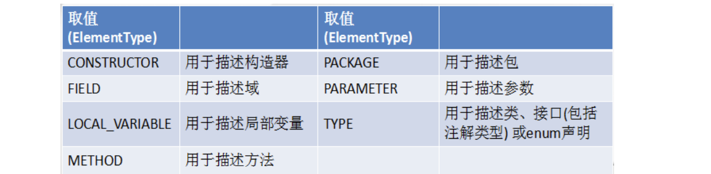

- @Documented: 用于指定被该元 Annotation 修饰的 Annotation 类将被javadoc 工具提取成文档。即表示所修饰的注解在被javadoc解析时，保留下来。默认情况下，javadoc是不包括注解的。
  - 定义为Documented的注解必须设置Retention值为RUNTIME。

- @Inherited: 被它修饰的 Annotation 将具有**继承性**。如果某个类使用了被@Inherited 修饰的 Annotation, 则其子类将自动具有该注解。
  - 比如：如果把标有@Inherited注解的自定义的注解标注在类级别上，子类则可以继承父类类级别的注解
  - 实际应用中，使用较少

> 元数据：`String name = "数据";`，此处的String描述了真实数据的类型，name定义了数据的标识，他们都是元数据。

### 10.2.5 利用反射获取注解信息

- JDK 5.0 在 java.lang.reflect 包下新增了 AnnotatedElement 接口, 该接口代表程序中可以接受注解的程序元素
- 当一个 Annotation 类型被定义为运行时 Annotation 后, 该注解才是运行时可见, 当 class 文件被载入时保存在 class 文件中的 Annotation 才会被虚拟机读取
- 程序可以调用 AnnotatedElement对象的如下方法来访问 Annotation 信息

### 10.2.6 JDK8中注解的新特性

Java 8对注解处理提供了两点改进：**可重复的注解**及**可用于类型的注解**。此外，反射也得到了加强，在Java8中能够得到方法参数的名称。这会简化标注在方法参数上的注解。

可重复注解：
- 在MyAnnotation上声明@Repeatable，成员值为MyAnnotations.class
- MyAnnotation的Target和Retention等元注解与MyAnnotations相同。

```java
//MyAnnotations.java
@Inherited
@Retention(RetentionPolicy.RUNTIME)
@Target({TYPE, FIELD, METHOD, PARAMETER, CONSTRUCTOR, LOCAL_VARIABLE})
public @interface MyAnnotations {
    MyAnnotation[] value();
}
//MyAnnotation.java
@Inherited
@Repeatable(MyAnnotations.class)
@Retention(RetentionPolicy.RUNTIME)
@Target({ TYPE, FIELD, METHOD, PARAMETER, CONSTRUCTOR, LOCAL_VARIABLE, TYPE_PARAMETER, TYPE_USE })
public @interface MyAnnotation {
    String value() default "hello";
}
// MyAnnotationTest.java
// jdk 8之前的写法：@MyAnnotations({@MyAnnotation(value="hi"),@MyAnnotation(value="abc")})
@MyAnnotation(value = "hi")
@MyAnnotation(value = "abc")
class MyAnnotationTest {}
```

类型注解：
- JDK1.8之后，关于元注解@Target的参数类型ElementType枚举值多了两个：TYPE_PARAMETER,TYPE_USE。
- 在Java 8之前，注解只能是在声明的地方所使用，Java8开始，注解可以应用在任何地方。
  - ElementType.TYPE_PARAMETER 表示该注解能写在类型变量的声明语句中（如：泛型声明）。`class Generic<@MyAnnotation T> {}`
  - ElementType.TYPE_USE 表示该注解能写在使用类型的任何语句中。`ArrayList<@MyAnnotation String> list = new ArrayList<>();int num = (@MyAnnotation int) 10L;`


# 第11章 Java集合

## 11-1 Java集合框架概述

- 一方面，面向对象语言对事物的体现都是以对象的形式，为了方便对多个对象的操作，就要对对象进行存储。另一方面，使用Array存储对象方面具有**一些弊端**，而Java集合就像一种容器，可以**动态地**把多个对象的引用放入容器中。
- 集合、数组都是对多个数据进行存储操作的结构，简称Java容器。说明：此时的存储，主要指的是内存层面的存储，不涉及到持久化的存储（.txt,.jpg,.avi，数据库中）
  - 数组在内存存储方面的特点：
    - 数组一旦初始化以后，长度就确定了。
    - 数组声明的类型，就决定了进行元素初始化时的类型，也就只能操作指定类型的数据了。
  - 数组在存储数据方面的弊端：
    - 数组一旦初始化以后，长度就不可修改，不便于扩展
    - 数组中提供的属性和方法有限，不便于进行添加、删除、插入等操作，且效率不高。对于获取实际存储元素的个数，数组没有现成的属性或方法可用，非常不便。
    - 数组存储的数据是有序的、可以重复的。对于无序、不可重复的需求，不能满足。----> 存储数据的特点单一
- Java 集合类可以用于存储数量不等的多个**对象**，还可用于保存具有映射关系的关联数组。

### 集合框架体系分类

- Collection接口：单列(数据)集合，定义了存取一组对象的方法的集合,用来存储一个一个的对象
  - List接口：存储有序的、可重复的数据。  -->"动态"数组
    - ArrayList、LinkedList、Vector
  - Set接口：存储无序的、不可重复的数据   -->"集合"
    - HashSet、LinkedHashSet、TreeSet
- Map接口：双列(数据)集合，保存具有映射关系(key - value)的集合   -->函数：y = f(x)
    - HashMap、LinkedHashMap、TreeMap、Hashtable、Properties

Collection接口继承树


Map接口继承树
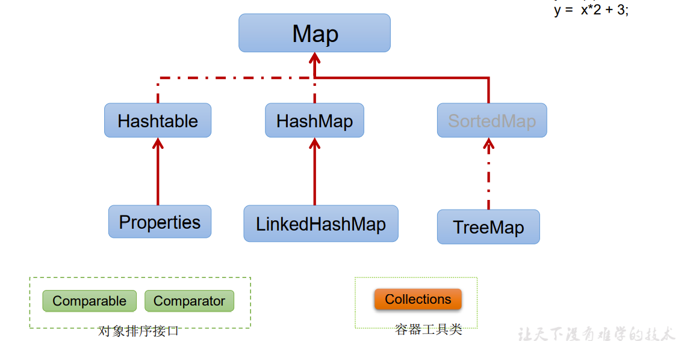

## 11-2 Collection接口方法

Collection 接口
- Collection 接口是 List、Set 和 Queue 接口的父接口，该接口里定义的方法既可用于操作 Set 集合，也可用于操作 List 和 Queue 集合。
- JDK不提供此接口的任何直接实现，而是提供更具体的子接口(如：Set和List)实现。
- 在 Java5 之前，Java 集合会丢失容器中所有对象的数据类型，把所有对象都当成 Object 类型处理；从 JDK 5.0 增加了**泛型**以后，Java 集合可以记住容器中对象的数据类型。

1. 添加
   - `boolean add​(E e)`：确保此集合包含指定的元素（添加元素）。向Collection接口的实现类的对象中添加数据obj时，要求obj所在类要重写equals()。
   - `boolean addAll​(Collection<? extends E> c)`：将指定集合中的所有元素添加到此集合中。
2. 清空集合
   - `void	clear()`：从此集合中删除所有元素。
3. 是否包含某个元素
   - `boolean contains​(Object o)`：如果此collection包含指定的元素，则返回 true 。（通过元素的equals方法来判断是否是同一个对象）
   - `boolean containsAll​(Collection<?> c)`：如果此集合包含指定集合中的所有元素，则返回 true 。（也是调用元素的equals方法来比较的。拿两个集合的元素挨个比较。）
4. 集合是否相等
   - `boolean equals​(Object o)`：将指定对象与此集合进行比较以获得相等性。判断时会调用obj对象所在类的equals()。
5. 获取集合对象的哈希值
    - `int hashCode()`：返回此集合的哈希码值。
6. 是否是空集合
   - `boolean isEmpty()`：如果此集合不包含任何元素，则返回 true 。
7. 遍历
    - `Iterator<E> iterator()`：返回此集合中元素的迭代器对象，用于集合遍历。
8. 删除
   - `boolean remove​(Object o)`：从此集合中移除指定元素的单个实例（如果存在）（通过元素的equals方法判断是否是要删除的那个元素。只会删除找到的第一个元素）
   - `boolean removeAll​(Collection<?> c)`：删除此集合的所有元素，这些元素也包含在指定的集合中（取当前集合的**差集**）。
9. 取两个集合的交集
   - `boolean retainAll​(Collection<?> c)`：仅保留此集合中包含在指定集合中的元素。（把**交集**的结果存在当前集合中，不影响c）。
10. 获取有效元素的个数
    - `int size()`：返回此集合中的元素数。
11. 转成对象数组
    - `Object[] toArray()`：集合 --->数组：返回包含此集合中所有元素的数组。
    - 数组 --->集合：调用Arrays类的静态方法`asList(Object ...objs)`此处的基本类型要用包装类。`Arrays.asList(new int[]{1,2,3,4,5,6});`含有一个一维数组。`Arrays.asList(new Integer[]{1,2,3,4,5,6});`含有六个整形。`Arrays.asList(1,2,3,4,5,6);`含有六个整形

## 11-3 Iterator迭代器接口

使用 Iterator 接口遍历集合元素
- Iterator对象称为迭代器(设计模式的一种)，主要用于遍历 Collection 集合中的元素。
- GOF给迭代器模式的定义为：提供一种方法访问一个容器(container)对象中各个元素，而又不需暴露该对象的内部细节。**迭代器模式，就是为容器而生。** 类似于“公交车上的售票员”、“火车上的乘务员”、“空姐”。
- Collection接口继承了java.lang.Iterable接口，该接口有一个iterator()方法，那么所有实现了Collection接口的集合类都有一个iterator()方法，用以返回一个实现了Iterator接口的对象。
- Iterator 仅用于遍历集合，Iterator **本身并不提供承装对象的能力**。如果需要创建Iterator 对象，则必须有一个被迭代的集合。
- 集合对象每次调用iterator()方法都得到一个全新的迭代器对象，默认游标都在集合的第一个元素之前。

在调用`it.next()`方法之前必须要调用`it.hasNext()`进行检测。若不调用，且下一条记录无效，直接调用`it.next()`会抛出NoSuchElementException异常。

```java
// 遍历容器元素：iterator()获取迭代器对象
Iterator iterator = coll.iterator();
// hasNext():判断是否还有下一个元素
while(iterator.hasNext()){
  //next():①指针下移 ②将下移以后集合位置上的元素返回
  System.out.println(iterator.next());
}
// 方式二：不推荐
for(int i = 0;i < coll.size();i++){
    System.out.println(iterator.next());
}
```

Iterator接口remove()方法
- Iterator可以删除集合的元素，但是是遍历过程中通过迭代器对象的remove方法，不是集合对象的remove方法。
- 如果还未调用next()或在上一次调用 next 方法之后已经调用了 remove 方法，再调用remove都会报IllegalStateException。

### 使用 foreach 循环遍历集合元素

- Java 5.0 提供了 foreach 循环迭代访问 Collection和数组。
- 格式：`for(集合/数组元素的类型 局部变量 : 集合/数组对象)`
- 遍历操作不需获取Collection或数组的长度，无需使用索引访问元素。
- 遍历集合的底层调用 **Iterator** 完成操作。
- foreach还可以用来遍历数组。

```java
// 笔试题：没有修改arr中的值
for(String s : arr){s = "GG";}
```

## 11-4 Collection子接口之一：List接口

List接口概述
- 鉴于Java中数组用来存储数据的局限性，我们通常使用List替代数组
- List集合类中 **元素有序、且可重复** ，集合中的每个元素都有其对应的顺序索引。
- List容器中的元素都对应一个整数型的序号记载其在容器中的位置，可以根据序号存取容器中的元素。
- JDK API中List接口的实现类常用的有：ArrayList、LinkedList和Vector。（List接口框架）
  - Collection接口：单列集合，用来存储一个一个的对象
    - List接口：存储有序的、可重复的数据。  -->“动态”数组,替换原有的数组
      - ArrayList：作为List接口的主要实现类；线程不安全的，效率高；底层使用Object[] elementData存储
      - LinkedList：对于频繁的插入、删除操作，使用此类效率比ArrayList高；底层使用双向链表存储
      - Vector：作为List接口的古老实现类；线程安全的，效率低；底层使用Object[] elementData存储

- List除了从Collection集合继承的方法外，List 集合里添加了一些根据索引来操作集合元素的方法。
  - `void add(int index, Object ele)`:在index位置插入ele元素
  - `boolean addAll(int index, Collection eles)`:从index位置开始将eles中的所有元素添加进来
  - `Object get(int index)`:获取指定index位置的元素
  - `int indexOf(Object obj)`:返回obj在集合中首次出现的位置
  - `int lastIndexOf(Object obj)`:返回obj在当前集合中末次出现的位置
  - `Object remove(int index)`:移除指定index位置的元素，并返回此元素（重载）
  - `Object set(int index, Object ele)`:设置指定index位置的元素为ele
  - `List subList(int fromIndex, int toIndex)`:返回从fromIndex到toIndex位置的子集合

```java
//遍历方式一：Iterator迭代器方式
Iterator iterator = list.iterator();
while(iterator.hasNext()){
  System.out.println(iterator.next());
}
//方式二：增强for循环
for(Object obj : list){
  System.out.println(obj);
}
//方式三：普通for循环
for(int i = 0;i < list.size();i++){
  System.out.println(list.get(i));
}
```

### List实现类之一：ArrayList

- ArrayList 是 List 接口的典型实现类、主要实现类
- 本质上，ArrayList是对象引用的一个"变长"数组
- ArrayList的JDK1.8之前与之后的实现区别？
  - JDK1.7：ArrayList像饿汉式，直接创建一个初始容量为10的数组
  - JDK1.8：ArrayList像懒汉式，一开始创建一个长度为0的数组，当添加第一个元素时再创建一个始容量为10的数组，并将数据添加到elementData\[0\]。延迟了数组的创建，节省内存。
  - 后续的添加和扩容操作没有差异：如果某次的添加导致底层elementData数组容量不够，则扩容。默认情况下，扩容为原来的容量的1.5倍，同时需要将原有数组中的数据复制到新的数组中。实际中建议使用带参构造器创建ArrayList对象：`ArrayList(int capacity)`
- Arrays.asList(...) 方法返回的 List 集合，既不是 ArrayList 实例，也不是Vector 实例。 Arrays.asList(...) 返回值是一个固定长度的 List 集合

### List实现类之二：LinkedList

- 对于频繁的插入或删除元素的操作，建议使用LinkedList类，效率较高
- 新增方法：
  - `void addFirst(Object obj)`
  - `void addLast(Object obj)`
  - `Object getFirst()`
  - `Object getLast()`
  - `Object removeFirst()`
  - `Object removeLast()`

LinkedList：双向链表，内部没有声明数组，而是定义了Node类型的first和last，默认值为null，用于记录首末元素。同时，定义内部类Node，作为LinkedList中保存数据的基本结构。Node除了保存数据，还定义了两个变量：
- prev变量记录前一个元素的位置
- next变量记录下一个元素的位置

```java
private static class Node<E> {
  E item;
  Node<E> next;
  Node<E> prev;
  Node(Node<E> prev, E element, Node<E> next) {
  this.item = element;
  this.next = next;
  this.prev = prev;
  }
}
```

### List 实现类之三：Vector

- Vector 是一个古老的集合，JDK1.0就有了。大多数操作与ArrayList相同，区别之处在于Vector是线程安全的。jdk7和jdk8中通过Vector()构造器创建对象时，底层都创建了长度为10的数组。
- 在各种list中，最好把ArrayList作为缺省选择。当插入、删除频繁时，使用LinkedList；Vector总是比ArrayList慢，所以尽量避免使用。即使后续的线程安全问题也不用Vector，而是用Collections的静态方法synchronizedXxx获得当前集合对象的线程安全版本。
- 新增方法：
  - `void addElement(Object obj)`
  - `void insertElementAt(Object obj,int index)`
  - `void setElementAt(Object obj,int index)`
  - `void removeElement(Object obj)`
  - `void removeAllElements()`

关于容器：增（add、append、插（insert））、删（remove、delete）、改（set、update）、查（get、find）、求长度、遍历

### 面试题：

请问ArrayList / LinkedList / Vector的异同？谈谈你的理解？ArrayList底层是什么？扩容机制？Vector和ArrayList的最大区别?
- 三个类都是实现了List接口，存储数据的特点相同：存储有序的、可重复的数据
- ArrayList和LinkedList的异同
  - 二者都线程不安全，相对线程安全的Vector，执行效率高。
  - 此外，ArrayList是实现了基于动态数组的数据结构，LinkedList基于链表的数据结构。对于随机访问get和set，ArrayList觉得优于LinkedList，因为LinkedList要移动指针。对于新增和删除操作add(特指插入)和remove，LinkedList比较占优势，因为ArrayList要移动数据。
- ArrayList和Vector的区别
  - Vector和ArrayList几乎是完全相同的,唯一的区别在于Vector是同步类(synchronized)，属于强同步类。因此开销就比ArrayList要大，访问要慢。正常情况下,大多数的Java程序员使用ArrayList而不是Vector,因为同步完全可以由程序员自己来控制。**Vector每次扩容请求其大小的2倍空间，而ArrayList是1.5倍** 。Vector还有一个子类Stack。

```java
public class ListExer {
/* 区分List中remove(int index)和remove(Object obj) */
  @Test
  public void testListRemove() {
    List list = new ArrayList();
    list.add(1);list.add(2);list.add(3);
    updateList(list);
  }
  private void updateList(List list) {
    list.remove(2);//List::remove(int index)
    list.remove(new Integer(2));//Collections::remove(Object obj)
  }
}
```

## 11-5 Collection子接口之二：Set接口

Set 接口概述
- Set接口是Collection的子接口，set接口没有提供额外的方法
- Set 集合不允许包含相同的元素，如果试把两个相同的元素加入同一个Set 集合中，则添加操作失败。
- Set 判断两个对象是否相同不是使用 == 运算符，而是根据 equals() 方法
- Set接口的框架
  - Collection接口：单列集合，用来存储一个一个的对象
    - Set接口：存储无序的、不可重复的数据   -->"集合"
     - HashSet：作为Set接口的主要实现类；线程不安全的；可以存储null值，对应HashMap
       - LinkedHashSet：作为HashSet的子类；遍历其内部数据时，可以按照添加的顺序遍历对于频繁的遍历操作，LinkedHashSet效率高于HashSet，对应LinkedHashMap。
     - TreeSet：可以按照添加对象的指定属性，进行排序，对应TreeMap。

### Set实现类之一：HashSet

- HashSet 是 Set 接口的典型实现，大多数时候使用 Set 集合时都使用这个实现类。（底层是HashMap）
- Set接口中没有额外定义新的方法，使用的都是Collection中声明过的方法。
- HashSet 按 Hash 算法来存储集合中的元素，因此具有很好的存取、查找、删除性能。
- HashSet 具有以下特点：
  - 不能保证元素的排列顺序
  - HashSet 不是线程安全的
  - 集合元素可以是 **null**
- HashSet 集合判断两个元素相等的标准：两个对象通过 hashCode() 方法比较相等，并且两个对象的 equals() 方法返回值也相等。
- 对于存放在Set(主要指：HashSet、LinkedHashSet)容器中的对象，对应的类一定要重写equals()和hashCode(Object obj)方法，以实现对象相等规则。即：“相等的对象必须具有相等的散列码”。

- 向HashSet中添加元素的过程：
  - 当向 HashSet 集合中存入一个元素时，HashSet 会调用该对象的 hashCode() 方法来得到该对象的 hashCode 值，然后根据 hashCode 值，通过某种散列函数决定该对象在 HashSet 底层数组中的存储位置。（这个散列函数会与底层数组的长度相计算得到在数组中的下标，并且这种散列函数计算还尽可能保证能均匀存储元素，越是散列分布，该散列函数设计的越好）
  - 如果两个元素的hashCode()值相等，会再继续调用equals方法，如果equals方法结果为true，添加失败；如果为false，那么会保存该元素，但是该数组的位置已经有元素了，那么会通过**链表的方式**继续链接。
  - 如果两个元素的 equals() 方法返回 true，但它们的 hashCode() 返回值不相等，hashSet 将会把它们存储在不同的位置，但依然可以添加成功。

> 底层也是数组，初始容量为16，当如果使用率超过0.75，（16*0.75=12）就会扩大容量为原来的2倍。（16扩容为32，依次为64,128....等）

重写 hashCode() 方法的基本原则
- 在程序运行时，同一个对象多次调用 hashCode() 方法应该返回相同的值。
- 当两个对象的 equals() 方法比较返回 true 时，这两个对象的 hashCode() 方法的返回值也应相等。（一致性：相等的对象必须具有相等的散列码）
- 对象中用作 equals() 方法比较的 Field，都应该用来计算 hashCode 值。

以自定义的Customer类为例，何时需要重写equals()？
- 当一个类有自己特有的“逻辑相等”概念,当改写equals()的时候，总是要改写hashCode()，根据一个类的equals方法（改写后），两个截然不同的实例有可能在逻辑上是相等的，但是，根据Object.hashCode()方法，它们仅仅是两个对象。
- 因此，违反了“相等的对象必须具有相等的散列码”。
- 结论：复写equals方法的时候一般都需要同时复写hashCode方法。通常参与计算hashCode的对象的属性也应该参与到equals()中进行计算。

Eclipse/IDEA工具里hashCode()的重写
> 以Eclipse/IDEA为例，在自定义类中可以调用工具自动重写equals和hashCode。问题：为什么用Eclipse/IDEA复写hashCode方法，有**31**这个数字？

- 选择系数的时候要选择尽量大的系数。因为如果计算出来的hash地址越大，所谓的“冲突”就越少，查找起来效率也会提高。（减少冲突）
- 并且31只占用5bits,相乘造成数据溢出的概率较小。
- 31可以 由`i*31 == (i<<5)-1`来表示,现在很多虚拟机里面都有做相关优化。（提高算法效率）
- 31是一个素数，素数作用就是如果我用一个数字来乘以这个素数，那么最终出来的结果只能被素数本身和被乘数还有1来整除！(减少冲突)

小结：
1. Set：存储无序的、不可重复的数据以HashSet为例说明：
   1. 无序性：不等于随机性。存储的数据在底层数组中并非按照数组索引的顺序添加，而是根据数据的哈希值决定的。
   2. 不可重复性：保证添加的元素按照equals()判断时，不能返回true.即：相同的元素只能添加一个。
2. 添加元素的过程：以HashSet为例：
   1. 我们向HashSet中添加元素a,首先调用元素a所在类的hashCode()方法，计算元素a的哈希值，
   2. 此哈希值接着通过某种算法计算出在HashSet底层数组中的存放位置（即为：索引位置，索引位置相同hash值不一定相同），判断数组此位置上是否已经有元素：
      1. 如果此位置上没有其他元素，则元素a添加成功。（1）
      2. 如果此位置上有其他元素b(或以链表形式存在的多个元素），则比较元素a与元素b的hash值：
         1. 如果hash值不相同，则元素a添加成功。（2）
         2. 如果hash值相同，进而需要调用元素a所在类的equals()方法：
            1. equals()返回true,元素a添加失败
            2. equals()返回false,则元素a添加成功（3）
   3. 对于添加成功的情况2和情况3而言：元素a 与已经存在指定索引位置上数据以链表的方式存储。
      1. jdk 7 :元素a放到数组中，指向原来的元素。（头插）
      2. jdk 8 :原来的元素在数组中，指向元素a。（尾插）
      3. 总结：七上八下
3. HashSet底层：数组 \+ 链表的结构。(jdk7)

### Set实现类之二：LinkedHashSet

- LinkedHashSet 是 HashSet 的子类
- LinkedHashSet 根据元素的 hashCode 值来决定元素的存储位置，但它同时使用双向链表维护元素的次序，这使得元素看起来是以插入顺序保存的。
- LinkedHashSet作为HashSet的子类，在添加数据的同时，每个数据还维护了两个引用，记录此数据前一个数据和后一个数据。
- LinkedHashSet插入性能略低于 HashSet，但在迭代访问 Set 里的全部元素时有很好的性能。对于频繁的遍历操作，LinkedHashSet效率高于HashSet。
- LinkedHashSet 不允许集合元素重复。

### Set实现类之三：TreeSet

- TreeSet 是 SortedSet 接口的实现类，TreeSet 可以确保集合元素处于排序状态。
- TreeSet底层使用红黑树结构存储数据
- 新增的方法如下： (了解)
  - `Comparator comparator()`
  - `Object first()`
  - `Object last()`
  - `Object lower(Object e)`
  - `Object higher(Object e)`
  - `SortedSet subSet(fromElement, toElement)`
  - `SortedSet headSet(toElement)`
  - `SortedSet tailSet(fromElement)`
- TreeSet 两种排序方法：自然排序和定制排序。默认情况下，TreeSet 采用自然排序。
- TreeSet和后面要讲的TreeMap采用红黑树的存储结构
  - 特点：有序，查询速度比List快
  - 不在使用equals()判同，而是compareTo或compare返回0。

---

1. 向TreeSet中添加的数据，要求是相同类的对象，不能添加不同类的对象。
2. 两种排序方式：自然排序（实现Comparable接口） 和 定制排序（Comparator）
3. 自然排序中，比较两个对象是否相同的标准为：compareTo()返回0.不再是equals().
4. 定制排序中，比较两个对象是否相同的标准为：compare()返回0.不再是equals().
   1. 构造器：`TreeSet(Comparator<? super E> comparator)`

### 排序 —— 自然排序

- 自然排序：TreeSet 会调用集合元素的 compareTo(Object obj) 方法来比较元素之间的大小关系，然后将集合元素按升序(默认情况)排列
- 如果试图把一个对象添加到 TreeSet 时，则该对象的类必须实现 Comparable 接口。
  - 实现 Comparable 的类必须实现 compareTo(Object obj) 方法，两个对象即通过compareTo(Object obj) 方法的返回值来比较大小。
-  Comparable 的典型实现：
  - BigDecimal、BigInteger 以及所有的数值型对应的包装类：按它们对应的数值大小进行比较
  - Character：按字符的 unicode值来进行比较
  - Boolean：true 对应的包装类实例大于 false 对应的包装类实例
  - String：按字符串中字符的 unicode 值进行比较
  - Date、Time：后边的时间、日期比前面的时间、日期大
- 向 TreeSet 中添加元素时，只有第一个元素无须比较compareTo()方法，后面添加的所有元素都会调用compareTo()方法进行比较。
- 因为只有相同类的两个实例才会比较大小，所以向 TreeSet 中添加的应该是同一个类的对象。
- 对于 TreeSet 集合而言，它判断两个对象是否相等的唯一标准是：两个对象通过 compareTo(Object obj) 方法比较返回值。
- 当需要把一个对象放入 TreeSet 中，重写该对象对应的 equals() 方法时，应保证该方法与 compareTo(Object obj) 方法有一致的结果：如果两个对象通过equals() 方法比较返回 true，则通过 compareTo(Object obj) 方法比较应返回 0。否则，让人难以理解。

### 排序 —— 定制排序

- TreeSet的自然排序要求元素所属的类实现Comparable接口，如果元素所属的类没有实现Comparable接口，或不希望按照升序(默认情况)的方式排列元素或希望按照其它属性大小进行排序，则考虑使用定制排序。定制排序，通过Comparator接口来实现。需要重写compare(T o1,T o2)方法。
- 利用int compare(T o1,T o2)方法，比较o1和o2的大小：如果方法返回正整数，则表示o1大于o2；如果返回0，表示相等；返回负整数，表示o1小于o2。
- 要实现定制排序，需要将实现Comparator接口的实例作为形参传递给TreeSet的构造器。
- 此时，仍然只能向TreeSet中添加类型相同的对象。否则发生ClassCastException异常。
- 使用定制排序判断两个元素相等的标准是：通过Comparator比较两个元素返回了0

```java
//练习：在List内去除重复数字值，要求尽量简单
public static List duplicateList(List list) {
    HashSet set = new HashSet();
    set.addAll(list);
    return new ArrayList(set);
}
// ？
class Person {//已重写equals和hashCode
  int id;  String name;
  public Person(int id, String name) {
      this.id = id;
      this.name = name;
  }
}
public void test(){
    HashSet set = new HashSet();
    Person p1 = new Person(1001,"AA");
    Person p2 = new Person(1002,"BB");
    set.add(p1);set.add(p2); // 添加(1001AA)1001AA、(1002BB)1002BB
    p1.name = "CC"; // 修改(1001AA)1001CC
    set.remove(p1); // 删除(1001CC)null
    set.add(new Person(1001,"CC")); //添加:(1001CC)1001CC
    set.add(new Person(1001,"AA")); //添加:(1001AA-1)1001AA
}
```

## 11-6 Map接口

Map接口的实现类的结构
- Map:双列数据，存储key-value对的数据   ---类似于高中的函数：y = f(x)
  - HashMap:作为Map的主要实现类；线程不安全的，效率高；存储null的key和value
    - LinkedHashMap:保证在遍历map元素时，可以按照添加的顺序实现遍历。原因：在原有的HashMap底层结构基础上，添加了一对指针，指向前一个和后一个元素。对于频繁的遍历操作，此类执行效率高于HashMap。
  - SortedMap
    - TreeMap:保证按照添加的key-value对进行排序，实现排序遍历。此时考虑key的自然排序或定制排序，底层使用红黑树。
  - Hashtable:作为古老的实现类；线程安全的，效率低；不能存储null的key和value
    - Properties:常用来处理配置文件。key和value都是String类型

### Map接口概述

- Map与Collection并列存在。用于保存具有**映射关系**的数据:key \- value
- Map 中的 key 和 value 都可以是任何引用类型的数据
- Map 中的 **key** 用**Set**来存放，**不允许重复**，即同一个 Map 对象所对应的类，须重写hashCode()和equals()方法
- 常用String类作为Map的"键"
- key 和 value 之间存在单向一对一关系，即通过指定的 key 总能找到唯一的、确定的 value
- Map接口的常用实现类：HashMap、TreeMap、LinkedHashMap和Properties。其中，HashMap是 Map 接口使用频率最高的实现类
- HashMap的底层：数组 \+ 链表（jdk7及之前）；数组 \+ 链表 \+ 红黑树 （jdk 8）。

Map结构的理解
- Map中的key:无序的、不可重复的，使用Set存储所有的key  ---> key所在的类要重写equals()和hashCode() （以HashMap为例）
- Map中的value:无序的、可重复的，使用Collection存储所有的value --->value所在的类要重写equals()
  - 一个键值对：key \- value构成了一个Entry对象。
- Map中的entry:无序的、不可重复的，使用Set存储所有的entry

###  Map接口：常用方法

- 添加、删除、修改操作：
  - `Object put(Object key,Object value)`：将指定key-value添加到(或修改)当前map对象中
  - `void putAll(Map m)`:将m中的所有key-value对存放到当前map中
  - `Object remove(Object key)`：移除指定key的key-value对，并返回value
  - `void clear()`：清空当前map中的所有数据
- 元素查询的操作：
  - `Object get(Object key)`：获取指定key对应的value
  - `boolean containsKey(Object key)`：是否包含指定的key
  - `boolean containsValue(Object value)`：是否包含指定的value
  - `int size()`：返回map中key-value对的个数
  - `boolean isEmpty()`：判断当前map是否为空
  - `boolean equals(Object obj)`：判断当前map和参数对象obj是否相等
- 元视图操作的方法：
  - `Set keySet()`：返回所有key构成的Set集合
  - `Collection values()`：返回所有value构成的Collection集合
  - `Set entrySet()`：返回所有key-value对构成的Set集合

总结：常用方法：
- 添加：put(Object key,Object value)
- 删除：remove(Object key)
- 修改：put(Object key,Object value)
- 查询：get(Object key)
- 长度：size()
- 遍历：keySet() / values() / entrySet()

```java
// Map的遍历：
// 遍历所有的key集：keySet()
Set set = map.keySet();
Iterator iterator = set.iterator();
while (iterator.hasNext()) {
    iterator.next();
}
// 遍历所有的value集：values()
Collection values = map.values();
for (Object obj : values) {
}
// 遍历所有的key-value
// 方式一：entrySet()
Set entrySet = map.entrySet();
Iterator iterator1 = entrySet.iterator();
while (iterator1.hasNext()) {
    Object obj = iterator1.next();
    Map.Entry entry = (Map.Entry) obj;// entrySet集合中的元素都是entry
    entry.getKey();entry.getValue();
}
// 方式二：
Set keySet = map.keySet();
Iterator iterator2 = keySet.iterator();
while (iterator2.hasNext()) {
    Object key = iterator2.next();
    Object value = map.get(key);
}
```

### Map实现类之一：HashMap

- HashMap是 Map 接口**使用频率最高**的实现类。
- 允许使用null键和null值，与HashSet一样，不保证映射的顺序。
- 所有的key构成的集合是Set:无序的、不可重复的。所以，key所在的类要重写：equals()和hashCode()
- 所有的value构成的集合是Collection:无序的、可以重复的。所以，value所在的类要重写：equals()
- 一个key-value构成一个entry
- 所有的entry构成的集合是Set:无序的、不可重复的
- HashMap 判断两个 key 相等的标准是：两个 key 通过 equals() 方法返回 true，hashCode 值也相等。
- HashMap 判断两个 value相等的标准是：两个 value 通过 equals() 方法返回 true。

HashMap的存储结构
- JDK 7及以前版本：HashMap是数组 \+ 链表结构(即为链地址法)
- JDK 8版本发布以后：HashMap是数组 \+ 链表 \+ 红黑树实现。

HashMap源码中的重要常量
- DEFAULT_INITIAL_CAPACITY : HashMap的默认容量，16
- MAXIMUM_CAPACITY ： HashMap的最大支持容量，2^30
- DEFAULT_LOAD_FACTOR：HashMap的默认加载因子
- TREEIFY_THRESHOLD：Bucket中链表长度大于该默认值，转化为红黑树
- UNTREEIFY_THRESHOLD：Bucket中红黑树存储的Node小于该默认值，转化为链表
- MIN_TREEIFY_CAPACITY：桶中的Node被树化时最小的hash表容量。（当桶中Node的数量大到需要变红黑树时，若hash表容量小于MIN_TREEIFY_CAPACITY时，此时应执行resize扩容操作这个MIN_TREEIFY_CAPACITY的值至少是TREEIFY_THRESHOLD的4倍。）
- table：存储元素的数组，总是2的n次幂
- entrySet：存储具体元素的集
- size：HashMap中存储的键值对的数量
- modCount：HashMap扩容和结构改变的次数。
- threshold：扩容的临界值，\= 容量 \* 填充因子
- loadFactor：填充因子

### HashMap的存储结构：JDK 1.8之前

- HashMap的内部存储结构其实是**数组和链表的结合**。当实例化一个HashMap时，系统会创建一个长度为Capacity的Entry数组，这个长度在哈希表中被称为容量(Capacity)，在这个数组中可以存放元素的位置我们称之为“桶”(bucket)，每个bucket都有自己的索引，系统可以根据索引快速的查找bucket中的元素。
- 每个bucket中存储一个元素，即一个Entry对象，但每一个Entry对象可以带一个引用变量，用于指向下一个元素，因此，在一个桶中，就有可能生成一个Entry链。而且新添加的元素作为链表的head。
- 添加元素的过程：
    > 向HashMap中添加entry1(key，value)，需要首先计算entry1中key的哈希值(根据key所在类的hashCode()计算得到)，此哈希值经过处理以后，得到在底层Entry\[\]数组中要存储的位置i。如果位置i上没有元素，则entry1直接添加成功。如果位置i上已经存在entry2(或还有链表存在的entry3，entry4)，则需要通过循环的方法，依次比较entry1中key和其他的entry。如果彼此hash值不同，则直接添加成功。如果hash值不同，继续比较二者是否equals。如果返回值为true，则使用entry1的value去替换equals为true的entry的value。如果遍历一遍以后，发现所有的equals返回都为false,则entry1仍可添加成功。entry1指向原有的entry元素。

HashMap的扩容

当HashMap中的元素越来越多的时候，hash冲突的几率也就越来越高，因为数组的长度是固定的。所以为了提高查询的效率，就要对HashMap的数组进行扩容，而在HashMap数组扩容之后，最消耗性能的点就出现了：原数组中的数据必须重新计算其在新数组中的位置，并放进去，这就是resize。

那么HashMap什么时候进行扩容呢？

当HashMap中的元素个数超过数组大小(数组总大小length,不是数组中个数size)\*loadFactor 时,就会进行数组扩容，loadFactor 的默认值(DEFAULT_LOAD_FACTOR)为0.75，这是一个折中的取值。也就是说，默认情况下，数组大小(DEFAULT_INITIAL_CAPACITY)为16，那么当HashMap中元素个数超过16\*0.75=12（这个值就是代码中的threshold值，也叫做临界值）的时候，就把数组的大小扩展为 2\*16=32，即扩大一倍，然后重新计算每个元素在数组中的位置，而这是一个非常消耗性能的操作，所以如果我们已经预知HashMap中元素的个数，那么预设元素的个数能够有效的提高HashMap的性能。

### HashMap的存储结构：JDK 1.8

- HashMap的内部存储结构其实是数组 \+ 链表 \+ 树的结合。当实例化一个HashMap时，会初始化initialCapacity和loadFactor，在put第一对映射关系时，系统会创建一个长度为initialCapacity的Node数组，这个长度在哈希表中被称为容量(Capacity)，在这个数组中可以存放元素的位置我们称之为“桶”(bucket)，每个bucket都有自己的索引，系统可以根据索引快速的查找bucket中的元素。
- 每个bucket中存储一个元素，即一个Node对象，但每一个Node对象可以带一个引用变量next，用于指向下一个元素，因此，在一个桶中，就有可能生成一个Node链。也可能是一个一个TreeNode对象，每一个TreeNode对象可以有两个叶子结点left和right，因此，在一个桶中，就有可能生成一个TreeNode树。而新添加的元素作为链表的last，或树的叶子结点。

那么HashMap什么时候进行扩容和树形化呢？

当HashMap中的元素个数超过数组大小(数组总大小length,不是数组中个数size)\*loadFactor 时 ,就会进行数组扩容 ，loadFactor 的默认 值(DEFAULT_LOAD_FACTOR)为0.75，这是一个折中的取值。也就是说，默认情况下，数组大小(DEFAULT_INITIAL_CAPACITY)为16，那么当HashMap中元素个数超过16\*0.75=12（这个值就是代码中的threshold值，也叫做临界值）的时候，就把数组的大小扩展为 2\*16=32，即扩大一倍，然后重新计算每个元素在数组中的位置，而这是一个非常消耗性能的操作，所以如果我们已经预知HashMap中元素的个数，那么预设元素的个数能够有效的提高HashMap的性能。

当HashMap中的其中一个链的对象个数如果达到了8个，此时如果capacity没有达到64，那么HashMap会先扩容解决，如果已经达到了64，那么这个链会变成树，结点类型由Node变成TreeNode类型。当然，如果当映射关系被移除后，下次resize方法时判断树的结点个数低于6个，也会把树再转为链表。

关于映射关系的key是否可以修改？answer：不要修改

映射关系存储到HashMap中会存储key的hash值，这样就不用在每次查找时重新计算每一个Entry或Node（TreeNode）的hash值了，因此如果已经put到Map中的映射关系，再修改key的属性，而这个属性又参与hashcode值的计算，那么会导致匹配不上。

总结：JDK1.8相较于之前的变化：
1. HashMap map = new HashMap();//默认情况下，先不创建长度为16的数组
2. 当首次调用map.put()时，再创建长度为16的数组
3. 数组为Node类型，在jdk7中称为Entry类型
4. 形成链表结构时，新添加的key-value对在链表的尾部（七上八下）
5. 当数组指定索引位置的链表长度>8时，且map中的数组的长度> 64时，此索引位置上的所有key-value对使用红黑树进行存储。

简明版：HashMap的底层实现原理(jdk7)
- `HashMap map = new HashMap()`：在实例化以后，底层创建了长度是16的一维数组Entry\[\] table。
- ...可能已经执行过多次put...`map.put(key1,value1)`：
  - 首先，调用key1所在类的hashCode()计算key1哈希值，此哈希值经过某种算法计算以后，得到在Entry数组中的存放位置。
    - 如果此位置上的数据为空，此时的key1-value1添加成功。 ----情况1
    - 如果此位置上的数据不为空，(意味着此位置上存在一个或多个数据(以链表形式存在)),比较key1和已经存在的一个或多个数据的哈希值：
      - 如果key1的哈希值与已经存在的数据的哈希值都不相同，此时key1-value1添加成功。----情况2
      - 如果key1的哈希值和已经存在的某一个数据(key2 \- value2)的哈希值相同，继续比较：调用key1所在类的equals(key2)方法，比较：
        - 如果equals()返回false:此时key1 \- value1添加成功。----情况3
        - 如果equals()返回true:使用value1替换value2。
      - 补充：关于情况2和情况3：此时key1 \- value1和原来的数据以链表的方式存储。
      - 在不断的添加过程中，会涉及到扩容问题，当超出临界值(且要存放的位置非空)时，扩容。默认的扩容方式：扩容为原来容量的2倍，并将原有的数据复制过来。
- jdk8 相较于jdk7在底层实现方面的不同：
  1. new HashMap()：底层没有创建一个长度为16的数组
  2. jdk 8底层的数组是：Node\[\],而非Entry\[\]
  3. 首次调用put()方法时，底层创建长度为16的数组
  4. jdk7底层结构只有：数组 \+ 链表。jdk8中底层结构：数组 \+ 链表 \+ 红黑树。
     1. 形成链表时，七上八下（jdk7:新的元素指向旧的元素。jdk8：旧的元素指向新的元素）
     2. 当数组的某一个索引位置上的元素以链表形式存在的数据个数 \> 8 且当前数组的长度 \> 64时，此时此索引位置上的所数据改为使用红黑树存储。

### 面试题：负载因子值的大小，对HashMap有什么影响

- 负载因子的大小决定了HashMap的数据密度。
- 负载因子越大密度越大，发生碰撞的几率越高，数组中的链表越容易长,造成查询或插入时的比较次数增多，性能会下降。
- 负载因子越小，就越容易触发扩容，数据密度也越小，意味着发生碰撞的几率越小，数组中的链表也就越短，查询和插入时比较的次数也越小，性能会更高。但是会浪费一定的内容空间。而且经常扩容也会影响性能，建议初始化预设大一点的空间。
- 按照其他语言的参考及研究经验，会考虑将负载因子设置为0.7~0.75，此时平均检索长度接近于常数。

### Map实现类之二：LinkedHashMap

- LinkedHashMap 是 HashMap 的子类
- 在HashMap存储结构的基础上，使用了一对双向链表来记录添加元素的顺序
- 与LinkedHashSet类似，LinkedHashMap 可以维护 Map 的迭代顺序：迭代顺序与 Key-Value 对的插入顺序一致

HashMap中的内部类：Node

```java
static class Node<K,V> implements Map.Entry<K,V> {
    final int hash;
    final K key;
    V value;
    Node<K,V> next;
}
```

LinkedHashMap中的内部类：Entry

```java
static class Entry<K,V> extends HashMap.Node<K,V> {
    Entry<K,V> before, after;//能够记录添加的元素的先后顺序
    Entry(int hash, K key, V value, Node<K,V> next) {
        super(hash, key, value, next);
    }
}
```

### Map实现类之三：TreeMap

- TreeMap存储 Key-Value 对时，需要根据 key-value 对进行排序。TreeMap 可以保证所有的 Key-Value 对处于**有序**状态，因为要按照key进行排序，要求key必须是由同一个类创建的对象。
- TreeSet底层使用**红黑树**结构存储数据
- TreeMap 的 Key 的排序：
  - **自然排序**：TreeMap 的所有的 Key 必须实现 Comparable 接口，而且所有的 Key 应该是同一个类的对象，否则将会抛出 ClasssCastException
  - **定制排序**：创建 TreeMap 时，调用带参构造器传入一个 Comparator 对象，该对象负责对TreeMap 中的所有 key 进行排序。此时不需要 Map 的 Key 实现Comparable 接口
-  TreeMap判断**两个key相等的标准**：两个key通过compareTo()方法或者compare()方法返回0。

### Map实现类之四：Hashtable

- Hashtable是个古老的 Map 实现类，JDK1.0就提供了。不同于HashMap，Hashtable是线程安全的。
- Hashtable实现原理和HashMap相同，功能相同。底层都使用哈希表结构，查询速度快，很多情况下可以互用。
- 与HashMap不同，Hashtable 不允许使用 null 作为 key 和 value
- 与HashMap一样，Hashtable 也不能保证其中 Key-Value 对的顺序
- Hashtable判断两个key相等、两个value相等的标准，与HashMap一致。

### Map实现类之五：Properties

- Properties 类是 Hashtable 的子类，该对象用于处理属性文件
- 由于属性文件里的 key、value 都是字符串类型，所以 **Properties 里的 key 和 value 都是字符串类型**
- `load​(InputStream inStream)`：从输入字节流中读取属性列表（键和元素对）。
- 存取数据时，建议使用setProperty(String key,String value)方法和getProperty(String key)方法

## 11-7 Collections工具类

> 操作数组的工具类：Arrays

- Collections 是一个操作 Set、List 和 Map 等集合的工具类
- Collections 中提供了一系列静态的方法对集合元素进行排序、查询和修改等操作，还提供了对集合对象设置不可变、对集合对象实现同步控制等方法
- 排序操作：（均为static方法）
  - `reverse(List)`：反转 List 中元素的顺序
  - `shuffle(List)`：对 List 集合元素进行随机排序
  - `sort(List)`：根据元素的自然顺序对指定 List 集合元素按升序排序
  - `sort(List, Comparator)`：根据指定的 Comparator 产生的顺序对 List 集合元素进行排序
  - `swap(List list, int i, int j)`：将指定 list 集合中的 i 处元素和 j 处元素进行交换

### Collections常用方法

查找、替换
- `Object max(Collection)`：根据元素的自然顺序，返回给定集合中的最大元素
- `Object max(Collection，Comparator)`：根据 Comparator 指定的顺序，返回给定集合中的最大元素
- `Object min(Collection)`
- `Object min(Collection, Comparator)`
- `int frequency(Collection, Object)`：返回指定集合中指定元素的出现次数
- `void copy(List dest, List src)`：将src中的内容复制到dest中
- `boolean replaceAll(List list, Object oldVal, Object newVal)`：使用新值替换List 对象的所有旧值

```java
// 关于copy：报异常：IndexOutOfBoundsException("Source does not fit in dest")
List dest = new ArrayList();
Collections.copy(dest, list);
// 正确的：
List dest = Arrays.asList(new Object[list.size()]);
Collections.copy(dest, list);
```

Collections常用方法：同步控制
- Collections 类中提供了多个 synchronizedXxx() 方法，该方法可使将指定集合包装成线程同步的集合，从而可以解决多线程并发访问集合时的线程安全问题`Collections.synchronizedList(list);`返回值即为线程安全的List

补充：Enumeration
- Enumeration 接口是 Iterator 迭代器的 “古老版本”

## 面试题

1. ArrayList,Vector, LinkedList的存储性能和特性
   1. ArrayList和Vector都是使用数组方式存储数据，此数组元素数大于实际存储的数据以便增加和插入元素，它们都允许直接按序号索引元素，但是插入元素要涉及数组元素移动等内存操作，所以索引数据快而插入数据慢，Vector由于使用了synchronized方法（线程安全），通常性能上较ArrayList差，而LinkedList使用双向链表实现存储，按序号索引数据需要进行前向或后向遍历，但是插入数据时只需要记录本项的前后项即可，所以插入速度较快。
2. HashMap和Hashtable的区别
   1. HashMap与Hashtable都实现了Map接口。由于HashMap的非线程安全性，效率上可能高于Hashtable。Hashtable的方法是Synchronize的，而HashMap不是，在多个线程访问Hashtable时，不需要自己为它的方法实现同步，而HashMap 就必须为之提供外同步。
   2. HashMap允许将null作为一个entry的key或者value，而Hashtable不允许。
   3. HashMap把Hashtable的contains方法去掉了，改成containsvalue和containsKey。因为contains方法容易让人引起误解。 
   4. Hashtable继承自Dictionary类，而HashMap是Java1.2引进的Map interface的一个实现。
   5. Hashtable和HashMap采用的hash/rehash算法都大概一样，所以性能不会有很大的差异。
3. ArrayList和Vector的区别
   1. 同步性:Vector是线程安全的，也就是说是同步的，而ArrayList是线程序不安全的，不是同步的
   2. 数据增长:当需要增长时,Vector默认增长为原来一培，而ArrayList却是原来的一半
4. 集合类
   1. 最常用的集合类是 List 和 Map。 List 的具体实现包括 ArrayList 和 Vector，它们是可变大小的列表，比较适合构建、存储和操作任何类型对象的元素列表。 List 适用于按数值索引访问元素的情形。 
   2. Map 提供了一个更通用的元素存储方法。 Map 集合类用于存储元素对（称作"键"和"值"），其中每个键映射到一个值。


# 第12章 泛型

## 12-1 为什么要有泛型

- 泛型：标签
- 举例：
  - 中药店，每个抽屉外面贴着标签
  - 超市购物架上很多瓶子，每个瓶子装的是什么，有标签
- 泛型的设计背景

> 集合容器类在设计阶段/声明阶段不能确定这个容器到底实际存的是什么类型的对象，所以在JDK1.5之前只能把元素类型设计为Object，JDK1.5之后使用泛型来解决（jdk 5.0新增的特性）。因为这个时候除了元素的类型不确定，其他的部分是确定的，例如关于这个元素如何保存，如何管理等是确定的，因此此时把元素的类型设计成一个参数，这个类型参数叫做泛型。Collection\<E\>，List\<E\>，ArrayList\<E\> 这个\<E\>就是类型参数，即泛型。

### 泛型的概念

- 所谓泛型，就是允许在定义类、接口时通过一个标识表示类中某个属性的类型或者是某个方法的返回值及参数类型。这个类型参数将在使用时（例如，继承或实现这个接口，用这个类型声明变量、创建对象时）确定（即传入实际的类型参数，也称为类型实参）。
- 从JDK1.5以后，Java引入了“**参数化类型**（Parameterized type）”的概念，允许我们在创建集合时再指定集合元素的类型，正如：List\<String\>，这表明该List只能保存字符串类型的对象。
- JDK1.5改写了集合框架中的全部接口和类，为这些接口、类增加了泛型支持，从而可以在声明集合变量、创建集合对象时传入类型实参。

泛型相对于Object的优势
1. 解决元素存储的安全性问题，好比商品、药品标签，不会弄错。
2. 解决获取数据元素时，需要类型强制转换的问题，好比不用每回拿商品、药品都要辨别。

在集合中没有泛型时：类型不安全，强转时，可能出现ClassCastException


在集合中有泛型时：编译时，就会进行类型检查，保证数据的安全


Java泛型可以保证如果程序在编译时没有发出警告，运行时就不会产生ClassCastException异常。同时，代码更加简洁、健壮。

## 12-2 在集合中使用泛型

1. 集合接口或集合类在jdk5.0时都修改为带泛型的结构。
2. 在实例化集合类时，可以指明具体的泛型类型
3. 指明完以后，在集合类或接口中凡是定义类或接口时，内部结构（比如：方法、构造器、属性等）使用到类的泛型的位置，都指定为实例化的泛型类型。比如：add(E e)  --->实例化以后：add(Integer e)
4. 注意点：泛型的类型必须是类，不能是基本数据类型。需要用到基本数据类型的位置，拿包装类替换
5. 如果实例化时，没有指明泛型的类型。默认类型为java.lang.Object类型。

```java
//在集合中使用泛型的情况：以HashMap为例
Map<String,Integer> map = new HashMap<String,Integer>();
//jdk7新特性：类型推断
Map<String,Integer> map = new HashMap<>();
//泛型的嵌套
Set<Map.Entry<String,Integer>> entry = map.entrySet();
Iterator<Map.Entry<String, Integer>> iterator = entry.iterator();
while(iterator.hasNext()){
    Map.Entry<String, Integer> e = iterator.next();
    String key = e.getKey();
    Integer value = e.getValue();
}
```

```java
//集合遍历方式一：
for(Integer i : list){}
//集合遍历方式二：
Iterator<Integer> iterator = list.iterator();
while(iterator.hasNext()){iterator.next()}
```

## 12-3 自定义泛型结构

1. 泛型的声明：`interface List<T> 和 class GenTest<K, V>` ：其中，T, K, V不代表值，而是表示类型。这里使用任意字母都可以。常用T表示，是Type的缩写。

2. 泛型的实例化(generic instantiation)（替换泛型类型）：一定要在类名后面指定类型参数的值（类型）。如：

   ```java
   List<String> strList = new ArrayList<String>();
   Iterator<Customer> iterator = customers.iterator();
   ```
   - T只能是引用数据类型（类），不能用基本数据类型填充。但可以使用**包装类**填充
   - 把一个集合中的内容限制为一个特定的数据类型，这就是generics背后的核心思想
   - 如果定义了泛型类，实例化没有指明类的泛型，则认为此泛型类型为Object类型。如果定义的类是带泛型的，建议在实例化时要指明类的泛型。

可以不使用泛型，而将元素类型设置为Object，也可以容纳任何对象类型。但是用泛型能够提高程序的可靠性和可读性，因为某些错误能够在编译时而不是运行时被检测到。

> 体会：使用泛型的主要优点是能够在编译时而不是在运行时检测错误。

### 自定义泛型结构：泛型类、泛型接口

1. 泛型类可能有多个参数，此时应将多个参数一起放在尖括号内，并用逗号分割开。比如：`<E1,E2,E3>`
2. 泛型类的构造器如下：`public GenericClass(){}`。而下面是错误的：`public GenericClass<E>(){}`
3. 实例化后，操作原来泛型位置的结构必须与指定的泛型类型一致。
4. 泛型不同的引用不能相互赋值。
    > 尽管在编译时`ArrayList<String>`和`ArrayList<Integer>`是两种类型，但是，在运行时只有一个ArrayList被加载到JVM中。`ArrayList<String> list = new ArrayList<Integer>();`会报错。
5. 泛型如果不指定，将被擦除，泛型对应的类型均按照Object处理，但不等价于Object。经验：泛型要使用一路都用。要不用，一路都不要用。
6. 如果泛型结构是一个接口或抽象类，则不可创建泛型类的对象。
7. jdk1.7，泛型的简化操作：`ArrayList<Fruit> flist = new ArrayList<>();`
8. 泛型的指定中不能使用基本数据类型，可以使用**包装类**替换。
9. 在类 / 接口上声明的泛型，在本类或本接口中即代表某种类型，可以作为非静态属性的类型、非静态方法的参数类型、非静态方法的返回值类型。但在**静态方法中不能使用类的泛型**。
10. 异常类不能是泛型的，因为运行时泛型不可用，无法catch一个泛型异常。
11. 不能使用泛型类型参数创建实例：~~`E e = new E()`~~
12. 不能使用泛型类型参数创建数组：~~`new E[]`~~。但是可以：`E[] elements = (E[])new Object[capacity];`
    > 参考：ArrayList源码中声明：`Object[] elementData`，而非泛型参数类型数组。
13. 可以定义一个类或接口为泛型类或泛型接口的子类型。父类有泛型，子类可以选择保留泛型也可以选择指定泛型类型：
    - 子类不保留父类的泛型：按需实现
      - 没有类型 擦除
      - 具体类型
    - 子类保留父类的泛型：泛型子类
      - 全部保留
      - 部分保留

```java
public class Order<T> {}
public class SubOrder extends Order<Integer> {}//SubOrder:不是泛型类
public final class String extends Object implements Serializable, Comparable<String>, CharSequence//String类
// 由于子类在继承带泛型的父类时，指明了泛型类型。则实例化子类对象时，不再需要指明泛型。
public class SubOrder1<T> extends Order<T> {}//SubOrder1<T>:仍然是泛型类
```

结论：子类必须是“富二代”，子类除了指定或保留父类的泛型，还可以增加自己的泛型

```java
class Father<T1, T2>{}
// 子类不保留父类的泛型
class Son1 extends Father{}//没有类型 擦除 等价于：class Son1 extends Father<Object, Object>{}
class Son10<A, B> extends Father{}//额外定义了两个泛型A，B
class Son2 extends Father<Integer, String>{}//具体类型
class Son20<A, B> extends Father<Integer, String>{}//具体类型
// 子类保留父类的泛型
class Son3<T1, T2> extends Father<T1, T2>{}//全部保留
class Son30<T1, T2, A, B> extends Father<T1, T2>{}//全部保留
class Son4<T2> extends Father<Integer, T2>{}//部分保留
class Son40<T2, A, B> extends Father<Integer, T2>{}//部分保留
```

### 自定义泛型结构：泛型方法

- 方法，也可以被泛型化，不管此时定义在其中的类是不是泛型类。在泛型方法中可以定义泛型参数，此时，参数的类型就是传入数据的类型。
- 泛型方法的格式：
`[访问权限] [其他修饰符] <泛型> 返回类型 方法名([泛型标识 参数名称]) 抛出的异常`
- 泛型方法声明泛型时也可以指定上限(在12.5中讲)

- 泛型方法：在方法中出现了泛型的结构，泛型参数与类的泛型参数没有任何关系。换言之，泛型方法所属的类是不是泛型类都没有关系。
- 泛型方法，可以声明为静态的。原因：泛型参数是在调用方法时确定的。并非在实例化类时确定。
- 为了调用泛型方法，需要将实际类型放在尖括号内作为方法名的前缀。
- 定义泛型类，需要将泛型类型放到类名之后；定义泛型方法，需要将泛型类型放到方法返回类型之前。

## 12-4 泛型在继承上的体现

- 如果B是A的一个子类型（子类或者子接口），而G是具有泛型声明的类或接口，`G<B>`并不是`G<A>`的子类型！
  - 比如：String是Object的子类，但是`List<String>`并不是`List<Object>`的子类。为了避免这个问题，引入通配泛型。
  - 类A是类B的父类，`G<A>`和`G<B>`是没有关系的，二者共同的父类是：`G<?>`
- 补充：类A是类B的父类，`A<G>` 是 `B<G>` 的父类

## 12-5 通配符的使用

1. 使用类型**通配符：？**  
比如：`List<?> ，Map<?,?>`  
`List<?>是List<String>、List<Object>`等各种泛型List的父类。
2. 获取(读取)：允许读取数据，读取的数据类型为Object。
   1. 读取`List<?>`的对象list中的元素时，永远是安全的，因为不管list的真实类型是什么，它包含的都是Object。
   2. 故可以调用get()方法并使用其返回值。返回值是一个未知的类型，但它总是一个Object。
3. 添加(写入)：对于`List<?>`就不能向其内部添加数据。写入list中的元素时，不行。因为我们不知道c的元素类型，我们不能向其中添加对象。
   1. add方法有类型参数E作为集合的元素类型。我们传给add的任何参数都必须是一个未知类型的子类。因为我们不知道那是什么类型，所以我们无法传任何东西进去。
   2. 唯一的例外是null，它是所有类型的成员。
   3. 将任意元素加入到其中不是类型安全的:
    ```java
    Collection<?> c = new ArrayList<String>();
    c.add(new Object()); // 编译时错误
    ```

通配符的使用：注意点

```java
//注意点1：编译错误：不能用在泛型方法声明上，返回值类型前面<>不能使用?
public static <?> void test(ArrayList<?> list){}
//注意点2：编译错误：不能用在泛型类的声明上
class GenericTypeClass<?>{}
//注意点3：编译错误：不能用在创建对象上，右边属于创建集合对象
ArrayList<?> list2 = new ArrayList<?>();
```

### 通配符的使用：有限制的通配符

- ~~\<?\>~~ （非受限通配(unbounded wildcard)）
  - 允许所有泛型的引用调用
- 通配符指定上限 （受限通配(bounded wildcard)）
  - 上限extends：使用时指定的类型必须是继承某个类，或者实现某个接口，即\<\=
- 通配符指定下限 （下限通配(lower-bounded wildcard)）
  - 下限super：使用时指定的类型不能小于操作的类，即\>\=
- 举例：
  - `<? extends Number>` (无穷小 , Number]
    - 只允许泛型为Number及Number子类的引用调用
  - `<? super Number>` [Number , 无穷大)   
    - 只允许泛型为Number及Number父类的引用调用
  - `<? extends Comparable>`   
    - 只允许泛型为实现Comparable接口的实现类的引用调用

## 12-6 泛型应用举例

泛型嵌套

```java
HashMap<String, ArrayList<Citizen>> map = new HashMap<String, ArrayList<Citizen>>();
Set<Entry<String, ArrayList<Citizen>>> entrySet = map.entrySet();
Iterator<Entry<String, ArrayList<Citizen>>> iterator = entrySet.iterator();
```

实际案例

用户在设计类的时候往往会使用类的关联关系，例如，一个人中可以定义一个信息的属性，但是一个人可能有各种各样的信息（如联系方式、基本信息等），所以此信息属性的类型就可以通过泛型进行声明，然后只要设计相应的信息类即可。

```java
interface Info{}	// 只有此接口的子类才是表示人的信息
class Contact implements Info{	// 表示联系方式
	private String address ;	// 联系地址
	private String telephone ;	// 联系方式
	private String zipcode ;	// 邮政编码
	//构造器、getter/setter、toString
}
class Introduction implements Info{
	private String name ;		// 姓名
	private String sex ;		// 性别
	private int age ;			// 年龄
	//构造器、getter/setter、toString
}
class Person<T extends Info>{
	private T info ;
	//构造器、getter/setter、toString
}
public class GenericPerson{
	public static void main(String args[]){
		Person<Contact> per = null ;		// 声明Person对象
		per = new Person<Contact>(new Contact("北京市","01088888888","102206")) ;
		Person<Introduction> per2 = null ;		// 声明Person对象
		per2 = new Person<Introduction>(new Introduction("李雷","男",24));
	}
}
```

```java
/* DAO:data(base) access object */
class DAO<T> {//定义了操作数据库中表的通用操作
//对象关系映射（英语：Object Relational Mapping，简称ORM，或O/RM，或O/R mapping），是一种程序设计技术，用于实现面向对象编程语言里不同类型系统的数据之间的转换。
  //添加一条记录
  public void add(T t){}
  //删除一条记录
  public boolean remove(int index){return false;}
  //修改一条记录
  public void update(int index,T t){}
  //查询一条记录
  public T getIndex(int index){return null;}
  //查询多条记录
  public List<T> getForList(int index){return null;}
  //泛型方法
  //举例：获取表中一共有多少条记录？获取最大的员工入职时间？
  public <E> E getValue(){return null;}
}
class Customer {} //此类对应数据库中的customers表
class CustomerDAO extends DAO<Customer>{}//只能操作某一个表的DAO
class Student {}
class StudentDAO extends DAO<Student> {}//只能操作某一个表的DAO
```

## 补充

原生类型（raw type）和向后兼容：
- 没有指定具体类型的泛型类和泛型接口被称为原生类型，用于和早期的Java版本向后兼容。
- 它大体等价与`<Object>`，请注意：原生类型是不安全的，在编译时，编译器会给出一个警告。

泛型擦除：泛型相关信息可以被编译器使用，但这些信息在运行时是不可用的，这被称为类型擦除。
- 泛型是使用类型擦除的方法实现的。泛型存在于编译时。一旦编译器确认泛型类型是安全使用的，就会将它转换为原生类型。
- 当编译泛型类、接口和方法时，编译器用Object类型代替泛型类型。
- 如果一个泛型类型是受限的，那么编译器就会用该受限类型来替换它。
- 尽管在编译时`ArrayList<String>`和`ArrayList<Integer>`是两种类型，但是，在运行时只有一个ArrayList类会被加载到JVM中。泛型并没有被单独存储为一个类。

在静态上下文中不允许类的参数是泛型类型：
- 由于泛型类的所有实例都有相同的运行时类，所以泛型类的静态变量和方法是被它的所有实例共享的。
- 在**静态**方法、数据域或初始化语句中，为类引用泛型类型参数是非法的。


# 第13章 IO流

## 13-1 File类的使用

- java.io.File类：文件和文件目录路径的抽象表示形式，与平台无关
- File类中涉及到关于文件或文件目录的创建、删除、重命名、修改时间、文件大小等方法，并未涉及到写入或读取文件内容的操作，不能访问文件内容本身。如果需要访问文件内容本身，则需要使用输入I/O输出流来完成。
- 想要在Java程序中表示一个真实存在的文件或目录，那么必须有一个File对象，但是Java程序中的一个File对象，可能没有一个真实存在的文件或目录。
- File对象可以作为参数传递给流的构造器，指明读取或写入的"终点"。
- 构建一个File实例，并不会创建一个文件。不管文件是否存在，都可以创建任意文件名的File实例。

### 13.1 File 类的使用：常用构造器

- `public File(String pathname)`：以pathname为路径创建File对象，可以是绝对路径或者相对路径，如果pathname是相对路径，则默认的当前路径在系统属性user.dir中存储。
  - 绝对路径：是一个固定的路径,从盘符开始（包含盘符在内的文件或文件目录的路径）
  - 相对路径：是相对于某个位置开始（相较于某个路径下，指明的路径。）（IDEA中单元测试方法默认的相对路径是当前moudle，main方法默认相对路径是但付钱项目）
- `public File(String parent, String child)`：以parent为父路径，child为子路径创建File对象。
- `public File(File parent, String child)`：根据一个父File对象和子文件路径创建File对象

### 13.1 File 类的使用：路径分隔符

- 路径中的每级目录之间用一个路径分隔符隔开。
- 路径分隔符和系统有关：
  - windows和DOS系统默认使用“\\”来表示
  - UNIX和URL使用“/”来表示
- Java程序支持跨平台运行，因此路径分隔符要慎用。
- 为了解决这个隐患，File类提供了一个常量：`public static final String separator`。根据操作系统，动态的提供分隔符。

### 13.1 File 类的使用：常用方法

- File类的获取功能
  - `public String getAbsolutePath()`：获取**绝对路径**
  - `public String getPath()`：获取路径（完整的目录和文件名）
  - `public String getName()`：获取名称（仅文件名）
  - `public String getParent()`：获取**上层文件目录**路径。若无，返回null
  - `public long length()`：获取文件长度（即：字节数）。不能获取目录的长度。
  - `public long lastModified()`：获取最后一次的修改时间，毫秒值
  - `public String[] list()`：获取指定**目录**下的所有文件或者文件目录的名称数组
  - `public File[] listFiles()`：获取指定**目录**下的所有文件或者文件目录的File数组
  - `public String[] list(FilenameFilter filter)`：
  - `public File[] listFiles(FileFilter filter)`：
- File类的重命名功能
  - `public boolean renameTo(File dest)`:把文件重命名为指定的文件路径。要想保证返回true，需要file1在硬盘中是存在的，且file2不能在硬盘中存在。
- File类的判断功能
  - `public boolean isDirectory()`：判断是否是文件目录
  - `public boolean isFile()`：判断是否是文件
  - `public boolean exists()`：判断是否存在，如果该函数返回false，则其他判断函数也将返回false，只有当exists函数返回true（文件或目录真实存在）时，其他的判断才有意义。
  - `public boolean canRead()`：判断是否可读
  - `public boolean canWrite()`：判断是否可写
  - `public boolean isAbsolute()`：判断是否为绝对路径。
  - `public boolean isHidden()`：判断是否隐藏
  - 
- File类的创建功能
  - `public boolean createNewFile()` ：创建文件。若文件存在，则不创建，返回false
  - `public boolean mkdir()`：创建文件目录。如果此文件目录存在，就不创建了。如果此文件目录的上层目录不存在，也不创建。
  - `public boolean mkdirs()`：创建文件目录。如果上层文件目录不存在，一并创建
  > 注意事项：如果你创建文件或者文件目录没有写盘符路径，那么，默认在项目路径下。
- File类的删除功能
  - `public boolean delete()`：删除文件或者文件夹
  > 删除注意事项：Java中的删除不走**回收站**。要删除一个文件目录，请注意该文件目录内不能包含文件或者文件目录

当硬盘中真有一个真实的文件或目录存在时，创建File对象时，各个属性会显式赋值。  
当硬盘中没有真实的文件或目录对应时，那么创建对象时，除了指定的目录和路径之外，其他的属性都是取成员变量的默认值。

```java
// 过滤器使用举例
File[] subFiles = srcFile.listFiles(new FilenameFilter() {		
	@Override
	public boolean accept(File dir, String name) {
		return name.endsWith(".jpg");
	}
});
// 拓展1：求指定目录所在空间的大小
public long getDirectorySize(File file) {
  long size = 0;
  if (file.isFile()) {// file是文件，那么直接返回file.length()
    size += file.length();
  } else {
    // file是目录，把它的下一级的所有大小加起来就是它的总大小
    File[] all = file.listFiles();// 获取file的下一级
    for (File f : all) {// 累加all[i]的大小
      size += getDirectorySize(f);// f的大小;
    }
  }
  return size;
}
// 拓展2：删除指定的目录
public void deleteDirectory(File file) {
  // 如果file是目录，先把它的下一级干掉，然后删除自己
  if (file.isDirectory()) {
    File[] all = file.listFiles();
    for (File f : all) {// 循环删除的是file的下一级：f代表file的每一个下级
      deleteDirectory(f);
    }
  } // 如果file是文件，直接delete
  file.delete();// 删除自己
}
```

## 13-2 IO流原理及流的分类

### Java IO原理

- I/O是Input/Output的缩写， I/O技术是非常实用的技术，用于**处理设备之间的数据传输**。如读/写文件，网络通讯等。
- Java程序中，对于数据的输入/输出操作以“**流(stream)**” 的方式进行。
- java.io包下提供了各种“流”类和接口，用以获取不同种类的数据，并通过**标准的方法**输入或输出数据。

- 输入input：读取外部数据（磁盘、光盘等存储设备的数据）到程序（内存）中。
- 输出output：将程序（内存）数据输出到磁盘、光盘等存储设备中。

### 流的分类

- 按操作**数据单位**不同分为：字节流(8 bit)，字符流(16 bit)
- 按数据流的**流向**不同分为：输入流，输出流
- 按流的**角色**的不同分为：节点流，处理流

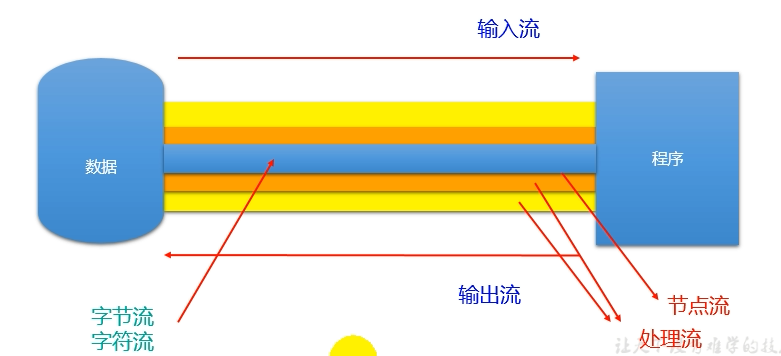

| (抽象基类) | 字节流       | 字符流 |
| ---------- | ------------ | ------ |
| 输入流     | InputStream  | Reader |
| 输出流     | OutputStream | Writer |

1. Java的IO流共涉及40多个类，实际上非常规则，都是从如下4个抽象基类派生的。
2. 由这四个类派生出来的子类名称都是以其父类名作为子类名后缀。

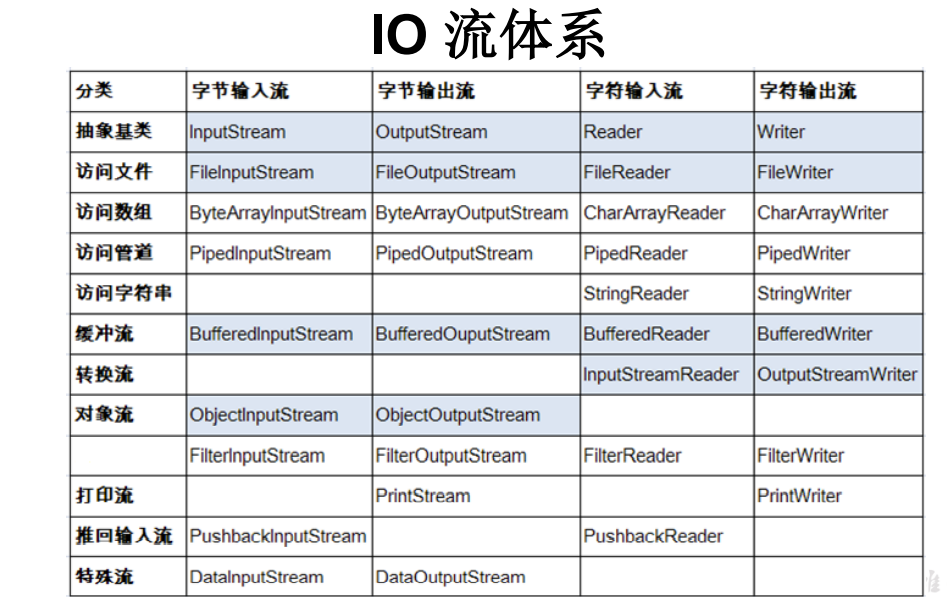

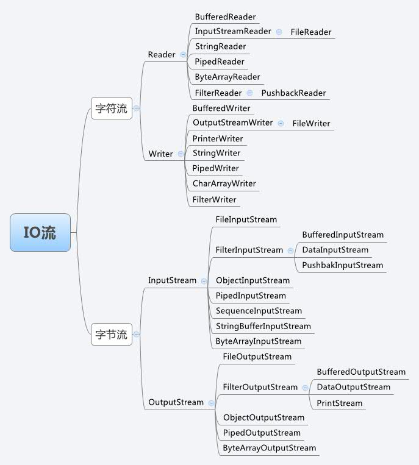

### 节点流和处理流

- 节点流：直接从数据源或目的地读写数据
- 处理流：不直接连接到数据源或目的地，而是“连接”在已存在的流（节点流或处理流）之上，通过对数据的处理为程序提供更为强大的读写功能。

| 抽象基类     | 节点流（或文件流）                           | 缓冲流（处理流的一种）                                     |
| ------------ | -------------------------------------------- | ---------------------------------------------------------- |
| InputStream  | FileInputStream (read(byte[] buffer))        | BufferedInputStream (read(byte[] buffer))                  |
| OutputStream | FileOutputStream (write(byte[] buffer,0,len) | BufferedOutputStream (write(byte[] buffer,0,len) / flush() |
| Reader       | FileReader (read(char[] cbuf))               | BufferedReader (read(char[] cbuf) / readLine())            |
| Writer       | FileWriter (write(char[] cbuf,0,len)         | BufferedWriter (write(char[] cbuf,0,len) / flush()         |

### InputStream & Reader
- InputStream 和 Reader 是所有输入流的基类。
- InputStream（典型实现：FileInputStream）
  - `int read()`
  - `int read(byte[] b)`
  - `int read(byte[] b, int off, int len)`
- Reader（典型实现：FileReader）
  - `int read()`
  - `int read(char[] c)`
  - `int read(char[] c, int off, int len)`
- 程序中打开的文件 IO 资源不属于内存里的资源，垃圾回收机制无法回收该资源，所以应该**显式关闭文件 IO 资源**。
- FileInputStream 从文件系统中的某个文件中获得输入字节。FileInputStream 用于读取非文本数据之类的原始字节流。要读取字符流，需要使用 FileReader

InputStream
- `int read()`
  > 从输入流中读取数据的下一个字节。返回 0 到 255 范围内的 int 字节值。如果因为已经到达流末尾而没有可用的字节，则返回值 -1。
- `int read(byte[] b)`
  > 从此输入流中将最多 b.length 个字节的数据读入一个 byte 数组中。如果因为已经到达流末尾而没有可用的字节，则返回值 -1。否则以整数形式返回实际读取的字节数。
- `int read(byte[] b, int off, int len)`
  > 将输入流中最多 len 个数据字节读入 byte 数组。尝试读取 len 个字节，但读取的字节也可能小于该值。以整数形式返回实际读取的字节数。如果因为流位于文件末尾而没有可用的字节，则返回值 -1。
- `public void close() throws IOException`
  > 关闭此输入流并释放与该流关联的所有系统资源。

Reader
- `int read()`
  > 读取单个字符。作为整数读取的字符，范围在 0 到 65535 之间 (0x00-0xffff)（2个字节的Unicode码），如果已到达流的末尾，则返回 -1
- `int read(char[] cbuf)`
  > 将字符读入数组。如果已到达流的末尾，则返回 -1。否则返回本次读取的字符数。
- `int read(char[] cbuf, int off, int len)`
  > 将字符读入数组的某一部分。存到数组cbuf中，从off处开始存储，最多读len个字符。如果已到达流的末尾，则返回 -1。否则返回本次读取的字符数。
- `public void close() throws IOException`
  > 关闭此输入流并释放与该流关联的所有系统资源。

### OutputStream & Writer
- OutputStream 和 Writer 也非常相似：
  - `void write(int b/int c);`
  - `void write(byte[] b/char[] cbuf);`
  - `void write(byte[] b/char[] buff, int off, int len);`
  - `void flush();`
  - `void close();` 需要先刷新，再关闭此流
- 因为字符流直接以字符作为操作单位，所以 Writer 可以用字符串来替换字符数组，即以 String 对象作为参数
  - `void write(String str);`
  - `void write(String str, int off, int len);`
- FileOutputStream 从文件系统中的某个文件中获得输出字节。FileOutputStream 用于写出非文本数据之类的原始字节流。要写出字符流，需要使用 FileWriter

OutputStream
- `void write(int b)`
  > 将指定的字节写入此输出流。write 的常规协定是：向输出流写入一个字节。要写入的字节是参数 b 的八个低位。b 的 24 个高位将被忽略。 即写入0~255范围的。
- `void write(byte[] b)`
  > 将 b.length 个字节从指定的 byte 数组写入此输出流。write(b) 的常规协定是：应该与调用 write(b, 0, b.length) 的效果完全相同。
- `void write(byte[] b,int off,int len)`
  > 将指定 byte 数组中从偏移量 off 开始的 len 个字节写入此输出流。
- `public void flush()throws IOException`
  > 刷新此输出流并强制写出所有缓冲的输出字节，调用此方法指示应将这些字节立即写入它们预期的目标。
- `public void close() throws IOException`
  > 关闭此输出流并释放与该流关联的所有系统资源。

Writer
- `void write(int c)`
  > 写入单个字符。要写入的字符包含在给定整数值的 16 个低位中，16 高位被忽略。 即写入0 到 65535 之间的Unicode码。
- `void write(char[] cbuf)`
  > 写入字符数组。
- `void write(char[] cbuf,int off,int len)`
  > 写入字符数组的某一部分。从off开始，写入len个字符
- `void write(String str)`
  > 写入字符串。
- `void write(String str,int off,int len)`
  > 写入字符串的某一部分。
- `void flush()`
  > 刷新该流的缓冲，则立即将它们写入预期目标。
- `public void close() throws IOException`
  > 关闭此输出流并释放与该流关联的所有系统资源。

## 13-3 节点流(或文件流)

### 读取文件

1. 建立一个流对象，将已存在的一个文件加载进流。
   - `FileReader fr = new FileReader(new File("Test.txt"));`
2. 创建一个临时存放数据的数组。
   - `char[] ch = new char[1024];`
3. 调用流对象的读取方法将流中的数据读入到数组中。
   - `fr.read(ch);`
4. 关闭资源。
   - `fr.close();`

```java
FileReader fr = null;
try {// 异常的处理：为了保证流资源一定可以执行关闭操作。需要使用try-catch-finally处理
  // 1.实例化File类的对象，指明要操作的文件
  File file = new File("hello.txt");
  // 2.FileReader流的实例化
  fr = new FileReader(file);// 读入的文件一定要存在，否则就会报FileNotFoundException。
  // 3.读入的操作
  // read(char[] cbuf):返回每次读入cbuf数组中的字符的个数。如果达到文件末尾，返回-1
  char[] cbuf = new char[5];
  int len;
  while ((len = fr.read(cbuf)) != -1) {
    // 方式一：错误的写法
    // for (int i = 0; i < cbuf.length; i++) {
    //   System.out.print(cbuf[i]);
    // }
    // 正确的写法
    for (int i = 0; i < len; i++) {
      System.out.print(cbuf[i]);
    }
    // 方式二：错误的写法,对应着方式一的错误的写法
    // String str = new String(cbuf);
    // System.out.print(str);
    // 正确的写法
    String str = new String(cbuf, 0, len);
    System.out.print(str);
  }
} catch (IOException e) {
    e.printStackTrace();
} finally {
  if (fr != null) {
    try {
      fr.close();// 4.资源的关闭
    } catch (IOException e) {
      e.printStackTrace();
    }
  }
}
```

### 写入文件

1. 创建流对象，建立数据存放文件
   - `FileWriter fw = new FileWriter(new File("Test.txt"));`
2. 调用流对象的写入方法，将数据写入流
   - `fw.write("atguigu-songhongkang");`
3. 关闭流资源，并将流中的数据清空到文件中。
   - `fw.close();`

```java
FileWriter fw = null;
try {
  // 1.提供File类的对象，指明写出到的文件
  File file = new File("hello1.txt");// File对应的硬盘中的文件如果不存在，在输出的过程中，会自动创建此文件。
  // 2.提供FileWriter的对象，用于数据的写出:输出操作，对应的File可以不存在的。并不会报异常
  fw = new FileWriter(file, false);
  // File对应的硬盘中的文件如果存在： 如果流使用的构造器是：FileWriter(file,false)
  // /FileWriter(file):对原有文件的覆盖
  // 如果流使用的构造器是：FileWriter(file,true):不会对原有文件覆盖，而是在原有文件基础上追加内容
  // 3.写出的操作
  fw.write("I have a dream!\n");
  fw.write("you need to have a dream!");
} catch (IOException e) {
  e.printStackTrace();
} finally {
  if (fw != null) {
    try {
      fw.close();// 4.流资源的关闭
    } catch (IOException e) {
      e.printStackTrace();
    }
  }
}
```

### 注意点

- 定义文件路径时，注意：`可以用"/"或者"\\"`。
- 在**写入**一个文件时，如果使用构造器FileOutputStream(file)，则目录下有同名文件将被覆盖。
- 如果使用构造器FileOutputStream(file,true)，则目录下的同名文件不会被覆盖，在文件内容末尾追加内容。
- 在**读取**文件时，必须保证该文件已存在，否则报异常。
- 字节流操作字节，比如：.mp3，.avi，.rmvb，mp4，.jpg，.doc，.ppt
- 字符流操作字符，只能操作普通文本文件。最常见的文本文件：.txt，.java，.c，.cpp 等语言的源代码。尤其注意.doc,excel,ppt这些不是文本文件。
- 使用字节流处理文本文件，可能出现乱码。使用字符流处理二进制文件会产生错误导致文件无法访问。

```java
FileReader fr = null;FileWriter fw = null;
try {//使用FileReader和FileWriter实现文件复制
  // 1.创建File类的对象，指明读入和写出的文件
  File srcFile = new File("hello.txt");
  File destFile = new File("hello2.txt");
  // 不能使用字符流来处理图片等字节数据
  // File srcFile = new File("爱情与友情.jpg");
  // File destFile = new File("爱情与友情1.jpg");
  // 2.创建输入流和输出流的对象
  fr = new FileReader(srcFile);
  fw = new FileWriter(destFile);
  // 3.数据的读入和写出操作
  char[] cbuf = new char[5];
  int len;// 记录每次读入到cbuf数组中的字符的个数
  while ((len = fr.read(cbuf)) != -1) {
    fw.write(cbuf, 0, len);// 每次写出len个字符
  }
} catch (IOException e) {
} finally {
  // 4.关闭流资源
  try {
    if (fw != null)fw.close();
  } catch (IOException e) {}
  try {
    if (fr != null)fr.close();
  } catch (IOException e) {}
}
```

```java
String data;//readLine()BufferedReader中额外的方法
while((data = br.readLine()) != null){
    //方法一：
    //bw.write(data + "\n");//data中不包含换行符
    //方法二：
    bw.write(data);//data中不包含换行符
    bw.newLine();//提供换行的操作
}
```

## 13-4 处理流之一：缓冲流

- 为了提高数据读写的速度，Java API提供了带缓冲功能的流类，在使用这些流类时，会创建一个内部缓冲区数组，缺省使用8192个字节(8Kb)的缓冲区。
- 缓冲流要“套接”在相应的节点流之上，根据数据操作单位可以把缓冲流分为：
  - BufferedInputStream 和 BufferedOutputStream
  - BufferedReader 和 BufferedWriter

- 当读取数据时，数据按块读入缓冲区，其后的读操作则直接访问缓冲区
- 当使用BufferedInputStream读取字节文件时，BufferedInputStream会一次性从文件中读取8192个(8Kb)，存在缓冲区中，直到缓冲区装满了，才重新从文件中读取下一个8192个字节数组。
- 向流中写入字节时，不会直接写到文件，先写到缓冲区中直到缓冲区写满，BufferedOutputStream才会把缓冲区中的数据一次性写到文件里。使用方法**flush()可以强制将缓冲区的内容全部写入输出流**
- 关闭流的顺序和打开流的顺序相反。实际上只要关闭最外层流即可，**关闭最外层流也会相应关闭内层节点流**
- flush()方法的使用：手动将buffer中内容写入文件
- 如果是带缓冲区的流对象的close()方法，不但会关闭流，还会在关闭流之前刷新缓冲区，关闭后不能再写出

```java
//使用BufferedInput/OutputStream实现文件复制
public void copyFileWithBuffered(String srcPath,String destPath){
  BufferedInputStream bis = null;
  BufferedOutputStream bos = null;
  try {
    bis = new BufferedInputStream(new FileInputStream(new File(srcPath)));
    bos = new BufferedOutputStream(new FileOutputStream(new File(destPath)));
    byte[] buffer = new byte[1024];
    int len;
    while((len = bis.read(buffer)) != -1){
      bos.write(buffer,0,len);
    }
  } catch (IOException e) {
  } finally {
    if(bos != null){
      try {bos.close();
      } catch (IOException e) {}
    }
    if(bis != null){
      try {bis.close();
      } catch (IOException e) {}
    }
  }
}
```

## 13-5 处理流之二：转换流

- 转换流提供了在字节流和字符流之间的转换（属于字符流）
- Java API提供了两个转换流：
  - InputStreamReader：将InputStream（字节的输入流）转换为Reader（字符的输入流）
  - OutputStreamWriter：将Writer（字符的输出流）转换为OutputStream（字节的输出流）
- 字节流中的数据都是字符时，转成字符流操作更高效。
- 很多时候我们使用转换流来处理文件乱码问题。实现编码和解码的功能。
  - 解码：字节、字节数组 --->字符数组、字符串
  - 编码：字符数组、字符串 ---> 字节、字节数组

### InputStreamReader

- 实现将字节的输入流按指定字符集转换为字符的输入流。
- 需要和InputStream“套接”。
- 构造器
  - `public InputStreamReader(InputStream in)`
  - `public InputSreamReader(InputStream in, String charsetName)`
  - 如： `Reader isr = new InputStreamReader(System.in, "gb");`

```java
FileInputStream fis = new FileInputStream("dbcp.txt");
// InputStreamReader isr = new InputStreamReader(fis);//使用系统默认的字符集
// 参数2指明了字符集，具体使用哪个字符集，取决于文件fis保存时使用的字符集
InputStreamReader isr = new InputStreamReader(fis, "UTF-8");
```

### OutputStreamWriter

- 实现将字符的输出流按指定字符集转换为字节的输出流。
- 需要和OutputStream“套接”。
- 构造器
  - `public OutputStreamWriter(OutputStream out)`
  - `public OutputSreamWriter(OutputStream out, String charsetName)`

```java
//使用InputStreamReader和OutputStreamWriter实现编码转换
//此时省略异常处理过程，如果处理异常的话，仍然应该使用try-catch-finally
File file1 = new File("dbcp.txt");// 1.文件
File file2 = new File("dbcp_gbk.txt");
FileInputStream fis = new FileInputStream(file1);//流
FileOutputStream fos = new FileOutputStream(file2);
InputStreamReader isr = new InputStreamReader(fis, "utf-8");
OutputStreamWriter osw = new OutputStreamWriter(fos, "gbk");
// 2.读写过程
char[] cbuf = new char[20];
int len;
while ((len = isr.read(cbuf)) != -1) {
    osw.write(cbuf, 0, len);
}
// 3.关闭资源
isr.close();
osw.close();
```

### 补充：字符编码

- 编码表的由来
计算机只能识别二进制数据，早期由来是电信号。为了方便应用计算机，让它可以识别各个国家的文字。就将各个国家的文字用数字来表示，并一一对应，形成一张表。这就是编码表。
- 常见的编码表
  - ASCII：美国标准信息交换码。
    - 用一个字节的7位可以表示。
  - ISO8859-1：拉丁码表。欧洲码表
    - 用一个字节的8位表示。
  - GB2312：中国的中文编码表。最多两个字节编码所有字符
  - GBK：中国的中文编码表升级，融合了更多的中文文字符号。最多两个字节编码
  - Unicode：国际标准码，融合了目前人类使用的所有字符。为每个字符分配唯一的字符码。所有的文字都用两个字节来表示。
  - UTF-8：变长的编码方式，可用1-4个字节来表示一个字符。

---

- 在Unicode出现之前，所有的字符集都是和具体编码方案绑定在一起的（即字符集≈编码方式），都是直接将字符和最终字节流绑定死了。
- GBK等双字节编码方式，用最高位是1或0表示两个字节和一个字节。

---

- Unicode不完美，这里就有三个问题
  - 英文字母只用一个字节表示就够了
  - 如何才能区别Unicode和ASCII？计算机怎么知道两个字节表示一个符号，而不是分别表示两个符号呢？
  - 如果和GBK等双字节编码方式一样，用最高位是1或0表示两个字节和一个字节，就少了很多值无法用于表示字符，不够表示所有字符。Unicode在很长一段时间内无法推广，直到互联网的出现。
- 面向传输的众多 UTF（UCS Transfer Format）标准出现了，顾名思义，UTF8就是每次8个位传输数据，而UTF-16就是每次16个位。这是为传输而设计的编码，并使编码无国界，这样就可以显示全世界上所有文化的字符了。
- Unicode只是定义了一个庞大的、全球通用的字符集，并为每个字符规定了唯一确定的编号，具体存储成什么样的字节流，取决于字符编码方案。推荐的Unicode编码是UTF-8和UTF-16。

---

- ANSI编码，通常指的是平台的默认编码，例如英文操作系统中是ISO-8859-1，中文系统是GBK
- Unicode字符集只是定义了字符的集合和唯一编号，Unicode编码，则是对UTF-8、UCS-2/UTF-16等具体编码方案的统称而已，并不是具体的编码方案。

---

- 编码：字符串 -> 字节数组（文件编码的方式决定了文件解码的方式）
- 解码：字节数组 -> 字符串
- 转换流的编码应用
  - 可以将字符按指定编码格式存储
  - 可以对文本数据按指定编码格式来解读
  - 指定编码表的动作由构造器完成

## 13-6 处理流之三：标准输入、输出流(了解)

- **System.in**和**System.out**分别代表了系统标准的输入和输出设备
- 默认输入设备是：键盘；输出设备是：显示器（控制台）
- System.in（标准的输入流）：类型InputStream，默认从键盘输入
- System.out（标准的输出流）：类型PrintStream，其是OutputStream的子类FilterOutputStream 的子类，默认从控制台输出
- 重定向：通过System类的setIn，setOut方法对默认设备进行改变。
  - `public static void setIn(InputStream in)`
  - `public static void setOut(PrintStream out)`

```java
// 从键盘输入字符串，要求将读取到的整行字符串转成大写输出。然后继续进行输入操作，直至当输入“e”或者“exit”时，退出程序。
// 方法一：使用Scanner实现，调用next()返回一个字符串
// 方法二：使用System.in实现。System.in  --->  转换流 ---> BufferedReader的readLine()
BufferedReader br = null;
try {//IDEA的单元测试控制台输入异常，建议使用main方法
  InputStreamReader isr = new InputStreamReader(System.in);
  br = new BufferedReader(isr);
  while (true) {
    System.out.println("请输入字符串：");
    String data = br.readLine();
    if ("e".equalsIgnoreCase(data) || "exit".equalsIgnoreCase(data)) {
      System.out.println("程序结束");
      break;
    }
    String upperCase = data.toUpperCase();
    System.out.println(upperCase);
  }
} catch (IOException e) {
} finally {
  if (br != null) {
    try {
      br.close();
    } catch (IOException e) {
    }
  }
}
// MyInput.java: Contain the methods for reading int, double, float, boolean, short, byte and string values from the keyboard
import java.io.*;
public class MyInput {
    // Read a string from the keyboard
    public static String readString() {
        BufferedReader br = new BufferedReader(new InputStreamReader(System.in));
        // Declare and initialize the string
        String string = "";
        // Get the string from the keyboard
        try {
            string = br.readLine();
        } catch (IOException ex) {
            System.out.println(ex);
        }
        // Return the string obtained from the keyboard
        return string;
    }
    // Read an int value from the keyboard
    public static int readInt() {
        return Integer.parseInt(readString());
    }
    // Read a double value from the keyboard
    public static double readDouble() {
        return Double.parseDouble(readString());
    }
    // Read a byte value from the keyboard
    public static double readByte() {
        return Byte.parseByte(readString());
    }
    // Read a short value from the keyboard
    public static double readShort() {
        return Short.parseShort(readString());
    }
    // Read a long value from the keyboard
    public static double readLong() {
        return Long.parseLong(readString());
    }
    // Read a float value from the keyboard
    public static double readFloat() {
        return Float.parseFloat(readString());
    }
}
```

## 13-7 处理流之四：打印流(了解)

- 实现将**基本数据类型**的数据格式转化为**字符串**输出
- 打印流：**PrintStream和PrintWriter**
  - 提供了一系列重载的print()和println()方法，用于多种数据类型的输出
  - PrintStream和PrintWriter的输出不会抛出IOException异常
  - PrintStream和PrintWriter有自动flush功能
  - PrintStream 打印的所有字符都使用平台的默认字符编码转换为字节。在需要写入字符而不是写入字节的情况下，应该使用 PrintWriter 类。
  - System.out返回的是PrintStream的实例

```java
PrintStream ps = null;
try {
  FileOutputStream fos = new FileOutputStream(new File("D:\\XF\\Desktop\\text.txt"));
  // 创建打印输出流,设置为自动刷新模式(写入换行符或字节 '\n' 时都会刷新输出缓冲区)
  ps = new PrintStream(fos, true);
  if (ps != null) {// 把标准输出流(控制台输出)改成文件
    System.setOut(ps);
  }
  for (int i = 0; i <= 255; i++) { // 输出ASCII字符
    System.out.print((char) i);
    if (i % 16 == 0) { // 每16个数据一行
      System.out.println(); // 换行
    }
  }
} catch (FileNotFoundException e) {
} finally {
  if (ps != null)ps.close();
}
```

关于printf的使用(参考)：

printf的格式控制的完整格式：`%-0m.n[l或h][格式字符]`
- `%`：表示格式说明的起始符号，不可缺少。 
- `-`：有-表示左对齐输出，如省略表示右对齐输出。 
- `0`：有0表示指定空位填0,如省略表示指定空位不填。 
- `m.n`：m指域宽，即对应的输出项在输出设备上所占的字符数。N指精度。用于说明输出的实型数的小数位数。为指定n时，隐含的精度为n=6位。 
- `l或h`:l对整型指long型，对实型指double型。h用于将整型的格式字符修正为short型。 
- 格式字符：用以指定输出项的数据类型和输出格式。 
  - `d`格式：用来输出十进制整数。
    - `%d`：按整型数据的实际长度输出。 
    - `%md`：m为指定的输出字段的宽度。如果数据的位数小于m，则左端补以空格，若大于m，则按实际位数输出。 
    - `%ld`：输出长整型数据。 
  - `o`格式：以无符号八进制形式输出整数。对长整型可以用"%lo"格式输出。同样也可以指定字段宽度用“%mo”格式输出。 
  - `x`格式：以无符号十六进制形式输出整数。对长整型可以用"%lx"格式输出。同样也可以指定字段宽度用"%mx"格式输出。 
  - `u`格式：以无符号十进制形式输出整数。对长整型可以用"%lu"格式输出。同样也可以指定字段宽度用“%mu”格式输出。 
  - `c`格式：输出一个字符。 
  - `s`格式：用来输出一个串。
    - `%s`：例如:printf("%s", "CHINA")输出"CHINA"字符串（不包括双引号）。 
    - `%ms`：输出的字符串占m列，如字符串本身长度大于m，则突破获m的限制,将字符串全部输出。若串长小于m，则左补空格。 
    - `%-m``s`：如果串长小于m，则在m列范围内，字符串向左靠，右补空格。 
    - `%m.ns`：输出占m列，但只取字符串中左端n个字符。这n个字符输出在m列的右侧，左补空格。 
    - `%-m.ns`：其中m、n含义同上，n个字符输出在m列范围的左侧，右补空格。如果n>m，则自动取n值，即保证n个字符正常输出。 
  - `f`格式：用来输出实数（包括单、双精度），以小数形式输出。
    - `%f`：不指定宽度，整数部分全部输出并输出6位小数。 
    - `%m.nf`：输出共占m列，其中有n位小数，如数值宽度小于m左端补空格。 
    - `%-m.nf`：输出共占n列，其中有n位小数，如数值宽度小于m右端补空格。 
    - 对于单精度数，使用%f格式符输出时，仅前7位是有效数字，小数6位．
    - 对于双精度数，使用%lf格式符输出时，前16位是有效数字，小数6位．
  - `e`格式：以指数形式输出实数。
    - `%e`：数字部分（又称尾数）输出6位小数，指数部分占5位或4位。 
    - `%m.ne`和`%-m.ne`：m、n和”-”字符含义与前相同。此处n指数据的数字部分的小数位数，m表示整个输出数据所占的宽度。 
  - `g`格式：自动选f格式或e格式中较短的一种输出，且不输出无意义的零。 
  - 如果想输出字符"%",则应该在“格式控制”字符串中用连续两个%表示
- 对于m.n的格式还可以用如下方法表示`char ch[20]; printf("%*.*s\n",m,n,ch);`前边的*定义的是总的宽度，后边的定义的是输出的个数。分别对应外面的参数m和n。可以在语句之外对参数m和n赋值，从而控制输出格式。 
- 将所输出字符串的长度值赋绐一个变量`int slen; printf("hello world%n", &slen);`执行后变量被赋值为11。 

## 13-8 处理流之五：数据流(了解)

- 为了方便地操作Java语言的基本数据类型和String的数据，可以使用数据流。
- 数据流有两个类：(用于读取和写出基本数据类型、String类的数据）
  - DataInputStream 和 DataOutputStream
  - 分别“套接”在 InputStream 和 OutputStream 子类的流上
- DataInputStream中的方法
  - `boolean readBoolean()`
  - `byte readByte()`
  - `char readChar()`
  - `float readFloat()`
  - `double readDouble()`
  - `short readShort()`
  - `long readLong()`
  - `int readInt()`
  - `String readUTF()`
  - `void readFully(byte[] b)`
- DataOutputStream中的方法
  - 将上述的方法的read改为相应的write即可。
- 注意点：读取不同类型的数据的顺序要与当初写入文件时，保存的数据的顺序一致！否则会出现异常。

## 13-9 处理流之六：对象流

- ObjectInputStream和OjbectOutputSteam
  - 用于存储和读取基本**数据类型数据**或**对象**的处理流。它的强大之处就是可以把Java中的对象写入到数据源中，也能把对象从数据源中还原回来。（持久化）
- 序列化：用ObjectOutputStream类**保存**基本类型数据或对象的机制
- 反序列化：用ObjectInputStream类**读取**基本类型数据或对象的机制
- ObjectOutputStream和ObjectInputStream不能序列化**static**和**transient**修饰的成员变量

### 对象的序列化

- **对象序列化机制**允许把内存中的Java对象转换成平台无关的二进制流，从而允许把这种二进制流持久地保存在磁盘上，或通过网络将这种二进制流传输到另一个网络节点。//当其它程序获取了这种二进制流，就可以恢复成原来的Java对象
- 序列化的好处在于可将任何实现了Serializable接口的对象转化为**字节数据**，使其在保存和传输时可被还原
- 序列化是 RMI（Remote Method Invoke – 远程方法调用）过程的参数和返回值都必须实现的机制，而 RMI 是 JavaEE 的基础。因此序列化机制是JavaEE 平台的基础
- 如果需要让某个对象支持序列化机制，则必须让对象所属的类及其属性是可序列化的（除了当前类需要实现Serializable接口之外，还必须保证其内部所有属性也必须是可序列化的。（默认情况下，基本数据类型可序列化））。
- 一般情况下我们也不会直接将一个对象序列化，而是将属性转化为json字符串，然后序列化字符串。
- 为了让某个类是可序列化的，该类必须实现如下两个接口之一。否则，会抛出NotSerializableException异常
  - **Serializable**
  - Externalizable

---

- 凡是实现Serializable接口的类都有一个表示序列化版本标识符的全局静态常量：
  - `private static final long serialVersionUID;`
  - serialVersionUID用来表明类的不同版本间的兼容性。简言之，其目的是以序列化对象进行版本控制，有关各版本反序列化时是否兼容。
  - 如果类没有显示定义这个静态常量，它的值是Java运行时环境根据类的内部细节自动生成的。若类的实例变量做了修改，serialVersionUID 可能发生变化。故建议，显式声明。
-  简单来说，Java的序列化机制是通过在运行时判断类的serialVersionUID来验证版本一致性的。在进行反序列化时，JVM会把传来的字节流中的serialVersionUID与本地相应实体类的serialVersionUID进行比较，如果相同就认为是一致的，可以进行反序列化，否则就会出现序列化版本不一致的异常。(InvalidCastException)

### 使用对象流序列化对象

- 若某个类实现了 Serializable 接口，该类的对象就是可序列化的：
  - 创建一个 ObjectOutputStream
  - 调用 ObjectOutputStream 对象的 writeObject(对象) 方法输出可序列化对象
  - 注意写出一次，操作flush()一次
- 反序列化
  - 创建一个 ObjectInputStream
  - 调用 readObject() 方法读取流中的对象
- 强调：如果某个类的属性不是基本数据类型或 String 类型，而是另一个引用类型，那么这个引用类型必须是可序列化的，否则拥有该类型的Field 的类也不能序列化

### 关于Serializable接口

- 序列化机制：对象序列化机制允许把内存中的Java对象转换成平台无关的二进制流，从而允许把这种二进制流持久地保存在磁盘上（持久化），或通过网络将这种二进制流传输到另一个网络节点。当其它程序获取了这种二进制流，就可以恢复成原来的Java对象。
- 实现了Serializable接口的对象，可将它们转换成一系列字节，并可在以后完全恢复回原来的样子。这一过程亦可通过网络进行。这意味着序列化机制能自动补偿操作系统间的差异。换句话说，可以先在Windows机器上创建一个对象，对其序列化，然后通过网络发给一台Unix机器，然后在那里准确无误地重新“装配”。不必关心数据在不同机器上如何表示，也不必关心字节的顺序或者其他任何细节。
- 由于大部分作为参数的类如String、Integer等都实现了java.io.Serializable的接口，也可以利用多态的性质，作为参数使接口更灵活。

## 13-10 随机存取文件流

### RandomAccessFile 类

- RandomAccessFile 声明在java.io包下，但直接继承于java.lang.Object类。并且它实现了DataInput、DataOutput这两个接口，即该类既可以作为一个输入流，又可以作为一个输出流。
- RandomAccessFile 类支持 “随机访问” 的方式，程序可以直接跳到文件的任意地方来读、写文件
  - 支持只访问文件的部分内容
  - 可以向已存在的文件后追加内容
- RandomAccessFile 对象包含一个记录指针，用以标示当前读写处的位置。RandomAccessFile 类对象可以自由移动记录指针：
  - `long getFilePointer()`：获取文件记录指针的当前位置
  - `void seek(long pos)`：将文件记录指针定位到 pos 位置
- 构造器
  - `public RandomAccessFile(File file, String mode)`
  - `public RandomAccessFile(String name, String mode)`
- 创建 RandomAccessFile 类实例需要指定一个 mode 参数，该参数指定 RandomAccessFile 的访问模式：
  - r: 以只读方式打开
  - rw：打开以便读取和写入
  - rwd:打开以便读取和写入；同步文件内容的更新（如果写数据出现异常，rwd模式中已被write的数据被保存到硬盘，而rw则全部丢失）
  - rws:打开以便读取和写入；同步文件内容和元数据的更新
- 如果模式为只读r。则不会创建文件，而是会去读取一个已经存在的文件，如果读取的文件不存在则会出现异常。 如果模式为rw读写。如果文件不存在则会去创建文件，如果写出到的文件存在，则会对原有文件内容进行覆盖（默认情况下，从头覆盖）。
- 方法：
  - `long length()`：返回此文件的长度。
  - `setLength​(long newLength)`：设置此文件的长度。
  - `int read()`：从该文件中读取一个字节的数据。
  - `xxx readXxx()`：从此文件中读取Xxx
  - `String readLine()`：从此文件中读取下一行文本。
  - `int	skipBytes​(int n)`：尝试跳过 n字节的输入，丢弃跳过的字节。
  - `void write(xxx)`：向该文件中写入数据。
  - `void writeXxx(xxx)`：向该文件中写入Xxx。

> 我们可以用RandomAccessFile这个类，来实现一个**多线程断点下载**的功能，用过下载工具的朋友们都知道，下载前都会建立**两个临时文件**，一个是与被下载文件大小相同的空文件，另一个是记录文件指针的位置文件，每次暂停的时候，都会保存上一次的指针，然后断点下载的时候，会继续从上一次的地方下载，从而实现断点下载或上传的功能，有兴趣的朋友们可以自己实现下。

```java
public void insert(File file, long pos, byte[] data) throws IOException {
    //使用RandomAccessFile实现字符数据的插入效果
    RandomAccessFile raf = new RandomAccessFile(file, "rw");
    raf.seek(pos);
    StringBuilder builder = new StringBuilder((int) file.length());
    byte[] buffer = new byte[1024];
    int len;
    while ((len = raf.read(buffer)) != -1) {
        builder.append(new String(buffer, 0, len));
    }
    raf.seek(pos);
    raf.write(builder.toString().getBytes());
}//思考：将StringBuilder替换为ByteArrayOutputStream
```

### 流的基本应用小节

- 流是用来处理数据的。
- 处理数据时，一定要先明确**数据源**，与**数据目的地**
  - 数据源可以是文件，可以是键盘。
  - 数据目的地可以是文件、显示器或者其他设备。
- 而流只是在帮助数据进行传输,并对传输的数据进行处理，比如过滤处理、转换处理等。
- 实际开发中可能更多的会使用第三方的jar包，如Apache Commons IO

## 13-11 NIO.2中Path、Paths、Files类的使用

### Java NIO 概述

- Java NIO (New IO，Non-Blocking IO)是从Java 1.4版本开始引入的一套新的IO API，可以替代标准的Java IO API。NIO与原来的IO有同样的作用和目的，但是使用的方式完全不同，NIO支持面向缓冲区的(IO是面向流的)、基于通道的IO操作。**NIO将以更加高效的方式进行文件的读写操作。**
- Java API中提供了两套NIO，一套是针对标准输入输出NIO，另一套就是网络编程NIO。
  - java.nio.channels.Channel
  - FileChannel:处理本地文件
  - SocketChannel：TCP网络编程的客户端的Channel
  - ServerSocketChannel:TCP网络编程的服务器端的Channel
  - DatagramChannel：UDP网络编程中发送端和接收端的Channel

### NIO.2

随着 JDK 7 的发布，Java对NIO进行了极大的扩展，增强了对文件处理和文件系统特性的支持，以至于我们称他们为 NIO.2。因为 NIO 提供的一些功能，NIO已经成为文件处理中越来越重要的部分。

### Path、Paths和Files核心API

- 早期的Java只提供了一个File类来访问文件系统，但File类的功能比较有限，所提供的方法性能也不高。而且，**大多数方法在出错时仅返回失败，并不会提供异常信息。**
- NIO. 2为了弥补这种不足，引入了Path接口，代表一个平台无关的平台路径，描述了目录结构中文件的位置。**Path可以看成是File类的升级版本，实际引用的资源也可以不存在。**
- 在以前IO操作都是这样写的:

```java
import java.io.File;
File file = new File("index.html");
```

- 但在Java7 中，我们可以这样写：

```java
import java.nio.file.Path; 
import java.nio.file.Paths; 
Path path = Paths.get("index.html");
```

- 同时，NIO.2在java.nio.file包下还提供了Files、Paths工具类，Files包含了大量静态的工具方法来操作文件；Paths则包含了两个返回Path的静态工厂方法。
- Paths 类提供的静态 get() 方法用来获取 Path 对象：
  - `static Path get(String first, String ... more)` : 用于将多个字符串串连成路径
  - `static Path get(URI uri)` : 返回指定uri对应的Path路径

### Path接口

- Path 常用方法：
  - `String toString()` ： 返回调用 Path 对象的字符串表示形式
  - `boolean startsWith(String path)` : 判断是否以 path 路径开始
  - `boolean endsWith(String path)` : 判断是否以 path 路径结束
  - `boolean isAbsolute()` : 判断是否是绝对路径
  - `Path getParent()` ：返回Path对象包含整个路径，不包含 Path 对象指定的文件路径
  - `Path getRoot()` ：返回调用 Path 对象的根路径
  - `Path getFileName()` : 返回与调用 Path 对象关联的文件名
  - `int getNameCount()` : 返回Path 根目录后面元素的数量
  - `Path getName(int idx)` : 返回指定索引位置 idx 的路径名称
  - `Path toAbsolutePath()` : 作为绝对路径返回调用 Path 对象
  - `Path resolve(Path p)` :合并两个路径，返回合并后的路径对应的Path对象
  - `File toFile()` : 将Path转化为File类的对象

### Files 类

- java.nio.file.Files 用于操作文件或目录的工具类。
- Files常用方法：
  - `Path copy(Path src, Path dest, CopyOption ... how)` : 文件的复制
  - `Path createDirectory(Path path, FileAttribute<?> ... attr)` : 创建一个目录
  - `Path createFile(Path path, FileAttribute<?> ... arr)` : 创建一个文件
  - `void delete(Path path)` : 删除一个文件/目录，如果不存在，执行报错
  - `void deleteIfExists(Path path)` : Path对应的文件/目录如果存在，执行删除
  - `Path move(Path src, Path dest, CopyOption...how)` : 将 src 移动到 dest 位置
  - `long size(Path path)` : 返回 path 指定文件的大小

- Files常用方法：用于判断
  - `boolean exists(Path path, LinkOption ... opts)` : 判断文件是否存在
  - `boolean isDirectory(Path path, LinkOption ... opts)` : 判断是否是目录
  - `boolean isRegularFile(Path path, LinkOption ... opts)` : 判断是否是文件
  - `boolean isHidden(Path path)` : 判断是否是隐藏文件
  - `boolean isReadable(Path path)` : 判断文件是否可读
  - `boolean isWritable(Path path)` : 判断文件是否可写
  - `boolean notExists(Path path, LinkOption ... opts)` : 判断文件是否不存在
- Files常用方法：用于操作内容
  - `SeekableByteChannel newByteChannel(Path path, OpenOption...how)` : 获取与指定文件的连接，how 指定打开方式。
  - `DirectoryStream<Path> newDirectoryStream(Path path)` : 打开 path 指定的目录
  - `InputStream newInputStream(Path path, OpenOption...how)` :获取 InputStream 对象
  - `OutputStream newOutputStream(Path path, OpenOption...how)` : 获取 OutputStream 对象

## 拓展：装饰设计模式

1. 装饰模式的概念:
   - 装饰模式是动态的给一个对象添加一些额外的功能，就增加功能来说，装饰模式比生成子类更为灵活。
   - 装饰模式是在不必改变原类文件和使用继承的情况下，动态的扩展一个对象的功能。提供比继承更多的灵活性。
   - 装饰模式是创建一个包装对象，也就是使用装饰来包裹真实的对象。
2. 装饰模式的实现方式
   1. 装饰对象和真实对象有相同的接口/抽象类。这样客户端对象就能以和真实对象相同的方式和装饰对象交互。
   2. 装饰对象包含一个真实对象的引用（reference）。
   3. 装饰对象接受所有来自客户端的请求。它把这些请求转发给真实的对象。
   4. 装饰对象可以在转发这些请求以前或以后增加一些附加功能。这样就确保了在运行时，不用修改给定对象的结构就可以在外部增加附加的功能。在面向对象的设计中，通常是通过继承来实现对给定类的功能扩展。
3. 适用性
   1. 需要扩展一个类的功能，或给一个类添加附加职责。
   2. 需要动态的给一个对象添加功能，这些功能可以再动态的撤销。
   3. 需要增加由一些基本功能的排列组合而产生的非常大量的功能，从而使继承关系变的不现实。
   4. 当不能采用生成子类的方法进行扩充时。一种情况是，可能有大量独立的扩展，为支持每一种组合将产生大量的子类，使得子类数目呈爆炸性增长。另一种情况可能是因为类定义被隐藏，或类定义不能用于生成子类。
4. 代码实现（略）
5. 装饰器模式的应用场景
  1. 需要扩展一个类的功能。
  2. 动态的为一个对象增加功能，而且还能动态撤销。（继承不能做到这一点，继承的功能是静态的，不能动态增删。）
6. 缺点
   1. 这种比继承更加灵活机动的特性，也同时意味着更加多的复杂性。
   2. 装饰模式会导致设计中出现许多小类，如果过度使用，会使程序变得很复杂。
   3. 装饰模式是针对抽象组件（Component）类型编程。但是，如果你要针对具体组件编程时，就应该重新思考你的应用架构，以及装饰者是否合适。当然也可以改变 Component 接口，增加新的公开的行为，实现“半透明”的装饰者模式。在实际项目中要做出最佳选择。
7. 装饰模式与代理模式的对比
   1. 装饰模式： 
      - 在不改变接口的前提下，动态扩展对象的访问。
      - 动态继承，让类具有在运行期改变行为的能力。
      - 装饰模式，突出的是运行期增加行为，这和继承是不同的，继承是在编译期增加行为。
      - 强调：**增强**
   2. 代理模式： 
      - 在不改变接口的前提下，控制对象的访问。
      - 从封装的角度讲，是为了解决类与类之间相互调用而由此导致的耦合关系，可以说是接口的另外一个层引用。比如：在 a 类->b 代理->c 类这个关系中，c 类的一切行为都隐藏在 b 中。即调用者不知道要访问的内容与代理了什么对象。
      - 从复用的角度讲，可以解决不同类调用一个复杂类时，仅仅因较小的改变而导致整个复杂类新建一个类。比如：a 类->c 类 1；b 类->c 类 2。
      - 可以变为 a 类->ca 代理类->c 类；b 类->cb 代理类-c 类。
      - 代理模式，是类之间的封装和（某方面的）复用。
      - 强调：**限制**


# 第14章 网络编程

## 14-1 网络编程概述

- Java是 Internet 上的语言，它从语言级上提供了对网络应用程序的支持，程序员能够很容易开发常见的网络应用程序。
- Java提供的网络类库，可以实现无痛的网络连接，联网的底层细节被隐藏在 Java 的本机安装系统里，由 JVM 进行控制。并且 Java 实现了一个跨平台的网络库，**程序员面对的是一个统一的网络编程环境**。本章是作为java入门的讲解，后续会有更详细的网络编程详细。

网络基础
- 计算机网络：把分布在不同地理区域的计算机与专门的外部设备用通信线路互连成一个规模大、功能强的网络系统，从而使众多的计算机可以方便地互相传递信息、共享硬件、软件、数据信息等资源。
- 网络编程的目的：直接或间接地通过网络协议与其它计算机实现数据交换，进行通讯。
- 网络编程中有两个主要的问题：
  - 如何准确地定位网络上一台或多台主机；定位主机上的特定的应用
  - 找到主机后如何可靠高效地进行数据传输

## 14-2 网络通信要素概述

### 如何实现网络中的主机互相通信

- 通信双方地址
  - IP（定位主机）
  - 端口号（定位程序）
- 一定的规则（即：网络通信协议。有两套参考模型）
  - OSI参考模型：模型过于理想化，未能在因特网上进行广泛推广
  - TCP/IP参考模型(或TCP/IP协议)：事实上的国际标准。

网络通信协议
| OSI参考模型            | TCP/IP参考模型   | TCP/IP参考模型各层对应协议 |
| ---------------------- | ---------------- | -------------------------- |
| 应用层、表示层、会话层 | 应用层           | HTTP、FTP、Telnet、DNS...  |
| 传输层                 | 传输层           | TCP、UDP、...              |
| 网络层                 | 网络层           | IP、ICMP、ARP...           |
| 数据链路层             | 物理\+数据链路层 | Link                       |

## 14-3 通信要素1：IP和端口号

- IP 地址：InetAddress
  - 唯一的标识 Internet 上的计算机（通信实体）
  - 本地回环地址(hostAddress)：127.0.0.1 主机名(hostName)：localhost
  - IP地址分类方式1：**IPV4** 和 **IPV6**
    - IPV4：4个字节组成，4个0-255。大概42亿，30亿都在北美，亚洲4亿。2011年初已经用尽。以点分十进制表示，如192.168.0.1
    - IPV6：128位（16个字节），写成8个无符号整数，每个整数用四个十六进制位表示，数之间用冒号（：）分开，如：ffe:3201:1401:1280:c8ff:fe4d:db39:1984
  - IP地址分类方式2：**公网地址(万维网使用)**和**私有地址(局域网使用)**。192.168.开头的就是私有址址，范围即为192.168.0.0--192.168.255.255，专门为组织机构内部使用
  - 特点：不易记忆

- 端口号标识正在计算机上运行的进程（程序）
  - 不同的进程有不同的端口号
  - 被规定为一个 16 位的整数 0 ~ 65535。
  - 端口分类：
    - 公认端口：0 ~ 1023。被预先定义的服务通信占用（如：HTTP占用端口80，FTP占用端口21，Telnet占用端口23）
    - 注册端口：1024 ~ 49151。分配给用户进程或应用程序。（如：Tomcat占用端口8080，MySQL占用端口3306，Oracle占用端口1521等）。
    - 动态/私有端口：49152 ~ 65535。
- 端口号与IP地址的组合得出一个网络套接字：Socket。

### InetAddress类

- Internet上的主机有两种方式表示地址：
  - 域名(hostName)：www.atguigu.com
  - IP 地址(hostAddress)：202.108.35.210
- InetAddress类主要表示IP地址，两个子类：Inet4Address、Inet6Address。
- InetAddress 类对象含有一个Internet主机地址的域名和IP地址：www.atguigu.com 和 202.108.35.210。（本地回路地址：127.0.0.1 对应着：localhost）
- 域名容易记忆，当在连接网络时输入一个主机的域名后，域名服务器(DNS)负责将域名转化成IP地址，这样才能和主机建立连接。 ———— 域名解析

- InetAddress类没有提供公共的构造器，而是提供了如下几个静态方法来获取InetAddress实例
  - `public static InetAddress getLocalHost()`
  - `public static InetAddress getByName(String host)`：host为域名或IP
- InetAddress提供了如下几个常用的方法
  - `public String getHostAddress()`：返回 IP 地址字符串（以文本表现形式）。
  - `public String getHostName()`：获取此 IP 地址的主机名
  - `public boolean isReachable(int timeout)`：测试是否可以达到该地址

## 14-4 通信要素2：网络协议

- 网络通信协议
  > 计算机网络中实现通信必须有一些约定，即通信协议，对速率、传输代码、代码结构、传输控制步骤、出错控制等制定标准。
- 问题：网络协议太复杂
  > 计算机网络通信涉及内容很多，比如指定源地址和目标地址，加密解密，压缩解压缩，差错控制，流量控制，路由控制，如何实现如此复杂的网络协议呢？
- 通信协议分层的思想
  > 在制定协议时，把复杂成份分解成一些简单的成份，再将它们复合起来。最常用的复合方式是层次方式，即同层间可以通信、上一层可以调用下一层，而与再下一层不发生关系。各层互不影响，利于系统的开发和扩展。

### TCP/IP协议簇

- 传输层协议中有两个非常重要的协议：
  - 传输控制协议TCP(Transmission Control Protocol)
  - 用户数据报协议UDP(User Datagram Protocol)。
- TCP/IP 以其两个主要协议：**传输控制协议(TCP)和网络互联协议(IP)**而得名，实际上是一组协议，包括多个具有不同功能且互为关联的协议。
- IP(Internet Protocol)协议是网络层的主要协议，支持网间互连的数据通信。
- TCP/IP协议模型从更实用的角度出发，形成了高效的四层体系结构，即**物理链路层、IP层、传输层和应用层**。

### TCP 和 UDP

- TCP协议：
  - 使用TCP协议前，须先建立TCP连接，形成传输数据通道
  - 传输前，采用“三次握手”方式，点对点通信，**是可靠的**
    - 其实三次是一个折中的数值，少了可靠性降低，多了性能降低。
  - TCP协议进行通信的两个应用进程：客户端、服务端。
  - 在连接中可**进行大数据量的传输**
  - 传输完毕，需**释放已建立的连接，效率低**
- UDP协议：
  - 将数据、源、目的封装成数据包，**不需要建立连接**
  - 每个数据报的大小限制在64K内
  - 发送不管对方是否准备好，接收方收到也不确认，故是不可靠的
  - 可以广播发送
  - 发送数据结束时无需释放资源，开销小，速度快

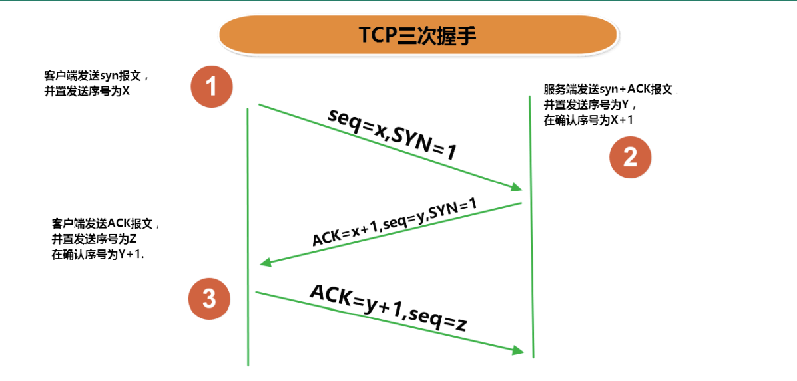


### Socket

- 利用套接字(Socket)开发网络应用程序早已被广泛的采用，以至于成为事实上的标准。
- 网络上具有唯一标识的IP地址和端口号组合在一起才能构成唯一能识别的标识符套接字。
- 通信的两端都要有Socket，是两台机器间通信的端点。
- 网络通信其实就是Socket间的通信。
- Socket允许程序把网络连接当成一个流，数据在两个Socket间通过IO传输。
- 一般主动发起通信的应用程序属客户端，等待通信请求的为服务端。
- Socket分类：
  - 流套接字（stream socket）：使用TCP提供可依赖的字节流服务
  - 数据报套接字（datagram socket）：使用UDP提供“尽力而为”的数据报服务

---

- Socket类的常用构造器：
  - `public Socket(InetAddress address,int port)`：创建一个流套接字并将其连接到指定 IP 地址的指定端口号。
  - `public Socket(String host,int port)`：创建一个流套接字并将其连接到指定主机上的指定端口号。
- Socket类的常用方法：
  - `public InputStream getInputStream()`：返回此套接字的输入流。可以用于接收网络消息
  - `public OutputStream getOutputStream()`：返回此套接字的输出流。可以用于发送网络消息
  - `public InetAddress getInetAddress()`：此套接字连接到的远程 IP 地址；如果套接字是未连接的，则返回 null。
  - `public InetAddress getLocalAddress()`：获取套接字绑定的本地地址。 即本端的IP地址
  - `public int getPort()`：此套接字连接到的远程端口号；如果尚未连接套接字，则返回 0。
  - `public int getLocalPort()`：返回此套接字绑定到的本地端口。 如果尚未绑定套接字，则返回 -1。即本端的端口号。
  - `public void close()`：关闭此套接字。套接字被关闭后，便不可在以后的网络连接中使用（即无法重新连接或重新绑定）。需要创建新的套接字对象。 关闭此套接字也将会关闭该套接字的 InputStream 和OutputStream。
  - `public void shutdownInput()`：如果在套接字上调用 shutdownInput() 后从套接字输入流读取内容，则流将返回 EOF（文件结束符）。 即不能在从此套接字的输入流中接收任何数据。
  - `public void shutdownOutput()`：禁用此套接字的输出流。对于 TCP 套接字，任何以前写入的数据都将被发送，并且后跟 TCP 的正常连接终止序列。 如果在套接字上调用 shutdownOutput() 后写入套接字输出流，则该流将抛出 IOException。 即不能通过此套接字的输出流发送任何数据。

## 14-5 TCP网络编程

### 基于Socket的TCP编程

- Java语言的基于套接字编程分为服务端编程和客户端编程，其通信模型如图所示：

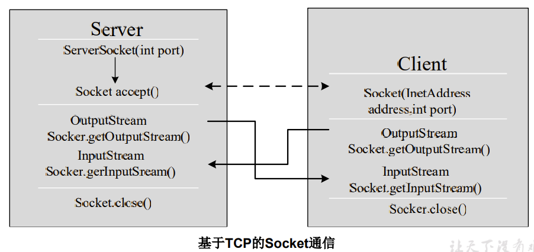

- 客户端Socket的工作过程包含以下四个基本的步骤：
  - 创建 Socket：根据指定服务端的 IP 地址或端口号构造 Socket 类对象。若服务器端响应，则建立客户端到服务器的通信线路。若连接失败，会出现异常。
  - 打开连接到 Socket 的输入/出流： 使用 getInputStream()方法获得输入流，使用getOutputStream()方法获得输出流，进行数据传输
  - 按照一定的协议对 Socket 进行读/写操作：通过输入流读取服务器放入线路的信息（但不能读取自己放入线路的信息），通过输出流将信息写入线程。
  - 关闭 Socket：断开客户端到服务器的连接，释放线路

### 客户端创建Socket对象

- 客户端程序可以使用Socket类创建对象，创建的同时会自动向服务器方发起连接。Socket的构造器是：
  - `Socket(String host, int port) throws UnknownHostException, IOException`：向服务器(域名是host。端口号为port)发起TCP连接，若成功，则创建Socket对象，否则抛出异常。
  - `Socket(InetAddress address, int port) throws IOException`：根据InetAddress对象所表示的IP地址以及端口号port发起连接。
- 客户端建立socketAtClient对象的过程就是向服务器发出套接字连接请求

### 基于Socket的TCP编程

- 服务器程序的工作过程包含以下四个基本的步骤：
  - 调用 ServerSocket(int port) ：创建一个服务器端套接字，并绑定到指定端口上。用于监听客户端的请求。
  - 调用 accept()：监听连接请求，如果客户端请求连接，则接受连接，返回通信套接字对象。
  - 调用 该Socket类对象的 getOutputStream() 和 getInputStream ()：获取输出流和输入流，开始网络数据的发送和接收。
  - 关闭ServerSocket和Socket对象：客户端访问结束，关闭通信套接字。

### 服务器建立 ServerSocket 对象

- ServerSocket 对象负责等待客户端请求建立套接字连接，类似邮局某个窗口中的业务员。也就是说，服务器必须事先建立一个等待客户请求建立套接字连接的ServerSocket对象。
- 所谓“接收”客户的套接字请求，就是accept()方法会返回一个 Socket 对象

```java
//实现TCP的网络编程：客户端发送信息给服务端，服务端将数据显示在控制台上：客户端
public void client()  {
  Socket socket = null;
  OutputStream os = null;
  try {
    //1.创建Socket对象，指明服务器端的ip和端口号
    InetAddress inet = InetAddress.getByName("192.168.14.100");
    socket = new Socket(inet,8899);
    //2.获取一个输出流，用于输出数据
    os = socket.getOutputStream();
    //3.写出数据的操作
    os.write("我是客户端".getBytes());
  } catch (IOException e) {
  } finally {
    //4.资源的关闭，以下的close都会报IOException，并且需要提前判null避免空指针，此处略
    os.close();socket.close();
  }
}
//服务端
public void server()  {
  ServerSocket ss = null;
  Socket socket = null;
  InputStream is = null;
  ByteArrayOutputStream baos = null;
  try {
    //1.创建服务器端的ServerSocket，指明自己的端口号
    ss = new ServerSocket(8899);
    //2.调用accept()表示接收来自于客户端的socket
    socket = ss.accept();
    //3.获取输入流
    is = socket.getInputStream();
    //4.读取输入流中的数据
    baos = new ByteArrayOutputStream();
    byte[] buffer = new byte[5];
    int len;
    while((len = is.read(buffer)) != -1){
        baos.write(buffer,0,len);
    }
    System.out.println(baos.toString());
    System.out.println("收到了来自于：" + socket.getInetAddress().getHostAddress() + "的数据");
  } catch (IOException e) {
  } finally {
    //5.关闭资源，以下的close都会报IOException，并且需要提前判null避免空指针，此处略
    baos.close();is.close();
    socket.close();ss.close();
  }
}
```

```java
// 客户端发送文件给服务端，服务端将文件保存在本地，并返回“发送成功”给客户端。并关闭相应的连接。涉及到的异常，也应该使用try-catch-finally处理，此处因篇幅原因且方便阅读而省略。
public void client() throws IOException {
  Socket socket = new Socket(InetAddress.getByName("127.0.0.1"),9090);
  OutputStream os = socket.getOutputStream();
  FileInputStream fis = new FileInputStream(new File("img.jpg"));
  byte[] buffer = new byte[1024];
  int len;
  while((len = fis.read(buffer)) != -1){
      os.write(buffer,0,len);
  }
  //接收来自于服务器端的数据，并显示到控制台上
  InputStream is = socket.getInputStream();
  ByteArrayOutputStream baos = new ByteArrayOutputStream();
  byte[] bufferr = new byte[20];
  int len1;
  while((len1 = is.read(buffer)) != -1){
      baos.write(buffer,0,len1);
  }
  System.out.println(baos.toString());
  socket.shutdownOutput();//关闭数据的输出，因为服务器端使用的InputStream中的read是一个阻塞式的方法，当客户端的数据的输出没有关闭时，服务器端的read循环不会终止。这也体现出了NIO（非阻塞式IO的重要性）
  fis.close();os.close();
  socket.close();baos.close();
}
public void server() throws IOException {
  ServerSocket ss = new ServerSocket(9090);
  Socket socket = ss.accept();
  InputStream is = socket.getInputStream();
  FileOutputStream fos = new FileOutputStream(new File("img1.jpg"));
  byte[] buffer = new byte[1024];
  int len;
  while((len = is.read(buffer)) != -1){
      fos.write(buffer,0,len);
  }
  System.out.println("图片传输完成");
  //6.服务器端给予客户端反馈
  OutputStream os = socket.getOutputStream();
  os.write("照片已收到！".getBytes());
  fos.close();is.close();
  socket.close();ss.close();os.close();
}
```

## 14-6 UDP网络编程

### UDP网络通信

- 类 DatagramSocket 和 DatagramPacket 实现了基于 UDP 协议网络程序。
- UDP数据报通过数据报套接字 DatagramSocket 发送和接收，**系统不保证UDP数据报一定能够安全送到目的地，也不能确定什么时候可以抵达**。
- DatagramPacket 对象封装了UDP数据报，在数据报中包含了发送端的IP地址和端口号以及接收端的IP地址和端口号。
- UDP协议中每个数据报都给出了完整的地址信息，因此无须建立发送方和接收方的连接。如同发快递包裹一样。

### DatagramSocket 类的常用方法

- `public DatagramSocket(int port)`：创建数据报套接字并将其绑定到本地主机上的指定端口。套接字将被绑定到通配符地址，IP 地址由内核来选择。
- `public DatagramSocket(int port, InetAddress laddr)`：创建数据报套接字，将其绑定到指定的本地地址。本地端口必须在 0 到 65535 之间（包括两者）。如果 IP 地址为 0.0.0.0，套接字将被绑定到通配符地址，IP 地址由内核选择。
- `public void close()`：关闭此数据报套接字。
- `public void send(DatagramPacket p)`：从此套接字发送数据报包。DatagramPacket 包含的信息指示：将要发送的数据、其长度、远程主机的 IP 地址和远程主机的端口号。
- `public void receive(DatagramPacket p)`：从此套接字接收数据报包。当此方法返回时，DatagramPacket的缓冲区填充了接收的数据。数据报包也包含发送方的 IP 地址和发送方机器上的端口号。 此方法在接收到数据报前一直阻塞。数据报包对象的 length 字段包含所接收信息的长度。如果信息比包的长度长，该信息将被截短。
- `public InetAddress getLocalAddress()`：获取套接字绑定的本地地址。
- `public int getLocalPort()`：返回此套接字绑定的本地主机上的端口号。
- `public InetAddress getInetAddress()`：返回此套接字连接的地址。如果套接字未连接，则返回 null。
- `public int getPort()`：返回此套接字的端口。如果套接字未连接，则返回 -1。

### DatagramPacket类的常用方法

- `public DatagramPacket(byte[] buf, int length)`：构造 DatagramPacket，用来接收长度为 length 的数据包。 length 参数必须小于等于 buf.length。
- `public DatagramPacket(byte[] buf, int length, InetAddress address, int port)`：构造数据报包，用来将长度为 length 的包发送到指定主机上的指定端口号。length参数必须小于等于 buf.length。
- `public InetAddress getAddress()`：返回某台机器的 IP 地址，此数据报将要发往该机器或者是从该机器接收到的。
- `public int getPort()`：返回某台远程主机的端口号，此数据报将要发往该主机或者是从该主机接收到的。
- `public byte[] getData()`：返回数据缓冲区。接收到的或将要发送的数据从缓冲区中的偏移量 offset 处开始，持续 length 长度。
- `public int getLength()`：返回将要发送或接收到的数据的长度。

UDP网络通信
- 流 程：
  1. DatagramSocket与DatagramPacket
  2. 建立发送端，接收端
  3. 建立数据包
  4. 调用Socket的发送、接收方法
  5. 关闭Socket
- 发送端与接收端是两个独立的运行程序

```java
public void sender() throws IOException {// 发送端
  DatagramSocket socket = new DatagramSocket();
  String str = "我是UDP方式发送的导弹";
  byte[] data = str.getBytes();
  InetAddress inet = InetAddress.getLocalHost();
  DatagramPacket packet = new DatagramPacket(data, 0, data.length, inet, 9090);
  socket.send(packet);
  socket.close();
}
public void receiver() throws IOException {// 接收端
  DatagramSocket socket = new DatagramSocket(9090);
  byte[] buffer = new byte[1024];
  DatagramPacket packet = new DatagramPacket(buffer, 0, buffer.length);
  socket.receive(packet);
  System.out.println(new String(packet.getData(), 0, packet.getLength()));
  socket.close();
}
```

## 14-7 URL编程

### URL类

- URL(Uniform Resource Locator)：统一资源定位符，它表示 Internet 上某一资源的地址。
- 它是一种具体的URI，即URL可以用来标识一个资源，而且还指明了如何locate这个资源。
- 通过 URL 我们可以访问 Internet 上的各种网络资源，比如最常见的 www、ftp 站点。浏览器通过解析给定的 URL 可以在网络上查找相应的文件或其他资源。
-  URL的基本结构由5部分组成：`<传输协议>://<主机名>:<端口号>/<(资源路径)文件名>#片段名?参数列表`
  - 例如: `http://192.168.1.100:8080/helloworld/index.jsp#a?username=shkstart&password=123`
  - \#片段名：即锚点，例如看小说，直接定位到章节
  - 参数列表格式：`参数名=参数值&参数名=参数值...`

URL类构造器
- 为了表示URL，java.net 中实现了类 URL。我们可以通过下面的构造器来初始化一个 URL 对象：
  - `public URL (String spec)`：通过一个表示URL地址的字符串可以构造一个URL对象。例如：`URL url = new URL ("http://www. atguigu.com/"); `
  - `public URL(URL context, String spec)`：通过基 URL 和相对 URL 构造一个 URL 对象。例如：`URL downloadUrl = new URL(url, “download.html")`
  - `public URL(String protocol, String host, String file);` 例如：`new URL("http", "www.atguigu.com", “download. html");`
  - `public URL(String protocol, String host, int port, String file);` 例如: `URL gamelan = new URL("http", "www.atguigu.com", 80, “download.html");`
- URL类的构造器都声明抛出非运行时异常，必须要对这一异常进行处理，通常是用 try-catch 语句进行捕获。

URL类常用方法
- 一个URL对象生成后，其属性是不能被改变的，但可以通过它给定的方法来获取这些属性：
  - `public String getProtocol( )`： 获取该URL的协议名
  - `public String getHost( )`： 获取该URL的主机名
  - `public String getPort( )`： 获取该URL的端口号
  - `public String getPath( )`： 获取该URL的文件路径
  - `public String getFile( )`： 获取该URL的文件名
  - `public String getQuery( )`： 获取该URL的查询名

```java
HttpURLConnection urlConnection = null;
InputStream is = null;
FileOutputStream fos = null;
try {
  URL url = new URL("http://localhost:8080/examples/beauty.jpg");
  urlConnection = (HttpURLConnection) url.openConnection();
  urlConnection.connect();
  is = urlConnection.getInputStream();
  fos = new FileOutputStream("beauty.jpg");
  byte[] buffer = new byte[1024];
  int len;
  while((len = is.read(buffer)) != -1){
    fos.write(buffer,0,len);
  }
  System.out.println("下载完成");
} catch (IOException e) {
  e.printStackTrace();
} finally {
  //关闭资源，异常处理略
  is.close();fos.close();
  urlConnection.disconnect();
}
```

### 针对HTTP协议的URLConnection类

- URL的方法 openStream()：能从网络上读取数据
- 若希望输出数据，例如向服务器端的 CGI （公共网关接口-Common Gateway Interface-的简称，是用户浏览器和服务器端的应用程序进行连接的接口）程序发送一些数据，则必须先与URL建立连接，然后才能对其进行读写，此时需要使用URLConnection 。
- URLConnection：表示到URL所引用的远程对象的连接。当与一个URL建立连接时，首先要在一个 URL 对象上通过方法 openConnection() 生成对应的 URLConnection对象。如果连接过程失败，将产生IOException. 
  - `URL netchinaren = new URL ("http://www.atguigu.com/index.shtml"); `
  - `URLConnectonn u = netchinaren.openConnection( );`

---

- 通过URLConnection对象获取的输入流和输出流，即可以与现有的CGI程序进行交互。
  - public Object getContent( ) throws IOException
  - public int getContentLength( )
  - public String getContentType( )
  - public long getDate( )
  - public long getLastModified( )
  - public InputStream getInputStream( )throws IOException
  - public OutputSteram getOutputStream( )throws IOException

### URI、URL和URN的区别

URI，是uniform resource identifier，统一资源标识符，用来唯一的标识一个资源。而URL是uniform resource locator，统一资源定位符，它是一种具体的URI，即URL可以用来标识一个资源，而且还指明了如何locate这个资源。而URN，uniform resource name，统一资源命名，是通过名字来标识资源，比如mailto:java-net@java.sun.com。也就是说，URI是以一种抽象的，高层次概念定义统一资源标识，而URL和URN则是具体的资源标识的方式。URL和URN都是一种URI。

在Java的URI中，一个URI实例可以代表绝对的，也可以是相对的，只要它符合URI的语法规则。而URL类则不仅符合语义，还包含了定位该资源的信息，因此它不能是相对的。

## 小结

- 位于网络中的计算机具有唯一的IP地址，这样不同的主机可以互相区分。
- 客户端－服务器是一种最常见的网络应用程序模型。服务器是一个为其客户端提供某种特定服务的硬件或软件。客户机是一个用户应用程序，用于访问某台服务器提供的服务。端口号是对一个服务的访问场所，它用于区分同一物理计算机上的多个服务。套接字用于连接客户端和服务器，客户端和服务器之间的每个通信会话使用一个不同的套接字。TCP协议用于实现面向连接的会话。
- Java 中有关网络方面的功能都定义在 java.net 程序包中。Java 用 InetAddress 对象表示 IP 地址，该对象里有两个字段：主机名(String) 和 IP 地址(int)。
- 类 Socket 和 ServerSocket 实现了基于TCP协议的客户端－服务器程序。Socket是客户端和服务器之间的一个连接，连接创建的细节被隐藏了。这个连接提供了一个安全的数据传输通道，这是因为 TCP 协议可以解决数据在传送过程中的丢失、损坏、重复、乱序以及网络拥挤等问题，它保证数据可靠的传送。
- 类 URL 和 URLConnection 提供了最高级网络应用。URL 的网络资源的位置来同一表示Internet 上各种网络资源。通过URL对象可以创建当前应用程序和 URL 表示的网络资源之间的连接，这样当前程序就可以读取网络资源数据，或者把自己的数据传送到网络上去。


# 第15章 Java反射机制

## 15-1 Java反射机制概述

### Java Reflection

- Reflection（反射）是被视为**动态语言**的关键，反射机制允许程序在执行期借助于Reflection API取得任何类的内部信息，并能直接操作任意对象的内部属性及方法。
- 加载完类之后，在堆内存的方法区中就产生了一个Class类型的对象（一个类只有一个Class对象），这个对象就包含了完整的类的结构信息。我们可以通过这个对象看到类的结构。这个对象就像一面镜子，透过这个镜子看到类的结构，所以，我们形象的称之为：**反射**。

正常方式：
引入需要的”包类”名称 -> 通过new实例化 -> 取得实例化对象

反射方式：
实例化对象 -> getClass()方法 -> 得到完整的“包类”名称

### 补充：动态语言 vs 静态语言

1. 动态语言
是一类在运行时可以改变其结构的语言：例如新的函数、对象、甚至代码可以被引进，已有的函数可以被删除或是其他结构上的变化。通俗点说就是**在运行时代码可以根据某些条件改变自身结构**。
  > 主要动态语言：Object-C、C#、JavaScript、PHP、Python、Erlang。
2. 静态语言
  > 与动态语言相对应的，运行时结构不可变的语言就是静态语言。如Java、C、C++。

Java不是动态语言，但Java可以称之为“**准动态语言**”。即Java有一定的动态性，我们可以利用反射机制、字节码操作获得类似动态语言的特性。Java的动态性让编程的时候更加灵活！

### Java反射机制研究及应用

- Java反射机制提供的功能
  - 在运行时判断任意一个对象所属的类
  - 在运行时构造任意一个类的对象
  - 在运行时判断任意一个类所具有的成员变量和方法
  - 在运行时获取泛型信息
  - 在运行时调用任意一个对象的成员变量和方法
  - 在运行时处理注解
  - 生成动态代理

### 反射相关的主要API

- java.lang.Class:代表一个类
- java.lang.reflect.Method:代表类的方法
- java.lang.reflect.Field:代表类的成员变量
- java.lang.reflect.Constructor:代表类的构造器
- ... ...

## 15-2 理解Class类并获取Class的实例

### Class 类

在Object类中定义了以下的方法，此方法将被所有子类继承：`public final Class getClass()`
以上的方法返回值的类型是一个Class类，此类是Java反射的源头，实际上所谓反射从程序的运行结果来看也很好理解，即：可以通过对象反射求出类的名称。

- 对象照镜子后可以得到的信息：某个类的属性、方法和构造器、某个类到底实现了哪些接口。对于每个类而言，JRE 都为其保留一个不变的 Class 类型的对象。一个 Class 对象包含了特定某个结构`(class/interface/enum/annotation/primitive type/void/[])`的有关信息。
  - Class本身也是一个类
  - Class 对象只能由系统建立对象
  - 一个加载的类在 JVM 中只会有一个Class实例
  - 一个Class对象对应的是一个加载到JVM中的一个.class文件
  - 每个类的实例都会记得自己是由哪个 Class 实例所生成
  - 通过Class可以完整地得到一个类中的所有被加载的结构
  - Class类是Reflection的根源，针对任何你想动态加载、运行的类，唯有先获得相应的Class对象

通过直接new的方式或反射的方式都可以调用公共的结构，开发中建议直接new的方式。反射的特征：动态性。反射机制与面向对象中的封装性并不矛盾。

```java
// 反射初体验：
public class Person {
  private String name;//getter/setter
  public int age;//getter/setter
  public Person(String name, int age) {
    this.name = name;
    this.age = age;
  }
  private Person(String name) {
    this.name = name;
  }
  public Person() {
    System.out.println("Person()");
  }
  public void show(){
    System.out.println("你好，我是一个人");
  }
  private String showNation(String nation){
    System.out.println("我的国籍是：" + nation);
    return nation;
  }
}
public void test() throws Exception {
  Class clazz = Person.class;
  //1.通过反射，创建Person类的对象
  Constructor cons = clazz.getConstructor(String.class,int.class);
  Person p = (Person)cons.newInstance("Tom", 12);
  //2.通过反射，调用对象指定的属性、方法
  Field age = clazz.getDeclaredField("age");
  age.set(p,10);
  Method show = clazz.getDeclaredMethod("show");
  show.invoke(p);
  //通过反射，可以调用Person类的私有结构的。比如：私有的构造器、方法、属性
  Constructor cons1 = clazz.getDeclaredConstructor(String.class);
  cons1.setAccessible(true);
  Person p1 = (Person) cons1.newInstance("Jerry");
  Field name = clazz.getDeclaredField("name");
  name.setAccessible(true);
  name.set(p1,"HanMeimei");
  //调用私有的方法
  Method showNation = clazz.getDeclaredMethod("showNation", String.class);
  showNation.setAccessible(true);
  String nation = (String) showNation.invoke(p1,"中国");//相当于String nation = p1.showNation("中国")
}
```

关于java.lang.Class类的理解
1. 类的加载过程：
   1. 程序经过javac.exe命令以后，会生成一个或多个字节码文件(.class结尾)。
   2. 接着我们使用java.exe命令对某个字节码文件进行解释运行。
   3. 相当于将某个字节码文件加载到内存中。此过程就称为类的加载。
   4. 加载到内存中的类，我们就称为运行时类，此运行时类，就作为Class的一个实例。
2. 换句话说，Class的实例就对应着一个运行时类。
3. 加载到内存中的运行时类，会缓存一定的时间。在此时间之内，我们可以通过不同的方式来**获取**此运行时类。

Class类的常用方法

| 方法名                                             | 功能说明                                                            |
| -------------------------------------------------- | ------------------------------------------------------------------- |
| static Class forName(String name)                  | 返回指定类名 name 的 Class 对象                                     |
| Object newInstance()                               | 调用缺省构造函数，返回该Class对象的一个实例                         |
| getName()                                          | 返回此Class对象所表示的实体（类、接口、数组类、基本类型或void）名称 |
| Class getSuperClass()                              | 返回当前Class对象的父类的Class对象                                  |
| Class \[\] getInterfaces()                         | 获取当前Class对象的接口                                             |
| ClassLoader getClassLoader()                       | 返回该类的类加载器                                                  |
| Class getSuperclass()                              | 返回表示此Class所表示的实体的超类的Class                            |
| Constructor\[\] getConstructors()                  | 返回一个包含某些Constructor对象的数组                               |
| Field\[\] getDeclaredFields()                      | 返回Field对象的一个数组                                             |
| Method getMethod(String name,Class ... paramTypes) | 返回一个Method对象，此对象的形参类型为paramType                     |

获取Class类的实例(四种方法)
1. 前提:若已知具体的类，通过调用运行时类的class属性获取，该方法**最为安全可靠，程序性能最高**
    `Class clazz = String.class;`
2. 前提:已知某个类的实例，调用该实例的getClass()方法获取Class对象
    `Class clazz = "www.atguigu.com".getClass();`
3. 前提:已知一个类的全类名，且该类在类路径下，可通过Class类的静态方法forName()获取，可能抛出ClassNotFoundException（常用）
    `Class clazz = Class.forName("java.lang.String");`
4. 其他方式（不做要求）
```java
ClassLoader c = this.getClass().getClassLoader(); // 本类名.class.getClassLoader()
Class clazz = c.loadClass("类的全类名");
```

哪些类型可以有Class对象？
1. class：外部类，成员(成员内部类，静态内部类)，局部内部类，匿名内部类（对应Object）
2. interface：接口
3. `[]`：数组（对应java.lang.reflect.Array）
4. enum：枚举（对应Enum）
5. annotation：注解@interface
6. primitive type：基本数据类型（对应包装类）
7. void：（对应Void）

```java
//Class实例可以是哪些结构的说明：
@Test
public void test(){
    Class c1 = Object.class;
    Class c2 = Comparable.class;
    Class c3 = String[].class;
    Class c4 = int[][].class;
    Class c5 = ElementType.class;
    Class c6 = Override.class;
    Class c7 = int.class;
    Class c8 = void.class;
    Class c9 = Class.class;
    int[] a = new int[10];
    int[] b = new int[100];
    Class c10 = a.getClass();
    Class c11 = b.getClass();
    // 只要数组的元素类型与维度一样，就是同一个Class
    System.out.println(c10 == c11);
}
```

## 15-3 类的加载与ClassLoader的理解

### 了解：类的加载过程

当程序主动使用某个类时，如果该类还未被加载到内存中，则系统会通过如下三个步骤来对该类进行初始化。

1. 类的加载(Load)
   - 将类的class文件读入内存，并为之创建一个java.lang.Class对象。此过程由类加载器完成
   - 加载：将class文件字节码内容加载到内存中，并将这些静态数据转换成方法区的运行时数据结构，然后生成一个代表这个类的java.lang.Class对象，作为方法区中类数据的访问入口（即引用地址）。所有需要访问和使用类数据只能通过这个Class对象。这个加载的过程需要类加载器参与。
2. 类的链接(Link)
   - 将类的二进制数据合并到JRE中
   - 链接：将Java类的二进制代码合并到JVM的运行状态之中的过程。
     - 验证：确保加载的类信息符合JVM规范，例如：以cafe开头，没有安全方面的问题
     - 准备：正式为类变量（static）分配内存并**设置类变量默认初始值**的阶段，这些内存都将在方法区中进行分配。
     - 解析：虚拟机常量池内的符号引用（常量名）替换为直接引用（地址）的过程。
3. 类的初始化(Initialize)
   - JVM负责对类进行初始化
   - 初始化：
     - 执行类构造器`<clinit>()`方法的过程。类构造器`<clinit>()`方法是由编译期自动收集类中所有类变量的赋值动作和静态代码块中的语句合并产生的。（类构造器是构造类信息的，不是构造该类对象的构造器）。
     - 当初始化一个类的时候，如果发现其父类还没有进行初始化，则需要先触发其父类的初始化。
     - 虚拟机会保证一个类的`<clinit>()`方法在多线程环境中被正确加锁和同步。


### 了解：什么时候会发生类初始化？

- 类的主动引用（一定会发生类的初始化）
  - 当虚拟机启动，先初始化main方法所在的类
  - new一个类的对象
  - 调用类的静态成员（除了final常量）和静态方法
  - 使用java.lang.reflect包的方法对类进行反射调用
  - 当初始化一个类，如果其父类没有被初始化，则先会初始化它的父类
- 类的被动引用（不会发生类的初始化）
  - 当访问一个静态域时，只有真正声明这个域的类才会被初始化
    - 当通过子类引用父类的静态变量，不会导致子类初始化
  - 通过数组定义类引用，不会触发此类的初始化
  - 引用常量不会触发此类的初始化（常量在链接阶段就存入调用类的常量池中了）

类加载器的作用：
- 类加载的作用：将class文件字节码内容加载到内存中，并将这些静态数据**转换成方法区的运行时数据结构**，然后在堆中生成一个代表这个类的java.lang.Class对象，作为方法区中类数据的访问入口。
- 类缓存：标准的JavaSE类加载器可以按要求查找类，但一旦某个类被加载到类加载器中，它将维持加载（缓存）一段时间。不过JVM垃圾回收机制可以回收这些Class对象。

### 了解：ClassLoader

类加载器作用是用来把类(class)装载进内存的。JVM 规范定义了如下类型的类的加载器。


```java
//1.获取一个系统类加载器
ClassLoader classloader = ClassLoader.getSystemClassLoader();
//2.获取系统类加载器的父类加载器，即扩展类加载器
classloader = classloader.getParent();
//3.获取扩展类加载器的父类加载器，即引导类加载器
classloader = classloader.getParent();
//4.测试当前类由哪个类加载器进行加载
classloader = Class.forName("exer.ClassloaderDemo").getClassLoader();
//5.测试JDK提供的Object类由哪个类加载器加载
classloader = Class.forName("java.lang.Object").getClassLoader();
//6.关于类加载器的一个主要方法：getResourceAsStream(String str):获取类路径下的指定文件的输入流
InputStream in = null;
in = this.getClass().getClassLoader().getResourceAsStream("exer\\test.properties");
```

```java
// 对于自定义类，使用系统类加载器进行加载
ClassLoader classLoader = ClassLoaderTest.class.getClassLoader();
// 调用系统类加载器的getParent()：获取扩展类加载器
ClassLoader classLoader1 = classLoader.getParent();
// 调用扩展类加载器的getParent()：无法获取引导类加载器，引导类加载器主要负责加载java的核心类库，无法加载自定义类的。
ClassLoader classLoader2 = classLoader1.getParent();
ClassLoader classLoader3 = String.class.getClassLoader();// 也获取不到引导类加载器，返回null
```

```java
// 使用Properties读取配置文件。
Properties pros = new Properties();
// 读取配置文件的方式一：此时的文件默认在当前的module下。
FileInputStream fis = new FileInputStream("jdbc.properties");
FileInputStream fis = new FileInputStream("src\\jdbc.properties");
pros.load(fis);
// 读取配置文件的方式二：使用ClassLoader。配置文件默认识别为：当前module的src下
ClassLoader classLoader = ClassLoaderTest.class.getClassLoader();
InputStream is = classLoader.getResourceAsStream("jdbc.properties");
pros.load(is);
String user = pros.getProperty("user");
String password = pros.getProperty("password");
```

## 15-4 创建运行时类的对象

创建类的对象：调用Class对象的newInstance()方法，调用此方法，创建对应的运行时类的对象。内部调用了运行时类的空参的构造器。`The call clazz.newInstance() can be replaced by clazz.getDeclaredConstructor().newInstance() （The method newInstance() from the type Class is deprecated since version 9）`

要想此方法正常的创建运行时类的对象，要求：1）运行时类必须提供空参的构造器。2）空参的构造器的访问权限需要足够。通常，设置为public。

没有无参的构造器并非不能创建对象。只要在操作的时候明确的调用类中的构造器，并将参数传递进去之后，才可以实例化操作。

步骤如下：
1. 通过Class类的getDeclaredConstructor(Class ... parameterTypes)取得本类的指定形参类型的构造器
2. 向构造器的形参中传递一个对象数组进去，里面包含了构造器中所需的各个参数。
3. 通过Constructor实例化对象。

在JavaBean中要求提供一个public的空参构造器。原因：
1. 便于通过反射，创建运行时类的对象
2. 便于子类继承此运行时类时，默认调用super()时，保证父类有此构造器

```java
//1.根据全类名获取对应的Class对象
String name = "atguigu.java.Person";
Class clazz = Class.forName(name);
//2.调用指定参数结构的构造器，生成Constructor的实例
Constructor con = clazz.getConstructor(String.class,Integer.class);
//3.通过Constructor的实例创建对应类的对象，并初始化类属性
Person p2 = (Person) con.newInstance("Peter",20);
System.out.println(p2);
```

## 15-5 获取运行时类的完整结构

Field、Method、Constructor、Superclass、Interface、Annotation
- 实现的全部接口
- 所继承的父类
- 全部的构造器
- 全部的方法
- 全部的Field

使用反射可以取得：
1. 实现的全部接口
   - `public Class<?>[] getInterfaces()`：获取该Class对象所表示的类或接口实现的接口。（不包含父类实现的接口）
   - 没有相应的declared-getter，获取父类实现的接口应使用：`clazz.getSuperclass().getInterfaces();`
2. 所继承的父类
   - `public Class<? Super T> getSuperclass()`：返回表示此Class所表示的实体（类、接口、基本类型）的父类的Class。
   - `public Type getGenericSuperclass()`：返回表示此Class所表示的实体（类、接口、基本类型）的带泛型的父类的Type（与Class的联系：Class实现了Type接口）。
3. 全部的构造器
   - `public Constructor<T>[] getConstructors()`：返回此Class对象所表示的类的所有public构造方法。（不包含父类中的）
   - `public Constructor<T>[] getDeclaredConstructors()`：返回此Class对象表示的类声明的所有构造方法。（不包含父类中的）
    > Constructor类中：  
    取得修饰符: `public int getModifiers();`  
    取得方法名称: `public String getName();`  
    取得参数的类型：`public Class<?>[] getParameterTypes();`
4. 全部的方法
   - `public Method[] getMethods()`：返回此Class对象所表示的类或接口的声明为public访问权限的方法（包含父类中声明的方法）
   - `public Method[] getDeclaredMethods()`：返回此Class对象所表示的类或接口的全部方法（不包含父类中声明的方法）
    > Method类中：  
    `public Annotation[] getAnnotations()`：取得全部的注解，注意只有声明为@Retention(RetentionPolicy.RUNTIME)的注解才能在运行时通过反射获取到  
    `public int getModifiers()`：取得全部的修饰符  
    `public Class<?> getReturnType()`：取得返回值类型，void是Void的实例，也可以获取到  
    `public String getName()`：取得方法名  
    `public Class<?>[] getParameterTypes()`：取得全部的参数（形参列表）  
    `public Class<?>[] getExceptionTypes()`：取得异常信息
5. 全部的Field
   - `public Field[] getFields()`: 返回此Class对象所表示的类或接口的声明为public访问权限的Field。（包含父类中声明的属性）
   - `public Field[] getDeclaredFields()`: 返回此Class对象所表示的类或接口的全部Field。（不包含父类中声明的属性）
    > Field方法中：  
    `public int getModifiers()`: 以整数形式返回此Field的修饰符，可以使用Modifier中的toString转化为方便查看的修饰符字符串。  
    `public Class<?> getType()`: 得到Field的属性类型  
    `public String getName()`: 返回Field的名称。  
6. Annotation相关
   - `public <A extends Annotation> A getAnnotation(Class<A> annotationClass)`
   - `public Annotation[] getAnnotations()`
   - `public Annotation[] getDeclaredAnnotations()`
7. 泛型相关
   - `获取父类泛型类型：Type getGenericSuperclass()`
   - 泛型类型：ParameterizedType
   - 获取实际的泛型类型参数数组：`getActualTypeArguments()`
8. 包相关
   - `Package getPackage()`：获取运行时类所在的包

```java
// 代码：逻辑性代码(真正理解) vs 功能性代码(会用就行)
// 父类：获取运行时类的带泛型的父类的泛型
Type genericSuperclass = clazz.getGenericSuperclass();
ParameterizedType paramType = (ParameterizedType) genericSuperclass;
Type[] actualTypeArguments = paramType.getActualTypeArguments();// 获取泛型类型
// Method：一个方法可能包含如下部分
@注解
修饰符 返回值类型 方法名(参数类型1 形参名1,...) throws 异常类型{}
// Field：定义在java.lang.reflect.Modifier中的toString源码
public static String toString(int mod) {
  StringJoiner sj = new StringJoiner(" ");
  if ((mod & PUBLIC) != 0)        sj.add("public");
  if ((mod & PROTECTED) != 0)     sj.add("protected");
  if ((mod & PRIVATE) != 0)       sj.add("private");
  /* Canonical order */
  if ((mod & ABSTRACT) != 0)      sj.add("abstract");
  if ((mod & STATIC) != 0)        sj.add("static");
  if ((mod & FINAL) != 0)         sj.add("final");
  if ((mod & TRANSIENT) != 0)     sj.add("transient");
  if ((mod & VOLATILE) != 0)      sj.add("volatile");
  if ((mod & SYNCHRONIZED) != 0)  sj.add("synchronized");
  if ((mod & NATIVE) != 0)        sj.add("native");
  if ((mod & STRICT) != 0)        sj.add("strictfp");
  if ((mod & INTERFACE) != 0)     sj.add("interface");
  return sj.toString();
}
```

### 小结：

1. 在实际的操作中，取得类的信息的操作代码，并不会经常开发。
2. 一定要熟悉java.lang.reflect包的作用，反射机制。
3. 如何取得属性、方法、构造器的名称，修饰符等。

## 15-6 调用运行时类的指定结构

1. 调用指定方法
   1. 通过反射，调用类中的方法，通过Method类完成。步骤：
      1. 通过Class类的`getMethod(String name, Class...parameterTypes)`方法取得一个Method对象，并设置此方法操作时所需要的参数类型。
      2. 之后使用`Object invoke(Object obj, Object[] args)`进行调用，并向方法中传递要设置的obj对象的参数信息。
   2. 关于`Object invoke(Object obj, Object ... args)` 的说明：
      1. Object 对应原方法的返回值，若原方法无返回值，此时返回null
      2. 若原方法若为静态方法，此时形参Object obj可为null
      3. 若原方法形参列表为空，则Object[] args为null
      4. 若原方法声明为private,则需要在调用此invoke()方法前，显式调用方法对象的setAccessible(true)方法，将可访问private的方法。
   ```java
   Class<Person> clazz = Person.class;
   // 创建运行时类的对象
   Person p = (Person) clazz.getDeclaredConstructor().newInstance();
   // 1.获取指定的某个方法getDeclaredMethod():参数1 ：指明获取的方法的名称 参数2：指明获取的方法 的形参列表
   Method show = clazz.getDeclaredMethod("show", String.class);
   // 2.保证当前方法是可访问的
   show.setAccessible(true);
   // 3. 调用方法的invoke():参数1：方法的调用者 参数2：给方法形参赋值的实参 invoke()的返回值即为对 应类中调用的方法的返回值。
   Object returnValue = show.invoke(p, "CHN"); // String nation = p.show("CHN");
   // 调用静态方法
   Method showDesc = clazz.getDeclaredMethod("showDesc");
   showDesc.setAccessible(true);
   // 如果调用的运行时类中的方法没有返回值，则此invoke()返回null
   // Object returnVal = showDesc.invoke(null);
   Object returnVal = showDesc.invoke(Person.class);
   ```
2. 调用指定属性
   1. 在反射机制中，可以直接通过Field类操作类中的属性，通过Field类提供的set()和get()方法就可以完成设置和取得属性内容的操作。
   2. `public Field getField(String name)`： 返回此Class对象表示的类或接口的指定的public的Field。（通常不采用此方法）
   3. `public Field getDeclaredField(String name)`： 返回此Class对象表示的类或接口的指定的Field。
   4. 在Field中：
      1. `public Object get(Object obj)`： 取得指定对象obj上此Field的属性内容
      2. `public void set(Object obj, Object value)`： 设置指定对象obj上此Field的属性内容
   ```java
   Class<Person> clazz = Person.class;
   //创建运行时类的对象
   Person p = clazz.getDeclaredConstructor().newInstance();
   //1. getDeclaredField(String fieldName):获取运行时类中指定变量名的属性
   Field name = clazz.getDeclaredField("name");
   //2.保证当前属性是可访问的
   name.setAccessible(true);
   //3.获取、设置指定对象的此属性值
   name.set(p,"Tom");
   ```
3. 调用指定构造器（不常用）
   ```java
   Class<Person> clazz = Person.class;
   // 1.获取指定的构造器 getDeclaredConstructor():参数：指明构造器的参数列表
   Constructor<Person> constructor = clazz.getDeclaredConstructor(String.class);
   // 2.保证此构造器是可访问的
   constructor.setAccessible(true);
   // 3.调用此构造器创建运行时类的对象
   Person per = constructor.newInstance("Tom");
   ```

### 关于setAccessible方法的使用

- Method和Field、Constructor对象都有setAccessible()方法。
- setAccessible启动和禁用访问安全检查的开关。
- 参数值为true则指示反射的对象在使用时应该取消Java语言访问检查。
  - 提高反射的效率。如果代码中必须用反射，而该句代码需要频繁的被调用，那么请设置为true。
  - 使得原本无法访问的私有成员也可以访问
- 参数值为false则指示反射的对象应该实施Java语言访问检查。

```java
// 本章测试中用的Person类声明如下：
@Target({TYPE, FIELD, METHOD, PARAMETER, CONSTRUCTOR, LOCAL_VARIABLE})
@Retention(RetentionPolicy.RUNTIME)
public @interface MyAnnotation {
    String value() default "hello";
}
public interface MyInterface {void info();}
public class Creature<T> implements Serializable {
    private char gender;
    public double weight;
    private void breath(){System.out.println("生物呼吸");}
    public void eat(){System.out.println("生物吃东西");}
}
@MyAnnotation(value = "hi")
public class Person extends Creature<String> implements Comparable<String>, MyInterface {
    private String name;
    int age;
    public int id;
    public Person() {}
    @MyAnnotation(value = "abc")
    private Person(String name) {this.name = name;}
    Person(String name, int age) {
        this.name = name;
        this.age = age;
    }
    @MyAnnotation
    private String show(String nation) {
        System.out.println("我的国籍是：" + nation);
        return nation;
    }
    public String display(String interests, int age) throws NullPointerException, ClassCastException {
        return interests + age;
    }
    @Override
    public void info() {
        System.out.println("我是一个人");
    }
    @Override
    public int compareTo(String o) {return 0;}
    private static void showDesc() {
        System.out.println("我是一个可爱的人");
    }
    @Override
    public String toString() {
        return "Person{" + "name='" + name + '\'' + ", age=" + age + ", id=" + id + '}';
    }
}
```

## 15-7 反射的应用：动态代理(了解)

- 代理设计模式的原理: 
使用一个代理将对象包装起来, 然后用该代理对象取代原始对象。任何对原始对象的调用都要通过代理。代理对象决定是否以及何时将方法调用转到原始对象上。
-  之前为大家讲解过代理机制的操作，属于静态代理，特征是代理类和目标对象的类都是在编译期间确定下来，不利于程序的扩展。同时，每一个代理类只能为一个接口服务，这样一来程序开发中必然产生过多的代理。**最好可以通过一个代理类完成全部的代理功能。**
- 动态代理是指客户通过代理类来调用其它对象的方法，并且是在程序运行时根据需要动态创建目标类的代理对象。
- 动态代理使用场合:
  - 调试
  - 远程方法调用
- 动态代理相比于静态代理的优点：
抽象角色中（接口）声明的所有方法都被转移到调用处理器一个集中的方法中处理，这样，我们可以更加灵活和统一的处理众多的方法。

```java
// 静态代理特点：代理类和被代理类在编译期间，就确定下来了。
interface ClothFactory{void produceCloth();}
//代理类
class ProxyClothFactory implements ClothFactory{
  private ClothFactory factory;//用被代理类对象进行实例化
  public ProxyClothFactory(ClothFactory factory){
    this.factory = factory;
  }
  @Override
  public void produceCloth() {
    // 代理工厂做一些准备工作
    factory.produceCloth();
    // 代理工厂做一些后续的收尾工作
  }
}
//被代理类
class NikeClothFactory implements ClothFactory{
  @Override
  public void produceCloth() {}//生产
}
public class StaticProxyTest {
  public static void main(String[] args) {
    ClothFactory nike = new NikeClothFactory();//创建被代理类的对象
    ClothFactory proxyClothFactory = new ProxyClothFactory(nike);//创建代理类的对象
    proxyClothFactory.produceCloth();
  }
}
```

### Java动态代理相关API

- Proxy ：专门完成代理的操作类，是所有动态代理类的父类。通过此类为一个或多个接口动态地生成实现类。
- 提供用于创建动态代理类和动态代理对象的静态方法
  - `static Class<?> getProxyClass(ClassLoader loader, Class<?>... interfaces)`： 创建一个动态代理类所对应的Class对象
  - `static Object newProxyInstance(ClassLoader loader, Class<?>[] interfaces, InvocationHandler h)`： 直接创建一个动态代理对象
    - loader:类加载器
    - interfaces:得到被代理类实现的全部接口
    - h:得到InvocationHandler接口的实现类实例

### 动态代理步骤

1. 创建一个实现接口InvocationHandler的类，它必须实现invoke方法，以完成代理的具体操作。
  ```java
  public Object invoke(Object theProxy, Method method, Object[] params) throws Throwable{}
  ```
   - theProxy:代理类的对象
   - method:要调用的方法
   - params:方法调用时所需要的参数
2. 创建被代理的类以及接口
3. 通过Proxy的静态方法
  ```java
  newProxyInstance(ClassLoader loader, Class[] interfaces, InvocationHandler h) 创建
  一个Subject接口代理
  RealSubject target = new RealSubject();
  // Create a proxy to wrap the original implementation
  DebugProxy proxy = new DebugProxy(target);
  // Get a reference to the proxy through the Subject interface
  Subject sub = (Subject) Proxy.newProxyInstance(
  Subject.class.getClassLoader(),new Class[] { Subject.class }, proxy);
  ```
4. 通过 Subject代理调用RealSubject实现类的方法

```java
interface Human {// 动态代理的举例
  String getBelief();
  void eat(String food);
}
class SuperMan implements Human {// 被代理类
  @Override
  public String getBelief() {
    return "I believe I can fly!";
  }
  @Override
  public void eat(String food) {
    System.out.println("我喜欢吃" + food);
  }
}
class HumanUtil {
  public void method1() {}// 通用方法一
  public void method2() {}// 通用方法二
}
// 要想实现动态代理，需要解决的问题？
// 问题一：如何根据加载到内存中的被代理类，动态的创建一个代理类及其对象。
// 问题二：当通过代理类的对象调用方法a时，如何动态的去调用被代理类中的同名方法a。
class ProxyFactory {
  // 调用此方法，返回一个代理类的对象。解决问题一
  public static Object getProxyInstance(Object obj) {// obj:被代理类的对象
    MyInvocationHandler handler = new MyInvocationHandler();
    handler.bind(obj);
    return Proxy.newProxyInstance(obj.getClass().getClassLoader(), obj.getClass().getInterfaces(), handler);
  }
}
class MyInvocationHandler implements InvocationHandler {
  private Object obj;// 需要使用被代理类的对象进行赋值
  public void bind(Object obj) {
    this.obj = obj;
  }
  // 当我们通过代理类的对象，调用方法a时，就会自动的调用如下的方法：invoke()
  // 将被代理类要执行的方法a的功能就声明在invoke()中
  @Override
  public Object invoke(Object proxy, Method method, Object[] args) throws Throwable {
    HumanUtil util = new HumanUtil();
    util.method1();
    // method:即为代理类对象调用的方法，此方法也就作为了被代理类对象要调用的方法
    Object returnValue = method.invoke(obj, args);// obj:被代理类的对象
    util.method2();
    // 上述方法的返回值就作为当前类中的invoke()的返回值。
    return returnValue;
  }
}
public class ProxyTest {
  public static void main(String[] args) {
    SuperMan superMan = new SuperMan();
    // proxyInstance:代理类的对象
    Human proxyInstance = (Human) ProxyFactory.getProxyInstance(superMan);
    // 当通过代理类对象调用方法时，会自动的调用被代理类中同名的方法
    String belief = proxyInstance.getBelief();
    proxyInstance.eat("四川麻辣烫");
    NikeClothFactory nikeClothFactory = new NikeClothFactory();
    ClothFactory proxyClothFactory = (ClothFactory) ProxyFactory.getProxyInstance(nikeClothFactory);
    proxyClothFactory.produceCloth();
  }
}
```

### 动态代理与AOP（Aspect Orient Programming)

前面介绍的Proxy和InvocationHandler，很难看出这种动态代理的优势，下面介绍一种更实用的动态代理机制


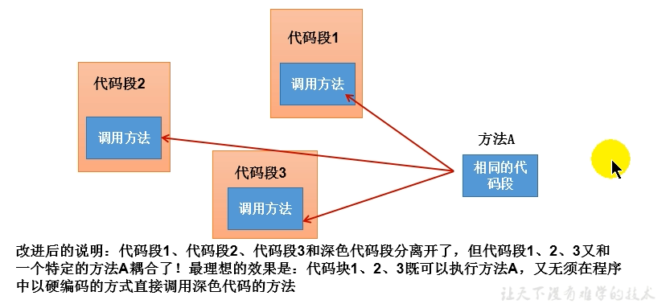

- 使用Proxy生成一个动态代理时，往往并不会凭空产生一个动态代理，这样没有太大的意义。通常都是为指定的目标对象生成动态代理
- 这种动态代理在AOP(面向切面编程)中被称为AOP代理，AOP代理可代替目标对象，AOP代理包含了目标对象的全部方法。但AOP代理中的方法与目标对象的方法存在差异：AOP代理里的方法可以在执行目标方法之前、之后插入一些通用处理


  > JVM中类的装载是由ClassLoader和它的子类来实现的,Java ClassLoader 是一个重要的Java运行时系统组件。它负责在运行时查找和装入类文件的类。


# 第16章 Java8的其它新特性

Java 8新特性简介  
- Java 8 (又称为 jdk 1.8) 是 Java 语言开发的一个主要版本。  
- Java 8 是oracle公司于2014年3月发布，可以看成是自Java 5 以来最具革命性的版本。Java 8为Java语言、编译器、类库、开发工具与JVM带来了大量新特性。
  - 速度更快
  - 代码更少(增加了新的语法：Lambda 表达式)
  - 强大的 Stream API
  - 便于并行
  - 最大化减少空指针异常：Optional
  - Nashorn引擎，允许在JVM上运行JS应用（JVM：目前最强大的虚拟机）

---

- 函数式接口
- Lambda表达式
- 方法引用/构造器引用
- Stream API（并行流、串行流）
- 接口的增强（静态方法、默认方法）
- Optional类
- 新的时间和日期API
- 其他新特性
  - 重复注解
  - 类型注解
  - 通用目标类型推断
  - JDK的更新
    - 集合的流式操作
    - 并发
    - Arrays
    - Number和Math
    - IO/NIO的改进
    - Reflection获取形参名
    - String：jion()
    - Files
  - 新编译工具：jjs（在JVM中运行js程序）、jdeps
  - JVM中Metaspace取代PermGen空间

### 并行流与串行流

**并行流**就是把一个内容分成多个数据块，并用不同的线程分别处理每个数据块的流。相比较串行的流，并行的流可以很大程度上提高程序的执行效率。

Java 8 中将并行进行了优化，我们可以很容易的对数据进行并行操作。Stream API 可以声明性地通过 parallel() 与 sequential() 在并行流与顺序流之间进行切换。

## 16-1 Lambda表达式

Lambda 是一个匿名函数，我们可以把 Lambda 表达式理解为是一段可以传递的代码（将代码像数据一样进行传递）。使用它可以写出更简洁、更灵活的代码。作为一种更紧凑的代码风格，使Java的语言表达能力得到了提升。Lambda表达式的本质：作为函数式接口的实例。（在python中本质是个函数）

### 16.1 Lambda 表达式：语法

Lambda 表达式：在Java 8 语言中引入的一种新的语法元素和操作符。这个操作符为 "->" ， 该操作符被称为 Lambda 操作符或箭头操作符。它将 Lambda 分为两个部分：
- 左侧：指定了 Lambda 表达式需要的形式参数列表
- 右侧：指定了 Lambda 体，是抽象方法的实现逻辑，（其实就是重写的抽象方法的方法体），也即Lambda 表达式要执行的功能。

语法格式一：无参，无返回值

```java
Runnable r1 = () -> {System.out.println("Hello Lambda!");};
```

语法格式二：Lambda 需要一个参数，但是没有返回值。

```java
Consumer<String> con = (String str) -> {System.out.println(str);};
```

语法格式三：数据类型可以省略，因为可由编译器推断得出，称为"类型推断"

```java
Consumer<String> con = (str) -> {System.out.println(str);};
```

小结目前遇到的类型推断：

```java
int[] arr = {1,2,3};//数组类型推断
ArrayList<String> list = new ArrayList<>();//泛型类型推断
Consumer<String> con = (str) -> {System.out.println(str);};//参数类型推断
```

语法格式四：Lambda 若只需要一个参数时，参数的小括号可以省略

```java
Consumer<String> con = str -> {System.out.println(str);};
Consumer<String> con = System.out::println;
```

语法格式五：Lambda 需要两个或以上的参数，多条执行语句，并且可以有返回值

```java
Comparator<Integer> com = (x,y)->{
    return Integer.compare(x,y);
};
```

语法格式六：当 Lambda 体只有一条语句时，return 与大括号若有，都可以省略

```java
Comparator<Integer> com = (x,y) -> Integer.compare(x,y);
Comparator<Integer> com = Integer::compare;//方法引用
```

总结：
- ->左边：lambda形参列表的参数类型可以省略(类型推断)；如果lambda形参列表只有一个参数，其一对()也可以省略
- ->右边：lambda体应该使用一对{}包裹；如果lambda体只有一条执行语句（可能是return语句），省略这一对{}和return关键字

### 类型推断

上述 Lambda 表达式中的参数类型都是由编译器推断得出的。Lambda 表达式中无需指定类型，程序依然可以编译，这是因为 javac 根据程序的上下文，在后台推断出了参数的类型。Lambda 表达式的类型依赖于上下文环境，是由编译器推断出来的。这就是所谓的"类型推断"。

## 16-2 函数式(Functional)接口

什么是函数式(Functional)接口
- 只包含一个抽象方法的接口，称为函数式接口。
- 你可以通过 Lambda 表达式来创建该接口的对象。（若 Lambda 表达式抛出一个受检异常(即：非运行时异常)，那么该异常需要在目标接口的抽象方法上进行声明）。
- 我们可以在一个接口上使用 @FunctionalInterface 注解，这样做可以检查它是否是一个函数式接口。同时 javadoc 也会包含一条声明，说明这个接口是一个函数式接口。
- 在java.util.function包下定义了Java 8 的丰富的函数式接口

### 如何理解函数式接口

- Java从诞生日起就是一直倡导"一切皆对象"，在Java里面面向对象(OOP)编程是一切。但是随着python、scala等语言的兴起和新技术的挑战，Java不得不做出调整以便支持更加广泛的技术要求，也即java不但可以支持OOP还可以支持OOF（面向函数编程）
- 在函数式编程语言当中，函数被当做一等公民对待。在将函数作为一等公民的编程语言中，Lambda表达式的类型是函数。但是在Java8中，有所不同。在Java8中，Lambda表达式是对象，而不是函数，它们必须依附于一类特别的对象类型——函数式接口。
- 简单的说，在Java8中，Lambda表达式就是一个函数式接口的实例。这就是Lambda表达式和函数式接口的关系。也就是说，只要一个对象是函数式接口的实例，那么该对象就可以用Lambda表达式来表示。
- 所以以前用匿名实现类表示的现在都可以用Lambda表达式来写。当需要自定义函数式接口时，可以先查看API已经定义过的函数式接口，如果已经定义，则无需再次定义了。

作为参数传递 Lambda 表达式：为了将 Lambda 表达式作为参数传递，接收Lambda 表达式的参数类型必须是与该 Lambda 表达式兼容的函数式接口的类型。

### Java 内置四大核心函数式接口

| 函数式接口                 | 参数类型 | 返回类型 | 用途                                                   | 包含方法          |
| -------------------------- | -------- | -------- | ------------------------------------------------------ | ----------------- |
| Consumer\<T\>消费型接口    | T        | void     | 对类型为T的对象应用操作                                | void accept(T t)  |
| Supplier\<T\>供给型接口    | 无       | T        | 返回类型为T的对象                                      | T get()           |
| Function\<T, R\>函数型接口 | T        | R        | 对类型为T的对象应用操作，并返回结果。结果是R类型的对象 | R apply(T t)      |
| Predicate\<T\>断定型接口   | T        | boolean  | 确定类型为T的对象是否满足某约束，并返回                | boolean test(T t) |

```java
public void happyTime(double money, Consumer<Double> con) {
  con.accept(money);
}
@Test
public void test1() {
  happyTime(400, money -> System.out.println("学习太累了，去天上人间喝了口水，价格为：" + money));
}
// 根据给定的规则，过滤集合中的字符串。此规则由Predicate的方法决定
public List<String> filterString(List<String> list, Predicate<String> pre) {
  ArrayList<String> filterList = new ArrayList<>();
  for (String s : list) {
    if (pre.test(s))
      filterList.add(s);
  }
  return filterList;
}
@Test
public void test2() {
  List<String> list = Arrays.asList("北京", "南京", "天津", "东京", "西京", "普京");
  List<String> filterStrs = filterString(list, s -> s.contains("京"));
}
```

其他接口

| 函数式接口                             | 参数类型 | 返回类型 | 用途                                             | 包含方法              |
| -------------------------------------- | -------- | -------- | ------------------------------------------------ | --------------------- |
| BiFunction\<T, U, R\>                  | T, U     | R        | 对类型为 T, U 参数应用操作，返回 R 类型的结果。  | R apply(T t, U u);    |
| UnaryOperator\<T\>(Function子接口)     | T        | T        | 对类型为T的对象进行一元运算，并返回T类型的结果。 | T apply(T t);         |
| BinaryOperator\<T\>(BiFunction 子接口) | T, T     | T        | 对类型为T的对象进行二元运算，并返回T类型的结果。 | T apply(T t1, T t2);  |
| BiConsumer\<T, U\>                     | T, U     | void     | 对类型为T, U 参数应用操作。                      | void accept(T t, U u) |
| BiPredicate\<T,U\>                     | T,U      | boolean  |                                                  | boolean test(T t,U u) |
| ToIntFunction\<T\>                     | T        | int      | 计算int值的函数                                  |
| ToLongFunction\<T\>                    | T        | long     | 计算long值的函数                                 |
| ToDoubleFunction\<T\>                  | T        | double   | 计算double值的函数                               |
| IntFunction\<R\>                       | int      | R        | 参数为int类型的函数                              |
| LongFunction\<R\>                      | long     | R        | 参数为long类型的函数                             |
| DoubleFunction\<R\>                    | double   | R        | 参数为double类型的函数                           |

## 16-3 方法引用与构造器引用

### 方法引用(Method References)

- 当要传递给Lambda体的操作，已经有实现的方法了，可以使用方法引用！
- 方法引用可以看做是Lambda表达式深层次的表达。换句话说，方法引用就是Lambda表达式，也就是函数式接口的一个实例，通过方法的名字来指向一个方法，可以认为是Lambda表达式的一个**语法糖**。
- 要求：实现接口的抽象方法的参数列表和返回值类型，必须与方法引用的方法的参数列表和返回值类型保持一致！
- 格式：使用操作符 "::" 将类(或对象) 与 方法名分隔开来。（类(或对象) :: 方法名）
- 如下三种主要使用情况：
  - 对象::实例方法名
  - 类::静态方法名
  - 类::实例(非静态)方法名

注意：当函数式接口方法的第一个参数是需要引用方法的调用者，并且第二个参数是需要引用方法的参数(或无参数)时：ClassName::methodName

```java
// 情况一：对象 :: 实例方法
//Consumer中的void accept(T t)
//PrintStream中的void println(T t)
Consumer<String> con = System.out::println;
con.accept("beijing");
//Supplier中的T get()
//Employee中的String getName()
Supplier<String> sup = emp::getName;//emp是自定义类Employee的实例，包含name、age...
String name = sup.get();
// 情况二：类 :: 静态方法
//Comparator中的int compare(T t1,T t2)
//Integer中的int compare(T t1,T t2)
Comparator<Integer> com = Integer::compare;
System.out.println(com.compare(12,3));
//Function中的R apply(T t)
//Math中的Long round(Double d)
Function<Double,Long> func = Math::round;
System.out.println(func.apply(12.6));
// 情况三：类 :: 实例方法  (有难度)
// Comparator中的int comapre(T t1,T t2)
// String中的int t1.compareTo(t2)
Comparator<String> com = String::compareTo;
int c = com.compare("abd","abm");
//BiPredicate中的boolean test(T t1, T t2);
//String中的boolean t1.equals(t2)
BiPredicate<String,String> pre = String::equals;
boolean b =pre.test("abc","abd");
// Function中的R apply(T t)
// Employee中的String getName();
Function<Employee,String> func = Employee::getName;
String name = func.apply(employee);
//对于第三种方法引用比较难想到，更多的时候可能仍使用Lambda表达式，如果没有想到Lambda表达式就创建匿名实现类的对象。
```

### 构造器引用

格式： `ClassName::new `

与函数式接口相结合，自动与函数式接口中方法兼容。

可以把构造器引用赋值给定义的方法，和方法引用类似，要求函数式接口的抽象方法的形参列表和构造器的形参列表一致，且抽象方法的返回值即为构造器所属的类的对象

```java
//Supplier中的T get()
//Employee的空参构造器：Employee()
Supplier<Employee> sup = new Supplier<Employee>() {
    @Override//原始写法
    public Employee get() {
        return new Employee();
    }
};
Supplier<Employee> sup1 = () -> new Employee();//Lambda表达式
Supplier<Employee> sup2 = Employee::new;//构造器引用
//Function中的R apply(T t)
Function<Integer,Employee> func1 = id -> new Employee(id);
Function<Integer,Employee> func2 = Employee::new;
//BiFunction中的R apply(T t, U u)
BiFunction<Integer,String,Employee> func1 = (id, name) -> new Employee(id,name);
BiFunction<Integer,String,Employee> func2 = Employee::new;
```

### 数组引用

格式： `type[]::new`

```java
//Function中的R apply(T t)
Function<Integer,String[]> func1 = length -> new String[length];
Function<Integer,String[]> func2 = String[]::new;
```

## 16-4 强大的Stream API

### Stream API说明

- Java8中有两大最为重要的改变。第一个是 Lambda 表达式；另外一个则是 Stream API。
- Stream API (java.util.stream) 把真正的函数式编程风格引入到Java中。这是目前为止对Java类库最好的补充，因为Stream API可以极大提供Java程序员的生产力，让程序员写出高效率、干净、简洁的代码。
- Stream 是 Java8 中处理集合的关键抽象概念，它可以指定你希望对集合进行的操作，可以执行非常复杂的查找、过滤和映射数据等操作。**使用Stream API 对集合数据进行操作，就类似于使用 SQL 执行的数据库查询。** 也可以使用 Stream API 来并行执行操作。简言之，Stream API 提供了一种高效且易于使用的处理数据的方式。

### 为什么要使用Stream API

- 实际开发中，项目中多数数据源都来自于Mysql，Oracle等。但现在数据源可以更多了，有MongDB，Radis等，而这些NoSQL的数据就需要Java层面去处理。
- Stream 和 Collection 集合的区别：**Collection 是一种静态的内存数据结构，而 Stream 是有关计算的。** 前者是主要面向内存，存储在内存中，后者主要是面向 CPU，通过 CPU 实现计算。

### 什么是 Stream

是数据渠道，用于操作数据源（集合、数组等）所生成的元素序列。“集合讲的是数据，Stream讲的是计算！”

注意：
1. Stream 自己不会存储元素。
2. Stream 不会改变源对象。相反，他们会返回一个持有结果的新Stream。
3. Stream 操作是延迟执行的。这意味着他们会等到需要结果的时候才执行。

### Stream 的操作三个步骤

1. 创建 Stream
   > 一个数据源（如：集合、数组），获取一个流
2. 中间操作
   > 一个中间操作链，对数据源的数据进行处理（过滤、映射、...)
3. 终止操作(终端操作)
   > 一旦执行终止操作，**就执行中间操作链**，并产生结果。之后，不会再被使用

### 创建 Stream方式一：通过集合

Java8 中的 Collection 接口被扩展，提供了两个获取流的方法：
- `default Stream<E> stream()` : 返回一个顺序流
- `default Stream<E> parallelStream()` : 返回一个并行流

### 创建 Stream方式二：通过数组

Java8 中的 Arrays 的静态方法 stream() 可以获取数组流：
- `static <T> Stream<T> stream(T[] array)`: 返回一个流重载形式，能够处理对应基本类型的数组：
- `public static IntStream stream(int[] array)`
- `public static LongStream stream(long[] array)`
- `public static DoubleStream stream(double[] array)`

### 创建 Stream方式三：通过Stream的of()

可以调用Stream类静态方法 of(), 通过显示值创建一个流。它可以接收任意数量的参数。
- `public static<T> Stream<T> of(T... values)` : 返回一个流

### 创建 Stream方式四：创建无限流

可以使用静态方法 Stream.iterate() 和 Stream.generate(), 创建无限流。
- 迭代
   `public static<T> Stream<T> iterate(final T seed, final UnaryOperator<T> f) `
- 生成
   `public static<T> Stream<T> generate(Supplier<T> s)`

```java
Stream<Integer> stream = Stream.of(1, 2, 3, 4, 5, 6);
Stream.iterate(0, t -> t + 2).limit(10).forEach(System.out::println);// 迭代
Stream.generate(Math::random).limit(10).forEach(System.out::println);// 生成
```

### Stream 的中间操作

多个中间操作可以连接起来形成一个流水线，除非流水线上触发终止操作，否则中间操作不会执行任何的处理！而在终止操作时一次性全部处理，称为“惰性求值”。

1. 筛选与切片

| 方 法               | 描 述                                                                                    |
| ------------------- | ---------------------------------------------------------------------------------------- |
| filter(Predicate p) | 接收Lambda，从流中排除某些元素                                                           |
| distinct()          | 筛选，通过流所生成元素的hashCode()和equals()去除重复元素                                 |
| limit(long maxSize) | 截断流，使其元素不超过给定数量                                                           |
| skip(long n)        | 跳过元素，返回一个扔掉了前n个元素的流。若流中元素不足n个，则返回一个空流。与limit(n)互补 |

2. 映射

| 方 法                           | 描 述                                                                         |
| ------------------------------- | ----------------------------------------------------------------------------- |
| map(Function f)                 | 接收一个函数作为参数，该函数会被应用到每个元素上，并将其映射成一个新的元素。  |
| mapToDouble(ToDoubleFunction f) | 接收一个函数作为参数，该函数会被应用到每个元素上，产生一个新的 DoubleStream。 |
| mapToInt(ToIntFunction f)       | 接收一个函数作为参数，该函数会被应用到每个元素上，产生一个新的 IntStream。    |
| mapToLong(ToLongFunction f)     | 接收一个函数作为参数，该函数会被应用到每个元素上，产生一个新的 LongStream。   |
| flatMap(Function f)             | 接收一个函数作为参数，将流中的每个值都换成另一个流，然后把所有流连接成一个流  |

3. 排序

| 方 法                  | 描 述                              |
| ---------------------- | ---------------------------------- |
| sorted()               | 产生一个新流，其中按自然顺序排序   |
| sorted(Comparator com) | 产生一个新流，其中按比较器顺序排序 |

### Stream 的终止操作

- 终端操作会从流的流水线生成结果。其结果可以是任何不是流的值，例如：List、Integer，甚至是 void 。
- 流进行了终止操作后，不能再次使用。

1. 匹配与查找

| 方法                   | 描述                     |
| ---------------------- | ------------------------ |
| allMatch(Predicate p)  | 检查是否匹配所有元素     |
| anyMatch(Predicate p)  | 检查是否至少匹配一个元素 |
| noneMatch(Predicate p) | 检查是否没有匹配所有元素 |
| findFirst()            | 返回第一个元素           |
| findAny()              | 返回当前流中的任意元素   |
| count()                | 返回流中元素总数         |
| max(Comparator c)      | 返回流中最大值           |
| min(Comparator c)      | 返回流中最小值           |
| forEach(Consumer c)    | 内部迭代                 |

关于内部迭代：使用 Collection 接口需要用户去做迭代，称为外部迭代（Collection中的forEach）。相反，Stream API 使用内部迭代——它帮你把迭代做了

2. 归约

| 方 法                            | 描 述                                                      |
| -------------------------------- | ---------------------------------------------------------- |
| reduce(T iden, BinaryOperator b) | 可以将流中元素反复结合起来，得到一个值。返回 T             |
| reduce(BinaryOperator b)         | 可以将流中元素反复结合起来，得到一个值。返回 Optional\<T\> |

   > 备注：map 和 reduce 的连接通常称为 map-reduce 模式，因 Google 用它来进行网络搜索而出名。

3. 收集

| 方 法                | 描 述                                                                            |
| -------------------- | -------------------------------------------------------------------------------- |
| collect(Collector c) | 将流转换为其他形式。接收一个 Collector接口的实现，用于给Stream中元素做汇总的方法 |

Collector 接口中方法的实现决定了如何对流执行收集的操作(如收集到 List、Set、Map)。

另外， Collectors 实用类提供了很多静态方法，可以方便地创建常见收集器实例，具体方法与实例如下表：

### 强大的Stream API： Collectors

| 方法              | 返回类型                  | 作用                                                                                 |
| ----------------- | ------------------------- | ------------------------------------------------------------------------------------ |
| toList            | List\<T\>                 | 把流中元素收集到List                                                                 |
| toSet             | Set\<T\>                  | 把流中元素收集到Set                                                                  |
| toCollection      | Collection\<T\>           | 把流中元素收集到创建的集合                                                           |
| counting          | Long                      | 计算流中元素的个数                                                                   |
| summingInt        | Integer                   | 对流中元素的整数属性求和                                                             |
| averagingInt      | Double                    | 计算流中元素Integer属性的平均值                                                      |
| summarizingInt    | IntSummaryStatistics      | 收集流中Integer属性的统计值。如：平均值                                              |
| joining           | String                    | 连接流中每个字符串                                                                   |
| maxBy             | Optional\<T\>             | 根据比较器选择最大值                                                                 |
| minBy             | Optional\<T\>             | 根据比较器选择最小值                                                                 |
| reducing          | 归约产生的类型            | 从一个作为累加器的初始值开始，利用BinaryOperator与流中元素逐个结合，从而归约成单个值 |
| collectingAndThen | 转换函数返回的类型        | 包裹另一个收集器，对其结果转换函数                                                   |
| groupingBy        | Map\<K, List\<T\>\>       | 根据某属性值对流分组，属性为K，结果为V                                               |
| partitioningBy    | Map\<Boolean, List\<T\>\> | 根据true或false进行分区                                                              |

```java
// 计算公司所有员工工资的总和
Stream<Double> salaryStream = employees.stream().map(Employee::getSalary).reduce(Double::sum);
// 查找工资大于6000的员工，结果返回为一个List
List<Employee> employeeList = employees.stream().filter(e -> e.getSalary() > 6000).collect(Collectors.toList());
```

## 16-5 Optional类

- 到目前为止，臭名昭著的空指针异常是导致Java应用程序失败的最常见原因。以前，为了解决空指针异常，Google公司著名的Guava项目引入了Optional类，Guava通过使用检查空值的方式来防止代码污染，它鼓励程序员写更干净的代码。受到Google Guava的启发，Optional类已经成为Java 8类库的一部分。
- Optional\<T\> 类(java.util.Optional) 是一个容器类，它可以保存类型T的值，代表这个值存在。或者仅仅保存null，表示这个值不存在。原来用 null 表示一个值不存在，现在 Optional 可以更好的表达这个概念。并且可以避免空指针异常。
- Optional类的Javadoc描述如下：这是一个可以为null的容器对象。如果值存在则isPresent()方法会返回true，调用get()方法会返回该对象。

- Optional提供很多有用的方法，这样我们就不用显式进行空值检测。
- 创建Optional类对象的方法：
  - `Optional.of(T t)` : 创建一个 Optional 实例，t必须非空；
  - `Optional.empty()` : 创建一个空的 Optional 实例
  - `Optional.ofNullable(T t)`：t可以为null
- 判断Optional容器中是否包含对象：
  - `boolean isPresent()` : 判断是否包含对象
  - `void ifPresent(Consumer<? super T> consumer)` ：如果有值，就执行Consumer接口的实现代码，并且该值会作为参数传给它。
- 获取Optional容器的对象：
  - `T get()`: 如果调用对象包含值，返回该值，否则抛异常，通常与of()方法搭配使用。用于获取内部的封装的数据value。
  - `T orElse(T other)` ：如果有值则将其返回，否则返回指定的other对象。
  - `T orElseGet(Supplier<? extends T> other)` ：如果有值则将其返回，否则返回由Supplier接口实现提供的对象。
  - `T orElseThrow(Supplier<? extends X> exceptionSupplier)` ：如果有值则将其返回，否则抛出由Supplier接口实现提供的异常。

```java
public String getGirlName(Boy boy){//原始方案
  if(boy != null){
    Girl girl = boy.getGirl();
    if(girl != null)return girl.getName();
  }
  return null;
}
public String getGirlName2(Boy boy){//使用Optional类
  Optional<Boy> boyOptiona = Optional.ofNullable(boy);
  Boy boy_notNull = boyOptiona.orElse(new Boy(new Girl("迪丽热巴")));
  Girl girl = boy_notNull.getGirl();
  Optional<Girl> girlOptional = Optional.ofNullable(girl);
  Girl girl_notNull = girlOptional.orElse(new Girl("古力娜扎"));
  return girl_notNull.getName();
}
```

## Java 8 的新并行 API – 魅力与炫目背后

在 Java 8 引入的新功能中，有很重要的一项是并行数组处理。这项新功能使得我们能够使用可以利用多核体系结构的 Lambda 表达式来对对数组的元素进行排序，过滤和分组。这里的重点是，Java 程序员只需要非常少的工作就可以立刻使程序的性能获得提升。非常酷。

Java8 的新并行操作 API 十分灵活。让我们一起看几个我们要用来做测试的例子。
1. 使用多核对数组进行排序：`Arrays.parallelSort(numbers);`
2. 根据特定的条件（比如：素数和非素数）对数组进行分组：`Map<Boolean, List<Integer>> groupByPrimary = numbers.parallelStream().collect(Collectors.groupingBy(s -> Utility.isPrime(s)));`
3. 对数组进行过滤：`Integer[] prims = numbers.parallelStream().filter(s -> Utility.isPrime(s)).toArray();`

跟自己写多线程程序来实现相同的功能比较，生产力提高太多了！在这个新的体系中，我个人最喜欢的是一个叫 Spliterator 的新概念，将一个集合分成多个块，并行处理这多个块并将处理结果汇合到一起。就像它的哥哥 iterator，它也被用来遍历一个集合的元素，只不过它更加灵活，允许你编写检查和分离集合的自定义行为，并在遍历时直接插入。

为了测试这些并行操作 API 的性能， 我在两种情况（低竞争和高竞争）下进行了实验。原因是单独运行一个多核算法，往往会有好的性能，但在真实的服务器环境中运行，情况就完全不同了。真实环境中往往有大量的线程在竞争宝贵的CPU 时间片以处理消息或用户请求，由于竞争的存在，程序的性能就降低了。所以我进行了接下来的测试。我首先随机生成了长度为 100K 的整数数组，这些整数的取值在 0 到 1 百万之间。然后我分别使用传统的顺序方法和新的 Java 8 的并行 API 对这个数组进行了排序，分组和过滤。结果并不使人惊讶。：：快速排序快了 4.7 倍；分组快了 5 倍；过滤快了 5.5 倍。

目前为止新 API 的性能表现非常出色，原因是线程之间对 CPU 的时间片的竞争非常少。这是理想的环境，但不幸的是，理想环境往往不会出现在现实环境中。为了模拟真实的环境，我建立了第二个测试。这次测试使用跟第一次相同的算法，但测试任务在十个并发线程上执行，以模拟处在压力环境中的服务器同时处理十个请求的情况。这十个请求使用传统的顺利处理方法或 Java 8 的新 API 处理。：：排序现在只快了 20%；过滤现在只快了 20%；分组现在满了 15%。

更高的规模和竞争水平很可能使这些数字进一步下降。原因是在一个多线程的环境中添加线程并不一定能帮助你提高计算效率，是计算机的 CPU 个数决定了计算效率，而不是线程个数。

虽然这些都是非常强大和易于使用的 API，但它们不是银弹。我们仍然需要花费精力去判断何时应该使用它们。如果你事先知道你会做多个处理并行操作，那么考虑使用排队架构，并使并发操作数和你的处理器数量相匹配可能是一个好主意。这里的难点在于运行时性能将依赖于实际的硬件体系结构和服务器所处的压力情况。你可能只有在压力测试或者生产环境中才能看到代码的运行时性能，使之成为一个“易编码，难调试”的经典案例。


# 第17章 Java9&Java10&Java11新特性

自从 2017 年 9 月 21 日 Java 9 正式发布之时，Oracle 就宣布今后会按照每六个月一次的节奏进行更新，在过去的几个月中，我们见证了其兑现了诺言，但万万没想到，苦了大批迎头而上的开发者们。

## 17-1 Java 9 的新特性

- 经过4次跳票，历经曲折的Java 9 终于终于在2017年9月21日发布。
- 从Java 9 这个版本开始，Java 的计划发布周期是 6 个月，下一个 Java 的主版本将于 2018 年 3 月发布，命名为 Java 18.3，紧接着再过六个月将发布 Java 18.9。
- 这意味着Java的更新从传统的以**特性驱动**的发布周期，转变为以**时间驱动**的（6 个月为周期）发布模式，并逐步的将 Oracle JDK 原商业特性进行开源。
- 针对企业客户的需求，Oracle 将以三年为周期发布长期支持版本（long term support）。
- Java 9 提供了超过150项新功能特性，包括备受期待的**模块化系统**、可交互的 REPL 工具：jshell，JDK 编译工具，Java 公共 API 和私有代码，以及安全增强、扩展提升、性能管理改善等。可以说Java 9是一个庞大的系统工程，完全做了一个整体改变。

---

- **模块化系统**
- **jShell命令**
- 多版本兼容jar包
- 接口的私有方法(语法改变)
- 钻石操作符的使用升级(语法改变)
- 语法改进：try语句(语法改变)
- String存储结构变更(API改变)
- 便利的集合特性：of()(API改变)
- 增强的Stream API(API改变)
- 全新的HTTP客户端API(API改变)
- Deprecated的相关API(API改变)
- javadoc的HTML 5支持
- Javascript引擎升级：Nashorn
- java的动态编译器

---

- 官方提供的新特性列表：https://docs.oracle.com/javase/9/whatsnew/toc.htm#JSNEW-GUID-C23AFD78-C777-460B-8ACE-58BE5EA681F6
- 或参考 Open JDK  http://openjdk.java.net/projects/jdk9/
- 在线Oracle JDK 9 Documentation  https://docs.oracle.com/javase/9/

### 一、JDK 和 JRE 目录结构的改变

| Java8目录    | 介绍                                                                                                        |
| ------------ | ----------------------------------------------------------------------------------------------------------- |
| bin 目录     | 包含命令行开发和调试工具，如javac，jar和javadoc。                                                           |
| include目录  | 包含在编译本地代码时使用的C/C++头文件                                                                       |
| lib 目录     | 包含JDK工具的几个JAR和其他类型的文件。 它有一个tools.jar文件，其中包含javac编译器的Java类                   |
| jre/bin 目录 | 包含基本命令，如java命令。 在Windows平台上，它包含系统的运行时动态链接库（DLL）。                           |
| jre/lib 目录 | 包含用户可编辑的配置文件，如.properties和.policy文件。包含几个JAR。rt.jar文件包含运行时的Java类和资源文件。 |

| Java9目录    | 介绍                                                                             |
| ------------ | -------------------------------------------------------------------------------- |
| bin 目录     | 包含所有命令。 在Windows平台上，它继续包含系统的运行时动态链接库。               |
| conf 目录    | 包含用户可编辑的配置文件，例如以前位于jre\lib目录中的.properties和.policy文件    |
| include 目录 | 包含要在以前编译本地代码时使用的C/C++头文件。 它只存在于JDK中                    |
| jmods 目录   | 包含JMOD格式的平台模块。 创建自定义运行时映像时需要它。 它只存在于JDK中          |
| legal 目录   | 包含法律声明                                                                     |
| lib 目录     | 包含非Windows平台上的动态链接本地库。 其子目录和文件不应由开发人员直接编辑或使用 |

### 二、模块化系统: Jigsaw -> Modularity

- 谈到 Java 9 大家往往第一个想到的就是 Jigsaw 项目。众所周知，Java 已经发展超过 20 年（95 年最初发布），Java 和相关生态在不断丰富的同时也越来越暴露出一些问题：
  - Java 运行环境的膨胀和臃肿。每次JVM启动的时候，至少会有30～60MB的内存加载，主要原因是JVM需要加载rt.jar，不管其中的类是否被classloader加载，第一步整个jar都会被JVM加载到内存当中去（而模块化可以根据模块的需要加载程序运行需要的class）
  - 当代码库越来越大，创建复杂，盘根错节的“意大利面条式代码”的几率呈指数级的增长。不同版本的类库交叉依赖导致让人头疼的问题，这些都阻碍了 Java 开发和运行效率的提升。
  - 很难真正地对代码进行封装, 而系统并没有对不同部分（也就是 JAR 文件）之间的依赖关系有个明确的概念。每一个公共类都可以被类路径之下任何其它的公共类所访问到，这样就会导致无意中使用了并不想被公开访问的 API。
- 本质上讲也就是说，用模块来管理各个package，通过声明某个package暴露，模块(module)的概念，其实就是package外再裹一层，不声明默认就是隐藏。因此，模块化使得代码组织上更安全，因为它可以指定哪些部分可以暴露，哪些部分隐藏。
- 实现目标
  - 模块化的主要目的在于减少内存的开销
  - 只须必要模块，而非全部jdk模块，可简化各种类库和大型应用的开发和维护
  - 改进 Java SE 平台，使其可以适应不同大小的计算设备
  - 改进其安全性，可维护性，提高性能

模块将由通常的类和新的模块声明文件（module-info.java）组成。该文件是位于java代码结构的顶层，该模块描述符明确地定义了我们的模块需要什么依赖关系，以及哪些模块被外部使用。在exports子句中未提及的所有包默认情况下将封装在模块中，不能在外部使用。


- exports：控制着哪些包可以被其它模块访问到。所有不被导出的包默认都被封装在模块里面。
- requires：指明对其它模块的依赖。

### 三、Java的REPL工具： jShell命令

- 产生背景
  像Python 和 Scala 之类的语言早就有交互式编程环境 REPL (read - evaluate - print -loop)了，以交互式的方式对语句和表达式进行求值。开发者只需要输入一些代码，就可以在编译前获得对程序的反馈。而之前的Java版本要想执行代码，必须创建文件、声明类、提供测试方法方可实现。
- 设计理念
  即写即得、快速运行
- 实现目标
  - Java 9 中终于拥有了 REPL工具：jShell。让Java可以像脚本语言一样运行，从控制台启动jShell，利用jShell在没有创建类的情况下直接声明变量，计算表达式，执行语句。即开发时可以在命令行里直接运行Java的代码，而无需创建Java文件，无需跟人解释`public static void main(String[] args)`这句废话。
  - jShell也可以从文件中加载语句或者将语句保存到文件中。
  - jShell也可以是tab键进行自动补全和自动添加分号。

在控制台输入jshell即可调出

- Tips：在 JShell 环境下，语句末尾的“;” 是可选的。但推荐还是最好加上。提高代码可读性。
- 只需按下 Tab 键，就能自动补全代码
- 列出当前 session 里所有有效的代码片段:`/list`
- 查看当前 session 下所有创建过的变量:`/vars`
- 查看当前 session 下所有创建过的方法:`/methods`
- Tips：我们还可以重新定义相同方法名和参数列表的方法，即为对现有方法的修改（或覆盖）。
- 使用外部代码编辑器来编写 Java 代码:`/edit add`
- 使用/open命令调用已有的文件
- 没有受检异常（编译时异常）
  - 说明：本来应该强迫我们捕获一个IOException，但却没有出现。因为jShell在后台为我们隐藏了。
- 退出jShell:`/exit`

### 四、语法改进：接口的私有方法

Java 8中规定接口中的方法除了抽象方法之外，还可以定义静态方法和默认的方法。一定程度上，扩展了接口的功能，此时的接口更像是一个抽象类。

在Java 9中，接口更加的灵活和强大，连方法的访问权限修饰符都可以声明为private的了，此时方法将不会成为你对外暴露的API的一部分。接口的私有方法，不能在接口外部调用。

### 五、语法改进:钻石操作符使用升级

我们将能够与匿名实现类共同使用钻石操作符（diamond operator）在Java 8中如下的操作是会报错的：

```java
//jdk7中的新特性：类型推断
ArrayList<String> list = new ArrayList<>();
//钻石操作符与匿名内部类在java8中不能共存。在java9可以。
Comparator<Object> com = new Comparator<>(){
  @Override
  public int compare(Object o1, Object o2) {
    return 0;
  }
};
```

编译报错信息：Cannot use “\<\>” with anonymous inner classes.

而在java9中该操作可以正常执行通过。anonymous classes can now use type inference

### 六、语法改进：try语句

Java 8 中，可以实现资源的自动关闭，但是要求执行后必须关闭的所有资源必须在try子句中初始化，否则编译不通过。

Java 9 中，用资源语句编写try将更容易，我们可以在try子句中使用已经初始化过的资源，此时的资源是final的：

```java
//java 8之前的资源关闭的操作需要在finally中进行操作，关闭时需要考虑空指针和异常。
//java 8中资源关闭操作: Java 8 中，可以实现资源的自动关闭
//要求自动关闭的资源的实例化必须放在try的一对小括号中
try(InputStreamReader reader = new InputStreamReader(System.in)){
}catch (IOException e) {}
//java9中资源关闭操作：需要自动关闭的资源的实例化可以放在try的一对小括号外。
//此时的资源属性是常量，声明为final的，不可修改
InputStreamReader reader = new InputStreamReader(System.in);
OutputStreamWriter writer = new OutputStreamWriter(System.out);
try (reader; writer) {
  //reader是final的，不可再被赋值
  //具体读写操作省略
} catch (IOException e) {}
```

### 七、String存储结构变更

Motivation  
The current implementation of the String class stores characters in a char array, using two bytes (sixteen bits) for each character. Data gathered from many different applications indicates that strings are a major component of heap usage and, moreover, that most String objects contain only Latin-1 characters. Such characters require only one byte of storage, hence half of the space in the internal char arrays of such String objects is going unused.

Description  
We propose to change the internal representation of the String class from a UTF-16 char array to a byte array plus an encoding-flag field. The new String class will store characters encoded either as ISO-8859-1/Latin-1 (one byte per character), or as UTF-16 (two bytes per character), based upon the contents of the string. The encoding flag will indicate which encoding is used.

结论：String 再也不用 char[] 来存储啦，改成了 byte[] 加上编码标记，节约了一些空间。

```java
public final class String implements java.io.Serializable, Comparable<String>, CharSequence {
  @Stable
  private final byte[] value;
}
```

那StringBuffer 和 StringBuilder 是否仍无动于衷呢？

String-related classes such as AbstractStringBuilder, StringBuilder, and StringBuffer will be updated to use the same representation, as will the HotSpot VM‘s intrinsic(固有的、内置的) string operations.

### 八、集合工厂方法：快速创建只读集合

要创建一个**只读、不可改变的**集合，必须构造和分配它，然后添加元素，最后包装成一个不可修改的集合。

```java
//java8中的写法：
List<String> namesList = new ArrayList<>();
namesList.add("Joe");namesList.add("Bob");namesList.add("Bill");
//返回的namesList是一个只读的集合
namesList = Collections.unmodifiableList(namesList);
//此时得到的集合list也是一个只读集合。
List<Integer> list = Arrays.asList(1, 2, 3, 4, 5);
// 如下操作不适用于jdk 8 及之前版本,适用于jdk 9
Map<String, Integer> map = Collections.unmodifiableMap(new HashMap<>() {
  {put("a", 1);  put("b", 2);  put("c", 3);}
});
List firsnamesList = List.of("Joe","Bob","Bill");
// 集合工厂方法：创建只读集合
List<Integer> list1 = List.of(1, 2, 3, 4, 5);
Set<Integer> set1 = Set.of(23, 3, 54, 65, 43, 76, 87, 34, 46);
Map<String, Integer> map1 = Map.of("Tom", 23, "Jerry", 54, "HanMeimei", 12);
Map<String, Integer> map2 = Map.ofEntries(Map.entry("Tom", 34), Map.entry("Jerry", 21));
```

调用集合中静态方法of()，可以将不同数量的参数传输到此工厂方法中。此功能可用于Set和List，也可用于Map的类似形式。此时得到的集合，是不可变的：在创建后，继续添加元素到这些集合会导致 “UnsupportedOperationException” 。由于Java 8中接口方法的实现，可以直接在List，Set和Map的接口内定义这些方法，便于调用。

### 九、InputStream 加强

InputStream 终于有了一个非常有用的方法：transferTo，可以用来将数据直接传输到 OutputStream，这是在处理原始数据流时非常常见的一种用法.

```java
ClassLoader cl = this.getClass().getClassLoader();
try (InputStream is = cl.getResourceAsStream("hello.txt");
  OutputStream os = new FileOutputStream("src\\hello1.txt")) {
  is.transferTo(os); // 把输入流中的所有数据直接自动地复制到输出流中
} catch (IOException e) {}
```

```java
// transferTo源码：
public long transferTo(OutputStream out) throws IOException {
  Objects.requireNonNull(out, "out");
  long transferred = 0;
  byte[] buffer = new byte[DEFAULT_BUFFER_SIZE];
  int read;
  while ((read = this.read(buffer, 0, DEFAULT_BUFFER_SIZE)) >= 0) {
    out.write(buffer, 0, read);
    transferred += read;
  }
  return transferred;
}
```

### 十、增强的 Stream API

- Java 的 Steam API 是java标准库最好的改进之一，让开发者能够快速运算，从而能够有效的利用数据并行计算。Java 8 提供的 Steam 能够利用多核架构实现声明式的数据处理。
- 在 Java 9 中，Stream API 变得更好，Stream 接口中添加了 4 个新的方法：takeWhile, dropWhile, ofNullable，还有个 iterate 方法的新重载方法，可以让你提供一个 Predicate (判断条件)来指定什么时候结束迭代。
- 除了对 Stream 本身的扩展，Optional 和 Stream 之间的结合也得到了改进。现在可以通过 Optional 的新方法 stream() 将一个 Optional 对象转换为一个(可能是空的) Stream 对象。

takeWhile()的使用:用于从 Stream 中获取一部分数据，接收一个 Predicate 来进行选择。在有序的Stream 中，takeWhile 返回从开头开始的的按照指定规则尽量多的元素。if(!predicate.test(e))break;dispose;

dropWhile()的使用:dropWhile 的行为与 takeWhile 相反，返回剩余的元素。if(flag&&predicate.test(e))continue;flag=false;dispose;

ofNullable()的使用:Java 8 中 Stream 不能完全为null，否则会报空指针异常。而 Java 9 中的 ofNullable 方法允许我们创建一个**单元素 Stream**，可以包含一个非空元素，也可以创建一个空Stream。

iterate()重载的使用:这个 iterate 方法的新重载方法，可以让你提供一个 Predicate (判断条件)来指定什么时候结束迭代。

```java
// of()参数中的多个元素，可以包含null值
Stream<Integer> stream1 = Stream.of(1, 2, 3, null);
stream1.forEach(System.out::println);
// of()参数不能存储单个null值。否则，报异常
Stream<Object> stream2 = Stream.of(null);//错误：空指针异常
Stream<Object> stream2 = Stream.of(null，null);//正确：多个null值
// ofNullable()：形参变量是可以为null值的单个元素，形参变量为null时，其包含0个元素
// java8中无限流终止
Stream.iterate(0, x -> x + 1).limit(100).forEach(System.out::println);
// java9中新增的重载的方法
Stream.iterate(0, x -> x < 100, x -> x + 1).forEach(System.out::println);
```

### 十一、Optional获取Stream的方法

Optional类中stream()的使用

```java
List<String> list = new ArrayList<>();
list.add("Tom");list.add("Jerry");list.add("Tim");
Optional<List<String>> optional = Optional.ofNullable(list);
Stream<List<String>> stream = optional.stream();//易错：此处的stream仅包含一个元素即list
stream.flatMap(x -> x.stream()).forEach(System.out::println);
```

### 十二、Javascript引擎升级：Nashorn

- Nashorn 项目在 JDK 9 中得到改进，它为 Java 提供轻量级的 Javascript 运行时。Nashorn 项目跟随 Netscape 的 Rhino 项目，目的是为了在 Java 中实现一个高性能但轻量级的 Javascript 运行时。Nashorn 项目使得 Java 应用能够嵌入Javascript。它在 JDK 8 中为 Java 提供一个 Javascript 引擎。
- JDK 9 包含一个用来解析 Nashorn 的 ECMAScript 语法树的 API。这个 API 使得IDE 和服务端框架不需要依赖 Nashorn 项目的内部实现类，就能够分析ECMAScript 代码。

## 17-2 Java 10 新特性

- 2018年3月21日，Oracle官方宣布Java10正式发布。
- 需要注意的是 Java 9 和 Java 10 都不是 LTS (Long-Term-Support) 版本。和过去的 Java 大版本升级不同，这两个只有半年左右的开发和维护期。而未来的 Java 11，也就是 18.9 LTS，才是 Java 8 之后第一个 LTS 版本。
- JDK10一共定义了109个新特性，其中包含12个JEP（对于程序员来讲，真正的新特性其实就一个），还有一些新API和JVM规范以及JAVA语言规范上的改动。
- JDK10的12个JEP（JDK Enhancement Proposal特性加强提议）参阅官方文档：http://openjdk.java.net/projects/jdk/10/

### JDK10的12个JEP

- 286: **Local-Variable Type Inference 局部变量类型推断**
- 296: Consolidate the JDK Forest into a Single Repository JDK库的合并
- 304: Garbage-Collector Interface 统一的垃圾回收接口
- 307: Parallel Full GC for G1 为G1提供并行的Full GC
- 310: Application Class-Data Sharing 应用程序类数据（AppCDS）共享
- 312: Thread-Local Handshakes ThreadLocal握手交互
- 313: Remove the Native-Header Generation Tool (javah) 移除JDK中附带的javah工具
- 314: Additional Unicode Language-Tag Extensions 使用附加的Unicode语言标记扩展
- 316: Heap Allocation on Alternative Memory Devices 能将堆内存占用分配给用户指定的备用内存设备
- 317: Experimental Java-Based JIT Compiler 使用基于Java的JIT编译器
- 319: Root Certificates 根证书
- 322: Time-Based Release Versioning 基于时间的发布版本

### 一、局部变量类型推断

- 产生背景
  开发者经常抱怨Java中引用代码的程度。局部变量的显示类型声明，常常被认为是不必须的，给一个好听的名字经常可以很清楚的表达出下面应该怎样继续。
- 好处：
  减少了啰嗦和形式的代码，避免了信息冗余，而且对齐了变量名，更容易阅读！
- 举例如下：
  - 场景一：类实例化时:作为 Java开发者，在声明一个变量时，我们总是习惯了敲打两次变量类型，第一次用于声明变量类型，第二次用于构造器。`LinkedHashSet<Integer> set = new LinkedHashSet<>();`
  - 场景二：返回值类型含复杂泛型结构变量的声明类型书写复杂且较长，尤其是加上泛型的使用`Iterator<Map.Entry<Integer, Student>> iterator = set.iterator();`
  -  场景三：我们也经常声明一种变量，它只会被使用一次，而且是用在下一行代码中，比如：
  ```java
  URL url = new URL("http://www.atguigu.com");
  URLConnection connection = url.openConnection();
  Reader reader = new BufferedReader(new InputStreamReader(connection.getInputStream()));
  ```
尽管 IDE可以帮我们自动完成这些代码，但当变量总是跳来跳去的时候，可读性还是会受到影响，因为变量类型的名称由各种不同长度的字符组成。而且，有时候开发人员会尽力避免声明中间变量，因为**太多的类型声明只会分散注意力，不会带来额外的好处。**

适用于以下情况：
```java
//1.局部变量的初始化（声明变量时，根据所附的值，推断变量的类型）
var list = new ArrayList<>();//此处的<>无法推断，默认为Object
//2.增强for循环中的索引
for(var v : list) {
  System.out.println(v);
}
//3.传统for循环中
for(var i = 0;i < 100;i++) {
  System.out.println(i);
}
```

在局部变量中使用时，如下情况不适用：
1. 局部变量不赋值，就不能实现类型推断
2. lambda表示式中，左边的函数式接口不能声明为var
3. 方法引用中，左边的函数式接口不能声明为var
4. 数组的静态初始化中，注意如下的情况也不可以


```java
int[] arr = {1, 2, 3, 4}; //类型推断
var arr = new int[]{1,2,3,4}; //局部变量类型推断
var arr = {1,2,3,4}; // 无法推断
```

不适用以下的结构中：
- 情况1：没有初始化的局部变量声明
- 情况2：方法的返回类型
- 情况3：方法的参数类型
- 情况4：构造器的参数类型
- 情况5：属性 `var num;`
- 情况6：catch块

工作原理：在处理 var时，编译器先是查看表达式右边部分，并根据右边变量值的类型进行推断，作为左边变量的类型，然后将该类型写入字节码当中。

注意：
- var不是一个关键字  
你不需要担心变量名或方法名会与 var发生冲突，因为 var实际上并不是一个关键字，而是一个类型名，只有在编译器需要知道类型的地方才需要用到它。除此之外，它就是一个普通合法的标识符。也就是说，除了不能用它作为类名，其他的都可以，但极少人会用它作为类名。
- 这不是JavaScript  
首先我要说明的是，var并不会改变Java是一门静态类型语言的事实。编译器负责推断出类型，并把结果写入字节码文件，就好像是开发人员自己敲入类型一样。从使用 IntelliJ（实际上是 Fernflower的反编译器）反编译器反编译出的代码来看，就好像之前已经声明了这些类型一样。事实上，这一特性只发生在编译阶段，与运行时无关，所以对运行时的性能不会产生任何影响。所以请放心，这不是 JavaScript。

### 二、集合新增创建不可变集合的方法

自 Java 9 开始，Jdk 里面为集合（List / Set / Map）都添加了 of (jdk9新增)和copyOf (jdk10新增)方法，它们两个都用来创建不可变的集合，来看下它们的使用和区别。

```java
//示例1：
var list1 = List.of("Java", "Python", "C");
var copy1 = List.copyOf(list1);
System.out.println(list1 == copy1); // true
//示例2：
var list2 = new ArrayList<String>();
var copy2 = List.copyOf(list2);
System.out.println(list2 == copy2); // false
// 示例1和2代码基本一致，为什么一个为true,一个为false?
// 结论：copyOf(Xxx coll):如果参数coll本身就是一个只读集合，则copyOf()返回值即为当前的coll
// 如果参数coll不是一个只读集合，则copyOf()返回一个新的集合，这个集合是只读的。
```

从源码分析，可以看出copyOf方法会先判断来源集合是不是AbstractImmutableList类型的，如果是，就直接返回，如果不是，则调用 of 创建一个新的集合。

示例2因为用的 new 创建的集合，不属于不可变 AbstractImmutableList 类的子类，所以 copyOf 方法又创建了一个新的实例，所以为false。

注意：使用of和copyOf创建的集合为不可变集合，不能进行添加、删除、替换、排序等操作，不然会报 java.lang.UnsupportedOperationException 异常。

上面演示了 List 的 of 和 copyOf 方法，Set 和 Map 接口都有。

## 17-3 Java 11 新特性

北京时间 2018年9月26日，Oracle 官方宣布 Java 11 正式发布。这是 Java 大版本周期变化后的第一个长期支持版本，非常值得关注。从官网即可下载,最新发布的 Java11 将带来 ZGC、Http Client 等重要特性，一共包含 17 个 JEP（JDK Enhancement Proposals，JDK 增强提案）。其实，总共更新不止17个，只是我们更关注如下的17个JEP更新.

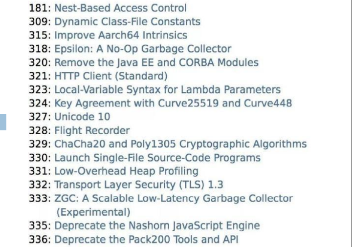

JDK 11 将是一个 企业不可忽视的版本。从时间节点来看，JDK 11 的发布正好处在 JDK 8 免费更新到期的前夕，同时 JDK 9、10 也陆续成为“历史版本”，下面是 Oracle JDK 支持路线图：


### JDK 11 是一个长期支持版本（LTS, Long-Term-Support）

- 对于企业来说，选择 11 将意味着长期的、可靠的、可预测的技术路线图。其中免费的OpenJDK11 确定将得到 OpenJDK 社区的长期支持， LTS 版本将是可以放心选择的版本。
- 从 JVM GC 的角度，JDK11 引入了两种新的 GC，其中包括也许是划时代意义的 ZGC，虽然其目前还是实验特性，但是从能力上来看，这是 JDK 的一个巨大突破，为特定生产环境的苛刻需求提供了一个可能的选择。例如，对部分企业核心存储等产品，如果能够保证不超过 10ms 的 GC 暂停，可靠性会上一个大的台阶，这是过去我们进行 GC 调优几乎做不到的，是能与不能的问题。

按照官方的说法，新的发布周期会严格遵循时间点，将于每年的3月份和9月份发布。所以 Java 11 的版本号是18.9(LTS)。

不过与 Java 9 和 Java 10 这两个被称为“功能性的版本”不同（两者均只提供半年的技术支持），Java 11 不仅提供了长期支持服务，还将作为Java 平台的参考实现。Oracle 直到2023年9月都会为Java 11 提供技术支持，而补丁和安全警告等扩展支持将持续到2026年。

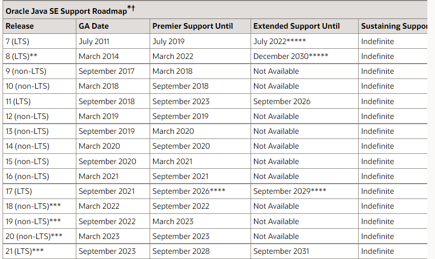


新的长期支持版本每三年发布一次，根据后续的发布计划，下一个长期支持版 Java 17 将于2021年发布。

### 官网公开的 17 个 JEP（JDK Enhancement Proposal 特性增强提议）

- 181: Nest-Based Access Control（基于嵌套的访问控制）
- 309: Dynamic Class-File Constants（动态的类文件常量）
- 315: Improve Aarch64 Intrinsics（改进 Aarch64 Intrinsics）
- 318: **Epsilon: A No-Op Garbage Collector（Epsilon 垃圾回收器，又被称为"No-Op（无操作）"回收器）**
- 320: Remove the Java EE and CORBA Modules（移除 Java EE 和 CORBA 模块，JavaFX 也已被移除）
- 321: HTTP Client (Standard)
- 323: Local-Variable Syntax for Lambda Parameters（用于 Lambda 参数的局部变量语法）
- 324: Key Agreement with Curve25519 and Curve448（采用 Curve25519 和 Curve448 算法实现的密钥协议）
- 327: Unicode 10
- 328: Flight Recorder（飞行记录仪）
- 329: ChaCha20 and Poly1305 Cryptographic Algorithms（实现 ChaCha20 和 Poly1305 加密算法）
- 330: Launch Single-File Source-Code Programs（启动单个 Java 源代码文件的程序）
- 331: Low-Overhead Heap Profiling（低开销的堆分配采样方法）
- 332: Transport Layer Security (TLS) 1.3（对 TLS 1.3 的支持）
- 333: **ZGC: A Scalable Low-Latency Garbage Collector (Experimental)（ZGC：可伸缩的低延迟垃圾回收器，处于实验性阶段）**
- 335: Deprecate the Nashorn JavaScript Engine（弃用 Nashorn JavaScript 引擎）
- 336: Deprecate the Pack200 Tools and API（弃用 Pack200 工具及其 API）

### 一、新增了一系列字符串处理方法

| 描述                 | 举例                                  |
| -------------------- | ------------------------------------- |
| 判断字符串是否为空白 | `"  \t  \t  \n  ".isBlank(); // true` |
| 去除首尾空白         | `" \t abc \t  \n ".strip(); // "abc"` |
| 去除尾部空格         | `" abc ".stripTrailing(); // " abc"`  |
| 去除首部空格         | `" abc ".stripLeading(); // "abc "`   |
| 复制字符串           | `"Java".repeat(3);// "JavaJavaJava"`  |
| 行数统计             | `"A\nB\nC".lines().count(); // 3`     |

trim()方法无法删除掉Unicode空白字符，trim()方法移除字符串两侧的空白字符(空格、tab键、换行符)。支持Unicode的空白字符的判断应该使用isWhitespace(int)。此外，开发人员无法专门删除缩进空白或专门删除尾随空白。JAVA11(JDK11)中的strip()方法，适用于字符首尾空白是Unicode空白字符的情况。

### 二、Optional 加强

Optional 也增加了几个非常酷的方法，现在可以很方便的将一个 Optional 转换成一个 Stream, 或者当一个空 Optional 时给它一个替代的。

| 新增方法                                                                  | 描述                                                             | 新增的版本 |
| ------------------------------------------------------------------------- | ---------------------------------------------------------------- | ---------- |
| boolean isEmpty()                                                         | 判断value是否为空                                                | JDK 11     |
| ifPresentOrElse​(Consumer\<? super T\> action, Runnable emptyAction)      | value非空，执行参数1功能；如果value为空，执行参数2功能           | JDK 9      |
| Optional\<T\> or​(Supplier\<? extends Optional\<? extends T\>\> supplier) | value非空，返回对应的Optional；value为空，返回形参封装的Optional | JDK 9      |
| Stream\<T\> stream()                                                      | value非空，返回仅包含此value的Stream；否则，返回一个空的Stream   | JDK 9      |
| T orElseThrow()                                                           | value非空，返回value；否则抛异常NoSuchElementException           | JDK 10     |

```java
// Optional中两个函数的源码：
public boolean isPresent() {//判断内部的value是否存在
  return value != null;
}
public boolean isEmpty() {//判断内部的value是否为空
  return value == null;
}
```

### 三、局部变量类型推断升级

在var上添加注解的语法格式，在jdk10中是不能实现的。在JDK11中加入了这样的语法。

```java
//错误的形式: 必须要有类型, 可以加上var
//Consumer<String> con1 = (@Deprecated t) -> System.out.println(t.toUpperCase());
//正确的形式:使用var的好处是在使用lambda表达式时给参数加上注解。
Consumer<String> con2 = (@Deprecated var t) -> System.out.println(t.toUpperCase());
```

### 四、全新的HTTP 客户端API

- HTTP，用于传输网页的协议，早在1997年就被采用在目前的1.1版本中。直到2015年，HTTP2才成为标准。
- HTTP/1.1和HTTP/2的主要区别是如何在客户端和服务器之间构建和传输数据。HTTP/1.1依赖于请求/响应周期。 HTTP/2允许服务器“push”数据：它可以发送比客户端请求更多的数据。这使得它可以优先处理并发送对于首先加载网页至关重要的数据。
- 这是 Java 9 开始引入的一个处理 HTTP 请求的的 HTTP Client API，该API 支持同步和异步，而在 Java 11 中已经为正式可用状态，你可以在 java.net 包中找到这个 API。
- 它将替代仅适用于 blocking 模式的 HttpURLConnection（HttpURLConnection是在HTTP 1.0的时代创建的，并使用了协议无关的方法），并提供对WebSocket 和 HTTP/2的支持。

```java
// 两个关于HttpClient的例子，此处不要求掌握。
public void test4(){
  try {
    HttpClient client = HttpClient.newHttpClient();
    HttpRequest request = HttpRequest.newBuilder(URI.create("http://127.0.0.1:8080/test/")).build();
    HttpResponse.BodyHandler<String> responseBodyHandler = HttpResponse.BodyHandlers.ofString();
    HttpResponse<String> response = client.send(request, responseBodyHandler);
    String body = response.body();
  } catch (IOException e) {
  } catch (InterruptedException e) {
  }
} //（tips：HttpClient其实是从Android中引入的）
public void test5(){
  HttpClient client = HttpClient.newHttpClient();
  HttpRequest request = HttpRequest.newBuilder(URI.create("http://127.0.0.1:8080/test/")).build();
  HttpResponse.BodyHandler<String> responseBodyHandler = HttpResponse.BodyHandlers.ofString();
  CompletableFuture<HttpResponse<String>> sendAsync = client.sendAsync(request, responseBodyHandler);
  sendAsync.thenApply(t -> t.body()).thenAccept(System.out::println);
  //HttpResponse<String> response = sendAsync.get();
  //String body = response.body();
}
```

### 五、更简化的编译运行程序

看下面的代码。

```java
javac Javastack.java // 编译
java Javastack // 运行
```

在我们的认知里面，要运行一个 Java 源代码必须先编译，再运行，两步执行动作。而在未来的 Java 11 版本中，通过一个 java 命令就直接搞定了，如以下所示：`java Javastack.java`

一个命令编译运行源代码的注意点：
- 执行源文件中的**第一个类**, 第一个类**必须包含主方法**。
- 并且不可以使用其它源文件中的自定义类, 本文件中的自定义类是可以使用的。

### 六、废弃Nashorn引擎

废除Nashorn javascript引擎，在后续版本准备移除掉，有需要的可以考虑使用GraalVM。

### 七、ZGC

- **GC是java主要优势之一**。 然而, 当GC停顿太长, 就会开始影响应用的响应时间。消除或者减少GC停顿时长, java将对更广泛的应用场景是一个更有吸引力的平台。此外, 现代系统中可用内存不断增长,用户和程序员希望JVM能够以高效的方式充分利用这些内存, 并且无需长时间的GC暂停时间。
- ZGC, A Scalable Low-Latency Garbage Collector(Experimental)ZGC, 这应该是JDK11最为瞩目的特性, 没有之一。 但是后面带了Experimental,说明这还不建议用到生产环境。
- ZGC是一个并发, 基于region, 压缩型的垃圾收集器, 只有root扫描阶段会STW(stop the world), 因此GC停顿时间不会随着堆的增长和存活对象的增长而变长。
- 优势：
  - GC暂停时间不会超过10ms
  - 既能处理几百兆的小堆, 也能处理几个T的大堆(OMG)
  - 和G1相比, 应用吞吐能力不会下降超过15%
  - 为未来的GC功能和利用colord指针以及Load barriers优化奠定基础
  - 初始只支持64位系统
- ZGC的设计目标是：支持TB级内存容量，暂停时间低（<10ms），对整个程序吞吐量的影响小于15%。 将来还可以扩展实现机制，以支持不少令人兴奋的功能，例如多层堆（即热对象置于DRAM和冷对象置于NVMe闪存），或压缩堆。

### 八、其它新特性

- Unicode 10
- Deprecate the Pack200 Tools and API
- 新的Epsilon垃圾收集器
- 完全支持Linux容器（包括Docker）
- 支持G1上的并行完全垃圾收集
- 最新的HTTPS安全协议TLS 1.3
- Java Flight Recorder （黑匣子）

### 在当前JDK中看不到什么？

**一个标准化和轻量级的JSON API** 被许多Java开发人员所青睐。但是由于资金问题无法在Java当前版本中见到，但并不会削减掉。Java平台首席架构师MarkReinhold在JDK 9邮件列中说：“这个JEP将是平台上的一个有用的补充，但是在计划中，它并不像Oracle资助的其他功能那么重要，可能会重新考虑JDK 10或更高版本中实现。 ”

**新的货币 API**
- 对许多应用而言货币价值都是一个关键的特性，但JDK对此却几乎没有任何支持。严格来讲，现有的java.util.Currency类只是代表了当前ISO 4217货币的一个数据结构，但并没有关联的值或者自定义货币。JDK对货币的运算及转换也没有内建的支持，更别说有一个能够代表货币值的标准类型了。
- 此前，Oracle 公布的JSR 354定义了一套新的Java货币API：JavaMoney，计划会在Java9中正式引入。但是目前没有出现在JDK 新特性 中。
- 不过，如果你用的是Maven的话，可以做如下的添加，即可使用相关的API处理货币：

```xml
<dependency>
<groupId>org.javamoney</groupId>
<artifactId>moneta</artifactId>
<version>0.9</version>
</dependency>
```

## 展 望

- 随着云计算和 AI 等技术浪潮，当前的计算模式和场景正在发生翻天覆地的变化，不仅对 Java 的发展速度提出了更高要求，也深刻影响着 Java 技术的发展方向。传统的大型企业或互联网应用，正在被云端、容器化应用、模块化的微服务甚至是函数(FaaS， Function-as-a-Service)所替代。
- Java虽然标榜面向对象编程，却毫不顾忌的加入面向接口编程思想，又扯出匿名对象之概念，每增加一个新的东西，对Java的根本所在的面向对象思想的一次冲击。反观Python，抓住面向对象的本质，又能在函数编程思想方面游刃有余。Java对标C/C++，以抛掉内存管理为卖点，却又陷入了JVM优化的噩梦。选择比努力更重要，选择Java的人更需要对它有更清晰的认识。
- Java 需要在新的计算场景下，改进开发效率。这话说的有点笼统，我谈一些自己的体会，Java 代码虽然进行了一些类型推断等改进，更易用的集合 API 等，但仍然给开发者留下了过于刻板、形式主义的印象，这是一个长期的改进方向。

## Java 5-11 各个版本新特性列表（略）

### Java 5

- 泛型
- 枚举
- 自动装箱拆箱
- 可变参数
- 注解
- foreach 循环（增强 for、for/in）
- 静态导入
- 格式化（System.out.println 支持%s %d 等格式化输出）
- 线程框架/数据结构 JUC
- Arrays 工具类/StringBuilder/instrument

### Java 6

- Web Services
- Scripting（开启 JS 的支持，算是比较有用的）
- Database
- More Desktop APIs
- Monitoring and Management
- Compiler Access（这个很厉害）
- Pluggable Annotation
- Desktop Deployment
- Security
- The -ilities（很好的习惯）

### Java 7

- switch 中添加对 String 类型的支持
- 数字字面量的改进 / 数值可加下划
- 异常处理（捕获多个异常） try-with-resources
- 增强泛型推断
- JSR203 NIO2.0（AIO）新 IO 的支持
- JSR292 与 InvokeDynamic 指令
- Path 接口、DirectoryStream、Files、WatchService（重要接口更新）
- fork/join framework

### Java 8

- Lambda 表达式
- 接口的默认方法与静态方法
- 方法引用（含构造方法引用）
- 重复注解
- 扩展注解的支持（类型注解）
- Optional
- Stream
- Date/Time API (JSR 310)
- JavaScript 引擎 Nashorn
- Base64

### Java 9

- 平台级 modularity（原名：Jigsaw） 模块化系统
- Java 的 REPL 工具： jShell 命令
- 多版本兼容 jar 包（这个在处理向下兼容方面，非常好用）
- 语法改进：接口的私有方法
- 语法改进：UnderScore(下划线)使用的限制
- 底层结构：String 存储结构变更（这个很重要）
- 集合工厂方法：快速创建只读集合
- 增强的 Stream API
- 全新的 HTTP 客户端 API
- 其它特性
- 它的新特性来自于 100 于项 JEP 和 40 于项 JSR

### Java 10

- 局部变量的类型推断 var 关键字
- GC 改进和内存管理 并行全垃圾回收器 G1
- 垃圾回收器接口
- 线程-局部变量管控
- 合并 JDK 多个代码仓库到一个单独的储存库中
- 新增 API：ByteArrayOutputStream
- 新增 API：List、Map、Set
- 新增 API：java.util.Properties
- 新增 API： Collectors 收集器

### Java 11

- 本地变量类型推断
- 字符串加强
- 集合加强
- Stream 加强
- Optional 加强
- InputStream 加强
- HTTP Client API
- 化繁为简，一个命令编译运行源代码


学习的思维方式：
1. "大处着眼，小处入手"
2. 逆向思维、反证法
3. 透过问题看本质

两句话：
1. 小不忍则乱大谋
2. 识时务者为俊杰

