# 第1章 内容介绍和授课方式

## 1.1 数据结构和算法内容介绍

### 1.1.1 先看几个经典的算法面试题
> 字符串匹配问题：  
> 1. 有一个字符串 str1= ""硅硅谷 尚硅谷你尚硅 尚硅谷你尚硅谷你尚硅你好""，和一个子串 str2="尚硅谷你尚硅你"
> 2. 现在要判断 str1 是否含有 str2, 如果存在，就返回第一次出现的位置, 如果没有，则返回-1
> 3. 要求用最快的速度来完成匹配
> 4. 你的思路是什么？ 
> - 暴力匹配\[简单，但是效率低\]
> - KMP算法《部分匹配表》

> 汉诺塔游戏：
> 1. 将A塔的所有圆盘移动到C塔。并且规定
> 2. 在小圆盘上不能放大圆盘
> 3. 在三根柱子之间一次只能移动一个圆盘

> 八皇后问题：  
> 一个古老而著名的问题，是**回溯算法**的典型案例。该问题是国际西洋棋棋手马克斯·贝瑟尔于1848 年提出：在8×8格的国际象棋上摆放八个皇后，使其不能互相攻击，即：任意两个皇后都不能处于同一行、同一列或同一斜线上，问有多少种摆法。【92】=> 分治算法

> 马踏棋盘：
> 1. 马踏棋盘算法也被称为骑士周游问题
> 2. 将马随机放在国际象棋的8×8棋盘Board\[0～7\]\[0～7\]的某个方格中，马按走棋规则(马走日字)进行移动。要求每个方格只进入一次，走遍棋盘上全部64个方格
> 3. 会使用到**图的深度优化遍历算法**(DFS) + **贪心算法**优化

### 1.1.2 数据结构和算法的重要性
1. **算法是程序的灵魂**，优秀的程序可以在海量数据计算时，依然保持高速计算
2. 一般来讲程序会使用了内存计算框架(比如Spark)和缓存技术(比如Redis等)来优化程序，再深入的思考一下，这些计算框架和缓存技术，它的核心功能是哪个部分呢？
3. 拿实际工作经历来说，在Unix下开发服务器程序，功能是要支持上千万人同时在线，在上线前，做内测，一切OK，可上线后，服务器就支撑不住了，公司的CTO 对代码进行优化，再次上线，坚如磐石。你就能感受到程序是有灵魂的，就是算法。
4. 目前程序员面试的门槛越来越高，**很多一线IT公司**(大厂)，都会有**数据结构和算法**面试题(负责的告诉你，肯定有的)
5. 如果你不想永远都是代码工人,那就花时间来研究下数据结构和算法

### 1.1.3 本套数据结构和算法内容介绍（略）
尚硅谷 韩顺平 数据结构和算法2019内容介绍.zip

### 1.1.4 课程亮点和授课方式
1. 课程深入，非蜻蜓点水
2. 课程成体系，非星星点灯
3. 高效而愉快的学习，数据结构和算法很有用，很好玩
4. 数据结构和算法很重要，但是相对困难，我们努力做到通俗易懂
5. 采用 {应用场景->数据结构或算法->剖析原理->分析实现步骤(图解)->代码实现的步骤讲解} \[比如: 八皇后问题和动态规划算法\]
6. 课程目标：让大家掌握本质，到达能在工作中灵活运用解决实际问题和优化程序的目的


# 第2章 数据结构和算法概述

## 2.1 数据结构和算法的关系
1. 数据data结构(structure)是一门**研究组织数据方式**的学科，有了编程语言也就有了数据结构。学好数据结构可以编写出更加漂亮，更加有效率的代码。
2. 要学习好数据结构就要多多考虑如何将生活中遇到的问题，用程序去实现解决。
3. **程序 = 数据结构 + 算法**
4. **数据结构是算法的基础**，换言之，想要学好算法，需要把数据结构学到位。

## 2.2 看几个实际编程中遇到的问题

### 2.2.1 字符串替换问题
```str.replaceAll(str1, str2);```  
试写出用单链表表示的字符串类及字符串结点类的定义，并依次实现它的构造函数、以及计算串长度、串赋值、判断两串相等、求子串、两串连接、求子串在串中位置等7个成员函数。

### 2.2.2 五子棋判断游戏的输赢、存盘退出、继续上局
1. 棋盘 二维数组 -> (稀疏数组) -> 写入文件 【存档功能】
2. 读取文件 -> 稀疏数组 -> 二维数组 -> 棋盘 【接上局】

### 2.2.3 约瑟夫(Josephu)问题(丢手帕问题)
1. Josephu 问题为：设编号为1，2，...，n的n个人围坐一圈，约定编号为k（1<=k<=n）的人从1开始报数，数到m的那个人出列，它的下一位又从1开始报数，数到m的那个人又出列，依次类推，直到所有人出列为止，由此产生一个出队编号的序列。
2. 提示：用一个不带头结点的循环链表来处理Josephu问题：先构成一个有n个结点的单循环链表（单向环形链表），然后由k结点起从1开始计数，计到m时，对应结点从链表中删除，然后再从被删除结点的下一个结点又从1开始计数，直到最后一个结点从链表中删除算法结束。
3. 小结：完成约瑟夫问题，需要使用到单向环形链表这个数据结构

### 2.2.4 其它常见算法问题
1. 修路问题 => 最小生成**树**(加权值)【**数据结构**】+ 普利姆算法
2. 最短路径问题 => 图+弗洛伊德算法
3. **汉诺塔** => 分支算法
4. 八皇后问题 => 回溯法

## 2.3 线性结构和非线性结构
数据结构包括：线性结构和非线性结构。

### 2.3.1线性结构
1. 线性结构作为最常用的数据结构，其特点是数据元素之间存在**一对一**的线性关系
2. 线性结构有两种不同的存储结构，即**顺序存储结构(数组)**和**链式存储结构(链表)**。顺序存储的线性表称为顺序表，顺序表中的**存储元素是连续**的
3. 链式存储的线性表称为链表，链表中的**存储元素不一定是连续的**，元素节点中存放数据元素以及相邻元素的地址信息
4. 线性结构常见的有：**数组、队列、链表和栈**，后面我们会详细讲解。

### 2.3.2 非线性结构
非线性结构包括：二维数组，多维数组，广义表，树结构，图结构


# 第3章 稀疏数组和队列

## 3.1 稀疏 sparsearray 数组

### 3.1.1 先看一个实际的需求
- 编写的五子棋程序中，有**存盘退出**和**续上盘**的功能。
- 分析问题：因为该二维数组的很多值是默认值0, 因此记录了很多没有意义的数据->稀疏数组。

### 3.1.2 基本介绍
当一个数组中大部分元素为0，或者为同一个值的数组时，可以使用稀疏数组来保存该数组。

稀疏数组的处理方法是：
- 记录数组**一共有几行几列，有多少个不同**的值
- 把具有不同值的元素的行列及值记录在一个小规模的数组中，从而**缩小程序**的规模

稀疏数组举例说明
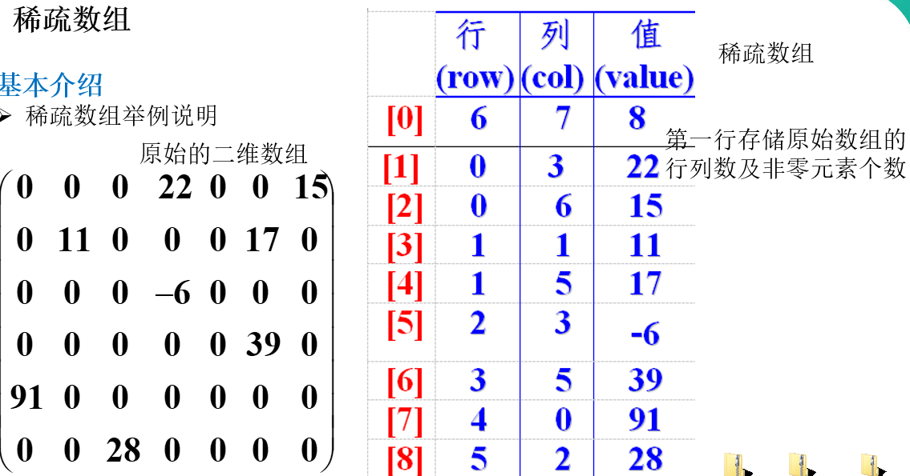

### 3.1.3 应用实例
1. 使用稀疏数组，来保留类似前面的二维数组(棋盘、地图等等)
2. 把稀疏数组存盘，并且可以从新恢复原来的二维数组数
3. 整体思路分析
   1. 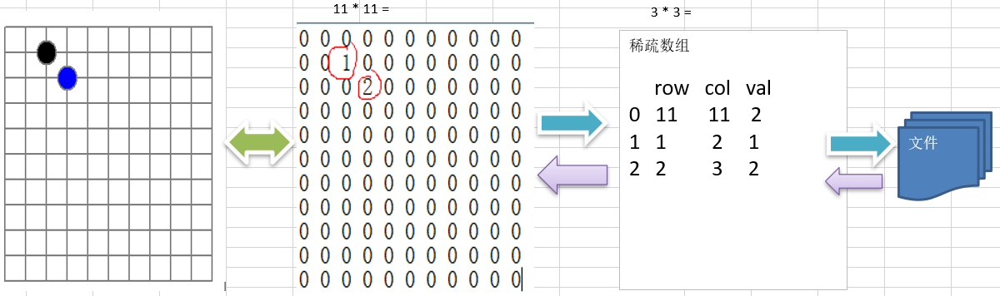
   2. 二维数组 -> 稀疏数组
      1. 遍历原始的二维数组，得到有效数据的个数sum
      2. 根据sum就可以创建稀疏数组 `sparseArr int[sum + 1][3]`
      3. 将二维数组的有效数据数据存入到稀疏数组
   3. 稀疏数组转原始的二维数组的思路
      1. 先读取稀疏数组的第一行，根据第一行的数据，创建原始的二维数组，比如上面的 `chessArr2 = int [11][11]`
      2. 在读取稀疏数组后几行的数据，并赋给 原始的二维数组 即可
4. 代码实现
    ```java
    package com.atguigu.sparsearray;
    public class SparseArray {
        // 将一个二维数组转为稀疏数组
        public static int[][] toSparseArray(int[][] arr) {
            int row = arr.length;
            int col = arr[0].length;
            int count = 0;
            // 1. 先遍历二维数组 得到非0数据的个数
            for (int i = 0; i < row; i++) {
                for (int j = 0; j < col; j++) {
                    if (arr[i][j] != 0)count++;
                }
            }
            // 2. 创建对应的稀疏数组
            int[][] result = new int[count + 1][3];
            result[0][0] = row;
            result[0][1] = col;
            result[0][2] = count;
            int index = 1;
            // 3. 遍历二维数组，将非0的值存放到result中
            for (int i = 0; i < row; i++) {
                for (int j = 0; j < col; j++) {
                    if (arr[i][j] != 0) {
                        result[index][0] = i;
                        result[index][1] = j;
                        result[index][2] = arr[i][j];
                        index++;
                    }
                }
            }
            return result;
        }
        // 将一个稀疏数组转为二维数组
        public static int[][] toTwoDimensionalArray(int[][] arr) {
            int row = arr[0][0];
            int col = arr[0][1];
            int count = arr[0][2];
            // 1. 先读取稀疏数组的第一行，根据第一行的数据，创建原始的二维数组
            int[][] result = new int[row][col];
            // 2. 在读取稀疏数组后几行的数据(从第二行开始)，并赋给 原始的二维数组 即可
            for (int i = 1; i <= count; i++)
                result[arr[i][0]][arr[i][1]] = arr[i][2];
            return result;
        }
    }
    ```

### 3.1.4 课后练习
要求：  
1. 在前面的基础上，将稀疏数组保存到磁盘上，例map.dat
2. 恢复原来的数组时，读取map.dat进行恢复

## 3.2 队列

### 3.2.1 队列的一个使用场景
银行排队

### 3.2.2 队列介绍
1. 队列是一个**有序列表**，可以用**数组**或是**链表**来实现。
2. 遵循**先入先出**的原则。即：**先存入队列的数据，要先取出。后存入的要后取出**
3. 示意图：(使用数组模拟队列示意图)
    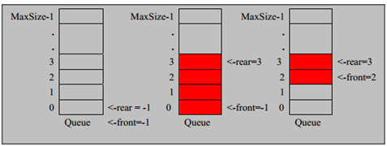

### 3.2.3 数组模拟队列思路
- 队列本身是有序列表，若使用数组的结构来存储队列的数据，则队列数组的声明如图，其中maxSize是该队列的最大容量。
- 因为队列的输出、输入是分别从前后端来处理，因此需要两个变量front及rear分别记录队列前后端的下标，front会随着数据输出而改变，而rear则是随着数据输入而改变
- 当我们将数据存入队列时称为‘addQueue’，addQueue的处理需要有两个步骤：思路分析
  - 将尾指针往后移：`rear+1`，当`front == rear` 【空】
  - 若尾指针rear小于队列的最大下标 `maxSize-1`，则将数据存入rear所指的数组元素中，否则无法存入数据。`rear == maxSize - 1` 【队列满】
- 代码实现（略）
- 问题分析并优化
  - 目前数组使用一次就不能用， 没有达到复用的效果
  - 将这个数组使用算法，改进成一个环形的队列 取模：%

### 3.2.4 数组模拟环形队列
对前面的数组模拟队列的优化，充分利用数组. 因此将数组看做是一个环形的。(通过取模的方式来实现即可)

1. 尾索引的下一个为头索引时表示队列满，即将队列容量空出一个作为约定,这个在做判断队列满的时候需要注意 `(rear + 1) % maxSize == front [满]`
2. `rear == front [空]`
3. 分析示意：
   1. front变量的含义做一个调整：front就指向队列的第一个元素，也就是说`arr[front]`就是队列的第一个元素front的初始值为0
   2. rear变量的含义做一个调整：rear指向队列的最后一个元素的后一个位置。因为希望空出一个空间做为约定。rear的初始值为0
   3. 当队列满时，条件是 `(rear + 1) % maxSize == front` 【满】
   4. 对队列为空的条件，`rear == front` 【空】
   5. 当我们这样分析，队列中有效的数据的个数 `(rear + maxSize - front) % maxSize`
   6. 我们就可以在原来的队列上修改得到，一个环形队列。
4. 代码实现：
    ```java
    class ArrayQueue<T> {
        private int maxSize; // 队列的最大容量
        private int front = 0; // 队列头
        private int rear = 0; // 指向队列的最后一个元素的后一个位置
        private Object[] arr; // 数组
        public ArrayQueue(int maxSize) {
            this.maxSize = maxSize;
            this.arr = new Object[maxSize];
        }
        public boolean isFull() { // 判满
            return (rear + 1) % maxSize == front;
        }
        public boolean isEmpty() { // 判空
            return rear == front;
        }
        public void add(T value) { // 入队
            if (isFull())
                throw new RuntimeException("队列已满，不能添加数据");
            // 直接将数据加入
            arr[rear] = value;
            // 将 rear 后移, 这里必须考虑取模
            rear = (rear + 1) % maxSize;
        }
        public T get() { // 出队
            if (isEmpty())
                throw new RuntimeException("队列为空，不能取出数据");
            // 1. 先把 front 对应的值保留到一个临时变量
            T value = (T) arr[front];
            // 2. 将 front 后移, 考虑取模
            front = (front + 1) % maxSize;
            // 3. 将临时保存的变量返回
            return value;
        }
        public T peek() { // 查看队头
            if (isEmpty())
                throw new RuntimeException("队列为空，不能查看数据");
            return (T) arr[front];
        }
        public int size() { // 求出当前队列有效数据的个数
            return (rear + maxSize - front) % maxSize;   
        }
        public T[] peekAll() {
            if (isEmpty())
                throw new RuntimeException("队列为空，不能查看数据");
            Object[] temp =  new Object[size()];
            // for (int i = front, index = 0; i < front + size() ; i++) {
            //     temp[index++] = arr[i % maxSize];
            // }
            for (int i = front, index = 0; i != rear ; i = (i + 1) % maxSize) {
                temp[index++] = arr[i];
            }
            return (T[]) temp;
        }
    }
    ```


# 第4章 链表

## 4.1 链表(Linked List)介绍
1. 链表是以节点的方式来存储，是链式存储
2. 每个节点包含data域，next域：指向下一个节点。
3. 如图：发现链表的各个节点不一定是连续存储。
4. 链表分带头节点的链表和没有头节点的链表，根据实际的需求来确定。

> 单链表(带头结点) 逻辑结构示意图如下
> 

## 4.2 单链表的应用实例
使用带head头的**单向链表**实现水浒英雄排行榜管理完成对英雄人物的增删改查操作

1. 第一种方法在添加英雄时，直接添加到链表的尾部【添加（创建）】
   1. 先创建一个head 头节点，作用就是表示单链表的头
   2. 后面我们每添加一个节点，就直接加入到链表的最后
   3. 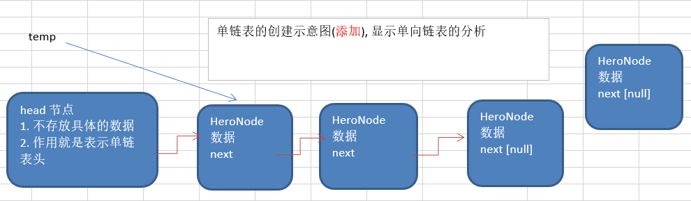
2. 遍历：通过一个辅助变量遍历，帮助遍历整个链表
3. 第二种方式在添加英雄时，根据排名将英雄插入到指定位置(如果有这个排名，则添加失败，并给出提示)
   1. 首先找到新添加的节点的位置，是通过辅助变量(指针)，通过遍历来搞定
   2. 新的节点.next = temp.next
   3. 将temp.next = 新的节点
   4. 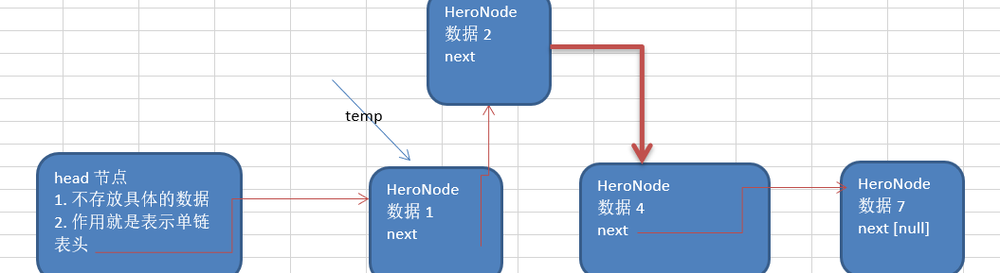
4. 修改节点功能
5. 删除节点
   1. 我们先找到 需要删除的这个节点的前一个节点 temp
   2. temp.next = temp.next.next
   3. 被删除的节点，将不会有其它引用指向，会被垃圾回收机制回收
   4. 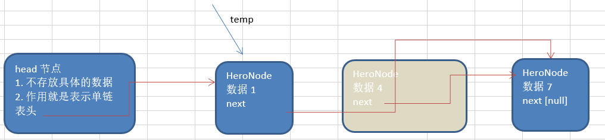
6. 代码实现
    ```java
    class SingleLinkedList<E> {
        // 先初始化一个头节点, 头节点不要动, 不存放具体的数据
        private Node<E> head = new Node<E>(null, null);
        // 返回头节点
        public Node<E> getHead() {
            return head;
        }
        // 返回尾节点
        public Node<E> getTail() {
            Node<E> cur = head;
            while (cur.next != null)
                cur = cur.next;
            return cur;
        }
        // 添加节点到单向链表
        public void add(E t) {
            getTail().next = new Node<E>(t, null);
        }
        // 按顺序添加节点到单向链表
        public void addByOrder(E t) {
            Node<E> cur = getHead();
            while (cur.next != null) {
                if (((Comparable<E>) cur.next.data).compareTo(t) > 0) // 位置找到
                    cur.next = new Node<E>(t, cur.next);
                else if (((Comparable<E>) cur.next.data).compareTo(t) == 0)
                    throw new RuntimeException("该元素已存在");
                cur = cur.next; // 后移，遍历当前链表
            }
        }
        // 从单向链表中删除指定节点
        public void remove(E t) {
            Node<E> cur = getHead();
            // 循环遍历链表
            while (cur.next != null) {
                // 判断当前节点的数据是否等于要删除的数据
                if (cur.next.data.equals(t)) {
                    cur.next = cur.next.next;
                    return;
                }
            }
            throw new RuntimeException("链表中没有该元素");
        }
        // 遍历
        public void list(Consumer<E> c) {
            Node<E> cur = head.next;
            while (cur != null) {
                c.accept(cur.data);
                cur = cur.next;
            }
        }
        private static class Node<E> {
            E data;
            Node<E> next;
            Node(E data, Node<E> next) {
                this.data = data;
                this.next = next;
            }
        }
    }
    ```

## 4.3 单链表面试题(新浪、百度、腾讯)
1. 求单链表中有效节点的个数
    ```java
    public int size() {
		int size = 0;
		Node<E> cur = getHead();
		while ((cur = cur.next) != null)
			size++;
		return size;
	}
    ```
2. 查找单链表中的倒数第k个结点【新浪面试题】
    ```java
    public E getKthFromEnd1(int k){
		if (k <= 0 || k > size()) {
			throw new RuntimeException("下标越界");
		}
		int size = size();
		Node<E> cur = head.next;
		for (int i = 0; i < size - k; i++) {
			cur = cur.next;
		}
		return cur.data;
	}
	public E getKthFromEnd2(int k) {
		if (k <= 0 || k > size()) {
			throw new RuntimeException("下标越界");
		}
		Node<E> fast = getHead(), slow = getHead();
        while (fast != null && k > 0) {
            fast = fast.next;
            k--;
        }
        while (fast != null) {
            fast = fast.next;
            slow = slow.next;
        }
        return slow.data;
	}
    ```
3. 单链表的反转【腾讯面试题】
    ```java
    public void reverseList(){
		// 链表为空或只有一个结点，不用反转
		if(head.next == null || head.next.next == null){
			return;
		}
		// 定义一个辅助的指针(变量)，帮助我们遍历原来的链表
		Node<E> cur = head.next;
		Node<E> next = null;
		head.next = null;
		while (cur != null) {
			next = cur.next;// 先暂时保存当前节点的下一个节点，因为后面需要使用
			cur.next = head.next;// 将cur的下一个节点指向新的链表的最前端
			head.next = cur; // 将cur 连接到新的链表上
			cur = next;// 让cur后移
		}
	}
    ```
4. 逆序遍历单链表【百度，方式1：反向遍历；方式2：栈】
    ```java
    // 逆序打印：递归
	public void reversePrint(Node<E> node) {
		if (head.next != null){
			reversePrint(head.next);
		}
		System.out.println(head.data);
	}
	// 逆序打印：使用栈
	public void reversePrint(){
		Stack<Node<E>> stack = new Stack<Node<E>>();
		Node<E> cur = head.next;
		while(cur != null){
			stack.push(cur);
			cur = cur.next;
		}
		while(!stack.isEmpty()){
			System.out.println(stack.pop().data);
		}
	}
    ```
5. 合并两个有序的单链表，合并之后的链表依然有序【课后练习】
    ```java
	public static <T extends Comparable<? super T>> SingleLinkedList<T> merge(SingleLinkedList<T> list1, SingleLinkedList<T> list2) {
		SingleLinkedList<T> result = new SingleLinkedList<T>();
		Node<T> cur1 = list1.head.next;
		Node<T> cur2 = list2.head.next;
		Node<T> cur = result.head;
		while (cur1 != null && cur2 != null) {
			if (cur1.data.compareTo(cur2.data) < 0) {
				cur.next = cur1;
				cur1 = cur1.next;
			} else {
				cur.next = cur2;
				cur2 = cur2.next;
			}
			cur = cur.next;
		}
		while (cur1 != null) {
			cur.next = cur1;
			cur1 = cur1.next;
		}
		while (cur2 != null) {
			cur.next = cur2;
			cur2 = cur2.next;
		}
		return result;
	}
    ```

## 4.4 双向链表应用实例

### 4.4.1 双向链表的操作分析和实现

管理单向链表的缺点分析:
1. 单向链表，查找的方向只能是一个方向，而双向链表可以向前或者向后查找。
2. 单向链表不能自我删除，需要靠辅助节点，而双向链表，则可以自我删除，所以前面我们单链表删除时节点，总是找到temp，temp是待删除节点的前一个节点(认真体会)。
3. 分析了双向链表如何完成遍历，添加，修改和删除的思路。

分析
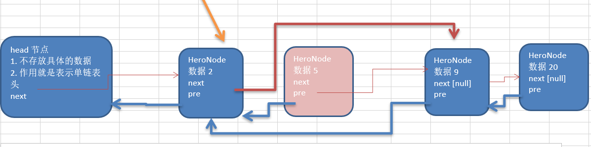
1. 遍历和单链表一样，只是可以向前，也可以向后查找
2. 添加 (默认添加到双向链表的最后)
   1. 先找到双向链表的最后这个节点
   2. temp.next = newHeroNode
   3. newHeroNode.pre = temp;
3. 修改思路和原来的单向链表一样。
4. 删除
   1. 因为是双向链表，因此，我们可以实现自我删除某个节点
   2. 直接找到要删除的这个节点，比如temp
   3. temp.pre.next = temp.next
   4. temp.next.pre = temp.pr

代码（这里的代码是java.util.LinkedList中的增删改查部分）
```java
class DoubleLinkedList<E> {
	int size = 0;
	Node<E> first; Node<E> last;
	public int size() {
        return size;
    }
	void linkLast(E e) {
        final Node<E> l = last;
        final Node<E> newNode = new Node<>(l, e, null);
        last = newNode;
        if (l == null)first = newNode;
        else l.next = newNode;
        size++;
        // modCount++; //Fail-Fast 机制
    }
	void linkBefore(E e, Node<E> succ) {
        // assert succ != null;
        final Node<E> pred = succ.prev;
        final Node<E> newNode = new Node<>(pred, e, succ);
        succ.prev = newNode;
        if (pred == null)first = newNode;
        else pred.next = newNode;
        size++;
        // modCount++;
    }
	Node<E> node(int index) {
        // assert isElementIndex(index);
        if (index < (size >> 1)) {
            Node<E> x = first;
            for (int i = 0; i < index; i++)
                x = x.next;
            return x;
        } else {
            Node<E> x = last;
            for (int i = size - 1; i > index; i--)
                x = x.prev;
            return x;
        }
    }
	E unlink(Node<E> x) {
        // assert x != null;
        final E element = x.item;
        final Node<E> next = x.next;
        final Node<E> prev = x.prev;
        if (prev == null) {
            first = next;
        } else {
            prev.next = next;
            x.prev = null;
        }
        if (next == null) {
            last = prev;
        } else {
            next.prev = prev;
            x.next = null;
        }
        x.item = null;
        size--;
        // modCount++;
        return element;
    }
	//增
	public boolean add(E e) {
        linkLast(e);
        return true;
    }
	public void add(int index, E element) {
        checkPositionIndex(index);
        if (index == size)
            linkLast(element);
        else
            linkBefore(element, node(index));
    }
	// 删
	public E remove(int index) {
        checkElementIndex(index);
        return unlink(node(index));
    }
	public boolean remove(Object o) {
        if (o == null) {
            for (Node<E> x = first; x != null; x = x.next) {
                if (x.item == null) {
                    unlink(x);
                    return true;
                }
            }
        } else {
            for (Node<E> x = first; x != null; x = x.next) {
                if (o.equals(x.item)) {
                    unlink(x);
                    return true;
                }
            }
        }
        return false;
    }
	// 改
	public E set(int index, E element) {
        checkElementIndex(index);
        Node<E> x = node(index);
        E oldVal = x.item;
        x.item = element;
        return oldVal;
    }
	// 查
	public E get(int index) {
        checkElementIndex(index);
        return node(index).item;
    }
    // 遍历
    public void list(Consumer<E> c) {
        Node<E> cur = first;
        while (cur != null) {
            c.accept(cur.item);
            cur = cur.next;
        }
    }
	private String outOfBoundsMsg(int index) {
        return "Index: "+index+", Size: "+size;
    }
	private boolean isElementIndex(int index) {
        return index >= 0 && index < size;
    }
	private void checkElementIndex(int index) {
        if (!isElementIndex(index))
            throw new IndexOutOfBoundsException(outOfBoundsMsg(index));
    }
	private boolean isPositionIndex(int index) {
        return index >= 0 && index <= size;
    }
    private void checkPositionIndex(int index) {
        if (!isPositionIndex(index))
            throw new IndexOutOfBoundsException(outOfBoundsMsg(index));
    }
	private static class Node<E> {
        E item; Node<E> next; Node<E> prev;
        Node(Node<E> prev, E element, Node<E> next) {
            this.item = element;
            this.next = next;
            this.prev = prev;
        }
    }
}
```

### 4.4.2 课堂作业和思路提示
双向链表的第二种添加方式，按照编号顺序【示意图】按照单链表的顺序添加，稍作修改即可

## 4.5 单向环形链表应用场景

Josephu(约瑟夫、约瑟夫环)问题
> Josephu 问题为：设编号为1，2，...n的n个人围坐一圈，约定编号为k（1<=k<=n）的人从1开始报数，数到m的那个人出列，它的下一位又从1开始报数，数到m的那个人又出列，依次类推，直到所有人出列为止，由此产生一个出队编号的序列。  
> 提示：用一个不带头结点的循环链表来处理Josephu问题：先构成一个有n个结点的单循环链表，然后由k结点起从1开始计数，计到m时，对应结点从链表中删除，然后再从被删除结点的下一个结点又从1开始计数，直到最后一个结点从链表中删除算法结束。

## 4.6 单向环形链表介绍（略）

## 4.7 Josephu 问题
- 约瑟夫问题的示意图
    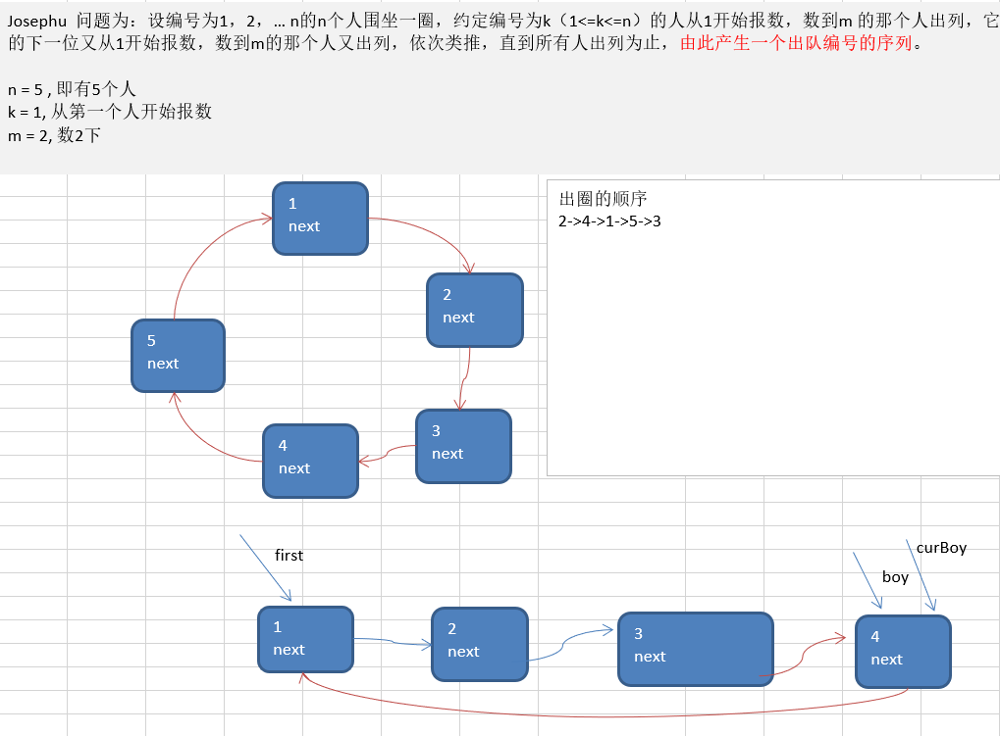
- 约瑟夫问题-创建环形链表的思路图解
    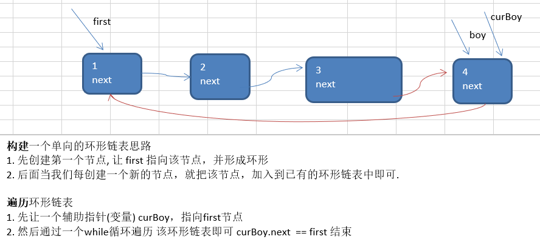
- 约瑟夫问题-小孩出圈的思路分析图
    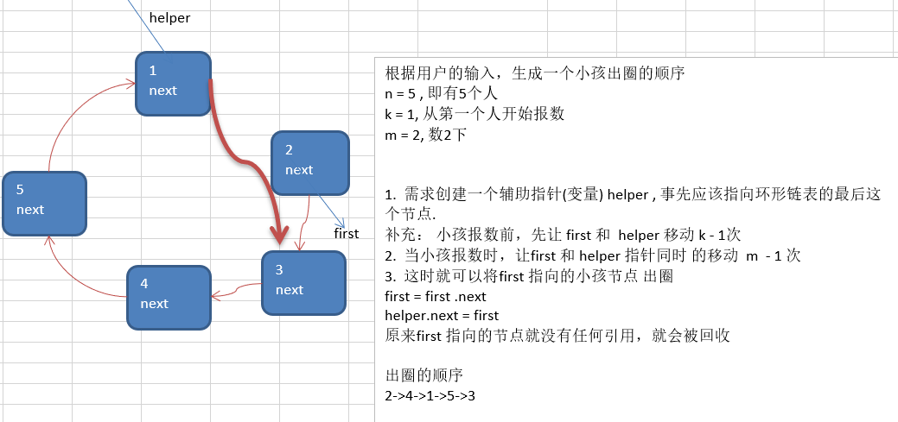

## 4.8 Josephu 问题的代码实现
```java
class CircleSingleLinkedList<E> {
    Node<E> rear;
    int length;
    public add(E e) {
        if (rear == null) {
            rear = new Node<E>(e, null);
            rear.next = rear;
        }else {
            rear.next = new Node<E>(e, rear.next);
        }
        rear = rear.next;
        length++;
    }
    // n个人围坐一圈，约定编号为k（1<=k<=n）的人从1开始报数，数到m的那个人出列
    public static Integer list(int n, int k, int m){
        CircleSingleLinkedList<Integer> list = new CircleSingleLinkedList<Integer>();
        for (int i = 1; i <= n; i++) {
            list.add(i);
        }
        if(csll.length < 2){
            return csll.rear.data;
        }
        Node<Integer> cur = csll.rear;
        for (int i = 1; i < k; i++) {
            cur = cur.next;
        }
        int i = 0;
        while (cur.next != cur) {
            if(++i % m == 0){
                cur.next = cur.next.next;
            }
            cur = cur.next;
        }
        return cur.data;
    }
    private static class Node<E> {
        E data;
        Node<E> next;
        Node(E data, CircleSingleLinkedList.Node<E> next) {
            this.data = data;
            this.next = next;
        }
    }
}
```


# 第5章 栈

## 5.1 栈的一个实际需求

计算机底层是如何计算计算表达式的值的？注意不是简单的把算式列出运算，因为我们看这个算式`7 * 2 * 2 - 5`，但是计算机怎么理解这个算式的(对计算机而言，它接收到的就是一个字符串)，我们讨论的是这个问题。-> 栈

## 5.2 栈的介绍

1. 栈的英文为(stack)
2. 栈是一个先入后出(FILO-First In Last Out)的有序列表。
3. 栈(stack)是限制线性表中元素的插入和删除只能在线性表的同一端进行的一种特殊线性表。允许插入和删除的一端，为变化的一端，称为栈顶(Top)，另一端为固定的一端，称为栈底(Bottom)。
4. 根据栈的定义可知，最先放入栈中元素在栈底，最后放入的元素在栈顶，而删除元素刚好相反，最后放入的元素最先删除，最先放入的元素最后删除
5. 图解方式说明出栈(pop)和入栈(push)的概念
    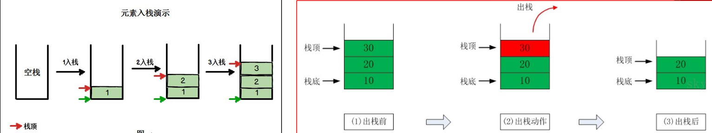

## 5.3 栈的应用场景

1. 子程序的调用：在跳往子程序前，会先将下个指令的地址存到堆栈中，直到子程序执行完后再将地址取出，以回到原来的程序中。
2. 处理递归调用：和子程序的调用类似，只是除了储存下一个指令的地址外，也将参数、区域变量等数据存入堆栈中。
3. 表达式的转换\[中缀表达式转后缀表达式\]与求值(实际解决)。
4. 二叉树的遍历。
5. 图形的深度优先(depth —— first)搜索法。

## 5.4 栈的快速入门

1. 用数组模拟栈的使用，由于栈是一种有序列表，当然可以使用数组的结构来储存栈的数据内容，下面我们就用数组模拟栈的出栈，入栈等操作。
2. 实现思路分析，并画出示意图
    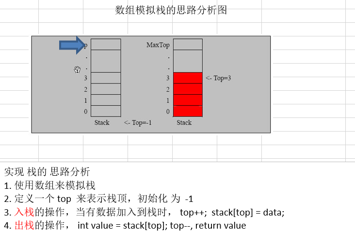
3. 代码实现
    ```java
    class ArrayStack<E>{
        Object[] elementData;
        int elementCount;
        public ArrayStack(int capacity) {
            elementData = new Object[capacity];
        }
        public void push(E item) {
            if(elementCount == elementData.length)
                throw new RuntimeException("栈满");
            elementData[elementCount++] = item;
        }
        public boolean empty() {
            return elementCount == 0;
        }
        public E pop() {
            if(empty())
                throw new RuntimeException("栈空");
            E res = (E) elementData[--elementCount];
            elementData[elementCount] = null;
            return res;
        }
        public E peek() {
            if(empty())
                throw new RuntimeException("栈空");
            return (E) elementData[elementCount-1];
        }
        public void list(Consumer<E> c) {
            for (int i = 0; i < elementCount; i++)
                c.accept(elementData[i]);
        }
    }
    ```
4. 使用链表来模拟栈
    ```java
    class LinkedStack<E> {
        Node<E> top;
        int size;
        public void push(E e) {
            Node<E> node = new Node<E>(e, top);
            top = node;
            size++;
        }
        public boolean empty() {
            return size == 0;
        }
        public E pop() {
            if (empty())
                throw new RuntimeException("栈空");
            E e = top.data;
            top = top.next;
            size--;
            return e;
        }
        public void list(Consumer<E> c) {
            for (Node<E> node = top; node != null; node = node.next)
                c.accept(node.data);
        }
        private static class Node<E> {
            E data;
            Node<E> next;
            public Node(E data, Node<E> next) {
                this.data = data;
                this.next = next;
            }
        }
    }
    ```

## 5.5 栈实现综合计算器(中缀表达式)

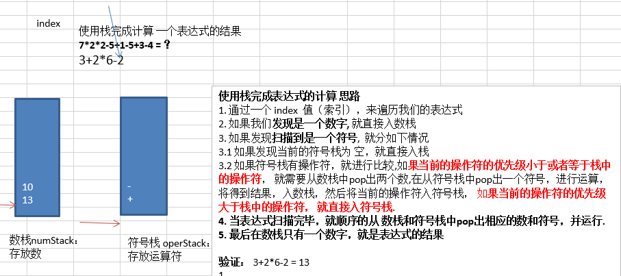

## 5.? 前缀表达式的计算机求值

从右至左扫描表达式，遇到数字时，将数字压入堆栈，遇到运算符时，弹出栈顶的两个数，用运算符对它们做相应的计算（栈顶元素和次顶元素），并将结果入栈；重复上述过程直到表达式最左端，最后运算得出的值即为表达式的结果

例如: (3+4)×5-6 对应的前缀表达式就是 - × + 3 4 5 6，针对前缀表达式求值步骤如下:

- 从右至左扫描，将6、5、4、3压入堆栈
- 遇到+运算符，因此弹出3和4（3为栈顶元素，4为次顶元素），计算出3+4的值，得7，再将7入栈
- 接下来是×运算符，因此弹出7和5，计算出7×5=35，将35入栈
- 最后是-运算符，计算出35-6的值，即29，由此得出最终结果

## 5.? 后缀表达式的计算机求值

从左至右扫描表达式，遇到数字时，将数字压入堆栈，遇到运算符时，弹出栈顶的两个数，用运算符对它们做相应的计算（次顶元素和栈顶元素），并将结果入栈；重复上述过程直到表达式最右端，最后运算得出的值即为表达式的结果

例如: (3+4)×5-6 对应的后缀表达式就是 3 4 + 5 × 6 -，针对后缀表达式求值步骤如下:

- 从左至右扫描，将3和4压入堆栈；
- 遇到+运算符，因此弹出4和3（4为栈顶元素，3为次顶元素），计算出3+4的值，得7，再将7入栈；
- 将5入栈；
- 接下来是×运算符，因此弹出5和7，计算出7×5=35，将35入栈；
- 将6入栈；
- 最后是-运算符，计算出35-6的值，即29，由此得出最终结果

## 5.6 逆波兰计算器

1. 输入一个逆波兰表达式(后缀表达式)，使用栈(Stack)，计算其结果
2. 支持小括号和多位数整数，因为这里我们主要讲的是数据结构，因此计算器进行简化，只支持对整数的计算。
3. 思路分析（例如:(3+4)×5-6对应的后缀表达式就是3 4 + 5 × 6 -，针对后缀表达式求值步骤如下
   1. 从左至右扫描，将3和4压入堆栈；
   2. 遇到+运算符，因此弹出4和3（4为栈顶元素，3为次顶元素），计算出3+4的值，得7，再将7入栈；
   3. 将5入栈；
   4. 接下来是×运算符，因此弹出5和7，计算出7×5=35，将35入栈；
   5. 将6入栈；
   6. 最后是-运算符，计算出35-6的值，即29，由此得出最终结果

## 5.7 中缀表达式转换为后缀表达式

后缀表达式适合计算式进行运算，但是人却不太容易写出来，尤其是表达式很长的情况下，因此在开发中，我们需要将 中缀表达式转成后缀表达式。
    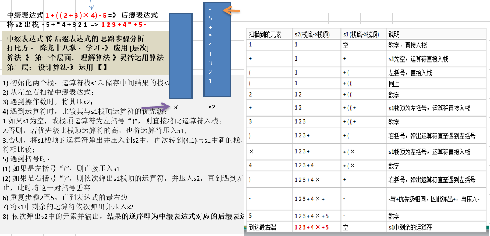

### 5.7.1 具体步骤如下:
1. 初始化两个栈：运算符栈s1和储存中间结果的栈s2；
2. 从左至右扫描中缀表达式；
3. 遇到操作数时，将其压s2；
4. 遇到运算符时，比较其与s1 栈顶运算符的优先级：
   1. 如果s1 为空，或栈顶运算符为左括号"("，则直接将此运算符入栈；
   2. 否则，若优先级比栈顶运算符的高，也将运算符压入s1；
   3. 否则，将s1栈顶的运算符弹出并压入到s2中，再次转到(4-1)与s1中新的栈顶运算符相比较；
5. 遇到括号时：
   1. 如果是左括号"("，则直接压入s1
   2. 如果是右括号")"，则依次弹出s1栈顶的运算符，并压入s2，直到遇到左括号为止，此时将这一对括号丢弃
6. 重复步骤2至5，直到表达式的最右边
7. 将s1中剩余的运算符依次弹出并压入s2
8. 依次弹出s2中的元素并输出，结果的逆序即为中缀表达式对应的后缀表达式

### 5.7.2举例说明
（见5.7图）

### 5.7.3 代码实现中缀表达式转为后缀表达式
（含前面的代码）
```java
class Calculator {
	private static final String OPERATORS = "#+-*/^()";
	private static final int[][] PRIORITY = {// 栈中的运算符相对于当前运算符的优先级
		{ 0, -1, -1, -1, -1, -1, -1, -1 },// # 终止符的优先级很低
		{ 0,  1,  1, -1, -1, -1, -1,  1 },// +
		{ 0,  1,  1, -1, -1, -1, -1,  1 },// -
		{ 0,  1,  1,  1,  1, -1, -1,  1 },// *
		{ 0,  1,  1,  1,  1, -1, -1,  1 },// /
		{ 0,  1,  1,  1,  1, -1, -1,  1 },// ^ 乘方右结合性
		{ 0, -1, -1, -1, -1, -1, -1,  0 },// ( 进栈之后的左括号优先级很低
		{ 0,  0,  0,  0,  0,  0,  0,  0 } };// )栈中不应该有右括号
	private static double calc(String s, double num1, double num2) {
		switch (s) {
		case "+": return num1 + num2;
		case "-": return num1 - num2;
		case "*": return num1 * num2;
		case "/": return num1 / num2;
		case "^": return Math.pow(num1, num2);
		default:  return 0.0;
		}
	}
	// 中缀表达式求值
	public static double calculate(String expression) {
		return calculateRPN(infixToRPN(expression));
	}
	// 后缀表达式求值，元素间使用空格隔开
	public static double calculateRPN(String expression) {
		String[] split = expression.split(" ");
		Stack<Double> stack = new Stack<>();
		for (String s : split) {
			if (s.matches("^(-?\\d+)(\\.\\d+)?$")) {
				stack.push(Double.parseDouble(s));
			} else {
				double num2 = stack.pop();
				double num1 = stack.pop();
				stack.push(calc(s, num1, num2));
			}
		}
		return stack.pop();
	}
	// 中缀表达式转后缀表达式
	public static String infixToRPN(String expression) {
		Stack<Character> stack = new Stack<>();
		ArrayList<String> list = new ArrayList<>();
		StringBuilder sb = new StringBuilder();
		stack.push('#');
		for (int i = 0; i < expression.length(); i++) {
			char cur = expression.charAt(i);
			if (OPERATORS.indexOf(cur) == -1) {
				sb.append(cur);
			} else {
				if (sb.length() > 0) {
					list.add(sb.toString());
					sb.setLength(0);
				}
				while (priorityCompare(stack.peek(), cur) > 0) {
					list.add(stack.pop().toString());
				}
				if (priorityCompare(stack.peek(), cur) == 0) {
					stack.pop();
				} else {
					stack.push(cur);
				}
			}
		}
		list.add(sb.toString());
		while (stack.peek() != '#') {
			list.add(stack.pop().toString());
		}
		return String.join(" ", list);
	}
	private static int priorityCompare(char peek, char cur) {
		return PRIORITY[OPERATORS.indexOf(peek)][OPERATORS.indexOf(cur)];
	}
}
```

## 5.8 逆波兰计算器完整版

### 5.8.1 完整版的逆波兰计算器，功能包括
1. 支持 + - * / ( )
2. 多位数，支持小数,
3. 兼容处理，过滤任何空白字符，包括空格、制表符、换页符
    > 说明：逆波兰计算器完整版考虑的因素较多，下面给出完整版代码供同学们学习，其基本思路和前面一样，也是使用到：中缀表达式转后缀表达式。

### 5.8.2 代码实现
```java
class ReversePolishMultiCalc {
    // 匹配 + - * / ( ) 运算符
    static final String SYMBOL = "\\+|-|\\*|/|\\(|\\)";
    static final String LEFT = "(";
    static final String RIGHT = ")";
    static final String ADD = "+";
    static final String MINUS= "-";
    static final String TIMES = "*";
    static final String DIVISION = "/";
    // 加減 + -
    static final int LEVEL_01 = 1;
    // 乘除
    static final int LEVEL_02 = 2;
    // 括号
    static final int LEVEL_HIGH = Integer.MAX_VALUE;
    static Stack<String> stack = new Stack<>();
    static List<String> data = Collections.synchronizedList(new ArrayList<String>());
    // 去除所有空白符
    public static String replaceAllBlank(String s ){
        // \\s+ 匹配任何空白字符，包括空格、制表符、换页符等等, 等价于[ \f\n\r\t\v]
        return s.replaceAll("\\s+","");
    }
    // 判断是不是数字 int double long float
    public static boolean isNumber(String s){
        Pattern pattern = Pattern.compile("^[-\\+]?[.\\d]*$");
        return pattern.matcher(s).matches();
    }
    // 判断是不是运算符
    public static boolean isSymbol(String s){
        return s.matches(SYMBOL);
    }
    // 匹配运算等级
    public static int calcLevel(String s){
        if("+".equals(s) || "-".equals(s)){
            return LEVEL_01;
        } else if("*".equals(s) || "/".equals(s)){
            return LEVEL_02;
        }
        return LEVEL_HIGH;
    }
    // 匹配
    public static List<String> doMatch (String s) throws Exception{
        if(s == null || "".equals(s.trim())) throw new RuntimeException("data is empty");
        if(!isNumber(s.charAt(0)+"")) throw new RuntimeException("data illeagle,start not with a number");
        s = replaceAllBlank(s);
        String each;
        int start = 0;
        for (int i = 0; i < s.length(); i++) {
            if(isSymbol(s.charAt(i)+"")){
                each = s.charAt(i)+"";
                //栈为空，(操作符，或者 操作符优先级大于栈顶优先级 && 操作符优先级不是( )的优先级 及是 ) 不能直接入栈
                if(stack.isEmpty() || LEFT.equals(each)
                        || ((calcLevel(each) > calcLevel(stack.peek())) && calcLevel(each) < LEVEL_HIGH)){
                    stack.push(each);
                }else if( !stack.isEmpty() && calcLevel(each) <= calcLevel(stack.peek())){
                    //栈非空，操作符优先级小于等于栈顶优先级时出栈入列，直到栈为空，或者遇到了(，最后操作符入栈
                    while (!stack.isEmpty() && calcLevel(each) <= calcLevel(stack.peek()) ){
                        if(calcLevel(stack.peek()) == LEVEL_HIGH){
                            break;
                        }
                        data.add(stack.pop());
                    }
                    stack.push(each);
                }else if(RIGHT.equals(each)){
                    // ) 操作符，依次出栈入列直到空栈或者遇到了第一个)操作符，此时)出栈
                    while (!stack.isEmpty() && LEVEL_HIGH >= calcLevel(stack.peek())){
                        if(LEVEL_HIGH == calcLevel(stack.peek())){
                            stack.pop();
                            break;
                        }
                        data.add(stack.pop());
                    }
                }
                start = i ;    //前一个运算符的位置
            }else if( i == s.length()-1 || isSymbol(s.charAt(i+1)+"") ){
                each = start == 0 ? s.substring(start,i+1) : s.substring(start+1,i+1);
                if(isNumber(each)) {
                    data.add(each);
                    continue;
                }
                throw new RuntimeException("data not match number");
            }
        }
        //如果栈里还有元素，此时元素需要依次出栈入列，可以想象栈里剩下栈顶为/，栈底为+，应该依次出栈入列，可以直接翻转整个stack 添加到队列
        Collections.reverse(stack);
        data.addAll(new ArrayList<>(stack));
        System.out.println(data);
        return data;
    }
    // 算出结果
    public static Double doCalc(List<String> list){
        Double d = 0d;
        if(list == null || list.isEmpty()){
            return null;
        }
        if (list.size() == 1){
            System.out.println(list);
            d = Double.valueOf(list.get(0));
            return d;
        }
        ArrayList<String> list1 = new ArrayList<>();
        for (int i = 0; i < list.size(); i++) {
            list1.add(list.get(i));
            if(isSymbol(list.get(i))){
                Double d1 = doTheMath(list.get(i - 2), list.get(i - 1), list.get(i));
                list1.remove(i);
                list1.remove(i-1);
                list1.set(i-2,d1+"");
                list1.addAll(list.subList(i+1,list.size()));
                break;
            }
        }
        doCalc(list1);
        return d;
    }
    // 运算
    public static Double doTheMath(String s1,String s2,String symbol){
        Double result ;
        switch (symbol){
            case ADD : result = Double.valueOf(s1) + Double.valueOf(s2); break;
            case MINUS : result = Double.valueOf(s1) - Double.valueOf(s2); break;
            case TIMES : result = Double.valueOf(s1) * Double.valueOf(s2); break;
            case DIVISION : result = Double.valueOf(s1) / Double.valueOf(s2); break;
            default : result = null;
        }
        return result;
    }
    public static void main(String[] args) {
        //String math = "9+(3-1)*3+10/2";
        String math = "12.8 + (2 - 3.55)*4+10/5.0";
        try {
            doCalc(doMatch(math));
        } catch (Exception e) {
            e.printStackTrace();
        }
    }
}
```


# 第6章 递归

## 6.1 递归应用场景
迷宫问题(回溯)、汉诺塔、阶乘问题

## 6.2 递归的概念
递归就是方法自己调用自己，每次调用时传入不同的变量。

## 6.3 递归调用机制
1. 打印问题
2. 阶乘问题
3. 使用图解方式说明了递归的调用机制
    
4. 代码演示
```java
public static int factorial(int n) {
    return n == 1 ? 1 : factorial(n - 1) * n;
}
```

## 6.4 递归能解决什么样的问题
1. 各种数学问题如：8皇后问题，汉诺塔，阶乘问题，迷宫问题，球和篮子的问题(google编程大赛)
2. 各种算法中也会使用到递归，比如快排，归并排序，二分查找，分治算法等。
3. 将用栈解决的问题 -> 递归代码比较简洁

## 6.5 递归需要遵守的重要规则
1. 执行一个方法时，就创建一个新的受保护的独立空间(栈空间)
2. 方法的局部变量是独立的，不会相互影响, 比如n变量
3. 如果方法中使用的是引用类型变量(比如数组)，就会共享该引用类型的数据
4. 递归 **必须向退出递归的条件逼近**，否则就是无限递归,出现StackOverflowError，死龟了:)
5. 当一个方法执行完毕，或者遇到return，就会返回，**遵守谁调用，就将结果返回给谁**，同时当方法执行完毕或者返回时，该方法也就执行完毕。

## 6.6 递归-迷宫问题

### 6.6.1 代码
```java
// 使用递归回溯来给小球找路：说明（调用方式：setWay(map, 1, 1);// 使用递归回溯给小球找路）
// 1. map表示地图
// 2. i,j表示从地图的哪个位置开始出发(1,1)
// 3. 如果小球能到 map[6][5] 位置，则说明通路找到
// 4. 约定：当map[i][j]为0表示该点没有走过当为1表示墙；2表示通路可以走；3表示该点已经走过，但是走不通
// 5. 在走迷宫时，需要确定一个策略(方法)下->右->上->左，如果该点走不通，再回溯
public static boolean setWay(int[][] map, int i, int j) {
    if (map[6][5] == 2) { // 通路已经找到ok
        return true;
    } else {
        if (map[i][j] == 0) { // 如果当前这个点还没有走过
            // 按照策略 下->右->上->左 走
            map[i][j] = 2; // 假定该点是可以走通.
            if (setWay(map, i + 1, j)) {// 向下走
                return true;
            } else if (setWay(map, i, j + 1)) { // 向右走
                return true;
            } else if (setWay(map, i - 1, j)) { // 向上
                return true;
            } else if (setWay(map, i, j - 1)) { // 向左走
                return true;
            } else {
                map[i][j] = 3;// 说明该点是走不通，是死路
                return false;
            }
        } else { // 如果map[i][j] != 0 , 可能是 1， 2， 3
            return false;
        }
    }
}
```

### 6.6.2 讨论
1. 小球得到的路径，和程序员设置的找路策略有关即：找路的上下左右的顺序相关
2. 再得到小球路径时，可以先使用(下右上左)，再改成(上右下左)，看看路径是不是有变化
3. 测试回溯现象
4. 思考：如何求出最短路径？思路 -> 代码实现

## 6.7 递归-八皇后问题(回溯算法)

### 6.7.1 八皇后问题介绍
八皇后问题，是一个古老而著名的问题，是回溯算法的典型案例。该问题是国际西洋棋棋手马克斯·贝瑟尔于1848年提出：在8×8格的国际象棋上摆放八个皇后，使其不能互相攻击，即：**任意两个皇后都不能处于同一行、同一列或同一斜线上**，有92种摆法

### 6.7.2 八皇后问题算法思路分析
1. 第一个皇后先放第一行第一列
2. 第二个皇后放在第二行第一列、然后判断是否OK，如果不OK，继续放在第二列、第三列、依次把所有列都放完，找到一个合适
3. 继续第三个皇后，还是第一列、第二列......直到第8个皇后也能放在一个不冲突的位置，算是找到了一个正确解
4. 当得到一个正确解时，在栈回退到上一个栈时，就会开始回溯，即将第一个皇后，放到第一列的所有正确解，全部得到
5. 然后回头继续第一个皇后放第二列，后面继续循环执行1,2,3,4的步骤
6. 示意图:
    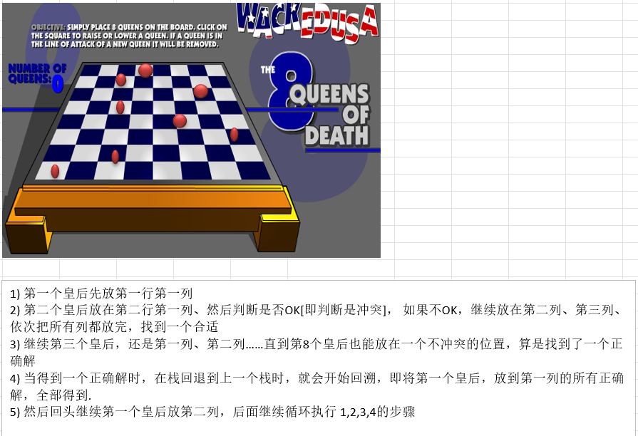
    ```java
    // 说明：理论上应该创建一个二维数组来表示棋盘，但是实际上可以通过算法，用一个一维数组即可解决问题。
    arr[8] = {0, 4, 7, 5, 2, 6, 1, 3};
    //对应arr下标表示第几行，即第几个皇后，arr[i]=val,val表示第i+1个皇后，放在第i+1行的第val+1列
    ```

### 6.7.3 八皇后问题算法代码实现
```java
public class Queue8 {
	int max = 8;// 共有max个皇后
	int[] array = new int[max];// 皇后放置位置的结果,例arr={0,4,7,5,2,6,1,3}
	static int count = 0;
	static int judgeCount = 0;
	public static void main(String[] args) {
		new Queue8().check(0);
		System.out.println("一共有" + count + "解法");
		System.out.println("一共判断冲突的次数" + judgeCount + "次"); // 15720

	}
	// 编写一个方法，放置第n个皇后
	// 特别注意：check是每一次递归时，进入到check中都有for(int i = 0; i < max; i++)，因此会有回溯
	private void check(int n) {
		if (n == max) { // n = 8 , 其实8个皇后就既然放好
			count++;// 将皇后摆放的位置输出
            System.out.println(Arrays.toString(array));
			return;
		}
		// 依次放入皇后，并判断是否冲突
		for (int i = 0; i < max; i++) {
			array[n] = i;// 先把当前这个皇后n,放到该行的第1列
			// 判断当放置第n个皇后到i列时，是否冲突
			if (judge(n)) { // 不冲突
				check(n + 1); // 接着放n+1个皇后,即开始递归
			}
        // 如果冲突，就继续执行array[n]=i;即将第n个皇后，放置在本行得后移的一个位置
		}
	}
	// 查看当我们放置第n个皇后, 就去检测该皇后是否和前面已经摆放的皇后冲突
	private boolean judge(int n) {
		judgeCount++;
		for (int i = 0; i < n; i++) {
			// 说明
			// 1. array[i]==array[n] 表示判断 第n个皇后是否和前面的n-1个皇后在同一列
			// 2. Math.abs(n-i)==Math.abs(array[n]-array[i]) 表示判断第n个皇后是否和第i皇后是否在同一斜线
			// n=1 放置第2列1 n=1 array[1]=1
			// Math.abs(1-0)==1 Math.abs(array[n]-array[i])=Math.abs(1-0)=1
			// 3. 判断是否在同一行, 没有必要，n每次都在递增
			if (array[i] == array[n] || Math.abs(n - i) == Math.abs(array[n] - array[i])) {
				return false;
			}
		}
		return true;
	}
}
```


# 第7章 排序算法

## 7.1 排序算法的介绍
排序也称排序算法(Sort Algorithm)，排序是将**一组数据**，依**指定的顺序**进行**排列的过程**。

## 7.2 排序的分类
1. 内部排序：指将需要处理的所有数据都加载到 **内部存储器(内存)** 中进行排序。
2. 外部排序法：**数据量过大**，无法全部加载到内存中，需要借助 **外部存储(文件等)** 进行排序。
3. 常见的排序算法分类(见右图):
    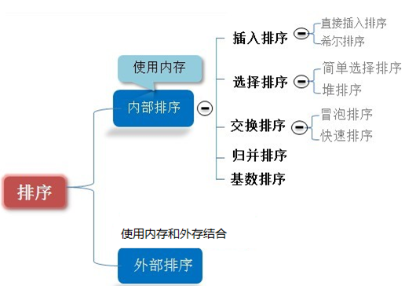

## 7.3 算法的时间复杂度

### 7.3.1 度量一个程序(算法)执行时间的两种方法
- 事后统计的方法
    > 这种方法可行，但是有两个问题：一是要想对设计的算法的运行性能进行评测，需要实际运行该程序；二是所得时间的统计量依赖于计算机的硬件、软件等环境因素，这种方式，要在同一台计算机的相同状态下运行，才能比较那个算法速度更快。
- 事前估算的方法
    > 通过分析某个算法的**时间复杂度**来判断哪个算法更优。

### 7.3.2 时间频度
- 时间频度：一个算法花费的时间与算法中语句的执行次数成正比例，哪个算法中语句执行次数多，它花费时间就多。一个算法中的语句执行次数称为语句频度或时间频度。记为T(n)。
- 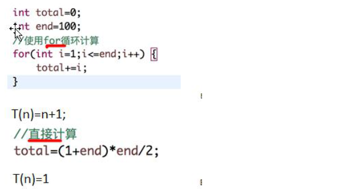
- 忽略常数项、低次项、系数

### 7.3.3 时间复杂度
1. 一般情况下，**算法中的基本操作语句的重复执行次数是问题规模n的某个函数**，用T(n)表示，若有某个辅助函数f(n)，使得当n趋近于无穷大时，T(n)/f(n)的极限值为不等于零的常数，则称f(n)是T(n)的同数量级函数。记作T(n)=Ｏ(f(n))，称Ｏ(f(n))为算法的渐进时间复杂度，简称时间复杂度。
2. T(n)不同，但时间复杂度可能相同。如：T(n)=n²+7n+6与T(n)=3n²+2n+2它们的T(n)不同，但时间复杂度相同，都为O(n²)。
3. 计算时间复杂度的方法：
   1. 用常数1代替运行时间中的所有加法常数 T(n)=n²+7n+6 => T(n)=n²+7n+1
   2. 修改后的运行次数函数中，只保留最高阶项 T(n)=n²+7n+1 => T(n) = n²
   3. 去除最高阶项的系数 T(n) = n² => T(n) = n² => O(n²)

### 7.3.4 常见的时间复杂度
1. 常数阶O(1)
2. 对数阶O(log<sub>2</sub>n)
3. 线性阶O(n)
4. 线性对数阶O(nlog<sub>2</sub>n)
5. 平方阶O(n^2)
6. 立方阶O(n^3)
7. k次方阶O(n^k)
8. 指数阶O(2^n)

- 常见的时间复杂度对应的图:
    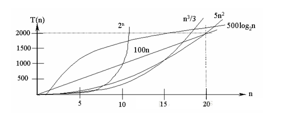
- 说明：
  - 常见的算法时间复杂度由小到大依次为：Ο(1)＜Ο(log2n)＜Ο(n)＜Ο(nlog2n)＜Ο(n2)＜Ο(n3)＜Ο(nk)＜Ο(2n)，随着问题规模n的不断增大，上述时间复杂度不断增大，算法的执行效率越低
  - 从图中可见，我们应该尽可能避免使用指数阶的算法
- 【各个时间复杂度的举例说明略】

### 7.3.5 平均时间复杂度和最坏时间复杂度
1. 平均时间复杂度是指所有可能的输入实例均以等概率出现的情况下，该算法的运行时间。
2. 最坏情况下的时间复杂度称最坏时间复杂度。一般讨论的时间复杂度均是最坏情况下的时间复杂度。这样做的原因是：最坏情况下的时间复杂度是算法在任何输入实例上运行时间的界限，这就保证了算法的运行时间不会比最坏情况更长。
3. 平均时间复杂度和最坏时间复杂度是否一致，和算法有关(如图:)。
    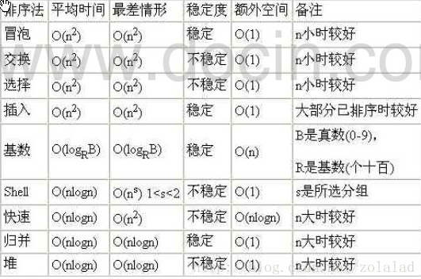

## 7.4 算法的空间复杂度简介

1. 类似于时间复杂度的讨论，一个算法的空间复杂度(Space Complexity)定义为该算法所耗费的存储空间，它也是问题规模n的函数。
2. 空间复杂度(Space Complexity)是对一个算法在运行过程中临时占用存储空间大小的量度。有的算法需要占用的临时工作单元数与解决问题的规模n有关，它随着n的增大而增大，当n较大时，将占用较多的存储单元，例如快速排序和归并排序算法，基数排序就属于这种情况
3. 在做算法分析时，主要讨论的是时间复杂度。从用户使用体验上看，更看重的程序执行的速度。一些缓存产品(redis, memcache)和算法(基数排序)本质就是用空间换时间。

## 7.5 冒泡排序

### 7.5.1 基本介绍
冒泡排序（Bubble Sorting）的基本思想是：通过对待排序序列从前向后（从下标较小的元素开始），**依次比较相邻元素的值，若发现逆序则交换**，使值较大的元素逐渐从前移向后部，就象水底下的气泡一样逐渐向上冒。

优化：  
因为排序的过程中，各元素不断接近自己的位置，**如果一趟比较下来没有进行过交换，就说明序列有序**，因此要在排序过程中设置一个标志flag判断元素是否进行过交换。从而减少不必要的比较。(这里说的优化，可以在冒泡排序写好后，在进行)

### 7.5.2 演示冒泡过程的例子(图解)
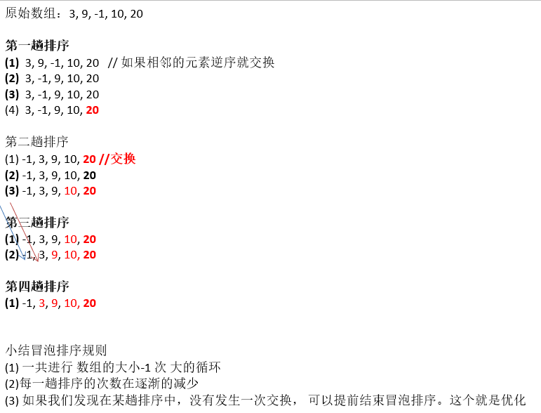

### 7.5.3 冒泡排序应用实例
```java
public static void bubbleSort(int[] arr) {
    int len = arr.length;
    for (int i = 0; i < len - 1; i++) {
        boolean flag = false;
        for (int j = 0; j < len - 1 - i; j++) {
            if (arr[j] > arr[j + 1]) {
                flag = true;
                int temp = arr[j];
                arr[j] = arr[j + 1];
                arr[j + 1] = temp;
            }
        }
        if (!flag) break;
    }
}
```

## 7.6 选择排序

### 7.6.1 基本介绍
选择式排序也属于内部排序法，是从欲排序的数据中，按指定的规则选出某一元素，再依规定交换位置后达到排序的目的。

### 7.6.2 选择排序思想
`选择排序（select sorting）也是一种简单的排序方法。它的基本思想是：第一次从arr[0]~arr[n-1]中选取最小值，与arr[0]交换，第二次从arr[1]~arr[n-1]中选取最小值，与arr[1]交换，第三次从arr[2]~arr[n-1]中选取最小值，与arr[2]交换，...，第i次从arr[i-1]~arr[n-1]中选取最小值，与arr[i-1]交换，..., 第n-1次从arr[n-2]~arr[n-1]中选取最小值，与arr[n-2]交换，总共通过n-1次，得到一个按排序码从小到大排列的有序序列。`

### 7.6.3 选择排序思路分析图
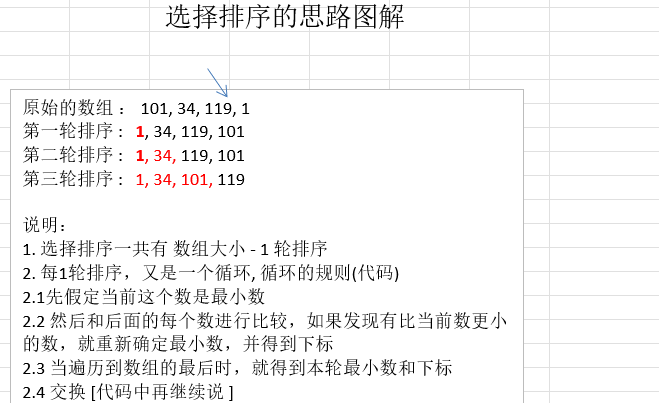

### 7.6.4 选择排序应用实例
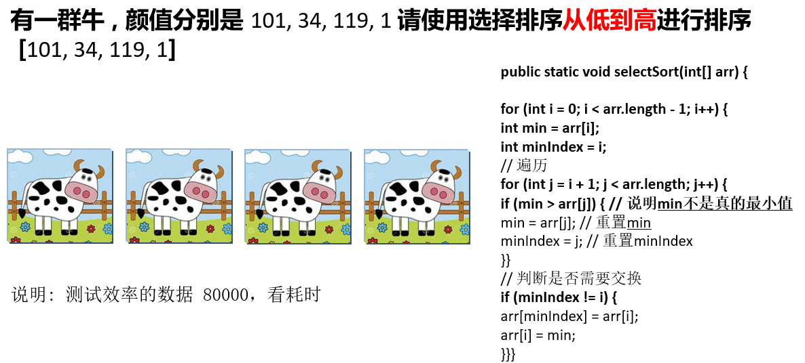

```java
public static void selectSort(int[] arr) {
    int len = arr.length;
    for (int i = 0; i < len - 1; i++) {
        int min = i;
        for (int j = i + 1; j < len; j++) {
            if (arr[j] < arr[min]) {
                min = j;
            }
        }
        if (min != i) {
            int temp = arr[i];
            arr[i] = arr[min];
            arr[min] = temp;
        }
    }
}
```

## 7.7 插入排序

### 7.7.1 插入排序法介绍
插入式排序属于内部排序法，是对于欲排序的元素以插入的方式找寻该元素的适当位置，以达到排序的目的。

### 7.7.2 插入排序法思想
插入排序（Insertion Sorting）的基本思想是：**把n个待排序的元素看成为一个有序表和一个无序表**，开始时 **有序表中只包含一个元素**，无序表中包含有**n-1个元素**，排序过程中每次从无序表中取出第一个元素，把它的排序码依次与有序表元素的排序码进行比较，将它插入到有序表中的适当位置，使之成为新的有序表。

### 7.7.3 插入排序思路图
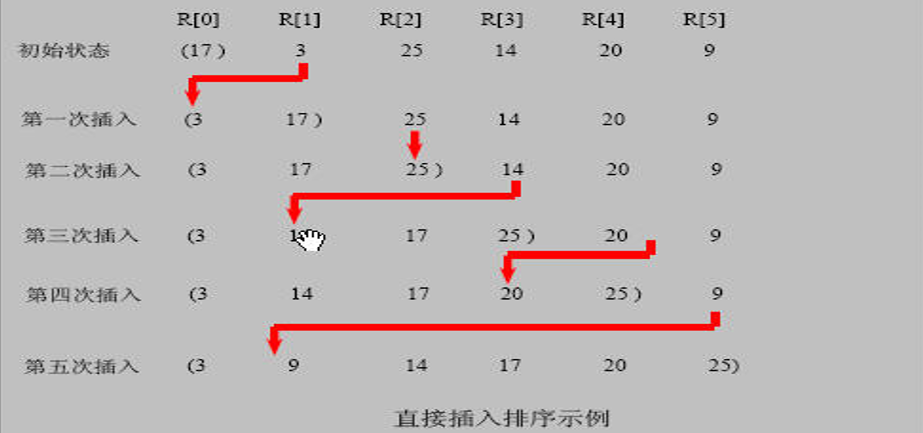

### 7.7.4 插入排序法应用实例
```java
public static void insertSort(int[] arr) {
    int len = arr.length;
    for (int i = 1; i < len; i++) {
        int temp = arr[i], j;
        for (j = i - 1; j >= 0 && arr[j] > temp; j--) {
            arr[j + 1] = arr[j];
        }
        arr[j + 1] = temp;
    }
}
```

## 7.8 希尔排序

### 7.8.1 简单插入排序存在的问题
当需要插入的数是较小的数时，后移的次数明显增多，对效率有影响。

### 7.8.2 希尔排序法介绍
希尔排序是希尔（Donald Shell）于1959年提出的一种排序算法。希尔排序也是一种插入排序，它是简单插入排序经过改进之后的一个**更高效的版本**，也称为**缩小增量排序**。

### 7.8.3 希尔排序法基本思想
希尔排序是把记录按下标的一定增量分组，对每组使用直接插入排序算法排序；随着增量逐渐减少，每组包含的关键词越来越多，**当增量减至1时**，整个文件恰被分成一组，算法便终止。

### 7.8.4 希尔排序法的示意图
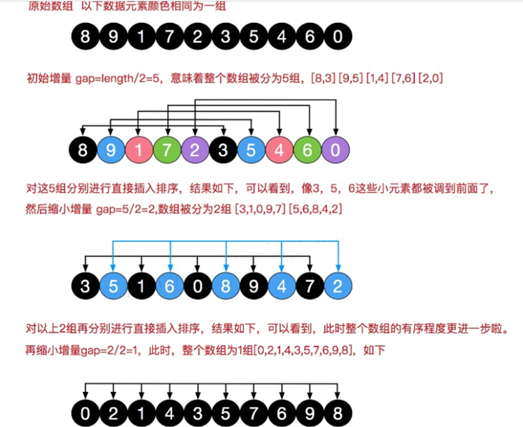

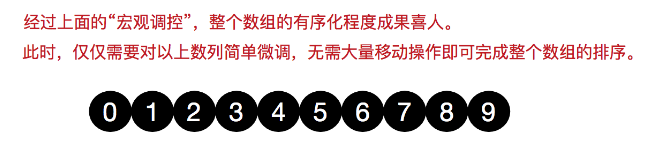

### 7.8.5 希尔排序法应用实例
1. 交换法
    ```java
    public static void shellSort(int[] arr) {
        int len = arr.length;
        int gap = len / 2;
        while (gap > 0) {
            for (int i = gap; i < len; i++) {
                int temp = arr[i], j;
                for (j = i - gap; j >= 0 && arr[j] > temp; j -= gap) {
                    if (arr[j] > arr[j + gap]) {
                        temp = arr[j];
                        arr[j] = arr[j + gap];
                        arr[j + gap] = temp;
                    }
                }
            }
            gap /= 2;
        }
    }
    ```
1. 移动法（★）
    ```java
    public static void shellSort(int[] arr) {
        int len = arr.length;
        int gap = len / 2;
        while (gap > 0) {
            for (int i = gap; i < len; i++) {
                int temp = arr[i], j;
                for (j = i - gap; j >= 0 && arr[j] > temp; j -= gap) {
                    arr[j + gap] = arr[j];
                }
                arr[j + gap] = temp;
            }
            gap /= 2;
        }
    }
    ```

## 7.9 快速排序

### 7.9.1 快速排序法介绍
快速排序（Quicksort）是对**冒泡排序**的一种改进。基本思想是：通过一趟排序将要排序的数据分割成独立的两部分，其中一部分的所有数据都比另外一部分的所有数据都要小，然后再按此方法对这两部分数据分别进行快速排序，**整个排序过程可以递归进行**，以此达到整个数据变成有序序列。

### 7.9.2 快速排序法示意图
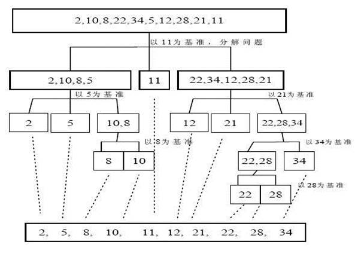

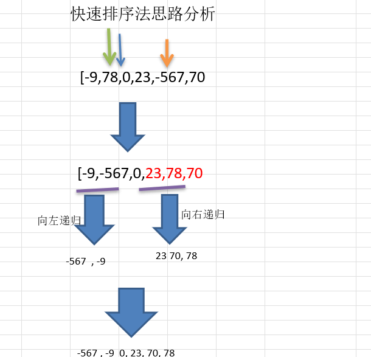

### 7.9.3 快速排序法应用实例
```java
private static void quickSort(int[] arr, int left, int right) {
    int l = left; // 左下标
    int r = right; // 右下标
    // pivot 中轴值
    int pivot = arr[(left + right) / 2];
    int temp = 0; // 临时变量，作为交换时使用
    // while循环的目的是让比pivot 值小放到左边
    // 比pivot 值大放到右边
    while (l < r) {
        // 在pivot的左边一直找,找到大于等于pivot值,才退出
        while (arr[l] < pivot) {
            l += 1;
        }
        // 在pivot的右边一直找,找到小于等于pivot值,才退出
        while (arr[r] > pivot) {
            r -= 1;
        }
        // 如果l >= r说明pivot 的左右两的值，已经按照左边全部是
        // 小于等于pivot值，右边全部是大于等于pivot值
        if (l >= r) {
            break;
        }
        // 交换
        temp = arr[l];
        arr[l] = arr[r];
        arr[r] = temp;
        // 如果交换完后，发现这个arr[l] == pivot值 相等 r--， 前移
        if (arr[l] == pivot) {
            r -= 1;
        }
        // 如果交换完后，发现这个arr[r] == pivot值 相等 l++， 后移
        if (arr[r] == pivot) {
            l += 1;
        }
    }
    if (l == r) {// 如果 l == r, 必须l++, r--, 否则为出现栈溢出
        l += 1;
        r -= 1;
    }
    if (left < r) {// 向左递归
        quickSort(arr, left, r);
    }
    if (right > l) {// 向右递归
        quickSort(arr, l, right);
    }
}
public static void quickSort(int[] arr) {
    quickSort(arr, 0, arr.length - 1);
}
```

## 7.10 归并排序

### 7.10.1 归并排序介绍
归并排序（MERGE-SORT）是利用归并的思想实现的排序方法，该算法采用经典的分治（divide-and-conquer）策略（分治法将问题分(divide)成一些小的问题然后递归求解，而治(conquer)的阶段则将分的阶段得到的各答案"修补"在一起，即分而治之）。

### 7.10.2 归并排序思想示意图1-基本思想
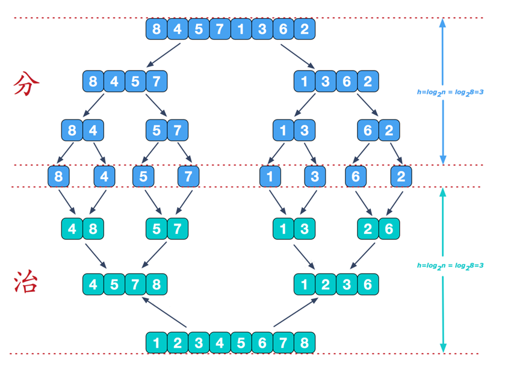

### 7.10.3 归并排序思想示意图2-合并相邻有序子序列
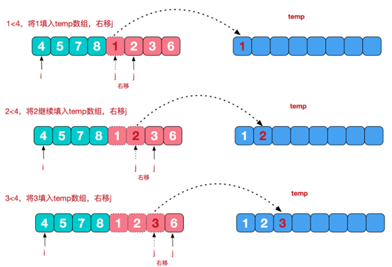
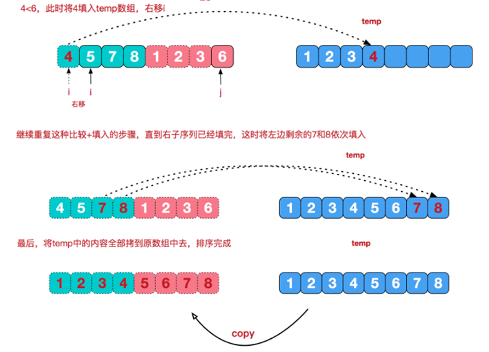

### 7.10.4 归并排序的应用实例
```java
private static void merge(int[] arr, int[] temp, int left, int mid, int right) {
    int i = left, j = mid + 1, k = left;
    while (i <= mid && j <= right) {
        if (arr[i] < arr[j]) {
            temp[k++] = arr[i++];
        } else {
            temp[k++] = arr[j++];
        }
    }
    while (i <= mid)
        temp[k++] = arr[i++];
    while (j <= right)
        temp[k++] = arr[j++];
    for (int m = left; m <= right; m++)
        arr[m] = temp[m];
}
public static void mergeSort(int[] arr, int[] temp, int left, int right) {
    if (left < right) {
        int mid = (left + right) / 2;
        mergeSort(arr, temp, left, mid);
        mergeSort(arr, temp, mid + 1, right);
        merge(arr, temp, left, mid, right);
    }
}
public static void mergeSort(int[] arr) {
    int[] temp = new int[arr.length];
    mergeSort(arr, temp, 0, arr.length - 1);
}
```

## 7.11 基数排序

### 7.11.1 基数排序(桶排序)介绍
1. 基数排序（radix sort）属于“分配式排序”（distribution sort），又称“桶子法”（bucket sort）或bin sort，顾名思义，它是通过键值的各个位的值，将要排序的元素分配至某些“桶”中，达到排序的作用
2. 基数排序法是属于稳定性的排序，基数排序法的是效率高的**稳定性**排序法
3. 基数排序(Radix Sort)是桶排序的扩展
4. 基数排序是1887年赫尔曼·何乐礼发明的。它是这样实现的：将整数按位数切割成不同的数字，然后按每个位数分别比较。

### 7.11.2 基数排序基本思想
1. 将所有待比较数值统一为同样的数位长度，数位较短的数前面补零。然后，从最低位开始，依次进行一次排序。
这样从最低位排序一直到最高位排序完成以后，数列就变成一个有序序列。
2. 这样说明，比较难理解，下面我们看一个图文解释，理解基数排序的步骤

### 7.11.3 基数排序图文说明
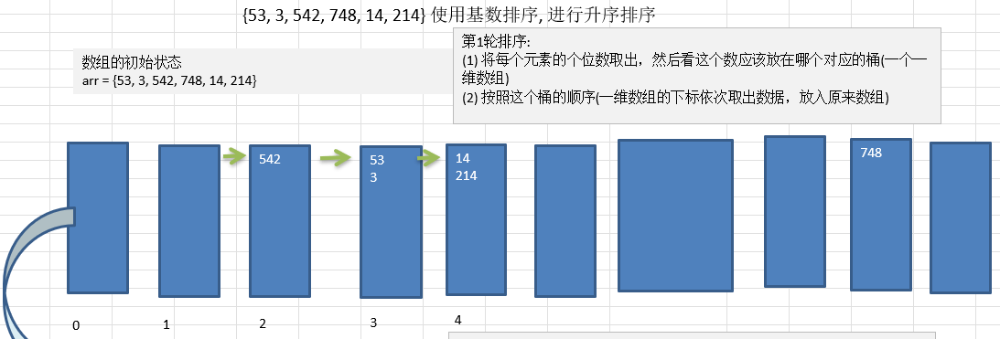
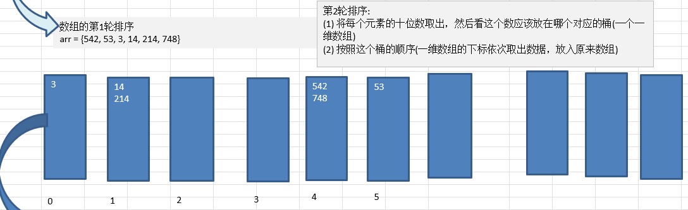
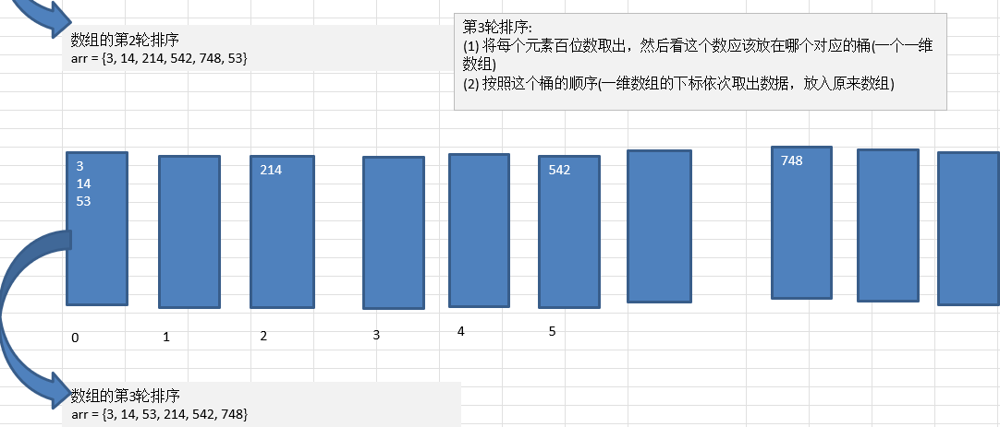

### 7.11.4 基数排序代码实现
```java
public static void radixSort(int[] arr) {
    // 遍历arr, 找到数组中的最大值以确定要进行多少轮排序
    int max = arr[0];
    for (int i = 1; i < arr.length; i++) {
        if (arr[i] > max) {
            max = arr[i];
        }
    }
    int maxLength = (max + "").length();// 确定最大值的位数
    // 定义一个二维数组， 就是10个桶
    // 1. 该二维数组有10个一维数组 0-9
    // 2. 为了防止溢出，每个一维数组(桶)，大小定为 arr.length
    // 3. 很明确, 基数排序是空间换时间
    int[][] bucket = new int[10][arr.length];
    // 用于记录在每个桶中，实际存放了多少个数据,这样才能正确的取出
    int[] bucketElementCounts = new int[10];
    // 根据最大长度的数决定比较的次数
    // 1. 大循环的次数就是 最大数有多少位,前面分析过
    // 2. n = 1, n *= 10 是为了每轮循环排序时，分别求出各个元素的 个位，十位，百位，千位 ...
    // 3. 这个基础排序，完全可以使用 冒泡分步写代码来完成，比较简单!!
    for (int i = 0, n = 1; i < maxLength; i++, n *= 10) {
        // 把每一个数字分别计算本轮循环的位数的值,比如第1轮是个位...
        for (int j = 0; j < arr.length; j++) {
            int digitOfElement = arr[j] / n % 10;// 计算
            // 把当前遍历的数据放入指定的数组中，并将其计数器加1
            bucket[digitOfElement][bucketElementCounts[digitOfElement]++] = arr[j];
        }
        int index = 0;// 记录取的元素需要放的位置
        // 把各个桶中(10个桶)存放的数字取出来, 放入到arr中
        for (int k = 0; k < bucketElementCounts.length; k++) {
            // 如果这个桶中，有数据才取，没有数据就不取了
            if (bucketElementCounts[k] != 0) {
                for (int l = 0; l < bucketElementCounts[k]; l++) {
                    arr[index++] = bucket[k][l];
                }
                bucketElementCounts[k] = 0; // 把这个桶的对应的记录的数据个数置为0,注意,桶本身数据(前面存的数据还在)
            }
        }
    }
}
```

### 7.11.5 基数排序的说明
1. 基数排序是对传统桶排序的扩展，速度很快
2. 基数排序是经典的空间换时间的方式，占用内存很大, 当对海量数据排序时，容易造成OutOfMemoryError。
3. 基数排序时稳定的。\[注:假定在待排序的记录序列中，存在多个具有相同的关键字的记录，若经过排序，这些记录的相对次序保持不变，即在原序列中，r\[i\]=r\[j\]，且r\[i\]在r\[j\]之前，而在排序后的序列中，r\[i\]仍在r\[j\]之前，则称这种排序算法是稳定的；否则称为不稳定的\]
4. 有负数的数组，我们不用基数排序来进行排序, 如果要支持负数，参考: https://code.i-harness.com/zh-CN/q/e98fa9 （我的思路：正负数分离，整数部分正常排序，负数部分取绝对值排序后逆序取相反数与正数部分合并）。

## 7.12 常用排序算法总结和对比

### 7.12.1 一张排序算法的比较图
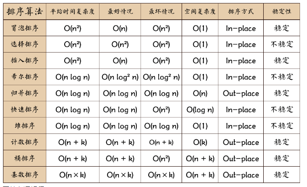

### 7.12.2 相关术语解释
1. 稳定：如果a原本在b前面，而a=b，排序之后a仍然在b的前面；
2. 不稳定：如果a原本在b的前面，而a=b，排序之后a可能会出现在b的后面；
3. 内排序：所有排序操作都在内存中完成；
4. 外排序：由于数据太大，因此把数据放在磁盘中，而排序通过磁盘和内存的数据传输才能进行；
5. 时间复杂度：一个算法执行所耗费的时间。
6. 空间复杂度：运行完一个程序所需内存的大小。
7. n: 数据规模
8. k: “桶”的个数
9. In-place: 不占用额外内存
10. Out-place: 占用额外内存


# 第8章 查找算法

## 8.1 查找算法介绍
在java中，我们常用的查找有四种
1. 顺序(线性)查找
2. 二分查找/折半查找
3. 插值查找
4. 斐波那契查找

## 8.2 线性查找算法
```java
public static int seqSearch(int[] arr, int value) {
    for (int i = 0; i < arr.length; i++) {
        if(arr[i] == value) {
            return i;
        }
    }
    return -1;
}
```

## 8.3 二分查找算法

### 8.3.1 二分查找的思路分析
1. 首先确定该数组的中间的下标：mid = (left + right) / 2
2. 然后让需要查找的数 findVal 和 arr\[mid\] 比较
   1. findVal > arr\[mid\]，说明你要查找的数在mid的右边，因此需要递归的向右查找
   2. findVal < arr\[mid\]，说明你要查找的数在mid的左边，因此需要递归的向左查找
   3. findVal == arr\[mid\]说明找到，就返回

递归结束条件
1. 找到就结束递归 
2. 递归完整个数组，仍然没有找到findVal，也需要结束递归当left>right就需要退出

### 8.3.2 二分查找的代码
```java
public static int binarySearch(int[] arr, int target) {
    int left = 0;
    int right = arr.length - 1;
    while (left <= right) {
        int mid = (left + right) / 2;
        if (arr[mid] == target) {
            return mid;
        } else if (arr[mid] < target) {
            left = mid + 1;
        } else {
            right = mid - 1;
        }
    }
    return -1;
}
```

## 8.4 插值查找算法
1. 插值查找算法类似于二分查找，不同的是插值查找每次从自适应mid处开始查找。
2. 将折半查找中的求mid索引的公式，low表示左边索引left，high表示右边索引right（key 就是前面我们讲的findVal）
    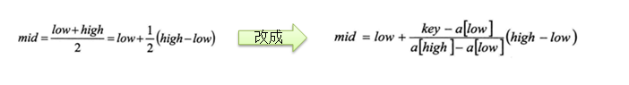
3. `int mid = low + (high - low) * (key - arr[low]) / (arr[high] - arr[low]);/*插值索引*/`
4. 举例说明插值查找算法1-100的数组
    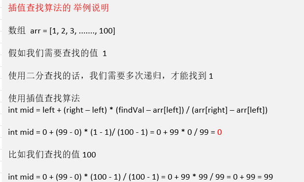

### 8.4.1 插值查找代码
```java
public static int insertValueSearch(int[] arr, int value) {
    int low = 0;
    int high = arr.length - 1;
    if (value < arr[low] || value > arr[high]) {return -1;}
    while (low <= high) {
        int mid = low + (high - low) * (value - arr[low]) / (arr[high] - arr[low]);
        if (arr[mid] < value) {
            low = mid + 1;
        } else if (arr[mid] > value) {
            high = mid - 1;
        } else {
            low = mid + 1;
        }
    }
    return -1;
}
```

### 8.4.2 插值查找注意事项
1. 对于数据量较大，关键字分布比较均匀的查找表来说，采用插值查找，速度较快
2. 关键字分布不均匀的情况下，该方法不一定比折半查找要好

## 8.5 斐波那契(黄金分割法)查找算法

### 8.5.1 斐波那契(黄金分割法)查找基本介绍
1. 黄金分割点是指把一条线段分割为两部分，使其中一部分与全长之比等于另一部分与这部分之比。取其前三位数字的近似值是0.618。由于按此比例设计的造型十分美丽，因此称为黄金分割，也称为中外比。这是一个神奇的数字，会带来意想不到的效果。
2. 斐波那契数列{1, 1, 2, 3, 5, 8, 13, 21, 34, 55}发现斐波那契数列的两个相邻数的比例，无限接近黄金分割值0.618

### 8.5.2 斐波那契(黄金分割法)原理
斐波那契查找原理与前两种相似，仅仅改变了中间结点（mid）的位置，mid不再是中间或插值得到，而是位于黄金分割点附近，即mid=low+F(k-1)-1（F 代表斐波那契数列），如下图所示
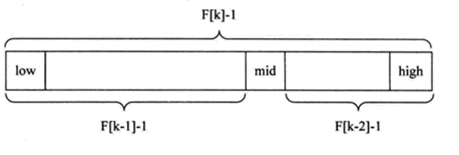

对F(k-1)-1的理解
1. 由斐波那契数列F\[k\]=F\[k-1\]+F\[k-2\]的性质，可以得到(F\[k\]-1)=(F\[k-1\]-1)+(F\[k-2\]-1)+1。该式说明：只要顺序表的长度为F\[k\]-1，则可以将该表分成长度为F\[k-1\]-1和F\[k-2\]-1的两段，即如上图所示。从而中间位置为mid=low+F(k-1)-1
2. 类似的，每一子段也可以用相同的方式分割
3. 但顺序表长度n不一定刚好等于F\[k\]-1，所以需要将原来的顺序表长度n增加至F\[k\]-1。这里的k值只要能使得F\[k\]-1恰好大于或等于n即可，由以下代码得到，顺序表长度增加后，新增的位置(从n+1到F\[k\]-1位置)，都赋为n位置的值即可。

### 8.5.3 斐波那契查找应用
```java
/* fibonacci数列定义略 */
public static int fibonacciSearch(int[] arr, int key) {
    int low = 0, high = arr.length - 1, mid = 0, k = 0;
    while (high > fibonacci[k] - 1) {
        k++;
    }
    int[] temp = Arrays.copyOf(arr, fibonacci[k]);
    for (int i = high + 1; i < temp.length; i++) {
        temp[i] = arr[high];
    }
    while (low <= high) {
        mid = low + fibonacci[k - 1] - 1;
        if (key < temp[mid]) {
            high = mid - 1;
            k--;
            // 说明
            // 1. 全部元素 = 前面的元素 + 后边元素
            // 2. f[k] = f[k-1] + f[k-2]
            // 因为 前面有 f[k-1] 个元素,所以可以继续拆分 f[k-1] = f[k-2] + f[k-3]
            // 即 在 f[k-1] 的前面继续查找 k--
            // 即下次循环 mid = f[k - 1 - 1] - 1
        } else if (key > temp[mid]) {
            low = mid + 1;
            k -= 2;
            // 3. 因为后面我们有 f[k-2] 所以可以继续拆分 f[k-1] = f[k-3] + f[k-4]
            // 4. 即在f[k-2] 的前面进行查找 k -= 2
            // 5. 即下次循环 mid = f[k - 1 - 2] - 1
        } else {
            return mid < high ? mid : high;
        }
    }
    return -1;
}
```

# 第9章 哈希表

## 9.1 哈希表(散列)-Google上机题
1. 看一个实际需求，google公司的一个上机题:
2. 有一个公司，当有新的员工来报道时，要求将该员工的信息加入(id,性别,年龄,住址...)，当输入该员工的id时，要求查找到该员工的所有信息。
3. 要求：不使用数据库，尽量节省内存，速度越快越好=>哈希表(散列)

## 9.2 哈希表的基本介绍
散列表（Hash table，也叫哈希表），是根据关键码值(Key value)而直接进行访问的数据结构。也就是说，它通过把关键码值映射到表中一个位置来访问记录，以加快查找的速度。这个映射函数叫做散列函数，存放记录的数组叫做散列表。

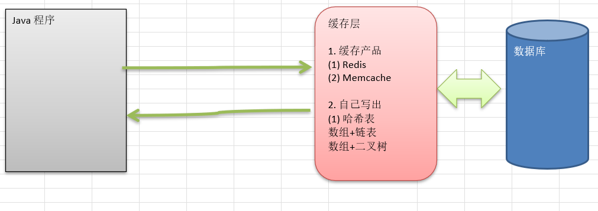
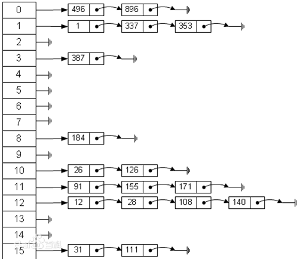

## 9.3 题目要求及解决
1. 不使用数据库，速度越快越好=>哈希表(散列)
2. 添加时，保证按照id从低到高插入【课后思考：如果id不是从低到高插入，但要求各条链表仍是从低到高，怎么解决?】
3. 使用链表来实现哈希表，该链表不带表头【即: 链表的第一个结点就存放雇员信息】
4. 思路分析并画出示意图
    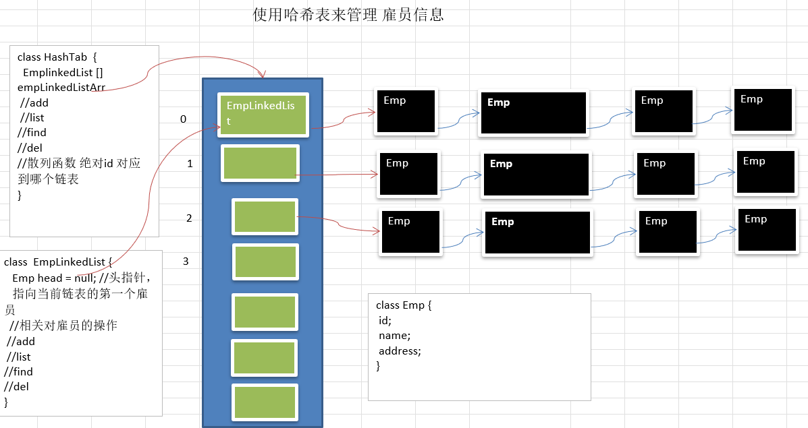
5. 代码实现
    ```java
    class HashTab<K, V> { // 代码由java.util.Hashtable修改
        Entry<?, ?>[] table;
        int count;
        public HashTab(int initialCapacity) {
            if (initialCapacity < 0)
                throw new IllegalArgumentException("Illegal Capacity: " + initialCapacity);
            if (initialCapacity == 0)
                initialCapacity = 1;
            table = new Entry<?, ?>[initialCapacity];
	    }
        private void addEntry(int hash, K key, V value, int index) {
            Entry<?, ?> tab[] = table;
            Entry<K, V> e = (Entry<K, V>) tab[index];
            tab[index] = new Entry<>(hash, key, value, e);
            count++;
        }
        public V put(K key, V value) {
            if (value == null) {
                throw new NullPointerException();
            }
            Entry<?, ?> tab[] = table;
            int hash = key.hashCode();
            int index = (hash & 0x7FFFFFFF) % tab.length;
            Entry<K, V> entry = (Entry<K, V>) tab[index];
            for (; entry != null; entry = entry.next) {
                if ((entry.hash == hash) && entry.key.equals(key)) {
                    V old = entry.value;
                    entry.value = value;
                    return old;
                }
            }
            addEntry(hash, key, value, index);
            return null;
        }
        public V remove(Object key) {
            Entry<?, ?> tab[] = table;
            int hash = key.hashCode();
            int index = (hash & 0x7FFFFFFF) % tab.length;
            Entry<K, V> e = (Entry<K, V>) tab[index];
            for (Entry<K, V> prev = null; e != null; prev = e, e = e.next) {
                if ((e.hash == hash) && e.key.equals(key)) {
                    if (prev != null) {
                        prev.next = e.next;
                    } else {
                        tab[index] = e.next;
                    }
                    count--;
                    V oldValue = e.value;
                    e.value = null;
                    return oldValue;
                }
            }
            return null;
        }
        public V get(Object key) {
            Entry<?, ?> tab[] = table;
            int hash = key.hashCode();
            int index = (hash & 0x7FFFFFFF) % tab.length;
            for (Entry<?, ?> e = tab[index]; e != null; e = e.next) {
                if ((e.hash == hash) && e.key.equals(key)) {
                    return (V) e.value;
                }
            }
            return null;
        }
        public void forEach(BiConsumer<? super K, ? super V> action) {
            Objects.requireNonNull(action);
            Entry<?, ?>[] tab = table;
            for (Entry<?, ?> entry : tab) {
                while (entry != null) {
                    action.accept((K) entry.key, (V) entry.value);
                    entry = entry.next;
                }
            }
        }
        private static class Entry<K, V> {
            final int hash;
            final K key;
            V value;
            Entry<K, V> next;
            Entry(int hash, K key, V value, Entry<K, V> next) {
                this.hash = hash;
                this.key = key;
                this.value = value;
                this.next = next;
            }
        }
    }
    ```


# 第10章 树结构的基础部分

## 10.1 二叉树

### 10.1.1 为什么需要树这种数据结构
1. 数组存储方式的分析优点：通过下标方式访问元素，速度快。对于有序数组，还可使用二分查找提高检索速度。缺点：如果要检索具体某个值，或者插入值(按一定顺序)会整体移动，效率较低\[示意图\]画出操作示意图：
    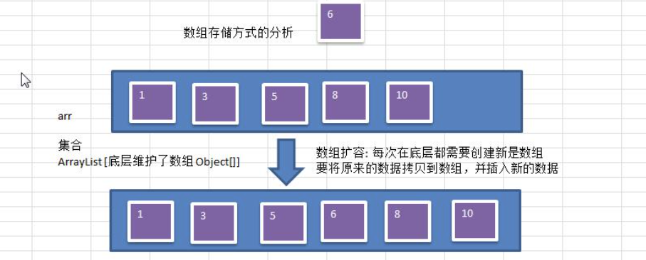
2. 链式存储方式的分析优点：在一定程度上对数组存储方式有优化(比如：插入一个数值节点，只需要将插入节点，链接到链表中即可，删除效率也很好)。缺点：在进行检索时，效率仍然较低，比如(检索某个值，需要从头节点开始遍历)【示意图】操作示意图
    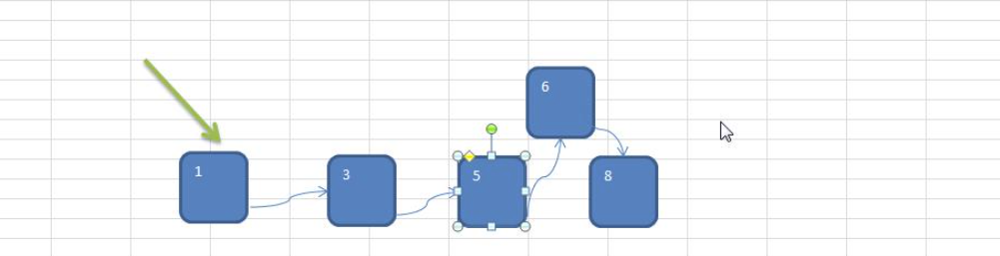
3. 树存储方式的分析能提高数据存储，读取的效率，比如利用二叉排序树(BinarySortTree)，既可以保证数据的检索速度，同时也可以保证数据的插入，删除，修改的速度。【示意图,后面详讲】案例:\[7,3,10,1,5,9,12\]
    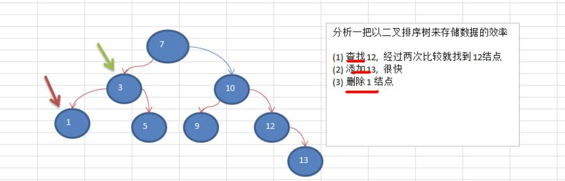

### 10.1.2 树示意图
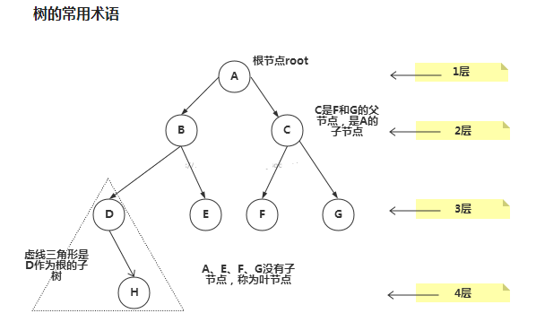

树的常用术语(结合示意图理解):
1. 节点
2. 根节点
3. 父节点
4. 子节点
5. 叶子节点(没有子节点的节点)
6. 节点的权(节点值)
7. 路径(从root节点找到该节点的路线
8. 层
9. 子树
10. 树的高度(最大层数)
11. 森林:多颗子树构成森林

### 10.1.3 二叉树的概念
1. 树有很多种，每个节点**最多只能有两个子节点**的一种形式称为二叉树。
2. 二叉树的子节点分为左节点和右节点
3. 如果该二叉树的所有**叶子节点**都在**最后一层**，并且结点总数=2^n-1，n为层数，则我们称为满二叉树。
4. 如果该二叉树的所有**叶子节点**都在**最后一层**或者**倒数第二层**，而且最后一层的叶子节点在左边连续，倒数第二层的叶子节点在右边连续，我们称为完全二叉树

### 10.1.4 二叉树遍历的说明
1. 前序遍历：先输出父节点，再遍历左子树和右子树
2. 中序遍历：先遍历左子树，再输出父节点，再遍历右子树
3. 后序遍历：先遍历左子树，再遍历右子树，最后输出父节点
4. 小结：看输出父节点的顺序，就确定是前序，中序还是后序

### 10.1.5 二叉树遍历应用实例(前序,中序,后序)
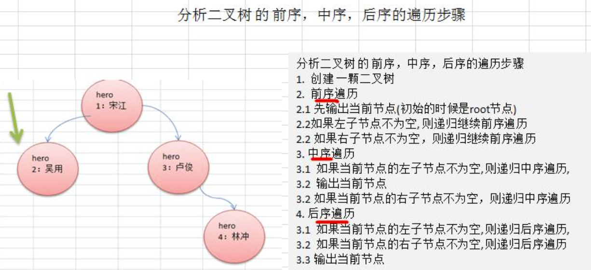

```java
class BinaryTree<T> {
	Node<T> root;
	public void preOrder(Node<T> node) {
		if (node != null) {
			System.out.println(node);
			preOrder(node.left);
			preOrder(node.right);
		}
	}
	public void preOrder() {
		preOrder(root);
	}
	public void inOrder(Node<T> node) {
		if (node != null) {
			inOrder(node.left);
			System.out.println(node);
			inOrder(node.right);
		}
	}
	public void inOrder() {
		inOrder(root);
	}
	public void postOrder(Node<T> node) {
		if (node != null) {
			postOrder(node.left);
			postOrder(node.right);
			System.out.println(node);
		}
	}
	public void postOrder() {
		postOrder(root);
	}
	static class Node<T> {
		T data;
		Node<T> left;
		Node<T> right;
		public Node(T data) {
			this.data = data;
		}
		@Override
		public String toString() {
			return "Node [data=" + data + "]";
		}
	}
}
```

### 10.1.6 二叉树-查找指定节点
1. 请编写前序查找，中序查找和后序查找的方法。
2. 并分别使用三种查找方式，查找节点
3. 并分析各种查找方式，分别比较了多少次
4. 思路分析图解
    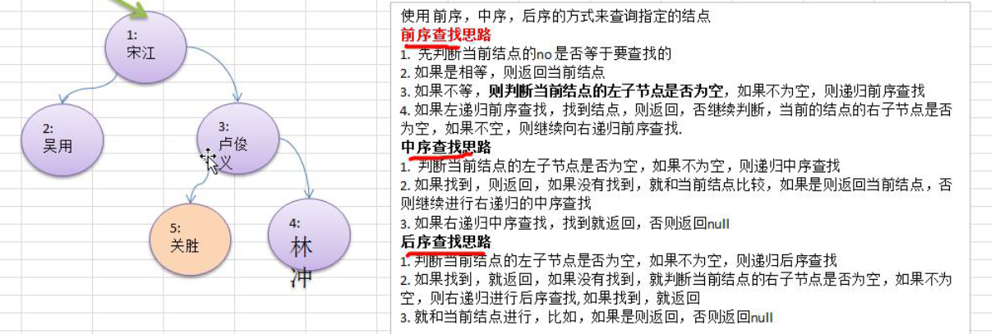
5. 代码实现
    ```java
    ```

### 10.1.7 二叉树-删除节点
1. 如果删除的节点是叶子节点，则删除该节点
2. 如果删除的节点是非叶子节点，则删除该子树
3. 完成删除思路分析
    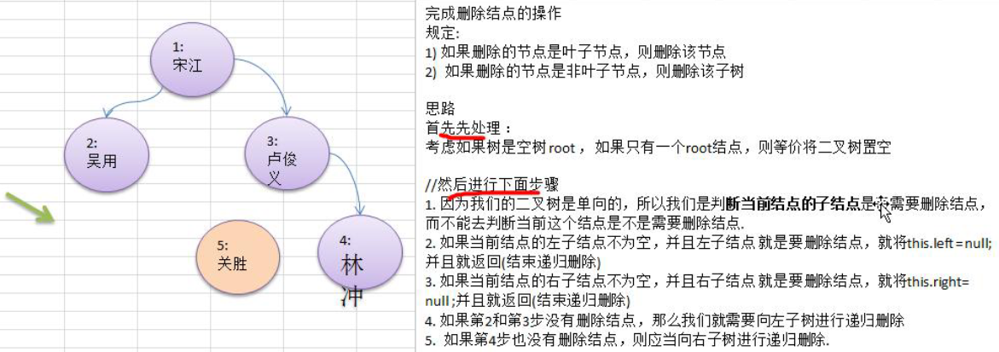
4. 代码实现
    ```java
    ```

### 10.1.8 二叉树-删除节点
思考题(课后练习)
1. 如果要删除的节点是非叶子节点，现在我们不希望将该非叶子节点为根节点的子树删除，需要指定规则，假如规定如下:
2. 如果该非叶子节点A只有一个子节点B，则子节点B替代节点A
3. 如果该非叶子节点A有左子节点B和右子节点C，则让左子节点B替代节点A。
4. 请大家思考，如何完成该删除功能，老师给出提示(课后练习)
5. 后面在讲解二叉排序树时，在给大家讲解具体的删除方法

## 10.2 顺序存储二叉树

### 10.2.1 顺序存储二叉树的概念
- 基本说明：从数据存储来看，数组存储方式和树的存储方式可以相互转换，即数组可以转换成树，树也可以转换成数组。
  - 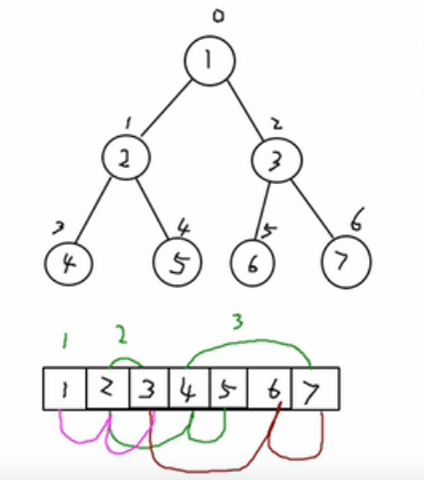
- 要求:
  - 右图的二叉树的结点，要求以数组的方式来存放`arr:[1, 2, 3, 4, 5, 6, 6]`
  - 要求在遍历数组 arr 时，仍然可以以前序遍历，中序遍历和后序遍历的方式完成结点的遍历
- 顺序存储二叉树的特点:
  - 顺序二叉树通常只考虑完全二叉树
  - 第n个元素的左子节点为 2 * n + 1
  - 第n个元素的右子节点为 2 * n + 2
  - 第n个元素的父节点为 (n-1) / 2
  - n表示二叉树中的第几个元素

### 10.2.2 顺序存储二叉树遍历
```java
class SeqBinaryTree {
	private Object[] data;
	private int size;
	public SeqBinaryTree(Object[] arr) {
		this.data = arr;
		this.size = arr.length;
	}
	public void preOrder() {
		preOrder(0);
	}
	private void preOrder(int index) {
		if (index < 0 || index >= size || data[index] == null) {
			return;
		}
		System.out.print(data[index] + " ");
		preOrder(index * 2 + 1);
		preOrder(index * 2 + 2);
	}
	public void inOrder() {
		inOrder(0);
	}
	private void inOrder(int index) {
		if (index < 0 || index >= size || data[index] == null) {
			return;
		}
		inOrder(index * 2 + 1);
		System.out.print(data[index] + " ");
		inOrder(index * 2 + 2);
	}
	public void postOrder() {
		postOrder(0);
	}
	private void postOrder(int index) {
		if (index < 0 || index >= size || data[index] == null) {
			return;
		}
		postOrder(index * 2 + 1);
		postOrder(index * 2 + 2);
		System.out.print(data[index] + " ");
	}
}
```

### 10.2.3 顺序存储二叉树应用实例
八大排序算法中的堆排序，就会使用到顺序存储二叉树， 关于堆排序，我们放在<<树结构实际应用>>章节讲解。

## 10.3 线索化二叉树

### 10.3.1 先看一个问题
将数列 {1, 3, 6, 8, 10, 14} 构建成一颗二叉树 n+1=7

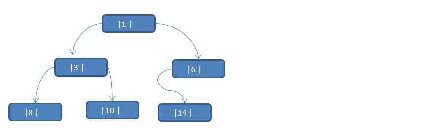

问题分析:
1. 当我们对上面的二叉树进行中序遍历时，数列为 {8, 3, 10, 1, 6, 14}
2. 但是 6, 8, 10, 14 这几个节点的左右指针，并没有完全的利用上
3. 如果我们希望充分的利用各个节点的左右指针，让各个节点可以指向自己的前后节点，怎么办？
4. 解决方案-线索二叉树

### 10.3.2 线索二叉树基本介绍
1. n个结点的二叉链表中含有n+1【公式2n-(n-1)=n+1】个空指针域。利用二叉链表中的空指针域，存放指向该结点在**某种遍历次序**下的前驱和后继结点的指针（这种附加的指针称为"线索"）
2. 这种加上了线索的二叉链表称为线索链表，相应的二叉树称为线索二叉树(Threaded BinaryTree)。根据线索性质的不同，线索二叉树可分为前序线索二叉树、中序线索二叉树和后序线索二叉树三种
3. 一个结点的前一个结点，称为**前驱**结点
4. 一个结点的后一个结点，称为**后继**结点

### 10.3.3 线索二叉树应用案例
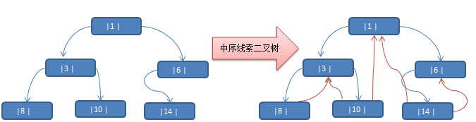

说明：当线索化二叉树后，Node节点的属性 left 和 right，有如下情况：
1. left指向的是左子树，也可能是指向的前驱节点。比如 ① 节点 left 指向的左子树，而 ⑩ 节点的 left 指向的就是前驱节点
2. right 指向的是右子树，也可能是指向后继节点，比如 ① 节点 right 指向的是右子树，而 ⑩ 节点的 right 指向的是后继节点

### 10.3.4 遍历线索化二叉树
1. 说明：对前面的中序线索化的二叉树，进行遍历
2. 分析：因为线索化后，各个结点指向有变化，因此**原来的遍历方式不能使用**，这时需要使用新的方式遍历线索化二叉树，各个节点可以通过线型方式遍历，因此无需使用递归方式，这样也提高了遍历的效率。**遍历的次序应当和中序遍历保持一致**。

### 10.3.5 线索化二叉树的课后作业
```java
class ThreadBinaryTree<T> {
	static class Node<T> {
		T data;
		Node<T> left, right;
		boolean ltag, rtag;
	}
	Node<T> root, pre;
	// 前序线索化
	public void preThreadedBinaryTree() {
		preThreadedBinaryTree(root);
	}
	private void preThreadedBinaryTree(Node<T> node) {
		if (node == null) {
			return;
		}
		if (node.left == null) {
			node.left = pre;
			node.ltag = true;
		}
		if (pre != null && pre.right == null) {
			pre.right = node;
			pre.rtag = true;
		}
		pre = node;
		preThreadedBinaryTree(node.left);
		preThreadedBinaryTree(node.right);
	}
	// 中序线索化
	public void inThreadedBinaryTree() {
		inthreadedBinaryTree(root);
	}
	private void inthreadedBinaryTree(Node<T> node) {
		if (node == null) {
			return;
		}
		inthreadedBinaryTree(node.left);
		if (node.left == null) {
			node.left = pre;
			node.ltag = true;
		}
		if (pre != null && pre.right == null) {
			pre.right = node;
			pre.rtag = true;
		}
		pre = node;
		inthreadedBinaryTree(node.right);
	}
	// 后序线索化
	public void postThreadedBinaryTree() {
		postThreadedBinaryTree(root);
	}
	private void postThreadedBinaryTree(Node<T> node) {
		if (node == null) {
			return;
		}
		postThreadedBinaryTree(node.left);
		postThreadedBinaryTree(node.right);
		if (node.left == null) {
			node.left = pre;
			node.ltag = true;
		}
		if (pre != null && pre.right == null) {
			pre.right = node;
			pre.rtag = true;
		}
		pre = node;
	}
	// 遍历中序线索二叉树
	public void inOrder() {
		Node<T> node = root;
		while (node != null) {
			while (!node.ltag) {
				node = node.left;
			}
			System.out.println(node.data);
			while (node.rtag) {
				node = node.right;
				System.out.println(node.data);
			}
			node = node.right;
		}
	}	
}
```


# 第11章 树结构实际应用

## 11.1 堆排序

### 11.1.1 堆排序基本介绍
1. 堆排序是利用**堆**这种数据结构而设计的一种排序算法，堆排序是一种**选择排序**，它的最坏，最好，平均时间复杂度均为O(nlogn)，它也是不稳定排序。
2. 堆是具有以下性质的完全二叉树：每个结点的值都大于或等于其左右孩子结点的值，称为大顶堆，**注意**：没有要求结点的左孩子的值和右孩子的值的大小关系。
3. 每个结点的值都小于或等于其左右孩子结点的值，称为小顶堆
4. 大顶堆举例说明
    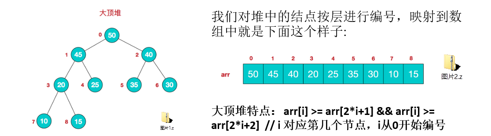
5. 小顶堆举例说明
    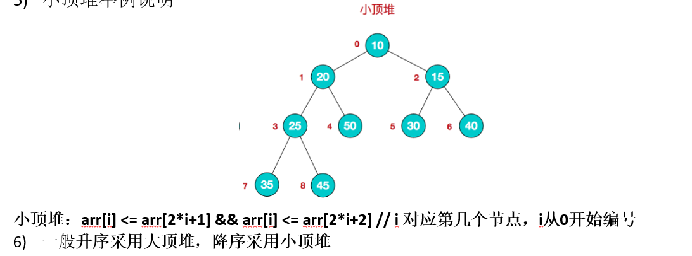

### 11.1.2 堆排序基本思想
1. 将待排序序列构造成一个大顶堆
2. 此时，整个序列的最大值就是堆顶的根节点。
3. 将其与末尾元素进行交换，此时末尾就为最大值。
4. 然后将剩余n-1个元素重新构造成一个堆，这样会得到n个元素的次小值。如此反复执行，便能得到一个有序序列了。

可以看到在构建大顶堆的过程中，元素的个数逐渐减少，最后就得到一个有序序列了

### 11.1.3 堆排序步骤图解说明
步骤一 构造初始堆。将给定无序序列构造成一个大顶堆（一般升序采用大顶堆，降序采用小顶堆)。

1. 假设给定无序序列结构如下
    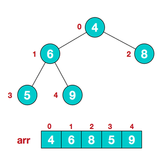
2. 此时我们从最后一个非叶子结点开始（叶结点自然不用调整，第一个非叶子结点 arr.length/2-1=5/2-1=1，也就是下面的6结点），从左至右，从下至上进行调整。
    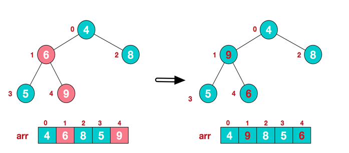
3. 找到第二个非叶节点4，由于\[4,9,8\]中9元素最大，4和9交换。
    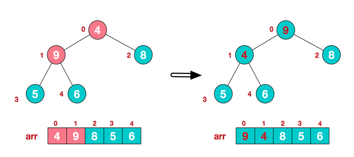
4. 这时，交换导致了子根\[4,5,6\]结构混乱，继续调整，\[4,5,6\]中6最大，交换4和6。
5. 此时，我们就将一个无序序列构造成了一个大顶堆。

步骤二 将堆顶元素与末尾元素进行交换，使末尾元素最大。然后继续调整堆，再将堆顶元素与末尾元素交换，得到第二大元素。如此反复进行交换、重建、交换。

1. 将堆顶元素9和末尾元素4进行交换
    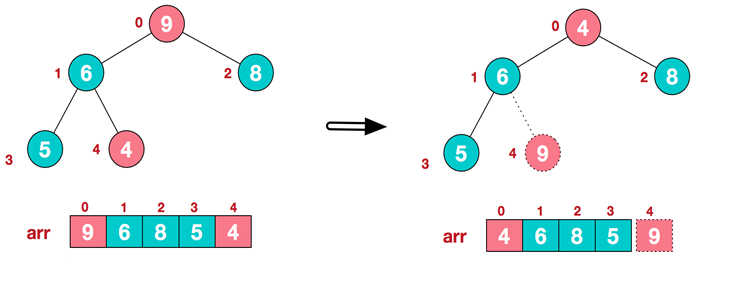
2. 重新调整结构，使其继续满足堆定义
    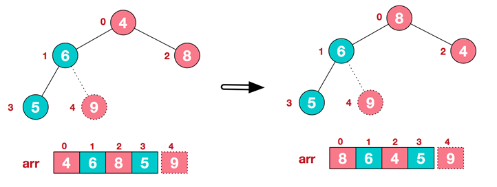
3. 再将堆顶元素8与末尾元素5进行交换，得到第二大元素8
    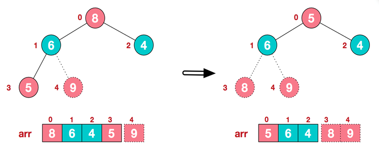
4. 后续过程，继续进行调整，交换，如此反复进行，最终使得整个序列有序
    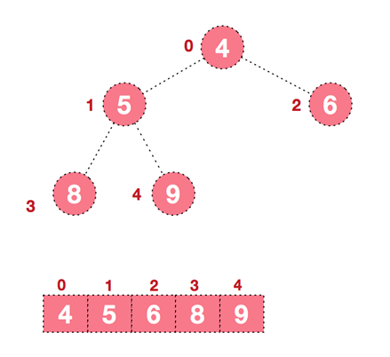

再简单总结下堆排序的基本思路：
1. 将无序序列构建成一个堆，根据升序降序需求选择大顶堆或小顶堆;
2. 将堆顶元素与末尾元素交换，将最大元素"沉"到数组末端;
3. 重新调整结构，使其满足堆定义，然后继续交换堆顶元素与当前末尾元素，反复执行调整+交换步骤，直到整个序列有序。

### 11.1.4 堆排序代码实现
```java
// 堆调整：i为非叶子结点在数组中的下标，length为堆的元素个数
private static void heapAdjust(int[] arr, int i, int length) {
    int temp = arr[i];
    for (int k = 2 * i + 1; k < length; k = 2 * k + 1) {
        if (k + 1 < length && arr[k] < arr[k + 1]) {
            // 如果左子结点的值小于右子结点的值
            k++; // k 指向右子结点
        }
        if (arr[k] > temp) { // 如果子结点大于父结点
            arr[i] = arr[k]; // 把较大的值赋给当前结点
            i = k; // i指向k，继续循环比较
        } else {
            break;
        }
    }
    // 当for循环结束后，我们已经将以i为父结点的树的最大值，放在了最顶(局部)
    arr[i] = temp; // 将temp值放到调整后的位置
}
public static void heapSort(int[] arr) {	
    for (int i = arr.length / 2 - 1; i >= 0; i--) {
        heapAdjust(arr, i, arr.length);// 建堆
    }
    // 堆排序
    for (int j = arr.length - 1; j > 0; j--) {
        // 交换堆顶元素和最后一个元素
        int temp = arr[0];
        arr[0] = arr[j];
        arr[j] = temp;
        heapAdjust(arr, 0, j);// 堆调整
    }
}
```

## 11.2 赫夫曼树

### 11.2.1 基本介绍
1. 给定n个权值作为n个叶子结点，构造一棵二叉树，**若该树的带权路径长度(wpl)达到最小**，称这样的二叉树为最优二叉树，也称为哈夫曼树(Huffman Tree)，还有的书翻译为霍夫曼树。
2. 赫夫曼树是带权路径长度最短的树，权值较大的结点离根较近

### 11.2.2 赫夫曼树几个重要概念和举例说明
1. 路径和路径长度：在一棵树中，从一个结点往下可以达到的孩子或孙子结点之间的通路，称为路径。通路中分支的数目称为路径长度。若规定根结点的层数为1，则从根结点到第L层结点的路径长度为L-1
2. 结点的权及带权路径长度：若将树中结点赋给一个有着某种含义的数值，则这个数值称为该结点的权。结点的带权路径长度为：从根结点到该结点之间的路径长度与该结点的权的乘积
3. 树的带权路径长度：树的带权路径长度规定为所有叶子结点的带权路径长度之和，记为WPL(weighted path length)，权值越大的结点离根结点越近的二叉树才是最优二叉树。
4. WPL 最小的就是赫夫曼树
    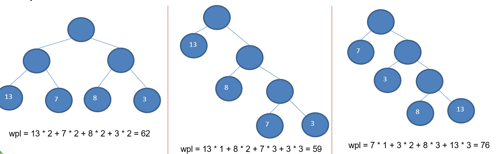

### 11.2.3 赫夫曼树创建思路
构成赫夫曼树的步骤：
1. 从小到大进行排序，将每一个数据，每个数据都是一个节点，每个节点可以看成是一颗最简单的二叉树
2. 取出根节点权值最小的两颗二叉树
3. 组成一颗新的二叉树，该新的二叉树的根节点的权值是前面两颗二叉树根节点权值的和
4. 再将这颗新的二叉树，以根节点的权值大小再次排序，不断重复 1-2-3-4 的步骤，直到数列中，所有的数据都被处理，就得到一颗赫夫曼树

### 11.2.4 赫夫曼树的代码实现
```java
class HuffmanTree {
	static class Node implements Comparable<Node> {
		int weight;
		Node left, right;
		Node(int weight) {
			this.weight = weight;
		}
		@Override
		public int compareTo(Node o) {
			return this.weight - o.weight;
		}
	}
	Node root;
	HuffmanTree(Node node) {
		this.root = node;
	}
	public static HuffmanTree createHuffmanTree(int[] arr) {
		List<Node> nodes = new ArrayList<>();
		for (int i = 0; i < arr.length; i++) {
			nodes.add(new Node(arr[i]));
		}
		Collections.sort(nodes);
		while (nodes.size() > 1) {
			Node left = nodes.remove(0);
			Node right = nodes.remove(0);
			Node parent = new Node(left.weight + right.weight);
			parent.left = left;
			parent.right = right;
			nodes.add(parent);
			Collections.sort(nodes);
		}
		return new HuffmanTree(nodes.get(0));
	}
}
```

## 11.3 赫夫曼编码

### 11.3.1 基本介绍
1. 赫夫曼编码也翻译为哈夫曼编码(Huffman Coding)，又称霍夫曼编码，是一种编码方式，属于一种程序算法
2. 赫夫曼编码是赫哈夫曼树在电讯通信中的经典的应用之一。
3. 赫夫曼编码广泛地用于数据文件压缩。其压缩率通常在20%～90%之间
4. 赫夫曼码是可变字长编码(VLC)的一种。Huffman于1952 年提出一种编码方法，称之为最佳编码

### 11.3.2 原理剖析
- 通信领域中信息的处理方式1-定长编码
  - 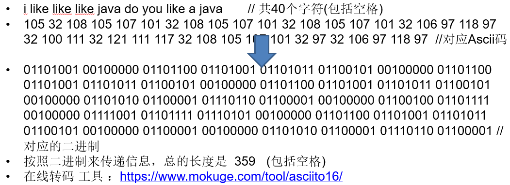
- 通信领域中信息的处理方式2-变长编码
  - 
- 通信领域中信息的处理方式3-赫夫曼编码

1. i like like like java do you like a java
2. d:1 y:1 u:1 j:2 v:2 o:2 l:4 k:4 e:4 i:5 a:5 :9 // 各个字符对应的个数
3. 按照上面字符出现的次数构建一颗赫夫曼树，次数作为权值：
   1. 从小到大进行排序，将每一个数据，每个数据都是一个节点，每个节点可以看成是一颗最简单的二叉树
   2. 取出根节点权值最小的两颗二叉树
   3. 组成一颗新的二叉树，该新的二叉树的根节点的权值是前面两颗二叉树根节点权值的和
   4. 再将这颗新的二叉树，以根节点的权值大小 再次排序，不断重复 1-2-3-4 的步骤，直到数列中，所有的数据都被处理，就得到一颗赫夫曼树
   5. 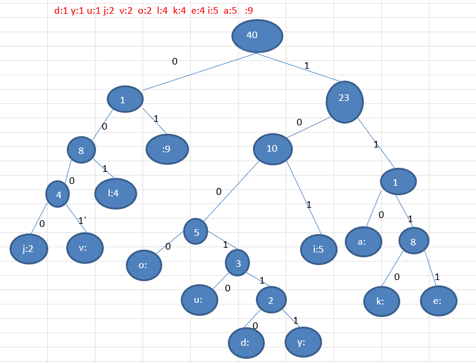
4. 根据赫夫曼树，给各个字符，规定编码 (前缀编码)，向左的路径为0向右的路径为1，编码如下:{'o':1000, 'u':10010, 'd':100110, 'y':100111, 'i':101, 'a':110, 'k':1110, 'e':1111, 'j':0000, 'v':0001, 'l':001, ' ':01}
5. 按照上面的赫夫曼编码，我们的"i like like like java do you like a java"字符串对应的编码为 (注意这里我们使用的无损压缩)1010100110111101111010011011110111101001101111011110100001100001110011001111000011001111000100100100110111101111011100100001100001110通过赫夫曼编码处理长度为133
6. 原来长度是359，压缩了(359-133)/359=62.9%，此编码满足前缀编码，即字符的编码都不能是其他字符编码的前缀。不会造成匹配的多义性赫夫曼编码是无损处理方案

注意：这个赫夫曼树根据排序方法不同，也可能不太一样，这样对应的赫夫曼编码也不完全一样。（因为排序算法不一定是稳定的）但是wpl是一样的，都是最小的，最后生成的赫夫曼编码的长度是一样。

### 11.3.3 最佳实践-数据压缩(创建赫夫曼树)
根据赫夫曼编码压缩数据的原理，需要创建 "i like like like java do you like a java" 对应的赫夫曼树

### 11.3.4 最佳实践-数据压缩(生成赫夫曼编码和赫夫曼编码后的数据)
1. 生成赫夫曼树对应的赫夫曼编码，如下：' '=01, 'a'=100, 'd'=11000, 'u'=11001, 'e'=1110, 'v'=11011, 'i'=101, 'y'=11010, 'j'=0010, 'k'=1111, 'l'=000 ,'o'=0011
2. 使用赫夫曼编码来生成赫夫曼编码数据，即按照上面的赫夫曼编码，将"i like like like java do you like a java"字符串生成对应的编码数据，形式如下：1010100010111111110010001011111111001000101111111100100101001101110001110000011011101000111100101000101111111100110001001010011011100

### 11.3.5 最佳实践-数据解压(使用赫夫曼编码解码)
1. 前面我们得到了赫夫曼编码和对应的编码byte\[\]，即：\[-88, -65, -56, -65, -56, -65, -55, 77, -57, 6, -24, -14, -117, -4, -60, -90, 28\]
2. 现在要求使用赫夫曼编码，进行解码，又重新得到原来的字符串"i like like like java do you like a java"

### 11.3.6 最佳实践-文件压缩
读取文件 -> 得到赫夫曼编码表 -> 完成压缩

### 11.3.7 最佳实践-文件解压(文件恢复)
读取压缩文件(数据和赫夫曼编码表) -> 完成解压(文件恢复)

### 11.3.8 代码汇总
```java
class HuffmanTree {
	static class Node implements Comparable<Node> {
		Byte data;
		int weight;
		Node left, right;
		Node(Byte data, int weight) {
			this.data = data;
			this.weight = weight;
		}
		@Override
		public int compareTo(Node o) {
			return this.weight - o.weight;
		}
	}
	private Map<Byte, String> codes;
	private Map<String, Byte> revCodes;
	private HuffmanTree(Map<Byte, String> codes, Map<String, Byte> revCodes) {
		this.codes = codes;
		this.revCodes = revCodes;
	}
	public Map<Byte, String> getHuffmanCodes() {
		return codes;
	}
	public Map<String, Byte> getRevHuffmanCodes() {
		return revCodes;
	}
	private static void getCodes(Map<Byte, String> codes, Node node, String c, StringBuilder s) {
		if (node != null) {
			StringBuilder sb = new StringBuilder(s);
			sb.append(c);
			if (node.data != null) {
				codes.put(node.data, sb.toString());
			} else {
				getCodes(codes, node.left, "0", sb);
				getCodes(codes, node.right, "1", sb);
			}
		}
	}
	private static Map<Byte, String> getHuffmanCodes(Node root) {
		Map<Byte, String> codes = new HashMap<>();
		getCodes(codes, root, "", new StringBuilder());
		return codes;
	}
	public static HuffmanTree getInstance(Map<Byte, String> codes) {
		Map<String, Byte> revCodes = new HashMap<>();
		codes.forEach((k, v) -> revCodes.put(v, k));
		return new HuffmanTree(codes, revCodes);
	}
	public static HuffmanTree getInstanceByDecodingSet(Map<String, Byte> revCodes) {
		Map<Byte, String> codes = new HashMap<>();
		revCodes.forEach((k, v) -> codes.put(v, k));
		return new HuffmanTree(codes, revCodes);
	}
	public static HuffmanTree getInstance(List<Node> nodes) {
		Collections.sort(nodes);
		while (nodes.size() > 1) {
			Node left = nodes.remove(0);
			Node right = nodes.remove(0);
			Node parent = new Node(null, left.weight + right.weight);
			parent.left = left;
			parent.right = right;
			nodes.add(parent);
			Collections.sort(nodes);
		}
		return getInstance(getHuffmanCodes(nodes.size() > 0 ? nodes.remove(0) : null));
	}
	public static HuffmanTree getInstance(byte[] bytes) {
		List<Node> nodes = new ArrayList<Node>();
		HashMap<Byte, Integer> counts = new HashMap<>();
		for (byte b : bytes) {
			counts.put(b, counts.getOrDefault(b, 0) + 1);
		}
		for (Map.Entry<Byte, Integer> entry : counts.entrySet()) {
			nodes.add(new Node(entry.getKey(), entry.getValue()));
		}
		return getInstance(nodes);
	}
	public byte[] zip(byte[] srcBytes) {
		StringBuilder sb = new StringBuilder();
		for (byte b : srcBytes) {
			sb.append(codes.get(b));
		}
		int len = (sb.length() + 7) / 8;
		byte[] zipBytes = new byte[len];
		for (int i = 0, index = 0; i < sb.length(); i += 8) {
			String strByte = i + 8 > sb.length() ? sb.substring(i) : sb.substring(i, i + 8);
			zipBytes[index++] = (byte) Integer.parseInt(strByte, 2);
		}
		return zipBytes;
	}
	public byte[] unzip(byte[] zipBytes) {
		if (zipBytes == null || zipBytes.length == 0) {
			return new byte[0];
		}
		StringBuilder sb = new StringBuilder();
		for (int i = 0; i < zipBytes.length - 1; i++) {
			String binaryString = Integer.toBinaryString(zipBytes[i] & 0xFF);
			sb.append(String.format("%8s", binaryString).replace(' ', '0'));
		}
		sb.append(Integer.toBinaryString(zipBytes[zipBytes.length - 1] & 0xFF));
		List<Byte> bytes = new ArrayList<>();
		int index = 0, count = 0;
		while (index < sb.length()) {
			String substring = sb.substring(index, index + (++count));
			if (revCodes.containsKey(substring)) {
				bytes.add(revCodes.get(substring));
				index += count;
				count = 0;
			}
		}
		byte[] srcBytes = new byte[bytes.size()];
		for (int i = 0; i < srcBytes.length; i++) {
			srcBytes[i] = bytes.get(i);
		}
		return srcBytes;
	}
	public static void zipFile(File srcf, File zipf) throws IOException {
		try (FileInputStream fis = new FileInputStream(srcf);
				ObjectOutputStream oos = new ObjectOutputStream(new FileOutputStream(zipf))) {
			byte[] srcBytes = new byte[fis.available()];
			fis.read(srcBytes);
			HuffmanTree hfmTree = HuffmanTree.getInstance(srcBytes);
			oos.writeObject(hfmTree.getRevHuffmanCodes());
			oos.writeObject(hfmTree.zip(srcBytes));
		}
	}
	public static void unzipFile(File zipf, File srcf) throws IOException, ClassNotFoundException {
		try (ObjectInputStream ois = new ObjectInputStream(new FileInputStream(zipf));
				FileOutputStream fos = new FileOutputStream(srcf)) {
			@SuppressWarnings("unchecked")
			Map<String, Byte> revCodes = (Map<String, Byte>) ois.readObject();
			byte[] zipBytes = (byte[]) ois.readObject();
			HuffmanTree hfmTree = HuffmanTree.getInstanceByDecodingSet(revCodes);
			fos.write(hfmTree.unzip(zipBytes));
		}
	}
}
```
```java
// 测试
public static void main(String[] args) throws IOException, ClassNotFoundException {
    String str = "i like like like java do you like a java";
    byte[] bytes = str.getBytes();
    HuffmanTree tree = HuffmanTree.getInstance(bytes);
    byte[] ziped = tree.zip(bytes);
    byte[] unziped = tree.unzip(ziped);
    String decodeStr = new String(unziped);
    
    String srcFilePath = "D:\\XF\\Desktop\\test.bmp";
    String destFilePath = "D:\\XF\\Desktop\\test.xfd";
    HuffmanTree.zipFile(new File(srcFilePath), new File(destFilePath));
    HuffmanTree.unzipFile(new File(destFilePath), new File(srcFilePath));
}
```

### 11.3.9 赫夫曼编码压缩文件注意事项
1. 如果文件本身就是经过压缩处理的，那么使用赫夫曼编码再压缩效率不会有明显变化，比如视频、ppt等文件\[举例压一个.ppt\]
2. 赫夫曼编码是按字节来处理的，因此可以处理所有的文件(二进制文件、文本文件)\[举例压一个.xml文件\]
3. 如果一个文件中的内容，重复的数据不多，压缩效果也不会很明显

## 11.4 二叉排序树

### 11.4.1 先看一个需求
给定一个数列 (7, 3, 10, 12, 5, 1, 9)，要求能够高效的完成对数据的查询和添加

### 11.4.2 解决方案分析
- 使用数组
  - 数组未排序，优点：直接在数组尾添加，速度快。缺点：查找速度慢
  - 数组排序，优点：可以使用二分查找，查找速度快，缺点：为了保证数组有序，在添加新数据时，找到插入位置后，后面的数据需整体移动，速度慢。
- 使用链式存储-链表：不管链表是否有序，查找速度都慢，添加数据速度比数组快，不需要数据整体移动。
- 使用二叉排序树

### 11.4.3 二叉排序树介绍
- 二叉排序树：BST(Binary Sort(Search) Tree)，对于二叉排序树的任何一个非叶子节点，要求左子节点的值比当前节点的值小，右子节点的值比当前节点的值大。
- 特别说明：如果有相同的值，可以将该节点放在左子节点或右子节点
- 比如针对前面的数据 (7, 3, 10, 12, 5, 1, 9) 对应的二叉排序树为：
  - 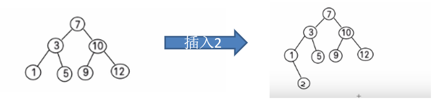

### 11.4.4 二叉排序树创建和遍历
一个数组创建成对应的二叉排序树，并使用中序遍历二叉排序树，比如: 数组为 Array(7, 3, 10, 12, 5, 1, 9) 创建成对应的二叉排序树为
    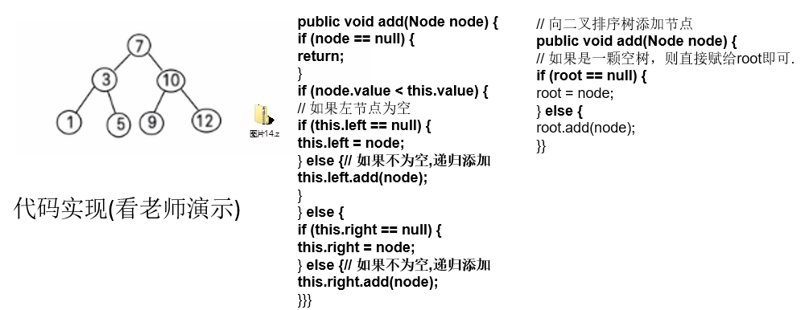

### 11.4.5 二叉排序树的删除
1. 删除**叶子节点** (比如：2, 5, 9, 12)
   1. 需求先去找到要删除的结点 targetNode
   2. 找到 targetNode 的 父结点 parent
   3. 确定 targetNode 是 parent 的左子结点 还是右子结点
   4. 根据前面的情况来对应删除
      1. 左子结点 parent.left = null
      2. 右子结点 parent.right = null;
2. 删除**只有一颗子树的节点** (比如：1)
   1. 需求先去找到要删除的结点 targetNode
   2. 找到targetNode 的 父结点 parent
   3. 确定targetNode 的子结点是左子结点还是右子结点
   4. targetNode 是 parent 的左子结点还是右子结点
   5. 如果targetNode 有左子结点
      1. 如果 targetNode 是 parent 的左子结点 parent.left = targetNode.left;
      2. 如果 targetNode 是 parent 的右子结点 parent.right = targetNode.left;
   6. 如果targetNode 有右子结点
      1. 如果 targetNode 是 parent 的左子结点 parent.left = targetNode.right;
      2. 如果 targetNode 是 parent 的右子结点 parent.right = targetNode.right;
3. 删除**有两颗子树的节点** (比如：7, 3, 10)
   1. 需求先去找到要删除的结点 targetNode
   2. 找到targetNode 的 父结点 parent
   3. 从targetNode 的右子树找到最小的结点
   4. 用一个临时变量，将 最小结点的值保存 temp = 11
   5. 删除该最小结点
   6. targetNode.value = temp

### 11.4.6 代码实现
```java
class BinarySortTree { // 代码由GitHub Copilot生成
	static class Node {
		int data;
		Node left, right;
		public Node(int data) {
			this.data = data;
		}
	}
	Node root;
	public void add(int data) {
		Node node = new Node(data);
		if (root == null) {
			root = node;
		} else {
			Node cur = root;
			Node parent = null;
			while (cur != null) {
				parent = cur;
				cur = data < cur.data ? cur.left : cur.right;
			}
			if (data < parent.data) {
				parent.left = node;
			} else {
				parent.right = node;
			}
		}
	}
	public void remove(int data) {
		Node cur = root, parent = null;
		while (cur != null && cur.data != data) {
			parent = cur;
			cur = data < cur.data ? cur.left : cur.right;
		}
		if (cur == null) {
			return;
		}
		// 删除节点有两个子节点
		if (cur.left != null && cur.right != null) {
			Node minNode = cur.right;
			Node minParent = cur;
			while (minNode.left != null) {
				minParent = minNode;
				minNode = minNode.left;
			}
			cur.data = minNode.data;
			cur = minNode;
			parent = minParent;
		}
		// 删除节点有一个子节点
		Node child = cur.left != null ? cur.left : cur.right;
		if (parent == null) {
			root = child;
		} else if (parent.left == cur) {
			parent.left = child;
		} else {
			parent.right = child;
		}
	}
	public void infixOrder() {// 中序遍历
        if (root == null) {
			System.out.println("二叉排序树为空");
			return;
		}
		infixOrder(root);
        System.out.println();
	}
	private void infixOrder(Node node) {
		if (node == null) {
			return;
		}
		infixOrder(node.left);
		System.out.print(node.data + " ");
		infixOrder(node.right);
	}
}
```

## 11.5 平衡二叉树(AVL树)

### 11.5.1 看一个案例(说明二叉排序树可能的问题)
创建数列 {1, 2, 3, 4, 5, 6} 的二叉排序树(BST)
1. 左子树全部为空，从形式上看，更像一个单链表
2. 插入速度没有影响
3. 查询速度明显降低(因为需要依次比较)，不能发挥BST的优势。因为每次还需要比较左子树，其查询速度比单链表还慢
4. 解决方案-平衡二叉树(AVL)

### 11.5.2 基本介绍
1. 平衡二叉树也叫平衡二叉搜索树（Self-balancing binary search tree）又被称为AVL树，可以保证查询效率较高。
2. 具有以下特点：它是一棵空树或它的左右两个子树的高度差的绝对值不超过1，并且左右两个子树都是一棵平衡二叉树。平衡二叉树的常用实现方法有**红黑树、AVL、替罪羊树、Treap、伸展树**等。

### 11.5.3 应用案例-单旋转(左旋转)
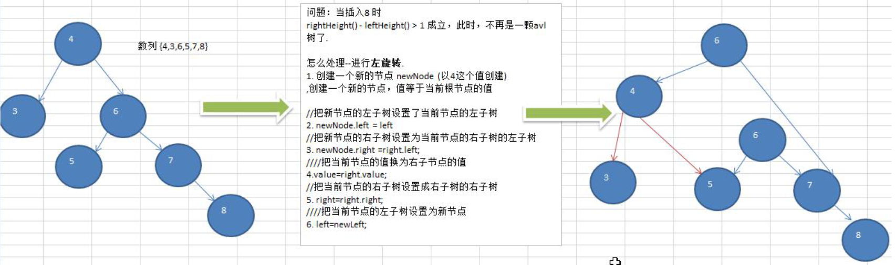

### 11.5.4 应用案例-单旋转(右旋转)
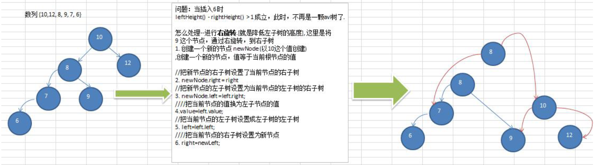

### 11.5.5 应用案例-双旋转
在某些情况下，单旋转不能完成平衡二叉树的转换。比如数列int[] arr = {10, 11, 7, 6, 8, 9};

1. 问题分析 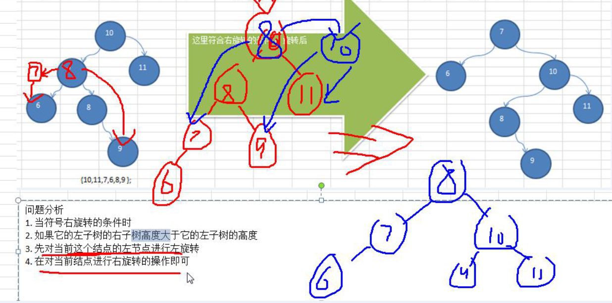
2. 解决思路分析
   1. 当符号右旋转的条件时
   2. 如果它的左子树的右子树高度大于它的左子树的高度
   3. 先对当前这个结点的左节点进行左旋转
   4. 在对当前结点进行右旋转的操作即可
3. 代码实现
```java
class AVLTree { // 代码由GitHub Copilot生成
	static class AVLNode {
		int key;
		AVLNode left, right;
		int height;
		public AVLNode(int key) {
			this.key = key;
			this.height = 1;
		}
	}
	AVLNode root;
	public AVLTree(int[] arr) {
		for (int i = 0; i < arr.length; i++) {
			insert(arr[i]);
		}
	}
	public void insert(int key) {
		root = insert(root, key);
	}
	private AVLNode insert(AVLNode node, int key) {
		if (node == null) {
			return new AVLNode(key);
		}
		if (key < node.key) {
			node.left = insert(node.left, key);
		} else if (key > node.key) {
			node.right = insert(node.right, key);
		} else {
			return node;
		}
		node.height = Math.max(height(node.left), height(node.right)) + 1;
		int balanceFactor = getBalanceFactor(node);
		if (balanceFactor > 1 && key < node.left.key) {
			return rightRotate(node);
		}
		if (balanceFactor < -1 && key > node.right.key) {
			return leftRotate(node);
		}
		if (balanceFactor > 1 && key > node.left.key) {
			node.left = (leftRotate(node.left));
			return rightRotate(node);
		}
		if (balanceFactor < -1 && key < node.right.key) {
			node.right = (rightRotate(node.right));
			return leftRotate(node);
		}
		return node;
	}
	private int height(AVLNode node) {
		if (node == null) {
			return -1;
		}
		return node.height;
	}
	private int getBalanceFactor(AVLNode node) {
		if (node == null) {
			return 0;
		}
		return height(node.left) - height(node.right);
	}
	private AVLNode rightRotate(AVLNode node) {
		AVLNode left = node.left;
		AVLNode right = left.right;
		left.right = node;
		node.left = right;
		node.height = Math.max(height(node.left), height(node.right)) + 1;
		left.height = Math.max(height(left.left), height(left.right)) + 1;
		return left;
	}
	private AVLNode leftRotate(AVLNode node) {
		AVLNode right = node.right;
		AVLNode left = right.left;
		right.left = node;
		node.right = left;
		node.height = Math.max(height(node.left), height(node.right)) + 1;
		right.height = Math.max(height(right.left), height(right.right)) + 1;
		return right;
	}
	public void inOrder() {
        if (root == null) {
			System.out.println("二叉排序树为空");
			return;
		}
		inOrder(root);
		System.out.println();
	}
	private void inOrder(AVLNode node) {
		if (node == null) {
			return;
		}
		inOrder(node.left);
		System.out.print(node.key + " ");
		inOrder(node.right);
	}
	public void delete(int key) {
		root = delete(root, key);
	}
	private AVLNode delete(AVLNode node, int key) {
		if (node == null) {
			return null;
		}
		if (key < node.key) {
			node.left = delete(node.left, key);
		} else if (key > node.key) {
			node.right = delete(node.right, key);
		} else {
			if (node.left == null) {
				return node.right;
			} else if (node.right == null) {
				return node.left;
			}
			node.key = minValue(node.right);
			node.right = delete(node.right, node.key);
		}
		node.height = Math.max(height(node.left), height(node.right)) + 1;
		int balanceFactor = getBalanceFactor(node);
		if (balanceFactor > 1 && getBalanceFactor(node.left) >= 0) {
			return rightRotate(node);
		}
		if (balanceFactor > 1 && getBalanceFactor(node.left) < 0) {
			node.left = (leftRotate(node.left));
			return rightRotate(node);
		}
		if (balanceFactor < -1 && getBalanceFactor(node.right) <= 0) {
			return leftRotate(node);
		}
		if (balanceFactor < -1 && getBalanceFactor(node.right) > 0) {
			node.right = (rightRotate(node.right));
			return leftRotate(node);
		}
		return node;
	}
	private int minValue(AVLNode node) {
		int min = node.key;
		while (node.left != null) {
			min = node.left.key;
			node = node.left;
		}
		return min;
	}
}
```


# 第12章 多路查找树

## 12.1 二叉树与B树

### 12.1.1 二叉树的问题分析
二叉树的操作效率较高，但是也存在问题，请看下面的二叉树
    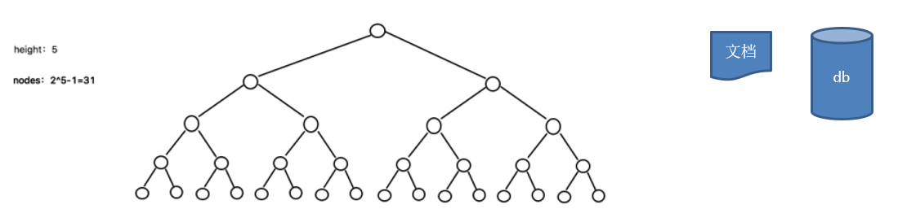

1. 二叉树需要加载到内存的，如果二叉树的节点少，没有什么问题，但是如果二叉树的节点很多(比如1亿)，就存在如下问题：
2. 问题1：在构建二叉树时，需要多次进行i/o操作(海量数据存在数据库或文件中)，节点海量，构建二叉树时，速度有影响
3. 问题2：节点海量，也会造成二叉树的高度很大，会降低操作速度

### 12.1.2 多叉树
1. 在二叉树中，每个节点有数据项，最多有两个子节点。如果允许每个节点可以有更多的数据项和更多的子节点，就是多叉树（multiway tree）
2. 后面我们讲解的2-3树，2-3-4树就是多叉树，多叉树通过重新组织节点，减少树的高度，能对二叉树进行优化。
3. 举例说明(下面2-3树就是一颗多叉树)
    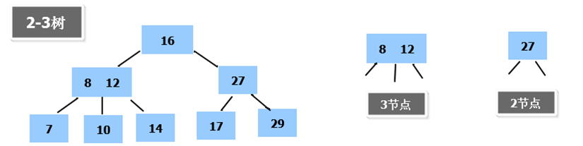

### 12.1.3 B树的基本介绍
B树通过重新组织节点，降低树的高度，并且减少i/o读写次数来提升效率。
    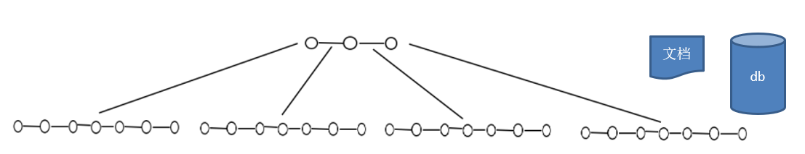

1. 如图B树通过重新组织节点，降低了树的高度
2. 文件系统及数据库系统的设计者利用了磁盘预读原理，将一个节点的大小设为等于一个页(页得大小通常为4k)，这样每个节点只需要一次I/O就可以完全载入
3. 将树的度M设置为1024，在600亿个元素中最多只需要4次I/O操作就可以读取到想要的元素，B树(B+)广泛应用于文件存储系统以及数据库系统中

## 12.2 2-3树

### 12.2.1 2-3树是最简单的B树结构，具有如下特点
1. 2-3树的所有叶子节点都在同一层(只要是B树都满足这个条件)
2. 有两个子节点的节点叫二节点，二节点要么没有子节点，要么有两个子节点
3. 有三个子节点的节点叫三节点，三节点要么没有子节点，要么有三个子节点
4. 2-3树是由二节点和三节点构成的树。

### 12.2.2 2-3树应用案例
将数列{16, 24, 12, 32, 14, 26, 34, 10, 8, 28, 38, 20} 构建成2-3树，并保证数据插入的大小顺序。
    
    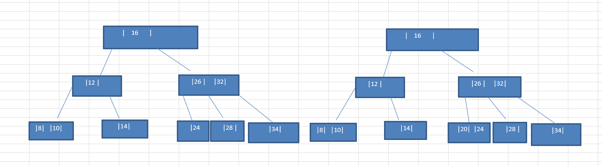

插入规则
1. 2-3树的所有叶子节点都在同一层(只要是B树都满足这个条件)
2. 有两个子节点的节点叫二节点，二节点要么没有子节点，要么有两个子节点
3. 有三个子节点的节点叫三节点，三节点要么没有子节点，要么有三个子节点
4. 当按照规则插入一个数到某个节点时，不能满足上面三个要求，就需要拆，先向上拆，如果上层满，则拆本层，拆后仍然需要满足上面3个条件。
5. 对于三节点的子树的值大小仍然遵守(BST二叉排序树)的规则

### 12.2.3 其它说明
除了23树，还有2-3-4树等，概念和2-3树类似，也是一种B树。
如图：  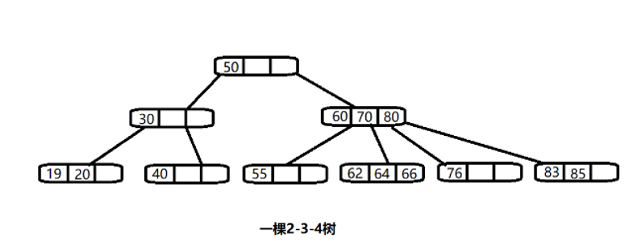

## 12.3 B树、B+树和B\*树

### 12.3.1 B树的介绍
B-tree树即B树，B即Balanced，平衡的意思。有人把B-tree翻译成B-树，容易让人产生误解。会以为B-树是一种树，而B树又是另一种树。实际上，B-tree就是指的B树。

### 12.3.2 B树的介绍
前面已经介绍了2-3树和2-3-4树，他们就是B树(英语：B-tree也写成B-树)，这里我们再做一个说明，我们在学习Mysql时，经常听到说某种类型的索引是基于B树或者B+树的，如图:
    

B树的说明:
1. B树的阶：节点的最多子节点个数。比如2-3树的阶是3，2-3-4树的阶是4
2. B-树的搜索，从根结点开始，对结点内的关键字（有序）序列进行二分查找，如果命中则结束，否则进入查询关键字所属范围的儿子结点；重复，直到所对应的儿子指针为空，或已经是叶子结点
3. 关键字集合分布在整颗树中，即叶子节点和非叶子节点都存放数据
4. 搜索有可能在非叶子结点结束
5. 其搜索性能等价于在关键字全集内做一次二分查找

### 12.3.3 B+树的介绍
B+树是B树的变体，也是一种多路搜索树。
    

B+树的说明:
1. B+树的搜索与B树也基本相同，区别是B+树只有达到叶子结点才命中（B树可以在非叶子结点命中），其性能也等价于在关键字全集做一次二分查找
2. 所有关键字都出现在叶子结点的链表中（即数据只能在叶子节点【也叫稠密索引】），且链表中的关键字(数据)恰好是有序的。
3. 不可能在非叶子结点命中
4. 非叶子结点相当于是叶子结点的索引（稀疏索引），叶子结点相当于是存储（关键字）数据的数据层
5. 更适合文件索引系统
6. B树和B+树各有自己的应用场景，不能说B+树完全比B树好，反之亦然

### 12.3.4 B\*树的介绍
B\*树是B+树的变体，在B+树的非根和非叶子结点再增加指向兄弟的指针。
    

B\*树的说明:
1. B\*树定义了非叶子结点关键字个数至少为(2/3)\*M，即块的最低使用率为2/3，而B+树的块的最低使用率为的1/2。
2. 从第1个特点我们可以看出，B\*树分配新结点的概率比B+树要低，空间使用率更高


# 第13章 图

## 13.1 图基本介绍

### 13.1.1 为什么要有图
1. 前面我们学了线性表和树
2. 线性表局限于一个直接前驱和一个直接后继的关系
3. 树也只能有一个直接前驱也就是父节点
4. 当我们需要表示**多对多**的关系时，这里我们就用到了**图**。

### 13.1.2 图的举例说明
图是一种**数据结构**，其中结点可以具有零个或多个相邻元素。两个结点之间的连接称为**边**。结点也可以称为**顶点**。
    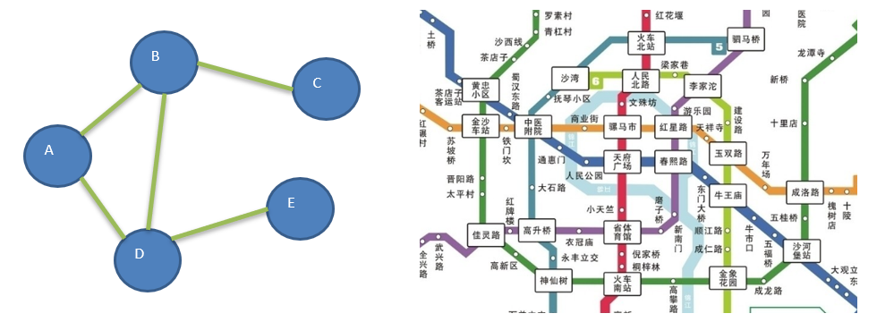

### 13.1.3 图的常用概念
1. 顶点(vertex)
2. 边(edge)
3. 路径
4. 无向图
    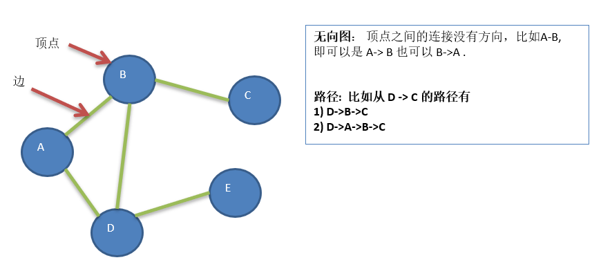
5. 有向图
    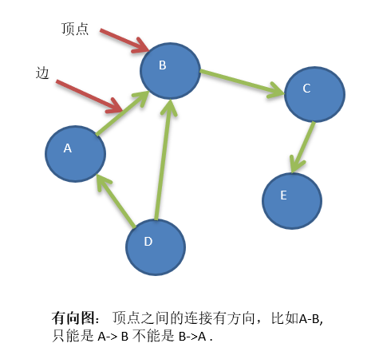
6. 带权图
    

## 13.2 图的表示方式
图的表示方式有两种：二维数组表示（邻接矩阵）；链表表示（邻接表）。

### 13.2.1 邻接矩阵
邻接矩阵是表示图形中顶点之间相邻关系的矩阵，对于n个顶点的图而言，矩阵是的row和col表示的是1....n个点。
    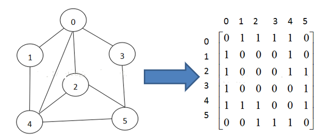

### 13.2.2 邻接表
1. 邻接矩阵需要为每个顶点都分配n个边的空间，其实有很多边都是不存在，会造成空间的一定损失
2. 邻接表的实现只关心存在的边，不关心不存在的边。因此没有空间浪费，邻接表由数组+链表组成
3. 举例说明
    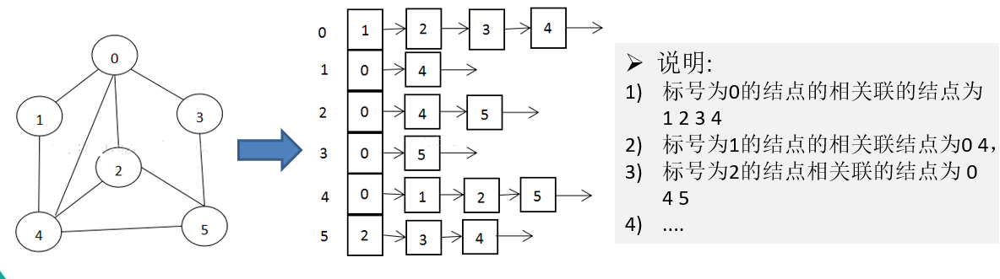

## 13.3 图的快速入门案例
实现如下图结构
    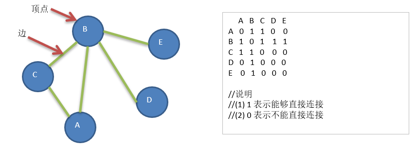

## 13.4 图的深度优先遍历介绍

### 13.4.1 图遍历介绍
所谓图的遍历，即是对结点的访问。一个图有那么多个结点，如何遍历这些结点，需要特定策略，一般有两种访问策略：(1)深度优先遍历、(2)广度优先遍历

### 13.4.2 深度优先遍历基本思想
图的深度优先搜索(Depth First Search)：
1. 深度优先遍历，从初始访问结点出发，初始访问结点可能有多个邻接结点，深度优先遍历的策略就是首先访问第一个邻接结点，然后再以这个被访问的邻接结点作为初始结点，访问它的第一个邻接结点，可以这样理解：每次都在访问完**当前结点**后首先访问**当前结点的第一个邻接结点**。
2. 我们可以看到，这样的访问策略是优先往纵向挖掘深入，而不是对一个结点的所有邻接结点进行横向访问。
3. 显然，深度优先搜索是一个递归的过程。

### 13.4.3 深度优先遍历算法步骤
1. 访问初始结点v，并标记结点v为已访问。
2. 查找结点v的第一个邻接结点w。
3. 若w存在，则继续执行4，如果w 不存在，则回到第1步，将从v的下一个结点继续。
4. 若w未被访问，对w进行深度优先遍历递归（即把w当做另一个v，然后进行步骤123）。
5. 查找结点v的w邻接结点的下一个邻接结点，转到步骤3。
6. 分析图
    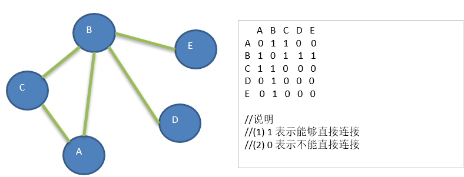

深度优先算法的代码实现（见汇总代码）

## 13.5 图的广度优先遍历

### 13.5.1 广度优先遍历基本思想
1. 图的广度优先搜索(Broad First Search)。
2. 类似于一个**分层搜索**的过程，广度优先遍历需要使用一个队列以保持访问过的结点的顺序，以便按这个顺序来访问这些结点的邻接结点

### 13.5.2 广度优先遍历算法步骤
1. 访问初始结点v并标记结点v为已访问。
2. 结点v入队列
3. 当队列非空时，继续执行，否则算法结束。
4. 出队列，取得队头结点u。
5. 查找结点u的第一个邻接结点w。
6. 若结点u的邻接结点w 不存在，则转到步骤3；否则循环执行以下三个步骤
   1. 若结点w尚未被访问，则访问结点w并标记为已访问。
   2. 结点w入队列
   3. 查找结点u的继w邻接结点后的下一个邻接结点w，转到步骤6。
   
### 13.5.3 广度优先算法的图示
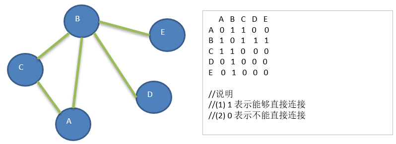

广度优先算法的代码实现（见汇总代码）

## 10.6 图的代码汇总
```java
class GraphAdjMatrix<T> {
	List<T> vertexList;
	int[][] edges;
	int numOfEdges;
	boolean[] visited;
	GraphType type;
	enum GraphType { DIRECTED, UNDIRECTED }
	public GraphAdjMatrix(T[] vertexs, GraphType type) {
		vertexList = Arrays.asList(vertexs);
		edges = new int[vertexList.size()][vertexList.size()];
		this.type = type;
	}
	public int indexOf(T vertex) {
		return vertexList.indexOf(vertex);
	}
	public T getVertex(int index) {
		return vertexList.get(index);
	}
	public void addEdge(int startIndex, int endIndex, int weight) {
		switch (type) {
		case UNDIRECTED:
			edges[endIndex][startIndex] = weight;
		case DIRECTED:
			edges[startIndex][endIndex] = weight;
		}
		numOfEdges++;
	}
	public void addEdge(T start, T end, int weight) {
		addEdge(indexOf(start), indexOf(end), weight);
	}
	public void showGraph() {
		System.out.println("  " + vertexList);
		for (int i = 0; i < vertexList.size(); i++) {
			System.out.println(vertexList.get(i) + " " + Arrays.toString(edges[i]));
		}
	}
	private int initSearch() {
		if ((visited = new boolean[vertexList.size()]).length == 0) {
			System.out.println("没有顶点");
		}
		return visited.length;
	}
	public void depthFirstSearch() {
		if (initSearch() > 0) {
			for (int i = 0; i < visited.length; i++) {
				if (!visited[i]) {
					depthFirstSearch(i);
				}
			}
		}
	}
	private void depthFirstSearch(int currentIndex) {
		visited[currentIndex] = true;
		System.out.print(vertexList.get(currentIndex) + "->");
		for (int i = 0; i < visited.length; i++) {
			if (!visited[i] && edges[currentIndex][i] != 0) {
				depthFirstSearch(i);
			}
		}
	}
	public void breadthFirstSearch() {
		if (initSearch() > 0) {
			LinkedList<Integer> queue = new LinkedList<Integer>();
			for (int i = 0; i < visited.length; i++) {
				if (!visited[i]) {
					queue.add(i);
					visited[i] = true;
					System.out.print(vertexList.get(i) + "->");
					while (!queue.isEmpty()) {
						int currentIndex = queue.poll();
						for (int j = 0; j < visited.length; j++) {
							if (!visited[j] && edges[currentIndex][j] != 0) {
								queue.add(j);
								visited[j] = true;
								System.out.print(vertexList.get(j) + "->");
							}
						}
					}
				}
			}
		}
	}
}
```

## 10.7 图的 深度优先 VS 广度优先
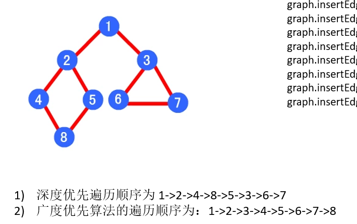


# 第14章 程序员常用10种算法

## 14.1 二分查找算法(非递归)

### 14.1.1 二分查找算法(非递归)介绍
1. 前面我们讲过了二分查找算法，是使用递归的方式，下面我们讲解二分查找算法的非递归方式
2. 二分查找法只适用于从有序的数列中进行查找(比如数字和字母等)，将数列排序后再进行查找
3. 二分查找法的运行时间为对数时间O(㏒₂n)，即查找到需要的目标位置最多只需要㏒₂n步，假设从\[0, 99\]的队列(100个数，即n=100)中寻到目标数30，则需要查找步数为㏒₂100，即最多需要查找7次(2<sup>6</sup> < 100 < 2<sup>7</sup>)

### 14.1.2 二分查找算法(非递归)代码实现
```java
/**
 * 二分查找的非递归实现
 * @param arr    升序排序的待查找的数组
 * @param target 查找的目标值
 * @return 如果找到返回对应的索引, 否则返回-1
 */
public static int binarySearch(int[] arr, int target) {
    int left = 0;
    int right = arr.length - 1;
    while (left <= right) { // 说明继续查找
        int mid = (left + right) / 2;
        if (arr[mid] == target) {
            return mid;
        } else if (arr[mid] > target) {
            right = mid - 1;// 需要向左边查找
        } else {
            left = mid + 1; // 需要向右边查找
        }
    }
    return -1;
}
```

## 14.2 分治算法

### 14.2.1 分治算法介绍
分治法是一种很重要的算法。字面上的解释是“分而治之”，就是把一个复杂的问题分成两个或更多的相同或相似的子问题，再把子问题分成更小的子问题……直到最后子问题可以简单的直接求解，原问题的解即子问题的解的合并。这个技巧是很多高效算法的基础，如排序算法(快速排序，归并排序)，傅立叶变换(快速傅立叶变换)……

分治算法可以求解的一些经典问题
- 二分搜索
- 大整数乘法
- 棋盘覆盖
- 合并排序
- 快速排序
- 线性时间选择
- 最接近点对问题
- 循环赛日程表
- **汉诺塔**

### 14.2.2 分治算法的基本步骤
1. 分解：将原问题分解为若干个规模较小，相互独立，与原问题形式相同的子问题
2. 解决：若子问题规模较小而容易被解决则直接解，否则递归地解各个子问题
3. 合并：将各个子问题的解合并为原问题的解。

### 14.2.3 分治(Divide-and-Conquer(P))算法设计模式如下
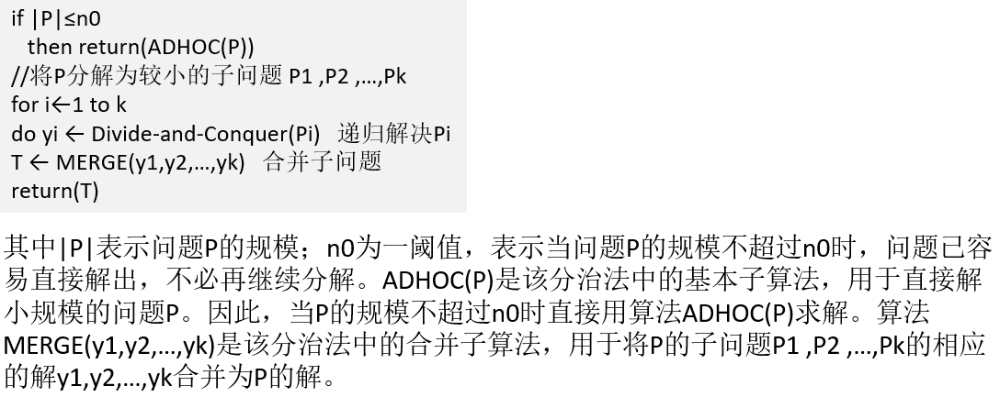

### 14.2.4 分治算法最佳实践-汉诺塔
汉诺塔：汉诺塔（又称河内塔）问题是源于印度一个古老传说的益智玩具。大梵天创造世界的时候做了三根金刚石柱子，在一根柱子上从下往上按照大小顺序摞着64片黄金圆盘。大梵天命令婆罗门把圆盘从下面开始按大小顺序重新摆放在另一根柱子上。并且规定，在小圆盘上不能放大圆盘，在三根柱子之间一次只能移动一个圆盘。

假如每秒钟一次，共需多长时间呢？移完这些金片需要5845.54亿年以上，太阳系的预期寿命据说也就是数百亿年。真的过了5845.54亿年，地球上的一切生命，连同梵塔、庙宇等，都早已经灰飞烟灭。

汉诺塔游戏的演示和思路分析:
- 如果是有一个盘，A->C
- 如果我们有 n >= 2 情况，我们总是可以看做是两个盘 1.最下边的盘 2. 上面的盘
  - 先把最上面的盘 A->B
  - 把最下边的盘 A->C
  - 把B塔的所有盘 B->C

```java
public static void hanoiTower(int num, char a, char b, char c) {
    if (num == 1) {
        System.out.println(a + "->" + c);
    } else {
        hanoiTower(num - 1, a, c, b);
        System.out.println(a + "->" + c);
        hanoiTower(num - 1, b, a, c);
    }
}
```

## 14.3 动态规划算法

### 14.3.1 应用场景-背包问题
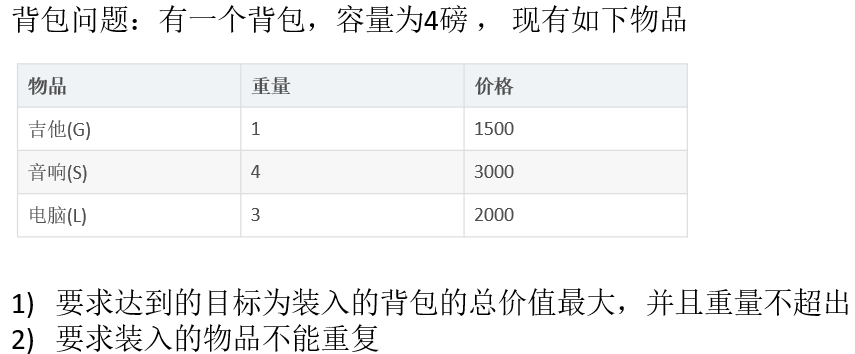

### 14.3.2 动态规划算法介绍
1. 动态规划(Dynamic Programming)算法的核心思想是：将**大问题划分为小问题**进行解决，从而一步步获取最优解的处理算法
2. 动态规划算法与分治算法类似，其基本思想也是将待求解问题分解成若干个子问题，先求解子问题，然后从这些子问题的解得到原问题的解。
3. 与分治法不同的是，适合于用动态规划求解的问题，经分解得到**子问题往往不是互相独立的**。 (即下一个子阶段的求解是建立在上一个子阶段的解的基础上，进行进一步的求解)
4. 动态规划可以通过填表的方式来逐步推进，得到最优解

### 14.3.3 动态规划算法最佳实践-背包问题
1. 背包问题主要是指一个给定容量的背包、若干具有一定价值和重量的物品，如何选择物品放入背包使物品的价值最大。其中又分**01背包**和**完全背包**(完全背包指的是：每种物品都有无限件可用)
2. 这里的问题属于01背包，即每个物品最多放一个。而无限背包可以转化为01背包。
3. 算法的主要思想，利用动态规划来解决。每次遍历到的第i个物品，根据w\[i\]和v\[i\]来确定是否需要将该物品放入背包中。即对于给定的n个物品，设v\[i\]、w\[i\]分别为第i个物品的价值和重量，C为背包的容量。再令v\[i\]\[j\]表示在前i个物品中能够装入容量为j的背包中的最大价值。则我们有下面的结果：
    ```java
    v[i][0]=v[0][j]=0; //表示填入表第一行和第一列是0
    if(w[i]>j)v[i][j]=v[i-1][j]; //当准备加入新增的商品的容量大于当前背包的容量时，就直接使用上一个单元格的装入策略
    // 当准备加入的新增的商品的容量小于等于当前背包的容量，装入的方式：
    v[i-1][j] //就是上一个单元格的装入的最大值
    v[i] //表示当前商品的价值
    v[i-1][j-w[i]] //装入i-1商品，到剩余空间j-w[i]的最大值
    if(j>=w[i])v[i][j]=max{v[i-1][j], v[i]+v[i-1][j-w[i]]};
    ```
5. 分析图解
    

### 14.3.4 动态规划-背包问题的代码实现
```java
public class KnapsackProblem {
	static class Obj {
		String name;
		int weight;
		int value;
		public Obj(String name, int weight, int value) {
			super();
			this.name = name;
			this.weight = weight;
			this.value = value;
		}
		@Override
		public String toString() {
			return "Obj [name=" + name + ", weight=" + weight + ", value=" + value + "]";
		}
	}
	public static void knapsackProblem(Obj[] objs, int capacity) {
		int[][] dp = new int[objs.length + 1][capacity + 1];
		for (int i = 1; i <= objs.length; i++) {
			for (int j = 1; j <= capacity; j++) {
				if (objs[i - 1].weight <= j) {
					dp[i][j] = Math.max(dp[i - 1][j], dp[i - 1][j - objs[i - 1].weight] + objs[i - 1].value);
				} else {
					dp[i][j] = dp[i - 1][j];
				}
			}
		}
		// 输出结果
		for (int i = objs.length, j = capacity; i > 0 && j > 0; i--) {
			if (dp[i][j] != dp[i - 1][j]) {
				System.out.println(objs[i - 1]);
				j -= objs[i - 1].weight;
			}
		}
        System.out.println("最大价值为：" + dp[objs.length][capacity]);
	}
	public static void main(String[] args) {
		Obj[] objs = { new Obj("吉他", 1, 1500), new Obj("音响", 4, 3000), new Obj("电脑", 3, 2500) };
		knapsackProblem(objs, 4);
	}
}
```

## 14.4 KMP算法

### 14.4.1 应用场景-字符串匹配问题
1. 有一个字符串 str1 = "硅硅谷 尚硅谷你尚硅 尚硅谷你尚硅谷你尚硅你好"，和一个子串 str2 = "尚硅谷你尚硅你"
2. 现在要判断 str1 是否含有 str2，如果存在，就返回第一次出现的位置，如果没有，则返回 -1

### 14.4.2 暴力匹配算法
如果用暴力匹配的思路，并假设现在str1匹配到i位置，子串str2匹配到j位置，则有
1. 如果当前字符匹配成功（即str1\[i\] == str2\[j\]），则i++，j++，继续匹配下一个字符
2. 如果失配（即str1\[i\] != str2\[j\]），令i = i - (j - 1)，j = 0。相当于每次匹配失败时，i回溯，j被置为0。
3. 用暴力方法解决的话就会有大量的回溯，每次只移动一位，若是不匹配，移动到下一位接着判断，浪费了大量的时间。(不可行!)
4. 暴力匹配算法实现
    ```java
    public static int violenceMatch(String str1, String str2) {
        char[] s1 = str1.toCharArray();
        char[] s2 = str2.toCharArray();
        int len1 = s1.length, len2 = s2.length;
        int i = 0, j = 0;
        while (i < len1 && j < len2) {
            if (s1[i] == s2[j]) {
                i++; j++;
            } else {
                i -= j - 1; j = 0;
            }
        }
        return j == len2 ? i - j : -1;
    }
    ```
### 14.4.3 KMP算法介绍
1. KMP是一个解决模式串在文本串是否出现过，如果出现过，最早出现的位置的经典算法
2. Knuth-Morris-Pratt字符串查找算法，简称为"KMP算法"，常用于在一个文本串S内查找一个模式串P的出现位置，这个算法由Donald Knuth、Vaughan Pratt、James H. Morris三人于1977年联合发表，故取这3人的姓氏命名此算法
3. KMP方法算法就利用之前判断过信息，通过一个next数组，保存模式串中前后最长公共子序列的长度，每次回溯时，通过next数组找到，前面匹配过的位置，省去了大量的计算时间
4. 参考资料：https://www.cnblogs.com/ZuoAndFutureGirl/p/9028287.html

### 14.4.4 KMP算法最佳应用-字符串匹配问题
1. 有一个字符串 str1 = "BBC ABCDAB ABCDABCDABDE"，和一个子串 str2 = "ABCDABD"
2. 现在要判断 str1 是否含有 str2，如果存在，就返回第一次出现的位置，如果没有，则返回-1
3. 要求：使用**KMP算法**完成判断，不能使用简单的暴力匹配算法

### 14.4.5 KMP算法最佳应用-思路分析图解
举例来说，有一个字符串 Str1 = "BBC ABCDAB ABCDABCDABDE"，判断，里面是否包含另一个字符串 Str2 = “ABCDABD”？
1. 首先，用Str1的第一个字符和Str2的第一个字符去比较，不符合，关键词向后移动一位
    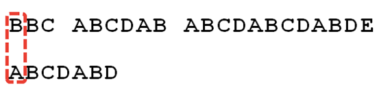
2. 重复第一步，还是不符合，再后移
    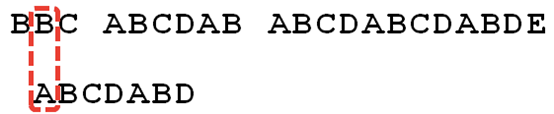
3. 一直重复，直到Str1有一个字符与Str2的第一个字符符合为止
    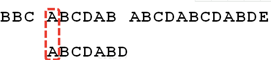
4. 接着比较字符串和搜索词的下一个字符，还是符合。
    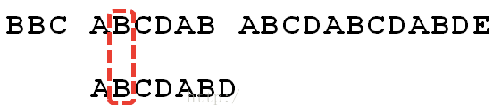
5. 遇到Str1有一个字符与Str2对应的字符不符合。
    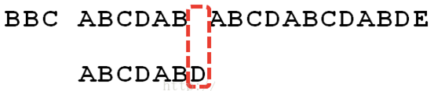
6. 这时候，想到的是继续遍历Str1的下一个字符，重复第1步。(其实是很不明智的，因为此时BCD已经比较过了，没有必要再做重复的工作，一个基本事实是，当空格与D不匹配时，你其实知道前面六个字符是"ABCDAB"。KMP算法的想法是，设法利用这个已知信息，不要把"搜索位置"移回已经比较过的位置，继续把它向后移，这样就提高了效率。)
    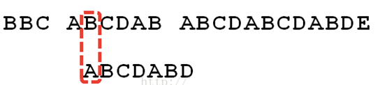
7. 怎么做到把刚刚重复的步骤省略掉？可以对Str2计算出一张《部分匹配表》，这张表的产生在后面介绍
    
8. 已知空格与D不匹配时，前面六个字符"ABCDAB"是匹配的。查表可知，最后一个匹配字符B对应的"部分匹配值"为2，因此按照下面的公式算出向后移动的位数：移动位数 = 已匹配的字符数 - 对应的部分匹配值。因为6-2等于4，所以将搜索词向后移动4位。
9. 因为空格与Ｃ不匹配，搜索词还要继续往后移。这时，已匹配的字符数为2（"AB"），对应的"部分匹配值"为0。所以，移动位数 = 2 - 0，结果为2，于是将搜索词向后移 2 位。
    
10. 因为空格与A不匹配，继续后移一位。
    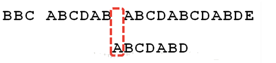
11. 逐位比较，直到发现C与D不匹配。于是，移动位数 = 6 - 2，继续将搜索词向后移动4位。
    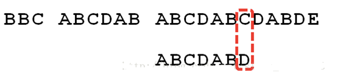
12. 逐位比较，直到搜索词的最后一位，发现完全匹配，于是搜索完成。如果还要继续搜索（即找出全部匹配），移动位数 = 7 - 0，再将搜索词向后移动 7 位，这里就不再重复了。
    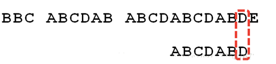
13. 介绍《部分匹配表》怎么产生的先介绍前缀，后缀是什么。"部分匹配值"就是"前缀"和"后缀"的最长的共有元素的长度。以"ABCDABD"为例:
    1.  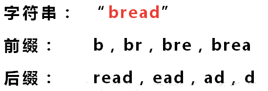
    - "A"的前缀和后缀都为空集，共有元素的长度为0；
    - "AB"的前缀为\[A\]，后缀为\[B\]，共有元素的长度为0；
    - "ABC"的前缀为[A, AB]，后缀为[BC, C]，共有元素的长度0；
    - "ABCD"的前缀为[A, AB, ABC]，后缀为[BCD, CD, D]，共有元素的长度为0；
    - "ABCDA"的前缀为[A, AB, ABC, ABCD]，后缀为[BCDA, CDA, DA, A]，共有元素为"A"，长度为1；
    - "ABCDAB"的前缀为[A, AB, ABC, ABCD, ABCDA]，后缀为[BCDAB, CDAB, DAB, AB, B]，共有元素为"AB"，长度为2；
    - "ABCDABD"的前缀为[A, AB, ABC, ABCD, ABCDA, ABCDAB]，后缀为[BCDABD, CDABD, DABD, ABD, BD, D]，共有元素的长度为0。
 
14. "部分匹配"的实质是，有时候，字符串头部和尾部会有重复。比如，"ABCDAB"之中有两个"AB"，那么它的"部分匹配值"就是2（"AB"的长度）。搜索词移动的时候，第一个"AB"向后移动4位（字符串长度-部分匹配值），就可以来到第二个"AB"的位置。
    

### 14.4.6 KMP算法最佳应用-代码实现
```java
public class KMPAlgorithm { // 代码由GitHub Copilot生成
	public static int[] getNext(String t) {
		int[] next = new int[t.length()];
		next[0] = -1;
		int k = -1, j = 0;
		while (j < t.length() - 1) {
			if (k == -1 || t.charAt(j) == t.charAt(k)) {
				k++;
				j++;
				next[j] = t.charAt(j) != t.charAt(k) ? k : next[k];
			} else {
				k = next[k];
			}
		}
		return next;
	}
	public static int kmp(String s, String t) {
		int[] next = getNext(t);
		int i = 0, j = 0;
		while (i < s.length() && j < t.length()) {
			if (j == -1 || s.charAt(i) == t.charAt(j)) {
				i++;
				j++;
			} else {
				j = next[j];
			}
		}
		return j == t.length() ? i - j : -1;
	}
}
```

## 14.5 贪心算法

### 14.5.1 应用场景-集合覆盖问题
假设存在下面需要付费的广播台，以及广播台信号可以覆盖的地区。如何选择最少的广播台，让所有的地区都可以接收到信号
    

### 14.5.2 贪心算法介绍
1. 贪婪算法(贪心算法)是指在对问题进行求解时，**在每一步选择中都采取最好或者最优(即最有利)的选择**，从而希望能够导致结果是最好或者最优的算法
2. 贪心算法所得到的结果不一定是最优的结果(有时候会是最优解)，但是都是相对近似(接近)最优解的结果

### 14.5.3 贪心算法最佳应用-集合覆盖
- 穷举法：列出每个可能的广播台的集合（幂集）。假设总的有n个广播台，则广播台的组合总共有2ⁿ-1个，假设每秒可以计算10个子集
  - 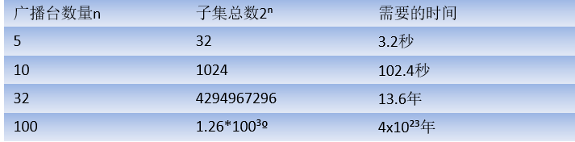
- 贪心算法
  1. 目前并没有算法可以快速计算得到准备的值，使用贪心算法，则可以得到非常接近的解，并且效率高。选择策略上，因为需要覆盖全部地区的最小集合
  2. 遍历所有的广播电台，找到一个覆盖了最多未覆盖的地区的电台(此电台可能包含一些已覆盖的地区，但没有关系）
  3. 将这个电台加入到一个集合中(比如ArrayList)，想办法把该电台覆盖的地区在下次比较时去掉。
  4. 重复第1步直到覆盖了全部的地区
- 分析图解
  - 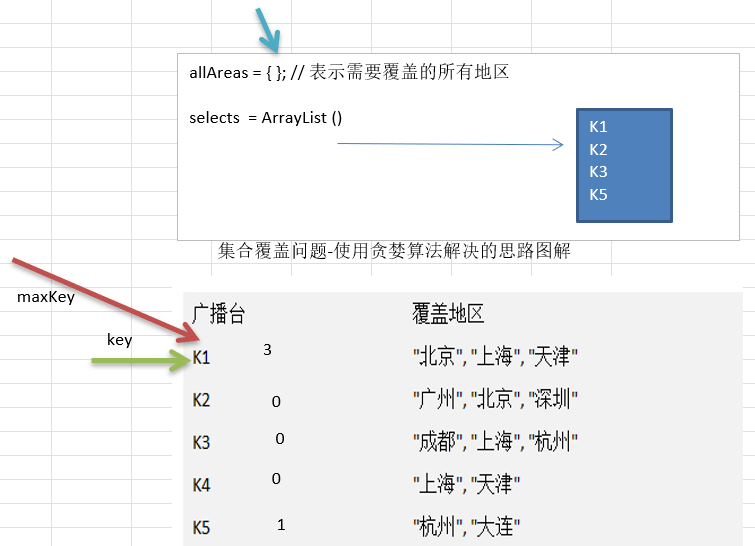
- 代码实现
    ```java
    public class GreedyAlgorithm {
        public static List<String> getBroadcasts(HashMap<String, HashSet<String>> broadcasts) {
            ArrayList<String> selects = new ArrayList<String>();
            HashSet<String> allAreas = new HashSet<String>();
            broadcasts.forEach((k, v) -> allAreas.addAll(v));
            // 临时集合，在遍历的过程中，存放遍历过程中的电台覆盖的地区和当前还没有覆盖的地区的交集
            HashSet<String> tempSet = new HashSet<String>();
            while (allAreas.size() != 0) { // 如果allAreas不为0，则表示还没有覆盖到所有的地区
                // 定义给maxKey，保存在一次遍历过程中，能够覆盖最大未覆盖的地区对应的电台的key
                String maxKey = null;
                // 遍历 broadcasts，取出对应key
                for (String key : broadcasts.keySet()) {
                    tempSet.clear();
                    HashSet<String> areas = broadcasts.get(key);// 当前这个key能够覆盖的地区
                    tempSet.addAll(areas);
                    // 求出tempSet和allAreas集合的交集赋给tempSet
                    tempSet.retainAll(allAreas);
                    // 如果当前这个集合包含的未覆盖地区的数量比maxKey指向的集合地区还多，重置maxKey
                    // tempSet.size() > broadcasts.get(maxKey).size()) 体现出贪心算法的特点,每次都选择最优的
                    if (tempSet.size() > 0 && (maxKey == null || tempSet.size() > broadcasts.get(maxKey).size())) {
                        maxKey = key;
                    }
                }
                if (maxKey != null) {// 如果maxKey不为null，则会加入到selects
                    selects.add(maxKey);
                    // 将maxKey指向的广播电台覆盖的地区，从allAreas去掉
                    allAreas.removeAll(broadcasts.get(maxKey));
                }
            }
            return selects;
        }
    }
    ```

### 14.5.4 贪心算法注意事项和细节
1. 贪婪算法所得到的结果**不一定是最优的结果(有时候会是最优解)**，但是都是相对近似(接近)最优解的结果
2. 比如上题的算法选出的是 K1, K2, K3, K5 符合覆盖了全部的地区
3. 但是我们发现 K2, K3, K4, K5 也可以覆盖全部地区，如果K2的使用成本低于K1那么我们上题的 K1, K2, K3, K5 虽然是满足条件，但是并不是最优的

## 14.6 普里姆算法

### 14.6.1 应用场景-修路问题
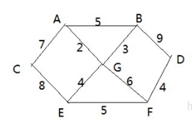
1. 有胜利乡有7个村庄(A, B, C, D, E, F, G)，现在需要修路把7个村庄连通
2. 各个村庄的距离用边线表示(权)，比如 A – B 距离 5 公里
3. 问：如何修路保证各个村庄都能连通，并且总的修建公路总里程最短?

思路：将10条边，连接即可，但是总的里程数不是最小  
正确的思路，就是尽可能的选择少的路线，并且每条路线最小，保证总里程数最少

### 14.6.2 最小生成树
修路问题本质就是就是**最小生成树问题**，先介绍一下最小生成树(Minimum Cost Spanning Tree)，简称MST。给定一个带权的无向连通图,如何选取一棵生成树,使树上所有边上权的总和为最小,这叫最小生成树
1. N 个顶点，一定有 N-1 条边
2. 包含全部顶点
3. N-1 条边都在图中
4. 求最小生成树的算法主要是普里姆算法和克鲁斯卡尔算法

### 14.6.3 普里姆算法介绍
普利姆(Prim)算法求最小生成树，也就是在包含n个顶点的连通图中，找出只有(n-1)条边包含所有n个顶点的连通子图，也就是所谓的极小连通子图

普利姆的算法如下:
1. 设G=(V,E)是连通网，T=(U,D)是最小生成树，V,U 是顶点集合，E,D 是边的集合
2. 若从顶点u开始构造最小生成树，则从集合V中取出顶点u放入集合U中，标记顶点v的visited\[u\]=1
3. 若集合U中顶点ui与集合V-U中的顶点vj之间存在边，则寻找这些边中权值最小的边，但不能构成回路，将顶点vj加入集合U中，将边（ui,vj）加入集合D中，标记visited\[vj\]=1
4. 重复步骤②，直到U与V相等，即所有顶点都被标记为访问过，此时D中有n-1条边
5. 提示：单独看步骤很难理解，我们通过代码来讲解，比较好理解
6. 图解
    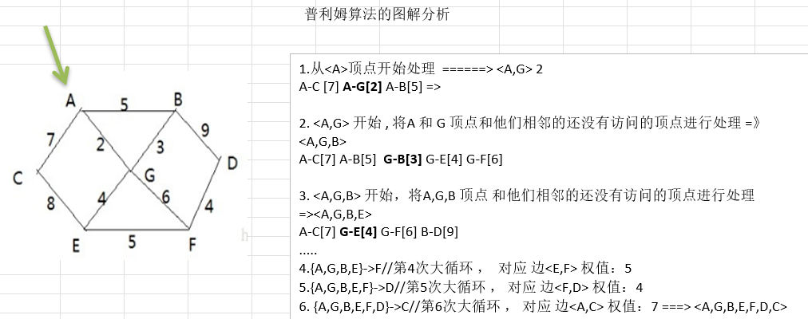

### 14.6.4 普里姆算法最佳实践(修路问题)
```java
class MinimumSpanningTree {
	static class Graph {
		int verxs;
		Object[] data;
		double[][] weight;
		public Graph(int vexnum, Object[] data, double[][] edges) {
			this.verxs = vexnum;
			this.data = data;
			this.weight = edges;
		}
	}
	public static void prim(Graph graph) {
		boolean[] visited = new boolean[graph.verxs];// 访问标记
		visited[0] = true;
		int h1 = -1, h2 = -1;
		double minWeight = Double.POSITIVE_INFINITY; // 将 minWeight 初始成一个大数，后面在遍历过程中，会被替换
		for (int k = 1; k < graph.verxs; k++) {// 因为有 graph.verxs顶点，普利姆算法结束后，有 graph.verxs-1边
			// 这个是确定每一次生成的子图 ，和哪个结点的距离最近
			for (int i = 0; i < graph.verxs; i++) {// i结点表示被访问过的结点
				for (int j = 0; j < graph.verxs; j++) {// j结点表示还没有访问过的结点
					if (visited[i] && !visited[j] && graph.weight[i][j] < minWeight) {
						// 替换minWeight(寻找已经访问过的结点和未访问过的结点间的权值最小的边)
						minWeight = graph.weight[i][j];
						h1 = i;	h2 = j;
					}
				}
			}
			// 找到一条边是最小
			System.out.println("边<" + graph.data[h1] + "," + graph.data[h2] + "> 权值:" + minWeight);
			visited[h2] = true;// 将当前这个结点标记为已经访问
			// minWeight 重新设置为最大值 Double.POSITIVE_INFINITY
			minWeight = Double.POSITIVE_INFINITY;
		}
	}
}
```

## 14.7 克鲁斯卡尔算法

### 14.7.1 应用场景-公交站问题
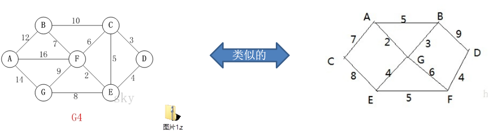
1. 某城市新增7个站点(A, B, C, D, E, F, G)，现在需要修路把7个站点连通
2. 各个站点的距离用边线表示(权)，比如 A – B 距离 12 公里
3. 问：如何修路保证各个站点都能连通，并且总的修建公路总里程最短?

### 14.7.2 克鲁斯卡尔算法介绍
1. 克鲁斯卡尔(Kruskal)算法，是用来求加权连通图的最小生成树的算法。
2. 基本思想：按照权值从小到大的顺序选择n-1条边，并保证这n-1条边不构成回路
3. 具体做法：首先构造一个只含n个顶点的森林，然后依权值从小到大从连通网中选择边加入到森林中，并使森林中不产生回路，直至森林变成一棵树为止

### 14.7.3 克鲁斯卡尔算法图解说明
在含有n个顶点的连通图中选择n-1条边，构成一棵极小连通子图，并使该连通子图中n-1条边上权值之和达到最小，则称其为连通网的最小生成树。
    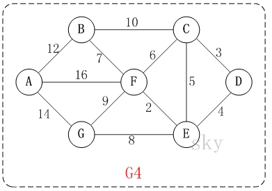
例如，对于如上图G4所示的连通网可以有多棵权值总和不相同的生成树。
    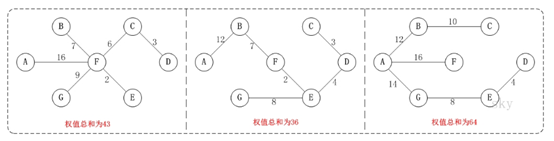

#### 克鲁斯卡尔算法图解
以上图G4为例，来对克鲁斯卡尔进行演示(假设，用数组R保存最小生成树结果)。
    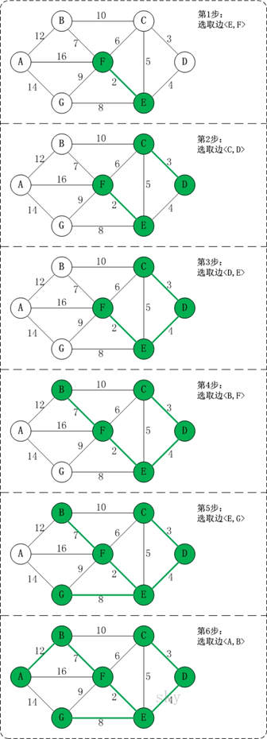
1. 第1步：将边`<E,F>`加入R中。 
    边`<E,F>`的权值最小，因此将它加入到最小生成树结果R中。 
2. 第2步：将边`<C,D>`加入R中。 
    上一步操作之后，边`<C,D>`的权值最小，因此将它加入到最小生成树结果R中。 
3. 第3步：将边`<D,E>`加入R中。 
    上一步操作之后，边`<D,E>`的权值最小，因此将它加入到最小生成树结果R中。 
4. 第4步：将边`<B,F>`加入R中。 
    上一步操作之后，边`<C,E>`的权值最小，但`<C,E>`会和已有的边构成回路；因此，跳过边`<C,E>`。同理，跳过边`<C,F>`。将边`<B,F>`加入到最小生成树结果R中。 
5. 第5步：将边`<E,G>`加入R中。 
    上一步操作之后，边`<E,G>`的权值最小，因此将它加入到最小生成树结果R中。 
6. 第6步：将边`<A,B>`加入R中。 
    上一步操作之后，边`<F,G>`的权值最小，但`<F,G>`会和已有的边构成回路；因此，跳过边`<F,G>`。同理，跳过边`<B,C>`。将边`<A,B>`加入到最小生成树结果R中。
此时，最小生成树构造完成！它包括的边依次是：`<E,F> <C,D> <D,E> <B,F> <E,G> <A,B>`。

#### 克鲁斯卡尔算法分析
根据前面介绍的克鲁斯卡尔算法的基本思想和做法，我们能够了解到，克鲁斯卡尔算法重点需要解决的以下两个问题：
- 问题一 对图的所有边按照权值大小进行排序。 
- 问题二 将边添加到最小生成树中时，怎么样判断是否形成了回路。

问题一很好解决，采用排序算法进行排序即可。
问题二，处理方式是：记录顶点在"最小生成树"中的终点，顶点的终点是"在最小生成树中与它连通的最大顶点"。然后每次需要将一条边添加到最小生存树时，判断该边的两个顶点的终点是否重合，重合的话则会构成回路。

#### 如何判断是否构成回路-举例说明(如图)
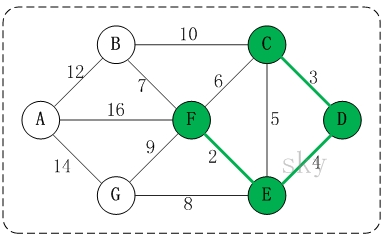
在将`<E,F> <C,D> <D,E>`加入到最小生成树R中之后，这几条边的顶点就都有了终点：
1. C的终点是F。 
2. D的终点是F。 
3. E的终点是F。 
4. F的终点是F。

关于终点的说明：
1. 就是将所有顶点按照从小到大的顺序排列好之后；某个顶点的终点就是"与它连通的最大顶点"。 
2. 因此，接下来，虽然`<C,E>`是权值最小的边。但是C和E的终点都是F，即它们的终点相同，因此，将`<C,E>`加入最小生成树的话，会形成回路。这就是判断回路的方式。也就是说，**我们加入的边的两个顶点不能都指向同一个终点，否则将构成回路**。【后面有代码说明】

### 14.7.4 克鲁斯卡尔最佳实践-公交站问题
```java
class Kruskal {
	static final int INF = Integer.MAX_VALUE;
	static class Edge implements Comparable<Edge> {
		char start, end;
		int weight;
		public Edge(char start, char end, int weight) {
			this.start = start;
			this.end = end;
			this.weight = weight;
		}
		@Override
		public String toString() {
			return "Edge <" + start + ", " + end + "> = " + weight;
		}
		@Override
		public int compareTo(Edge o) {
			return this.weight - o.weight;
		}
	}
	char[] vertexs; // 顶点数组
	int[][] matrix; // 邻接矩阵
	List<Edge> edges; // 边集合
	public Kruskal(char[] vertexs, int[][] matrix) {
		this.vertexs = new char[vertexs.length];
		for (int i = 0; i < vertexs.length; i++) {
			this.vertexs[i] = vertexs[i];
		}
		this.matrix = new int[vertexs.length][vertexs.length];
		edges = new ArrayList<>();
		for (int i = 0; i < vertexs.length; i++) {
			for (int j = i + 1; j < vertexs.length; j++) {
				if ((this.matrix[i][j] = matrix[i][j]) != INF) {
					edges.add(new Edge(vertexs[i], vertexs[j], matrix[i][j]));
				}
			}
		}
	}
	public List<Edge> kruskal() {
		List<Edge> result = new ArrayList<>();
		int[] ends = new int[edges.size()]; // 用于保存"已有最小生成树" 中的每个顶点在最小生成树中的终点
		Collections.sort(edges); // 按照边的权值排序
		// 遍历edges，将边添加到最小生成树中时，判断是准备加入的边否形成了回路，如果没有，就加入 rets, 否则不能加入
		for (int i = 0; i < edges.size(); i++) {
			// 获取到第i条边的第一个顶点(起点)
			int p1 = indexOf(edges.get(i).start); // p1=4
			// 获取到第i条边的第2个顶点
			int p2 = indexOf(edges.get(i).end); // p2=5
			// 获取p1这个顶点在已有最小生成树中的终点
			int m = getEnd(ends, p1); // m = 4
			// 获取p2这个顶点在已有最小生成树中的终点
			int n = getEnd(ends, p2); // n = 5
			if (m != n) { // 没有构成回路
				ends[m] = n; // 设置m 在"已有最小生成树"中的终点 <E,F> [0,0,0,0,5,0,0,0,0,0,0,0]
				result.add(edges.get(i));// 有一条边加入到rets数组
			}
		}
		return result;
	}
	private int indexOf(char c) {
		for (int i = 0; i < vertexs.length; i++) {
			if (vertexs[i] == c) {
				return i;
			}
		}
		return -1;
	}
	/**
	 * 功能: 获取下标为i的顶点的终点(), 用于后面判断两个顶点的终点是否相同
	 * @param ends 数组就是记录了各个顶点对应的终点是哪个,ends数组在遍历过程中逐步形成
	 * @param i    表示传入的顶点对应的下标
	 * @return 下标为i的这个顶点对应的终点的下标
	 */
	private int getEnd(int[] ends, int i) { // i = 4 [0,0,0,0,5,0,0,0,0,0,0,0]
		while (ends[i] != 0) {
			i = ends[i];
		}
		return i;
	}
}
```

## 14.8 迪杰斯特拉算法

### 14.8.1 应用场景-最短路径问题

1. 战争时期，胜利乡有7个村庄(A, B, C, D, E, F, G) ，现在有六个邮差，从G点出发，需要分别把邮件分别送到A, B, C , D, E, F六个村庄
2. 各个村庄的距离用边线表示(权) ，比如 A – B 距离 5 公里
3. 问：如何计算出G村庄到其它各个村庄的最短距离？
4. 如果从其它点出发到各个点的最短距离又是多少？

### 14.8.2 迪杰斯特拉(Dijkstra)算法介绍
迪杰斯特拉(Dijkstra)算法是**典型最短路径算法**，用于计算一个结点到其他结点的最短路径。它的主要特点是以起始点为中心向外层层扩展(**广度优先搜索思想**)，直到扩展到终点为止。

### 14.8.3 迪杰斯特拉(Dijkstra)算法过程
设置出发顶点为v，顶点集合V{v1,v2,vi...}，v到V中各顶点的距离构成距离集合Dis，Dis{d1,d2,di...}，Dis集合记录着v到图中各顶点的距离(到自身可以看作0，v到vi距离对应为di)
1. 从Dis中选择值最小的di并移出Dis集合，同时移出V集合中对应的顶点vi，此时的v到vi即为最短路径
2. 更新Dis集合，更新规则为：比较v到V集合中顶点的距离值，与v通过vi到V集合中顶点的距离值，保留值较小的一个(同时也应该更新顶点的前驱节点为vi，表明是通过vi到达的)
3. 重复执行两步骤，直到最短路径顶点为目标顶点即可结束

### 14.8.4 迪杰斯特拉(Dijkstra)算法最佳应用-最短路径
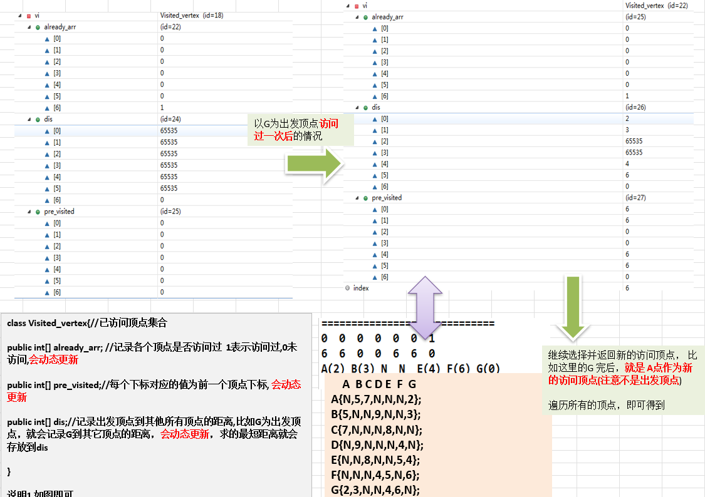

```java
class Graph {
	static class VisitedVertexs {// 已访问顶点集合
		boolean[] already_arr;// 记录各个顶点是否访问过1表示访问过,0未访问,动态更新
		int[] pre_visited;// 每个下标对应的值为前一个顶点下标,会动态更新
		int[] dis;// 记录出发顶点到其他所有顶点的距离,比如G为出发顶点,就会记录G到其它顶点的距离,会动态更新,求的最短距离就会存放到dis
		public VisitedVertexs(int length, int index) {// length:表示顶点的个数;index:出发顶点对应的下标,比如G顶点,下标就是6
			already_arr = new boolean[length];
			pre_visited = new int[length];
			dis = new int[length];
			Arrays.fill(dis, Integer.MAX_VALUE);// 初始化 dis数组
			already_arr[index] = true; // 设置出发顶点被访问过
			dis[index] = 0;// 设置出发顶点的访问距离为0
		}
		public int updateArr() {// 继续选择并返回新的访问顶点,比如这里的G完后,就是A点作为新的访问顶点(注意不是出发顶点)
			int min = Integer.MAX_VALUE, index = 0;
			for (int i = 0; i < already_arr.length; i++) {
				if (!already_arr[i] && dis[i] < min) {
					min = dis[i];
					index = i;
				}
			}
			already_arr[index] = true;// 更新index顶点被访问过
			return index;
		}
	}
	char[] vertex; // 顶点数组
	int[][] matrix; // 邻接矩阵
	VisitedVertexs vv; // 已经访问的顶点的集合
	public Graph(char[] vertex, int[][] matrix) {
		this.vertex = vertex;
		this.matrix = matrix;
	}
	public void show() {
		for (int i = 0; i < vertex.length; i++) {
			System.out.print(vv.dis[i] != Integer.MAX_VALUE ? vertex[i] + "(" + vv.dis[i] + ") " : "N ");
		}
	}
	public void dsj(int index) { // index 表示出发顶点对应的下标
		vv = new VisitedVertexs(vertex.length, index);
		update(index);// 更新index顶点到周围顶点的距离和前驱顶点
		for (int j = 1; j < vertex.length; j++) {
			index = vv.updateArr();// 选择并返回新的访问顶点
			update(index); // 更新index顶点到周围顶点的距离和前驱顶点
		}
	}
	// 更新index下标顶点到周围顶点的距离和周围顶点的前驱顶点
	private void update(int index) {
		// 根据遍历我们的邻接矩阵的 matrix[index]行
		for (int j = 0; j < matrix[index].length; j++) {
			// len含义是:出发顶点到index顶点的距离+从index顶点到j顶点的距离的和
			int len = vv.dis[index] == Integer.MAX_VALUE || matrix[index][j] == Integer.MAX_VALUE ? Integer.MAX_VALUE
					: vv.dis[index] + matrix[index][j];
			// 如果j顶点没有被访问过,并且len小于出发顶点到j顶点的距离,就需要更新
			if (!vv.already_arr[j] && len < vv.dis[j]) {
				vv.pre_visited[j] = index;// 更新j顶点的前驱为index顶点
				vv.dis[j] = len; // 更新出发顶点到j顶点的距离
			}
		}
	}
}
public class DijkstraAlgorithm {
	public static void main(String[] args) {
		char[] vertex = { 'A', 'B', 'C', 'D', 'E', 'F', 'G' };
		int[][] matrix = new int[vertex.length][vertex.length];
		final int N = Integer.MAX_VALUE;// 表示不可以连接
		matrix[0] = new int[] { N, 5, 7, N, N, N, 2 };
		matrix[1] = new int[] { 5, N, N, 9, N, N, 3 };
		matrix[2] = new int[] { 7, N, N, N, 8, N, N };
		matrix[3] = new int[] { N, 9, N, N, N, 4, N };
		matrix[4] = new int[] { N, N, 8, N, N, 5, 4 };
		matrix[5] = new int[] { N, N, N, 4, 5, N, 6 };
		matrix[6] = new int[] { 2, 3, N, N, 4, 6, N };
		Graph graph = new Graph(vertex, matrix);// 创建 Graph对象
		graph.dsj(6);// G
		graph.show();
	}
}
```

## 14.9 弗洛伊德算法

### 14.9.1 弗洛伊德(Floyd)算法介绍
1. 和Dijkstra算法一样，弗洛伊德(Floyd)算法也是一种用于寻找给定的加权图中顶点间最短路径的算法。该算法名称以创始人之一、1978 年图灵奖获得者、斯坦福大学计算机科学系教授罗伯特·弗洛伊德命名
2. 弗洛伊德算法(Floyd)计算图中各个顶点之间的最短路径
3. 迪杰斯特拉算法用于计算图中某一个顶点到其他顶点的最短路径。
4. 弗洛伊德算法 VS 迪杰斯特拉算法：迪杰斯特拉算法通过选定的被访问顶点，求出从出发访问顶点到其他顶点的最短路径；弗洛伊德算法中每一个顶点都是出发访问点，所以需要将每一个顶点看做被访问顶点，求出从每一个顶点到其他顶点的最短路径。

### 14.9.2 弗洛伊德(Floyd)算法图解分析
1. 设置顶点vi到顶点vk的最短路径已知为Lik，顶点vk到vj的最短路径已知为Lkj，顶点vi到vj的路径为Lij，则vi到vj的最短路径为：min((Lik+Lkj),Lij)，vk的取值为图中所有顶点，则可获得vi到vj的最短路径
2. 至于vi到vk的最短路径Lik 或者vk到vj的最短路径Lkj，是以同样的方式获得
3. 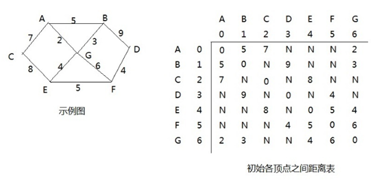
4. 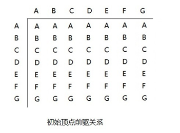
5. 第一轮循环中，以A(下标为：0)作为中间顶点，距离表和前驱关系更新为： 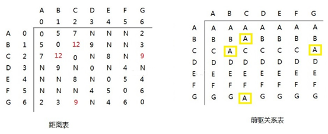
6. 分析如下：
   1. 以A顶点作为中间顶点是，B->A->C的距离由N->9，同理C到B；C->A->G的距离由N->12，同理G到C
   2. 更换中间顶点，循环执行操作，直到所有顶点都作为中间顶点更新后，计算结束
7. 

### 14.9.3 弗洛伊德(Floyd)算法最佳应用-最短路径
```java
class Graph {
	char[] vertex; // 存放顶点的数组
	int[][] dis; // 保存，从各个顶点出发到其它顶点的距离，最后的结果，也是保留在该数组
	int[][] pre; // 保存到达目标顶点的前驱顶点
	// length 大小，matrix 邻接矩阵，vertex 顶点数组
	public Graph(int length, int[][] matrix, char[] vertex) {
		this.vertex = vertex;
		this.dis = matrix;
		this.pre = new int[length][length];
		for (int i = 0; i < length; i++) {
			// 对pre数组初始化, 注意存放的是前驱顶点的下标
			Arrays.fill(pre[i], i);
		}
	}
	public void floyd() {
		// 对中间顶点遍历， k 就是中间顶点的下标 [A, B, C, D, E, F, G]
		for (int k = 0; k < dis.length; k++) { //
			// 从i顶点开始出发 [A, B, C, D, E, F, G]
			for (int i = 0; i < dis.length; i++) {
				// 到达j顶点 // [A, B, C, D, E, F, G]
				for (int j = 0; j < dis.length; j++) {
					// => 求出从i 顶点出发，经过 k中间顶点，到达 j 顶点距离
					int len = dis[i][k] == Integer.MAX_VALUE || dis[k][j] == Integer.MAX_VALUE ? Integer.MAX_VALUE
							: dis[i][k] + dis[k][j];
					if (len < dis[i][j]) {// 如果len小于 dis[i][j]
						dis[i][j] = len;// 更新距离
						pre[i][j] = pre[k][j];// 更新前驱顶点
					}
				}
			}
		}
	}
	public void show() {
		for (int k = 0; k < dis.length; k++) {
			for (int i = 0; i < dis.length; i++) {
				System.out.println("(" + vertex[k] + "到" + vertex[i] + "的最短路径是" + dis[k][i] + ") ");
			}
		}
	}
}
public class FloydAlgorithm {
	public static void main(String[] args) {
		char[] vertex = { 'A', 'B', 'C', 'D', 'E', 'F', 'G' };
		int[][] matrix = new int[vertex.length][vertex.length];
		final int N = Integer.MAX_VALUE;// 表示不临接
		matrix[0] = new int[] { 0, 5, 7, N, N, N, 2 };
		matrix[1] = new int[] { 5, 0, N, 9, N, N, 3 };
		matrix[2] = new int[] { 7, N, 0, N, 8, N, N };
		matrix[3] = new int[] { N, 9, N, 0, N, 4, N };
		matrix[4] = new int[] { N, N, 8, N, 0, 5, 4 };
		matrix[5] = new int[] { N, N, N, 4, 5, 0, 6 };
		matrix[6] = new int[] { 2, 3, N, N, 4, 6, 0 };
		Graph graph = new Graph(vertex.length, matrix, vertex);
		graph.floyd();
		graph.show();
	}
}
```

## 14.10马踏棋盘算法

### 14.10.1 马踏棋盘算法介绍和游戏演示
1. 马踏棋盘算法也被称为骑士周游问题
2. 将马随机放在国际象棋的8×8棋盘Board\[0～7\]\[0～7\]的某个方格中，马按走棋规则(马走日字)进行移动。要求每个方格只进入一次，走遍棋盘上全部64个方格
3. 游戏演示: 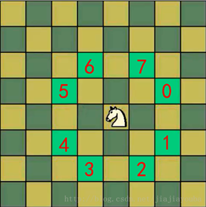

### 14.10.2 马踏棋盘游戏代码实现
1. 马踏棋盘问题(骑士周游问题)实际上是图的深度优先搜索(DFS)的应用。
2. 如果使用回溯（就是深度优先搜索）来解决，假如马儿踏了53 个点，如图：走到了第53个，坐标（1,0），发现已经走到尽头，没办法，那就只能回退了，查看其他的路径，就在棋盘上不停的回溯...... ，思路分析+代码实现
3. 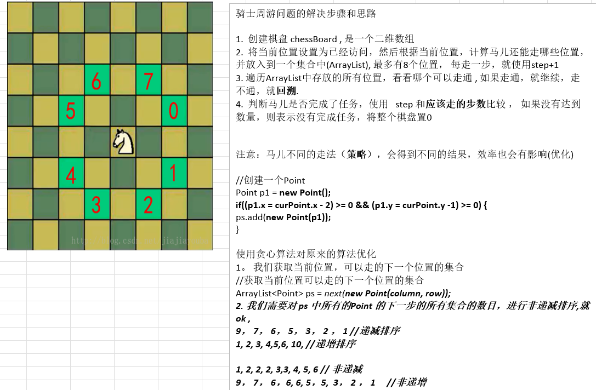
```java
public class HorseChessboard {
    private static int X;
    private static int Y;
    private static boolean visited[];
    private static boolean finished;
    public static void main(String[] args) {
        X = Y = 8;
        int row = 1, column = 1;
        int[][] chessboard = new int[X][Y];
        visited = new boolean[X * Y];
        traversalChessboard(chessboard, row - 1, column - 1, 1);
        for (int[] rows : chessboard) {
            for (int step : rows) {
                System.out.print(step + "\t");
            }
            System.out.println();
        }
    }
    public static void traversalChessboard(int[][] chessboard, int row, int column, int step) {
        chessboard[row][column] = step;
        visited[row * X + column] = true;
        ArrayList<Point> ps = next(new Point(column, row));
        ps.sort((o1, o2) -> Integer.compare(next(o1).size(), next(o2).size()));
        while (!ps.isEmpty()) {
            Point p = ps.remove(0);
            if (!visited[p.y * X + p.x]) {
                traversalChessboard(chessboard, p.y, p.x, step + 1);
            }
        }
        if (step < X * Y && !finished) {
            chessboard[row][column] = 0;
            visited[row * X + column] = false;
        } else {
            finished = true;
        }
    }
    public static ArrayList<Point> next(Point curPoint) {
        ArrayList<Point> ps = new ArrayList<Point>();
        Point p1 = new Point();
        if ((p1.x = curPoint.x - 2) >= 0 && (p1.y = curPoint.y - 1) >= 0) {
            ps.add(new Point(p1));
        }
        if ((p1.x = curPoint.x - 1) >= 0 && (p1.y = curPoint.y - 2) >= 0) {
            ps.add(new Point(p1));
        }
        if ((p1.x = curPoint.x + 1) < X && (p1.y = curPoint.y - 2) >= 0) {
            ps.add(new Point(p1));
        }
        if ((p1.x = curPoint.x + 2) < X && (p1.y = curPoint.y - 1) >= 0) {
            ps.add(new Point(p1));
        }
        if ((p1.x = curPoint.x + 2) < X && (p1.y = curPoint.y + 1) < Y) {
            ps.add(new Point(p1));
        }
        if ((p1.x = curPoint.x + 1) < X && (p1.y = curPoint.y + 2) < Y) {
            ps.add(new Point(p1));
        }
        if ((p1.x = curPoint.x - 1) >= 0 && (p1.y = curPoint.y + 2) < Y) {
            ps.add(new Point(p1));
        }
        if ((p1.x = curPoint.x - 2) >= 0 && (p1.y = curPoint.y + 1) < Y) {
            ps.add(new Point(p1));
        }
        return ps;
    }
}
```

