# 第1章 内容介绍和授课方式

## 1.1 Java设计模式内容介绍

### 1.1.1 先看几个经典的面试题
原型设计模式问题：
1. 有请使用 UML 类图画出原型模式核心角色
2. 原型设计模式的深拷贝和浅拷贝是什么，并写出深拷贝的两种方式的源码(重写 clone 方法实现深拷贝、使用序列化来实现深拷贝)
3. 在 Spring 框架中哪里使用到原型模式，并对源码进行分析
    ```xml
    beans.xml
    <bean id="id01" class="com.atguigu.spring.bean.Monster" scope="prototype"/>
    ```
4. Spring 中原型 bean 的创建，就是原型模式的应用
5. 代码分析+Debug 源码
    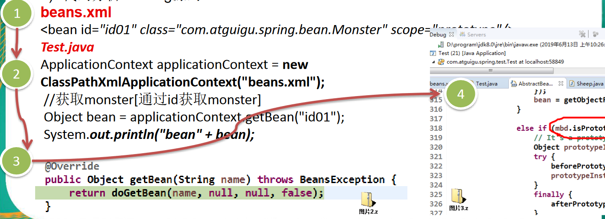

设计模式的七大原则: 
1. **七大设计原则核心思想**
2. 能够以类图的说明设计原则
3. 在项目实际开发中，你在哪里使用到了ocp原则

设计模式常用的七大原则有:
1. 单一职责原则
2. 接口隔离原则
3. 依赖倒转原则
4. 里氏替换原则
5. 开闭原则 ocp
6. 迪米特法则
7. **合成复用原则**

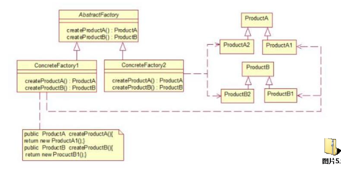

金融借贷平台项目：借贷平台的订单，有审核-发布-抢单等步骤，随着操作的不同，会改变订单的状态，项目中的这个模块实现就会使用到状态模式，请你使用状态模式进行设计，并完成实际代码

问题分析：这类代码难以应对变化，在添加一种状态时，我们需要手动添加if/else，在添加一种功能时，要对所有的状态进行判断。因此代码会变得越来越臃肿，并且一旦没有处理某个状态，便会发生极其严重的BUG，难以维护

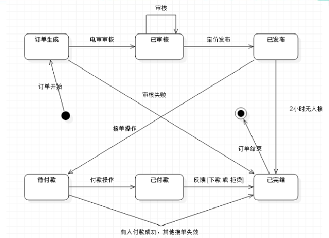

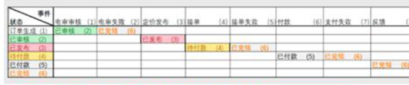

解释器设计模式
1. 介绍解释器设计模式是什么?
2. 画出解释器设计模式的UML类图，分析设计模式中的各个角色是什么?
3. 请说明Spring的框架中，哪里使用到了解释器设计模式，并做源码级别的分析

解释器模式在Spring框架应用的源码剖析
1. Spring框架中 SpelExpressionParser 就使用到解释器模式
2. 代码分析+Debug源码+模式角色分析说明
    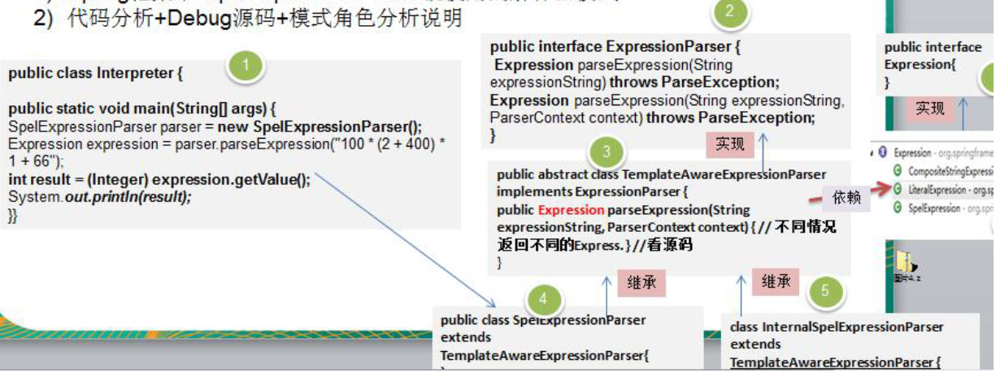

单例设计模式一共有几种实现方式？请分别用代码实现，并说明各个实现方式的优点和缺点?

单例设计模式一共有8种写法，后面我们会依次讲到
1. 饿汉式 两种
2. 懒汉式 三种
3. 双重检查
4. 静态内部类
5. 枚举

### 1.1.2 设计模式的重要性
1. 软件工程中，**设计模式**（design pattern）是对软件设计中**普遍存在**（反复出现）的各种问题，所提出的**解决方案**。这个术语是由埃里希·伽玛（Erich Gamma）等人在 1990 年代从建筑设计领域引入到计算机科学的
2. 大厦 VS 简易房
3. 拿实际工作经历来说，当一个项目开发完后，如果**客户提出增新功能**，怎么办?。（可扩展性,使用设计模式，软件具有很好的扩展性）
4. 如果项目开发完后，原来程序员离职，你接手维护该项目怎么办? (**维护性**\[可读性、规范性\])
5. 目前程序员门槛越来越高，一线 IT 公司(大厂)，都会问你在实际项目中使用过什么设计模式，怎样使用的，解决了什么问题。
6. 设计模式在软件中哪里？面向对象(oo)=>功能模块\[设计模式+算法(数据结构)\]=>框架\[使用到多种设计模式\]=>架构 \[服务器集群\]
7. 如果想成为合格**软件工程师**，那就花时间来研究下设计模式是非常必要的

## 1.2 课程亮点和授课方式
1. 课程深入，非蜻蜓点水
2. 课程成体系，非星星点灯
3. 高效而愉快的学习，设计模式很有用，其实也很好玩，很像小时候搭积木，怎样搭建更加稳定，坚固
4. 设计模式很重要，因为包含很多编程思想，还是有一定难度的，我们努力做到通俗易懂
5. 采用 应用场景->设计模式->剖析原理->分析实现步骤(图解)->代码实现->框架或项目源码分析(找到使用的地方)的步骤讲解 \[比如: 建造者模式\]
6. 课程目标：让大家掌握本质，达能在工作中灵活运用解决实际问题和优化程序结构的目的


# 第2章 设计模式七大原则

## 2.1 设计模式的目的

编写软件过程中，程序员面临着来自耦合性，内聚性以及可维护性，可扩展性，重用性，灵活性等多方面的挑战，设计模式是为了让程序(软件)，具有更好
1. 代码重用性 (即：相同功能的代码，不用多次编写)
2. 可读性 (即：编程规范性, 便于其他程序员的阅读和理解)
3. 可扩展性 (即：当需要增加新的功能时，非常的方便，称为可维护)
4. 可靠性 (即：当我们增加新的功能后，对原来的功能没有影响)
5. 使程序呈现**高内聚，低耦合**的特性

分享金句：  
设计模式包含了面向对象的精髓，“懂了设计模式，你就懂了面向对象分析和设计（OOA/D）的精要”  
Scott Mayers在其巨著《Effective C++》就曾经说过：C++老手和C++新手的区别就是前者手背上有很多伤疤

## 2.2 设计模式七大原则

设计模式原则，其实就是程序员在编程时，应当遵守的原则，也是各种设计模式的基础(即：设计模式为什么这样设计的依据)

设计模式常用的七大原则有:
1. 单一职责原则
2. 接口隔离原则
3. 依赖倒转原则
4. 里氏替换原则
5. 开闭原则 ocp
6. 迪米特法则
7. 合成复用原则

## 2.3 单一职责原则

### 2.3.1 基本介绍
对类来说的，**即一个类应该只负责一项职责**。如类 A 负责两个不同职责：职责 1，职责 2。当职责 1 需求变更而改变 A 时，可能造成职责 2 执行错误，所以需要将类 A 的粒度分解为 A1，A2

### 2.3.2 应用实例(以交通工具案例讲解)
方案一
```java
package com.atguigu.principle.singleresponsibility;
public class SingleResponsibility1 {
	public static void main(String[] args) {
		Vehicle vehicle = new Vehicle();
		vehicle.run("摩托车");
		vehicle.run("汽车");
		vehicle.run("飞机");
	}
}
// 交通工具类
// 方式1
// 1. 在方式1 的run方法中，违反了单一职责原则
// 2. 解决的方案非常的简单，根据交通工具运行方法不同，分解成不同类即可
class Vehicle {
	public void run(String vehicle) {
		System.out.println(vehicle + " 在公路上运行....");
	}
}
```

方案二
```java
public class SingleResponsibility2 {
	public static void main(String[] args) {
		RoadVehicle roadVehicle = new RoadVehicle();
		roadVehicle.run("摩托车");
		roadVehicle.run("汽车");
		AirVehicle airVehicle = new AirVehicle();
		airVehicle.run("飞机");
	}
}
//方案 2 的分析
//1. 遵守单一职责原则
//2. 但是这样做的改动很大，即将类分解，同时修改客户端
//3. 改进：直接修改 Vehicle 类，改动的代码会比较少=>方案 3
class RoadVehicle {
	public void run(String vehicle) {
		System.out.println(vehicle + "公路运行");
	}
}
class AirVehicle {
	public void run(String vehicle) {
		System.out.println(vehicle + "天空运行");
	}
}
class WaterVehicle {
	public void run(String vehicle) {
		System.out.println(vehicle + "水中运行");
	}
}
```

方案三
```java
public class SingleResponsibility3 {
	public static void main(String[] args) {
		Vehicle2 vehicle2  = new Vehicle2();
		vehicle2.run("汽车");
		vehicle2.runWater("轮船");
		vehicle2.runAir("飞机");
	}
}
//方式3的分析
//1. 这种修改方法没有对原来的类做大的修改，只是增加方法
//2. 这里虽然没有在类这个级别上遵守单一职责原则，但是在方法级别上，仍然是遵守单一职责
class Vehicle2 {
	public void run(String vehicle) {
		//处理
		System.out.println(vehicle + " 在公路上运行....");
	}
	public void runAir(String vehicle) {
		System.out.println(vehicle + " 在天空上运行....");
	}
	public void runWater(String vehicle) {
		System.out.println(vehicle + " 在水中行....");
	}
	//方法2.
	//...
}
```

### 2.3.3 单一职责原则注意事项和细节
1. 降低类的复杂度，一个类只负责一项职责。
2. 提高类的可读性，可维护性
3. 降低变更引起的风险
4. 通常情况下，**我们应当遵守单一职责原则**，只有逻辑足够简单，才可以在代码级违反单一职责原则；只有类中方法数量足够少，可以在方法级别保持单一职责原则

## 2.4 接口隔离原则(Interface Segregation Principle)

### 2.4.1 基本介绍
1. 客户端不应该依赖它不需要的接口，即一个类对另一个类的依赖应该建立在最小的接口上
2. 先看一张图
    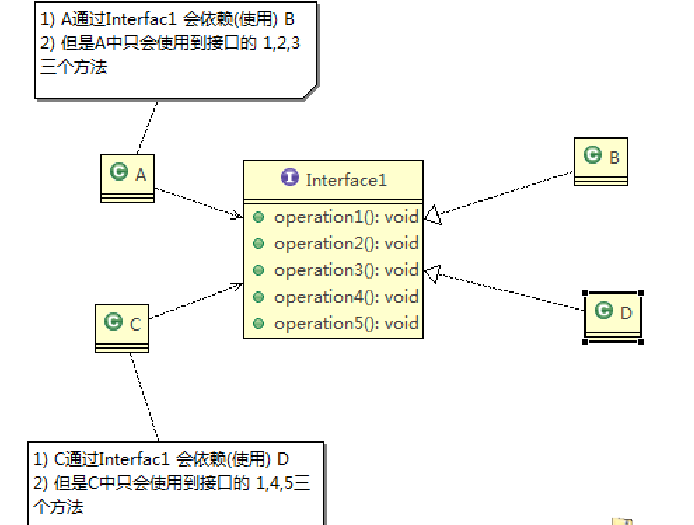
3. 类 A 通过接口 Interface1 依赖类 B，类 C 通过接口 Interface1 依赖类 D，如果接口 Interface1 对于类 A 和类 C 来说不是最小接口，那么类 B 和类 D 必须去实现他们不需要的方法。
4. 按隔离原则应当这样处理：将接口 Interface1 拆分为独立的几个接口(这里我们拆分成 3 个接口)，类 A 和类 C 分别与他们需要的接口建立依赖关系，也就是采用接口隔离原则。

### 2.4.2 应用实例
1. 类 A 通过接口 Interface1 依赖类 B，类 C 通过接口 Interface1 依赖类 D，请编写代码完成此应用实例。
2. 没有使用接口隔离原则代码
    ```java
    package com.atguigu.principle.segregation;
    interface Interface1 { //接口
        void operation1();
        void operation2();
        void operation3();
        void operation4();
        void operation5();
    }
    class B implements Interface1 {
        public void operation1() {
            System.out.println("B 实现了 operation1");
        }
        public void operation2() {
            System.out.println("B 实现了 operation2");
        }
        public void operation3() {
            System.out.println("B 实现了 operation3");
        }
        public void operation4() {
            System.out.println("B 实现了 operation4");
        }
        public void operation5() {
            System.out.println("B 实现了 operation5");
        }
    }
    class D implements Interface1 {
        public void operation1() {
            System.out.println("D 实现了 operation1");
        }
        public void operation2() {
            System.out.println("D 实现了 operation2");
        }
        public void operation3() {
            System.out.println("D 实现了 operation3");
        }
        public void operation4() {
            System.out.println("D 实现了 operation4");
        }
        public void operation5() {
            System.out.println("D 实现了 operation5");
        }
    }
    class A { //A 类通过接口Interface1 依赖(使用) B类，但是只会用到1,2,3方法
        public void depend1(Interface1 i) {
            i.operation1();
        }
        public void depend2(Interface1 i) {
            i.operation2();
        }
        public void depend3(Interface1 i) {
            i.operation3();
        }
    }
    class C { //C 类通过接口Interface1 依赖(使用) D类，但是只会用到1,4,5方法
        public void depend1(Interface1 i) {
            i.operation1();
        }
        public void depend4(Interface1 i) {
            i.operation4();
        }
        public void depend5(Interface1 i) {
            i.operation5();
        }
    }
    ```

### 2.4.3 应传统方法的问题和使用接口隔离原则改进
1. 类A通过接口Interface1依赖类B，类C通过接口Interface1依赖类D，如果接口Interface1对于类A和类C来说不是最小接口，那么类B和类D必须去实现他们不需要的方法
2. 将接口Interface1拆分为独立的几个接口，类A和类C分别与他们需要的接口建立依赖关系。也就是采用接口隔离原则
3. 接口Interface1中出现的方法，根据实际情况拆分为三个接口
    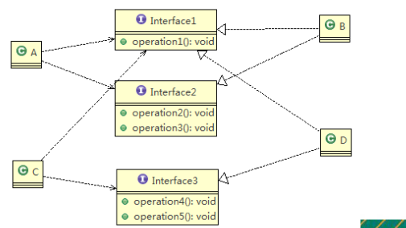
4. 代码实现
    ```java
    package com.atguigu.principle.segregation.improve;
    public class Segregation1 {
        public static void main(String[] args) {
            // 使用一把
            A a = new A();
            a.depend1(new B()); // A类通过接口去依赖B类
            a.depend2(new B());
            a.depend3(new B());
            C c = new C();
            c.depend1(new D()); // C类通过接口去依赖(使用)D类
            c.depend4(new D());
            c.depend5(new D());
        }
    }
    interface Interface1 {// 接口1
        void operation1();
    }
    interface Interface2 {// 接口2
        void operation2();
        void operation3();
    }
    interface Interface3 {// 接口3
        void operation4();
        void operation5();
    }
    class B implements Interface1, Interface2 {
        public void operation1() {
            System.out.println("B 实现了 operation1");
        }
        public void operation2() {
            System.out.println("B 实现了 operation2");
        }
        public void operation3() {
            System.out.println("B 实现了 operation3");
        }
    }
    class D implements Interface1, Interface3 {
        public void operation1() {
            System.out.println("D 实现了 operation1");
        }
        public void operation4() {
            System.out.println("D 实现了 operation4");
        }
        public void operation5() {
            System.out.println("D 实现了 operation5");
        }
    }
    class A { // A 类通过接口Interface1,Interface2 依赖(使用) B类，但是只会用到1,2,3方法
        public void depend1(Interface1 i) {
            i.operation1();
        }
        public void depend2(Interface2 i) {
            i.operation2();
        }
        public void depend3(Interface2 i) {
            i.operation3();
        }
    }
    class C { // C 类通过接口Interface1,Interface3 依赖(使用) D类，但是只会用到1,4,5方法
        public void depend1(Interface1 i) {
            i.operation1();
        }
        public void depend4(Interface3 i) {
            i.operation4();
        }
        public void depend5(Interface3 i) {
            i.operation5();
        }
    }
    ```

## 2.5 依赖倒转原则

### 2.5.1 基本介绍
依赖倒转原则(Dependence Inversion Principle)是指：
1. 高层模块不应该依赖低层模块，二者都应该依赖其抽象
2. **抽象不应该依赖细节，细节应该依赖抽象**
3. 依赖倒转(倒置)的中心思想是**面向接口编程**
4. 依赖倒转原则是基于这样的设计理念：相对于细节的多变性，抽象的东西要稳定的多。以抽象为基础搭建的架构比以细节为基础的架构要稳定的多。在java中，抽象指的是接口或抽象类，细节就是具体的实现类
5. 使用**接口或抽象类**的目的是制定好**规范**，而不涉及任何具体的操作，把**展现细节的任务交给他们的实现类**去完成

### 2.5.2 应用实例
1. 实现方式1
    ```java
    package com.atguigu.principle.inversion;
    public class DependecyInversion {
        public static void main(String[] args) {
            Person person = new Person();
            person.receive(new Email());
        }
    }
    class Email {
        public String getInfo() {
            return "电子邮件信息: hello,world";
        }
    }
    //完成Person接收消息的功能
    //方式1分析
    //1. 简单，比较容易想到
    //2. 如果我们获取的对象是 微信，短信等等，则新增类，同时Perons也要增加相应的接收方法
    //3. 解决思路：引入一个抽象的接口IReceiver，表示接收者，这样Person类与接口IReceiver发生依赖
    //   因为Email，WeiXin 等等属于接收的范围，他们各自实现IReceiver 接口就ok，这样我们就符号依赖倒转原则
    class Person {
        public void receive(Email email ) {
            System.out.println(email.getInfo());
        }
    }
    ```
2. 实现方案2(依赖倒转)
    ```java
    package com.atguigu.principle.inversion.improve;
    public class DependecyInversion {
        public static void main(String[] args) {
            //客户端无需改变
            Person person = new Person();
            person.receive(new Email());
            person.receive(new WeiXin());
        }
    }
    interface IReceiver {//定义接口
        public String getInfo();
    }
    class Email implements IReceiver {
        public String getInfo() {
            return "电子邮件信息: hello,world";
        }
    }
    class WeiXin implements IReceiver {//增加微信
        public String getInfo() {
            return "微信信息: hello,ok";
        }
    }
    class Person {//方式2
        //这里我们是对接口的依赖
        public void receive(IReceiver receiver ) {
            System.out.println(receiver.getInfo());
        }
    }
    ```

### 2.5.3 依赖关系传递的三种方式和应用案例
```java
public class DependencyPass {
    public static void main(String[] args) {
        ChangHong changHong = new ChangHong();
        OpenAndClose openAndClose = new OpenAndClose();
        openAndClose.open(changHong);
        //通过构造器进行依赖传递
        OpenAndClose openAndClose = new OpenAndClose(changHong);
        openAndClose.open();
        //通过setter方法进行依赖传递
        OpenAndClose openAndClose = new OpenAndClose();
        openAndClose.setTv(changHong);
        openAndClose.open();
    }
}

// 方式1：通过接口传递实现依赖
// 开关的接口
interface IOpenAndClose {
    public void open(ITV tv); // 抽象方法，接收接口
}
interface ITV { // ITV接口
    public void play();
}
class ChangHong implements ITV {
    @Override
    public void play() {
        System.out.println("长虹电视机，打开");
    }
}
// 实现接口
class OpenAndClose implements IOpenAndClose {
    public void open(ITV tv) {
        tv.play();
    }
}

// 方式2：通过构造方法依赖传递
interface IOpenAndClose {
    public void open(); // 抽象方法
}
interface ITV { // ITV接口
    public void play();
}
class OpenAndClose implements IOpenAndClose {
    public ITV tv; // 成员
    public OpenAndClose(ITV tv) { // 构造器
        this.tv = tv;
    }
    public void open() {
        this.tv.play();
    }
}

// 方式3：通过setter方法传递
interface IOpenAndClose {
    public void open(); // 抽象方法
    public void setTv(ITV tv);
}
interface ITV { // ITV接口
    public void play();
}
class OpenAndClose implements IOpenAndClose {
    private ITV tv;
    public void setTv(ITV tv) {
        this.tv = tv;
    }
    public void open() {
        this.tv.play();
    }
}
class ChangHong implements ITV {
    @Override
    public void play() {
        System.out.println("长虹电视机，打开");
    }
}
```

### 2.5.4 依赖倒转原则的注意事项和细节
1. 低层模块尽量都要有抽象类或接口，或者两者都有，程序稳定性更好
2. 变量的**声明类型尽量是抽象类或接口**，这样我们的变量引用和实际对象间，就存在一个**缓冲层**，利于程序扩展和优化
3. 继承时遵循**里氏替换**原则

## 2.6 里氏替换原则

### 2.6.1 OO中的继承性的思考和说明
1. 继承包含这样一层含义：父类中凡是已经实现好的方法，实际上是在设定规范和契约，虽然它不强制要求所有的子类必须遵循这些契约，但是如果子类对这些已经实现的方法任意修改，就会对整个继承体系造成破坏。
2. **继承在给程序设计带来便利的同时，也带来了弊端**。比如使用继承会给程序带来**侵入性**，程序的可移植性降低，增加对象间的耦合性，如果一个类被其他的类所继承，则当这个类需要修改时，必须考虑到所有的子类，并且父类修改后，所有涉及到子类的功能都有可能产生故障
3. 问题提出：**在编程中，如何正确的使用继承**? => **里氏替换**原则

### 2.6.2 基本介绍
1. 里氏替换原则(Liskov Substitution Principle)在 1988 年，由麻省理工学院的以为姓里的女士提出的。
2. 如果对每个类型为 T1 的对象 o1，都有类型为 T2 的对象 o2，使得以 T1 定义的所有程序 P 在所有的对象 o1 都代换成 o2 时，程序 P 的行为没有发生变化，那么类型 T2 是类型 T1 的子类型。**换句话说，所有引用基类的地方必须能透明地使用其子类的对象。**
3. 在使用继承时，遵循里氏替换原则，在**子类中尽量不要重写父类的方法**
4. 里氏替换原则告诉我们，继承实际上让两个类耦合性增强了，在适当的情况下，可以通过**聚合，组合，依赖来解决问题**。

### 2.6.3 一个程序引出的问题和思考
```java
package com.atguigu.principle.liskov;
public class Liskov {
	public static void main(String[] args) {
		A a = new A();
		System.out.println("11-3=" + a.func1(11, 3));
		System.out.println("1-8=" + a.func1(1, 8));
		System.out.println("-----------------------");
		B b = new B();
		System.out.println("11-3=" + b.func1(11, 3));//这里本意是求出11-3
		System.out.println("1-8=" + b.func1(1, 8));// 1-8
		System.out.println("11+3+9=" + b.func2(11, 3));
	}
}
class A {
	public int func1(int num1, int num2) {
		return num1 - num2;// 返回两个数的差
	}
}
// B类继承了A
// 增加了一个新功能：完成两个数相加，然后和9求和
class B extends A {
	//这里，重写了A类的方法，可能是无意识
	public int func1(int a, int b) {
		return a + b;
	}
	public int func2(int a, int b) {
		return func1(a, b) + 9;
	}
}
```

### 2.6.4 解决方法
1. 我们发现原来运行正常的相减功能发生了错误。原因就是类B无意中重写了父类的方法，造成原有功能出现错误。在实际编程中，我们常常会通过重写父类的方法完成新的功能，这样写起来虽然简单，但整个继承体系的复用性会比较差。特别是运行多态比较频繁的时候
2. 通用的做法是：原来的父类和子类都继承一个更通俗的基类，原有的继承关系去掉，采用依赖，聚合，组合等关系代替
3. 代码实现
    ```java
    package com.atguigu.principle.liskov.improve;
    public class Liskov {
        public static void main(String[] args) {
            A a = new A();
            System.out.println("11-3=" + a.func1(11, 3));
            System.out.println("1-8=" + a.func1(1, 8));
            System.out.println("-----------------------");
            B b = new B();
            //因为B类不再继承A类，因此调用者，不会再func1是求减法
            //调用完成的功能就会很明确
            System.out.println("11+3=" + b.func1(11, 3));//这里本意是求出11+3
            System.out.println("1+8=" + b.func1(1, 8));// 1+8
            System.out.println("11+3+9=" + b.func2(11, 3));
            //使用组合仍然可以使用到A类相关方法
            System.out.println("11-3=" + b.func3(11, 3));// 这里本意是求出11-3
        }
    }
    //创建一个更加基础的基类
    class Base {
        //把更加基础的方法和成员写到Base类
    }
    class A extends Base {
        public int func1(int num1, int num2) {
            return num1 - num2;// 返回两个数的差
        }
    }
    // B类继承了A
    // 增加了一个新功能：完成两个数相加，然后和9求和
    class B extends Base {
        //如果B需要使用A类的方法，使用 组合 关系
        private A a = new A();
        //这里，重写了A类的方法，可能是无意识
        public int func1(int a, int b) {
            return a + b;
        }
        public int func2(int a, int b) {
            return func1(a, b) + 9;
        }
        //我们仍然想使用A的方法
        public int func3(int a, int b) {
            return this.a.func1(a, b);
        }
    }
    ```

## 2.7 开闭原则

### 2.7.1 基本介绍
1. 开闭原则（Open Closed Principle）是编程中**最基础、最重要**的设计原则
2. 一个软件实体如类，模块和函数应该对**扩展开放**(对提供方)，对**修改关闭**(对使用方)。用抽象构建框架，用实现扩展细节。
3. 当软件需要变化时，尽量**通过扩展软件**实体的行为来实现变化，而不是**通过修改**已有的代码来实现变化。
4. 编程中遵循其它原则，以及使用设计模式的目的就是遵循**开闭原则**。

### 2.7.2 看下面一段代码
```java
package com.atguigu.principle.ocp;
public class Ocp {
	public static void main(String[] args) {
		//使用看看存在的问题
		GraphicEditor graphicEditor = new GraphicEditor();
		graphicEditor.drawShape(new Rectangle());
		graphicEditor.drawShape(new Circle());
		graphicEditor.drawShape(new Triangle());
	}
}
//这是一个用于绘图的类 [使用方]
class GraphicEditor {
	//接收Shape对象，然后根据type，来绘制不同的图形
	public void drawShape(Shape s) {
		if (s.m_type == 1)
			drawRectangle(s);
		else if (s.m_type == 2)
			drawCircle(s);
		else if (s.m_type == 3)
			drawTriangle(s);
	}
	public void drawRectangle(Shape r) {
		System.out.println(" 绘制矩形 ");
	}
	public void drawCircle(Shape r) {
		System.out.println(" 绘制圆形 ");
	}
	public void drawTriangle(Shape r) {
		System.out.println(" 绘制三角形 ");
	}
}
class Shape {//Shape类，基类
	int m_type;
}
class Rectangle extends Shape {
	Rectangle() {
		super.m_type = 1;
	}
}
class Circle extends Shape {
	Circle() {
		super.m_type = 2;
	}
}
//新增画三角形
class Triangle extends Shape {
	Triangle() {
		super.m_type = 3;
	}
}
```

### 2.7.3 方式1的优缺点
1. 优点是比较好理解，简单易操作。
2. 缺点是违反了设计模式的 ocp 原则，即对扩展开放(提供方)，对修改关闭(使用方)。即当我们给类增加新功能的时候，尽量不修改代码，或者尽可能少修改代码
3. 比如我们这时要新增加一个图形种类三角形，我们需要做如下修改，修改的地方较多

### 2.7.4 改进的思路分析
思路：把创建 Shape 类做成抽象类，并提供一个抽象的 draw 方法，让子类去实现即可，这样我们有新的图形种类时，只需要让新的图形类继承 Shape，并实现 draw 方法即可，使用方的代码就不需要修 -> 满足了开闭原则

```java
package com.atguigu.principle.ocp.improve;
public class Ocp {
	public static void main(String[] args) {
		// 使用看看存在的问题
		GraphicEditor graphicEditor = new GraphicEditor();
		graphicEditor.drawShape(new Rectangle());
		graphicEditor.drawShape(new Circle());
		graphicEditor.drawShape(new Triangle());
		graphicEditor.drawShape(new OtherGraphic());
	}
}
// 这是一个用于绘图的类 [使用方]
class GraphicEditor {
	// 接收Shape对象，调用draw方法
	public void drawShape(Shape s) {
		s.draw();
	}
}
abstract class Shape {// Shape类，基类
	int m_type;
	public abstract void draw();// 抽象方法
}
class Rectangle extends Shape {
	Rectangle() {
		super.m_type = 1;
	}
	@Override
	public void draw() {
		System.out.println(" 绘制矩形 ");
	}
}
class Circle extends Shape {
	Circle() {
		super.m_type = 2;
	}
	@Override
	public void draw() {
		System.out.println(" 绘制圆形 ");
	}
}
// 新增画三角形
class Triangle extends Shape {
	Triangle() {
		super.m_type = 3;
	}
	@Override
	public void draw() {
		System.out.println(" 绘制三角形 ");
	}
}
// 新增一个图形
class OtherGraphic extends Shape {
	OtherGraphic() {
		super.m_type = 4;
	}
	@Override
	public void draw() {
		System.out.println(" 绘制其它图形 ");
	}
}
```

## 2.8 迪米特法则

### 2.8.1 基本介绍
1. 一个对象应该对其他对象保持最少的了解
2. 类与类关系越密切，耦合度越大
3. 迪米特法则(Demeter Principle)又叫**最少知道原则**，即一个类**对自己依赖的类知道的越少越好**。也就是说，对于被依赖的类不管多么复杂，都尽量将逻辑封装在类的内部。对外除了提供的 public 方法，不对外泄露任何信息
4. 迪米特法则还有个更简单的定义：只与直接的朋友通信
5. **直接的朋友**：每个对象都会与其他对象有**耦合关系**，只要两个对象之间有耦合关系，我们就说这两个对象之间是朋友关系。耦合的方式很多，依赖，关联，组合，聚合等。其中，我们称出现**成员变量，方法参数，方法返回值**中的类为直接的朋友，而出现在**局部变量中的类不是直接的朋友**。也就是说，陌生的类最好不要以局部变量的形式出现在类的内部

### 2.8.2 应用实例
有一个学校，下属有各个学院和总部，现要求打印出学校总部员工 ID 和学院员工的 id
```java
package com.atguigu.principle.demeter;
import java.util.ArrayList;
import java.util.List;

public class Demeter1 {//客户端
	public static void main(String[] args) {
		//创建了一个 SchoolManager 对象
		SchoolManager schoolManager = new SchoolManager();
		//输出学院的员工id 和  学校总部的员工信息
		schoolManager.printAllEmployee(new CollegeManager());
	}
}
class Employee {//学校总部员工类
	private String id;
	public void setId(String id) {
		this.id = id;
	}
	public String getId() {
		return id;
	}
}
class CollegeEmployee {//学院的员工类
	private String id;
	public void setId(String id) {
		this.id = id;
	}
	public String getId() {
		return id;
	}
}
//管理学院员工的管理类
class CollegeManager {
	//返回学院的所有员工
	public List<CollegeEmployee> getAllEmployee() {
		List<CollegeEmployee> list = new ArrayList<CollegeEmployee>();
		for (int i = 0; i < 10; i++) { //这里我们增加了10个员工到 list
			CollegeEmployee emp = new CollegeEmployee();
			emp.setId("学院员工id= " + i);
			list.add(emp);
		}
		return list;
	}
}
//学校管理类
//分析 SchoolManager 类的直接朋友类有哪些 Employee、CollegeManager
//CollegeEmployee 不是 直接朋友 而是一个陌生类，这样违背了 迪米特法则 
class SchoolManager {
	//返回学校总部的员工
	public List<Employee> getAllEmployee() {
		List<Employee> list = new ArrayList<Employee>();
		for (int i = 0; i < 5; i++) { //这里我们增加了5个员工到 list
			Employee emp = new Employee();
			emp.setId("学校总部员工id= " + i);
			list.add(emp);
		}
		return list;
	}
	//该方法完成输出学校总部和学院员工信息(id)
	void printAllEmployee(CollegeManager sub) {
		//分析问题
		//1. 这里的 CollegeEmployee 不是  SchoolManager的直接朋友
		//2. CollegeEmployee 是以局部变量方式出现在 SchoolManager
		//3. 违反了 迪米特法则 
		//获取到学院员工
		List<CollegeEmployee> list1 = sub.getAllEmployee();
		System.out.println("------------学院员工------------");
		for (CollegeEmployee e : list1) {
			System.out.println(e.getId());
		}
		//获取到学校总部员工
		List<Employee> list2 = this.getAllEmployee();
		System.out.println("------------学校总部员工------------");
		for (Employee e : list2) {
			System.out.println(e.getId());
		}
	}
}
```

### 2.8.3 应用实例改进
1. 前面设计的问题在于 SchoolManager 中，CollegeEmployee 类并不是 SchoolManager 类的直接朋友 (分析)
2. 按照迪米特法则，应该避免类中出现这样非直接朋友关系的耦合
3. 对代码按照迪米特法则 进行改进
4. 代码演示
    ```java
    package com.atguigu.principle.demeter.improve;
    import java.util.ArrayList;
    import java.util.List;

    public class Demeter1 {//客户端
        public static void main(String[] args) {
            System.out.println("~~~使用迪米特法则的改进~~~");
            //创建了一个 SchoolManager 对象
            SchoolManager schoolManager = new SchoolManager();
            //输出学院的员工id 和  学校总部的员工信息
            schoolManager.printAllEmployee(new CollegeManager());
        }
    }
    class Employee {//学校总部员工类
        private String id;
        public void setId(String id) {
            this.id = id;
        }
        public String getId() {
            return id;
        }
    }
    class CollegeEmployee {//学院的员工类
        private String id;
        public void setId(String id) {
            this.id = id;
        }
        public String getId() {
            return id;
        }
    }
    //管理学院员工的管理类
    class CollegeManager {
        //返回学院的所有员工
        public List<CollegeEmployee> getAllEmployee() {
            List<CollegeEmployee> list = new ArrayList<CollegeEmployee>();
            for (int i = 0; i < 10; i++) { //这里我们增加了10个员工到 list
                CollegeEmployee emp = new CollegeEmployee();
                emp.setId("学院员工id= " + i);
                list.add(emp);
            }
            return list;
        }
        //输出学院员工的信息
        public void printEmployee() {
            //获取到学院员工
            List<CollegeEmployee> list1 = getAllEmployee();
            System.out.println("------------学院员工------------");
            for (CollegeEmployee e : list1) {
                System.out.println(e.getId());
            }
        }
    }
    //学校管理类
    //分析 SchoolManager 类的直接朋友类有哪些 Employee、CollegeManager
    //CollegeEmployee 不是 直接朋友 而是一个陌生类，这样违背了 迪米特法则 
    class SchoolManager {
        //返回学校总部的员工
        public List<Employee> getAllEmployee() {
            List<Employee> list = new ArrayList<Employee>();
            for (int i = 0; i < 5; i++) { //这里我们增加了5个员工到 list
                Employee emp = new Employee();
                emp.setId("学校总部员工id= " + i);
                list.add(emp);
            }
            return list;
        }
        //该方法完成输出学校总部和学院员工信息(id)
        void printAllEmployee(CollegeManager sub) {
            //分析问题
            //1. 将输出学院的员工方法，封装到CollegeManager
            sub.printEmployee();
            //获取到学校总部员工
            List<Employee> list2 = this.getAllEmployee();
            System.out.println("------------学校总部员工------------");
            for (Employee e : list2) {
                System.out.println(e.getId());
            }
        }
    }
    ```

### 2.8.4 迪米特法则注意事项和细节
1. 迪米特法则的核心是**降低类之间的耦合**
2. 但是注意：由于每个类都减少了不必要的依赖，因此迪米特法则只是要求降低类间(对象间)耦合关系，并不是要求完全没有依赖关系

## 2.9 合成复用原则（Composite Reuse Principle）

### 2.9.1 基本介绍
原则是尽量使用合成/聚合的方式，而不是使用继承

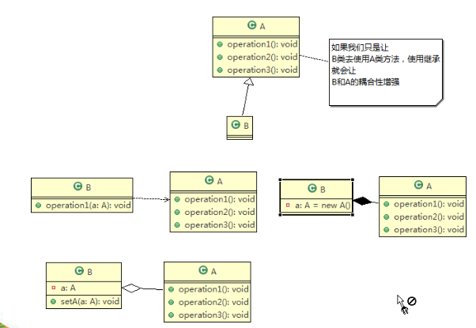

## 2.10 设计原则核心思想
1. 找出应用中可能需要变化之处，把它们独立出来，不要和那些不需要变化的代码混在一起。
2. 针对接口编程，而不是针对实现编程。
3. 为了交互对象之间的松耦合设计而努力


# 第3章 UML 类图

## 3.1 UML 基本介绍
1. UML——Unified modeling language UML(统一建模语言)，是一种用于软件系统分析和设计的语言工具，它用于帮助软件开发人员进行思考和记录思路的结果
2. UML本身是一套符号的规定，就像数学符号和化学符号一样，这些符号用于描述软件模型中的各个元素和他们之间的关系，比如类、接口、实现、泛化、依赖、组合、聚合等，如右图:
    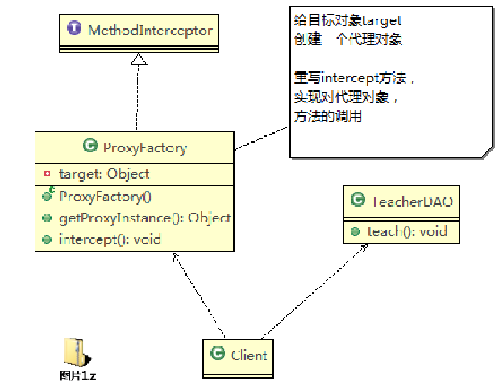
3. 使用UML来建模，常用的工具有 RationalRose , 也可以使用一些插件来建模
    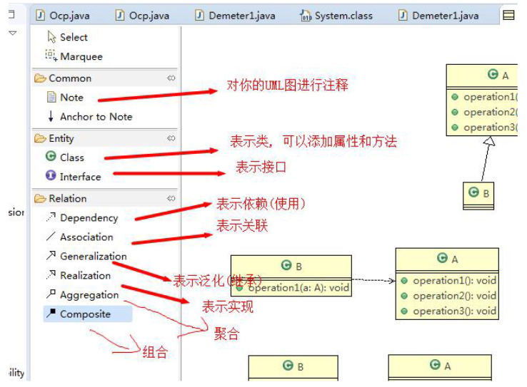

## 3.2 UML 图
画 UML 图与写文章差不多，都是把自己的思想描述给别人看，关键在于思路和条理，UML 图分类：
1. 用例图(use case)
2. 静态结构图：**类图**、对象图、包图、组件图、部署图
3. 动态行为图：交互图（时序图与协作图）、状态图、活动图

说明：
1. 类图是描述类与类之间的关系的，是 UML 图中最核心的
2. 在讲解设计模式时，我们必然会使用类图，为了让学员们能够把设计模式学到位，需要先给大家讲解类图
3. 温馨提示：如果已经掌握 UML 类图的学员，可以直接听设计模式的章节

## 3.3 UML 类图
1. 用于描述系统中的类(对象)本身的组成和类(对象)之间的各种静态关系。
2. 类之间的关系：依赖、泛化（继承）、实现、关联、聚合与组合。

## 3.4 类图—依赖关系（Dependence）
只要是在类中用到了对方，那么他们之间就存在依赖关系。如果没有对方，连编绎都通过不了。

1. 类中用到了对方
2. 如果是类的成员属性
3. 如果是方法的返回类型
4. 是方法接收的参数类型
5. 方法中使用到

## 3.5 类图—泛化关系(generalization）
泛化关系实际上就是继承关系，他是依赖关系的特例

1. 泛化关系实际上就是继承关系
2. 如果 A 类继承了 B 类，我们就说 A 和 B 存在泛化关系

## 3.6 类图—实现关系（Implementation）
实现关系实际上就是 A 类实现 B 接口，他是依赖关系的特例

## 3.7 类图—关联关系（Association）
- 关联关系实际上就是类与类之间的联系，他是依赖关系的特例
- 关联具有导航性：即双向关系或单向关系
- 关系具有多重性：如“1”（表示有且仅有一个），“0...”（表示0个或者多个），“0，1”（表示0个或者一个），“n...m”(表示n到 m个都可以),“m...*”（表示至少m个）。

## 3.8 类图—聚合关系（Aggregation）

### 3.8.1 基本介绍
聚合关系（Aggregation）表示的是**整体和部分**的关系，整体与部分可以分开。聚合关系是关联关系的特例，所以他具有关联的**导航性与多重性**。

如：一台电脑由键盘(keyboard)、显示器(monitor)，鼠标等组成；组成电脑的各个配件是可以从电脑上分离出来的，使用带空心菱形的实线来表示

### 3.8.2 应用实例
```java
public class Computer{
    private Mouse mouse;
    private Monitor monitor;
    public void setMouse(Mouse mouse){
        this.mouse = mouse;
    }
    public void setMonitor(Monitor monitor){
        this.monitor = monitor;
    }
}
```

## 3.9 类图—组合关系（Composition）

### 3.9.1 基本介绍
组合关系：也是整体与部分的关系，但是整体与部分不可以分开。

再看一个案例：在程序中我们定义实体：Person 与 IDCard、Head, 那么 Head 和 Person 就是组合，IDCard 和 Person 就是聚合。

但是如果在程序中 Person 实体中定义了对 IDCard 进行级联删除，即删除 Person 时连 IDCard 一起删除，那么 IDCard 和 Person 就是组合了。

### 3.9.2 应用案例
```java
public class Person{
    private IDCard card;
    private Head head = new Head();
}
public class IDCard{}
public class Head{}

public class Computer {
    private Mouse mouse = new Mouse(); //鼠标可以和 computer 不能分离
    private Moniter moniter = new Moniter();//显示器可以和 Computer 不能分离
    public void setMouse(Mouse mouse) {
        this.mouse = mouse;
    }
    public void setMoniter(Moniter moniter) {
        this.moniter = moniter;
    }
}
public class Mouse {}
public class Moniter {}
```


# 第4章 设计模式概述

## 4.1 掌握设计模式的层次
1. 第 1 层：刚开始学编程不久，听说过什么是设计模式
2. 第 2 层：有很长时间的编程经验，自己写了很多代码，其中用到了设计模式，但是自己却不知道
3. 第 3 层：学习过了设计模式，发现自己已经在使用了，并且发现了一些新的模式挺好用的
4. 第 4 层：阅读了很多别人写的源码和框架，在其中看到别人设计模式，并且能够领会设计模式的精妙和带来的好处。
5. 第 5 层：代码写着写着，自己都没有意识到使用了设计模式，并且熟练的写了出来。

## 4.2 设计模式介绍
1. 设计模式是程序员在面对同类软件工程设计问题所总结出来的有用的经验，模式不是代码，而是某类问题的通用解决方案，设计模式（Design pattern）代表了最佳的实践。这些解决方案是众多软件开发人员经过相当长的一段时间的试验和错误总结出来的。
2. 设计模式的本质提高 软件的维护性，通用性和扩展性，并降低软件的复杂度。
3. 《设计模式》 是经典的书，作者是 Erich Gamma、Richard Helm、Ralph Johnson 和 John Vlissides Design（俗称 “四人组 GOF”）
4. 设计模式并不局限于某种语言，java，php，c++ 都有设计模式

## 4.3 设计模式类型
设计模式分为三种类型，共 23 种
1. 创建型模式：**单例模式**、抽象工厂模式、原型模式、建造者模式、**工厂模式**。
2. 结构型模式：适配器模式、桥接模式、**装饰模式**、组合模式、外观模式、享元模式、**代理模式**。
3. 行为型模式：模版方法模式、命令模式、访问者模式、迭代器模式、**观察者模式**、中介者模式、备忘录模式、解释器模式（Interpreter模式）、状态模式、策略模式、职责链模式(责任链模式)。

注意：不同的书籍上对分类和名称略有差别


# 第5章 单例设计模式

## 5.1 单例设计模式介绍
所谓类的单例设计模式，就是采取一定的方法保证在整个的软件系统中，对某个类只能存在一个对象实例，并且该类只提供一个取得其对象实例的方法(静态方法)。

比如 Hibernate 的 SessionFactory，它充当数据存储源的代理，并负责创建 Session 对象。SessionFactory 并不是轻量级的，一般情况下，一个项目通常只需要一个 SessionFactory 就够，这是就会使用到单例模式。

## 5.2 单例设计模式八种方式
1. **饿汉式(静态常量)**
2. **饿汉式（静态代码块）**
3. 懒汉式(线程不安全)
4. 懒汉式(线程安全，同步方法)
5. 懒汉式(线程安全，同步代码块)
6. **双重检查**
7. **静态内部类**
8. **枚举**

## 5.3 饿汉式☆（静态常量）
1. 构造器私有化 (防止 new )
2. 类的内部创建对象
3. 向外暴露一个静态的公共方法。getInstance
4. 代码实现
    ```java
    package com.atguigu.singleton.type1;
    // 饿汉式(静态变量)
    class Singleton {
        // 1. 构造器私有化, 外部能new
        private Singleton() {}
        // 2.本类内部创建对象实例
        private final static Singleton instance = new Singleton();
        // 3. 提供一个公有的静态方法，返回实例对象
        public static Singleton getInstance() {
            return instance;
        }
    }
    ```

优缺点说明：
1. 优点：这种写法比较简单，就是在类装载的时候就完成实例化。避免了线程同步问题。
2. 缺点：在类装载的时候就完成实例化，没有达到 Lazy Loading 的效果。如果从始至终从未使用过这个实例，则会造成内存的浪费
3. 这种方式基于 classloder 机制避免了多线程的同步问题，不过，instance 在类装载时就实例化，在单例模式中大多数都是调用 getInstance 方法，但是导致类装载的原因有很多种，因此不能确定有其他的方式（或者其他的静态方法）导致类装载，这时候初始化 instance 就没有达到 lazy loading 的效果
4. 结论：这种单例模式**可用**，**可能**造成内存浪费

## 5.4 饿汉式（静态代码块）
```java
package com.atguigu.singleton.type2;
//饿汉式(静态变量)
class Singleton {
	//1. 构造器私有化, 外部能new
	private Singleton() {}
	//2.本类内部创建对象实例
	private  static Singleton instance;
	static { // 在静态代码块中，创建单例对象
		instance = new Singleton();
	}
	//3. 提供一个公有的静态方法，返回实例对象
	public static Singleton getInstance() {
		return instance;
	}
}
```

优缺点说明：
1. 这种方式和上面的方式其实类似，只不过将类实例化的过程放在了静态代码块中，也是在类装载的时候，就执行静态代码块中的代码，初始化类的实例。优缺点和上面是一样的。
2. 结论：这种单例模式**可用**，但是**可能**造成内存浪费

## 5.5 懒汉式(线程不安全)
```java
package com.atguigu.singleton.type3;
class Singleton {
	private static Singleton instance;
	private Singleton() {}
	// 提供一个静态的公有方法，当使用到该方法时，才去创建 instance
	// 即懒汉式
	public static Singleton getInstance() {
		if (instance == null) {
			instance = new Singleton();
		}
		return instance;
	}
}
```

优缺点说明：
1. 起到了 **Lazy Loading** 的效果，但是只能在单线程下使用。
2. 如果在多线程下，一个线程进入了 if (singleton == null)判断语句块，还未来得及往下执行，另一个线程也通过了这个判断语句，这时便会**产生多个实例**。所以在多线程环境下不可使用这种方式
3. 结论：在实际开发中，**不要使用**这种方式

## 5.6 懒汉式(线程安全，同步方法)
```java
package com.atguigu.singleton.type4;
// 懒汉式(线程安全，同步方法)
class Singleton {
	private static Singleton instance;
	private Singleton() {}
	// 提供一个静态的公有方法，加入同步处理的代码，解决线程安全问题
	// 即懒汉式
	public static synchronized Singleton getInstance() {
		if (instance == null) {
			instance = new Singleton();
		}
		return instance;
	}
}
```

优缺点说明：
1. 解决了**线程安全**问题
2. 效率太低了，每个线程在想获得类的实例时候，执行 getInstance()方法都要进行同步。而其实这个方法只执行一次实例化代码就够了，后面的想获得该类实例，直接 return 就行了。**方法进行同步效率太低**
3. 结论：在实际开发中，**不推荐**使用这种方式

## 5.7 懒汉式(线程安全，同步代码块)
```java
package com.atguigu.singleton.type5;
class Singleton {
    private static Singleton instance;
    private Singleton() {}
    public static Singleton getInstance() {
        if (instance == null) {
            synchronized (Singleton.class) {
                instance = new Singleton();
            }
        }
        return instance;
    }
}
```

优缺点说明：
1. 这种方式，本意是想对第四种实现方式的改进，因为前面同步方法效率太低，改为同步产生实例化的的代码块
2. 但是这种同步并**不能起到线程同步**的作用。跟第3种实现方式遇到的情形一致，假如一个线程进入了if (singleton == null)判断语句块，还未来得及往下执行，另一个线程也通过了这个判断语句，这时便会产生多个实例
3. 结论：在实际开发中，**不能使用**这种方式

## 5.8 双重检查★
```java
// 懒汉式(线程安全，同步方法)
package com.atguigu.singleton.type6;
class Singleton {
	private static volatile Singleton instance;
	private Singleton() {}
	// 提供一个静态的公有方法，加入双重检查代码，解决线程安全问题，同时解决懒加载问题
	// 同时保证了效率，推荐使用
	public static Singleton getInstance() {
		if (instance == null) {
			synchronized (Singleton.class) {
				if (instance == null) {
					instance = new Singleton();
				}
			}
		}
		return instance;
	}
}
```

优缺点说明：
1. Double-Check 概念是多线程开发中常使用到的，如代码中所示，我们进行了两次 if (singleton == null)检查，这样就可以保证线程安全了。
2. 这样，实例化代码只用执行一次，后面再次访问时，判断 if (singleton == null)，直接 return 实例化对象，也避免的反复进行方法同步
3. **线程安全；延迟加载；效率较高**
4. 结论：在实际开发中，**推荐使用**这种单例设计模式

## 5.9 静态内部类★
```java
package com.atguigu.singleton.type7;
// 静态内部类完成， 推荐使用
class Singleton {
	// 构造器私有化
	private Singleton() {}
	// 写一个静态内部类，该类中有一个静态属性 Singleton
	private static class SingletonInstance {
		private static final Singleton INSTANCE = new Singleton();
	}
	// 提供一个静态的公有方法，直接返回SingletonInstance.INSTANCE
	public static Singleton getInstance() {
		return SingletonInstance.INSTANCE;
	}
}
```

优缺点说明：
1. 这种方式采用了类装载的机制来保证初始化实例时只有一个线程。
2. 静态内部类方式在 Singleton 类被装载时并不会立即实例化，而是在需要实例化时，调用 getInstance 方法，才会装载 SingletonInstance 类，从而完成 Singleton 的实例化。
3. 类的静态属性只会在第一次加载类的时候初始化，所以在这里，JVM 帮助我们保证了线程的安全性，在类进行初始化时，别的线程是无法进入的。
4. 优点：**避免了线程不安全**，利用**静态内部类特点实现延迟加载**，**效率高**
5. 结论：**推荐**使用

## 5.10 枚举★
```java
package com.atguigu.singleton.type8;
//使用枚举，可以实现单例，推荐
enum Singleton {
	INSTANCE; //属性
	public void sayOK() {
		System.out.println("ok~");
	}
}
```

优缺点说明：
1. 这借助 JDK1.5 中添加的枚举来实现单例模式。不仅能避免多线程同步问题，而且还能防止反序列化重新创建新的对象。
2. 这种方式是 Effective Java 作者 Josh Bloch 提倡的方式
3. 结论：推荐使用

## 5.11 单例模式在 JDK 应用的源码分析
1. 我们 JDK 中，java.lang.Runtime 就是经典的单例模式(饿汉式)
2. 代码分析 + Debug源码 + 代码说明
    ```java
    package java.lang;
    public class Runtime {
        private static final Runtime currentRuntime = new Runtime();
        private static Version version;
        /**
         * Returns the runtime object associated with the current Java application.
         * Most of the methods of class {@code Runtime} are instance
         * methods and must be invoked with respect to the current runtime object.
         * @return  the {@code Runtime} object associated with the current
         *          Java application.
         */
        public static Runtime getRuntime() {
            return currentRuntime;
        }
        /** Don't let anyone else instantiate this class */
        private Runtime() {}
        // ...
    }
    ```

## 5.12 单例模式注意事项和细节说明
1. 单例模式保证了 系统内存中该类只存在一个对象，节省了系统资源，对于一些需要频繁创建销毁的对象，使用单例模式可以提高系统性能
2. 当想实例化一个单例类的时候，必须要记住使用相应的获取对象的方法，而不是使用 new
3. 单例模式**使用的场景**：需要**频繁的进行创建和销毁的对象**、创建对象时耗时过多或耗费资源过多(即：**重量级对象**)，但又经常用到的对象、**工具类对象**、频繁访问数据库或文件的对象(比如**数据源**、**session 工厂**等)

# 第6章 工厂模式

## 6.1 简单工厂模式

### 6.1.1 看一个具体的需求
看一个披萨的项目：要便于披萨种类的扩展，要便于维护
1. 披萨的种类很多(比如 GreekPizz、CheesePizz 等)
2. 披萨的制作有 prepare，bake，cut，box
3. 完成披萨店订购功能。

### 6.1.2 使用传统的方式来完成
1. 思路分析(类图)
    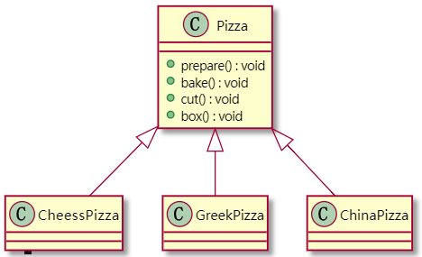
2. 代码演示
    ```java
    package com.atguigu.factory.simplefactory.pizzastore.pizza;
    //将 Pizza 类做成抽象
    public abstract class Pizza {
        protected String name; //名字
        //准备原材料，不同的披萨不一样，因此，我们做成抽象方法
        public abstract void prepare();
        public void bake() {}
        public void cut() {}
        public void box() {}//打包
        public void setName(String name) {
            this.name = name;
        }
    }
    public class CheesePizza extends Pizza {
	    @Override
	    public void prepare() {
		    System.out.println("准备原材料：奶酪披萨");
	    }
    }
    public class GreekPizza extends Pizza {
	    @Override
	    public void prepare() {
		    System.out.println("准备原材料：希腊披萨");
	    }
    }

    package com.atguigu.factory.simplefactory.pizzastore.order;
    public class OrderPizza {
        // 构造器
        public OrderPizza() {
            Pizza pizza = null;
            String orderType; // 订购披萨的类型
            do {
                orderType = getType();
                if (orderType.equals("greek")) {
                    pizza = new GreekPizza();
                    pizza.setName("希腊披萨");
                } else if (orderType.equals("cheese")) {
                    pizza = new CheesePizza();
                    pizza.setName("奶酪披萨");
                } else {
                    break;
                }
                //输出pizza 制作过程
                pizza.prepare();
                pizza.bake();
                pizza.cut();
                pizza.box();
            } while (true);
        }
        // 写一个方法，可以获取客户希望订购的披萨种类
        private String getType() {
            try {
                BufferedReader strin = new BufferedReader(new InputStreamReader(System.in));
                System.out.println("input pizza 种类:");
                String str = strin.readLine();
                return str;
            } catch (IOException e) {
                return "";
            }
        }
    }
    // 相当于一个客户端，发出订购
    public class PizzaStore {
        public static void main(String[] args) {
            new OrderPizza();
        }
    }
    ```

### 6.1.3 传统的方式的优缺点
1. 优点是比较好理解，简单易操作。
2. 缺点是违反了设计模式的 **ocp** 原则，即对扩展开放，对修改关闭。即当我们给类增加新功能的时候，尽量不修改代码，或者尽可能少修改代码
3. 比如我们这时要新增加一个 Pizza 的种类(Pepper 披萨)，我们需要做如下修改
    ```java
    package com.atguigu.factory.simplefactory.pizzastore.pizza;
    public class PepperPizza extends Pizza {
        @Override
        public void prepare() {
            System.out.println("准备原材料：胡椒披萨");
        }
    }
    // com.atguigu.factory.simplefactory.pizzastore.order.OrderPizza
    if (orderType.equals("greek")) {
        pizza = new GreekPizza();
        pizza.setName("希腊披萨");
    } else if (orderType.equals("cheese")) {
        pizza = new CheesePizza();
        pizza.setName("奶酪披萨");
    } else if (orderType.equals("pepper")) { // 新增分支
        pizza = new PepperPizza();
        pizza.setName("胡椒披萨"); 
    } else {
        break;
    }
    ```
4. 改进的思路分析
分析：修改代码可以接受，但是如果我们在其它的地方也有创建 Pizza 的代码，就意味着，也需要修改，而创建 Pizza 的代码，往往有多处。

思路：把创建 Pizza 对象封装到一个类中，这样我们有新的 Pizza 种类时，只需要修改该类就可，其它有创建到 Pizza 对象的代码就不需要修改了 -> 简单工厂模式

### 6.1.4 基本介绍
1. 简单工厂模式是属于**创建型模式**，是工厂模式的一种。**简单工厂模式是由一个工厂对象决定创建出哪一种产品类的实例**。简单工厂模式是工厂模式家族中最简单实用的模式
2. 简单工厂模式：定义了一个创建对象的类，由这个类来**封装实例化对象的行为**(代码)
3. 在软件开发中，当我们会用到大量的创建某种、某类或者某批对象时，就会使用到工厂模式

### 6.1.5 使用简单工厂模式
简单工厂模式的设计方案: 定义一个可以实例化 Pizaa 对象的类，封装创建对象的代码。

```java
public class SimpleFactory {
	// 简单工厂模式 也叫 静态工厂模式
	public static Pizza createPizza(String orderType) {
		Pizza pizza = null;
		System.out.println("使用简单工厂模式2");
		if (orderType.equals("greek")) {
			pizza = new GreekPizza();
			pizza.setName("希腊披萨");
		} else if (orderType.equals("cheese")) {
			pizza = new CheesePizza();
			pizza.setName("奶酪披萨");
		} else if (orderType.equals("pepper")) {
			pizza = new PepperPizza();
			pizza.setName("胡椒披萨");
		}
		return pizza;
	}
}
public class OrderPizza {
	Pizza pizza = null;
	String orderType = "";
	// 构造器
	public OrderPizza() {
		do {
			orderType = getType();
			pizza = SimpleFactory.createPizza(orderType);
			// 输出pizza
			if (pizza != null) { // 订购成功
				pizza.prepare();
				pizza.bake();
				pizza.cut();
				pizza.box();
			} else {
				System.out.println("订购披萨失败");
				break;
			}
		} while (true);
	}
	// 写一个方法，可以获取客户希望订购的披萨种类
	private String getType() {
		try {
			BufferedReader strin = new BufferedReader(new InputStreamReader(System.in));
			System.out.println("input pizza 种类:");
			String str = strin.readLine();
			return str;
		} catch (IOException e) {
			return "";
		}
	}
}
```

## 6.2 工厂方法模式

### 6.2.1 看一个新的需求
披萨项目新的需求：客户在点披萨时，可以点不同口味的披萨，比如 北京的奶酪 pizza、北京的胡椒 pizza 或者是伦敦的奶酪 pizza、伦敦的胡椒 pizza。

### 6.2.2 思路1
使用简单工厂模式，创建不同的简单工厂类，比如 BJPizzaSimpleFactory、LDPizzaSimpleFactory 等等。从当前这个案例来说，也是可以的，但是考虑到项目的规模，以及软件的可维护性、可扩展性并不是特别好。

### 6.2.3 思路2
使用工厂方法模式

### 6.2.4 工厂方法模式介绍
1. 工厂方法模式设计方案：将披萨项目的实例化功能抽象成抽象方法，在不同的口味点餐子类中具体实现。
2. 工厂方法模式：**定义了一个创建对象的抽象方法**，由**子类决定**要实例化的类。工厂方法模式将**对象的实例化推迟到子类**。

### 6.2.5 工厂方法模式应用案例
1. 披萨项目新的需求：客户在点披萨时，可以点不同口味的披萨，比如 北京的奶酪 pizza、北京的胡椒 pizza 或者是伦敦的奶酪 pizza、伦敦的胡椒 pizza
2. 思路分析
    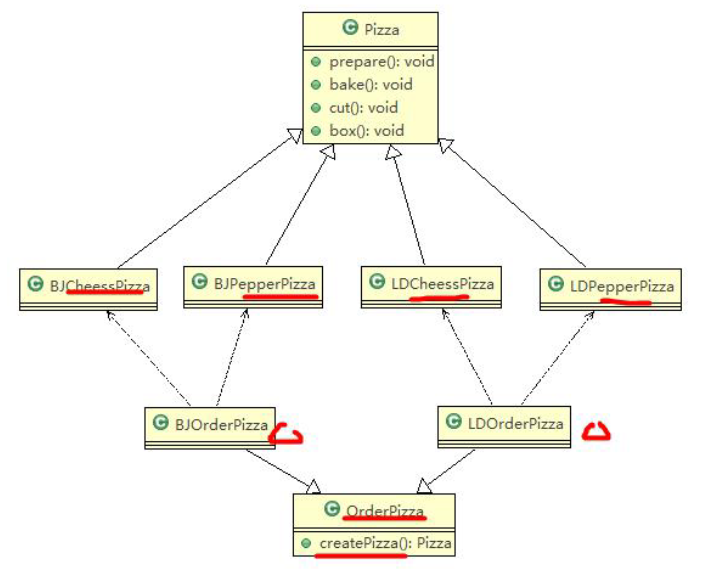
3. 代码实现
    ```java
    package com.atguigu.factory.factorymethod.pizzastore.order;
    public abstract class OrderPizza {
        // 定义一个抽象方法，createPizza , 让各个工厂子类自己实现
        abstract Pizza createPizza(String orderType);
        // 构造器
        public OrderPizza() {
            Pizza pizza = null;
            String orderType; // 订购披萨的类型
            do {
                orderType = getType();
                pizza = createPizza(orderType); // 抽象方法，由工厂子类完成
                // 输出pizza 制作过程
                pizza.prepare();
                pizza.bake();
                pizza.cut();
                pizza.box();
            } while (true);
        }
        // 写一个方法，可以获取客户希望订购的披萨种类
        private String getType() {
            try {
                BufferedReader strin = new BufferedReader(new InputStreamReader(System.in));
                System.out.println("input pizza 种类:");
                String str = strin.readLine();
                return str;
            } catch (IOException e) {
                return "";
            }
        }
    }
    public class BJOrderPizza extends OrderPizza {
        @Override
        Pizza createPizza(String orderType) {
            Pizza pizza = null;
            if (orderType.equals("cheese")) {
                pizza = new BJCheesePizza();
            } else if (orderType.equals("pepper")) {
                pizza = new BJPepperPizza();
            }
            return pizza;
        }
    }
    public class LDOrderPizza extends OrderPizza {
        @Override
        Pizza createPizza(String orderType) {
            Pizza pizza = null;
            if(orderType.equals("cheese")) {
                pizza = new LDCheesePizza();
            } else if (orderType.equals("pepper")) {
                pizza = new LDPepperPizza();
            }
            return pizza;
        }
    }
    public class PizzaStore {
        public static void main(String[] args) {
            String loc = "bj";
            if (loc.equals("bj")) {
                new BJOrderPizza();// 创建北京口味的各种Pizza
            } else {
                new LDOrderPizza();// 创建伦敦口味的各种Pizza
            }
        }
    }
    ```
    ```java
    package com.atguigu.factory.factorymethod.pizzastore.pizza;
    public class BJCheesePizza extends Pizza {
        @Override
        public void prepare() {
            setName("北京的奶酪pizza");
            System.out.println("北京的奶酪pizza准备原材料");
        }
    }
    public class BJPepperPizza extends Pizza {
        @Override
        public void prepare() {
            setName("北京的胡椒pizza");
            System.out.println("北京的胡椒pizza准备原材料");
        }
    }
    public class LDCheesePizza extends Pizza{
        @Override
        public void prepare() {
            setName("伦敦的奶酪pizza");
            System.out.println("伦敦的奶酪pizza准备原材料");
        }
    }
    public class LDPepperPizza extends Pizza{
        @Override
        public void prepare() {
            setName("伦敦的胡椒pizza");
            System.out.println("伦敦的胡椒pizza准备原材料");
        }
    }
    ```

## 6.3 抽象工厂模式

### 6.3.1 基本介绍
1. 抽象工厂模式：定义了一个 **interface** 用于创建相关或有依赖关系的对象簇，而无需指明具体的类
2. 抽象工厂模式可以将简单工厂模式和工厂方法模式进行整合。
3. 从设计层面看，抽象工厂模式就是对简单工厂模式的改进(或者称为进一步的抽象)。
4. 将工厂抽象成两层，**AbsFactory(抽象工厂)** 和 **具体实现的工厂子类**。程序员可以根据创建对象类型使用对应的工厂子类。这样将单个的简单工厂类变成了工厂簇，更利于代码的维护和扩展。
5. 类图
    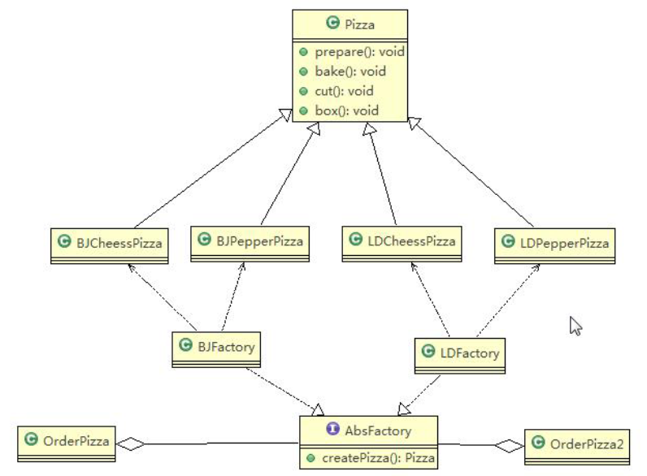

### 6.3.2 抽象工厂模式应用实例
```java
package com.atguigu.factory.absfactory.pizzastore.order;
//一个抽象工厂模式的抽象层(接口)
public interface AbsFactory {
	//让下面的工厂子类来具体实现
	public Pizza createPizza(String orderType);
}
//这是工厂子类
public class BJFactory implements AbsFactory {
	@Override
	public Pizza createPizza(String orderType) {
		System.out.println("~使用的是抽象工厂模式~");
		Pizza pizza = null;
		if(orderType.equals("cheese")) {
			pizza = new BJCheesePizza();
		} else if (orderType.equals("pepper")){
			pizza = new BJPepperPizza();
		}
		return pizza;
	}
}
public class LDFactory implements AbsFactory {
	@Override
	public Pizza createPizza(String orderType) {
		System.out.println("~使用的是抽象工厂模式~");
		Pizza pizza = null;
		if (orderType.equals("cheese")) {
			pizza = new LDCheesePizza();
		} else if (orderType.equals("pepper")) {
			pizza = new LDPepperPizza();
		}
		return pizza;
	}
}
public class OrderPizza {
	AbsFactory factory;
	public OrderPizza(AbsFactory factory) {	// 构造器
		setFactory(factory);
	}
	private void setFactory(AbsFactory factory) {
		Pizza pizza = null;
		String orderType = ""; // 用户输入
		this.factory = factory;
		do {
			orderType = getType();
			// factory 可能是北京的工厂子类，也可能是伦敦的工厂子类
			pizza = factory.createPizza(orderType);
			if (pizza != null) { // 订购ok
				pizza.prepare();
				pizza.bake();
				pizza.cut();
				pizza.box();
			} else {
				System.out.println("订购失败");
				break;
			}
		} while (true);
	}
	private String getType() { //获取客户希望订购的披萨种类
		try {
			BufferedReader strin = new BufferedReader(new InputStreamReader(System.in));
			System.out.println("input pizza 种类:");
			String str = strin.readLine();
			return str;
		} catch (IOException e) {
			return "";
		}
	}
}
public class PizzaStore {
	public static void main(String[] args) {
		//new OrderPizza(new BJFactory());
		new OrderPizza(new LDFactory());
	}
}
```

## 6.4 工厂模式在 JDK-Calendar 应用的源码分析
1. JDK中的Calendar类中，就使用了简单工厂模式
2. 源码分析 + Debug源码 + 说明
```java
package java.util;
public abstract class Calendar implements Serializable, Cloneable, Comparable<Calendar> {
    // ...
    public static Calendar getInstance() {
        Locale aLocale = Locale.getDefault(Locale.Category.FORMAT);
        return createCalendar(defaultTimeZone(aLocale), aLocale);
    }
    // ...
    private static Calendar createCalendar(TimeZone zone, Locale aLocale) {
        CalendarProvider provider = LocaleProviderAdapter.getAdapter(CalendarProvider.class, aLocale).getCalendarProvider();
        if (provider != null) {
            try {
                return provider.getInstance(zone, aLocale);
            } catch (IllegalArgumentException iae) {
                // fall back to the default instantiation
            }
        }
        Calendar cal = null;
        if (aLocale.hasExtensions()) {
            String caltype = aLocale.getUnicodeLocaleType("ca");
            if (caltype != null) {
                cal = switch (caltype) {
                    case "buddhist" -> new BuddhistCalendar(zone, aLocale);
                    case "japanese" -> new JapaneseImperialCalendar(zone, aLocale);
                    case "gregory"  -> new GregorianCalendar(zone, aLocale);
                    default         -> null;
                };
            }
        }
        if (cal == null) {
            // If no known calendar type is explicitly specified,
            // perform the traditional way to create a Calendar:
            // create a BuddhistCalendar for th_TH locale,
            // a JapaneseImperialCalendar for ja_JP_JP locale, or
            // a GregorianCalendar for any other locales.
            // NOTE: The language, country and variant strings are interned.
            if (aLocale.getLanguage() == "th" && aLocale.getCountry() == "TH") {
                cal = new BuddhistCalendar(zone, aLocale);
            } else if (aLocale.getVariant() == "JP" && aLocale.getLanguage() == "ja"
                       && aLocale.getCountry() == "JP") {
                cal = new JapaneseImperialCalendar(zone, aLocale);
            } else {
                cal = new GregorianCalendar(zone, aLocale);
            }
        }
        return cal;
    }
    // ...
}
```

## 6.5 工厂模式小结
1. 工厂模式的意义：将实例化对象的代码提取出来，放到一个类中统一管理和维护，达到和主项目的依赖关系的解耦。从而提高项目的扩展和维护性。
2. 三种工厂模式 (简单工厂模式、工厂方法模式、抽象工厂模式)
3. 设计模式的**依赖抽象**原则

- 创建对象实例时，不要直接 new 类，而是把这个 new 类的动作放在一个工厂的方法中，并返回。有的书上说，变量不要直接持有具体类的引用。
- 不要让类继承具体类，而是继承抽象类或者是实现 interface(接口)
- 不要覆盖基类中已经实现的方法。


# 第7章 原型模式

## 7.1 克隆羊问题
现在有一只羊 tom，姓名为: tom，年龄为：1，颜色为：白色，请编写程序创建和 tom 羊属性完全相同的 10 只羊。

## 7.2 传统方式解决克隆羊问题
1. 思路分析(图解)
    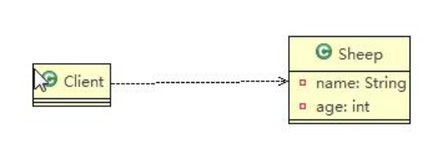
2. 代码演示
```java
package com.atguigu.prototype;
public class Sheep {
    private String name;
	private int age;
	private String color;
    // 构造函数、getter/setter、toString
}
public class Client {
	public static void main(String[] args) {
		//传统的方法
		Sheep sheep = new Sheep("tom", 1, "白色");

		Sheep sheep2 = new Sheep(sheep.getName(), sheep.getAge(), sheep.getColor());
		Sheep sheep3 = new Sheep(sheep.getName(), sheep.getAge(), sheep.getColor());
		//....

		System.out.println(sheep);
		System.out.println(sheep2);
		System.out.println(sheep3);
		//...
	}
}
```

## 7.3 传统的方式的优缺点
1. 优点是比较好理解，简单易操作。
2. 在创建新的对象时，总是需要重新获取原始对象的属性，如果创建的对象比较复杂时，效率较低
3. 总是需要重新初始化对象，而不是动态地获得对象运行时的状态, 不够灵活
4. 改进的思路分析
    > 思路：Java 中 Object 类是所有类的根类，Object 类提供了一个 clone()方法，该方法可以将一个 Java 对象复制一份，但是需要实现 clone 的 Java 类必须要实现一个接口 Cloneable，该接口表示该类能够复制且具有复制的能力 => **原型模式**

## 7.4 原型模式-基本介绍
1. 原型模式(Prototype 模式)是指：**用原型实例指定创建对象的种类，并且通过拷贝这些原型，创建新的对象**
2. 原型模式是一种创建型设计模式，允许一个对象再创建另外一个可定制的对象，无需知道如何创建的细节
3. 工作原理是:通过将一个原型对象传给那个要发动创建的对象，这个要发动创建的对象通过请求原型对象拷贝它们自己来实施创建，即 **对象.clone()**
4. 形象的理解：孙大圣拔出猴毛，变出其它孙大圣

## 7.5 原型模式原理结构图-uml 类图
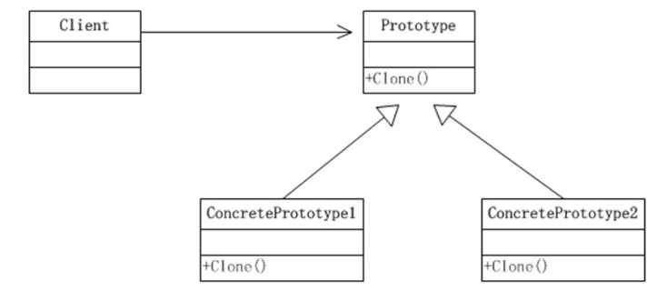

原理结构图说明
1. Prototype: 原型类，声明一个克隆自己的接口
2. ConcretePrototype: 具体的原型类，实现一个克隆自己的操作
3. Client: 让一个原型对象克隆自己，从而创建一个新的对象(属性一样）

## 7.6 原型模式解决克隆羊问题的应用实例
```java
package com.atguigu.prototype.improve;
public class Sheep implements Cloneable {
	private String name;
	private int age;
	private String color;
	private String address = "蒙古羊";
	public Sheep friend; // 是对象, 克隆是会如何处理
	// Constructor: name, age, color
	// getter/setter: name, age, color
	// toString: name, age, color, address
	// 克隆该实例，使用默认的clone方法来完成
	@Override
	protected Object clone() {
		Sheep sheep = null;
		try {
			sheep = (Sheep) super.clone();
		} catch (Exception e) {
			System.out.println(e.getMessage());
		}
		return sheep;
	}
}
public class Client {
	public static void main(String[] args) {
		System.out.println("原型模式完成对象的创建");
		Sheep sheep = new Sheep("tom", 1, "白色");
		sheep.friend = new Sheep("jack", 2, "黑色");

		Sheep sheep2 = (Sheep) sheep.clone(); // 克隆
		Sheep sheep3 = (Sheep) sheep.clone(); // 克隆
		// ...
		System.out.println("sheep2 =" + sheep2 + "sheep2.friend=" + sheep2.friend.hashCode());
		System.out.println("sheep3 =" + sheep3 + "sheep3.friend=" + sheep3.friend.hashCode());
		// ...
	}
}
```

## 7.7 原型模式在 Spring 框架中源码分析
1. Spring 中原型 bean 的创建，就是原型模式的应用
2. 代码分析 + Debug 源码
    ```xml
    <!-- 这里我们的 scope="prototype" 即 原型模式来创建 -->
	<bean id="id01" class="com.atguigu.spring.bean.Monster" scope="prototype" />
    ```
    ```java
    package com.atguigu.spring.bean;
    public class Monster {
        private Integer id = 10 ;
        private String nickname = "牛魔王";
        private String skill = "芭蕉扇";
        // ...
    }
    ```
    ```java
    package com.atguigu.spring.test;
    public class ProtoType {
        public static void main(String[] args) {
            ApplicationContext applicationContext = new ClassPathXmlApplicationContext("beans.xml");
            // 获取monster[通过id获取monster]
            Object bean = applicationContext.getBean("id01");
            System.out.println("bean" + bean); // 输出 "牛魔王" .....
            
            Object bean2 = applicationContext.getBean("id01");
            System.out.println("bean2" + bean2); //输出 "牛魔王" .....

            System.out.println(bean == bean2); // false
            // ConfigurableApplicationContext
        }
    }
    ```
    ```java
    package org.springframework.context.support;
    public abstract class AbstractApplicationContext extends DefaultResourceLoader
		implements ConfigurableApplicationContext, DisposableBean {
        @Override
	    public Object getBean(String name) throws BeansException {
		    assertBeanFactoryActive();
		    return getBeanFactory().getBean(name);
	    }
        // ...
    }
    ```
    ```java
    package org.springframework.beans.factory.support;
    public abstract class AbstractBeanFactory extends FactoryBeanRegistrySupport implements ConfigurableBeanFactory {
        @Override
        public Object getBean(String name) throws BeansException {
            return doGetBean(name, null, null, false);
        }
        @SuppressWarnings("unchecked")
        protected <T> T doGetBean(final String name, final Class<T> requiredType, final Object[] args, boolean typeCheckOnly) throws BeansException {
            final String beanName = transformedBeanName(name);
            Object bean;
            // Eagerly check singleton cache for manually registered singletons.
            Object sharedInstance = getSingleton(beanName);
            if (sharedInstance != null && args == null) {
                if (logger.isDebugEnabled()) {
                    if (isSingletonCurrentlyInCreation(beanName)) {
                        logger.debug("Returning eagerly cached instance of singleton bean '" + beanName +
                                "' that is not fully initialized yet - a consequence of a circular reference");
                    } else {
                        logger.debug("Returning cached instance of singleton bean '" + beanName + "'");
                    }
                }
                bean = getObjectForBeanInstance(sharedInstance, name, beanName, null);
            } else {
                // Fail if we're already creating this bean instance:
                // We're assumably within a circular reference.
                if (isPrototypeCurrentlyInCreation(beanName)) {
                    throw new BeanCurrentlyInCreationException(beanName);
                }
                // Check if bean definition exists in this factory.
                BeanFactory parentBeanFactory = getParentBeanFactory();
                if (parentBeanFactory != null && !containsBeanDefinition(beanName)) {
                    // Not found -> check parent.
                    String nameToLookup = originalBeanName(name);
                    if (args != null) {// Delegation to parent with explicit args.
                        return (T) parentBeanFactory.getBean(nameToLookup, args);
                    } else {// No args -> delegate to standard getBean method.
                        return parentBeanFactory.getBean(nameToLookup, requiredType);
                    }
                }
                if (!typeCheckOnly) {
                    markBeanAsCreated(beanName);
                }
                try {
                    final RootBeanDefinition mbd = getMergedLocalBeanDefinition(beanName);
                    checkMergedBeanDefinition(mbd, beanName, args);
                    // Guarantee initialization of beans that the current bean depends on.
                    String[] dependsOn = mbd.getDependsOn();
                    if (dependsOn != null) {
                        for (String dependsOnBean : dependsOn) {
                            if (isDependent(beanName, dependsOnBean)) {
                                throw new BeanCreationException("Circular depends-on relationship between '" +
                                        beanName + "' and '" + dependsOnBean + "'");
                            }
                            registerDependentBean(dependsOnBean, beanName);
                            getBean(dependsOnBean);
                        }
                    }
                    if (mbd.isSingleton()) {// Create bean instance.
                        sharedInstance = getSingleton(beanName, new ObjectFactory<Object>() {
                            @Override
                            public Object getObject() throws BeansException {
                                try {
                                    return createBean(beanName, mbd, args);
                                } catch (BeansException ex) {
                                    // Explicitly remove instance from singleton cache: It might have been put there
                                    // eagerly by the creation process, to allow for circular reference resolution.
                                    // Also remove any beans that received a temporary reference to the bean.
                                    destroySingleton(beanName);
                                    throw ex;
                                }
                            }
                        });
                        bean = getObjectForBeanInstance(sharedInstance, name, beanName, mbd);
                    } else if (mbd.isPrototype()) {// It's a prototype -> create a new instance.
                        Object prototypeInstance = null;
                        try {
                            beforePrototypeCreation(beanName);
                            prototypeInstance = createBean(beanName, mbd, args);
                        } finally {
                            afterPrototypeCreation(beanName);
                        }
                        bean = getObjectForBeanInstance(prototypeInstance, name, beanName, mbd);
                    } else {
                        String scopeName = mbd.getScope();
                        final Scope scope = this.scopes.get(scopeName);
                        if (scope == null) {
                            throw new IllegalStateException("No Scope registered for scope '" + scopeName + "'");
                        }
                        try {
                            Object scopedInstance = scope.get(beanName, new ObjectFactory<Object>() {
                                @Override
                                public Object getObject() throws BeansException {
                                    beforePrototypeCreation(beanName);
                                    try {
                                        return createBean(beanName, mbd, args);
                                    } finally {
                                        afterPrototypeCreation(beanName);
                                    }
                                }
                            });
                            bean = getObjectForBeanInstance(scopedInstance, name, beanName, mbd);
                        } catch (IllegalStateException ex) {
                            throw new BeanCreationException(beanName,
                                    "Scope '" + scopeName + "' is not active for the current thread; " +
                                    "consider defining a scoped proxy for this bean if you intend to refer to it from a singleton", ex);
                        }
                    }
                } catch (BeansException ex) {
                    cleanupAfterBeanCreationFailure(beanName);
                    throw ex;
                }
            }
            // Check if required type matches the type of the actual bean instance.
            if (requiredType != null && bean != null && !requiredType.isAssignableFrom(bean.getClass())) {
                try {
                    return getTypeConverter().convertIfNecessary(bean, requiredType);
                } catch (TypeMismatchException ex) {
                    if (logger.isDebugEnabled()) {
                        logger.debug("Failed to convert bean '" + name + "' to required type [" +
                                ClassUtils.getQualifiedName(requiredType) + "]", ex);
                    }
                    throw new BeanNotOfRequiredTypeException(name, requiredType, bean.getClass());
                }
            }
            return (T) bean;
        }
        // ...
    }
    ```

## 7.8 深入讨论-浅拷贝和深拷贝

### 7.8.1 浅拷贝的介绍
1. 对于数据类型是基本数据类型的成员变量，浅拷贝会直接进行值传递，也就是将该属性值复制一份给新的对象。
2. 对于数据类型是引用数据类型的成员变量，比如说成员变量是某个数组、某个类的对象等，那么浅拷贝会进行引用传递，也就是只是将该成员变量的引用值（内存地址）复制一份给新的对象。因为实际上两个对象的该成员变量都指向同一个实例。在这种情况下，在一个对象中修改该成员变量会影响到另一个对象的该成员变量值。
3. 前面我们克隆羊就是浅拷贝
4. 浅拷贝是使用默认的 clone() 方法来实现 `sheep = (Sheep) super.clone();`

### 7.8.2 深拷贝基本介绍
1. 复制对象的所有基本数据类型的成员变量值
2. 为所有引用数据类型的成员变量申请存储空间，并复制每个引用数据类型成员变量所引用的对象，直到该对象可达的所有对象。也就是说，**对象进行深拷贝要对整个对象(包括对象的引用类型)进行拷贝**
3. 深拷贝实现方式 1：**重写 clone 方法**来实现深拷贝
4. 深拷贝实现方式 2：通过**对象序列化**实现深拷贝(推荐)

## 7.9 深拷贝应用实例
```java
package com.atguigu.prototype.deepclone;
public class DeepCloneableTarget implements Serializable, Cloneable {
	private static final long serialVersionUID = 1L;
	private String cloneName;
	private String cloneClass;
	// 构造器
	public DeepCloneableTarget(String cloneName, String cloneClass) {
		this.cloneName = cloneName;
		this.cloneClass = cloneClass;
	}
	// 因为该类的属性，都是String , 因此我们这里使用默认的clone完成即可
	@Override
	protected Object clone() throws CloneNotSupportedException {
		return super.clone();
	}
}
public class DeepProtoType implements Serializable, Cloneable {
	public String name; // String 属性
	public DeepCloneableTarget deepCloneableTarget;// 引用类型
	public DeepProtoType() {
		super();
	}
	// 深拷贝 - 方式 1 使用 clone 方法
	@Override
	protected Object clone() throws CloneNotSupportedException {
		Object deep = null;
		// 这里完成对基本数据类型(属性)和String的克隆
		deep = super.clone();
		// 对引用类型的属性，进行单独处理
		DeepProtoType deepProtoType = (DeepProtoType) deep;
		deepProtoType.deepCloneableTarget = (DeepCloneableTarget) deepCloneableTarget.clone();
		return deepProtoType;
	}
	// 深拷贝 - 方式2 通过对象的序列化实现★ (推荐)
	public Object deepClone() {
		// 创建流对象
		ByteArrayOutputStream bos = null;
		ObjectOutputStream oos = null;
		ByteArrayInputStream bis = null;
		ObjectInputStream ois = null;
		try {// 序列化
			bos = new ByteArrayOutputStream();
			oos = new ObjectOutputStream(bos);
			oos.writeObject(this); // 当前这个对象以对象流的方式输出
			// 反序列化
			bis = new ByteArrayInputStream(bos.toByteArray());
			ois = new ObjectInputStream(bis);
			DeepProtoType copyObj = (DeepProtoType) ois.readObject();
			return copyObj;
		} catch (Exception e) {
			return null;
		} finally {// 关闭流
			try {
				bos.close();
				oos.close();
				bis.close();
				ois.close();
			} catch (Exception e2) {}
		}
	}
}
public class Client {
	public static void main(String[] args) throws Exception {
		DeepProtoType p = new DeepProtoType();
		p.name = "宋江";
		p.deepCloneableTarget = new DeepCloneableTarget("大牛", "小牛");
		// 方式1 完成深拷贝
		DeepProtoType p2 = (DeepProtoType) p.clone();
		System.out.println("p.name=" + p.name + "p.deepCloneableTarget=" +
				p.deepCloneableTarget.hashCode());
		System.out.println("p2.name=" + p.name + "p2.deepCloneableTarget=" +
				p2.deepCloneableTarget.hashCode());
		
		// 方式2 完成深拷贝
		DeepProtoType p2 = (DeepProtoType) p.deepClone();
		System.out.println("p.name=" + p.name + "p.deepCloneableTarget=" + p.deepCloneableTarget.hashCode());
		System.out.println("p2.name=" + p.name + "p2.deepCloneableTarget=" + p2.deepCloneableTarget.hashCode());
	}
}
```

## 7.10 原型模式的注意事项和细节
1. 创建新的对象比较复杂时，可以利用原型模式简化**对象的创建过程，同时也能够提高效率**
2. 不用重新初始化对象，而是**动态地获得对象运行时**的状态
3. 如果原始对象发生变化(增加或者减少属性)，其它克隆对象的也会发生相应的变化，无需修改代码
4. 在实现深克隆的时候可能需要比较复杂的代码
5. **缺点**：需要为每一个类配备一个克隆方法，这对全新的类来说不是很难，但对已有的类进行改造时，需要修改其源代码，违背了 ocp 原则，这点请同学们注意


# 第8章 建造者模式

## 8.1 盖房项目需求
1. 需要建房子：这一过程为打桩、砌墙、封顶
2. 房子有各种各样的，比如普通房，高楼，别墅，各种房子的过程虽然一样，但是要求不要相同的
3. 请编写程序，完成需求

## 8.2 传统方式解决盖房需求
1. 思路分析(图解)
    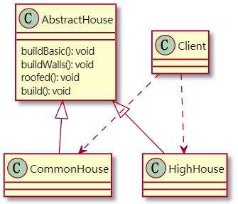
2. 代码演示
    ```java
    package com.atguigu.builder;
    public abstract class AbstractHouse {
        public abstract void buildBasic();
        public abstract void buildWalls();
        public abstract void roofed();
        public void build() {
            buildBasic();
            buildWalls();
            roofed();
        }
    }
    public class CommonHouse extends AbstractHouse {
        @Override
        public void buildBasic() {
            System.out.println("普通房子打地基");
        }
        @Override
        public void buildWalls() {
            System.out.println("普通房子砌墙");
        }
        @Override
        public void roofed() {
            System.out.println("普通房子封顶");
        }
    }
    public class Client {
        public static void main(String[] args) {
            CommonHouse commonHouse = new CommonHouse();
            commonHouse.build();
        }
    }
    ```

## 8.3 传统方式的问题分析
1. 优点是比较好理解，简单易操作。
2. 设计的程序结构，过于简单，没有设计缓存层对象，程序的扩展和维护不好。也就是说，这种设计方案，把产品(即：房子) 和 创建产品的过程(即：建房子流程) 封装在一起，耦合性增强了。
3. 解决方案：将产品和产品建造过程解耦 => **建造者模式**

## 8.4 建造者模式基本介绍
1. 建造者模式（Builder Pattern） 又叫**生成器模式**，是一种对象**构建模式**。它可以将复杂对象的建造过程抽象出来（抽象类别），使这个抽象过程的不同实现方法可以构造出不同表现（属性）的对象。
2. 建造者模式 是一步一步创建一个复杂的对象，它允许用户只通过指定复杂对象的类型和内容就可以构建它们，用户不需要知道内部的具体构建细节。

## 8.5 建造者模式的四个角色
1. Product（产品角色）： 一个具体的产品对象。
2. Builder（抽象建造者）： 创建一个 Product 对象的各个部件指定的 **接口/抽象类**。
3. ConcreteBuilder（具体建造者）： 实现接口，构建和装配各个部件。
4. Director（指挥者）： 构建一个使用 Builder 接口的对象。它主要是用于创建一个复杂的对象。它主要有两个作用，一是：隔离了客户与对象的生产过程，二是：负责控制产品对象的生产过程。

## 8.6 建造者模式原理类图
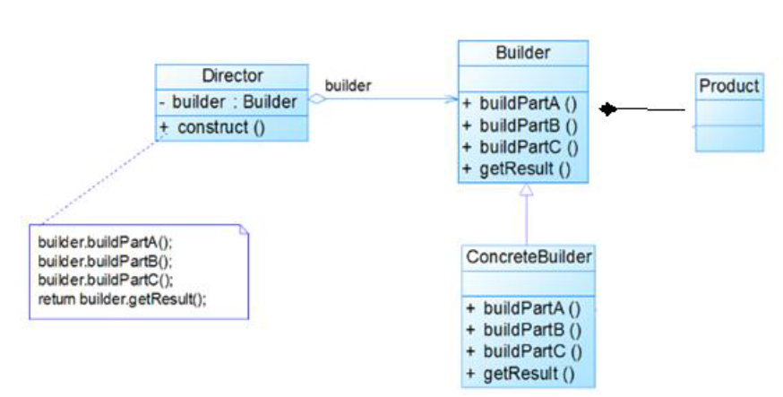

## 8.7 建造者模式解决盖房需求应用实例
1. 需要建房子：这一过程为打桩、砌墙、封顶。不管是普通房子也好，别墅也好都需要经历这些过程，下面我们使用建造者模式(Builder Pattern)来完成
2. 思路分析图解(类图)
    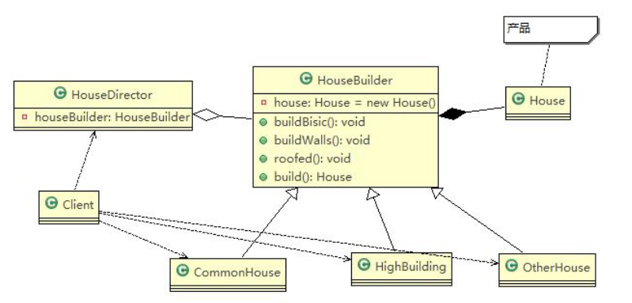
3. 代码实现
```java
package com.atguigu.builder.improve;
public class House {// 产品->Product
	private String baise;
	private String wall;
	private String roofed;
	// getter and setter
}
public abstract class HouseBuilder {// 抽象的建造者
	protected House house = new House();
	// 将建造的流程写好, 抽象的方法
	public abstract void buildBasic();
	public abstract void buildWalls();
	public abstract void roofed();
	// 建造房子好， 将产品(房子) 返回
	public House buildHouse() {
		return house;
	}
}
public class CommonHouse extends HouseBuilder {
	@Override
	public void buildBasic() {
		System.out.println(" 普通房子打地基5米 ");
	}
	@Override
	public void buildWalls() {
		System.out.println(" 普通房子砌墙10cm ");
	}
	@Override
	public void roofed() {
		System.out.println(" 普通房子屋顶 ");
	}
}
public class HighBuilding extends HouseBuilder {
	@Override
	public void buildBasic() {
		System.out.println(" 高楼的打地基100米 ");
	}
	@Override
	public void buildWalls() {
		System.out.println(" 高楼的砌墙20cm ");
	}
	@Override
	public void roofed() {
		System.out.println(" 高楼的透明屋顶 ");
	}
}
//指挥者，这里去指定制作流程，返回产品
public class HouseDirector {
	HouseBuilder houseBuilder = null;
	// 构造器传入 houseBuilder
	public HouseDirector(HouseBuilder houseBuilder) {
		this.houseBuilder = houseBuilder;
	}
	// 通过setter 传入 houseBuilder
	public void setHouseBuilder(HouseBuilder houseBuilder) {
		this.houseBuilder = houseBuilder;
	}
	// 如何处理建造房子的流程，交给指挥者
	public House constructHouse() {
		houseBuilder.buildBasic();
		houseBuilder.buildWalls();
		houseBuilder.roofed();
		return houseBuilder.buildHouse();
	}
}
public class Client {
	public static void main(String[] args) {
		// 盖普通房子
		CommonHouse commonHouse = new CommonHouse();
		// 准备创建房子的指挥者
		HouseDirector houseDirector = new HouseDirector(commonHouse);
		// 完成盖房子，返回产品(普通房子)
		House house = houseDirector.constructHouse();

		// 盖高楼
		HighBuilding highBuilding = new HighBuilding();
		// 重置建造者
		houseDirector.setHouseBuilder(highBuilding);
		// 完成盖房子，返回产品(高楼)
		House house2 = houseDirector.constructHouse();
	}
}
```

## 8.8 建造者模式在 JDK 的应用和源码分析
1. java.lang.StringBuilder 中的建造者模式
    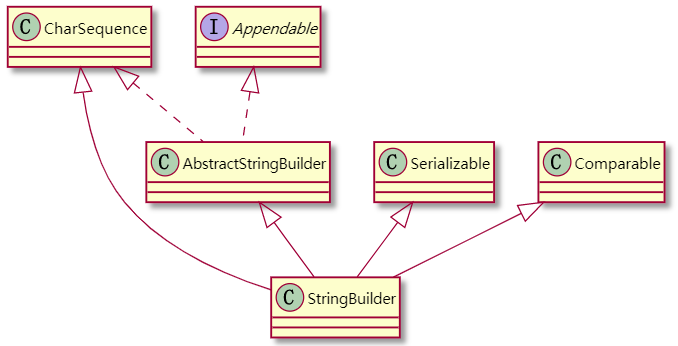
2. 代码说明 + Debug源码
```java
package java.lang;
public final class StringBuilder extends AbstractStringBuilder implements java.io.Serializable, Comparable<StringBuilder>, CharSequence { // 指挥者
    @IntrinsicCandidate
    public StringBuilder(String str) {
        super(str);
    }
    // ...
}
abstract class AbstractStringBuilder implements Appendable, CharSequence { // 建造者
    AbstractStringBuilder(String str) {
        int length = str.length();
        int capacity = (length < Integer.MAX_VALUE - 16)
                ? length + 16 : Integer.MAX_VALUE;
        final byte initCoder = str.coder();
        coder = initCoder;
        value = (initCoder == LATIN1)
                ? new byte[capacity] : StringUTF16.newBytesFor(capacity);
        append(str);
    }
    public AbstractStringBuilder append(String str) {
        if (str == null) {
            return appendNull();
        }
        int len = str.length();
        ensureCapacityInternal(count + len);
        putStringAt(count, str);
        count += len;
        return this;
    }
    // ...
}
public interface Appendable { // 抽象建造者
    Appendable append(CharSequence csq) throws IOException;
    // ...
}
```    
3. 源码中建造者模式角色分析
   1. Appendable 接口定义了多个 append 方法(抽象方法)，即 Appendable 为抽象建造者，定义了抽象方法
   2. AbstractStringBuilder 实现了 Appendable 接口方法，这里的 AbstractStringBuilder 已经是建造者，只是不能实例化
   3. StringBuilder 即充当了指挥者角色，同时充当了具体的建造者，建造方法的实现是由 AbstractStringBuilder 完成，而 StringBuilder 继承了 AbstractStringBuilder

## 8.9 建造者模式的注意事项和细节
1. 客户端(使用程序)**不必知道产品内部组成的细节**，**将产品本身与产品的创建过程解耦**，**使得相同的创建过程可以创建不同的产品对象**
2. 每一个具体建造者都相对独立，而与其他的具体建造者无关，因此可以很方便地替换具体建造者或增加新的具体建造者，**用户使用不同的具体建造者即可得到不同**
的产品对象
3. **可以更加精细地控制产品的创建过程**。将复杂产品的创建步骤分解在不同的方法中，使得创建过程更加清晰，也更方便使用程序来控制创建过程
4. **增加新的具体建造者无须修改原有类库的代码**，指挥者类针对抽象建造者类编程，系统扩展方便，符合 “**开闭原则**”
5. 建造者模式所创建的产品一般具有较多的共同点，其组成部分相似，**如果产品之间的差异性很大，则不适合使用建造者模式，因此其使用范围受到一定的限制。**
6. 如果产品的内部变化复杂，可能会导致需要定义很多具体建造者类来实现这种变化，导致系统变得很庞大，因此在这种情况下，要考虑是否选择建造者模式
7. **抽象工厂模式VS建造者模式** ：抽象工厂模式实现对产品家族的创建，一个产品家族是这样的一系列产品：具有不同分类维度的产品组合，采用抽象工厂模式不需要关心构建过程，只关心什么产品由什么工厂生产即可。而建造者模式则是要求按照指定的蓝图建造产品，它的主要目的是通过组装零配件而产生一个新产品


# 第9章 适配器设计模式

## 9.1 现实生活中的适配器例子
泰国插座用的是两孔的（欧标），可以买个多功能转换插头 (适配器) ，这样就可以使用了。

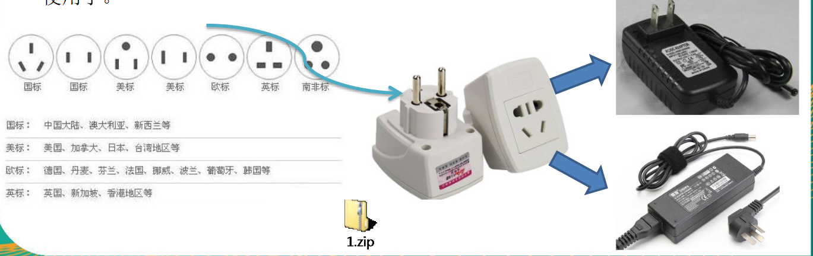

## 9.2 基本介绍
1. 适配器模式(Adapter Pattern)将某个类的接口转换成客户端期望的另一个接口表示，主的目的是**兼容性**，让原本因接口不匹配不能一起工作的两个类可以协同工作。其别名为包装器(Wrapper)
2. 适配器模式属于结构型模式
3. 主要分为三类：**类适配器模式**、**对象适配器模式**、**接口适配器模式**

## 9.3 工作原理
1. 适配器模式：将一个类的接口转换成另一种接口.让原本接口不兼容的类可以兼容
2. 从用户的角度看不到被适配者，是解耦的
3. 用户调用适配器转化出来的目标接口方法，适配器再调用被适配者的相关接口方法
4. 用户收到反馈结果，感觉只是和目标接口交互，如图
    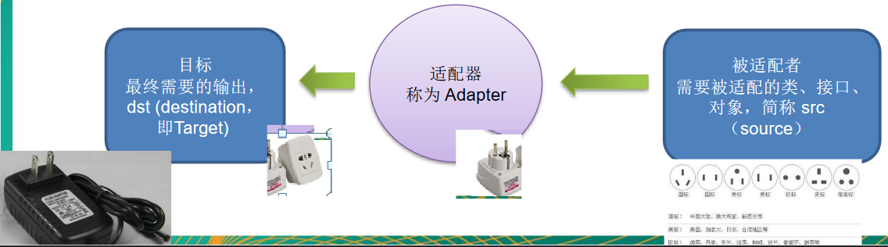

## 9.4 类适配器模式

### 9.4.1 类适配器模式介绍
基本介绍：Adapter 类，通过继承 src 类，实现 dst 类接口，完成 src->dst 的适配。

### 9.4.2 类适配器模式应用实例
1. 应用实例说明：以生活中充电器的例子来讲解适配器，充电器本身相当于Adapter，220V交流电
相当于src(即被适配者)，我们的目dst(即目标)是5V直流电
2. 思路分析(类图)
    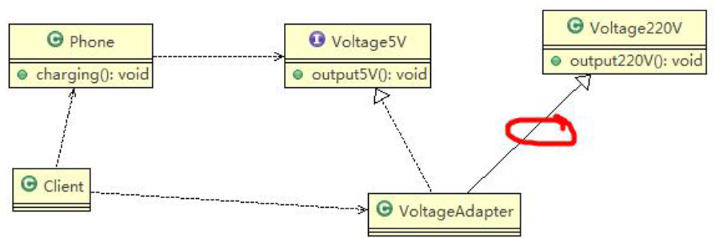
3. 代码实现
    ```java
    package com.atguigu.adapter.classadapter;
    public class Voltage220V {//被适配的类
        public int output220V() {
            int src = 220;
            return src;// 输出220V的电压
        }
    }
    public interface IVoltage5V {//适配接口
        public int output5V();
    }
    //适配器类
    public class VoltageAdapter extends Voltage220V implements IVoltage5V {
        @Override
        public int output5V() {
            int srcV = output220V();// 获取到220V电压
            int dstV = srcV / 44; // 转成 5v
            return dstV;
        }
    }
    public class Phone {
        public void charging(IVoltage5V iVoltage5V) {// 充电
            if (iVoltage5V.output5V() == 5) {
                System.out.println("可以充电~~");
            } else {
                System.out.println("不能充电~~");
            }
        }
    }
    public class Client {
        public static void main(String[] args) {
            System.out.println("=== 类适配器模式 ====");
            Phone phone = new Phone();
            phone.charging(new VoltageAdapter());
        }
    }
    ```

### 9.4.3 类适配器模式注意事项和细节
1. Java 是单继承机制，所以类适配器需要继承 src 类这一点算是一个缺点，因为这要求 dst 必须是接口，有一定局限性
2. src 类的方法在 Adapter 中都会暴露出来，也增加了使用的成本。
3. 由于其继承了 src 类，所以它可以根据需求重写 src 类的方法，使得 Adapter 的灵活性增强了。

## 9.5 对象适配器模式

### 9.5.1 对象适配器模式介绍
1. 基本思路和类的适配器模式相同，只是将 Adapter 类作修改，不是继承 src 类，而是持有 src 类的实例，以解决兼容性的问题。 即：持有 src 类，实现 dst 类接口，完成 src->dst 的适配
2. 根据“**合成复用原则**”，在系统中尽量**使用关联关系（聚合）来替代继承关系**。
3. 对象适配器模式是适配器模式常用的一种

### 9.5.2 对象适配器模式应用实例
1. 应用实例说明：以生活中充电器的例子来讲解适配器，充电器本身相当于 Adapter，220V 交流电相当于 src (即被适配者)，我们的目 dst(即目标)是 5V 直流电，使用对象适配器模式完成。
2. 思路分析(类图)：只需修改适配器即可，如下:
    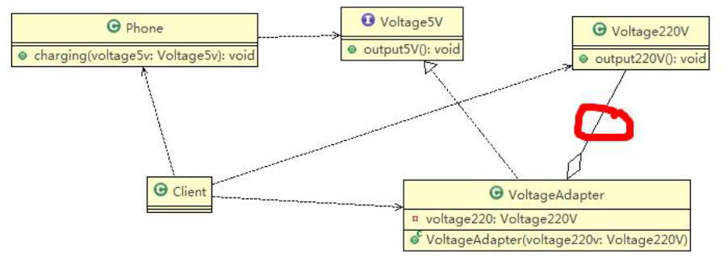
3. 代码实现
    ```java
    package com.atguigu.adapter.objectadapter;
    // Voltage220V、IVoltage5V、Phone同上
    public class VoltageAdapter implements IVoltage5V {// 适配器类
        private Voltage220V voltage220V; // 关联关系-聚合
        // 通过构造器，传入一个 Voltage220V 实例
        public VoltageAdapter(Voltage220V voltage220v) {
            this.voltage220V = voltage220v;
        }
        @Override
        public int output5V() {
            int dst = 0;
            if (null != voltage220V) {
                int src = voltage220V.output220V();// 获取220V 电压
                dst = src / 44;
            }
            return dst;
        }
    }
    public class Client {
        public static void main(String[] args) {
            System.out.println(" === 对象适配器模式 ====");
            Phone phone = new Phone();
            phone.charging(new VoltageAdapter(new Voltage220V()));
        }
    }
    ```

### 9.5.3 对象适配器模式注意事项和细节
1. 对象适配器和类适配器其实算是同一种思想，只不过实现方式不同。根据合成复用原则，使用组合替代继承，所以它解决了类适配器必须继承 src 的局限性问题，也不再要求 dst 必须是接口。
2. 使用成本更低，更灵活。

## 9.6 接口适配器模式

### 9.6.1 接口适配器模式介绍
1. 一些书籍称为：适配器模式(Default Adapter Pattern)或**缺省适配器模式**。
2. 核心思路：当**不需要全部实现接口提供的方法**时，可先设计一个**抽象类**实现**接口**，并为该接口中每个方法提供一个**默认实现（空方法）**，那么该**抽象类的子类可有选择地覆盖父类的某些方法**来实现需求
3. 适用于一个接口不想使用其所有的方法的情况。

### 9.6.2 接口适配器模式应用实例
1. Android 中的属性动画 ValueAnimator 类可以通过 addListener(AnimatorListener listener)方法添加监听器，常规写法：
    ```java
    valueAnimator.addListener(new Animator.AnimatorListener() {
        @Override
        public void onAnimationStart(Animator animation) {
        }
        @Override
        public void onAnimationEnd(Animator animation) {
        }
        @Override
        public void onAnimationCancel(Animator animation) {
        }
        @Override
        public void onAnimationRepeat(Animator animation) {
        }
    });
    valueAnimator.start();
    ```
2. 有时候我们不想实现Animator.AnimatorListener接口的全部方法，我们只想监听onAnimationStart，我们会如下写
    ```java
    valueAnimator.addListener(new AnimatorListenerAdapter() {
        @Override
        public void onAnimationStart(Animator animation) {
            //xxxx具体实现
        }
    });
    valueAnimator.start();
    ```
3. AnimatorListenerAdapter类，就是一个接口适配器，代码如右图:它空实现了Animator.AnimatorListener类(src)的所有方法
    ```java
    public abstract class AnimatorListenerAdapter implements Animator.AnimatorListener, Animator.AnimatorPauseListener {
        @Override //默认实现
        public void onAnimationCancel(Animator animation) {    }
        @Override
        public void onAnimationEnd(Animator animation) {    }
        @Override
        public void onAnimationRepeat(Animator animation) {    }
        @Override
        public void onAnimationStart(Animator animation) {    }
        @Override
        public void onAnimationPause(Animator animation) {    }
        @Override
        public void onAnimationResume(Animator animation) {    }
    }
    ```
4. AnimatorListener是一个接口
    ```java
    public static interface AnimatorListener {
        void onAnimationStart(Animator animation);
        void onAnimationEnd(Animator animation);
        void onAnimationCancel(Animator animation);
        void onAnimationRepeat(Animator animation);
    }
    ```
5. 程序里的匿名内部类就是 Listener 具体实现类
    ```java
    new AnimatorListenerAdapter() {
        @Override
        public void onAnimationStart(Animator animation) {
            //xxxx具体实现
        }
    }
    ```
6. 案例说明
    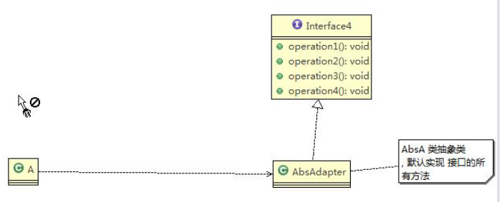
```java
package com.atguigu.adapter.interfaceadapter;
public interface Interface4 {
	public void m1();
	public void m2();
	public void m3();
	public void m4();
}
//在AbsAdapter 我们将 Interface4 的方法进行默认实现
public abstract class AbsAdapter implements Interface4 {
	// 默认实现
	public void m1() {	}
	public void m2() {	}
	public void m3() {	}
	public void m4() {	}
}
public class Client {
	public static void main(String[] args) {
		AbsAdapter absAdapter = new AbsAdapter() {
			// 只需要去覆盖我们 需要使用 接口方法
			@Override
			public void m1() {
				System.out.println("使用了m1的方法");
			}
		};
		absAdapter.m1();
	}
}
```

## 9.7 适配器模式在 SpringMVC 框架应用的源码剖析
1. SpringMvc 中的 **HandlerAdapter**，就使用了适配器模式
2. SpringMVC 处理请求的流程回顾(略)
3. 使用 HandlerAdapter 的原因分析：可以看到处理器的类型不同，有**多重实现方式，那么调用方式就不是确定**的，如果需要直接调用 Controller 方法，需要调用的时候就得不断是使用 if else 来进行判断是哪一种子类然后执行。那么如果后面要扩展 Controller，就得修改原来的代码，这样违背了 OCP 原则。
4. 代码分析 + Debug源码
    ```java
    package org.springframework.web.servlet;
    public class DispatcherServlet extends FrameworkServlet {
        protected void doDispatch(HttpServletRequest request, HttpServletResponse response) throws Exception {
            HttpServletRequest processedRequest = request;
            HandlerExecutionChain mappedHandler = null;
            boolean multipartRequestParsed = false;
            WebAsyncManager asyncManager = WebAsyncUtils.getAsyncManager(request);
            try {
                ModelAndView mv = null;
                Exception dispatchException = null;
                try {
                    processedRequest = checkMultipart(request);
                    multipartRequestParsed = processedRequest != request;
                    // Determine handler for the current request.
                    mappedHandler = getHandler(processedRequest);
                    if (mappedHandler == null || mappedHandler.getHandler() == null) {
                        noHandlerFound(processedRequest, response);
                        return;
                    }
                    // Determine handler adapter for the current request.
                    HandlerAdapter ha = getHandlerAdapter(mappedHandler.getHandler());
                    // Process last-modified header, if supported by the handler.
                    String method = request.getMethod();
                    boolean isGet = "GET".equals(method);
                    if (isGet || "HEAD".equals(method)) {
                        long lastModified = ha.getLastModified(request, mappedHandler.getHandler());
                        if (logger.isDebugEnabled()) {
                            String requestUri = urlPathHelper.getRequestUri(request);
                            logger.debug("Last-Modified value for [" + requestUri + "] is: " + lastModified);
                        }
                        if (new ServletWebRequest(request, response).checkNotModified(lastModified) && isGet) {
                            return;
                        }
                    }
                    if (!mappedHandler.applyPreHandle(processedRequest, response)) {
                        return;
                    }
                    try {
                        // Actually invoke the handler.
                        mv = ha.handle(processedRequest, response, mappedHandler.getHandler());
                    } finally {
                        if (asyncManager.isConcurrentHandlingStarted()) {
                            return;
                        }
                    }
                    applyDefaultViewName(request, mv);
                    mappedHandler.applyPostHandle(processedRequest, response, mv);
                } catch (Exception ex) {
                    dispatchException = ex;
                }
                processDispatchResult(processedRequest, response, mappedHandler, mv, dispatchException);
            } catch (Exception ex) {
                triggerAfterCompletion(processedRequest, response, mappedHandler, ex);
            } catch (Error err) {
                triggerAfterCompletionWithError(processedRequest, response, mappedHandler, err);
            } finally {
                if (asyncManager.isConcurrentHandlingStarted()) {
                    // Instead of postHandle and afterCompletion
                    mappedHandler.applyAfterConcurrentHandlingStarted(processedRequest, response);
                    return;
                }
                // Clean up any resources used by a multipart request.
                if (multipartRequestParsed) {
                    cleanupMultipart(processedRequest);
                }
            }
        }
        protected HandlerAdapter getHandlerAdapter(Object handler) throws ServletException {
            for (HandlerAdapter ha : this.handlerAdapters) {
                if (logger.isTraceEnabled()) {
                    logger.trace("Testing handler adapter [" + ha + "]");
                }
                if (ha.supports(handler)) {
                    return ha;
                }
            }
            throw new ServletException("No adapter for handler [" + handler +
                    "]: The DispatcherServlet configuration needs to include a HandlerAdapter that supports this handler");
        }
        // ...
    }
    public interface HandlerAdapter {
        boolean supports(Object handler);
        ModelAndView handle(HttpServletRequest request, HttpServletResponse response, Object handler) throws Exception;
        long getLastModified(HttpServletRequest request, Object handler);
    }
    ```
5. 动手写 SpringMVC 通过适配器设计模式获取到对应的 Controller 的源码
   - Spring定义了一个适配接口，使得每一种Controller有一种对应的适配器实现类
   - 适配器代替controller执行相应的方法
   - 扩展Controller 时，只需要增加一个适配器类就完成了SpringMVC的扩展了,
   - 这就是设计模式的力量
   - 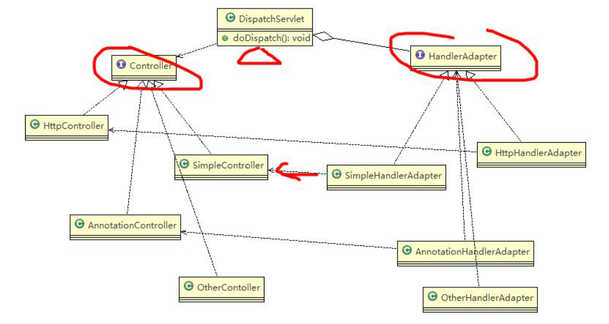
    ```java
    package com.atguigu.spring.springmvc;
    //多种Controller实现  
    public interface Controller {}
    class HttpController implements Controller {
        public void doHttpHandler() {
            System.out.println("http...");
        }
    }
    class SimpleController implements Controller {
        public void doSimplerHandler() {
            System.out.println("simple...");
        }
    }
    class AnnotationController implements Controller {
        public void doAnnotationHandler() {
            System.out.println("annotation...");
        }
    }
    //定义一个Adapter接口 
    public interface HandlerAdapter {
        public boolean supports(Object handler);
        public void handle(Object handler);
    }
    // 多种适配器类
    class SimpleHandlerAdapter implements HandlerAdapter {
        public void handle(Object handler) {
            ((SimpleController) handler).doSimplerHandler();
        }
        public boolean supports(Object handler) {
            return (handler instanceof SimpleController);
        }
    }
    class HttpHandlerAdapter implements HandlerAdapter {
        public void handle(Object handler) {
            ((HttpController) handler).doHttpHandler();
        }
        public boolean supports(Object handler) {
            return (handler instanceof HttpController);
        }
    }
    class AnnotationHandlerAdapter implements HandlerAdapter {
        public void handle(Object handler) {
            ((AnnotationController) handler).doAnnotationHandler();
        }
        public boolean supports(Object handler) {
            return (handler instanceof AnnotationController);
        }
    }
    public class DispatchServlet {
        public static List<HandlerAdapter> handlerAdapters = new ArrayList<HandlerAdapter>();
        public DispatchServlet() {
            handlerAdapters.add(new AnnotationHandlerAdapter());
            handlerAdapters.add(new HttpHandlerAdapter());
            handlerAdapters.add(new SimpleHandlerAdapter());
        }
        public void doDispatch() {
            // 此处模拟SpringMVC从request取handler的对象，
            // 适配器可以获取到希望的Controller
            HttpController controller = new HttpController();
            // AnnotationController controller = new AnnotationController();
            // SimpleController controller = new SimpleController();
            // 得到对应适配器
            HandlerAdapter adapter = getHandler(controller);
            // 通过适配器执行对应的controller对应方法
            adapter.handle(controller);
        }
        public HandlerAdapter getHandler(Controller controller) {
            // 遍历：根据得到的controller(handler), 返回对应适配器
            for (HandlerAdapter adapter : this.handlerAdapters) {
                if (adapter.supports(controller)) {
                    return adapter;
                }
            }
            return null;
        }
        public static void main(String[] args) {
            new DispatchServlet().doDispatch(); // http...
        }
    }
    ```

## 9.8 适配器模式的注意事项和细节
1. 三种命名方式，是根据 src 是以怎样的形式给到 Adapter（在 Adapter 里的形式）来命名的。
2. 分类
   1. 类适配器：以类给到，在 Adapter 里，就是将 src 当做类，继承
   2. 对象适配器：以对象给到，在 Adapter 里，将 src 作为一个对象，持有
   3. 接口适配器：以接口给到，在 Adapter 里，将 src 作为一个接口，实现
3. Adapter 模式最大的作用还是将原本不兼容的接口融合在一起工作。
4. 实际开发中，实现起来不拘泥于我们讲解的三种经典形式


# 第10章 桥接模式

## 10.1 手机操作问题
现在对不同手机类型的不同品牌实现操作编程(比如:开机、关机、上网，打电话等)，如图:
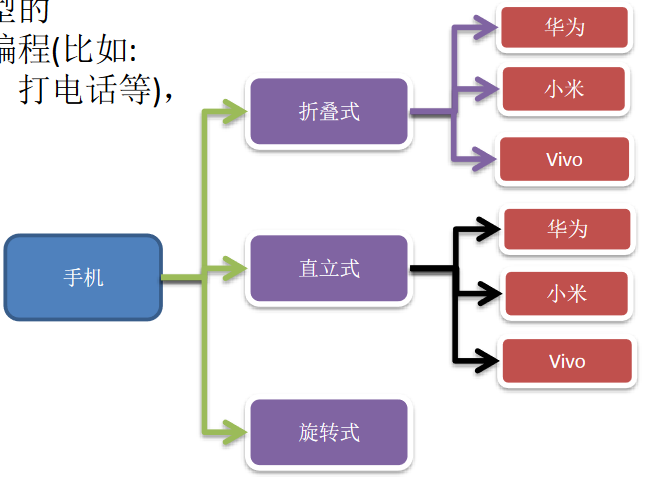

## 10.2 传统方案解决手机操作问题
传统方法对应的类图
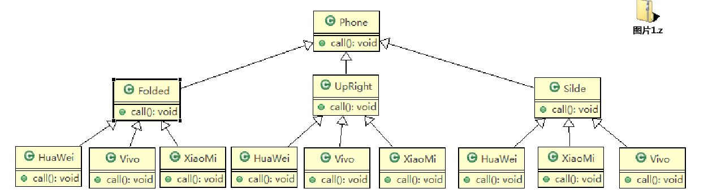

## 10.3 传统方案解决手机操作问题分析
1. 扩展性问题(类爆炸)，如果我们再增加手机的样式(旋转式)，就需要增加各个品牌手机的类，同样如果我们增加一个手机品牌，也要在各个手机样式类下增加。
2. 违反了单一职责原则，当我们增加手机样式时，要同时增加所有品牌的手机，这样增加了代码维护成本
3. 解决方案-使用桥接模式

## 10.4 桥接模式(Bridge)-基本介绍
1. 桥接模式(Bridge 模式)是指：将实现与抽象放在两个不同的类层次中，使两个层次可以独立改变。
2. 是一种结构型设计模式
3. Bridge 模式基于**类的最小设计原则**，通过使用封装、聚合及继承等行为让不同的类承担不同的职责。它的主要特点是把抽象(Abstraction)与行为实现(Implementation)分离开来，从而可以保持各部分的独立性以及应对他们的功能扩展

## 10.5 桥接模式(Bridge)-原理类图
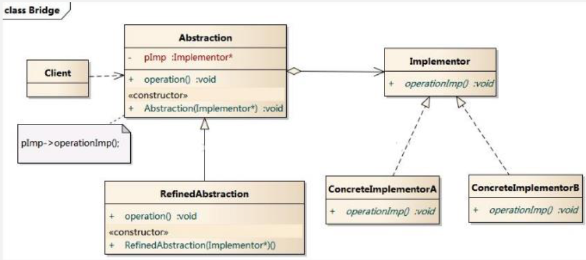

1. Client类：桥接模式的调用者
2. 抽象类(Abstraction)：维护了 Implementor / 即它的实现类 ConcreteImplementorA...，二者是聚合关系，Abstraction充当桥接类
3. RefinedAbstraction：是 Abstraction 抽象类的子类
4. Implementor：行为实现类的接口
5. ConcreteImplementorA/B：行为的具体实现类
6. 从 UML 图：这里的抽象类和接口是聚合的关系，其实调用和被调用关系

## 10.6 桥接模式解决手机操作问题
使用桥接模式改进传统方式，让程序具有搞好的扩展性，利用程序维护
1. 应用实例说明(和前面要求一样)
2. 使用桥接模式对应的类图
    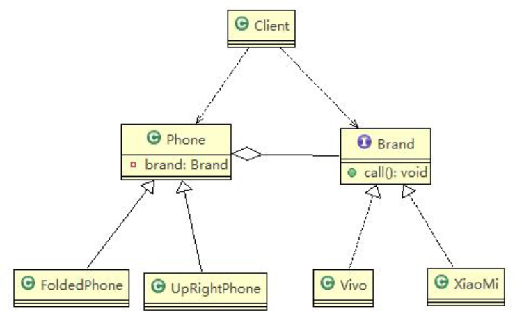
3. 代码实现
    ```java
    package com.atguigu.bridge;
    public interface Brand {
        void open();
        void close();
        void call();
    }
    public abstract class Phone {
        private Brand brand; // 组合品牌
        public Phone(Brand brand) { // 构造器
            this.brand = brand;
        }
        protected void open() {
            brand.open();
        }
        protected void close() {
            brand.close();
        }
        protected void call() {
            brand.call();
        }
    }
    public class UpRightPhone extends Phone {
        public UpRightPhone(Brand brand) {// 构造器
            super(brand);
        }
        public void open() {
            super.open();
            System.out.println(" 直立样式手机 ");
        }
        public void close() {
            super.close();
            System.out.println(" 直立样式手机 ");
        }
        public void call() {
            super.call();
            System.out.println(" 直立样式手机 ");
        }
    }
    //折叠式手机类，继承 抽象类 Phone
    public class FoldedPhone extends Phone {
        public FoldedPhone(Brand brand) {//构造器
            super(brand);
        }
        public void open() {
            super.open();
            System.out.println(" 折叠样式手机 ");
        }
        public void close() {
            super.close();
            System.out.println(" 折叠样式手机 ");
        }
        public void call() {
            super.call();
            System.out.println(" 折叠样式手机 ");
        }
    }
    public class Vivo implements Brand {
        @Override
        public void open() {
            System.out.println(" Vivo手机开机 ");
        }
        @Override
        public void close() {
            System.out.println(" Vivo手机关机 ");
        }
        @Override
        public void call() {
            System.out.println(" Vivo手机打电话 ");
        }
    }
    public class XiaoMi implements Brand {
        @Override
        public void open() {
            System.out.println(" 小米手机开机 ");
        }
        @Override
        public void close() {
            System.out.println(" 小米手机关机 ");
        }
        @Override
        public void call() {
            System.out.println(" 小米手机打电话 ");
        }
    }
    public class Client {
        public static void main(String[] args) {
            Phone phone1 = new FoldedPhone(new XiaoMi());
            phone1.open(); phone1.call(); phone1.close();
            Phone phone2 = new FoldedPhone(new Vivo());
            phone2.open(); phone2.call(); phone2.close();
            UpRightPhone phone3 = new UpRightPhone(new XiaoMi());
            phone3.open(); phone3.call(); phone3.close();
            UpRightPhone phone4 = new UpRightPhone(new Vivo());
            phone4.open(); phone4.call(); phone4.close();
        }
    }
    ```

## 10.7 桥接模式在 JDBC 的源码剖析
1. Jdbc 的 Driver 接口，如果从桥接模式来看，Driver 就是一个接口，下面可以有 MySQL 的 Driver，Oracle 的Driver，这些就可以当做实现接口类
    
2. 代码分析
    ```java
    // 在不使用Spring、Hibernate等第三方库的情况下，直接通过原生JDBC API连接MySQL数据库
    /* 该方法将返回与给定字符串名的类或接口相关联的java.lang.Class类对象，用于在程序运行时的某个时刻，由客户端调用，动态加载该类或该接口到当前线程中，若Class.forName()加载的是一个类，也会执行类中包含的static { } 静态代码段 */
    Class.forName("com.mysql.cj.jdbc.Driver"); 
    Connection conn = DriverManager.getConnection("jdbc:mysql://<host>:<port>/<database>");
    ```
- com.mysql.cj.jdbc.Driver类：MySQL将具体的java.sql.Driver接口的实现放到了NonRegisteringDriver中，com.mysql.cj.jdbc.Driver类仅包含一段静态代码，具体类图如下：
  - 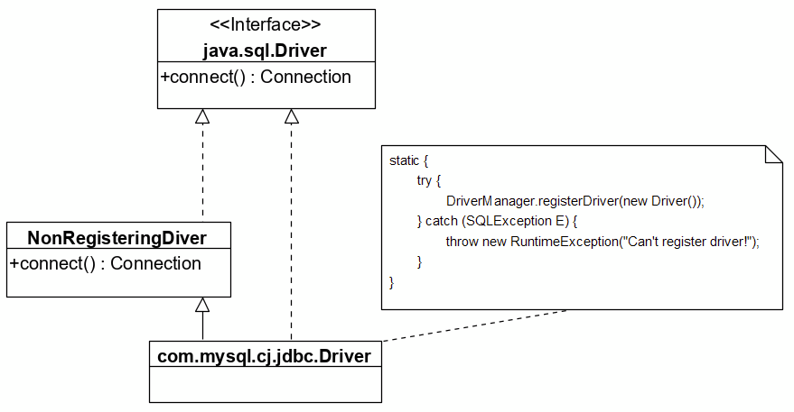
    ```java
    public class Driver extends NonRegisteringDriver implements java.sql.Driver {
        // Register ourselves with the DriverManager
        static {
            try {
                java.sql.DriverManager.registerDriver(new Driver());
            } catch (SQLException E) {
                throw new RuntimeException("Can't register driver!");
            }
        }
        public Driver() throws SQLException {
            // Required for Class.forName().newInstance()
        }
    }
    ```
  - 其中最关键的是静态代码段中的 `DriverManager.registerDriver(new Driver())` ，它会在客户端调用Class.forName()方法加载com.mysql.cj.jdbc.Driver类的同时被执行，Driver类自身的一个实例被注册到DriverManager（即保存到DriverManager的静态字段registeredDrivers内），注册过程的源码如下：
    ```java
    public static synchronized void registerDriver(java.sql.Driver driver, DriverAction da) throws SQLException {
        /* Register the driver if it has not already been added to our list */
        if(driver != null) {
            registeredDrivers.addIfAbsent(new DriverInfo(driver, da));
        } else {
            // This is for compatibility with the original DriverManager
            throw new NullPointerException();
        }
        println("registerDriver: " + driver);
    }
    ```
  - registeredDrivers静态字段的类型是实现了List接口的CopyOnWriteArrayList类，它能够保存进一步封装java.sql.Driver接口的DriverInfo类实例，DriverInfo类的声明代码如下：
    ```java
    class DriverInfo {
        final Driver driver;
        DriverAction da;
        DriverInfo(Driver driver, DriverAction action) {
            this.driver = driver;
            da = action;
        }
        /* DriverInfo还包装了DriverAction，DriverAction会在Driver被取消注册时被调用，DriverAction的源码注释如下：
        The JDBC driver's static initialization block must call DriverManager.registerDriver(Driver, DriverAction) in order to inform DriverManager which DriverAction implementation to call when the JDBC driver is de-registered.
        MySQL的Driver在向DriverManager进行注册时，DriverAction被设置为null  */
        // ...
    }
    ```
- DriverManager类：由上面的分析可得，Class.forName()方法调用后，com.mysql.cj.jdbc.Driver类被加载，并执行static { } 静态代码段，将com.mysql.cj.jdbc.Driver类实例注册到DriverManager中。然后，客户端会调用DriverManager.getConnection()方法获取一个Connection数据库连接实例，该方法的部分源码如下： 
    ```java
    @CallerSensitive
    public static Connection getConnection(String url, java.util.Properties info) throws SQLException {
        return (getConnection(url, info, Reflection.getCallerClass()));
    }
    @CallerSensitive
    public static Connection getConnection(String url,
        String user, String password) throws SQLException {
        java.util.Properties info = new java.util.Properties();
        if (user != null) {
            info.put("user", user);
        }
        if (password != null) {
            info.put("password", password);
        }
        return (getConnection(url, info, Reflection.getCallerClass()));
    }
    @CallerSensitive
    public static Connection getConnection(String url) throws SQLException {
        java.util.Properties info = new java.util.Properties();
        return (getConnection(url, info, Reflection.getCallerClass()));
    }
    private static Connection getConnection(
        String url, java.util.Properties info, Class<?> caller) throws SQLException {
        /*
        * When callerCl is null, we should check the application's
        * (which is invoking this class indirectly)
        * classloader, so that the JDBC driver class outside rt.jar
        * can be loaded from here.
        */
        ClassLoader callerCL = caller != null ? caller.getClassLoader() : null;
        if (callerCL == null || callerCL == ClassLoader.getPlatformClassLoader()) {
            callerCL = Thread.currentThread().getContextClassLoader();
        }
        if (url == null) {
            throw new SQLException("The url cannot be null", "08001");
        }
        println("DriverManager.getConnection(\"" + url + "\")");
        ensureDriversInitialized();
        // Walk through the loaded registeredDrivers attempting to make a connection.
        // Remember the first exception that gets raised so we can reraise it.
        SQLException reason = null;
        // DriverManager.getConnection()方法会遍历registeredDrivers静态字段，获取字段内保存的每一个Driver来尝试响应客户端的数据库连接请求，若所有Driver都连接数据库失败，则提示连接失败信息 
        for (DriverInfo aDriver : registeredDrivers) {
            // If the caller does not have permission to load the driver then
            // skip it.
            if (isDriverAllowed(aDriver.driver, callerCL)) {
                try {
                    println("    trying " + aDriver.driver.getClass().getName());
                    Connection con = aDriver.driver.connect(url, info);
                    if (con != null) {
                        // Success!
                        println("getConnection returning " + aDriver.driver.getClass().getName());
                        return (con);
                    }
                } catch (SQLException ex) {
                    if (reason == null) {
                        reason = ex;
                    }
                }
            } else {
                println("    skipping: " + aDriver.driver.getClass().getName());
            }
        }
        // if we got here nobody could connect.
        if (reason != null)    {
            println("getConnection failed: " + reason);
            throw reason;
        }
        println("getConnection: no suitable driver found for "+ url);
        throw new SQLException("No suitable driver found for "+ url, "08001");
    }
    // ...
    ```
- Connection接口：Connection代表和特定数据库的连接会话，能够执行SQL语句并在连接的上下文中返回执行结果。因此，DriverManager.getConnection()方法返回的Connection数据库连接实例根据不同的数据库有不同的实现，MySQL的Connection接口实现关系如下： 
  - 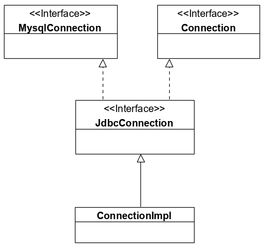

源码类图
- 根据源码的分析，绘制类图如下： 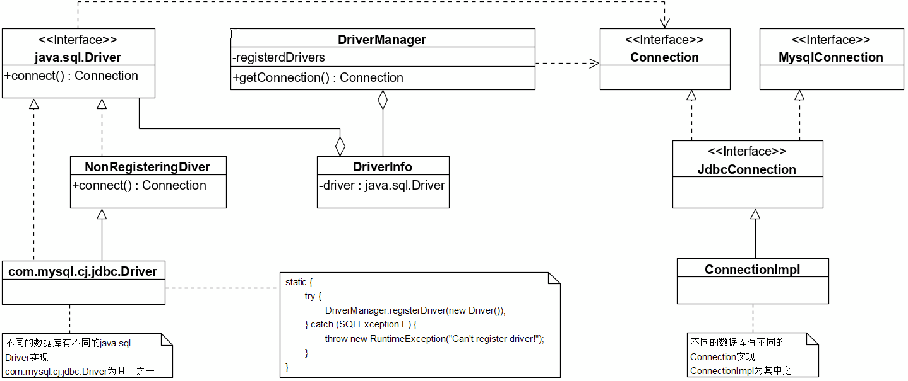
- 对Driver和Connection进行抽象，绘制类图如下： 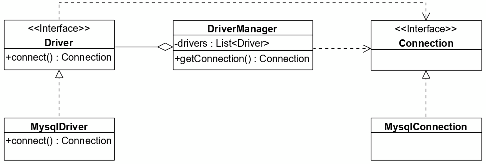
- 模式体现：桥接模式通过组合/聚合关系代替继承关系，实现抽象化和实现化部分的解耦。以上述JDBC在MySQL中的简略类图为例，抽象化部分有Driver接口和Connection接口，实现化部分有DriverManager。对于不同的数据库，Driver接口和Connection接口都有自己独特的实现类。
- 但是，和Driver接口不同的是，Connection接口与DriverManager类的关系只是联系较弱的依赖关系，并不符合桥接模式的定义和特点。因此，在考虑桥接模式的情况下，可以再次将类图进行简化： 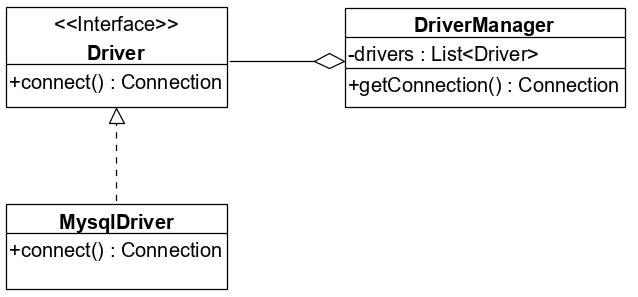
- 将其它数据库的Driver接口实现也考虑在内，绘制类图如下： 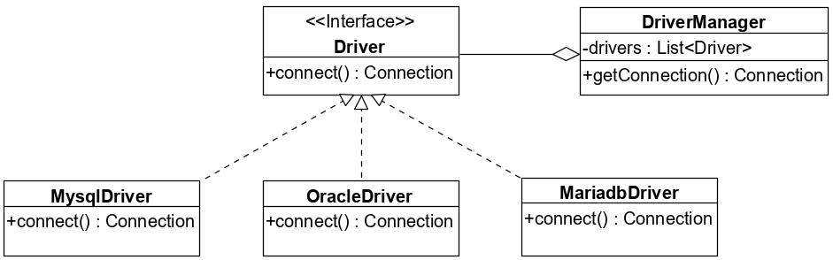
- 桥接模式中的实现化(Implementor)角色对应上图的Driver接口，具体实现化(Concrete Implementor)角色对应MysqlDriver、OracleDriver和MariadbDriver，扩展抽象化 (Refined Abstraction)角色对应DriverManager，不具有抽象化(Abstraction)角色作为扩展抽象化角色的父类
- 桥接模式的主要应用场景是某个类存在两个独立变化的维度，且这两个维度都需要进行扩展，而现在仅有Driver一个变化维度，DriverManager没有抽象化父类，它本身也没有任何子类，因此我认为，在JDBC中，是一种简化的桥接模式 —— 观点一。
- 倘若JDBC针对Connection接口的设计不是将它作为Driver和DriverManager的"依赖"来处理，而是也作为一个变化的维度加入到桥接模式，或许能够更好地体现JDBC对桥接模式的实现，一种"假想"的桥接模式如下： 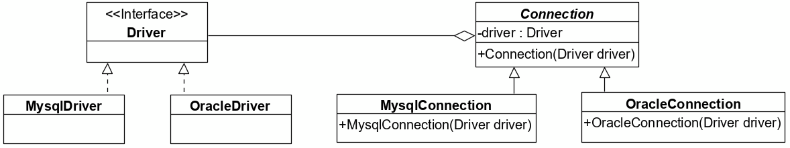

## 10.8 桥接模式的注意事项和细节
桥接模式的注意事项和细节
1. 实现了抽象和实现部分的分离，从而极大的提供了系统的灵活性，让抽象部分和实现部分独立开来，这有助于系统进行分层设计，从而产生更好的结构化系统。
2. 对于系统的高层部分，只需要知道抽象部分和实现部分的接口就可以了，其它的部分由具体业务来完成。
3. 桥接模式替代多层继承方案，可以减少子类的个数，降低系统的管理和维护成本。
4. 桥接模式的引入增加了系统的理解和设计难度，由于聚合关联关系建立在抽象层，要求开发者针对抽象进行设计和编程
5. 桥接模式要求正确识别出系统中两个独立变化的维度，因此其使用范围有一定的局限性，即需要有这样的应用场景。

桥接模式其它应用场景
1. 对于那些不希望使用继承或因为多层次继承导致系统类的个数急剧增加的系统，桥接模式尤为适用.
2. 常见的应用场景：
   - JDBC驱动程序
   - 银行转账系统
     - 转账分类：网上转账，柜台转账，AMT转账
     - 转账用户类型：普通用户，银卡用户，金卡用户...
   - 消息管理
     - 消息类型：即时消息，延时消息
     - 消息分类：手机短信，邮件消息，QQ消息...


# 第11章 装饰者设计模式

## 11.1 星巴克咖啡订单项目（咖啡馆）
1. 咖啡种类/单品咖啡：Espresso(意大利浓咖啡)、ShortBlack、LongBlack(美式咖啡)、Decaf(无因咖啡)
2. 调料：Milk、Soy(豆浆)、Chocolate
3. 要求在扩展新的咖啡种类时，具有良好的扩展性、改动方便、维护方便
4. 使用 OO 的来计算不同种类咖啡的费用: 客户可以点单品咖啡，也可以单品咖啡+调料组合。

## 11.2 方案1-解决星巴克咖啡订单项目(较差)


## 11.3 方案1-解决星巴克咖啡订单问题分析
1. Drink 是一个抽象类，表示饮料
2. des 就是对咖啡的描述，比如咖啡的名字
3. cost() 方法就是计算费用，Drink 类中做成一个抽象方法.
4. Decaf 就是单品咖啡， 继承 Drink，并实现 cost
5. Espress && Milk 就是单品咖啡+调料，这个组合很多
6. 问题：这样设计，会有很多类，当我们增加一个单品咖啡，或者一个新的调料，类的数量就会倍增，就会出现**类爆炸**

## 11.4 方案2-解决星巴克咖啡订单(好点)
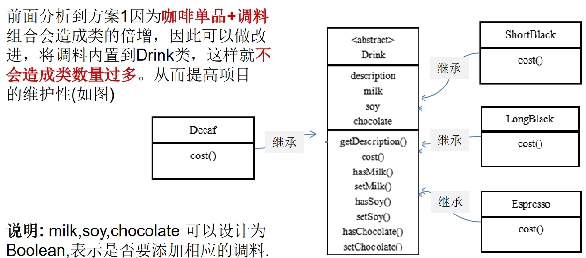

## 11.5 方案2-解决星巴克咖啡订单问题分析
1. 方案2 可以控制类的数量，不至于造成很多的类
2. 在增加或者删除调料种类时，代码的维护量很大
3. 考虑到用户可以添加多份调料时，可以将 hasMilk 返回一个对应 int
4. 考虑使用 **装饰者** 模式

## 11.6 装饰者模式定义
1. 装饰者模式：动态的将新功能附加到对象上。在对象功能扩展方面，它比继承更有弹性，装饰者模式也体现了开闭原则(ocp)
2. 这里提到的动态的将新功能附加到对象和 ocp 原则，在后面的应用实例上会以代码的形式体现，请同学们注意体会。

## 11.7 装饰者模式原理
1. 装饰者模式就像打包一个快递
   1. 主体：比如：陶瓷、衣服 (Component) // 被装饰者
   2. 包装：比如：报纸填充、塑料泡沫、纸板、木板(Decorator)
2. Component 主体：比如类似前面的 Drink
3. ConcreteComponent（具体的主体，比如前面的各个单品咖啡） 和 Decorator
4. Decorator 装饰者：比如各调料。在如图的 Component 与 ConcreteComponent 之间，如果 ConcreteComponent 类很多，还可以设计一个缓冲层，将共有的部分提取出来，抽象层一个类。
    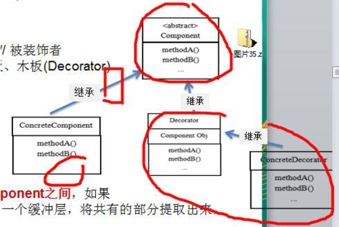

## 11.8 装饰者模式解决星巴克咖啡订单
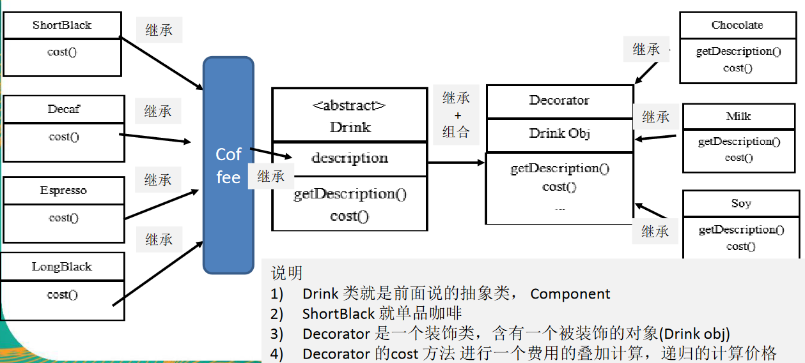

## 11.9 装饰者模式下的订单：2 份巧克力+一份牛奶的LongBlack
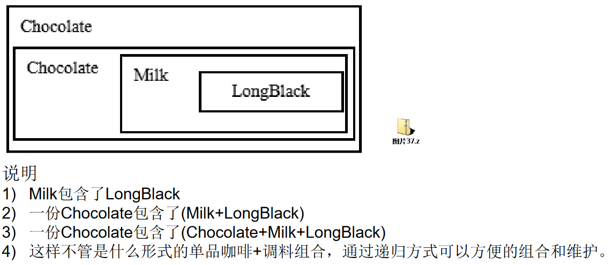

## 11.10 装饰者模式咖啡订单项目应用实例
```java
package com.atguigu.decorator;
public abstract class Drink { // 被装饰者
	public String des; // 描述
	private float price = 0.0f;
	// getter setter
	// 计算费用的抽象方法，子类来实现
	public abstract float cost();
}
public class Coffee extends Drink {
	@Override
	public float cost() {
		return super.getPrice();
	}
}
public class Espresso extends Coffee {
	public Espresso() {
		setDes("意大利咖啡");
		setPrice(6.0f);
	}
}
public class DeCaf extends Coffee {
	public DeCaf() {
		setDes("无因咖啡");
		setPrice(1.0f);
	}
}
public class LongBlack extends Coffee {
	public LongBlack() {
		setDes("longblack");
		setPrice(5.0f);
	}
}
public class ShortBlack extends Coffee{
	public ShortBlack() {
		setDes("shortblack");
		setPrice(4.0f);
	}
}

public class Decorator extends Drink { // 装饰着
	private Drink obj;
	public Decorator(Drink obj) { // 组合
		this.obj = obj;
	}
	@Override
	public float cost() {
		// getPrice 自己价格
		return super.getPrice() + obj.cost();
	}
	@Override
	public String getDes() {
		// obj.getDes() 输出被装饰者的信息
		return des + " " + getPrice() + " && " + obj.getDes();
	}
}
public class Chocolate extends Decorator {// 具体的Decorator，这里就是调味品
	public Chocolate(Drink obj) {
		super(obj);
		setDes("巧克力");
		setPrice(3.0f); // 调味品 的价格
	}
}
public class Milk extends Decorator {
	public Milk(Drink obj) {
		super(obj);
		setDes("牛奶");
		setPrice(2.0f); 
	}
}
public class Soy extends Decorator{
	public Soy(Drink obj) {
		super(obj);
		setDes("豆浆");
		setPrice(1.5f);
	}
}
public class CoffeeBar {
    Drink order = new LongBlack();
    order = new Milk(order);
    order = new Chocolate(order);
    Drink order2 = new Milk(new DeCaf());
}
```

## 11.11 装饰者模式在 JDK 应用的源码分析
Java的IO结构，FilterInputStream就是一个装饰者
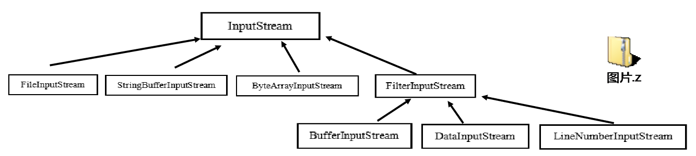

```java
package com.atguigu.jdk;
public class Decorator {
	public static void main(String[] args) throws Exception {
		// 说明:
		// 1. InputStream 是抽象类, 类似我们前面讲的 Drink
		// 2. FileInputStream 是 InputStream 子类，类似我们前面的 DeCaf, LongBlack
		// 3. FilterInputStream 是 InputStream 子类：类似我们前面 的 Decorator 修饰者
		// 4. DataInputStream 是 FilterInputStream 子类，具体的修饰者，类似前面的 Milk, Soy 等
		// 5. FilterInputStream 类 有 protected volatile InputStream in; 即含被装饰者
		// 6. 分析得出在jdk 的io体系中，就是使用装饰者模式
		DataInputStream dis = new DataInputStream(new FileInputStream("d:\\abc.txt"));
		System.out.println(dis.read());
		dis.close();
	}
}
```
```java
package java.io;
public class FilterInputStream extends InputStream { // 装饰者
    protected volatile InputStream in; // 被装饰者
    protected FilterInputStream(InputStream in) {
        this.in = in;
    }
    // ...
}
public class DataInputStream extends FilterInputStream implements DataInput {
    public DataInputStream(InputStream in) {
        super(in);
    }
    // ...
}
public class BufferedInputStream extends FilterInputStream {
    public BufferedInputStream(InputStream in) {
        this(in, DEFAULT_BUFFER_SIZE);
    }
    public BufferedInputStream(InputStream in, int size) {
        super(in);
        if (size <= 0) {
            throw new IllegalArgumentException("Buffer size <= 0");
        }
        buf = new byte[size];
    }
}
```


# 第12章 组合模式

## 12.1 看一个学校院系展示需求
编写程序展示一个学校院系结构：需求是这样，要在一个页面中展示出学校的院系组成，一个学校有多个学院，一个学院有多个系。
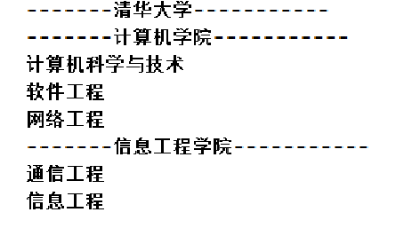

## 12.2 传统方案解决学校院系展示(类图)
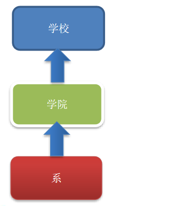

## 12.3 传统方案解决学校院系展示存在的问题分析
1. 将学院看做是学校的子类，系是学院的子类，这样实际上是站在组织大小来进行分层次的
2. 实际上我们的要求是 ：在一个页面中展示出学校的院系组成，一个学校有多个学院，一个学院有多个系， 因此这种方案，不能很好实现的管理的操作，比如对学院、系的添加，删除，遍历等
3. 解决方案：把学校、院、系都看做是组织结构，他们之间没有继承的关系，而是一个树形结构，可以更好的实现管理操作。 => 组合模式

## 12.4 组合模式基本介绍
1. 组合模式（Composite Pattern），又叫部分整体模式，它创建了对象组的树形结构，将对象组合成树状结构以表示“整体-部分”的层次关系。
2. 组合模式依据树形结构来组合对象，用来表示部分以及整体层次。
3. 这种类型的设计模式属于结构型模式。
4. 组合模式使得用户对单个对象和组合对象的访问具有一致性，即：组合能让客户以一致的方式处理个别对象以及组合对象

## 12.5 组合模式原理类图
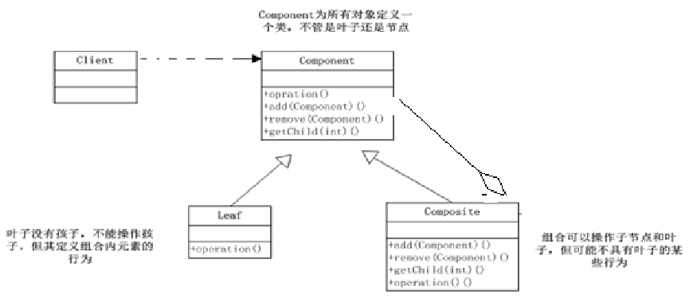

对原理结构图的说明-即(组合模式的角色及职责)
1. Component：这是组合中对象声明接口，在适当情况下，实现所有类共有的接口默认行为，用于访问和管理Component 子部件，Component 可以是抽象类或者接口
2. Leaf：在组合中表示叶子节点，叶子节点没有子节点
3. Composite：非叶子节点，用于存储子部件，在 Component 接口中实现 子部件的相关操作，比如增加(add)，删除。

## 12.6 组合模式解决学校院系展示的应用实例
1. 编写程序展示一个学校院系结构：需求是这样，要在一个页面中展示出学校的院系组成，一个学校有多个学院，一个学院有多个系。
2. 思路分析和图解(类图)
    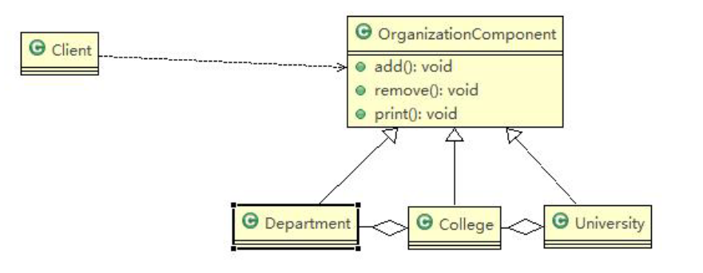
3. 代码实现
    ```java
    package com.atguigu.composite;
    public abstract class OrganizationComponent {
        private String name; // 名字
        private String des; // 说明
        protected void add(OrganizationComponent organizationComponent) {
            throw new UnsupportedOperationException();// 默认实现
        }
        protected void remove(OrganizationComponent organizationComponent) {
            throw new UnsupportedOperationException();// 默认实现
        }
        public OrganizationComponent(String name, String des) {// 构造器
            this.name = name;
            this.des = des;
        }
        // getter/setter
        // 方法print，做成抽象的，子类都需要实现
        protected abstract void print();
    }
    //University 就是 Composite，可以管理College
    public class University extends OrganizationComponent {
        List<OrganizationComponent> organizationComponents = new ArrayList<OrganizationComponent>();
        public University(String name, String des) {// 构造器
            super(name, des);
        }
        @Override
        protected void add(OrganizationComponent organizationComponent) {
            organizationComponents.add(organizationComponent);
        }
        @Override
        protected void remove(OrganizationComponent organizationComponent) {
            organizationComponents.remove(organizationComponent);
        }
        // 重写getName、getDes调用父类的相应方法
        @Override
        protected void print() {
            System.out.println("--------------" + getName() + "--------------");
            // 遍历 organizationComponents
            for (OrganizationComponent organizationComponent : organizationComponents) {
                organizationComponent.print();
            }
        }
    }
    public class College extends OrganizationComponent {
        // List中存放的Department
        List<OrganizationComponent> organizationComponents = new ArrayList<OrganizationComponent>();
        public College(String name, String des) {
            super(name, des);
        }
        @Override
        protected void add(OrganizationComponent organizationComponent) {
            // 将来实际业务中，Colleage 的 add 和 University add 不一定完全一样
            organizationComponents.add(organizationComponent);
        }
        @Override
        protected void remove(OrganizationComponent organizationComponent) {
            organizationComponents.remove(organizationComponent);
        }
        // 重写getName、getDes调用父类的相应方法
        @Override
        protected void print() {
            System.out.println("--------------" + getName() + "--------------");
            // 遍历 organizationComponents
            for (OrganizationComponent organizationComponent : organizationComponents) {
                organizationComponent.print();
            }
        }
    }
    public class Department extends OrganizationComponent {
        // 叶子节点没有集合也没有add、remove
        public Department(String name, String des) {
            super(name, des);
        }
        // 重写getName、getDes调用父类的相应方法
        @Override
        protected void print() {
            System.out.println(getName());
        }
    }
    public class Client {
        public static void main(String[] args) {
            // 从大到小创建对象 学校
            OrganizationComponent university = new University("清华大学", " 中国顶级大学 ");
            // 创建 学院
            OrganizationComponent computerCollege = new College("计算机学院", " 计算机学院 ");
            OrganizationComponent infoEngineercollege = new College("信息工程学院", " 信息工程学院 ");
            // 创建各个学院下面的系(专业)
            computerCollege.add(new Department("软件工程", " 软件工程不错 "));
            computerCollege.add(new Department("网络工程", " 网络工程不错 "));
            computerCollege.add(new Department("计算机科学与技术", " 计算机科学与技术是老牌的专业 "));
            infoEngineercollege.add(new Department("通信工程", " 通信工程不好学 "));
            infoEngineercollege.add(new Department("信息工程", " 信息工程好学 "));
            // 将学院加入到 学校
            university.add(computerCollege);
            university.add(infoEngineercollege);

            university.print();
        }
    }
    ```

## 12.7 组合模式在JDK集合的源码分析
1. Java 的集合类-HashMap 就使用了组合模式
2. 代码分析 + Debug源码
    ```java
    package com.atguigu.jdk;
    public class Composite {
        public static void main(String[] args) {
            // 说明
            // 1. Map 就是一个抽象的构建 (类似我们的Component)
            // 2. HashMap是一个中间的构建(Composite), 实现/继承了相关方法
            // put, putall
            // 3. Node 是 HashMap的静态内部类，类似Leaf叶子节点, 这里就没有put, putall
            // static class Node<K,V> implements Map.Entry<K,V>
            Map<Integer, String> hashMap = new HashMap<Integer, String>();
            hashMap.put(0, "东游记");// 直接存放叶子节点(Node)

            Map<Integer, String> map = new HashMap<Integer, String>();
            map.put(1, "西游记");
            map.put(2, "红楼梦"); // ..
            hashMap.putAll(map);
            System.out.println(hashMap);
        }
    }
    ```
    ```java
    package java.util;
    public interface Map<K, V> {
        V get(Object key);
        V put(K key, V value);
        V remove(Object key);
        void putAll(Map<? extends K, ? extends V> m);
        // ...
    }
    public abstract class AbstractMap<K,V> implements Map<K,V> {
        public V get(Object key) {
            Iterator<Entry<K,V>> i = entrySet().iterator();
            if (key==null) {
                while (i.hasNext()) {
                    Entry<K,V> e = i.next();
                    if (e.getKey()==null)
                        return e.getValue();
                }
            } else {
                while (i.hasNext()) {
                    Entry<K,V> e = i.next();
                    if (key.equals(e.getKey()))
                        return e.getValue();
                }
            }
            return null;
        }
        public V put(K key, V value) {
            throw new UnsupportedOperationException();
        }
        public V remove(Object key) {
            Iterator<Entry<K,V>> i = entrySet().iterator();
            Entry<K,V> correctEntry = null;
            if (key==null) {
                while (correctEntry==null && i.hasNext()) {
                    Entry<K,V> e = i.next();
                    if (e.getKey()==null)
                        correctEntry = e;
                }
            } else {
                while (correctEntry==null && i.hasNext()) {
                    Entry<K,V> e = i.next();
                    if (key.equals(e.getKey()))
                        correctEntry = e;
                }
            }
            V oldValue = null;
            if (correctEntry !=null) {
                oldValue = correctEntry.getValue();
                i.remove();
            }
            return oldValue;
        }
        public void putAll(Map<? extends K, ? extends V> m) {
            for (Map.Entry<? extends K, ? extends V> e : m.entrySet())
                put(e.getKey(), e.getValue());
        }
        // ...
    }
    public class HashMap<K,V> extends AbstractMap<K,V> implements Map<K,V>, Cloneable, Serializable {
        static class Node<K,V> implements Map.Entry<K,V> {
            final int hash;
            final K key;
            V value;
            Node<K,V> next;
            Node(int hash, K key, V value, Node<K,V> next) {
                this.hash = hash;
                this.key = key;
                this.value = value;
                this.next = next;
            }
            public final K getKey()        { return key; }
            public final V getValue()      { return value; }
            public final String toString() { return key + "=" + value; }
            public final int hashCode() {
                return Objects.hashCode(key) ^ Objects.hashCode(value);
            }
            public final V setValue(V newValue) {
                V oldValue = value;
                value = newValue;
                return oldValue;
            }
            public final boolean equals(Object o) {
                if (o == this)
                    return true;
                return o instanceof Map.Entry<?, ?> e
                        && Objects.equals(key, e.getKey())
                        && Objects.equals(value, e.getValue());
            }
        }
        // ...
    }
    ```
3. 类图
    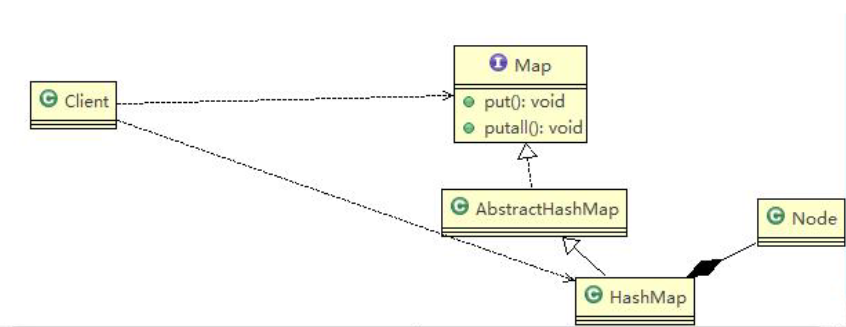

## 12.8 组合模式的注意事项和细节
1. 简化客户端操作。客户端只需要面对一致的对象而不用考虑整体部分或者节点叶子的问题。
2. 具有较强的扩展性。当我们要更改组合对象时，我们只需要调整内部的层次关系，客户端不用做出任何改动。
3. 方便创建出复杂的层次结构。客户端不用理会组合里面的组成细节，容易添加节点或者叶子从而创建出复杂的树形结构
4. 需要遍历组织机构，或者处理的对象具有树形结构时，非常适合使用组合模式。
5. 要求较高的抽象性，**如果节点和叶子有很多差异性的话**，比如很多方法和属性都不一样，不适合使用组合模式


# 第13章 外观模式

## 13.1 影院管理项目
组建一个家庭影院：
DVD 播放器、投影仪、自动屏幕、环绕立体声、爆米花机,要求完成使用家庭影院的功能，其过程为：
- 直接用遥控器：统筹各设备开关
- 开爆米花机
- 放下屏幕
- 开投影仪
- 开音响
- 开 DVD，选 dvd
- 去拿爆米花
- 调暗灯光
- 播放
- 观影结束后，关闭各种设备

## 13.2 传统方式解决影院管理
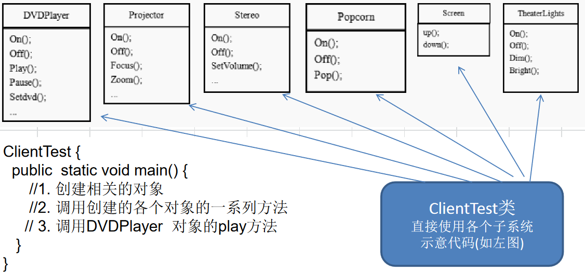

## 13.3 传统方式解决影院管理问题分析
1. 在 ClientTest 的 main 方法中，创建各个子系统的对象，并直接去调用子系统(对象)相关方法，会造成调用过程混乱，没有清晰的过程
2. 不利于在 ClientTest 中，去维护对子系统的操作
3. 解决思路：定义一个高层接口，给子系统中的一组接口提供一个**一致的界面(比如在高层接口提供四个方法 ready, play, pause, end )**，用来访问子系统中的一群接口
4. **也就是说**就是通过定义一个一致的接口(界面类)，用以屏蔽内部子系统的细节，使得调用端只需跟这个接口发生调用，而无需关心这个子系统的内部细节 => **外观模式**

## 13.4 外观模式基本介绍
1. 外观模式（Facade），也叫**过程模式**：外观模式为子系统中的一组接口**提供一个一致的界面**，此模式定义了一个高层接口，这个接口使得这一子系统更加容易使用
2. 外观模式通过定义一个一致的接口，用以**屏蔽内部子系统的细节**，使得**调用端只需跟这个接口发生调用**，而无需关心这个子系统的内部细节

## 13.5 外观模式原理类图
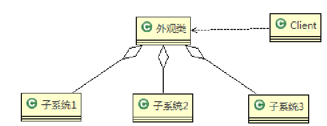

对类图说明(分类外观模式的角色)
1. 外观类(Facade)：为调用端提供统一的调用接口，外观类知道哪些子系统负责处理请求，从而将调用端的请求代理给适当子系统对象
2. 调用者(Client)：外观接口的调用者
3. 子系统的集合：指模块或者子系统，处理 Facade 对象指派的任务，他是功能的实际提供者

## 13.6 外观模式解决影院管理

### 13.6.1 传统方式解决影院管理说明
1. 外观模式可以理解为转换一群接口，客户只要调用一个接口，而不用调用多个接口才能达到目的。比如：在 pc 上安装软件的时候经常有一键安装选项（省去选择安装目录、安装的组件等等），还有就是手机的重启功能（把关机和启动合为一个操作）。
2. 外观模式就是解决多个复杂接口带来的使用困难，起到简化用户操作的作用
3. 示意图说明
    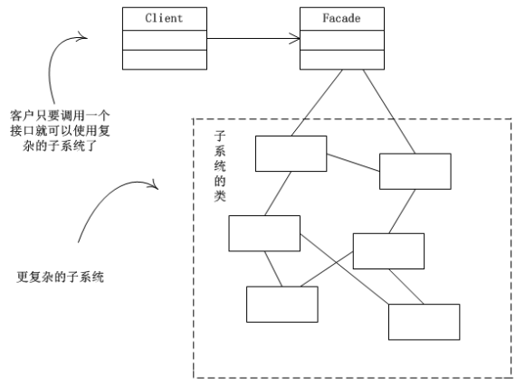

### 13.6.2 外观模式应用实例
1. 应用实例要求
2. 使用外观模式来完成家庭影院项目
3. 思路分析和图解(类图)
    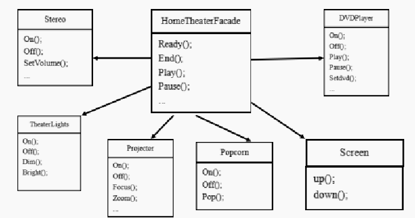
4. 代码实现
```java
package com.atguigu.facade;
public class HomeTheaterFacade { // 家庭影院
	// 定义各个子系统对象（均为单例实现，包含方法如下，定义细节略）
	private TheaterLight theaterLight;//灯光on, off, dim, bright
	private Popcorn popcorn;//爆米花机on, off, pop
	private Stereo stereo;//立体声on, off, up
	private Projector projector;//投影仪on, off, focus
	private Screen screen;//屏幕up, down
	private DVDPlayer dVDPlayer;//on, off, play, pause
	public HomeTheaterFacade() {// 构造器
		this.theaterLight = TheaterLight.getInstance();
		this.popcorn = Popcorn.getInstance();
		this.stereo = Stereo.getInstance();
		this.projector = Projector.getInstance();
		this.screen = Screen.getInstance();
		this.dVDPlayer = DVDPlayer.getInstanc();
	}
	public void ready() {
		popcorn.on();//打开爆米花机
		popcorn.pop();//爆米花
		screen.down();//屏幕放下来
		projector.on();//打开投影仪
		stereo.on();//打开立体声
		dVDPlayer.on();//打开DVD
		theaterLight.dim();//调暗灯光
	}
	public void play() {
		dVDPlayer.play();
	}
	public void pause() {
		dVDPlayer.pause();
	}
	public void end() {
		popcorn.off();//关闭爆米花机
		theaterLight.bright();//调亮灯光
		screen.up();//收起屏幕
		projector.off();//关闭投影仪
		stereo.off();//关闭立体声
		dVDPlayer.off();//关闭DVD
	}
}
public class Client {
	public static void main(String[] args) {
		HomeTheaterFacade homeTheaterFacade = new HomeTheaterFacade();
		homeTheaterFacade.ready();
		homeTheaterFacade.play();
		homeTheaterFacade.end();
	}
}
```

## 13.7 外观模式在 MyBatis 框架应用的源码分析
1. MyBatis 中的 Configuration 去创建 MetaObject 对象使用到外观模式
2. 代码分析 + Debug源码 + 示意图
    ```java
    package org.apache.ibatis.session;
    public class Configuration {
        protected ReflectorFactory reflectorFactory = new DefaultReflectorFactory();
        protected ObjectFactory objectFactory = new DefaultObjectFactory();
        protected ObjectWrapperFactory objectWrapperFactory = new DefaultObjectWrapperFactory();
        // ...
        public MetaObject newMetaObject(Object object) {
            return MetaObject.forObject(object, objectFactory, objectWrapperFactory, reflectorFactory);
        }
        // ...
    }
    ```
    ```java
    package org.apache.ibatis.reflection;
    public class MetaObject {
        private Object originalObject;
        private ObjectWrapper objectWrapper;
        private ObjectFactory objectFactory;
        private ObjectWrapperFactory objectWrapperFactory;
        private ReflectorFactory reflectorFactory;
        private MetaObject(Object object, ObjectFactory objectFactory, ObjectWrapperFactory objectWrapperFactory, ReflectorFactory reflectorFactory) {
            this.originalObject = object;
            this.objectFactory = objectFactory;
            this.objectWrapperFactory = objectWrapperFactory;
            this.reflectorFactory = reflectorFactory;
            if (object instanceof ObjectWrapper) {
                this.objectWrapper = (ObjectWrapper) object;
            } else if (objectWrapperFactory.hasWrapperFor(object)) {
                this.objectWrapper = objectWrapperFactory.getWrapperFor(this, object);
            } else if (object instanceof Map) {
                this.objectWrapper = new MapWrapper(this, (Map) object);
            } else if (object instanceof Collection) {
                this.objectWrapper = new CollectionWrapper(this, (Collection) object);
            } else {
                this.objectWrapper = new BeanWrapper(this, object);
            }
        }
        public static MetaObject forObject(Object object, ObjectFactory objectFactory, ObjectWrapperFactory objectWrapperFactory, ReflectorFactory reflectorFactory) {
            if (object == null) {
                return SystemMetaObject.NULL_META_OBJECT;
            } else {
                return new MetaObject(object, objectFactory, objectWrapperFactory, reflectorFactory);
            }
        }
    }
    ```
3. 对源码中使用到的外观模式的角色类图
    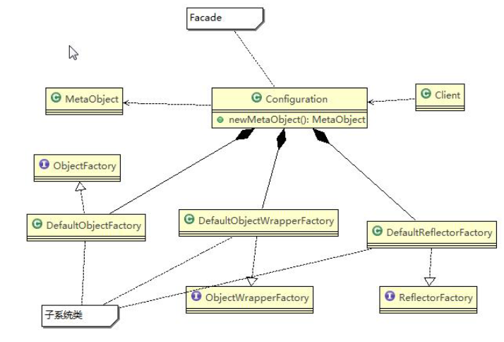

## 13.8 外观模式的注意事项和细节
1. 外观模式对外屏蔽了子系统的细节，因此外观模式降低了客户端对子系统使用的复杂性
2. 外观模式对客户端与子系统的耦合关系 - 解耦，让子系统内部的模块更易维护和扩展
3. 通过合理的使用外观模式，可以帮我们更好的划分访问的层次
4. 当系统需要进行分层设计时，可以考虑使用 Facade 模式
5. 在维护一个遗留的大型系统时，可能这个系统已经变得非常难以维护和扩展，此时可以考虑为新系统开发一个Facade 类，来提供遗留系统的比较清晰简单的接口，让新系统与 Facade 类交互，提高复用性
6. 不能过多的或者不合理的使用外观模式，使用外观模式好，还是直接调用模块好。要以让系统有层次，利于维护为目的。


# 第14章 享元模式

## 14.1 展示网站项目需求
小型的外包项目，给客户 A 做一个产品展示网站，客户 A 的朋友感觉效果不错，也希望做这样的产品展示网站，但是要求都有些不同：
1. 有客户要求以新闻的形式发布
2. 有客户人要求以博客的形式发布
3. 有客户希望以微信公众号的形式发布

## 14.2 传统方案解决网站展现项目
1. 直接复制粘贴一份，然后根据客户不同要求，进行定制修改
2. 给每个网站租用一个空间
3. 方案设计示意图
    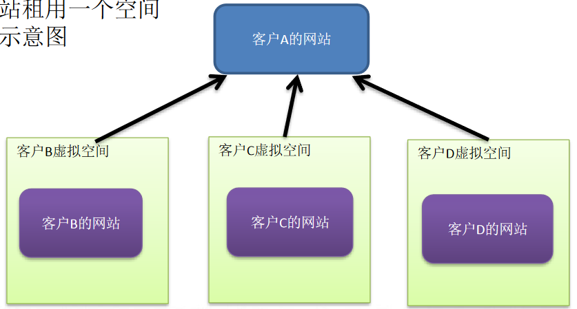

## 14.3 传统方案解决网站展现项目-问题分析
1. 需要的网站结构**相似度很高**，而且都不是高访问量网站，如果分成多个虚拟空间来处理，相当于一个相同网站的实例对象很多，造成服务器的资源浪费
2. 解决思路：整合到一个网站中，共享其相关的代码和数据，对于硬盘、内存、CPU、数据库空间等服务器资源都可以达成共享，减少服务器资源
3. 对于代码来说，由于是一份实例，维护和扩展都更加容易
4. 上面的解决思路就可以使用**享元模式**来解决

## 14.4 享元模式基本介绍
1. 享元模式（Flyweight Pattern） 也叫 **蝇量模式**：运用共享技术有效地支持大量细粒度的对象
2. 常用于系统底层开发，解决系统的性能问题。像**数据库连接池**，里面都是创建好的连接对象，在这些连接对象中有我们需要的则直接拿来用，避免重新创建，如果没有我们需要的，则创建一个
3. 享元模式能够解决**重复对象的内存浪费的问题**，当系统中有大量相似对象，需要缓冲池时。不需总是创建新对象，可以从缓冲池里拿。这样可以降低系统内存，同时提高效率
4. 享元模式**经典的应用场景**就是池技术了，String 常量池、数据库连接池、缓冲池等等都是享元模式的应用，享元模式是池技术的重要实现方式
    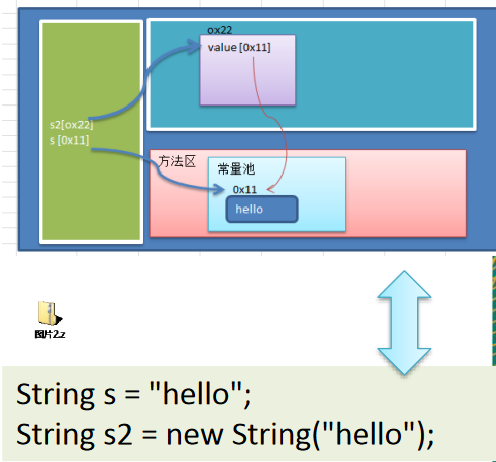

## 14.5 享元模式的原理类图
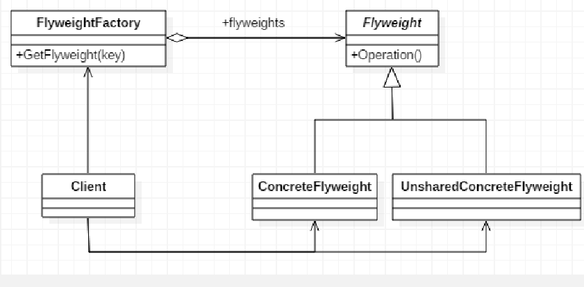

对类图的说明：对原理图的说明-即(模式的角色及职责)
1. FlyWeight 是抽象的享元角色，他是产品的抽象类，同时定义出对象的外部状态和内部状态(后面介绍) 的接口或实现
2. ConcreteFlyWeight 是具体的享元角色，是具体的产品类，实现抽象角色定义相关业务
3. UnSharedConcreteFlyWeight 是不可共享的角色，一般不会出现在享元工厂。
4. FlyWeightFactory 享元工厂类，用于构建一个池容器(集合)， 同时提供从池中获取对象方法

## 14.6 内部状态和外部状态
比如围棋、五子棋、跳棋，它们都有大量的棋子对象，围棋和五子棋只有黑白两色，跳棋颜色多一点，所以棋子颜色就是棋子的内部状态；而各个棋子之间的差别就是位置的不同，当我们落子后，落子颜色是定的，但位置是变化的，所以棋子坐标就是棋子的外部状态

1. 享元模式提出了两个要求：细粒度和共享对象。这里就涉及到内部状态和外部状态了，即将对象的信息分为两个部分：内部状态和外部状态
2. **内部状态**指对象共享出来的信息，存储在享元对象内部且不会随环境的改变而改变
3. **外部状态**指对象得以依赖的一个标记，是随环境改变而改变的、不可共享的状态。
4. 举个例子：围棋理论上有 361 个空位可以放棋子，每盘棋都有可能有两三百个棋子对象产生，因为内存空间有限，一台服务器很难支持更多的玩家玩围棋游戏，如果用享元模式来处理棋子，那么棋子对象就可以减少到只有两个实例，这样就很好的解决了对象的开销问题

## 14.7 享元模式解决网站展现项目
1. 应用实例要求：使用享元模式完成，前面提出的网站外包问题
2. 思路分析和图解(类图)
    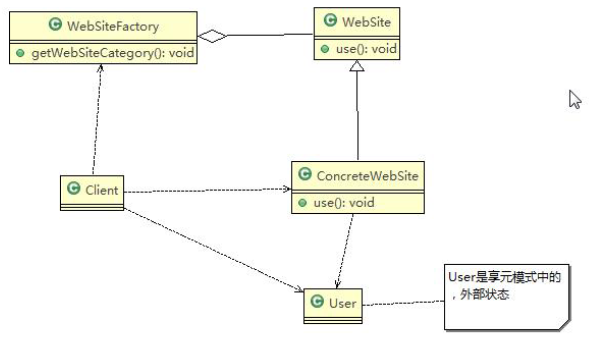
3. 代码实现
```java
package com.atguigu.flyweight;
public abstract class WebSite {
	public abstract void use(User user);// 抽象方法
}
//具体网站
public class ConcreteWebSite extends WebSite {
	// 共享的部分，内部状态
	private String type = ""; // 网站发布的形式(类型)
	public ConcreteWebSite(String type) {
		this.type = type;// 构造器
	}
	@Override
	public void use(User user) {
		System.out.println("网站的发布形式为:" + type + " 在使用中 .. 使用者是" + user.getName());
	}
}
public class User {
	private String name;
	// constructor
	// getter and setter
}
// 网站工厂类，根据需要返回压一个网站
public class WebSiteFactory {
	// 集合，充当池的作用
	private HashMap<String, ConcreteWebSite> pool = new HashMap<>();
	// 根据网站的类型，返回一个网站, 如果没有就创建一个网站，并放入到池中,并返回
	public WebSite getWebSiteCategory(String type) {
		if (!pool.containsKey(type)) {
			// 就创建一个网站，并放入到池中
			pool.put(type, new ConcreteWebSite(type));
		}
		return pool.get(type);
	}
	// 获取网站分类的总数 (池中有多少个网站类型)
	public int getWebSiteCount() {
		return pool.size();
	}
}
public class Client {
	public static void main(String[] args) {
		// 创建一个工厂类
		WebSiteFactory factory = new WebSiteFactory();
		// 客户要一个以新闻形式发布的网站
		WebSite webSite1 = factory.getWebSiteCategory("新闻");
		webSite1.use(new User("tom"));
		// 客户要一个以博客形式发布的网站
		WebSite webSite2 = factory.getWebSiteCategory("博客");
		webSite2.use(new User("jack"));
		WebSite webSite3 = factory.getWebSiteCategory("博客");
		webSite3.use(new User("smith"));
		System.out.println("网站的分类共=" + factory.getWebSiteCount());
	}
}
```

## 14.8 享元模式在 JDK-Interger 的应用源码分析
```java
package com.atguigu.jdk;
public class FlyWeight {
	public static void main(String[] args) {
		// 如果 Integer.valueOf(x) x 在 -128 --- 127 直接，就是使用享元模式返回，如果不在范围类，则仍然 new
		// 小结:
		// 1. 在valueOf 方法中，先判断值是否在 IntegerCache 中，如果不在，就创建新的Integer(new), 否则，就直接从 缓存池返回
		// 2. valueOf 方法，就使用到享元模式
		// 3. 如果使用 valueOf 方法得到一个 Integer 实例，范围在 -128 - 127 ，执行速度比 new 快
		Integer x = Integer.valueOf(127); // 得到 x 实例，类型 Integer
		// Deprecated很少适合使用此构造函数Integer(int value)。静态工厂valueOf(int)通常是更好的选择，因为它可能产生更好的空间和时间性能。
		Integer y = new Integer(127); // 得到 y 实例，类型 Integer
		Integer z = Integer.valueOf(127);// ..
		Integer w = new Integer(127);
		System.out.println(x == z); // true

		Integer x1 = Integer.valueOf(200);
		Integer x2 = Integer.valueOf(200);
		System.out.println(x1 == x2); // false
	}
}
```
```java
package java.lang;
@jdk.internal.ValueBased
public final class Integer extends Number implements Comparable<Integer>, Constable, ConstantDesc {
    @IntrinsicCandidate
    public static Integer valueOf(int i) {
        if (i >= IntegerCache.low && i <= IntegerCache.high)
            return IntegerCache.cache[i + (-IntegerCache.low)];
        return new Integer(i);
    }
    private static class IntegerCache {
        static final int low = -128;
        static final int high;
        static final Integer[] cache;
        static Integer[] archivedCache;
        static {
            int h = 127;// high value may be configured by property
            String integerCacheHighPropValue =
                VM.getSavedProperty("java.lang.Integer.IntegerCache.high");
            if (integerCacheHighPropValue != null) {
                try {
                    h = Math.max(parseInt(integerCacheHighPropValue), 127);
                    // Maximum array size is Integer.MAX_VALUE
                    h = Math.min(h, Integer.MAX_VALUE - (-low) -1);
                } catch( NumberFormatException nfe) {
                    // If the property cannot be parsed into an int, ignore it.
                }
            }
            high = h;
            // Load IntegerCache.archivedCache from archive, if possible
            CDS.initializeFromArchive(IntegerCache.class);
            int size = (high - low) + 1;
            // Use the archived cache if it exists and is large enough
            if (archivedCache == null || size > archivedCache.length) {
                Integer[] c = new Integer[size];
                int j = low;
                for(int i = 0; i < c.length; i++) {
                    c[i] = new Integer(j++);
                }
                archivedCache = c;
            }
            cache = archivedCache;
            // range [-128, 127] must be interned (JLS7 5.1.7)
            assert IntegerCache.high >= 127;
        }
        private IntegerCache() {}
    }
    // ...
}
```

## 14.9 享元模式的注意事项和细节
1. 在享元模式这样理解，“享”就表示共享，“元”表示对象
2. 系统中有大量对象，这些对象消耗大量内存，并且对象的状态大部分可以外部化时，我们就可以考虑选用享元模式
3. 用唯一标识码判断，如果在内存中有，则返回这个唯一标识码所标识的对象，用 HashMap/HashTable 存储
4. 享元模式大大**减少了对象的创建**，降低了程序内存的占用，提高效率。
5. 享元模式**提高了系统的复杂度**。需要分离出内部状态和外部状态，而外部状态具有固化特性，不应该随着内部状态的改变而改变，这是我们使用享元模式需要注意的地方。
6. 使用享元模式时，注意划分内部状态和外部状态，并且需要有一个工厂类加以控制。
7. 享元模式经典的应用场景是需要缓冲池的场景，比如 String 常量池、数据库连接池


# 第 15 章代理模式

## 15.1 代理模式(Proxy)

### 15.1.1 代理模式的基本介绍
1. 代理模式：为一个对象提供一个替身，以控制对这个对象的访问。即通过代理对象访问目标对象.这样做的好处是:可以在目标对象实现的基础上，增强额外的功能操作，即扩展目标对象的功能。
2. 被代理的对象可以是远程对象、创建开销大的对象或需要安全控制的对象
3. 代理模式有不同的形式，主要有三种 **静态代理**、**动态代理** (JDK 代理、接口代理)和 **Cglib代理** (可以在内存动态的创建对象，而不需要实现接口，他是属于动态代理的范畴) 。
4. 代理模式示意图
    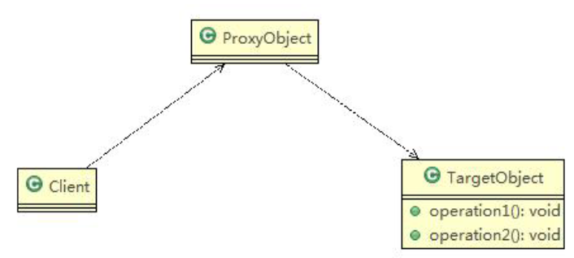

## 15.2 静态代理

### 15.2.1 静态代码模式的基本介绍
静态代理在使用时，需要定义接口或者父类，被代理对象(即目标对象)与代理对象一起实现相同的接口或者是继承相同父类

### 15.2.2 应用实例
1. 定义一个接口：ITeacherDao
2. 目标对象 TeacherDAO 实现接口 ITeacherDAO
3. 使用静态代理方式，就需要在代理对象 TeacherDAOProxy 中也实现 ITeacherDAO
4. 调用的时候通过调用代理对象的方法来调用目标对象.
5. 特别提醒：代理对象与目标对象要实现相同的接口，然后通过调用相同的方法来调用目标对象的方法

思路分析图解(类图)
    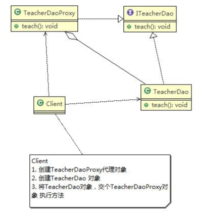

代码实现
```java
package com.atguigu.proxy.staticproxy;
public interface ITeacherDao {//接口
	void teach(); // 授课的方法
}
public class TeacherDao implements ITeacherDao {
	@Override //Data Access Object（数据访问对象）
	public void teach() {
		System.out.println("老师授课中...");
	}
}
//代理对象，静态代理
public class TeacherDaoProxy implements ITeacherDao {
	private ITeacherDao target; // 目标对象，通过接口来聚合
	public TeacherDaoProxy(ITeacherDao target) {
		this.target = target;
	}
	@Override
	public void teach() {
		System.out.println("开始代理 完成某些操作...");// 方法
		target.teach();
		System.out.println("提交...");// 方法
	}
}
public class Client {
	public static void main(String[] args) {
		// 创建目标对象(被代理对象)
		TeacherDao teacherDao = new TeacherDao();
		// 创建代理对象，同时将被代理对象传递给代理对象
		TeacherDaoProxy teacherDaoProxy = new TeacherDaoProxy(teacherDao);
		// 通过代理对象，调用到被代理对象的方法
		// 即：执行的是代理对象的方法，代理对象再去调用目标对象的方法
		teacherDaoProxy.teach();
	}
}
```

### 15.2.3 静态代理优缺点
1. 优点：在不修改目标对象的功能前提下，能通过代理对象对目标功能扩展
2. 缺点：因为代理对象需要与目标对象实现一样的接口，所以会有很多代理类
3. 一旦接口增加方法，目标对象与代理对象都要维护

## 15.3 动态代理

### 15.3.1 动态代理模式的基本介绍
1. 代理对象，不需要实现接口，但是目标对象要实现接口，否则不能用动态代理
2. 代理对象的生成，是利用 JDK 的 API，动态的在内存中构建代理对象
3. 动态代理也叫做：JDK 代理、接口代理

### 15.3.2 JDK 中生成代理对象的 API
1. 代理类所在包：`java.lang.reflect.Proxy`
2. JDK 实现代理只需要使用 newProxyInstance 方法，但是该方法需要接收三个参数，完整的写法是：
    ```java
    static Object newProxyInstance(ClassLoader loader, Class<?>[] interfaces, InvocationHandler h)
    ```

### 15.3.3 动态代理应用实例
1. 应用实例要求：将前面的静态代理改进成动态代理模式(即：JDK 代理模式)
2. 思路图解(类图)
    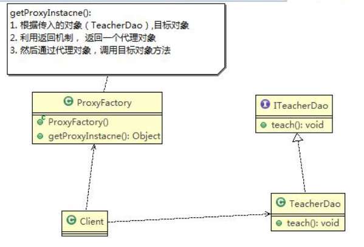
3. 代码实现
    ```java
    package com.atguigu.proxy.dynamic;
    public interface ITeacherDao {// 接口
        void teach(); // 授课方法
        void sayHello(String name);
    }
    public class TeacherDao implements ITeacherDao {
        @Override
        public void teach() {
            System.out.println("老师授课中...");
        }
        @Override
        public void sayHello(String name) {
            System.out.println("hello " + name);
        }
    }
    public class ProxyFactory {
        // 维护一个目标对象，Object
        private Object target;
        // 构造器，对target 进行初始化
        public ProxyFactory(Object target) {
            this.target = target;
        }
        // 给目标对象 生成一个代理对象
        public Object getProxyInstance() {
            return Proxy.newProxyInstance(target.getClass().getClassLoader(),
                    target.getClass().getInterfaces(),
                    new InvocationHandler() {
                        @Override
                        public Object invoke(Object proxy, Method method, Object[] args) throws Throwable {
                            System.out.println("JDK代理开始~~");
                            // 反射机制调用目标对象的方法
                            Object returnVal = method.invoke(target, args);
                            System.out.println("JDK代理提交");
                            return returnVal;
                        }
                    });
        }
    }
    public class Client {
        public static void main(String[] args) {
            // 创建目标对象
            ITeacherDao target = new TeacherDao();
            // 给目标对象，创建代理对象, 可以转成 ITeacherDao
            ITeacherDao proxyInstance = (ITeacherDao) new ProxyFactory(target).getProxyInstance();
            // proxyInstance=class com.sun.proxy.$Proxy0 内存中动态生成了代理对象
            System.out.println("proxyInstance=" + proxyInstance.getClass());
            // 通过代理对象，调用目标对象的方法
            proxyInstance.teach();
            proxyInstance.sayHello("tom");
        }
    }
    ```
    ```java
    package java.lang.reflect;
    public class Proxy implements java.io.Serializable {
        // 1. ClassLoader loader：指定当前目标对象使用的类加载器，获取加载器的方法固定
        // 2. Class<?>[] interfaces：目标对象实现的接口类型，使用泛型方法确认类型
        // 3. InvocationHandler h：事情处理，执行目标对象的方法时，会触发事情处理器方法，会把当前执行的目标对象作为参数传入
        @CallerSensitive
        public static Object newProxyInstance(ClassLoader loader, Class<?>[] interfaces, InvocationHandler h) {
            Objects.requireNonNull(h);
            @SuppressWarnings("removal")
            final Class<?> caller = System.getSecurityManager() == null ? null : Reflection.getCallerClass();
            // Look up or generate the designated proxy class and its constructor.
            Constructor<?> cons = getProxyConstructor(caller, loader, interfaces);
            return newProxyInstance(caller, cons, h);
        }
        // ...
    }
    ```

## 15.4 Cglib 代理

### 15.4.1 Cglib 代理模式的基本介绍
1. 静态代理和 JDK 代理模式都要求目标对象是实现一个接口，但是有时候目标对象只是一个**单独的对象**，并**没有实现任何的接口**，这个时候可使用目标对象子类来实现代理-这就是 **Cglib 代理**
2. Cglib 代理也叫作**子类代理**，它是在内存中构建一个子类对象从而实现对目标对象功能扩展，有些书也将 Cglib 代理**归属到动态代理**。
3. Cglib 是一个强大的高性能的代码生成包，它可以在运行期扩展 java 类与实现 java 接口。它广泛的被许多 AOP 的框架使用，例如 Spring AOP，实现方法拦截
4. 在 AOP 编程中如何选择代理模式：
   1. 目标对象需要实现接口，用 JDK 代理
   2. 目标对象不需要实现接口，用 Cglib 代理
5. Cglib 包的底层是通过使用字节码处理框架 ASM 来转换字节码并生成新的类

### 15.4.2 Cglib 代理模式实现步骤
1. 需要引入 cglib 的 jar 文件
   - asm.jar
   - asm-commons.jar
   - asm-tree.jar
   - cglib-2.2.jar
2. 在内存中动态构建子类，注意**代理的类不能为final**，否则报错 `java.lang.IllegalArgumentException`
3. 目标对象的方法如果为final/static，那么就不会被拦截，即不会执行目标对象额外的业务方法

### 15.4.3 Cglib 代理模式应用实例
- 应用实例要求：将前面的案例用 Cglib 代理模式实现
- 思路图解(类图)
    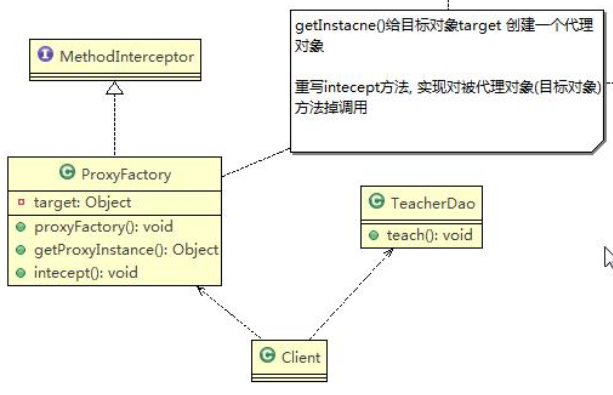
- 代码实现 + Debug源码
    ```java
    package com.atguigu.proxy.cglib;
    public class TeacherDao {
        public String teach() {
            System.out.println("老师授课中，我是cglib代理，不需要实现接口");
            return "hello";
        }
    }
    public class ProxyFactory implements net.sf.cglib.proxy.MethodInterceptor {
        // 维护一个目标对象
        private Object target;
        // 构造器，传入一个被代理的对象
        public ProxyFactory(Object target) {
            this.target = target;
        }
        // 返回一个代理对象: 是 target 对象的代理对象
        public Object getProxyInstance() {
            // 1. 创建一个工具类
            net.sf.cglib.proxy.Enhancer enhancer = new net.sf.cglib.proxy.Enhancer();
            // 2. 设置父类
            enhancer.setSuperclass(target.getClass());
            // 3. 设置回调函数
            enhancer.setCallback(this);
            // 4. 创建子类对象，即代理对象
            return enhancer.create();
        }
        // 重写 intercept 方法，会调用目标对象的方法
        @Override
        public Object intercept(Object obj, java.lang.reflect.Method method, Object[] args, net.sf.cglib.proxy.MethodProxy proxy) throws Throwable {
            System.out.println("Cglib代理模式 ~~ 开始");
            Object returnVal = method.invoke(target, args);
            System.out.println("Cglib代理模式 ~~ 提交");
            return returnVal;
        }
    }
    public class Client {
        public static void main(String[] args) {
            // 创建目标对象
            TeacherDao target = new TeacherDao();
            // 获取到代理对象，并且将目标对象传递给代理对象
            TeacherDao proxyInstance = (TeacherDao) new ProxyFactory(target).getProxyInstance();
            // 执行代理对象的方法，触发intecept 方法，从而实现 对目标对象的调用
            String res = proxyInstance.teach();
            System.out.println("res=" + res);
        }
    }
    ```

## 15.5 几种常见的代理模式介绍—几种变体
1. 防火墙代理：内网通过代理穿透防火墙，实现对公网的访问。
2. 缓存代理：比如：当请求图片文件等资源时，先到缓存代理取，如果取到资源则ok,如果取不到资源，再到公网或者数据库取，然后缓存。
3. 远程代理：远程对象的本地代表，通过它可以**把远程对象当本地对象来调用**。远程代理通过网络和真正的远程对象沟通信息。
    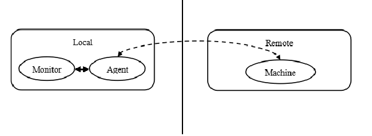
4. 同步代理：主要使用在多线程编程中，完成多线程间同步工作


# 第16章 模板方法模式

## 16.1 豆浆制作问题
编写制作豆浆的程序，说明如下:
1. 制作豆浆的流程 选材--->添加配料--->浸泡--->放到豆浆机打碎
2. 通过添加不同的配料，可以制作出不同口味的豆浆
3. 选材、浸泡和放到豆浆机打碎这几个步骤对于制作每种口味的豆浆都是一样的
4. 请使用 **模板方法模式** 完成 (说明：因为模板方法模式，比较简单，很容易就想到这个方案，因此就直接使用，不再使用传统的方案来引出模板方法模式)

## 16.2 模板方法模式基本介绍
1. 模板方法模式（Template Method Pattern），又叫模板模式(Template Pattern)，在一个抽象类公开定义了执行它的方法的模板。它的子类可以按需要重写方法实现，但调用将以抽象类中定义的方式进行。
2. 简单说，模板方法模式 定义一个操作中的算法的骨架，而将一些步骤延迟到子类中，使得子类可以不改变一个算法的结构，就可以重定义该算法的某些特定步骤。
3. 这种类型的设计模式属于行为型模式。

## 16.3 模板方法模式原理类图

### 16.3.1 模板方法模式的原理类图
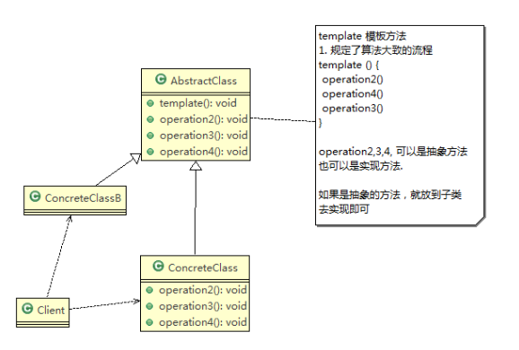

对原理类图的说明-即(模板方法模式的角色及职责)
1. AbstractClass 抽象类， 类中实现了模板方法(template)，定义了算法的骨架，具体子类需要去实现 其它的抽象方法 operationr2,3,4
2. ConcreteClass 实现抽象方法 operationr2,3,4, 以完成算法中特点子类的步骤

## 16.4 模板方法模式解决豆浆制作问题
1. 应用实例要求
   - 制作豆浆的流程 选材--->添加配料--->浸泡--->放到豆浆机打碎
   - 通过添加不同的配料，可以制作出不同口味的豆浆
   - 选材、浸泡和放到豆浆机打碎这几个步骤对于制作每种口味的豆浆都是一样的(红豆、花生豆浆。。。)
2. 思路分析和图解(类图)
    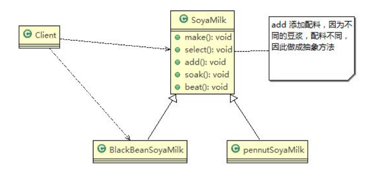
3. 代码实现
    ```java
    package com.atguigu.template;
    //抽象类，表示豆浆
    public abstract class SoyaMilk {
        // 模板方法make，可以做成final不让子类去覆盖
        final void make() {
            select();
            addCondiments();
            soak();
            beat();
        }
        void select() {// 选材料
            System.out.println("第一步：选择好的新鲜黄豆");
        }
        // 添加不同的配料，抽象方法，子类具体实现
        abstract void addCondiments();
        void soak() {// 浸泡
            System.out.println("第三步：黄豆和配料开始浸泡，需要3小时");
        }
        void beat() {
            System.out.println("第四步：黄豆和配料放到豆浆机去打碎");
        }
    }
    public class RedBeanSoyaMilk extends SoyaMilk {
        @Override
        void addCondiments() {
            System.out.println("加入上好的红豆");
        }
    }
    public class PeanutSoyaMilk extends SoyaMilk {
        @Override
        void addCondiments() {
            System.out.println("加入上好的花生");
        }
    }
    public class Client {
        public static void main(String[] args) {
            System.out.println("----制作红豆豆浆----");
            SoyaMilk redBeanSoyaMilk = new RedBeanSoyaMilk();
            redBeanSoyaMilk.make();
            System.out.println("----制作花生豆浆----");
            SoyaMilk peanutSoyaMilk = new PeanutSoyaMilk();
            peanutSoyaMilk.make();
        }
    }
    ```

## 16.5 模板方法模式的钩子方法
1. 在模板方法模式的父类中，我们可以定义一个方法，它默认不做任何事，子类可以视情况要不要覆盖它，该方法称为“钩子”。
2. 还是用上面做豆浆的例子来讲解，比如，我们还希望制作纯豆浆，不添加任何的配料，请使用钩子方法对前面的模板方法进行改造
3. 代码实现
    ```java
    package com.atguigu.template.improve;
    //抽象类，表示豆浆
    public abstract class SoyaMilk {
        final void make() {
            select();
            if (customerWantCondiments()) {
                addCondiments();
            }
            soak();
            beat();
        }
        void select() {// 选材料
            System.out.println("第一步：选择好的新鲜黄豆");
        }
        // 添加不同的配料，抽象方法，子类具体实现
        abstract void addCondiments();
        void soak() {// 浸泡
            System.out.println("第三步：黄豆和配料开始浸泡，需要3小时");
        }
        void beat() {
            System.out.println("第四步：黄豆和配料放到豆浆机去打碎");
        }
        // 钩子方法，决定是否需要添加配料
        boolean customerWantCondiments() {
            return true;
        }
    }
    public class PureSoyaMilk extends SoyaMilk{
        @Override
        void addCondiments() {
            //空实现
        }
        @Override
        boolean customerWantCondiments() {
            return false;
        }
    }
    public class Client {
        public static void main(String[] args) {
            System.out.println("----制作红豆豆浆----");
            SoyaMilk redBeanSoyaMilk = new RedBeanSoyaMilk();
            redBeanSoyaMilk.make();
            System.out.println("----制作纯豆浆----");
            SoyaMilk pureSoyaMilk = new PureSoyaMilk();
            pureSoyaMilk.make();
        }
    }
    ```

## 16.6 模板方法模式在 Spring 框架应用的源码分析
1. Spring IOC 容器初始化时运用到的模板方法模式
2. 代码分析+角色分析+说明类图
    ```java
    package org.springframework.context;
    public interface ConfigurableApplicationContext extends ApplicationContext, Lifecycle, Closeable {
        void refresh() throws BeansException, IllegalStateException;
        // ...
    }
    ```
    ```java
    package org.springframework.context.support;
    public abstract class AbstractApplicationContext extends DefaultResourceLoader implements ConfigurableApplicationContext, DisposableBean {
        @Override
        public void refresh() throws BeansException, IllegalStateException {//模板方法
            synchronized (this.startupShutdownMonitor) {
                // 为刷新准备此上下文。
                prepareRefresh();
                // 告诉子类刷新内部bean工厂。
                ConfigurableListableBeanFactory beanFactory = obtainFreshBeanFactory();
                // 准备在此上下文中使用的bean工厂。
                prepareBeanFactory(beanFactory);
                try {
                    // 允许在上下文子类中对bean工厂进行后处理。
                    postProcessBeanFactory(beanFactory);
                    // 调用在上下文中注册为bean的工厂处理器。
                    invokeBeanFactoryPostProcessors(beanFactory);
                    // 注册拦截bean创建的bean处理器。
                    registerBeanPostProcessors(beanFactory);
                    // 初始化此上下文的消息源。
                    initMessageSource();
                    // 为此上下文初始化事件多播程序。
                    initApplicationEventMulticaster();
                    // 在特定的上下文子类中初始化其他特殊的bean。
                    onRefresh();
                    // 检查侦听器bean并注册它们。
                    registerListeners();
                    // 实例化所有剩余的(非lazy-init)单例。
                    finishBeanFactoryInitialization(beanFactory);
                    // 最后一步:发布相应的事件。
                    finishRefresh();
                } catch (BeansException ex) {
                    destroyBeans();// 销毁已经创建的单例以避免悬空资源。
                    cancelRefresh(ex);// 重置“活跃”的旗帜。
                    throw ex;// 将异常传播到调用者。
                }
            }
        }
        protected ConfigurableListableBeanFactory obtainFreshBeanFactory() {
            refreshBeanFactory();
            ConfigurableListableBeanFactory beanFactory = getBeanFactory();
            if (logger.isDebugEnabled()) {
                logger.debug("Bean factory for " + getDisplayName() + ": " + beanFactory);
            }
            return beanFactory;
        }
        protected abstract void refreshBeanFactory() throws BeansException, IllegalStateException;// 抽象方法
        public abstract ConfigurableListableBeanFactory getBeanFactory() throws IllegalStateException;// 抽象方法
        protected void postProcessBeanFactory(ConfigurableListableBeanFactory beanFactory) {} // 钩子方法
        protected void onRefresh() throws BeansException {// 钩子方法
            // For subclasses: do nothing by default.
        }
        // ...
    }
    public class GenericApplicationContext extends AbstractApplicationContext implements BeanDefinitionRegistry {
        @Override
        protected final void refreshBeanFactory() throws IllegalStateException {
            if (this.refreshed) {
                throw new IllegalStateException("GenericApplicationContext does not support multiple refresh attempts: just call 'refresh' once");
            }
            this.beanFactory.setSerializationId(getId());
            this.refreshed = true;
        }
        @Override
        public final ConfigurableListableBeanFactory getBeanFactory() {
            return this.beanFactory;
        }
        // ...
    }
    ```
3. 针对源码的类图(说明层次关系)
    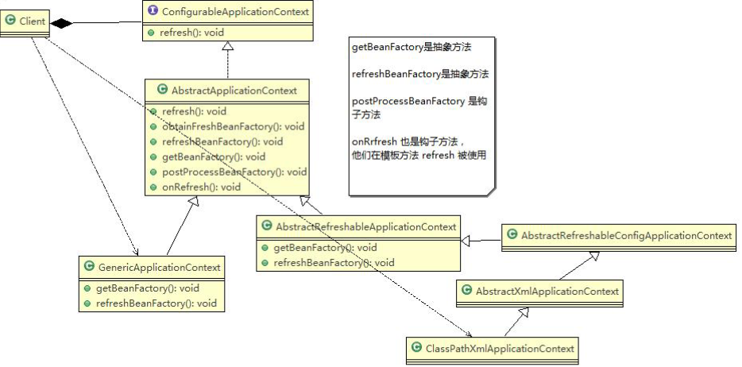

## 16.7 模板方法模式的注意事项和细节
1. 基本思想是：**算法只存在于一个地方，也就是在父类中，容易修改**。需要修改算法时，只要修改父类的模板方法或者已经实现的某些步骤，子类就会继承这些修改
2. **实现了最大化代码复用**。父类的模板方法和已实现的某些步骤会被子类继承而直接使用。
3. **既统一了算法，也提供了很大的灵活性**。父类的模板方法确保了算法的结构保持不变，同时由子类提供部分步骤的实现。
4. 该模式的不足之处：每一个不同的实现都需要一个子类实现，导致类的个数增加，使得系统更加庞大
5. 一般模板方法都加上 final 关键字， 防止子类重写模板方法
6. 模板方法模式使用场景：**当要完成在某个过程，该过程要执行一系列步骤，这一系列的步骤基本相同**，但其个别步骤在实现时可能不同，通常考虑用模板方法模式来处理


# 第17章 命令模式

## 17.1 智能生活项目需求
1. 我们买了一套智能家电，有照明灯、风扇、冰箱、洗衣机，我们只要在手机上安装 app 就可以控制对这些家电工作。
2. 这些智能家电来自不同的厂家，我们不想针对每一种家电都安装一个 App，分别控制，我们希望只要一个 app 就可以控制全部智能家电。
3. 要实现一个 app 控制所有智能家电的需要，则每个智能家电厂家都要提供一个统一的接口给 app 调用，这时就可以考虑使用命令模式。
4. 命令模式可将“动作的请求者”从“动作的执行者”对象中解耦出来。
5. 在我们的例子中，动作的请求者是手机 app，动作的执行者是每个厂商的一个家电产品。

## 17.2 命令模式基本介绍
1. 命令模式（Command Pattern）：在软件设计中，我们经常需要向某些对象发送请求，但是并不知道请求的接收者是谁，也不知道被请求的操作是哪个，我们只需在程序运行时指定具体的请求接收者即可，此时，可以使用命令模式来进行设计。
2. 命名模式使得请求发送者与请求接收者消除彼此之间的耦合，让对象之间的调用关系更加灵活，实现解耦。
3. 在命名模式中，会将一个请求封装为一个对象，以便使用不同参数来表示不同的请求(即命名)，同时命令模式也支持可撤销的操作。
4. 通俗易懂的理解：将军发布命令，士兵去执行。其中有几个角色：将军（命令发布者）、士兵（命令的具体执行者）、命令(连接将军和士兵)。Invoker 是调用者（将军），Receiver 是被调用者（士兵），MyCommand 是命令，实现了 Command 接口，持有接收对象。

## 17.3 命令模式的原理类图
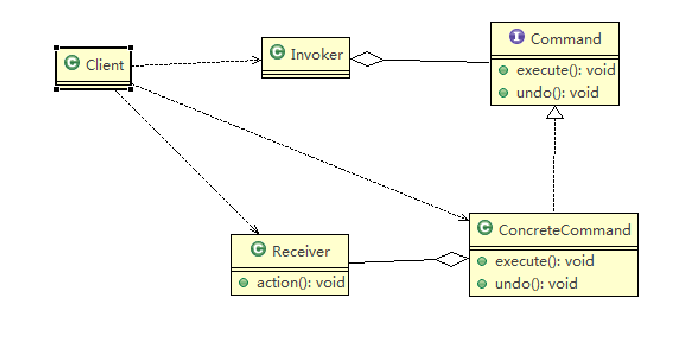

对原理类图的说明-即(命名模式的角色及职责)
1. Invoker 是调用者角色
2. Command: 是命令角色，需要执行的所有命令都在这里，可以是接口或抽象类
3. Receiver: 接受者角色，知道如何实施和执行一个请求相关的操作
4. ConcreteCommand: 将一个接受者对象与一个动作绑定，调用接受者相应的操作，实现 execute

## 17.4 命令模式解决智能生活项目
1. 应用实例要求：编写程序，使用命令模式 完成前面的智能家电项目
2. 思路分析和图解
    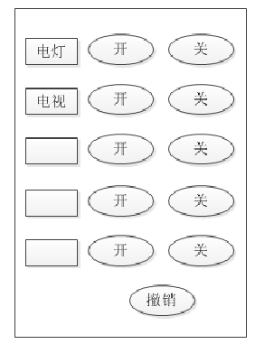
    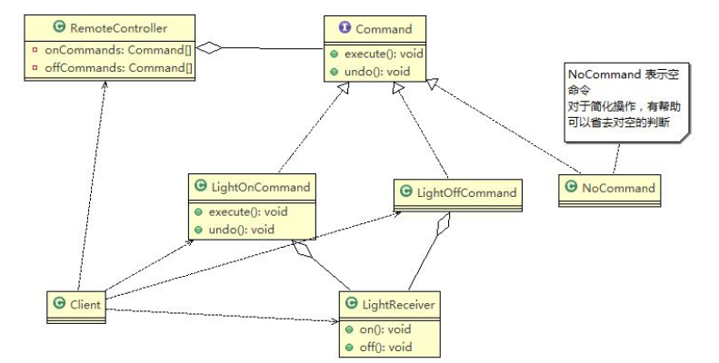
3. 代码实现
    ```java
    package com.atguigu.command;
    public interface Command {// 创建命令接口
        public void execute();// 执行动作(操作)
        public void undo();// 撤销动作(操作)
    }
    public class LightReceiver {
        public void on() {
            System.out.println("电灯打开了...");
        }
        public void off() {
            System.out.println("电灯关闭了...");
        }
    }
    public class TVReceiver {
        public void on() {
            System.out.println("电视机打开了...");
        }
        public void off() {
            System.out.println("电视机关闭了...");
        }
    }
    public class NoCommand implements Command {
        // 没有任何命令，即空执行：用于初始化每个按钮，当调用空命令时，对象什么都不做
        // 其实，这样是一种设计模式，可以省掉对空判断
        @Override
        public void execute() {}
        @Override
        public void undo() {}
    }
    public class LightOnCommand implements Command {
        LightReceiver light;// 聚合LightReceiver
        public LightOnCommand(LightReceiver light) {
            this.light = light;
        }
        @Override
        public void execute() {
            light.on();// 调用接收者的方法
        }
        @Override
        public void undo() {
            light.off();// 调用接收者的方法
        }
    }
    public class LightOffCommand implements Command {
        LightReceiver light;
        public LightOffCommand(LightReceiver light) {
            this.light = light;
        }
        @Override
        public void execute() {
            light.off();
        }
        @Override
        public void undo() {
            light.on();
        }
    }
    public class TVOnCommand implements Command {
        TVReceiver tv;// 聚合TVReceiver
        public TVOnCommand(TVReceiver tv) {
            this.tv = tv;
        }
        @Override
        public void execute() {
            tv.on();
        }
        @Override
        public void undo() {
            tv.off();
        }
    }
    public class TVOffCommand implements Command {
        TVReceiver tv;
        public TVOffCommand(TVReceiver tv) {
            this.tv = tv;
        }
        @Override
        public void execute() {
            tv.off();
        }
        @Override
        public void undo() {
            tv.on();
        }
    }
    public class RemoteController {
        Command[] onCommands;// 按钮的命令数组
        Command[] offCommands;
        Command undoCommand;// 执行撤销的命令（也可以是一个数组（栈），以供多步撤销）
        public RemoteController() {// 初始化按钮
            onCommands = new Command[5];
            offCommands = new Command[5];
            for (int i = 0; i < 5; i++) {
                onCommands[i] = new NoCommand();
                offCommands[i] = new NoCommand();
            }
        }
        // 给按钮设置需要的命令
        public void setCommand(int no, Command onCommand, Command offCommand) {
            onCommands[no] = onCommand;
            offCommands[no] = offCommand;
        }
        public void onButtonWasPushed(int no) {
            // 找到按下的开按钮，并调用对应方法
            onCommands[no].execute();
            // 记录这次的操作，用于撤销
            undoCommand = onCommands[no];
        }
        public void offButtonWasPushed(int no) {
            offCommands[no].execute();
            undoCommand = offCommands[no];
        }
        // 按下撤销按钮
        public void undoButtonWasPushed() {
            undoCommand.undo();
        }
    }
    public class Client {
        public static void main(String[] args) {
            // 使用命令设计模式，完成通过遥控器，对电灯的操作
            RemoteController remoteController = new RemoteController();
            
            LightReceiver lightReceiver = new LightReceiver(); // 电灯(接受者)
            // 创建电灯相关的开关命令
            LightOnCommand lightOnCommand = new LightOnCommand(lightReceiver);
            LightOffCommand lightOffCommand = new LightOffCommand(lightReceiver);
            // 给我们的遥控器设置命令, 比如 no = 0 是电灯的开和关的操作
            remoteController.setCommand(0, lightOnCommand, lightOffCommand);
            remoteController.onButtonWasPushed(0); // 开灯
            remoteController.offButtonWasPushed(0); // 关灯
            remoteController.undoButtonWasPushed(); // 撤销操作

            TVReceiver tvReceiver = new TVReceiver(); // 电视机(接受者)
            TVOffCommand tvOffCommand = new TVOffCommand(tvReceiver);
            TVOnCommand tvOnCommand = new TVOnCommand(tvReceiver);
            // 给我们的遥控器设置命令, 比如 no = 1 是电视机的开和关的操作
            remoteController.setCommand(1, tvOnCommand, tvOffCommand);
            remoteController.onButtonWasPushed(1); // 开电视
            remoteController.offButtonWasPushed(1); // 关电视
            remoteController.undoButtonWasPushed(); // 撤销操作
        }
    }
    ```

## 17.5 命令模式在 Spring 框架 JdbcTemplate 应用的源码分析
1. Spring 框架的 JdbcTemplate 就使用到了命令模式
2. 代码分析
    ```java
    package org.springframework.jdbc.core;
    public interface StatementCallback<T> { // 命令接口
        T doInStatement(Statement stmt) throws SQLException, DataAccessException;
    }
    public class JdbcTemplate extends JdbcAccessor implements JdbcOperations {
        @Override
        public <T> T execute(StatementCallback<T> action) throws DataAccessException {
            Assert.notNull(action, "Callback object must not be null");
            Connection con = DataSourceUtils.getConnection(getDataSource());
            Statement stmt = null;
            try {
                Connection conToUse = con;
                if (this.nativeJdbcExtractor != null &&
                        this.nativeJdbcExtractor.isNativeConnectionNecessaryForNativeStatements()) {
                    conToUse = this.nativeJdbcExtractor.getNativeConnection(con);
                }
                stmt = conToUse.createStatement();
                applyStatementSettings(stmt);
                Statement stmtToUse = stmt;
                if (this.nativeJdbcExtractor != null) {
                    stmtToUse = this.nativeJdbcExtractor.getNativeStatement(stmt);
                }
                T result = action.doInStatement(stmtToUse);
                handleWarnings(stmt);
                return result;
            } catch (SQLException ex) {
                // Release Connection early, to avoid potential connection pool deadlock
                // in the case when the exception translator hasn't been initialized yet.
                JdbcUtils.closeStatement(stmt);
                stmt = null;
                DataSourceUtils.releaseConnection(con, getDataSource());
                con = null;
                throw getExceptionTranslator().translate("StatementCallback", getSql(action), ex);
            } finally {
                JdbcUtils.closeStatement(stmt);
                DataSourceUtils.releaseConnection(con, getDataSource());
            }
        }
        @Override
        public void execute(final String sql) throws DataAccessException {
            if (logger.isDebugEnabled()) {
                logger.debug("Executing SQL statement [" + sql + "]");
            }
            class ExecuteStatementCallback implements StatementCallback<Object>, SqlProvider {
                @Override
                public Object doInStatement(Statement stmt) throws SQLException {
                    stmt.execute(sql);
                    return null;
                }
                @Override
                public String getSql() {
                    return sql;
                }
            }
            execute(new ExecuteStatementCallback());
        }
        @Override
        public <T> T query(final String sql, final ResultSetExtractor<T> rse) throws DataAccessException {
            Assert.notNull(sql, "SQL must not be null");
            Assert.notNull(rse, "ResultSetExtractor must not be null");
            if (logger.isDebugEnabled()) {
                logger.debug("Executing SQL query [" + sql + "]");
            }
            class QueryStatementCallback implements StatementCallback<T>, SqlProvider {
                @Override
                public T doInStatement(Statement stmt) throws SQLException {
                    ResultSet rs = null;
                    try {
                        rs = stmt.executeQuery(sql);
                        ResultSet rsToUse = rs;
                        if (nativeJdbcExtractor != null) {
                            rsToUse = nativeJdbcExtractor.getNativeResultSet(rs);
                        }
                        return rse.extractData(rsToUse);
                    } finally {
                        JdbcUtils.closeResultSet(rs);
                    }
                }
                @Override
                public String getSql() {
                    return sql;
                }
            }
            return execute(new QueryStatementCallback());
        }
        @Override
        public int update(final String sql) throws DataAccessException {
            Assert.notNull(sql, "SQL must not be null");
            if (logger.isDebugEnabled()) {
                logger.debug("Executing SQL update [" + sql + "]");
            }
            class UpdateStatementCallback implements StatementCallback<Integer>, SqlProvider {
                @Override
                public Integer doInStatement(Statement stmt) throws SQLException {
                    int rows = stmt.executeUpdate(sql);
                    if (logger.isDebugEnabled()) {
                        logger.debug("SQL update affected " + rows + " rows");
                    }
                    return rows;
                }
                @Override
                public String getSql() {
                    return sql;
                }
            }
            return execute(new UpdateStatementCallback());
        }
        @Override
        public int[] batchUpdate(final String[] sql) throws DataAccessException {
            Assert.notEmpty(sql, "SQL array must not be empty");
            if (logger.isDebugEnabled()) {
                logger.debug("Executing SQL batch update of " + sql.length + " statements");
            }
            class BatchUpdateStatementCallback implements StatementCallback<int[]>, SqlProvider {
                private String currSql;
                @Override
                public int[] doInStatement(Statement stmt) throws SQLException, DataAccessException {
                    int[] rowsAffected = new int[sql.length];
                    if (JdbcUtils.supportsBatchUpdates(stmt.getConnection())) {
                        for (String sqlStmt : sql) {
                            this.currSql = appendSql(this.currSql, sqlStmt);
                            stmt.addBatch(sqlStmt);
                        }
                        try {
                            rowsAffected = stmt.executeBatch();
                        } catch (BatchUpdateException ex) {
                            String batchExceptionSql = null;
                            for (int i = 0; i < ex.getUpdateCounts().length; i++) {
                                if (ex.getUpdateCounts()[i] == Statement.EXECUTE_FAILED) {
                                    batchExceptionSql = appendSql(batchExceptionSql, sql[i]);
                                }
                            }
                            if (StringUtils.hasLength(batchExceptionSql)) {
                                this.currSql = batchExceptionSql;
                            }
                            throw ex;
                        }
                    } else {
                        for (int i = 0; i < sql.length; i++) {
                            this.currSql = sql[i];
                            if (!stmt.execute(sql[i])) {
                                rowsAffected[i] = stmt.getUpdateCount();
                            } else {
                                throw new InvalidDataAccessApiUsageException("Invalid batch SQL statement: " + sql[i]);
                            }
                        }
                    }
                    return rowsAffected;
                }
                private String appendSql(String sql, String statement) {
                    return (StringUtils.isEmpty(sql) ? statement : sql + "; " + statement);
                }
                @Override
                public String getSql() {
                    return this.currSql;
                }
            }
            return execute(new BatchUpdateStatementCallback());
        }
        // ...
    }
    ```
3. 模式角色分析说明
   - StatementCallback 接口，类似命令接口(Command)
   - `class QueryStatementCallback implements StatementCallback<T>, SqlProvider`，匿名内部类，实现了命令接口，同时也充当命令接收者
   - 命令调用者是JdbcTemplate，其中 `execute(StatementCallback<T> action)` 方法中，调用 action.doInStatement 方法。不同的实现 StatementCallback 接口的对象，对应不同的 doInStatemnt 实现逻辑
   - 另外实现 StatementCallback 命令接口的子类还有BatchUpStatementCallback、ExecuteStatementCallback、QueryStatementCallback、UpdateStatementCallback

## 17.6 命令模式的注意事项和细节
1. 将发起请求的对象与执行请求的对象解耦。发起请求的对象是调用者，调用者只要调用命令对象的 execute()方法就可以让接收者工作，而不必知道具体的接收者对象是谁、是如何实现的，命令对象会负责让接收者执行请求的动作，也就是说：”请求发起者”和“请求执行者”之间的解耦是通过命令对象实现的，命令对象起到了纽带桥梁的作用。
2. 容易设计一个命令队列。只要把命令对象放到列队，就可以多线程的执行命令
3. 容易实现对请求的撤销和重做
4. **命令模式不足**：可能导致某些系统有过多的具体命令类，增加了系统的复杂度，这点在在使用的时候要注意
5. **空命令也是一种设计模式**，它为我们省去了判空的操作。在上面的实例中，如果没有用空命令，我们每按下一个按键都要判空，这给我们编码带来一定的麻烦。
6. 命令模式经典的应用场景：界面的一个按钮都是一条命令、模拟 CMD（DOS 命令）订单的撤销/恢复、触发-反馈机制


# 第18章 访问者模式

## 18.1 测评系统的需求
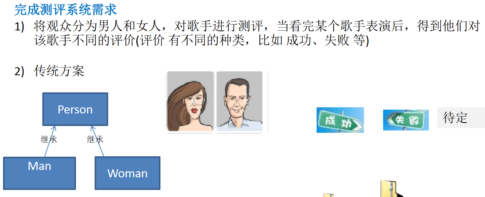

## 18.2 传统方式的问题分析
1. 如果系统比较小，还是 ok 的，但是考虑系统增加越来越多新的功能时，对代码改动较大，违反了 ocp 原则，不利于维护
2. 扩展性不好，比如增加了新的人员类型，或者管理方法，都不好做
3. 引出我们会使用新的设计模式 – 访问者模式

## 18.3 访问者模式基本介绍
1. 访问者模式（Visitor Pattern），封装一些作用于某种数据结构的各元素的操作，它可以在不改变数据结构的前提下定义作用于这些元素的新的操作。
2. 主要将数据结构与数据操作分离，解决**数据结构**和**操作耦合性**问题
3. 访问者模式的基本工作原理是：在被访问的类里面加一个对外提供接待访问者的接口
4. 访问者模式主要应用场景是：需要对一个对象结构中的对象进行很多不同操作(这些操作彼此没有关联)，同时需要避免让这些操作"污染"这些对象的类，可以选用访问者模式解决

## 18.4 访问者模式的原理类图
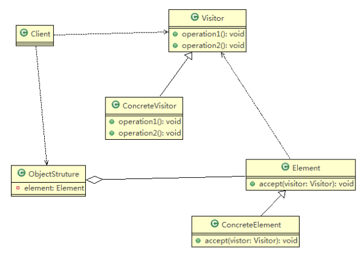

对原理类图的说明-即(访问者模式的角色及职责)
1. Visitor 是抽象访问者，为该对象结构中的ConcreteElement的每一个类声明一个visit操作
2. ConcreteVisitor 是一个具体的访问值 实现每个有 Visitor 声明的操作，是每个操作实现的部分
3. ObjectStructure 能枚举它的元素，可以提供一个高层的接口，用来允许访问者访问元素
4. Element 定义一个 accept 方法，接收一个访问者对象
5. ConcreteElement 为具体元素，实现了 accept 方法

## 18.5 访问者模式应用实例
1. 将人分为男人和女人，对歌手进行测评，当看完某个歌手表演后，得到他们对该歌手不同的评价(评价 有不同的种类，比如 成功、失败 等)，请使用访问者模式来说实现
2. 思路分析和图解(类图)
    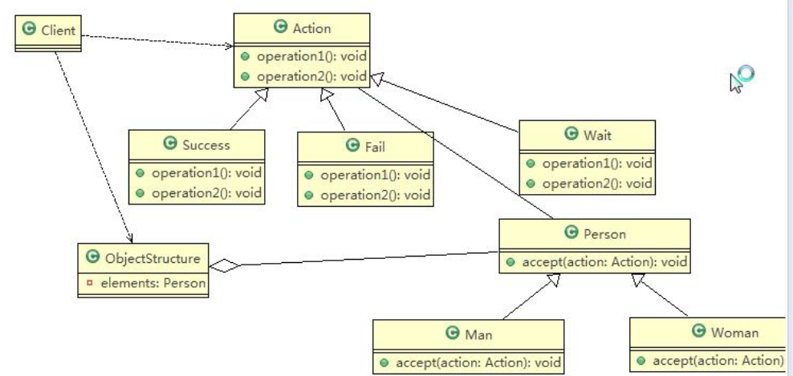
3. 代码实现
    ```java
    public abstract class Action {
        public abstract void getManResult(Man man);
        public abstract void getWomanResult(Woman woman);
    }
    public class Success extends Action {
        @Override
        public void getManResult(Man man) {
            System.out.println("男人给的评价该歌手很成功 !");
        }
        @Override
        public void getWomanResult(Woman woman) {
            System.out.println("女人给的评价该歌手很成功 !");
        }
    }
    public class Fail extends Action {
        @Override
        public void getManResult(Man man) {
            System.out.println("男人给的评价该歌手失败 !");
        }
        @Override
        public void getWomanResult(Woman woman) {
            System.out.println("女人给的评价该歌手失败 !");
        }
    }
    public abstract class Person {
        //提供一个方法，让访问者可以访问
        public abstract void accept(Action action);
    }
    //说明
    //1. 这里我们使用到了双分派, 即首先在客户端程序中，将具体状态作为参数传递Woman中(第一次分派)
    //2. 然后Woman 类调用作为参数的 "具体方法" 中方法getWomanResult, 同时将自己(this)作为参数
    //   传入，完成第二次的分派
    public class Woman extends Person{
        @Override
        public void accept(Action action) {
            action.getWomanResult(this);
        }
    }
    public class Man extends Person {
        @Override
        public void accept(Action action) {
            action.getManResult(this);
        }
    }
    //数据结构，管理很多人（Man, Woman）
    public class ObjectStructure {
        // 维护了一个集合
        private List<Person> persons = new LinkedList<>();
        // 增加到list
        public void attach(Person p) {
            persons.add(p);
        }
        // 移除
        public void detach(Person p) {
            persons.remove(p);
        }
        // 显示测评情况
        public void display(Action action) {
            for (Person p : persons) {
                p.accept(action);
            }
        }
    }
    public class Client {
        public static void main(String[] args) {
            ObjectStructure objectStructure = new ObjectStructure();
            objectStructure.attach(new Man());
            objectStructure.attach(new Woman());

            objectStructure.display(new Success());
            objectStructure.display(new Fail());
        }
    }
    ```
4. 应用案例的小结
   - 上面提到了**双分派**，所谓双分派是指不管类怎么变化，我们都能找到期望的方法运行。双分派意味着得到执行的操作取决于请求的种类和两个接收者的类型
   - 以上述实例为例，假设我们要添加一个Wait的状态类，考察Man类和Woman类的反应，由于使用了双分派，只需增加一个Action子类即可在客户端调用即可，不需要改动任何其他类的代码。
    ```java
    public class Wait extends Action {
        @Override
        public void getManResult(Man man) {
            System.out.println("男人给的评价是该歌手待定...");
        }
        @Override
        public void getWomanResult(Woman woman) {
            System.out.println("女人给的评价是该歌手待定...");
        }
    }
    ```
5. 个人思考：Action是否可以使用枚举（如下）
    ```java
    public enum Action{
        SUCCESS(){
            @Override
            public void getManResult(Man man) {
                System.out.println("男人给的评价该歌手很成功 !");
            }
            @Override
            public void getWomanResult(Woman woman) {
                System.out.println("女人给的评价该歌手很成功 !");
            }
        },
        FAIL(){
            @Override
            public void getManResult(Man man) {
                System.out.println("男人给的评价该歌手失败 !");
            }
            @Override
            public void getWomanResult(Woman woman) {
                System.out.println("女人给的评价该歌手失败 !");
            }
        };
        public abstract void getManResult(Man man);
        public abstract void getWomanResult(Woman woman);
    }
    ```

## 18.6 访问者模式的注意事项和细节
- 优点
  1. 访问者模式符合单一职责原则、让程序具有优秀的扩展性、灵活性非常高
  2. 访问者模式可以对功能进行统一，可以做报表、UI、拦截器与过滤器，适用于数据结构相对稳定的系统
- 缺点
  1. 具体元素对访问者公布细节，也就是说访问者关注了其他类的内部细节，这是迪米特法则所不建议的，这样造成了具体元素变更比较困难
  2. 违背了依赖倒转原则。访问者依赖的是具体元素，而不是抽象元素
  3. 因此，如果一个系统有比较稳定的数据结构，又有经常变化的功能需求，那么访问者模式就是比较合适的


# 第19章 迭代器模式

## 19.1 看一个具体的需求
编写程序展示一个学校院系结构：需求是这样，要在一个页面中展示出学校的院系组成，一个学校有多个学院，一个学院有多个系。如图：
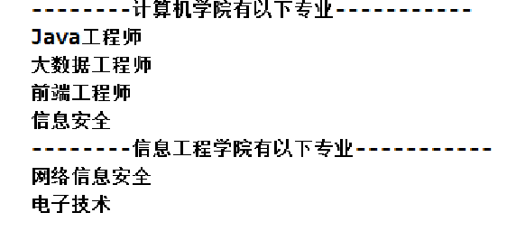

## 19.2 传统的设计方案(类图)
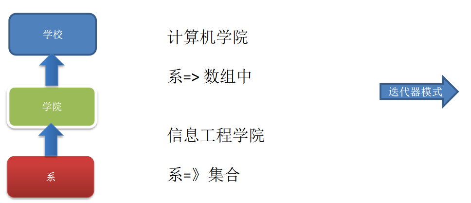

## 19.3 传统的方式的问题分析
1. 将学院看做是学校的子类，系是学院的子类，这样实际上是站在组织大小来进行分层次的
2. 实际上我们的要求是：在一个页面中展示出学校的院系组成，一个学校有多个学院，一个学院有多个系，因此这种方案，不能很好实现的**遍历**的操作
3. 解决方案：=> **迭代器模式**

## 19.4 迭代器模式基本介绍
1. 迭代器模式（Iterator Pattern）是常用的设计模式，属于**行为型模式**
2. 如果我们的**集合元素是用不同的方式实现的**，有数组，还有 java 的集合类，或者还有其他方式，当客户端要遍历这些集合元素的时候就要使用多种遍历方式，而且还会暴露元素的内部结构，可以考虑使用迭代器模式解决。
3. 迭代器模式，**提供一种遍历集合元素的统一接口**，用**一致的方法遍历集合元素**，不需要知道**集合对象的底层**表示，即：不暴露其内部的结构。

## 19.5 迭代器模式的原理类图
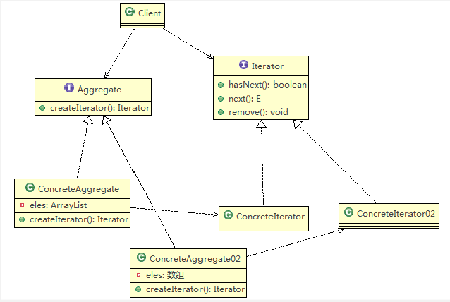

对原理类图的说明-即(迭代器模式的角色及职责)
1. Iterator：迭代器接口，是系统提供，含义 hasNext, next, remove
2. ConcreteIterator：具体的迭代器类，管理迭代
3. Aggregate：一个统一的聚合接口，将客户端和具体聚合解耦
4. ConcreteAggreage：具体的聚合持有对象集合，并提供一个方法，返回一个迭代器，该迭代器可以正确遍历集合
5. Client：客户端，通过 Iterator 和 Aggregate 依赖子类

## 19.6 迭代器模式应用实例
1. 应用实例要求：编写程序展示一个学校院系结构：需求是这样，要在一个页面中展示出学校的院系组成，一个学校有多个学院，一个学院有多个系。
2. 设计思路分析
    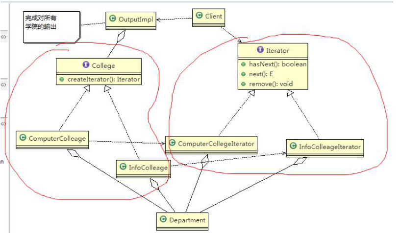
3. 代码实现
    ```java
    package com.atguigu.iterator;
    public class Department {
        private String name;
        private String desc;
        // constructor
        // getter and setter
    }
    public class ComputerCollegeIterator implements Iterator<Department> {
        // 这里我们需要Department是以怎样的方式存放=>数组
        Department[] departments;
        int position = 0; // 遍历的位置
        public ComputerCollegeIterator(Department[] departments) {
            this.departments = departments;
        }
        @Override// 判断是否还有下一个元素
        public boolean hasNext() {
            return position < departments.length && departments[position] != null;
        }
        @Override
        public Department next() {
            return departments[position++];
        }
    }
    public class InfoColleageIterator implements Iterator<Department> {
        List<Department> departmentList; // 信息工程学院是以List方式存放系
        int index = -1;// 索引
        public InfoColleageIterator(List<Department> departmentList) {
            this.departmentList = departmentList;
        }
        @Override// 判断list中还有没有下一个元素
        public boolean hasNext() {
            if (index >= departmentList.size() - 1) {
                return false;
            } else {
                index++;
                return true;
            }
        }
        @Override
        public Department next() {
            return departmentList.get(index);
        }
    }
    public interface College {
        public String getName();
        // 增加系的方法
        public void addDepartment(String name, String desc);
        // 返回一个迭代器,遍历
        public Iterator<Department> createIterator();
    }
    public class ComputerCollege implements College {
        Department[] departments;
        int numOfDepartment = 0;// 保存当前数组的对象个数
        public ComputerCollege() {
            departments = new Department[5];
            addDepartment("Java专业", " Java专业 ");
            addDepartment("PHP专业", " PHP专业 ");
            addDepartment("大数据专业", " 大数据专业 ");
        }
        @Override
        public String getName() {
            return "计算机学院";
        }
        @Override
        public void addDepartment(String name, String desc) {
            departments[numOfDepartment++] = new Department(name, desc);
        }
        @Override
        public Iterator<Department> createIterator() {
            return new ComputerCollegeIterator(departments);
        }
    }
    public class InfoCollege implements College {
        List<Department> departmentList;
        public InfoCollege() {
            departmentList = new ArrayList<Department>();
            addDepartment("信息安全专业", " 信息安全专业 ");
            addDepartment("网络安全专业", " 网络安全专业 ");
            addDepartment("服务器安全专业", " 服务器安全专业 ");
        }
        @Override
        public String getName() {
            return "信息工程学院";
        }
        @Override
        public void addDepartment(String name, String desc) {
            departmentList.add(new Department(name, desc));
        }
        @Override
        public Iterator<Department> createIterator() {
            return new InfoColleageIterator(departmentList);
            // 实际此处可以直接 return departmentList.iterator(); 但是这里为了演示设计模式没有使用
        }
    }
    public class OutPutImpl {
        List<College> collegeList;// 学院集合
        public OutPutImpl(List<College> collegeList) {
            this.collegeList = collegeList;
        }
        // 遍历所有学院，然后调用printDepartment输出各个学院的系
        public void printCollege() {
            // 从collegeList取出所有学院，Java中的List已经实现Iterator
            Iterator<College> iterator = collegeList.iterator();
            while (iterator.hasNext()) {
                College college = iterator.next();// 取出一个学院
                System.out.println("=====" + college.getName() + "=====");
                printDepartment(college.createIterator()); // 得到对应迭代器
            }
        }
        // 输出学院输出系
        public void printDepartment(Iterator<Department> iterator) {
            while (iterator.hasNext()) {
                Department d = iterator.next();
                System.out.println(d.getName());
            }
        }
    }
    public class Client {
        public static void main(String[] args) {
            // 创建学院
            List<College> collegeList = new ArrayList<College>();
            collegeList.add(new ComputerCollege());
            collegeList.add(new InfoCollege());
            OutPutImpl outPutImpl = new OutPutImpl(collegeList);
            outPutImpl.printCollege();
        }
    }
    ```

## 19.7 迭代器模式在 JDK-ArrayList 集合应用的源码分析
1. JDK 的 ArrayList 集合中就使用了迭代器模式
2. 代码分析 + 类图 + 说明
    ```java
    package com.atguigu.jdk;
    public class IteratorDemo {
        public static void main(String[] args) {
            List<String> a = new ArrayList<>();
            a.add("jack");// ..
            // 获取到迭代器
            Iterator<String> Itr = a.iterator();
            while (Itr.hasNext()) {
                System.out.println(Itr.next());
            }
        }
    }
    ```
    ```java
    package java.util;
    public interface List<E> extends Collection<E> {
        Iterator<E> iterator();
        // ...
    }
    public class ArrayList<E> extends AbstractList<E> implements List<E>, RandomAccess, Cloneable, java.io.Serializable {
        public Iterator<E> iterator() {
            return new Itr();
        }
        private class Itr implements Iterator<E> {
            int cursor;       // index of next element to return
            int lastRet = -1; // index of last element returned; -1 if no such
            int expectedModCount = modCount;
            Itr() {}// prevent creating a synthetic constructor
            public boolean hasNext() {
                return cursor != size;
            }
            @SuppressWarnings("unchecked")
            public E next() {
                checkForComodification();
                int i = cursor;
                if (i >= size)
                    throw new NoSuchElementException();
                Object[] elementData = ArrayList.this.elementData;
                if (i >= elementData.length)
                    throw new ConcurrentModificationException();
                cursor = i + 1;
                return (E) elementData[lastRet = i];
            }
            public void remove() {
                if (lastRet < 0)
                    throw new IllegalStateException();
                checkForComodification();
                try {
                    ArrayList.this.remove(lastRet);
                    cursor = lastRet;
                    lastRet = -1;
                    expectedModCount = modCount;
                } catch (IndexOutOfBoundsException ex) {
                    throw new ConcurrentModificationException();
                }
            }
            @Override
            public void forEachRemaining(Consumer<? super E> action) {
                Objects.requireNonNull(action);
                final int size = ArrayList.this.size;
                int i = cursor;
                if (i < size) {
                    final Object[] es = elementData;
                    if (i >= es.length)
                        throw new ConcurrentModificationException();
                    for (; i < size && modCount == expectedModCount; i++)
                        action.accept(elementAt(es, i));
                    // update once at end to reduce heap write traffic
                    cursor = i;
                    lastRet = i - 1;
                    checkForComodification();
                }
            }
            final void checkForComodification() {
                if (modCount != expectedModCount)
                    throw new ConcurrentModificationException();
            }
        }
        // ...
    }
    // LinkedList、Hashtable...
    ```
    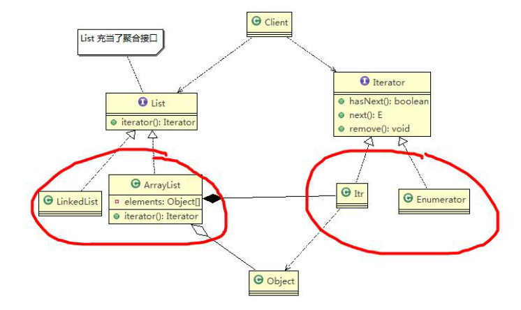
3. 对类图的角色分析和说明
   - 内部类 Itr 充当具体实现迭代器 Iterator 的类，作为 ArrayList 内部类
   - List 就是充当了聚合接口，含有一个 iterator() 方法，返回一个迭代器对象
   - ArrayList 是实现聚合接口 List 的子类，实现了iterator()
   - Iterator 接口系统提供
   - 迭代器模式解决了不同集合(ArrayList, LinkedList)统一遍历问题

## 19.8 迭代器模式的注意事项和细节
优点
1. 提供一个统一的方法遍历对象，客户不用再考虑聚合的类型，使用一种方法就可以遍历对象了。
2. 隐藏了聚合的内部结构，客户端要遍历聚合的时候只能取到迭代器，而不会知道聚合的具体组成。
3. 提供了一种**设计思想**，就是一个类应该只有一个引起变化的原因（叫做单一责任原则）。在聚合类中，我们把迭代器分开，就是要把**管理对象集合**和**遍历对象集合**的责任分开，这样一来集合改变的话，只影响到聚合对象。而如果遍历方式改变的话，只影响到了迭代器。
4. 当要展示一组相似对象，或者遍历一组相同对象时使用，适合使用迭代器模式

缺点：每个聚合对象都要一个迭代器，会生成多个迭代器不好管理类


# 第 20 章观察者模式

## 20.1 天气预报项目需求
1. 气象站可以将每天测量到的温度，湿度，气压等等以公告的形式发布出去(比如发布到自己的网站或第三方)。
2. 需要设计开放型 API，便于其他第三方也能接入气象站获取数据。
3. 提供温度、气压和湿度的接口
4. 测量数据更新时，要能实时的通知给第三方

## 20.2 天气预报设计方案1-普通方案
传统的设计方案：通过对气象站项目的分析，我们可以初步设计出一个WeatherData类

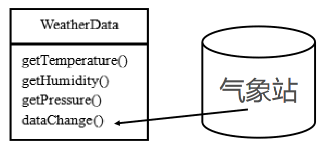

说明:
1. 通过getXxx方法，可以让第三方接入，并得到相关信息。
2. 当数据有更新时，气象站通过调用dataChange() 去更新数据，当第三方再次获取时，就能得到最新数据，当然也可以推送。

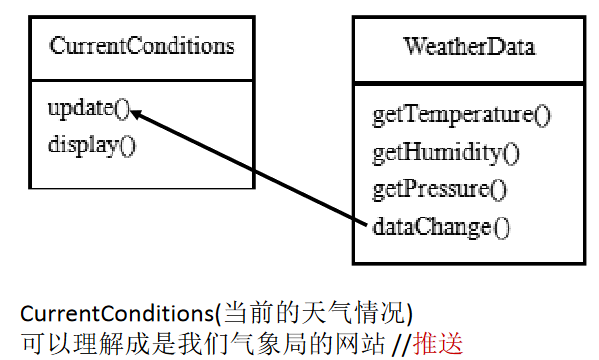

```java
package com.atguigu.observer;
// 显示当前天气情况（可以理解成是气象站自己的网站）
public class CurrentConditions {
	// 温度，气压，湿度
	private float temperature;
	private float pressure;
	private float humidity;
	// 更新 天气情况，是由 WeatherData 来调用，我使用推送模式
	public void update(float temperature, float pressure, float humidity) {
		this.temperature = temperature;
		this.pressure = pressure;
		this.humidity = humidity;
		display();
	}
	public void display() {// 显示
		System.out.println("***Today mTemperature: " + temperature + "***");
		System.out.println("***Today mPressure: " + pressure + "***");
		System.out.println("***Today mHumidity: " + humidity + "***");
	}
}
/**
 * 1. 包含最新的天气情况信息
 * 2. 含有 CurrentConditions 对象
 * 3. 当数据有更新时，就主动的调用 CurrentConditions对象update方法(含 display), 这样他们（接入方）就看到最新的信息
 */
public class WeatherData {
	private float temperatrue;//getter
	private float pressure;//getter
	private float humidity;//getter
	private CurrentConditions currentConditions;
	public WeatherData(CurrentConditions currentConditions) {// 加入新的第三方
		this.currentConditions = currentConditions;
	}
	public void dataChange() {
		// 调用 接入方的 update
		currentConditions.update(getTemperature(), getPressure(), getHumidity());
	}
	// 当数据有更新时，就调用 setData
	public void setData(float temperature, float pressure, float humidity) {
		this.temperatrue = temperature;
		this.pressure = pressure;
		this.humidity = humidity;
		// 调用dataChange，将最新的信息 推送给 接入方 currentConditions
		dataChange();
	}
}
public class Client {
	public static void main(String[] args) {
		// 创建接入方 currentConditions
		CurrentConditions currentConditions = new CurrentConditions();
		// 创建 WeatherData 并将 接入方 currentConditions 传递到 WeatherData中
		WeatherData weatherData = new WeatherData(currentConditions);
		weatherData.setData(30, 150, 40);// 更新天气情况
		weatherData.setData(40, 160, 20);// 天气情况变化
	}
}
```

问题分析
1. 其他第三方接入气象站获取数据的问题
2. 无法在运行时动态的添加第三方 (新浪网站)
3. 违反 ocp 原则=>观察者模式
    ```java
    //在 WeatherData 中，当增加一个第三方，都需要创建一个对应的第三方的公告板对象，并加入到 dataChange, 不利于维护，也不是动态加入
    public void dataChange() {
        currentConditions.update(getTemperature(), getPressure(), getHumidity());
    }
    ```

## 20.3 观察者模式原理
观察者模式类似订牛奶业务
1. 奶站/气象局：Subject
2. 用户/第三方网站：Observer

Subject：登记注册、移除和通知
1. registerObserver 注册
2. removeObserver 移除
3. notifyObservers() 通知所有的注册的用户，根据不同需求，可以是更新数据，让用户来取，也可能是实施推送，看具体需求定

Observer：接收输入

观察者模式：对象之间**多对一依赖**的一种设计方案，被依赖的对象为Subject，依赖的对象为Observer，Subject通知Observer变化，比如这里的奶站是Subject，是1的一方。用户时Observer，是多的一方。

## 20.4 观察者模式解决天气预报需求

### 20.4.1 类图说明
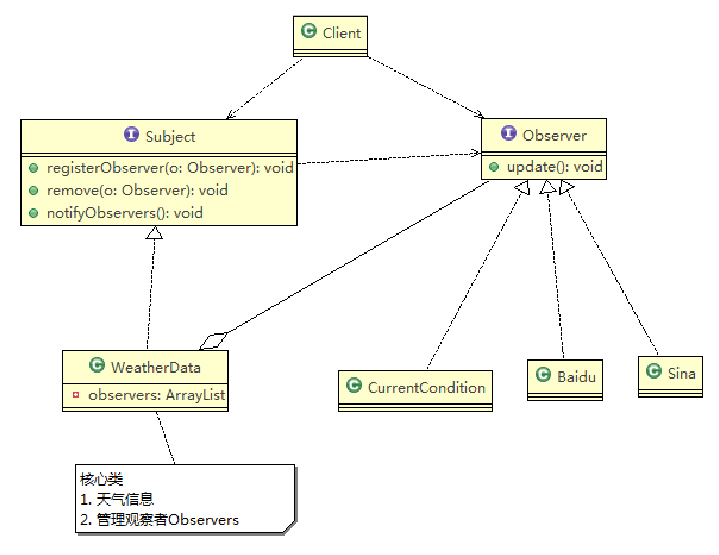

### 20.4.2 代码实现
```java
package com.atguigu.observer.improve;
//接口：让 WeatherData 来实现 
public interface Subject {
	public void registerObserver(Observer o);
	public void removeObserver(Observer o);
	public void notifyObservers();
}
/**
 * 1. 包含最新的天气情况信息
 * 2. 含有 观察者集合，使用ArrayList管理
 * 3. 当数据有更新时，就主动的调用 ArrayList, 通知所有的（接入方）就看到最新的信息
 */
public class WeatherData implements Subject {
	private float temperatrue;//getter
	private float pressure;//getter
	private float humidity;//getter
	private ArrayList<Observer> observers;// 观察者集合
	public WeatherData() {// 加入新的第三方
		observers = new ArrayList<Observer>();
	}
	public void dataChange() {
		notifyObservers();// 调用 接入方的 update
	}
	// 当数据有更新时，就调用 setData
	public void setData(float temperature, float pressure, float humidity) {
		this.temperatrue = temperature;
		this.pressure = pressure;
		this.humidity = humidity;
		// 调用dataChange，将最新的信息 推送给 接入方 currentConditions
		dataChange();
	}
	@Override// 注册一个观察者
	public void registerObserver(Observer o) {
		observers.add(o);
	}
	@Override// 移除一个观察者
	public void removeObserver(Observer o) {
        observers.remove(o);
	}
	@Override// 遍历所有的观察者，并通知
	public void notifyObservers() {
		for (Observer observer : observers) {
			observer.update(temperatrue, pressure, humidity);
		}
	}
}
//观察者接口，有观察者来实现
public interface Observer {
	public void update(float temperature, float pressure, float humidity);
}
public class CurrentConditions implements Observer {
	// 温度，气压，湿度
	private float temperature;
	private float pressure;
	private float humidity;
	// 更新 天气情况，是由 WeatherData 来调用，我使用推送模式
	public void update(float temperature, float pressure, float humidity) {
		this.temperature = temperature;
		this.pressure = pressure;
		this.humidity = humidity;
		display();
	}
	public void display() {// 显示
		System.out.println("***Today mTemperature: " + temperature + "***");
		System.out.println("***Today mPressure: " + pressure + "***");
		System.out.println("***Today mHumidity: " + humidity + "***");
	}
}
public class BaiduSite implements Observer {
	private float temperature;
	private float pressure;
	private float humidity;
	public void update(float temperature, float pressure, float humidity) {
		this.temperature = temperature;
		this.pressure = pressure;
		this.humidity = humidity;
		display();
	}
	public void display() {
		System.out.println("===百度网站====");
		System.out.println("***百度网站 气温 : " + temperature + "***");
		System.out.println("***百度网站 气压: " + pressure + "***");
		System.out.println("***百度网站 湿度: " + humidity + "***");
	}
}
public class Client {
	public static void main(String[] args) {
		// 创建一个WeatherData
		WeatherData weatherData = new WeatherData();
		// 创建观察者
		CurrentConditions currentConditions = new CurrentConditions();
		BaiduSite baiduSite = new BaiduSite();
		// 注册到weatherData
		weatherData.registerObserver(currentConditions);
		weatherData.registerObserver(baiduSite);
		weatherData.setData(10f, 100f, 30.3f);

		weatherData.removeObserver(baiduSite);
		weatherData.setData(10f, 100f, 30.3f);
	}
}
```

### 20.4.3 观察者模式的好处
1. 观察者模式设计后，会以集合的方式来管理用户(Observer)，包括注册，移除和通知。
2. 这样，我们增加观察者(这里可以理解成一个新的公告板)，就不需要去修改核心类 WeatherData 不会修改代码，遵守了 ocp 原则。

## 20.5 观察者模式在 Jdk 应用的源码分析
1. Jdk 的 Observable 类就使用了观察者模式
2. 代码分析 + 模式角色分析
    ```java
    package java.util;
    public interface Observer {
        void update(Observable o, Object arg);
    }
    /* 这个类和Observer接口已经被弃用。观察者和可观察对象支持的事件模型是非常有限的，被可观察对象发送的通知的顺序是不确定的，状态的改变也不是和通知一一对应的。对于更丰富的事件模型，可以考虑使用java.bean包。为了在线程之间获得可靠和有序的消息传递，可以考虑在java.util.concurrent包中使用一种并发数据结构。关于响应式流样式的编程，请参阅java.util.concurrent.Flow API。 */
    public class Observable {
        private boolean changed = false;
        private Vector<Observer> obs;
        public Observable() {
            obs = new Vector<>();
        }
        public synchronized void addObserver(Observer o) {
            if (o == null)
                throw new NullPointerException();
            if (!obs.contains(o)) {
                obs.addElement(o);
            }
        }
        public synchronized void deleteObserver(Observer o) {
            obs.removeElement(o);
        }
        public void notifyObservers() {
            notifyObservers(null);
        }
        public void notifyObservers(Object arg) {
            Object[] arrLocal;
            synchronized (this) {
                if (!changed) return;
                arrLocal = obs.toArray();
                clearChanged();
            }
            for (int i = arrLocal.length-1; i>=0; i--)
                ((Observer)arrLocal[i]).update(this, arg);
        }
        // ...
    }
    ```
3. 模式角色分析
   - Observable 的作用和地位等价于 我们前面讲过 Subject
   - Observable 是类，不是接口，类中已经实现了核心的方法，即管理 Observer 的方法 add.. delete .. notify ..
   - Observer 的作用和地位等价于我们前面讲过的 Observer，有 update
   - Observable 和 Observer 的使用方法和前面讲过的一样，只是 Observable 是类，通过继承来实现观察者模式


# 第21章 中介者模式

## 21.1 智能家庭项目
1. 智能家庭包括各种设备，闹钟、咖啡机、电视机、窗帘 等
2. 主人要看电视时，各个设备可以协同工作，自动完成看电视的准备工作，比如流程为：闹铃响起->咖啡机开始做咖啡->窗帘自动落下->电视机开始播放

## 21.2 传统方案解决智能家庭管理问题
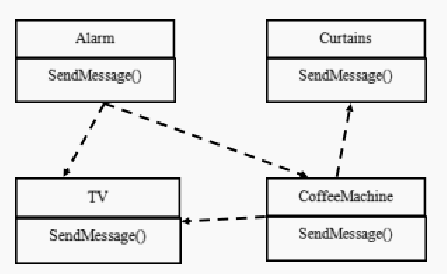

## 21.3 传统的方式的问题分析
1. 当各电器对象有多种状态改变时，相互之间的调用关系会比较复杂
2. 各个电器对象彼此联系，你中有我，我中有你，不利于松耦合
3. 各个电器对象之间所传递的消息(参数)，容易混乱
4. 当系统增加一个新的电器对象时，或者执行流程改变时，代码的可维护性、扩展性都不理想 ➡ 考虑中介者模式

## 21.4 中介者模式基本介绍
1. 中介者模式（Mediator Pattern），用一个中介对象来封装一系列的对象交互。中介者使各个对象不需要显式地相互引用，从而使其耦合松散，而且可以独立地改变它们之间的交互
2. 中介者模式属于行为型模式，使代码易于维护
3. 比如 MVC 模式，C（Controller 控制器）是 M（Model 模型）和 V（View 视图）的中介者，在前后端交互时起到了中间人的作用

## 21.5 中介者模式的原理类图
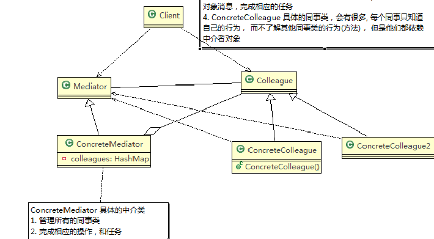

对原理类图的说明-即(中介者模式的角色及职责)
1. Mediator 就是抽象中介者，定义了同事对象到中介者对象的接口
2. Colleague 是抽象同事类
3. ConcreteMediator 具体的中介者对象，实现抽象方法，他需要知道所有的具体的同事类，即以一个集合来管理HashMap，并接受某个同事对象消息，完成相应的任务
4. ConcreteColleague 具体的同事类，会有很多，每个同事只知道自己的行为，而不了解其他同事类的行为(方法)，但是他们都依赖中介者对象

## 21.6 中介者模式应用实例-智能家庭管理
1. 应用实例要求：完成前面的智能家庭的项目，使用中介者模式
2. 思路分析和图解(类图)
    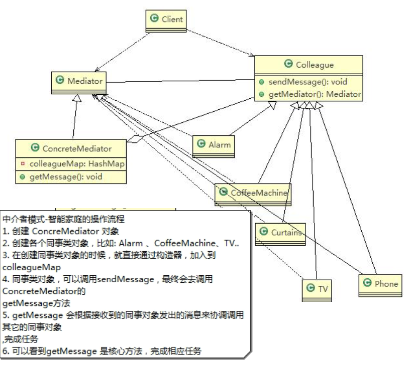
3. 代码实现
    ```java
    package com.atguigu.mediator.smarthouse;
    public abstract class Mediator {
        // 将给中介者对象，加入到集合中
        public abstract void Register(String colleagueName, Colleague colleague);
        // 接收消息，具体的同事对象发出
        public abstract void GetMessage(int stateChange, String colleagueName);
        public abstract void SendMessage();
    }
    //具体的中介者类
    public class ConcreteMediator extends Mediator {
        // 集合，放入所有的同事对象
        private HashMap<String, Colleague> colleagueMap;
        private HashMap<String, String> interMap;
        public ConcreteMediator() {
            colleagueMap = new HashMap<String, Colleague>();
            interMap = new HashMap<String, String>();
        }
        @Override
        public void Register(String colleagueName, Colleague colleague) {
            colleagueMap.put(colleagueName, colleague);
            if (colleague instanceof Alarm) {
                interMap.put("Alarm", colleagueName);
            } else if (colleague instanceof CoffeeMachine) {
                interMap.put("CoffeeMachine", colleagueName);
            } else if (colleague instanceof TV) {
                interMap.put("TV", colleagueName);
            } else if (colleague instanceof Curtains) {
                interMap.put("Curtains", colleagueName);
            }
        }
        // 具体中介者的核心方法
        // 1. 根据得到消息，完成对应任务
        // 2. 中介者在这个方法，协调各个具体的同事对象，完成任务
        @Override
        public void GetMessage(int stateChange, String colleagueName) {
            // 处理闹钟发出的消息
            if (colleagueMap.get(colleagueName) instanceof Alarm) {
                if (stateChange == 0) {
                    ((CoffeeMachine) (colleagueMap.get(interMap.get("CoffeeMachine")))).StartCoffee();
                    ((TV) (colleagueMap.get(interMap.get("TV")))).StartTv();
                } else if (stateChange == 1) {
                    ((TV) (colleagueMap.get(interMap.get("TV")))).StopTv();
                }
            } else if (colleagueMap.get(colleagueName) instanceof CoffeeMachine) {
                ((Curtains) (colleagueMap.get(interMap.get("Curtains")))).UpCurtains();
            } else if (colleagueMap.get(colleagueName) instanceof TV) {// 如果TV发现消息
            } else if (colleagueMap.get(colleagueName) instanceof Curtains) {
                // 如果是以窗帘发出的消息，这里处理...
            }
        }
        @Override
        public void SendMessage() {}
    }
    //同事抽象类
    public abstract class Colleague {
        private Mediator mediator;
        public String name;
        public Colleague(Mediator mediator, String name) {
            this.mediator = mediator;
            this.name = name;
        }
        public Mediator GetMediator() {
            return this.mediator;
        }
        public abstract void SendMessage(int stateChange);
    }
    //具体的同事类
    public class Alarm extends Colleague {
        public Alarm(Mediator mediator, String name) {
            super(mediator, name);
            // 在创建Alarm 同事对象时，将自己放入到ConcreteMediator 对象中[集合]
            mediator.Register(name, this);
        }
        public void SendAlarm(int stateChange) {
            SendMessage(stateChange);
        }
        @Override
        public void SendMessage(int stateChange) {
            // 调用的中介者对象的getMessage
            this.GetMediator().GetMessage(stateChange, this.name);
        }
    }
    public class CoffeeMachine extends Colleague {
        public CoffeeMachine(Mediator mediator, String name) {
            super(mediator, name);
            mediator.Register(name, this);
        }
        @Override
        public void SendMessage(int stateChange) {
            this.GetMediator().GetMessage(stateChange, this.name);
        }
        public void StartCoffee() {
            System.out.println("It's time to startcoffee!");
        }
        public void FinishCoffee() {
            System.out.println("After 5 minutes!");
            System.out.println("Coffee is ok!");
            SendMessage(0);
        }
    }
    public class TV extends Colleague {
        public TV(Mediator mediator, String name) {
            super(mediator, name);
            mediator.Register(name, this);
        }
        @Override
        public void SendMessage(int stateChange) {
            this.GetMediator().GetMessage(stateChange, this.name);
        }
        public void StartTv() {
            System.out.println("It's time to StartTv!");
        }
        public void StopTv() {
            System.out.println("StopTv!");
        }
    }
    public class Curtains extends Colleague {
        public Curtains(Mediator mediator, String name) {
            super(mediator, name);
            mediator.Register(name, this);
        }
        @Override
        public void SendMessage(int stateChange) {
            this.GetMediator().GetMessage(stateChange, this.name);
        }
        public void UpCurtains() {
            System.out.println("I am holding Up Curtains!");
        }
    }
    public class ClientTest {
        public static void main(String[] args) {
            // 创建一个中介者对象
            Mediator mediator = new ConcreteMediator();
            Alarm alarm = new Alarm(mediator, "alarm");
            CoffeeMachine coffeeMachine = new CoffeeMachine(mediator, "coffeeMachine");
            Curtains curtains = new Curtains(mediator, "curtains");
            TV tV = new TV(mediator, "TV");
            // 让闹钟发出消息
            alarm.SendAlarm(0);
            coffeeMachine.FinishCoffee();
            alarm.SendAlarm(1);
        }
    }
    ```

## 21.7 中介者模式的注意事项和细节
1. 多个类相互耦合，会形成网状结构，使用中介者模式将网状结构分离为星型结构，进行解耦
2. 减少类间依赖，降低了耦合，符合迪米特原则
3. **中介者承担了较多的责任，一旦中介者出现了问题，整个系统就会受到影响**
4. 如果设计不当，中介者对象本身变得过于复杂，这点在实际使用时，要特别注意


# 第 22 章备忘录模式

## 22.1 游戏角色状态恢复问题
游戏角色有攻击力和防御力，在大战 Boss 前保存自身的状态(攻击力和防御力)，当大战 Boss 后攻击力和防御力下降，从备忘录对象恢复到大战前的状态

## 22.2 传统方案解决游戏角色恢复
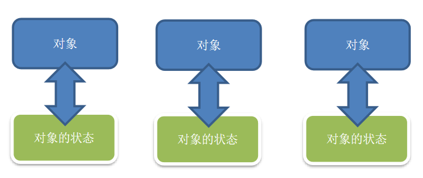

## 22.3 传统的方式的问题分析
1. 一个对象，就对应一个保存对象状态的对象，这样当我们游戏的对象很多时，不利于管理，开销也很大
2. 传统的方式是简单地做备份，new 出另外一个对象出来，再把需要备份的数据放到这个新对象，但这就暴露了对象内部的细节
3. 解决方案：=> **备忘录模式**

## 22.4 备忘录模式基本介绍
1. 备忘录模式（Memento Pattern）在不破坏封装性的前提下，捕获一个对象的内部状态，并在该对象之外保存这个状态。这样以后就可将该对象恢复到原先保存的状态
2. 可以这里理解备忘录模式：现实生活中的备忘录是用来记录某些要去做的事情，或者是记录已经达成的共同意见的事情，以防忘记了。而在软件层面，备忘录模式有着相同的含义，备忘录对象主要用来记录一个对象的某种状态，或者某些数据，当要做回退时，可以从备忘录对象里获取原来的数据进行恢复操作
3. 备忘录模式属于行为型模式

## 22.5 备忘录模式的原理类图
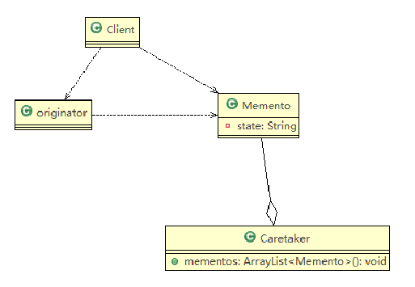

对原理类图的说明-即(备忘录模式的角色及职责)
1. originator：对象(需要保存状态的对象)
2. Memento：备忘录对象，负责保存好记录，即 Originator 内部状态
3. Caretaker：守护者对象，负责保存多个备忘录对象，使用集合管理，提高效率
4. 说明：如果希望保存多个 originator 对象的不同时间的状态，也可以，只需要要 `HashMap<String, 集合>`

代码实现
```java
package com.atguigu.memento.theory;
public class Originator {
	private String state;// 状态信息
	// getter and setter
	// 编写一个方法，可以保存一个状态对象 Memento
	// 因此编写一个方法，返回 Memento
	public Memento saveStateMemento() {
		return new Memento(state);
	}
	// 通过备忘录对象，恢复状态
	public void getStateFromMemento(Memento memento) {
		state = memento.getState();
	}
}
public class Memento {
	private String state;
	public Memento(String state) {
		this.state = state;
	}
	public String getState() {
		return state;
	}
}
public class Caretaker {
	// 在List集合中会有很多的备忘录对象
	private List<Memento> mementoList = new ArrayList<Memento>();
	public void add(Memento memento) {
		mementoList.add(memento);
	}
	// 获取到第index个Originator的备忘录对象(即保存状态)
	public Memento get(int index) {
		return mementoList.get(index);
	}
}
public class Client {
	public static void main(String[] args) {
		Originator originator = new Originator();
		Caretaker caretaker = new Caretaker();
		originator.setState("状态#1：攻击力 100");
		caretaker.add(originator.saveStateMemento());
		originator.setState("状态#2：攻击力 80");
		caretaker.add(originator.saveStateMemento());
		System.out.println("当前的状态是：" + originator.getState());
		originator.getStateFromMemento(caretaker.get(0));// 恢复状态#1
		System.out.println("当前的状态是：" + originator.getState());
	}
}
```

## 22.6 游戏角色恢复状态实例
1. 应用实例要求：游戏角色有攻击力和防御力，在大战 Boss 前保存自身的状态(攻击力和防御力)，当大战 Boss 后攻击力和防御力下降，从备忘录对象恢复到大战前的状态
2. 思路分析和图解(类图)
    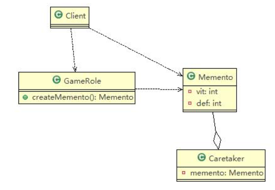
3. 代码实现
    ```java
    package com.atguigu.memento.game;
    public class GameRole {
        private int vit;//getter and setter
        private int def;//getter and setter
        // 创建Memento，即根据当前的状态得到Memento
        public Memento createMemento() {
            return new Memento(vit, def);
        }
        // 从备忘录对象，恢复GameRole的状态
        public void recoverGameRoleFromMemento(Memento memento) {
            this.vit = memento.getVit();
            this.def = memento.getDef();
        }
        // 显示当前游戏角色的状态
        public void display() {
            System.out.println("游戏角色当前的攻击力：" + this.vit + " 防御力: " + this.def);
        }
    }
    public class Memento {
        private int vit;// 攻击力
        private int def;// 防御力
        // constructor
        // getter and setter
    }
    //守护者对象, 保存游戏角色的状态
    public class Caretaker {
        // 如果只保存一次状态
        private Memento memento;
        public Memento getMemento() {
            return memento;
        }
        public void setMemento(Memento memento) {
            this.memento = memento;
        }
        // 对GameRole 保存多次状态
        // private ArrayList<Memento> mementos;
        // 对多个游戏角色保存多个状态
        // private HashMap<String, ArrayList<Memento>> rolesMementos;
    }
    public class Client {
        public static void main(String[] args) {
            GameRole gameRole = new GameRole();
            gameRole.setVit(100);gameRole.setDef(100);// 初始化状态
            Caretaker caretaker = new Caretaker();
            caretaker.setMemento(gameRole.createMemento());// 保存状态
            gameRole.setDef(30);gameRole.setVit(30);// 状态改变
            gameRole.recoverGameRoleFromMemento(caretaker.getMemento());// 恢复状态
        }
    }
    ```

## 22.7 备忘录模式的注意事项和细节
1. 给用户提供了一种可以恢复状态的机制，可以使用户能够比较方便地回到某个历史的状态
2. 实现了信息的封装，使得用户不需要关心状态的保存细节
3. 如果类的成员变量过多，势必会占用比较大的资源，而且每一次保存都会消耗一定的内存，这个需要注意
4. 适用的应用场景：1、后悔药；2、打游戏时的存档；3、Windows里的ctrl + z；4、IE中的后退；4、数据库的事务管理
5. 为了节约内存，备忘录模式可以和原型模式配合使用


# 第23章 解释器模式

## 23.1 四则运算问题
通过解释器模式来实现四则运算，如计算 a+b-c 的值，具体要求
1. 先输入表达式的形式，比如 a+b+c-d+e, 要求表达式的字母不能重复
2. 在分别输入 a, b, c, d, e 的值
3. 最后求出结果：如图
    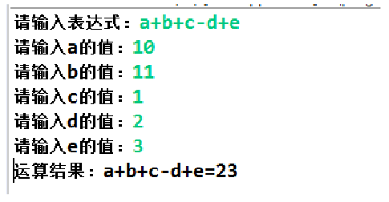

## 23.2 传统方案解决四则运算问题分析
1. 编写一个方法，接收表达式的形式，然后根据用户输入的数值进行解析，得到结果
2. 问题分析：如果加入新的运算符，比如 * / ( 等等，不利于扩展，另外让一个方法来解析会造成程序结构混乱，不够清晰
3. 解决方案：可以考虑使用**解释器模式**，即：表达式 -> 解释器(可以有多种) -> 结果

## 23.3 解释器模式基本介绍
1. 在编译原理中，一个算术表达式通过**词法分析器**形成词法单元，而后这些词法单元再通过**语法分析器**构建语法分析树，最终形成一颗抽象的语法分析树。这里的词法分析器和语法分析器都可以看做是解释器
2. 解释器模式（Interpreter Pattern）：是指给定一个语言(表达式)，定义它的文法的一种表示，并定义一个解释器，使用该解释器来解释语言中的句子(表达式)
3. 应用场景
   - 应用可以将一个需要解释执行的语言中的句子表示为一个抽象语法树
   - 一些重复出现的问题可以用一种简单的语言来表达
   - 一个简单语法需要解释的场景
4. 这样的例子还有，比如编译器、运算表达式计算、正则表达式、机器人等

## 23.4 解释器模式的原理类图
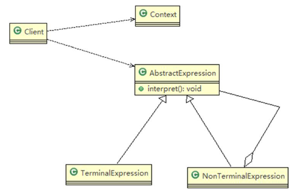

对原理类图的说明-即(解释器模式的角色及职责)
1. Context：是环境角色，含有解释器之外的全局信息
2. AbstractExpression：抽象表达式，声明一个抽象的解释操作，这个方法为抽象语法树中所有的节点所共享
3. TerminalExpression：为终结符表达式，实现与文法中的终结符相关的解释操作
4. NonTermialExpression：为非终结符表达式，为文法中的非终结符实现解释操作
5. 说明：输入 Context he TerminalExpression 信息通过 Client 输入即可

## 23.5 解释器模式来实现四则
1. 应用实例要求：通过解释器模式来实现四则运算，如计算a+b-c的值
2. 思路分析和图解(类图)
    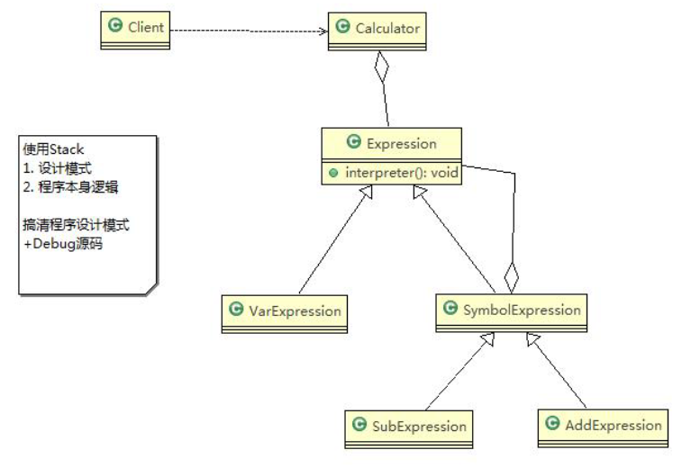
3. 代码实现
    ```java
    package com.atguigu.interpreter;
    // 抽象类表达式，通过HashMap键值对, 可以获取到变量的值
    public abstract class Expression {
        // a + b - c
        // 解释公式和数值, key 就是公式(表达式) 参数[a,b,c], value就是就是具体值
        // HashMap {a=10, b=20}
        public abstract int interpreter(HashMap<String, Integer> var);
    }
    // 变量的解释器
    public class VarExpression extends Expression {
        private String key; // key=a,key=b,key=c
        public VarExpression(String key) {
            this.key = key;
        }
        // var 就是{a=10, b=20}
        // interpreter 根据 变量名称，返回对应值
        @Override
        public int interpreter(HashMap<String, Integer> var) {
            return var.get(this.key);
        }
    }
    // 抽象运算符号解析器这里，每个运算符号，都只和自己左右两个数字有关系，但左右两个数字有可能也是一个解析的结果，无论何种类型，都是Expression类的实现类
    public class SymbolExpression extends Expression {
        protected Expression left;
        protected Expression right;
        public SymbolExpression(Expression left, Expression right) {
            this.left = left;
            this.right = right;
        }
        // 因为 SymbolExpression 是让其子类来实现，因此 interpreter 是一个默认实现
        @Override
        public int interpreter(HashMap<String, Integer> var) {
            return 0;
        }
    }
    public class AddExpression extends SymbolExpression  {
        public AddExpression(Expression left, Expression right) {
            super(left, right);
        }
        public int interpreter(HashMap<String, Integer> var) {
            return super.left.interpreter(var) + super.right.interpreter(var);
        }
    }
    public class SubExpression extends SymbolExpression {
        public SubExpression(Expression left, Expression right) {
            super(left, right);
        }
        public int interpreter(HashMap<String, Integer> var) {
            return super.left.interpreter(var) - super.right.interpreter(var);
        }
    }
    public class Calculator {
        private Expression expression;// 定义表达式
        // 构造函数传参，并解析
        public Calculator(String expStr) { // expStr = a+b
            // 安排运算先后顺序
            Stack<Expression> stack = new Stack<>();
            // 表达式拆分成字符数组
            char[] charArray = expStr.toCharArray();// [a, +, b]
            Expression left = null;
            Expression right = null;
            // 遍历我们的字符数组， 即遍历 [a, +, b]
            // 针对不同的情况，做处理
            for (int i = 0; i < charArray.length; i++) {
                switch (charArray[i]) {
                case '+': //
                    left = stack.pop();// 从stack取出left => "a"
                    right = new VarExpression(String.valueOf(charArray[++i]));// 取出右表达式 "b"
                    stack.push(new AddExpression(left, right));// 然后根据得到left 和 right 构建 AddExpresson加入stack
                    break;
                case '-': //
                    left = stack.pop();
                    right = new VarExpression(String.valueOf(charArray[++i]));
                    stack.push(new SubExpression(left, right));
                    break;
                default:
                    // 如果是一个 Var 就创建要给 VarExpression 对象，并push到 stack
                    stack.push(new VarExpression(String.valueOf(charArray[i])));
                    break;
                }
            }
            // 当遍历完整个 charArray 数组后，stack 就得到最后Expression
            this.expression = stack.pop();
        }
        public int run(HashMap<String, Integer> var) {
            // 最后将表达式a+b和 var = {a=10,b=20}
            // 然后传递给expression的interpreter进行解释执行
            return this.expression.interpreter(var);
        }
    }
    public class ClientTest {
        public static void main(String[] args) throws IOException {
            String expStr = getExpStr(); // a+b
            HashMap<String, Integer> var = getValue(expStr);// var {a=10, b=20}
            Calculator calculator = new Calculator(expStr);
            System.out.println("运算结果：" + expStr + "=" + calculator.run(var));
        }
        // 获得表达式
        public static String getExpStr() throws IOException {
            System.out.print("请输入表达式：");
            return (new BufferedReader(new InputStreamReader(System.in))).readLine();
        }
        // 获得值映射
        public static HashMap<String, Integer> getValue(String expStr) throws IOException {
            HashMap<String, Integer> map = new HashMap<>();
            for (char ch : expStr.toCharArray()) {
                if (ch != '+' && ch != '-') {
                    if (!map.containsKey(String.valueOf(ch))) {
                        System.out.print("请输入" + String.valueOf(ch) + "的值：");
                        String in = (new BufferedReader(new InputStreamReader(System.in))).readLine();
                        map.put(String.valueOf(ch), Integer.valueOf(in));
                    }
                }
            }
            return map;
        }
    }
    ```

## 23.6 解释器模式在 Spring 框架应用的源码剖析
1. Spring 框架中 SpelExpressionParser 就使用到解释器模式
2. 代码分析 + Debug源码
    ```java
    package com.atguigu.spring.test;
    import org.springframework.expression.Expression;
    import org.springframework.expression.spel.standard.SpelExpressionParser;
    public class Interpreter {
        public static void main(String[] args) {
            // 创建一个 Parser 对象
            SpelExpressionParser parser = new SpelExpressionParser();
            // 通过 Parser 对象 获取到一个Expression对象
            // 会根据不同的 Parser 对象 ，返回不同的 Expression对象
            Expression expression = parser.parseExpression("10 * (2 + 1) * 1 + 66"); // 96
            int result = (Integer) expression.getValue();
            System.out.println(result);
        }
    }
    ```
    
3. 说明
   - Expression 接口 表达式接口
   - 下面有不同的实现类，比如 SpelExpression，或者 CompositeStringExpression。
   - 使用时候，根据你创建的不同的 Parser 对象，返回不同的 Expression 对象
        ```java
        public Expression parseExpression(String expressionString, ParserContext context) throws ParseException {
            if (context == null) {
                context = NON_TEMPLATE_PARSER_CONTEXT;
            }
            if (context.isTemplate()) {
                return parseTemplate(expressionString, context); // 返回的就是 CompositeStringExpression
            } else {
                return doParseExpression(expressionString, context); // 返回的就是 SpelExpression
            }
        }
        ```
   - 使用得当 Expression对象，调用 getValue 解释执行 表达式，最后得到结果

## 23.7 解释器模式的注意事项和细节
1. 当有一个语言需要解释执行，可将该语言中的句子表示为一个抽象语法树，就可以考虑使用解释器模式，让程序具有良好的扩展性
2. 应用场景：编译器、运算表达式计算、正则表达式、机器人等
3. 使用解释器可能带来的问题：解释器模式会引起类膨胀、解释器模式采用递归调用方法，将会导致调试非常复杂、效率可能降低


# 第24章 状态模式

## 24.1 APP 抽奖活动问题
1. 假如每参加一次这个活动要扣除用户 50 积分，中奖概率是 10%
2. 奖品数量固定，抽完就不能抽奖
3. 活动有四个状态: 可以抽奖、不能抽奖、发放奖品和奖品领完
4. 活动的四个状态转换关系图
    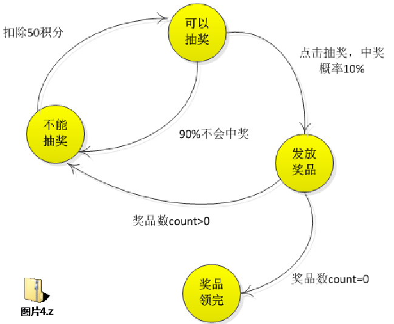

## 24.2 状态模式基本介绍
1. 状态模式（State Pattern）：它主要用来解决对象在多种状态转换时，需要对外输出不同的行为的问题。状态
和行为是一一对应的，状态之间可以相互转换
2. **当一个对象的内在状态改变时，允许改变其行为**，这个对象看起来像是改变了其类

## 24.3 状态模式的原理类图
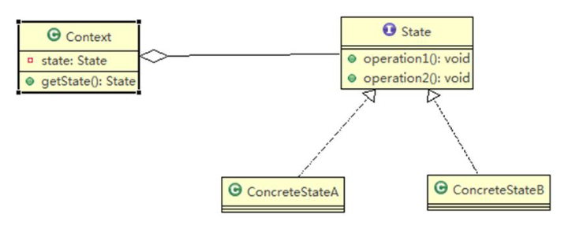

对原理类图的说明-即(状态模式的角色及职责)
1. Context 类为环境角色，用于维护 State 实例，这个实例定义当前状态
2. State 是抽象状态角色，定义一个接口封装与 Context 的一个特点接口相关行为
3. ConcreteState 具体的状态角色，每个子类实现一个与 Context 的一个状态相关行为

## 24.4 状态模式解决 APP 抽奖问题
1. 应用实例要求：完成 APP 抽奖活动项目，使用状态模式。
2. 思路分析和图解(类图)
   - 定义出一个接口叫状态接口，每个状态都实现它。
   - 接口有扣除积分方法、抽奖方法、发放奖品方法
    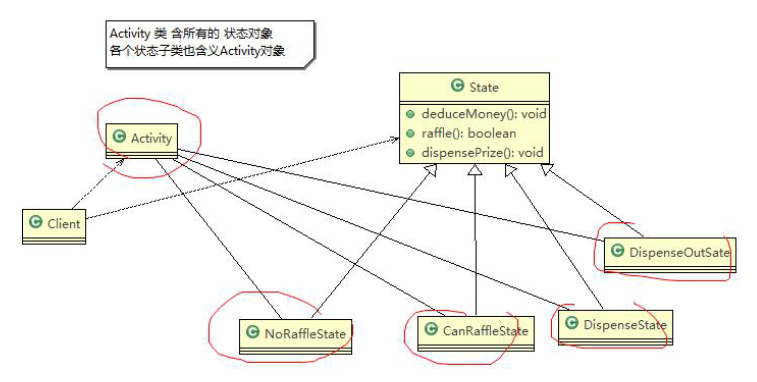
3. 代码实现
    ```java
    package com.atguigu.state;
    public abstract class State {// 状态抽象类
        public abstract void deductMoney();// 扣除积分
        public abstract boolean raffle();// 是否抽中奖品
        public abstract void dispensePrize();// 发放奖品
    }
    public class NoRaffleState extends State {//不能抽奖状态
        // 初始化时传入活动引用，扣除积分后改变其状态
        RaffleActivity activity;
        public NoRaffleState(RaffleActivity activity) {
            this.activity = activity;
        }
        // 当前状态可以扣积分，扣除后，将状态设置成可以抽奖状态
        @Override
        public void deductMoney() {
            System.out.println("扣除50积分成功，您可以抽奖了");
            activity.setState(activity.getCanRaffleState());
        }
        // 当前状态不能抽奖
        @Override
        public boolean raffle() {
            System.out.println("扣了积分才能抽奖喔！");
            return false;
        }
        // 当前状态不能发奖品
        @Override
        public void dispensePrize() {
            System.out.println("不能发放奖品");
        }
    }
    //可以抽奖的状态
    public class CanRaffleState extends State {
        RaffleActivity activity;
        public CanRaffleState(RaffleActivity activity) {
            this.activity = activity;
        }
        // 已经扣除了积分，不能再扣
        @Override
        public void deductMoney() {
            System.out.println("已经扣取过了积分");
        }
        // 可以抽奖，抽完奖后，根据实际情况，改成新的状态
        @Override
        public boolean raffle() {
            System.out.println("正在抽奖，请稍等！");
            Random r = new Random();
            int num = r.nextInt(10);
            if (num == 0) {// 10%中奖机会
                // 改变活动状态为发放奖品 context
                activity.setState(activity.getDispenseState());
                return true;
            } else {
                System.out.println("很遗憾没有抽中奖品！");
                // 改变状态为不能抽奖
                activity.setState(activity.getNoRafflleState());
                return false;
            }
        }
        // 不能发放奖品
        @Override
        public void dispensePrize() {
            System.out.println("没中奖，不能发放奖品");
        }
    }
    //发放奖品的状态
    public class DispenseState extends State {
        // 初始化时传入活动引用，发放奖品后改变其状态
        RaffleActivity activity;
        public DispenseState(RaffleActivity activity) {
            this.activity = activity;
        }
        @Override
        public void deductMoney() {
            System.out.println("不能扣除积分");
        }
        @Override
        public boolean raffle() {
            System.out.println("不能抽奖");
            return false;
        }
        @Override // 发放奖品
        public void dispensePrize() {
            if (activity.getCount() > 0) {
                System.out.println("恭喜中奖了");
                // 改变状态为不能抽奖
                activity.setState(activity.getNoRafflleState());
            } else {
                System.out.println("很遗憾，奖品发送完了");
                // 改变状态为奖品发送完毕, 后面我们就不可以抽奖
                activity.setState(activity.getDispensOutState());
                // System.out.println("抽奖活动结束");
                // System.exit(0);
            }
        }
    }
    // 奖品发放完毕状态
    // 说明，当我们activity 改变成 DispenseOutState，抽奖活动结束
    public class DispenseOutState extends State {
        // 初始化时传入活动引用
        RaffleActivity activity;
        public DispenseOutState(RaffleActivity activity) {
            this.activity = activity;
        }
        @Override
        public void deductMoney() {
            System.out.println("奖品发送完了，请下次再参加");
        }
        @Override
        public boolean raffle() {
            System.out.println("奖品发送完了，请下次再参加");
            return false;
        }
        @Override
        public void dispensePrize() {
            System.out.println("奖品发送完了，请下次再参加");
        }
    }
    public class RaffleActivity { // 抽奖活动
        State state = null;// state 表示活动当前的状态，getter and setter
        int count = 0; // 奖品数量
        // 四个属性，表示四种状态
        State noRafflleState = new NoRaffleState(this);// getter and setter
        State canRaffleState = new CanRaffleState(this);// getter and setter
        State dispenseState = new DispenseState(this);// getter and setter
        State dispensOutState = new DispenseOutState(this);// getter and setter
        // 构造器
        // 1. 初始化当前的状态为 noRafflleState（即不能抽奖的状态）
        // 2. 初始化奖品的数量
        public RaffleActivity(int count) {
            this.state = getNoRafflleState();
            this.count = count;
        }
        // 扣分, 调用当前状态的 deductMoney
        public void debuctMoney() {
            state.deductMoney();
        }
        public void raffle() {// 抽奖
            if (state.raffle()) {// 如果当前的状态是抽奖成功
                state.dispensePrize();// 领取奖品
            }
        }
        // 这里请大家注意，每领取一次奖品，count--
        public int getCount() {
            return count--;
        }
        public void setCount(int count) {
            this.count = count;
        }
    }
    public class ClientTest {
        public static void main(String[] args) {
            // 创建活动对象，奖品有1个奖品
            RaffleActivity activity = new RaffleActivity(1);
            // 我们连续抽300次奖
            for (int i = 0; i < 30; i++) {
                System.out.println("--------第" + (i + 1) + "次抽奖----------");
                activity.debuctMoney();// 参加抽奖，第一步点击扣除积分
                activity.raffle();// 第二步抽奖
            }
        }
    }
    ```

## 24.5 状态模式在实际项目-借贷平台 源码剖析
1. 借贷平台的订单，有审核-发布-抢单 等等 步骤，随着操作的不同，会改变订单的状态, 项目中的这个模块实现就会使用到状态模式
    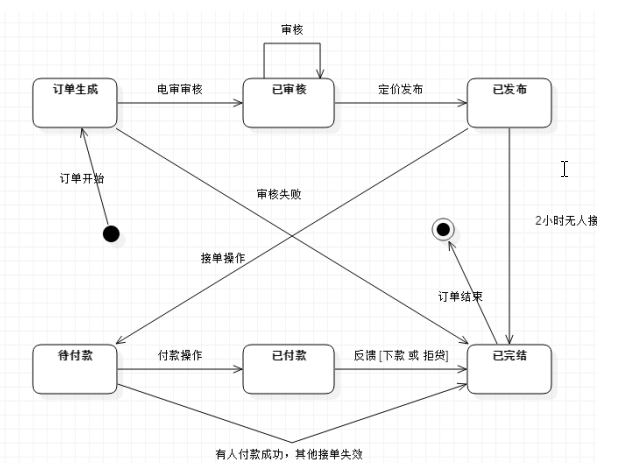
2. 通常通过 if/else 判断订单的状态，从而实现不同的逻辑，伪代码如下
    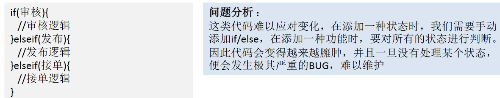
3. 使用状态模式完成 借贷平台项目的审核模块 \[设计+代码\]
    ```java
    package com.atguigu.state.money;
    public interface State {//状态接口
        void checkEvent(Context context);//电审
        void checkFailEvent(Context context);//电审失败
        void makePriceEvent(Context context);//定价发布
        void acceptOrderEvent(Context context);//接单
        void notPeopleAcceptEvent(Context context);//无人接单失效
        void payOrderEvent(Context context);//付款
        void orderFailureEvent(Context context);//接单有人支付失效
        void feedBackEvent(Context context);//反馈
        String getCurrentState();
    }
    public abstract class AbstractState implements State {
        protected static final RuntimeException EXCEPTION = new RuntimeException("操作流程不允许");
        // 抽象类，默认实现了 State 接口的所有方法
        // 该类的所有方法，其子类(具体的状态类)，可以有选择的进行重写
        @Override
        public void checkEvent(Context context) {
            throw EXCEPTION;
        }
        @Override
        public void checkFailEvent(Context context) {
            throw EXCEPTION;
        }
        @Override
        public void makePriceEvent(Context context) {
            throw EXCEPTION;
        }
        @Override
        public void acceptOrderEvent(Context context) {
            throw EXCEPTION;
        }
        @Override
        public void notPeopleAcceptEvent(Context context) {
            throw EXCEPTION;
        }
        @Override
        public void payOrderEvent(Context context) {
            throw EXCEPTION;
        }
        @Override
        public void orderFailureEvent(Context context) {
            throw EXCEPTION;
        }
        @Override
        public void feedBackEvent(Context context) {
            throw EXCEPTION;
        }
    }
    //各种具体状态类
    class FeedBackState extends AbstractState {
        @Override
        public String getCurrentState() {
            return StateEnum.FEED_BACKED.getValue();
        }
    }
    class GenerateState extends AbstractState {
        @Override
        public void checkEvent(Context context) {
            context.setState(new ReviewState());
        }
        @Override
        public void checkFailEvent(Context context) {
            context.setState(new FeedBackState());
        }
        @Override
        public String getCurrentState() {
            return StateEnum.GENERATE.getValue();
        }
    }
    class NotPayState extends AbstractState {
        @Override
        public void payOrderEvent(Context context) {
            context.setState(new PaidState());
        }
        @Override
        public void feedBackEvent(Context context) {
            context.setState(new FeedBackState());
        }
        @Override
        public String getCurrentState() {
            return StateEnum.NOT_PAY.getValue();
        }
    }
    class PaidState extends AbstractState {
        @Override
        public void feedBackEvent(Context context) {
            context.setState(new FeedBackState());
        }
        @Override
        public String getCurrentState() {
            return StateEnum.PAID.getValue();
        }
    }
    class PublishState extends AbstractState {
        @Override
        public void acceptOrderEvent(Context context) {
            // 把当前状态设置为 NotPayState。。。
            // 至于应该变成哪个状态，有流程图来决定
            context.setState(new NotPayState());
        }
        @Override
        public void notPeopleAcceptEvent(Context context) {
            context.setState(new FeedBackState());
        }
        @Override
        public String getCurrentState() {
            return StateEnum.PUBLISHED.getValue();
        }
    }
    class ReviewState extends AbstractState {
        @Override
        public void makePriceEvent(Context context) {
            context.setState(new PublishState());
        }
        @Override
        public String getCurrentState() {
            return StateEnum.REVIEWED.getValue();
        }
    }
    public enum StateEnum {// 状态枚举类
        GENERATE(1, "GENERATE"),// 订单生成
        REVIEWED(2, "REVIEWED"),// 已审核
        PUBLISHED(3, "PUBLISHED"),// 已发布
        NOT_PAY(4, "NOT_PAY"),// 待付款
        PAID(5, "PAID"),// 已付款
        FEED_BACKED(6, "FEED_BACKED");// 已完结
        private int key;
        private String value;
        StateEnum(int key, String value) {
            this.key = key;
            this.value = value;
        }
        public int getKey() {
            return key;
        }
        public String getValue() {
            return value;
        }
    }
    //环境上下文
    public class Context extends AbstractState {
        // 当前的状态 state, 根据我们的业务流程处理，不停的变化
        private State state;//getter/setter
        @Override
        public void checkEvent(Context context) {
            state.checkEvent(this);
            getCurrentState();
        }
        @Override
        public void checkFailEvent(Context context) {
            state.checkFailEvent(this);
            getCurrentState();
        }
        @Override
        public void makePriceEvent(Context context) {
            state.makePriceEvent(this);
            getCurrentState();
        }
        @Override
        public void acceptOrderEvent(Context context) {
            state.acceptOrderEvent(this);
            getCurrentState();
        }
        @Override
        public void notPeopleAcceptEvent(Context context) {
            state.notPeopleAcceptEvent(this);
            getCurrentState();
        }
        @Override
        public void payOrderEvent(Context context) {
            state.payOrderEvent(this);
            getCurrentState();
        }
        @Override
        public void orderFailureEvent(Context context) {
            state.orderFailureEvent(this);
            getCurrentState();
        }
        @Override
        public void feedBackEvent(Context context) {
            state.feedBackEvent(this);
            getCurrentState();
        }
        @Override
        public String getCurrentState() {
            System.out.println("当前状态 : " + state.getCurrentState());
            return state.getCurrentState();
        }
    }
    public class ClientTest {
        public static void main(String[] args) {
            // 创建context 对象
            Context context = new Context();
            // 将当前状态设置为 PublishState
            context.setState(new PublishState());
            System.out.println(context.getCurrentState());
            // publish --> not pay
            context.acceptOrderEvent(context);
            // not pay --> paid
            context.payOrderEvent(context);
            // 失败, 检测失败时，会抛出异常
            try {
                context.checkFailEvent(context);
                System.out.println("流程正常..");
            } catch (Exception e) {
                System.out.println(e.getMessage());
            }
        }
    }
    ```

## 24.6 状态模式的注意事项和细节
1. 代码有很强的可读性。状态模式将每个状态的行为封装到对应的一个类中
2. **方便维护**。将容易产生问题的 if-else 语句删除了，如果把每个状态的行为都放到一个类中，每次调用方法时都要判断当前是什么状态，不但会产出很多 if-else 语句，而且容易出错
3. 符合“开闭原则”。容易增删状态
4. 会产生很多类。每个状态都要一个对应的类，当状态过多时会产生很多类，加大维护难度
5. 应用场景：当一个事件或者对象有很多种状态，状态之间会相互转换，对不同的状态要求有不同的行为的时候，可以考虑使用状态模式


# 第25章 策略模式

## 25.1 鸭子项目
1. 有各种鸭子(比如 野鸭、北京鸭、水鸭等，鸭子有各种行为，比如 叫、飞行等)
2. 显示鸭子的信息

## 25.2 传统方案解决鸭子问题的分析和代码实现
1. 传统的设计方案(类图)
    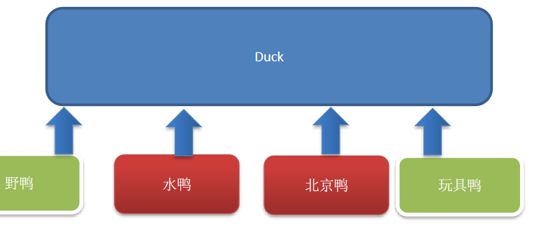
2. 代码实现-看老师演示
    ```java
    public abstract class Duck {
        public abstract void display();// 显示鸭子信息
        public void quack() {
            System.out.println("鸭子嘎嘎叫~~");
        }
        public void swim() {
            System.out.println("鸭子会游泳~~");
        }
        public void fly() {
            System.out.println("鸭子会飞翔~~~");
        }
    }
    public class WildDuck extends Duck {
        @Override
        public void display() {
            System.out.println("这是野鸭");
        }
    }
    public class ToyDuck extends Duck {
        @Override
        public void display() {
            System.out.println("玩具鸭");
        }
        public void quack() {
            System.out.println("玩具鸭不能叫~~");
        }
        public void swim() {
            System.out.println("玩具鸭不会游泳~~");
        }
        public void fly() {
            System.out.println("玩具鸭不会飞翔~~~");
        }
    }
    public class PekingDuck extends Duck {
        @Override
        public void display() {
            System.out.println("~~北京鸭~~");
        }
        @Override
        public void fly() {
            System.out.println("北京鸭不能飞翔");
        }
    }
    ```

## 25.3 传统的方式实现的问题分析和解决方案
1. 其它鸭子，都继承了Duck类，所以fly让所有子类都会飞了，这是不正确的
2. 上面说的1的问题，其实是继承带来的问题：对类的局部改动，尤其超类的局部改动，会影响其他部分。会有溢出效应
3. 为了改进1问题，我们可以通过覆盖fly方法来解决 => **覆盖解决**
4. 问题又来了，如果我们有一个玩具鸭子ToyDuck，这样就需要ToyDuck去覆盖Duck的所有实现的方法 => 解决思路 **策略模式** (strategy pattern)

## 25.4 策略模式基本介绍
1. 策略模式（Strategy Pattern）中，定义**算法族（策略组）**，分别封装起来，让他们之间可以互相替换，此模式让**算法的变化**独立于**使用算法的客户**
2. 这算法体现了几个设计原则，第一、把变化的代码从不变的代码中分离出来；第二、针对接口编程而不是具体类（定义了策略接口）；第三、多用组合/聚合，少用继承（客户通过组合方式使用策略）。

## 25.5 策略模式的原理类图
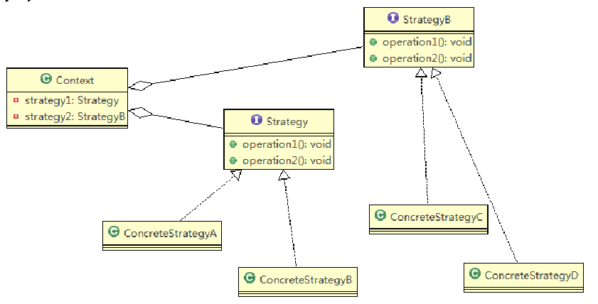

说明：从上图可以看到，客户 context 有成员变量strategy或者其他的策略接口，至于需要使用到哪个策略，我们可以在构造器中指定。

## 25.6 策略模式解决鸭子问题
1. 应用实例要求：编写程序完成前面的鸭子项目，要求使用策略模式
2. 思路分析(类图)：策略模式：分别封装行为接口，实现算法族，超类里放行为接口对象，在子类里具体设定行为对象。原则就是：分离变化部分，封装接口，基于接口编程各种功能。此模式让行为的变化独立于算法的使用者。
    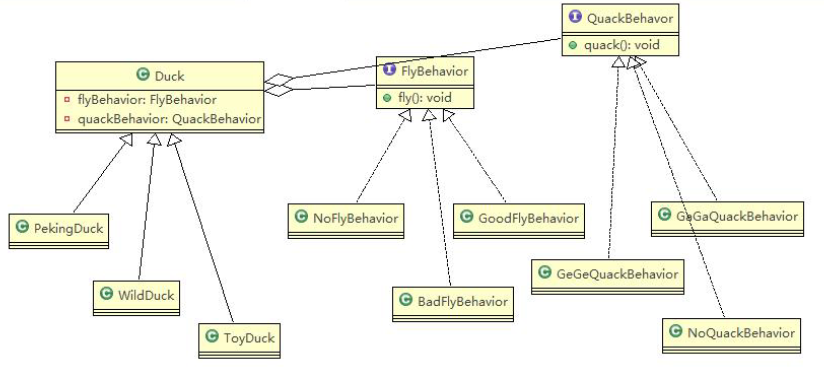
3. 代码实现
    ```java
    package com.atguigu.strategy.improve;
    public interface FlyBehavior {
        void fly(); // 子类具体实现
    }
    public class GoodFlyBehavior implements FlyBehavior {
        @Override
        public void fly() {
            System.out.println("飞翔技术高超~~~");
        }
    }
    public class BadFlyBehavior implements FlyBehavior {
        @Override
        public void fly() {
            System.out.println("飞翔技术一般...");
        }
    }
    public class NoFlyBehavior implements FlyBehavior{
        @Override
        public void fly() {
            System.out.println("不会飞翔...");
        }
    }
    public interface QuackBehavior {
        void quack();// 子类实现
    }
    public abstract class Duck {
        FlyBehavior flyBehavior;// 属性，策略接口
        QuackBehavior quackBehavior;// 其它属性<->策略接口
        public abstract void display();// 显示鸭子信息
        public void quack() {
            System.out.println("鸭子嘎嘎叫~~");
        }
        public void swim() {
            System.out.println("鸭子会游泳~~");
        }
        public void fly() {
            if (flyBehavior != null) {
                flyBehavior.fly();
            }
        }
        public void setFlyBehavior(FlyBehavior flyBehavior) {
            this.flyBehavior = flyBehavior;
        }
        public void setQuackBehavior(QuackBehavior quackBehavior) {
            this.quackBehavior = quackBehavior;
        }
    }
    public class WildDuck extends Duck {
        // 构造器，传入FlyBehavor 的对象
        public WildDuck() {
            flyBehavior = new GoodFlyBehavior();
        }
        @Override
        public void display() {
            System.out.println(" 这是野鸭 ");
        }
    }
    public class PekingDuck extends Duck {
        // 假如北京鸭可以飞翔，但是飞翔技术一般
        public PekingDuck() {
            flyBehavior = new BadFlyBehavior();
        }
        @Override
        public void display() {
            System.out.println("~~北京鸭~~~");
        }
    }
    public class ToyDuck extends Duck {
        public ToyDuck() {
            flyBehavior = new NoFlyBehavior();
        }
        @Override
        public void display() {
            System.out.println("玩具鸭");
        }
        // 需要重写父类的所有方法
        public void quack() {
            System.out.println("玩具鸭不能叫~~");
        }
        public void swim() {
            System.out.println("玩具鸭不会游泳~~");
        }
    }
    public class Client {
        public static void main(String[] args) {
            WildDuck wildDuck = new WildDuck();
            wildDuck.fly();
            ToyDuck toyDuck = new ToyDuck();
            toyDuck.fly();
            PekingDuck pekingDuck = new PekingDuck();
            pekingDuck.setFlyBehavior(new NoFlyBehavior());
            pekingDuck.fly();
        }
    }
    ```

## 25.7 策略模式在 JDK-Arrays 应用的源码分析
1. JDK 的 Arrays 的 Comparator 就使用了策略模式
2. 代码分析 + Debug源码 + 模式角色分析
    ```java
    package com.atguigu.jdk;
    public class Strategy {
        public static void main(String[] args) {
            Integer[] data = { 9, 1, 2, 8, 4, 3 };
            // 1. 实现了 Comparator 接口（策略接口） , 匿名类 对象 new Comparator<Integer>(){..}
            // 2. 对象 new Comparator<Integer>(){..} 就是实现了 策略接口 的对象
            // 3. public int compare(Integer o1, Integer o2){} 指定具体的处理方式
            // 方式1
            Arrays.sort(data, new Comparator<Integer>() {
                public int compare(Integer o1, Integer o2) {
                    if (o1 > o2) {
                        return -1;
                    } else {
                        return 1;
                    }
                };
            });
            // 方式2-lambda表达式实现 策略模式
            Integer[] data2 = { 19, 11, 12, 18, 14, 13 };
            Arrays.sort(data2, (var1, var2) -> { //降序
                if (var1.compareTo(var2) > 0) {
                    return -1;
                } else {
                    return 1;
                }
            });
        }
    }
    ```
    ```java
    package java.util;
    public class Arrays {
        public static <T> void sort(T[] a, Comparator<? super T> c) {
            if (c == null) {
                sort(a);
            } else {
                if (LegacyMergeSort.userRequested)
                    legacyMergeSort(a, c);
                else
                    TimSort.sort(a, 0, a.length, c, null, 0, 0);
            }
        }
        private static <T> void legacyMergeSort(T[] a, Comparator<? super T> c) {
            T[] aux = a.clone();
            if (c==null)
                mergeSort(aux, a, 0, a.length, 0);
            else
                mergeSort(aux, a, 0, a.length, 0, c);
        }
        @SuppressWarnings({"unchecked", "rawtypes"})
        private static void mergeSort(Object[] src, Object[] dest, int low, int high, int off) {
            int length = high - low;
            // 最小数组的插入排序
            if (length < INSERTIONSORT_THRESHOLD) {
                for (int i=low; i<high; i++)
                    for (int j=i; j>low &&
                            ((Comparable) dest[j-1]).compareTo(dest[j])>0; j--)
                        swap(dest, j, j-1);
                return;
            }
            // 递归地将dest的一半排序到src中
            int destLow  = low;
            int destHigh = high;
            low  += off;
            high += off;
            int mid = (low + high) >>> 1;
            mergeSort(dest, src, low, mid, -off);
            mergeSort(dest, src, mid, high, -off);
            // 如果列表已经排序，只需从src复制到dest。这是一种优化，可以使几乎排序的列表排序更快。
            if (((Comparable)src[mid-1]).compareTo(src[mid]) <= 0) {
                System.arraycopy(src, low, dest, destLow, length);
                return;
            }
            // 合并排序的一半(现在在src)到dest
            for(int i = destLow, p = low, q = mid; i < destHigh; i++) {
                if (q >= high || p < mid && ((Comparable)src[p]).compareTo(src[q])<=0)
                    dest[i] = src[p++];
                else
                    dest[i] = src[q++];
            }
        }
        // ...
    }
    class TimSort<T> {
        static <T> void sort(T[] a, int lo, int hi, Comparator<? super T> c,
                            T[] work, int workBase, int workLen) {
            assert c != null && a != null && lo >= 0 && lo <= hi && hi <= a.length;
            int nRemaining  = hi - lo;
            if (nRemaining < 2)
                return;  // 大小为0和1的数组总是有序的
            // 如果数组很小，执行“mini-TimSort”，不合并
            if (nRemaining < MIN_MERGE) {
                int initRunLen = countRunAndMakeAscending(a, lo, hi, c);
                binarySort(a, lo, hi, lo + initRunLen, c);
                return;
            }
            // 遍历数组一次，从左到右，找到自然运行，将短期自然运行扩展到minRun元素，并合并运行以保持堆栈不变。
            TimSort<T> ts = new TimSort<>(a, c, work, workBase, workLen);
            int minRun = minRunLength(nRemaining);
            do {
                // 确定下一步的运行
                int runLen = countRunAndMakeAscending(a, lo, hi, c);
                // 如果run是短的，扩展到min(minRun, nRemaining)
                if (runLen < minRun) {
                    int force = nRemaining <= minRun ? nRemaining : minRun;
                    binarySort(a, lo, lo + force, lo + runLen, c);
                    runLen = force;
                }
                // 将运行推到暂挂运行堆栈上，然后合并
                ts.pushRun(lo, runLen);
                ts.mergeCollapse();
                // 提前寻找下一个运行
                lo += runLen;
                nRemaining -= runLen;
            } while (nRemaining != 0);
            // 合并所有剩余的运行以完成排序
            assert lo == hi;
            ts.mergeForceCollapse();
            assert ts.stackSize == 1;
        }
        // ...
    }
    ```

## 25.8 策略模式的注意事项和细节
1. 策略模式的关键是：分析项目中变化部分与不变部分
2. 策略模式的核心思想是：多用组合/聚合 少用继承；用行为类组合，而不是行为的继承。更有弹性
3. 体现了“对修改关闭，对扩展开放”原则，客户端增加行为不用修改原有代码，只要添加一种策略（或者行为）即可，避免了使用多重转移语句（if..else if..else）
4. 提供了可以替换继承关系的办法： 策略模式将算法封装在独立的 Strategy 类中使得你可以独立于其 Context 改变它，使它易于切换、易于理解、易于扩展
5. 需要注意的是：每添加一个策略就要增加一个类，当策略过多是会导致类数目庞大


# 第26章 职责链模式

## 26.1 学校 OA 系统的采购审批项目：需求是
采购员采购教学器材
1. 如果金额 小于等于 5000, 由教学主任审批 （0<=x<=5000）
2. 如果金额 小于等于 10000, 由院长审批 (5000<x<=10000)
3. 如果金额 小于等于 30000, 由副校长审批 (10000<x<=30000)
4. 如果金额 超过 30000 以上，有校长审批 (30000<x)
请设计程序完成采购审批项目

## 26.2 传统方案解决 OA 系统审批，传统的设计方案(类图)
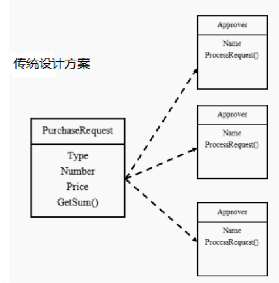

## 26.3 传统方案解决 OA 系统审批问题分析
1. 传统方式是：接收到一个采购请求后，根据采购金额来调用对应的Approver (审批人)完成审批。
2. 传统方式的问题分析 : 客户端这里会使用到 分支判断(比如 switch) 来对不同的采购请求处理， 这样就存在如下问题 (1) 如果各个级别的人员审批金额发生变化，在客户端的也需要变化 (2) 客户端必须明确的知道 有多少个审批级别和访问
3. 这样 对一个采购请求进行处理 和 Approver (审批人) 就存在强耦合关系，不利于代码的扩展和维护
4. 解决方案 =》 职责链模式

## 26.4 职责链模式基本介绍
1. 职责链模式（Chain of Responsibility Pattern）, 又叫 责任链模式，为请求创建了一个接收者对象的链(简单示意图)。这种模式对请求的发送者和接收者进行解耦。
2. 职责链模式通常每个接收者都包含对另一个接收者的引用。如果一个对象不能处理该请求，那么它会把相同的请求传给下一个接收者，依此类推。
3. 这种类型的设计模式属于**行为型模式**

## 26.5 职责链模式的原理类图


对原理类图的说明-即(职责链模式的角色及职责)
1. Handler：抽象的处理者，定义了一个处理请求的接口，同时含义另外 Handler
2. ConcreteHandlerA，B是具体的处理者，处理它自己负责的请求，可以访问它的后继者(即下一个处理者)，如果可以处理当前请求，则处理，否则就将该请求交个后继者去处理，从而形成一个职责链
3. Request，含义很多属性，表示一个请求

## 26.6 职责链模式解决 OA 系统采购审批
1. 应用实例要求：编写程序完成学校 OA 系统的采购审批项目：需求采购员采购教学器材
   1. 如果金额 小于等于 5000，由教学主任审批
   2. 如果金额 小于等于 10000，由院长审批
   3. 如果金额 小于等于 30000，由副校长审批
   4. 如果金额 超过 30000 以上，有校长审批
2. 思路分析和图解(类图)
    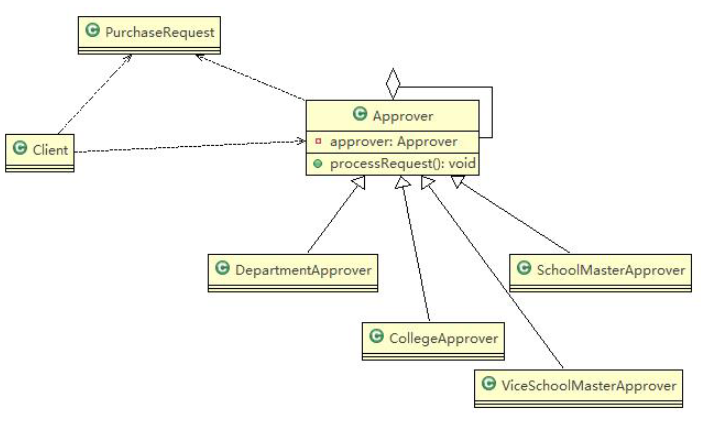
3. 代码实现
    ```java
    package com.atguigu.responsibilitychain;
    public class PurchaseRequest {//请求类
        private int type = 0; // 请求类型 getter
        private float price = 0.0f; // 请求金额 getter
        private int id = 0;// 请求编号 getter
        // 构造器
    }
    public abstract class Approver {
        Approver approver; // 下一个处理者
        String name; // 名字
        public Approver(String name) {
            this.name = name;
        }
        // 下一个处理者
        public void setApprover(Approver approver) {
            this.approver = approver;
        }
        // 处理审批请求的方法，得到一个请求, 处理是子类完成，因此该方法做成抽象
        public abstract void processRequest(PurchaseRequest purchaseRequest);
    }
    public class DepartmentApprover extends Approver {
        public DepartmentApprover(String name) {
            super(name);
        }
        @Override
        public void processRequest(PurchaseRequest purchaseRequest) {
            if (purchaseRequest.getPrice() <= 5000) {
                System.out.println("请求" + purchaseRequest.getId() + "被" + this.name + "处理");
            } else {
                approver.processRequest(purchaseRequest);
            }
        }
    }
    public class CollegeApprover extends Approver {
        public CollegeApprover(String name) {
            super(name);
        }
        @Override
        public void processRequest(PurchaseRequest purchaseRequest) {
            if (purchaseRequest.getPrice() < 5000 && purchaseRequest.getPrice() <= 10000) {
                System.out.println("请求" + purchaseRequest.getId() + "被" + this.name + "处理");
            } else {
                approver.processRequest(purchaseRequest);
            }
        }
    }
    public class ViceSchoolMasterApprover extends Approver {
        public ViceSchoolMasterApprover(String name) {
            super(name);
        }
        @Override
        public void processRequest(PurchaseRequest purchaseRequest) {
            if (purchaseRequest.getPrice() < 10000 && purchaseRequest.getPrice() <= 30000) {
                System.out.println("请求" + purchaseRequest.getId() + "被" + this.name + "处理");
            } else {
                approver.processRequest(purchaseRequest);
            }
        }
    }
    public class SchoolMasterApprover extends Approver {
        public SchoolMasterApprover(String name) {
            super(name);
        }
        @Override
        public void processRequest(PurchaseRequest purchaseRequest) {
            if (purchaseRequest.getPrice() > 30000) {
                System.out.println("请求" + purchaseRequest.getId() + "被" + this.name + "处理");
            } else {
                approver.processRequest(purchaseRequest);
            }
        }
    }
    public class Client {
        public static void main(String[] args) {
            // 创建一个请求
            PurchaseRequest purchaseRequest = new PurchaseRequest(1, 31000, 1);
            // 创建相关的审批人
            DepartmentApprover departmentApprover = new DepartmentApprover("张主任");
            CollegeApprover collegeApprover = new CollegeApprover("李院长");
            ViceSchoolMasterApprover viceSchoolMasterApprover = new ViceSchoolMasterApprover("王副校");
            SchoolMasterApprover schoolMasterApprover = new SchoolMasterApprover("佟校长");
            // 需要将各个审批级别的下一个设置好 (处理人构成环形，无论让谁去处理，最终总是能处理)
            departmentApprover.setApprover(collegeApprover);
            collegeApprover.setApprover(viceSchoolMasterApprover);
            viceSchoolMasterApprover.setApprover(schoolMasterApprover);
            schoolMasterApprover.setApprover(departmentApprover);

            departmentApprover.processRequest(purchaseRequest);
            viceSchoolMasterApprover.processRequest(purchaseRequest);
        }
    }
    ```

## 26.7 职责链模式在 SpringMVC 框架应用的源码分析
1. SpringMVC-HandlerExecutionChain 类就使用到职责链模式
2. SpringMVC 请求流程简图
    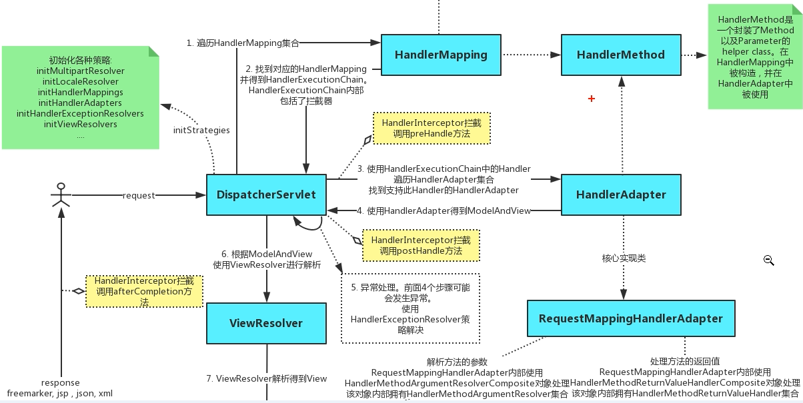
3. 代码分析 + Debug源码 + 说明
    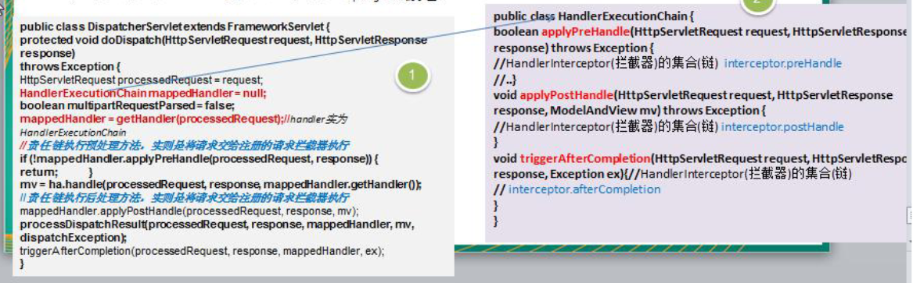
4. 源码和说明
    ```java
    package org.springframework.web.servlet;
    public class DispatcherServlet extends FrameworkServlet {
        protected void doDispatch(HttpServletRequest request, HttpServletResponse response) throws Exception {
            HttpServletRequest processedRequest = request;
            HandlerExecutionChain mappedHandler = null; // mappedHandler
            boolean multipartRequestParsed = false;
            WebAsyncManager asyncManager = WebAsyncUtils.getAsyncManager(request);
            try {
                ModelAndView mv = null;
                Exception dispatchException = null;
                try {
                    processedRequest = checkMultipart(request);
                    multipartRequestParsed = processedRequest != request;
                    // 确定当前请求的处理程序。
                    mappedHandler = getHandler(processedRequest);//获取到HandlerExecutionChain对象
                    if (mappedHandler == null || mappedHandler.getHandler() == null) {
                        noHandlerFound(processedRequest, response);
                        return;
                    }
                    // 确定当前请求的处理程序适配器。
                    HandlerAdapter ha = getHandlerAdapter(mappedHandler.getHandler());
                    // 处理最后修改的报头(如果处理程序支持的话)。
                    String method = request.getMethod();
                    boolean isGet = "GET".equals(method);
                    if (isGet || "HEAD".equals(method)) {
                        long lastModified = ha.getLastModified(request, mappedHandler.getHandler());
                        if (logger.isDebugEnabled()) {
                            String requestUri = urlPathHelper.getRequestUri(request);
                            logger.debug("Last-Modified value for [" + requestUri + "] is: " + lastModified);
                        }
                        if (new ServletWebRequest(request, response).checkNotModified(lastModified) && isGet) {
                            return;
                        }
                    }
                    if (!mappedHandler.applyPreHandle(processedRequest, response)) {
                        return;
                    }
                    try {
                        // 实际调用处理程序。
                        mv = ha.handle(processedRequest, response, mappedHandler.getHandler());
                    } finally {
                        if (asyncManager.isConcurrentHandlingStarted()) {
                            return;
                        }
                    }
                    applyDefaultViewName(request, mv);
                    mappedHandler.applyPostHandle(processedRequest, response, mv);
                } catch (Exception ex) {
                    dispatchException = ex;
                }
                processDispatchResult(processedRequest, response, mappedHandler, mv, dispatchException);
            } catch (Exception ex) {
                triggerAfterCompletion(processedRequest, response, mappedHandler, ex);
            } catch (Error err) {
                triggerAfterCompletionWithError(processedRequest, response, mappedHandler, err);
            } finally {
                if (asyncManager.isConcurrentHandlingStarted()) {
                    // Instead of postHandle and afterCompletion
                    mappedHandler.applyAfterConcurrentHandlingStarted(processedRequest, response);
                    return;
                }
                // 清除由多部分请求使用的所有资源。
                if (multipartRequestParsed) {
                    cleanupMultipart(processedRequest);
                }
            }
        }
        // ...
    }
    public class HandlerExecutionChain {
        boolean applyPreHandle(HttpServletRequest request, HttpServletResponse response) throws Exception {
            if (getInterceptors() != null) {
                for (int i = 0; i < getInterceptors().length; i++) {
                    HandlerInterceptor interceptor = getInterceptors()[i];
                    if (!interceptor.preHandle(request, response, this.handler)) {
                        triggerAfterCompletion(request, response, null);
                        return false;
                    }
                    this.interceptorIndex = i;
                }
            }
            return true;
        }
        void applyPostHandle(HttpServletRequest request, HttpServletResponse response, ModelAndView mv) throws Exception {
            if (getInterceptors() == null) {
                return;
            }
            for (int i = getInterceptors().length - 1; i >= 0; i--) {
                HandlerInterceptor interceptor = getInterceptors()[i];
                interceptor.postHandle(request, response, this.handler, mv);
            }
        }
        void triggerAfterCompletion(HttpServletRequest request, HttpServletResponse response, Exception ex)
                throws Exception {
            if (getInterceptors() == null) {
                return;
            }
            for (int i = this.interceptorIndex; i >= 0; i--) {
                HandlerInterceptor interceptor = getInterceptors()[i];
                try {
                    interceptor.afterCompletion(request, response, this.handler, ex);
                } catch (Throwable ex2) {
                    logger.error("HandlerInterceptor.afterCompletion threw exception", ex2);
                }
            }
        }
        // ...
    }
    ```
5. 对源码总结
   - springmvc 请求的流程图中，执行了 拦截器相关方法 interceptor.preHandler 等等
   - 在处理 SpringMvc 请求时，使用到职责链模式还使用到适配器模式
   - HandlerExecutionChain 主要负责的是请求拦截器的执行和请求处理，但是他本身不处理请求，只是将请求分配给链上注册处理器执行，这是职责链实现方式，减少职责链本身与处理逻辑之间的耦合，规范了处理流程
   - HandlerExecutionChain 维护了 HandlerInterceptor 的集合，可以向其中注册相应的拦截器

## 26.8 职责链模式的注意事项和细节
1. 将请求和处理分开，实现解耦，提高系统的灵活性
2. 简化了对象，使对象不需要知道链的结构
3. 性能会受到影响，特别是在链比较长的时候，因此需控制链中最大节点数量，一般通过在Handler中设置一个最大节点数量，在setNext()方法中判断是否已经超过阀值，超过则不允许该链建立，避免出现超长链无意识地破坏系统性能
4. 调试不方便。采用了类似递归的方式，调试时逻辑可能比较复杂
5. 最佳应用场景：有多个对象可以处理同一个请求时，比如：多级请求、请假/加薪等审批流程、Java Web中Tomcat对Encoding的处理、拦截器

## 设计模式在框架或项目中源码分析的说明
1. 为了让同学们可以更加深入的理解某个设计模式，我们会找该模式在spring, springMVC, MyBatis 或者 JDK 源码 中的应用
2. 有一点需要说明：设计模式是程序员在编程中，有意或者是无意使用到的(也不是所有的程序员都学习过设计模式)，并且同一种设计模式实现方式也不是100%的一样，设计模式主要是提高程序的扩展性，可读性，可维护性、规范性。
3. 所以在我们讲某个设计模式在源码框架中使用时，和我们的标准的设计模式写法可能会有些出入，比如组合模式 Component 可以是抽象类，接口，也可以是一个实现类， 我们讲源码时(JDK HashMap源码)，Component 就可能不一样
4. 对于框架源码，源码中部分使用了A设计模式，还部分使用了B设计模式，也是有可能的，也就是说设计模式是可以结合使用的
5. 因为设计模式主要是一种编程思想，既然是思想，具体实现方式，就不可能100%的一样(当然，程序的设计结构基本是一样的)
6. 所以，提醒大家我们学习设计模式时，（包括看源码分析），要抓住本质，就是使用这个设计模式到底带了了什么好处？是扩展性提高了，还是更加规范了，这样我们才能领会设计模式的精妙之处。

