# MySQL基础

## 知识要点
```
一、为什么要学习数据库
二、数据库的相关概念
	DBMS、DB、SQL
三、数据库存储数据的特点
四、初始MySQL
	MySQL产品的介绍
	MySQL产品的安装★
	MySQL服务的启动和停止★
	MySQL服务的登录和退出★
	MySQL的常见命令和语法规范
五、DQL语言的学习★
	基础查询★
	条件查询★
	排序查询★
	常见函数★
	分组函数★
	分组查询★
	连接查询★
	子查询√
	分页查询★
	union联合查询√
六、DML语言的学习★
	插入语句
	修改语句
	删除语句
七、DDL语言的学习
	库和表的管理√
	常见数据类型介绍√
	常见约束√
八、TCL语言的学习
	事务和事务处理
九、视图的讲解√
十、变量
十一、存储过程和函数
十二、流程控制结构
```

## 数据库和SQL概述

### 数据库的好处
1. 实现数据的持久化
2. 使用完整的管理系统统一管理，易于查询；实现结构化查询，方便管理

### 数据库相关概念
1. DB：数据库（database），保存一组有组织的数据的容器
2. DBMS：数据库管理系统（Database Management System），又称为数据库软件（产品），用于管理DB中的数据。数据库是通过DBMS创建和操作的容器【常见的数据库管理系统：MySQL、Oracle（贵）、DB2（IBM，适合处理海量数据）、SqlServer（微软，只能安装在Windows系统上）等】
3. SQL:结构化查询语言（Structure Query Language），专门用来与数据库通信的语言，用于和DBMS通信的语言

### SQL语言概述
SQL的优点：
1. 不是某个特定数据库供应商专有的语言，几乎所有DBMS都支持SQL
2. 简单易学
3. 虽然简单，但实际上是一种强有力的语言，灵活使用其语言元素，可以进行非常复杂和高级的数据库操作。

### 数据库存储数据的特点
1. 将数据放到表中，表再放到库中
2. 一个数据库中可以有多个表，每个表都有一个的名字，用来标识自己。表名具有唯一性。
3. 表具有一些特性，这些特性定义了数据在表中如何存储，类似java中 “类”的设计。
4. 表由列组成，我们也称为字段。所有表都是由一个或多个列组成的，每一列类似java 中的“属性”
5. 表中的数据是按行存储的，每一行类似于java中的“对象”。

### SQL的语言分类
1. DML（Data Manipulation Language):数据操作语句，用于添加、删除、修改、查询数据库记录，并检查数据完整性【用于查询与修改数据记录】
   1. INSERT：添加数据到数据库中
   2. UPDATE：修改数据库中的数据
   3. DELETE：删除数据库中的数据
   4. DQL（Data Query Language）：数据查询语言：SELECT【选择（查询）数据】
      1. SELECT是SQL语言的基础，最为重要。
2. DDL（Data Definition Language):数据定义语句，用于库和表的创建、修改、删除。【用于定义数据库的结构，比如创建、修改或删除数据库对象】
   1. CREATE TABLE：创建数据库表
   2. CREATE INDEX：在表上建立索引
   3. ALTER TABLE：更改表结构、添加、删除、修改列长度
   4. DROP TABLE：删除表
   5. DROP INDEX：删除索引
3. DCL（Data Control Language):数据控制语句，用于定义用户的访问权限和安全级别。【用来控制数据库的访问】
   1. TCL（Transaction Control Language）：事务控制语言
      1. COMMIT：提交事务处理
      2. ROLLBACK：事务处理回退
   2. GRANT：授予访问权限
   3. REVOKE：撤销访问权限
   4. SAVEPOINT：设置保存点
   5. LOCK：对数据库的特定部分进行锁定

## MySQL安装与使用

### 图解MySQL程序结构
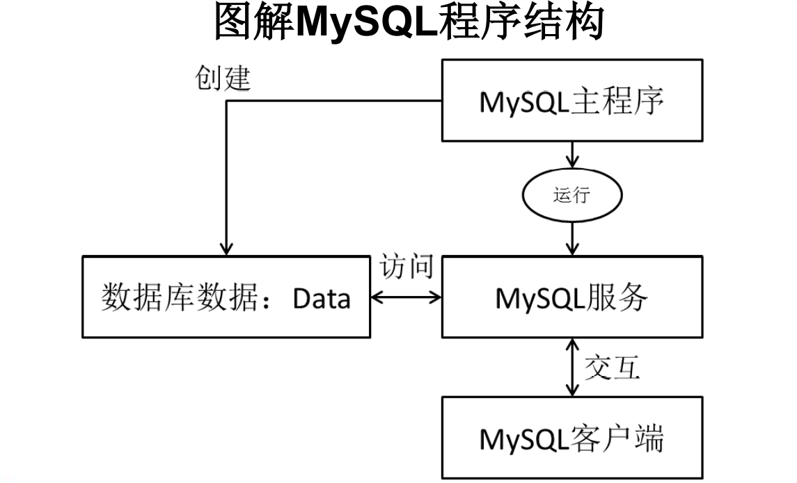

### MySQL产品的特点
- MySQL数据库隶属于MySQL AB公司，总部位于瑞典，后被oracle收购。
- 优点：
  - 成本低：开放源代码，一般可以免费试用
  - 性能高：执行很快
  - 简单：很容易安装和使用

### DBMS分为两类：
  - 基于共享文件系统的DBMS（Access）
  - 基于客户机C——服务器S的DBMS（MySQL、Oracle、SqlServer）

### MySQL的版本
- 社区版（免费）
- 企业版（收费）
- Windows平台下下载：http://dev.mysql.com/downloads/mysql

### MySQL服务的启动和停止
- 方式一：右击计算机——管理——服务——启动或停止MySQL服务
- 方式二：通过管理员身份运行（推荐）
  - 启动服务：net start 服务名
  - 停止服务：net stop 服务名

### MySQL服务的登录和退出   
- 方式一：通过mysql自带的客户端：只限于root用户
- 方式二：通过windows自带的客户端
  - 登录：`mysql [-h主机名 -P端口号] -u用户名 -p密码`
    - 主机名缺省为localhost
    - 端口号缺省为3306
    - \-p后不输入密码，直接回车会进入密码输入
  - 退出：`exit`或`Ctrl` \+ `C`

### MySQL的语法规范
1. 不区分大小写（大小写不敏感），但建议关键字大写，表名、列名小写
2. 每条命令最好用分号或\\g结尾
3. 各子句一般分行写
4. 每条命令根据需要，可以进行缩进或换行（提高语句的可读性）
5. 关键字不能缩写也不能分行
6. 注释
    ```sql
    单行注释：# 注释文字
    单行注释：-- 注释文字
    多行注释：/* 注释文字 */
    ```

### MySQL的常见命令 
1. 查看当前所有的数据库：`show databases;`
2. 打开指定的库：`use 库名`
3. 查看当前库的所有表：`show tables;`
4. 查看其它库的所有表：`show tables from 库名;`
5. 查看当前所在库：`select database();`
6. 创建表：
    ```sql
    create table 表名(
        列名 列类型,
        列名 列类型,
        ...
    );
    ```
7. 查看表结构：`desc 表名;`
8. 查看服务器的版本：
   1. 方式一：登录到mysql服务端：`select version();`
   2. 方式二：没有登录到mysql服务端：`mysql --version`或`mysql -V`

### SQL的常见命令
```sql
show databases; --查看所有的数据库
use 库名; --打开指定的库
show tables; --显示库中的所有表
show tables from 库名; --显示指定库中的所有表
create table 表名(
    字段名 字段类型,
    字段名 字段类型
); --创建表
desc 表名; --查看指定表的结构
select * from 表名; --显示表中的所有数据
```

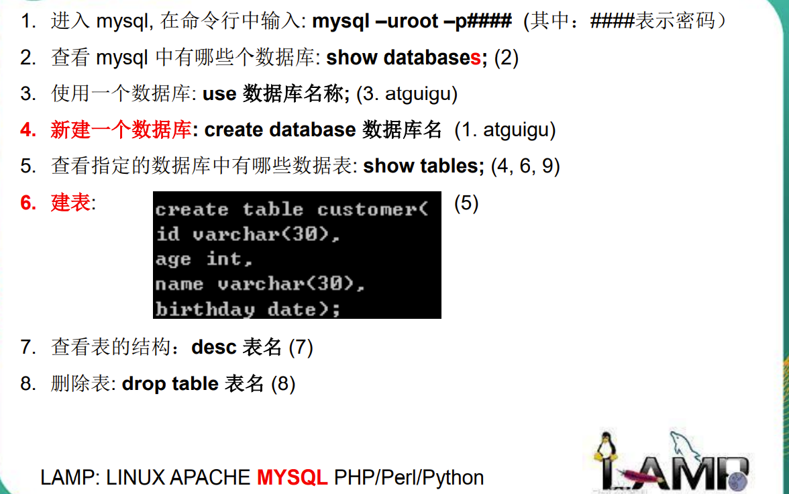
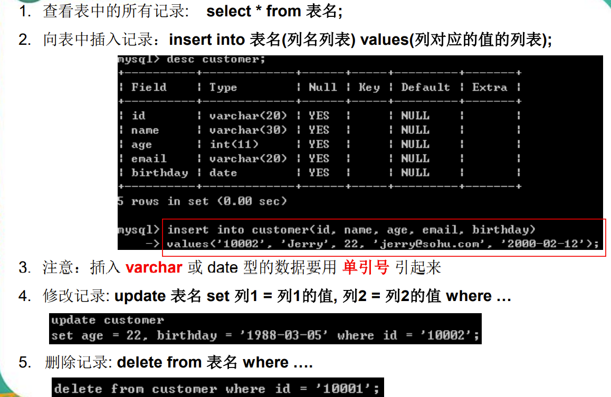
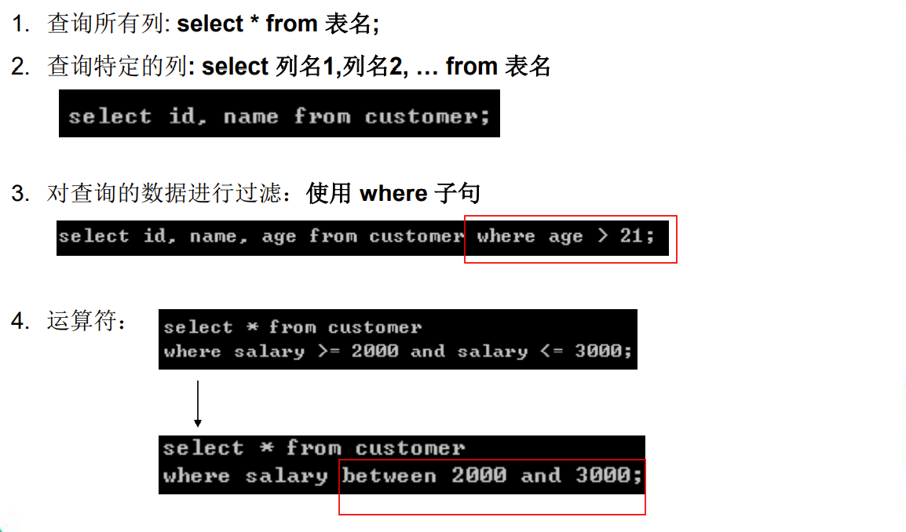
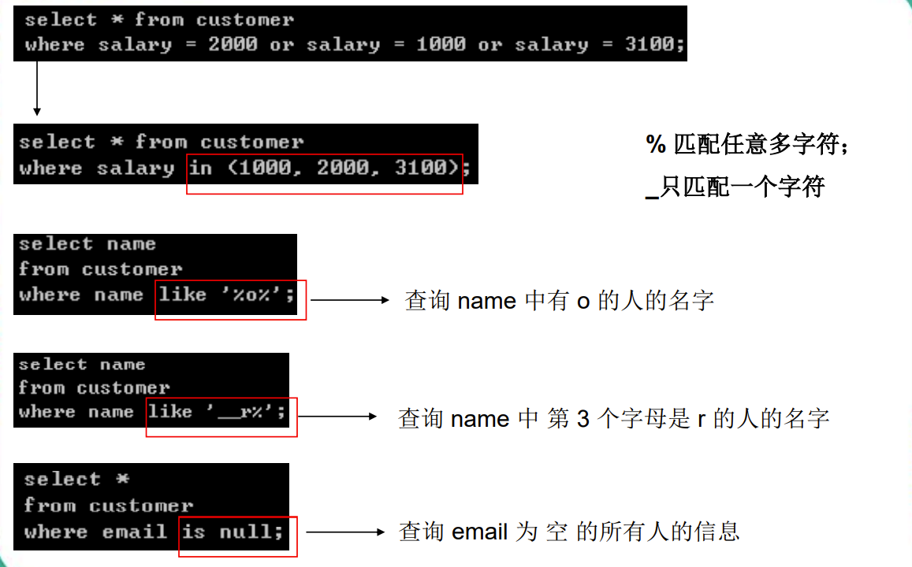
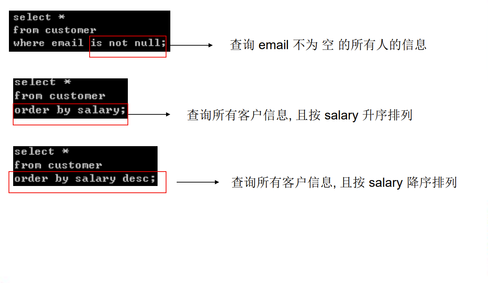

## 数据处理之查询

### 基本的SELECT语句
```sql
SELECT *|{[DISTINCT] column|expression [alias],...}
FROM tablename;
```
- SELECT 标识选择哪些列，多个列使用逗号隔开，\*表示按照建表顺序的全部列。
- FROM 标识从哪个表中选择。
- 通过select查询完的结果 ，是一个虚拟的表格，不是真实存在
- 要查询的东西 可以是常量值、可以是表达式、可以是字段（可以使用着重号\`引起来，避免出现关键字冲突等）、可以是函数。
   ```sql
   SELECT * FROM departments;-- 选择全部列
   SELECT department_id, location_id -- 选择特定的列
   FROM departments;
   SELECT 100%98; -- 表达式：2
   SELECT VERSION(); -- 函数
   ```

列的别名
- 重命名一个列。
- 便于理解和计算。
- 如果要查询的字段有重名的情况，使用别名可以区分出来
- 紧跟列名，也可以在列名和别名之间加入关键字'AS'，别名使用**双引号**，以便在别名中包含空格或特殊的字符并区分大小写。
   ```sql
   SELECT last_name AS "name", commission_pct comm
   FROM employees;
   SELECT last_name "Name", salary*12 "Annual Salary"
   FROM employees;
   ```

字符串
- 字符串可以是 SELECT 列表中的一个字符,数字,日期。
- 日期和字符只能在**单引号**中出现。
- 每当返回一行时，字符串被输出一次。

显示表结构
使用 DESCRIBE 命令，表示表结构`DESC[RIBE] tablename`
   ```sql
   DESCRIBE employees
   ```

关于\+
- 在MySQL，这就是个运算符，并没有拼接字符串的功能
- 两个操作数都为数值型，则做加法运算：select 100+90;
- 只要其中一方为字符型，试图将字符型数值转换成数值型
  - 如果转换成功,则继续做加法运算：select '123'+90;
  - 如果转换失败，则将字符型数值转换成0：select 'john'+90;
- 只要其中一方为null，则结果肯定为null：select null+10;

### 过滤和排序数据
过滤
- 使用WHERE子句，将不满足条件的行过滤掉。
  - DISTINCT：去重
   ```sql
   SELECT *|{[DISTINCT] column|expression [alias],...}
   FROM tablename
   [WHERE condition(s)];
   ```
- WHERE子句紧随FROM子句。
   ```sql
   SELECT employee_id, last_name, job_id, department_id
   FROM employees
   WHERE department_id = 90 ;
   ```

比较运算（条件表达式）
| 操作符 | 含义                    |
| ------ | ----------------------- |
| =      | 等于 (不是 ==)          |
| >      | 大于                    |
| >=     | 大于、等于              |
| <      | 小于                    |
| <=     | 小于、等于              |
| <>     | 不等于 (也可以是 !=)    |
| <=>    | 安全等于 (可以判断NULL) |

注意：
- 赋值使用 := 符号
   ```sql
   SELECT last_name, salary
   FROM employees
   WHERE salary <= 3000;
   ```
- 字符串与数值比较，字符串会先按规则转换为数值再进行比较
- 字符串之间的比较，按照字符编码进行

其它比较运算
| 操作符           | 含义                    |
| ---------------- | ----------------------- |
| BETWEEN...AND... | 在两个值之间 (包含边界) |
| IN(set)          | 等于值列表中的一个      |
| LIKE             | 模糊查询                |
| IS NULL          | 空值                    |

- BETWEEN：使用 BETWEEN 运算来显示在一个区间内的值，闭区间（包含临界值，上下界不能颠倒）
   ```sql
   SELECT last_name, salary
   FROM employees
   WHERE salary BETWEEN 下界 AND 上界;
   -- 完全等价于：WHERE salary>=下界 AND salary<=上界;
   ```
- IN：使用 IN 运算显示列表中的值，判断某字段的值是否属于in列表中的某一项，包含列表中。
  - 列表中的值必须类型统一或能隐式转换
  - 列表括号是必须加的，即使列表中只有一个元素
  - in列表中的字符串不支持转义
   ```sql
   SELECT employee_id, last_name, salary, manager_id
   FROM employees
   WHERE manager_id IN (100, 101, 201);
   ```
- LIKE：使用 LIKE 运算选择类似的值
  - 选择条件可以包含字符或数字，数字会被当成字符处理:
  - '%' 代表零个或多个字符(任意个字符)。
  - '_' 代表一个字符。
      ```sql
      SELECT first_name
      FROM employees
      WHERE first_name LIKE 'S%';
      ```
  - '%'和'-'可以同时使用。
      ```sql
      SELECT last_name
      FROM employees
      WHERE last_name LIKE '_o%';
      ```
  - 如果就是想匹配_或%，应当使用转义，默认的转义符是`\`，可以使用ESCAPE关键字指定转义字符
      ```sql
      SELECT last_name FROM employees WHERE last_name LIKE '_$_%' ESCAPE '$';
      ```
  - 不能匹配NULL值
- NULL：使用 IS (NOT) NULL 判断空值。
  - 不能使用'='运算符判断NULL值，不能使用'<>'运算符判断非NULL值
  - 也不能使用IS (NOT) NULL 判断其他值
   ```sql
   SELECT last_name, manager_id
   FROM employees
   WHERE manager_id IS NULL;
   ```

逻辑运算（逻辑表达式）
| 操作符 | 含义   | 解释                                            |
| ------ | ------ | ----------------------------------------------- |
| AND    | 逻辑并 | 两个条件如果同时成立，结果为true，否则为false   |
| OR     | 逻辑或 | 两个条件只要有一个成立，结果为true，否则为false |
| NOT    | 逻辑否 | 如果条件成立，则not后为false，否则为true        |

- AND：AND 要求并的关系为真。
   ```sql
   SELECT employee_id, last_name, job_id, salary
   FROM employees
   WHERE salary >=10000
   AND job_id LIKE '%MAN%';
   ```
- OR：OR 要求或关系为真。
   ```sql
   SELECT employee_id, last_name, job_id, salary
   FROM employees
   WHERE salary >= 10000
   OR job_id LIKE '%MAN%';
   ```
- NOT
   ```sql
   SELECT last_name, job_id
   FROM employees
   WHERE job_id 
   NOT IN ('IT_PROG', 'ST_CLERK', 'SA_REP');
   ```

排序
```sql
select 要查询的字段|表达式|常量值|函数
from 表
where 条件
order by 排序的字段|表达式|函数|别名 [asc|desc]
```
ORDER BY子句：使用 ORDER BY 子句排序
- ASC（ascend）: 升序（缺省）
- DESC（descend）: 降序
- ORDER BY 子句在SELECT语句的结尾，limit子句除外。
   ```sql
   SELECT last_name, job_id, department_id, hire_date
   FROM employees
   ORDER BY hire_date DESC;
   SELECT employee_id, last_name, salary*12 annsal
   FROM employees
   ORDER BY annsal;-- 按函数、表达式、别名排序
   SELECT last_name, department_id, salary
   FROM employees
   ORDER BY salary DESC, department_id ASC;-- 多个列排序：按照ORDER BY列表的顺序排序。
   ```

### 分组函数
分组函数：作用于一组数据，并对一组数据返回一个值。又称统计函数，聚合函数

组函数类型
- AVG() 
- COUNT() 
- MAX() 
- MIN() 
- SUM()

组函数语法
```sql
SELECT [column,] group_function(column), ...
FROM tablename
[WHERE condition]
[GROUP BY column]
[ORDER BY column];
```

- AVG（平均值）和 SUM （合计）函数：可以对**数值型数据**使用 AVG 和 SUM 函数。（其实对其他类型数据使用也不会产生错误，但是返回的结果没有意义）
   ```sql
   SELECT AVG(salary), MAX(salary),
   MIN(salary), SUM(salary)
   FROM employees
   WHERE job_id LIKE '%REP%';
   ```
- MIN（最小值）和 MAX（最大值）函数：可以对**任意数据类型**的数据使用 MIN 和 MAX 函数。
   ```sql
   SELECT MIN(hire_date), MAX(hire_date) -- 时间戳的大小
   FROM employees;
   ```
- COUNT（计数）函数
  - COUNT(*) 返回表中记录总数,适用于**任意数据类型**。
      ```sql
      SELECT COUNT(*)
      FROM employees
      ```
  - COUNT(expr) 返回expr**不为空**的记录总数。
      ```sql
      SELECT COUNT(commission_pct)
      FROM employees
      WHERE department_id = 50;
      ```

### 分组查询
分组  
GROUP BY 子句：可以使用GROUP BY子句将表中的数据分成若干组
   ```sql
   SELECT column, group_function(column) -- 查询的字段, 分组函数
   FROM tablename -- 表
   [WHERE condition]
   [GROUP BY group_by_expression] -- 分组的字段
   [ORDER BY column];
   ```
- 明确：WHERE一定放在FROM后面
- 在SELECT 列表中所有未包含在组函数中的列都应该包含在 GROUP BY 子句中。
   ```sql
   SELECT department_id, AVG(salary)
   FROM employees
   GROUP BY department_id ;
   ```
- 包含在 GROUP BY 子句中的列不必包含在SELECT 列表中
   ```sql
   SELECT AVG(salary)
   FROM employees
   GROUP BY department_id ;
   ```
- 使用多个列分组：在GROUP BY子句中包含多个列
   ```sql
   SELECT department_id dept_id, job_id, SUM(salary)
   FROM employees
   GROUP BY department_id, job_id ;
   ```

非法使用组函数
- 不能在 WHERE 子句中使用组函数。
- 可以在 HAVING 子句中使用组函数。
   ```sql
   SELECT department_id, AVG(salary)
   FROM employees
   WHERE AVG(salary) > 8000 -- ERROR at line 3:ORA-00934: group function is not allowed here
   GROUP BY department_id;
   ```

过滤分组： HAVING 子句，使用 HAVING 过滤分组
1. 行已经被分组。
2. 使用了组函数。
3. 满足 HAVING 子句中条件的分组将被显示。
   ```sql
   SELECT column, group_function
   FROM table
   [WHERE condition]
   [GROUP BY group_by_expression]
   [HAVING group_condition]
   [ORDER BY column];
   -- 例1：员工数大于2的部门
   SELECT department_id, COUNT(*)
   FROM employees
   GROUP BY department_id
   HAVING COUNT(*) > 2;
   -- 例1：最高工资大于10000的部门
   SELECT department_id, MAX(salary)
   FROM employees
   GROUP BY department_id
   HAVING MAX(salary)>10000 ;
   ```

小结：
1. 可以按单个字段分组
2. 和分组函数一同查询的字段最好是分组后的字段
3. 分组筛选
   | 筛选时间 | 针对的表       | 位置           | 关键字 |
   | -------- | -------------- | -------------- | ------ |
   | 分组前   | 原始表         | group by的前面 | where  |
   | 分组后   | 分组后的结果集 | group by的后面 | having |
4. 可以按多个字段分组，字段之间用逗号隔开
5. 可以支持排序
   ```sql
   -- 查询每个工种每个部门的最低工资,并按最低工资降序
   SELECT MIN(salary),job_id,department_id
   FROM employees
   GROUP BY department_id,job_id
   ORDER BY MIN(salary) DESC;
   ```
6. having后可以支持别名
   ```sql
   SELECT LENGTH(last_name) len_name, COUNT(*) c 
   FROM employees 
   GROUP BY	len_name 
   HAVING c > 5;
   ```
7. 能使用分组前查询的尽量使用分组前查询

### 多表（连接）查询
笛卡尔集：笛卡尔集会在下面条件下产生:
- 省略连接条件
- 连接条件无效
- 所有表中的所有行互相连接

为了避免笛卡尔集， 可以在 WHERE 加入**有效**的连接条件。

Mysql 连接：使用连接在多个表中查询数据。
```sql
SELECT table1.column, table2.column
FROM table1, table2
WHERE table1.column1 = table2.column2;
```
- 在 WHERE 子句中写入连接条件。
- 在表中有相同列时，在列名之前加上表名前缀

等值连接
- 多表等值连接的结果为多表的交集部分
- n表连接，至少需要n-1个连接条件
- 多表的顺序没有要求
- 一般需要为表起别名
- 可以搭配前面介绍的所有子句使用，比如排序、分组、筛选
   ```sql
   SELECT beauty.id,NAME,boyname FROM beauty ,boys 
   WHERE beauty.`boyfriend_id`=boys.id;
   -- 加筛选：查询城市名中第二个字符为o的部门名和城市名
   SELECT department_name,city
   FROM departments d,locations l
   WHERE d.`location_id` = l.`location_id`
   AND city LIKE '_o%';
   -- 加分组：查询有奖金的每个部门的部门名和部门的领导编号和该部门的最低工资
   SELECT department_name,d.`manager_id`,MIN(salary)
   FROM departments d,employees e
   WHERE d.`department_id`=e.`department_id`
   AND commission_pct IS NOT NULL
   GROUP BY department_name,d.`manager_id`;
   -- 加排序：查询每个工种的工种名和员工的个数，并且按员工个数降序
   SELECT job_title,COUNT(*)
   FROM employees e,jobs j
   WHERE e.`job_id`=j.`job_id`
   GROUP BY job_title
   ORDER BY COUNT(*) DESC;
   ```

区分重复的列名
- 使用表名前缀在多个表中区分相同的列。
- 在不同表中具有相同列名的列可以用**表的别名**加以区分。
- 如果使用了表别名，则在select语句中需要使用表别名代替表名
- 表别名最多支持32个字符长度，但建议越少越好

表的别名
- 使用别名可以简化查询、区分多个重名的字段。
- 使用表名前缀可以提高执行效率。
- 注意：如果为表起了别名，则查询的字段就不能使用原来的表名去限定

连接多个表：
- 连接 n个表,至少需要 n-1个连接条件。 
- 例如：连接三个表，至少需要两个连接条件。
   ```sql
   SELECT last_name, department_name, city
   FROM employees e, departments d, locations l
   WHERE e.department_id = d.department_id
   AND d.location_id = l.location_id;
   ```

非等值连接
```sql
-- 查询员工的工资和工资级别
SELECT salary,grade_level
FROM employees e,job_grades g
WHERE salary BETWEEN g.`lowest_sal` AND g.`highest_sal`
AND g.`grade_level`='A';
```

自连接
1. 案例：查询员工名和直接上级的名称
2. sql99
   ```sql
   SELECT e.last_name,m.last_name
   FROM employees e
   JOIN employees m ON e.`manager_id`=m.`employee_id`;
   ```
3. sql92
   ```sql
   SELECT e.last_name,m.last_name
   FROM employees e,employees m 
   WHERE e.`manager_id`=m.`employee_id`;
   -- 老板有几个？
   SELECT COUNT( DISTINCT m.last_name ) 
   FROM employees e,	employees m 
   WHERE	e.manager_id = m.employee_id;
   ```

### SQL99：使用 ON 子句创建连接
- 自然连接中是以具有相同名字的列为连接条件的。
- 可以使用 ON 子句指定额外的连接条件。
- 这个连接条件是与其它条件分开的。
- ON 子句使语句具有更高的易读性。
- Join连接分类：
  - 内连接 `[inner] join on`，inner可以省略
  - 外连接
    - 左外连接 `left [outer] join on`
    - 右外连接 `right [outer] join on`
- 使用 ON 子句创建多表连接
   ```sql
   SELECT employee_id, city, department_name
   FROM employees e 
   JOIN departments d
   ON d.department_id = e.department_id 
   JOIN locations l
   ON d.location_id = l.location_id;
   ```

内连接：
```sql
-- 添加筛选：查询名字中包含e的员工名和工种名
SELECT last_name, job_title 
FROM employees e
INNER JOIN jobs j ON e.`job_id` = j.`job_id` 
WHERE	e.`last_name` LIKE '%e%';
-- 添加分组+筛选：查询部门个数>3的城市名和部门个数
SELECT city, COUNT(*) 部门个数 
FROM departments d
INNER JOIN locations l ON d.`location_id` = l.`location_id` 
GROUP BY	city
HAVING COUNT(*)> 3;
-- 添加排序：查询哪个部门的员工个数>3的部门名和员工个数，并按个数降序
SELECT COUNT(*) 个数, department_name 
FROM employees e
INNER JOIN departments d ON e.`department_id` = d.`department_id` 
GROUP BY department_name 
HAVING COUNT(*)> 3 
ORDER BY COUNT(*) DESC;
-- 查询员工名、部门名、工种名，并按部门名降序
SELECT last_name, department_name, job_title 
FROM employees e
INNER JOIN departments d ON e.`department_id` = d.`department_id`
INNER JOIN jobs j ON e.`job_id` = j.`job_id` 
ORDER BY department_name DESC;
-- 非等值连接：查询工资级别的个数>20的个数，并且按工资级别降序
SELECT COUNT(*), grade_level 
FROM employees e
JOIN job_grades g ON e.`salary` BETWEEN g.`lowest_sal` AND g.`highest_sal` 
GROUP BY grade_level 
HAVING COUNT(*)> 20 
ORDER BY grade_level DESC;
-- 自连接：查询姓名中包含字符k的员工的名字、上级的名字
SELECT e.last_name, m.last_name 
FROM employees e
JOIN employees m ON e.`manager_id` = m.`employee_id` 
WHERE e.`last_name` LIKE '%k%';
```

外连接：
- 应用场景：用于查询一个表中有，另一个表没有的记录
- 特点：
  - 外连接的查询结果为主表中的所有记录
    - 如果从表中有和它匹配的，则显示匹配的值
    - 如果从表中没有和它匹配的，则显示null
    - 外连接查询结果=内连接结果+主表中有而从表没有的记录
  - 左外连接，left join左边的是主表
  - 右外连接，right join右边的是主表
- 左外和右外交换两个表的顺序，可以实现同样的效果
- 全外连接=内连接的结果+表1中有但表2没有的+表2中有但表1没有的

```sql
SELECT b.*,bo.* 
FROM boys bo
LEFT OUTER JOIN beauty b ON b.`boyfriend_id` = bo.`id` 
WHERE b.`id` IS NULL;-- 此处最好使用从表的主键列，因为其他列可能本身就含有空数据
-- 右外：查询哪个部门没有员工
SELECT d.*, e.employee_id 
FROM employees e
RIGHT OUTER JOIN departments d ON d.`department_id` = e.`department_id` 
WHERE e.`employee_id` IS NULL;
-- 全外：（不分主从表）
SELECT b.*, bo.* 
FROM beauty b
FULL OUTER JOIN boys bo ON b.`boyfriend_id` = bo.id;
-- 交叉连接：其实就是两表的笛卡尔乘积
SELECT b.*, bo.* 
FROM beauty b
CROSS JOIN boys bo;
```

JOIN连接总结
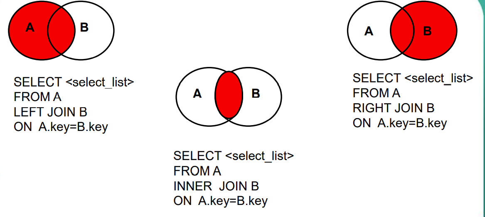
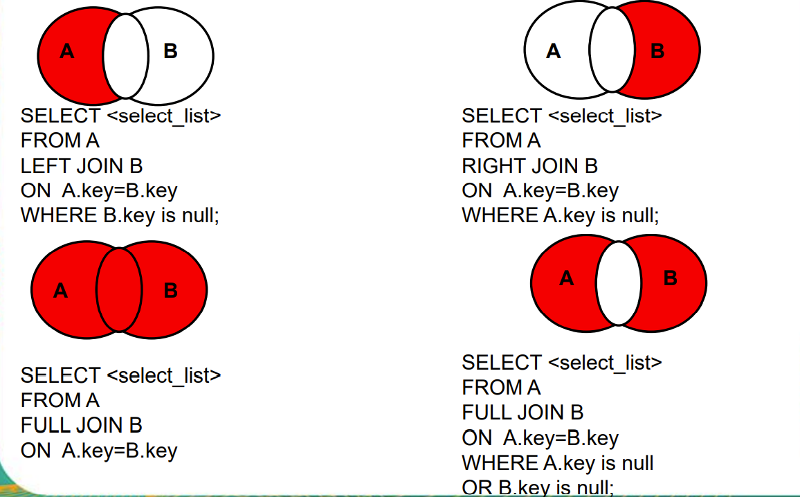

### 连接查询小结
1. 传统模式下的连接 ：等值连接、非等值连接
   1. 等值连接的结果 = 多个表的交集
   2. n表连接，至少需要n-1个连接条件
   3. 多个表不分主次，没有顺序要求
   4. 一般为表起别名，提高阅读性和性能
2. sql99语法：通过join关键字实现连接
   1. 含义：1999年推出的sql语法
   2. 支持：
      1. 内连接
         1. 等值连接
         2. 非等值连接
         3. 自连接
      2. 外连接
         1. 左外连接
         2. 右外连接
         3. 全外连接（MySQL不支持）full
      3. 交叉连接
   3. 语法：
		```sql
		select 字段, ...
		from 表1
		[inner|left outer|right outer|cross] join 表2 on 连接条件
		[inner|left outer|right outer|cross] join 表3 on 连接条件
		[where 筛选条件]
		[group by 分组字段]
		[having 分组后的筛选条件]
		[order by 排序的字段或表达式]
      ```
   4. 好处：
      1. 功能：相对于sql92，sql99支持的较多；
      2. 可读性：sql99实现连接条件和筛选条件的分离，可读性较高。

## 常见函数

### 常见函数一览
1. 单行函数
   1. 字符函数
		```sql
		CONCAT(str1,str2,...) 拼接字符，数值会被当成字符处理，如过拼接的值中有NULL，则结果为NULL
		SUBSTR(str FROM pos FOR len) 截取子串，索引从1开始，获取从指定索引处指定字符长度的字符，缺省为到结尾
		UPPER(str) 转换成大写
		LOWER(str) 转换成小写
		TRIM([{BOTH | LEADING | TRAILING} [remstr] FROM] str) 去除str前后from前参数指定的字符，缺省为空格
		LTRIM(str) 去左边空格
		RTRIM(str) 去右边空格
		REPLACE(str,from_str,to_str) 将str中出现的from_str全部替换为to_str
		LPAD(str,len,padstr) 用padstr指定的字符将str左填充至len长度，如果len小于str长度，从右侧截断至len
		RPAD(str,len,padstr) 用padstr指定的字符将str右填充至len长度，如果len小于str长度，从右侧截断至len
		INSTR(str,substr) 返回子串第一次出现的索引，找不到返回0
		LENGTH(str) 获取字节个数（取决于编码集），注意不是字符个数
		```
   2. 数学函数
		```sql
		ROUND(X,D) 返回X四舍五入（绝对值四舍五入）至D位小数的结果，D缺省为0
		RAND() 随机数[0,1)
		FLOOR(X) 向下取整，返回不大于X最大整数
		CEIL(X) 向上取整，返回不小于X最小整数
		MOD(N,M) 取余，等同于N%M，只有被模数N为负数时，结果才为负数【求模运算的本质：N%M=N-N/M*M】
		TRUNCATE(X,D) 返回X截断至D位小数的结果
		```
   3. 日期函数
		```sql
		NOW() 当前系统日期+时间
		CURDATE() 当前系统日期
		CURTIME() 当前系统时间
      YEAR/MONTH/DAY 返回指定日期的年、月、日
		STR_TO_DATE(str,format) 将字符转换成日期，如果字符满足'年-月-日'的形式，可以自动完成转换。
		DATE_FORMAT(date,format) 将日期转换成字符
		```
   4. 流程控制函数
		```sql
		IF(expr1,expr2,expr3) 处理双分支结构，当expr1为真时，表达式的值为expr2，否则为expr3
      CASE case_value -- switch(case_value)等值判断
      WHEN when_value THEN -- case when_value:
         statement_list
      ELSE -- default
         statement_list
      END
      CASE -- if-elif-else 区间判断
      WHEN 条件1 THEN
         statement_list
      WHEN 条件2 THEN
         statement_list
      ELSE
         statement_list
      END
      -- 例子：
      SELECT salary 原始工资,department_id,
      CASE department_id
         WHEN 30 THEN salary*1.1
         WHEN 40 THEN salary*1.2
         WHEN 50 THEN salary*1.3
         ELSE salary
      END AS 新工资 FROM employees;
		```
   1. 其他函数
		```sql
		VERSION() 版本
		DATABASE() 当前库
		USER() 当前连接用户
		```
2. 分组函数
	```
	SUM([DISTINCT] expr) 求和
	MAX([DISTINCT] expr) 最大值
	MIN([DISTINCT] expr) 最小值
	AVG([DISTINCT] expr) 平均值
	COUNT(DISTINCT expr,[expr...]) 计数
	```
	特点：
	1. 以上五个分组函数都忽略null值（null值没有参与运算），除了count(*)
	2. sum和avg一般用于处理数值型；max、min、count可以处理任何数据类型
	3. 都可以搭配distinct使用，用于统计去重后的结果
	4. count的参数可以支持：字段、\*、常量值，一般放1。建议使用 count(\*)

### 字符函数
大小写控制函数：这类函数改变字符的大小写。
| 函数                  | 结果       |
| --------------------- | ---------- |
| `LOWER('SQL Course')` | sql course |
| `UPPER('sql course')` | SQL COURSE |

字符控制函数：这类函数控制字符。
| 函数                          | 结果         |
| ----------------------------- | ------------ |
| `CONCAT('Hello', 123, '!')`   | Hello123!    |
| `SUBSTR('HelloWorld', 1,5)`   | Hello        |
| `LENGTH('HelloWorld')`        | 10           |
| `INSTR('HelloWorld', 'W')`    | 6            |
| `LPAD(salary, 10, '*')`       | `*****24000` |
| `RPAD(salary, 10, '*')`       | `24000*****` |
| `TRIM('H' FROM 'HelloWorld')` | elloWorld    |
| `REPLACE('abcd','b','m')`     | amcd         |

### 数字函数
| 函数说明        | 实例             | 结果  |
| --------------- | ---------------- | ----- |
| ROUND: 四舍五入 | ROUND(45.926, 2) | 45.93 |
| TRUNCATE: 截断  | TRUNC(45.926, 2) | 45.92 |
| MOD: 求余       | MOD(1600, 300)   | 100   |

### 日期函数
| 函数说明                                          | 实例                                   | 结果           |
| ------------------------------------------------- | -------------------------------------- | -------------- |
| NOW：获取当前日期   时间                          |
| STR_TO_DATE: 将日期格式的字符转换成指定格式的日期 | STR_TO_DATE('9-13-1999','%m-%d-%Y')    | 1999-09-13     |
| DATE_FORMAT:将日期转换成字符                      | DATE_FORMAT('2018/6/6','%Y年%m月%d日') | 2018年06月06日 |

| 格式符 | 功能                    |
| ------ | ----------------------- |
| %Y     | 四位的年份              |
| %y     | 2位的年份               |
| %m     | 月份（01,02,...,11,12） |
| %c     | 月份（1,2,...,11,12）   |
| %d     | 日（01,02,...）         |
| %H     | 小时（24小时制）        |
| %h     | 小时（12小时制）        |
| %i     | 分钟（00,01,...,59）    |
| %s     | 秒（00,01,...,59）      |

### 条件表达式
在 SQL 语句中使用IF-THEN-ELSE 逻辑
- 使用方法:CASE 表达式
   ```sql
   CASE expr WHEN comparison_expr1 THEN return_expr1
      [WHEN comparison_expr2 THEN return_expr2
      WHEN comparison_exprn THEN return_exprn
      ELSE else_expr]
   END
   -- 例：
   SELECT last_name, job_id, salary,
      CASE job_id WHEN 'IT_PROG'  THEN 1.10*salary
                  WHEN 'ST_CLERK' THEN 1.15*salary
                  WHEN 'SA_REP'   THEN 1.20*salary
      ELSE salary END "REVISED_SALARY"
   FROM employees;
   ```

### 函数补充
- DATEDIFF(expr1,expr2)：日期1与日期2的差值，expr1-expr2（天）
- TIMEDIFF(expr1,expr2)：时间1与时间2的差值，expr1-expr2（时分秒）
- ISNULL(expr)：判断expr是否为NULL，是则返回1，否则返回0
- IFNULL(expr1,expr2)：如果expr1为NULL，返回expr2，否则返回expr1

## 数据处理之增删改
DML(Data Manipulation Language –数据操纵语言) 可以在下列条件下执行:
- 向表中**插入**数据
- **修改**现存数据
- **删除**现存数据
- 事务是由完成若干项工作的DML语句组成的

### 插入数据（插入）
INSERT 语句语法
- 使用 INSERT 语句向表中插入数据。
   ```sql
   INSERT INTO tablename[(column1 [, column2...])]
   VALUES(value1 [, value2...]);
   ```
- 使用这种语法一次只能向表中插入**一条**数据。
- 插入数据
  - 为每一列添加一个新值。
  - 按列的默认顺序列出各个列的值。
  - 在 INSERT 子句中随意列出列名和他们的值。
  - 字符和日期型数据应包含在**单引号**中。
      ```sql
      INSERT INTO departments(department_id, department_name, manager_id, location_id)
      VALUES (70, 'Public Relations', 100, 1700);
      --
      INSERT INTO employees(employee_id,last_name,email,hire_date,job_id)
      VALUES (300,'Tom','tom@126.com',to_date('2012-3-21','yyyy-mm-dd'),'SA_RAP');
      ```
- 向表中插入空值
  - 隐式方式: 在列名表中省略该列的值。
      ```sql
      INSERT INTO departments (department_id, department_name)
      VALUES (30, 'Purchasing');
      ```
  - 显式方式: 在VALUES 子句中指定空值。
      ```sql
      INSERT INTO departments
      VALUES (100, 'Finance', NULL, NULL);
      ```
- 插入指定的值
  - NOW()函数：记录当前系统的日期和时间。
      ```sql
      INSERT INTO employees (employee_id, first_name, last_name, email, phone_number, hire_date, job_id, salary, commission_pct, anager_id, department_id) 
      VALUES (113, 'Louis', 'Popp', 'LPOPP', '515.124.4567', NOW(), 'AC_ACCOUNT', 6900, NULL, 205, 100);
      ```
- 从其它表中拷贝数据
  - 在 INSERT 语句中加入子查询。
      ```sql
      INSERT INTO emp2 
      SELECT * 
      FROM employees
      WHERE department_id = 90;
      --
      INSERT INTO sales_reps(id, name, salary, commission_pct)
      SELECT employee_id, last_name, salary, commission_pct
      FROM employees
      WHERE job_id LIKE '%REP%';
      ```
  - 不必书写 VALUES 子句。
  - 子查询中的值列表应与 INSERT 子句中的列名对应

注意：
1. 字段类型和值类型一致或兼容，而且一一对应
2. 可以为空的字段，可以不用插入值，或用null填充
3. 不可以为空的字段，必须插入值
4. 字段个数和值的个数必须一致
5. 列的顺序可以调换，但必须与值一一对应
6. 字段可以省略，但默认所有字段，并且顺序和表中的存储顺序一致

INSERT-SET 语句语法
- 使用 INSERT-SET 语句向表中插入一条数据。
   ```sql
   INSERT INTO 表名
   SET 列名=值, 列名=值, ...
   ```

两种插入方式对比
- 方式一支持插入多行,方式二不支持
   ```sql
   INSERT INTO beauty
   VALUES(23,'唐艺昕1','女','1990-4-23','1898888888',NULL,2)
   ,(24,'唐艺昕2','女','1990-4-24','1898888889',NULL,2)
   ,(25,'唐艺昕3','女','1990-4-25','1898888890',NULL,2);
   ```
- 方式一支持子查询，方式二不支持
   ```sql
   INSERT INTO beauty(id,name,phone)
   SELECT 26,'宋茜','11809866';
   INSERT INTO beauty(id,name,phone)
   SELECT id,boyname,'1234567' FROM boys WHERE id<3;
   ```

### 更新数据（修改）
UPDATE 语句语法
- 使用 UPDATE 语句更新数据。
   ```sql
   UPDATE tablename
   SET column1 = value1 [, column2 = value2, ...]
   [WHERE condition];
   ```
- 可以一次更新**多条**数据。
- 如果需要回滚数据，需要保证在DML前，进行设置：`SET AUTOCOMMIT = FALSE;`
- 使用 WHERE 子句指定需要更新的数据。
   ```sql
   UPDATE beauty SET phone = '13899888899'
   WHERE NAME LIKE '唐%';
   ```
- 如果省略 WHERE 子句，则表中的所有数据都将被更新
- 更新中的数据完整性错误
   ```sql
   UPDATE employees
   SET department_id = 55
   WHERE department_id = 110;
   /*错误代码： 1452
   Cannot add or update a child row: a foreign key 
   constraint fails (`myemployees`.`employees`, 
   CONSTRAINT `dept_id_fk` FOREIGN KEY (`department_id`) 
   REFERENCES `departments` (`department_id`))*/
   ```
- 修改多表的记录【补充】
  - sql92语法：
   ```sql
   UPDATE 表1 别名1, 表2 别名2
      SET 字段=新值, 字段=新值
      WHERE 连接条件
      AND 筛选条件;
   ```
  - sql99语法：
   ```sql
   UPDATE 表1 别名
   [INNER|LEFT|RIGHT] JOIN 表2 别名 ON 连接条件
      SET 列=值, ...
      WHERE 筛选条件;
   ```
   ```sql
   -- 例：修改没有男朋友的女神的男朋友编号都为2号
   UPDATE boys bo
   RIGHT JOIN beauty b ON bo.`id` = b.`boyfriend_id` 
   SET b.`boyfriend_id` = 2 
   WHERE bo.`id` IS NULL;
   ```

### 删除数据（删除）
DELETE 语句：使用 DELETE 语句从表中删除数据。
```sql
DELETE FROM tablename
[WHERE condition];
```
- 使用 WHERE 子句删除指定的记录。
   ```sql
   -- 删除手机号以9结尾的女神信息
   DELETE FROM beauty WHERE phone LIKE '%9';
   ```
- 如果省略 WHERE 子句，则表中的全部数据将被删除
   ```sql
   DELETE FROM copy_emp;
   ```
- 删除中的数据完整性错误
   ```sql
   DELETE FROM departments
   WHERE department_id = 60;
   /*错误代码： 1451
   Cannot delete or update a parent row: a foreign key 
   constraint fails (`myemployees`.`employees`, 
   CONSTRAINT `dept_id_fk` FOREIGN KEY (`department_id`) 
   REFERENCES `departments` (`department_id`))*/
   ```
- 多表的删除（级联删除）【补充】
  - sql92语法：
   ```sql
   DELETE 表1的别名,表2的别名
   FROM 表1 别名,表2 别名
   WHERE 连接条件
   AND 筛选条件;
   ```
  - sql99语法：
   ```sql
   DELETE 表1的别名,表2的别名
   FROM 表1 别名
   [INNER|LEFT|RIGHT] JOIN 表2 别名 ON 连接条件
   WHERE 筛选条件;
   ```
   ```sql
   -- 案例：删除黄晓明的信息以及他女朋友的信息
   DELETE b,bo FROM beauty b
   INNER JOIN boys bo ON b.`boyfriend_id`=bo.`id`
   WHERE bo.`boyName`='黄晓明';
   ```

## 子查询

### 概述
- 含义：出现在其他语句内部的select语句，称为子查询或内查询；内部嵌套其他select语句的查询，称为主查询或外查询
- 示例：
   ```sql
   SELECT first_name FROM employees WHERE department_id IN (
      SELECT department_id FROM departments WHERE location_id=1700)
   ```
1. 子查询都放在小括号内（子查询要包含在括号内。）
2. 子查询可以放在from后面、select后面、where后面、having后面，但一般放在条件的右侧（将子查询放在比较条件的右侧。）
3. 子查询优先于主查询执行，主查询使用了子查询的执行结果
4. 分类：
   1. 按子查询出现的位置：
      1. select后面：仅仅支持标量子查询
      2. from后面：支持表子查询
      3. where或having后面：★
         1. 标量子查询（单行子查询）√
         2. 列子查询（多行子查询）√
         3. 行子查询（多列多行）
      4. exists后面（相关子查询）：表子查询
   2. 按结果集的行列数不同：
      1. 标量子查询（结果集只有一行一列）
      2. 列子查询（结果集只有一列多行）
      3. 行子查询（结果集有一行多列）
      4. 表子查询（结果集一般为多行多列）
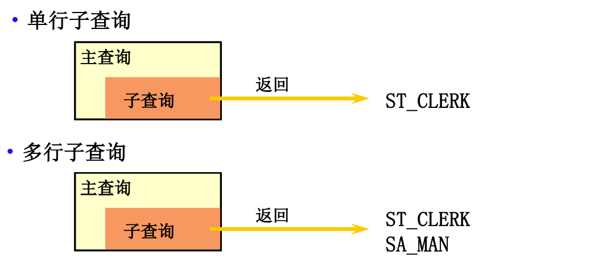

### 单行子查询
- 结果集只有一行
- 一般搭配单行比较操作符使用：`> < >= <= = <>`
- 子查询语法
   ```sql
   SELECT select_list
   FROM tablename
   WHERE expr operator (SELECT select_list FROM tablename);
   ``` 
  - 子查询 (内查询) 在主查询之前一次执行完成。
  - 子查询的结果被主查询(外查询)使用。
- 使用子查询解决问题
   ```sql
   SELECT last_name, salary 
   FROM employees -- 谁的工资比 Abel 高?
   WHERE salary > ( SELECT salary FROM employees WHERE last_name = 'Abel' );
   ```
- 执行单行子查询
   ```sql
   -- 返回job_id与141号员工相同，salary比143号员工多的员工姓名、job_id和工资
   SELECT last_name, job_id, salary
   FROM employees 
   WHERE job_id = ( SELECT job_id FROM employees WHERE employee_id = 141 ) 
	AND salary > ( SELECT salary FROM employees WHERE employee_id = 143 );
   ```
- 在子查询中使用组函数
   ```sql
   -- 返回公司工资最少的员工的last_name,job_id和salary
   SELECT last_name,job_id,salary 
   FROM employees 
   WHERE salary = ( SELECT MIN( salary ) FROM employees );
   ```
- 子查询中的 HAVING 子句
  - 首先执行子查询。
  - 向主查询中的HAVING 子句返回结果。
   ```sql
   -- 查询最低工资大于(50号部门最低工资)的部门id和其最低工资
   SELECT department_id, MIN( salary ) 
   FROM employees 
   GROUP BY department_id 
   HAVING MIN( salary )>( SELECT MIN( salary ) FROM employees WHERE department_id = 50 );
   ```
- 非法使用子查询
   ```sql
   SELECT employee_id, last_name
   FROM employees
   WHERE salary = (SELECT MIN(salary) FROM employees GROUP BY department_id);
   -- 子查询的结果不是一行一列：0行或多行
   ```
- 子查询中的空值问题：子查询不返回任何行
   ```sql
   SELECT MIN(salary), department_id
   FROM employees
   GROUP BY department_id
   HAVING MIN(salary)>(SELECT salary FROM employees WHERE department_id = 250);
   ```

### 多行子查询
- 结果集有多行
- 一般搭配多行操作符使用：any、all、in、not in
   | 操作符    | 含义                           |
   | --------- | ------------------------------ |
   | IN/NOT IN | 等于列表中的**任意一个**       |
   | ANY\|SOME | 和子查询返回的**某一个**值比较 |
   | ALL       | 和子查询返回的**所有值**比较   |
- 使用in操作符：属于子查询结果中的任意一个就行
   ```sql
   -- 返回(location_id是1400或1700的部门)中的所有员工姓名
   SELECT last_name 
   FROM employees 
   WHERE department_id IN ( SELECT DISTINCT department_id FROM departments WHERE location_id IN ( 1400, 1700 ) );
   ```
- any和all往往可以用其他查询代替
  - `<any等价于<max >any等价于>min =any等价于in`
  - `<all等价于<min >all等价于>max <>all等价于not in`
- 在多行子查询中使用 ANY 操作符
- 在多行子查询中使用 ALL 操作符
   ```sql
   -- 返回其它工种中比job_id为‘IT_PROG’工种[任一|所有]工资低的员工的员工号、姓名、job_id 以及salary
   SELECT last_name,employee_id,job_id,salary 
   FROM employees 
   WHERE salary < [ANY|ALL] ( SELECT DISTINCT salary FROM employees WHERE job_id = 'IT_PROG' ) AND job_id <> 'IT_PROG';
   ```
- 子查询中的空值问题

### 行子查询（结果集一行多列或多行多列）
```sql
-- 查询员工编号最小并且工资最高的员工信息
SELECT * FROM employees
WHERE (employee_id,salary)=(SELECT MIN(employee_id),MAX(salary) FROM employees);
```

### 其他关键字后的子查询
- select后面：仅仅支持标量子查询
   ```sql
   -- 例：查询每个部门信息及其员工个数
   SELECT d.*,(
      SELECT COUNT(*)
      FROM employees e
      WHERE e.department_id = d.department_id
   ) 个数
   FROM departments d;
   ```
- from后面：将子查询结果充当一张表，要求必须起别名
   ```sql
   -- 查询(每个部门的平均工资)的工资等级
   SELECT ag_dep.*, g.grade_level 
   FROM ( SELECT department_id, AVG( salary ) ag FROM employees GROUP BY department_id ) ag_dep
   INNER JOIN job_grades g ON ag_dep.ag BETWEEN lowest_sal AND highest_sal;
   ```
- exists后面（相关子查询）
  - 语法：exists(完整的查询语句)
  - 结果：1或0
   ```sql
   -- 查询有员工的部门名
   SELECT department_name
   FROM departments d -- in
   WHERE d.department_id IN( SELECT department_id FROM employees);
   SELECT department_name
   FROM departments d -- exists
   WHERE EXISTS( SELECT * FROM employees e WHERE d.department_id=e.department_id);
   -- 查询没有女朋友的男神信息
   SELECT bo.* 
   FROM boys bo -- not in
   WHERE bo.id NOT IN ( SELECT boyfriend_id FROM beauty );
   SELECT bo.* 
   FROM boys bo -- not exists
   WHERE	NOT EXISTS ( SELECT boyfriend_id FROM beauty b WHERE bo.id = b.boyfriend_id );
   ```

### 子查询的其他案例
```sql
-- 查询各部门中工资比本部门平均工资高的员工的员工号, 姓名和工资
SELECT employee_id,last_name,salary,e.department_id 
FROM employees e
INNER JOIN ( SELECT AVG( salary ) ag, department_id FROM employees GROUP BY department_id ) ag_dep ON e.department_id = ag_dep.department_id 
WHERE salary > ag_dep.ag;
-- 查询和姓名中包含字母u的员工在相同部门的员工的员工号和姓名
SELECT last_name,employee_id
FROM employees
WHERE department_id IN( SELECT  DISTINCT department_id FROM employees WHERE last_name LIKE '%u%');
```

### 联合查询
1. 引入：union联合、合并
2. 应用场景：要查询的结果来自于多个表，且多个表没有直接的连接关系，但查询的信息一致时
3. 语法：
   ```sql
   SELECT 字段|常量|表达式|函数 [FROM 表] [WHERE 条件] UNION [ALL]
   SELECT 字段|常量|表达式|函数 [FROM 表] [WHERE 条件] UNION [ALL]
   SELECT 字段|常量|表达式|函数 [FROM 表] [WHERE 条件] UNION [ALL]
   .....
   SELECT 字段|常量|表达式|函数 [FROM 表] [WHERE 条件]
   ```
4. 特点：★
   1. 多条查询语句的查询列数必须一致
   2. 多条查询语句查询的每一列的类型和顺序最好一致
   3. UNION关键字默认去重，如果使用UNION ALL可以包含重复项
```sql
-- 案例：查询中国用户中男性的信息以及外国用户中男性的用户信息
SELECT id,cname FROM t_ca WHERE csex='男'
UNION ALL
SELECT t_id,tname FROM t_ua WHERE tGender='male';
```

## 创建和管理表

### 库的管理
- 创建数据库：`CREATE DATABASE [IF NOT EXISTS] 数据库名称;`
- 相关其他命令
  - show databases; 查看当前所有数据库
  - use 库名; “使用”一个数据库，使其作为当前数据库
  - 库的修改
      ```sql
      RENAME DATABASE 原库名 TO 新库名; -- 不可用
      ALTER DATABASE 数据库名称 CHARACTER SET 字符集; -- 更改库的字符集
      ```
  - 库的删除：`DROP DATABASE [IF EXISTS] 数据库名称;`

命名规则
- 数据库名不得超过30个字符，变量名限制为29个
- 必须只能包含 `A–Z, a–z, 0–9, _`共63个字符
- 不能在对象名的字符间留空格
- 必须不能和用户定义的其他对象重名
- 必须保证你的字段没有和保留字、数据库系统或常用方法冲突
- 保持字段名和类型的一致性,在命名字段并为其指定数据类型的时候一定要保证一致性。假如数据类型在一个表里是整数,那在另一个表里可就别变成字符型了

### 创建表
CREATE TABLE 语句
- 必须具备:
  - CREATE TABLE权限
  - 存储空间
   ```sql
   CREATE TABLE [schema.]tablename
      (column datatype [DEFAULT expr][, ...]);
   ```
- 必须指定:
  - 表名
  - 列名, 数据类型, **尺寸**
      ```sql
      -- 创建表Book
      CREATE TABLE book(
         id INT, -- 编号
         bName VARCHAR(20), -- 图书名
         price DOUBLE, -- 价格
         authorId  INT, -- 作者编号
         publishDate DATETIME -- 出版日期
      );
      -- 创建表author
      CREATE TABLE IF NOT EXISTS author(
         id INT,
         au_name VARCHAR(20),
         nation VARCHAR(10)
      )
      ```

### 描述各种数据类型
| 常用数据类型  | 描述                                                               |
| ------------- | ------------------------------------------------------------------ |
| INT           | 使用4个字节保存整数数据                                            |
| CHAR(size)    | 定长字符数据。若未指定，默认为1个字符，最大长度255                 |
| VARCHAR(size) | 可变长字符数据，根据字符串实际长度保存，必须指定长度               |
| FLOAT(M,D)    | 单精度，M=整数位+小数位，D=小数位。 D<=M<=255,0<=D<=30，默认M+D<=6 |
| DOUBLE(M,D)   | 双精度。D<=M<=255,0<=D<=30，默认M+D<=15                            |
| DATE          | 日期型数据，格式’YYYY-MM-DD’                                       |
| BLOB          | 二进制形式的长文本数据，最大可达4G                                 |
| TEXT          | 长文本数据，最大可达4G                                             |

```sql
-- 创建表
CREATE TABLE emp (
   emp_id INT AUTO_INCREMENT,-- int类型，自增
   emp_name CHAR (20),-- 最多保存20个中英文字符
   salary DOUBLE,-- 总位数不超过15位
   birthday DATE,-- 日期类型
   PRIMARY KEY (emp_id)-- 主键
);
```

### 使用子查询创建表
使用 AS subquery 选项，**将创建表和插入数据结合起来**
- 指定的列和子查询中的列要一一对应
   ```sql
   CREATE TABLE tablename
      [(column, column...)]
   [AS] subquery;
   ```
- 通过列名和默认值定义列

表的复制
```sql
CREATE TABLE copy1 LIKE author; -- 仅仅复制表的结构
CREATE TABLE copy2 SELECT * FROM author; -- 复制表的结构+数据
CREATE TABLE copy3 SELECT id,au_name FROM author WHERE nation='中国'; -- 只复制部分数据
CREATE TABLE copy4 SELECT id,au_name FROM author WHERE 0; -- 仅仅复制某些字段，不要数据
CREATE TABLE dept2 -- 跨库复制表
SELECT department_id,department_name FROM myemployees.departments;
```

### 修改表的定义
```sql
语法：ALTER TABLE 表名 ADD|MODIFY|DROP|CHANGE COLUMN 字段名 [字段类型 约束];
```
ALTER TABLE 语句：使用 ALTER TABLE 语句可以实现：
- 向已有的表中**添加**列：ADD COLUMN 字段名 字段类型 FIRST|AFTER 字段名
   ```sql
   ALTER TABLE author ADD COLUMN annual DOUBLE;  -- 添加新列
   ```
- **修改**现有表中的列
  - 可以修改列的**数据类型**, **尺寸**和**默认值**
      ```sql
      ALTER TABLE dept80 MODIFY (last_name VARCHAR(30));
      ALTER TABLE dept80 MODIFY (salary double(9,2) default 1000);
      ALTER TABLE book MODIFY COLUMN pubdate TIMESTAMP; -- 修改列的类型或约束
      ```
  - 对默认值的修改**只影响今后**对表的修改
- **删除**现有表中的列：使用 DROP COLUMN 子句删除不再需要的列
   ```sql
   ALTER TABLE dept80 DROP COLUMN job_id;
   ```
- **重命名**现有表中的列：使用 CHANGE old_column new_column dataType子句重命名列
   ```sql
   ALTER TABLE dept80 CHANGE department_name dept_name varchar(15);
   ALTER TABLE book CHANGE COLUMN publishdate pubDate DATETIME; -- 修改列名
   ```

### 删除，重命名和清空表
删除表
- 数据和结构都被删除
- 所有正在运行的相关事务被提交
- 所有相关索引被删除
- DROP TABLE 语句不能回滚
   ```sql
   DROP TABLE [IF EXISTS] 表名;
   ```

清空表
- 方式1：delete语句 
   ```sql
   DELETE FROM 表名 [WHERE 筛选条件] [LIMIT 删除条目数] -- 单表的删除
   ```
- 方式2：TRUNCATE TABLE 语句:
  - 删除表中所有的数据
  - 释放表的存储空间
  - TRUNCATE语句不能回滚
  - 可以使用 DELETE 语句删除数据,可以回滚
   ```sql
   TRUNCATE TABLE 表名;
   ```   
  - 对比（例）：`delete from emp2;select * from emp2;rollback;select * from emp2;`
- 两种方式的区别【面试题】
  1. truncate不能加where条件，而delete可以加where条件
  2. truncate的效率高一丢丢
  3. truncate 删除带自增长的列的表后，如果再插入数据，数据从1开始；delete 删除带自增长列的表后，如果再插入数据，数据从上一次的断点处开始
  4. truncate删除没有返回值，delete删除有返回值
  5. truncate删除不能回滚，delete删除可以回滚

改变对象的名称
- 执行RENAME语句改变表, 视图的名称
- 必须是对象的拥有者
   ```sql
   ALTER TABLE 原名 RENAME [TO] 新名;
   ```

通用的写法：
```sql
DROP DATABASE IF EXISTS 旧库名;
CREATE DATABASE 新库名;
DROP TABLE IF EXISTS 旧表名;
CREATE TABLE 表名(...);
```

## 常见的数据类型

### 数值类型
| 整数类型     | 字节 | 范围                                                                                |
| ------------ | ---- | ----------------------------------------------------------------------------------- |
| Tinyint      | 1    | 有符号：-128~127；无符号：0~255                                                     |
| Smallint     | 2    | 有符号：-32768~32767；无符号：0~65535                                               |
| Mediumint    | 3    | 有符号：-8388608~8388607；无符号：0~1677215                                         |
| Int、integer | 4    | 有符号：- 2147483648~2147483647；无符号：0~4294967295                               |
| Bigint       | 8    | 有符号：-9223372036854775808~9223372036854775807；无符号：0~9223372036854775807*2+1 |

特点：
- 如果不设置无符号还是有符号，默认是有符号，如果想设置无符号，需要添加unsigned关键字
- 如果插入的数值超出了整型的范围,会报out of range异常，并且插入临界值
- 如果不设置长度，会有默认的长度。长度代表了显示的最大宽度，如果不够会用0在左边填充，但必须搭配zerofill使用，使用zerofill后就默认为无符号的！`t1 INT(7) ZEROFILL`

| 浮点数类型  | 字节 | 范围                                              |
| ----------- | ---- | ------------------------------------------------- |
| FLOAT(M,D)  | 4    | ±1.75494351E-38~±3.402823466E+38                  |
| DOUBLE(M,D) | 8    | ±2.2250738585072014E-308~±1.7976931348623157E+308 |

| 定点数类型       | 字节 | 范围                                                          |
| ---------------- | ---- | ------------------------------------------------------------- |
| `DEC[IMAL](M,D)` | M+2  | 最大取值范围与double相同，给定decimal的有效取值范围由M和D决定 |

特点：
- M：整数部位长度 + 小数部位长度
- D：小数部位长度
- 如果超过范围（长度），则插入该长度对应的临界值
- M和D都可以省略
  - 如果是decimal，则M默认为10，D默认为0
  - 如果是float和double，则会根据插入的数值的精度来决定精度
- 定点型的精确度较高，如果要求插入数值的精度较高如货币运算等则考虑使用
- 原则：所选择的类型越简单越好，能保存数值的类型越小越好

| 位类型 | 字节 | 范围          |
| ------ | ---- | ------------- |
| Bit(M) | 1~8  | Bit(1)~bit(8) |

### 字符类型
串数据：字符型、字节型

char和varchar类型：用来保存MySQL中较短的字符串。较长的串应用：text、blob(较大的二进制)

 | 写法    | M的意思    | 特点                            | 空间的耗费     | 效率     | 描述及存储需求 |
 | ------- | ---------- | ------------------------------- | -------------- | -------- | -------------- |
 | char    | char(M)    | 最大的字符数，可以省略，默认为1 | 固定长度的字符 | 比较耗费 | 高             | M为0~255之间的整数   |
 | varchar | varchar(M) | 最大的字符数，不可以省略        | 可变长度的字符 | 比较节省 | 低             | M为0~65535之间的整数 |

binary和varbinary类型：类似于char和varchar，不同的是它们包含二进制字符串而不包含非二进制字符串。

Enum类型：（又称枚举类型）要求插入的值必须属于列表中指定的值之一，不区分大小写，存储时以创建字段时指定的为准。
- 如果列表成员为1~255，则需要1个字节存储
- 如果列表成员为255~65535，则需要2个字节存储
- 最多需要65535个成员！
   ```sql
   ENUM('春','夏','秋','冬')
   ```

Set类型：和Enum类型类似，里面可以保存0~64个成员。
- 和Enum类型最大的区别是：SET类型一次可以选取多个成员，而Enum只能选一个
- 根据成员个数不同，存储所占的字节也不同
   成员数1~8，字节数1。9~16（2）。17~24（3）、25~32（4）、33~64（8）

   ```sql
   SET('a','b','c','d')
   -- 插入用下面的语句：
   INSERT INTO tab_set VALUES('a');
   INSERT INTO tab_set VALUES('A,B');
   INSERT INTO tab_set VALUES('a,c,d');
   ```

### 日期类型
| 日期和时间类型       | 字节 | 最小值              | 最大值              |
| -------------------- | ---- | ------------------- | ------------------- |
| timestamp（时间戳）  | 4    | 19700101080001      | 2038年的某个时刻    |
| datetime（日期时间） | 8    | 1000-01-01 00:00:00 | 9999-12-31 23:59:59 |
| date（日期）         | 4    | 1000-01-01          | 9999-12-31          |
| time（时间）         | 3    | -838:59:59          | 838:59:59           |
| year（年）           | 1    | 1901                | 2155                |

datetime和timestamp的区别
1. Timestamp支持的时间范围较小，取值范围：19700101080001——2038年的某个时间；Datetime的取值范围：1000-1-1 ~ 9999—12-31
2. timestamp和实际时区有关，更能反映实际的日期，而datetime则只能反映出插入时的当地时区
3. timestamp的属性受Mysql版本和SQLMode的影响很大

## 约束和分页

### 描述约束
什么是约束
- 为了保证数据的一致性和完整性，SQL规范以约束的方式对表数据进行额外的条件限制。
- 约束是表级的强制规定
- 可以在创建表时规定约束（通过 CREATE TABLE 语句），或者在表创建之后没有添加数据之前（通过 ALTER TABLE 语句）

约束
- 有以下六种约束:
  - **NOT NULL** 非空约束，用于保证该字段的值不能为空
  - **DEFAULT** 默认值，用于保证该字段有默认值
  - **UNIQUE** 唯一约束，规定某个字段在整个表中是唯一的
  - **PRIMARY KEY** 主键(非空且唯一)
  - **FOREIGN KEY** 外键：用于限制两个表的关系，用于保证该字段的值必须来自于主表的关联列的值
  - **CHECK** 检查约束【mysql中不支持】
- 注意：MySQL不支持check约束，但可以使用check约束，而没有任何效果；
- 根据约束数据列的限制，约束可分为：
  - 单列约束：每个约束只约束一列
  - 多列约束：每个约束可约束多列数据
- 根据约束的作用范围，约束可分为：
  - **列级约束**只能作用在一个列上，直接在字段名和类型后面追加约束类型即可。六大约束语法上都支持，但外键约束没有效果
  - **表级约束**可以作用在多个列上，不与列一起，而是单独定义。除了非空、默认，其他的都支持
      ```sql
      CREATE TABLE 表名(
         字段名 字段类型 列级约束,
         字段名 字段类型,
         表级约束
      )
      ```

### 创建和维护约束
NOT NULL 约束
- 非空约束用于确保当前列的值不为空值，非空约束只能出现在表对象的列上。
- Null类型特征：
  - 所有的类型的值都可以是null，包括int、float等数据类型
  - 空字符串""不等于null，0也不等于null
- 创建 not null 约束：
   ```sql
   CREATE TABLE 表名(字段名 字段类型 NOT NULL 其他约束);
   ```
- 增加 not null 约束：
   ```sql
   ALTER TABLE 表名 MODIFY [COLUMN] 字段名 字段类型 NOT NULL 其他约束;
   ```
- 取消 not null 约束：
   ```sql
   ALTER TABLE 表名 MODIFY [COLUMN] 字段名 字段类型 NULL;
   ```
- 取消 not null 约束，增加默认值：
   ```sql
   ALTER TABLE 表名 MODIFY [COLUMN] 字段名 字段类型 DEFAULT 默认值 NULL;
   ```

UNIQUE 约束
- 同一个表可以有多个唯一约束，多个列组合的约束。在创建唯一约束的时候，如果不给唯一约束名称，就默认和列名相同。
- MySQL会给唯一约束的列上默认创建一个唯一索引
   ```sql
   CREATE TABLE USER(
      id INT NOT NULL,
      name VARCHAR(25),
      pwd VARCHAR(16),
      CONSTRAINT uk_name_pwd UNIQUE(name,pwd) --使用表级约束语法：表示用户名和密码组合不能重复
   );
   ```
- 唯一约束，允许出现多个空值：NULL。
- 添加唯一约束
   ```sql
   ALTER TABLE USER ADD [CONSTRAINT uk_name_pwd] UNIQUE(NAME,PASSWORD); -- 表级约束
   ALTER TABLE USER MODIFY NAME VARCHAR(20) UNIQUE; -- 列级约束
   ```
- 删除约束
   ```sql
   ALTER TABLE USER DROP INDEX uk_name_pwd;
   ```

PRIMARY KEY 约束
- 主键约束相当于**唯一约束+非空约束**的组合，主键约束列不允许重复，也不允许出现空值
- 如果是多列组合的主键约束，那么这些列都不允许为空值，并且组合的值不允许重复。
- 每个表最多只允许一个主键，建立主键约束可以在列级别创建，也可以在表级别上创建。
- MySQL的主键名总是PRIMARY，当创建主键约束时，系统默认会在所在的列和列组合上建立对应的唯一索引。
- 列级模式
   ```sql
   CREATE TABLE 表名(
      主键字段名 INT AUTO_INCREMENT PRIMARY KEY,
      ... -- 其他字段定义
   );
   ```
- 表级模式
   ```sql
   CREATE TABLE 表名(
      id INT NOT NULL AUTO_INCREMENT,
      name VARCHAR(20),
      pwd VARCHAR(15),
      CONSTRAINT emp5_id_pk PRIMARY KEY(id)
   );
   ```
- 组合模式
   ```sql
   CREATE TABLE 表名(
      id INT NOT NULL,
      name VARCHAR(20),
      pwd VARCHAR(15),
      CONSTRAINT 约束名 PRIMARY KEY(name, pwd)
   );
   ```
- 删除主键约束
   ```sql
   ALTER TABLE 表名 DROP PRIMARY KEY;
   ```
- 添加主键约束（表级约束）
   ```sql
   ALTER TABLE 表名 ADD PRIMARY KEY(列,...);
   ```
- 修改主键约束（列级约束）
   ```sql
   ALTER TABLE 表名 MODIFY 列 INT PRIMARY KEY;
   ```

| 项目 | 保证唯一性 | 是否允许为空 | 一个表中可以有多少个 | 是否允许组合 |
| ---- | ---------- | ------------ | -------------------- | ------------ |
| 主键 | √          | ×            | 至多有1个            | √，但不推荐  |
| 唯一 | √          | √            | 可以有多个           | √，但不推荐  |

FOREIGN KEY 约束
- 外键约束是保证一个或两个表之间的参照完整性，外键是构建于一个表的两个字段或是两个表的两个字段之间的参照关系。
- 从表的外键值必须在主表中能找到或者为空。当主表的记录被从表参照时，主表的记录将不允许删除，如果要删除数据，需要先删除从表中依赖该记录的数据，然后才可以删除主表的数据。
- 还有一种就是级联删除子表数据。
- 注意：**外键约束的参照列，在主表中引用的只能是主键或唯一键约束的列**
- 同一个表可以有多个外键约束
- 创建外键约束
  - 主表
      ```sql
      CREATE TABLE dept(
         dept_id INT AUTO_INCREMENT PRIMARY KEY,
         dept_name VARCHAR(20)
      );
      ```
  - 从表
      ```sql
      CREATE TABLE emp(
         emp_id INT AUTO_INCREMENT PRIMARY KEY,
         last_name VARCHAR(15),
         dept_id INT,
         CONSTRAINT emp_dept_id_fk FOREIGN KEY(dept_id) REFERENCES dept(dept_id)
      );
      ```
- 创建多列外键组合，必须使用表级约束
  - 主表
      ```sql
      CREATE TABLE classes(
         id INT,
         NAME VARCHAR(20),
         number INT,
         PRIMARY KEY(NAME,number)
      );
      ```
  - 从表
      ```sql
      CREATE TABLE student(
         id INT AUTO_INCREMENT PRIMARY KEY,
         classes_name VARCHAR(20),
         classes_number INT,
         FOREIGN KEY(classes_name,classes_number) REFERENCES classes(name,number)
      );
      ```
- 删除外键约束：
   ```sql
   ALTER TABLE emp DROP FOREIGN KEY emp_dept_id_fk;
   ```
- 增加外键约束：
   ```sql
   ALTER TABLE emp ADD [CONSTRAINT emp_dept_id_fk] FOREIGN KEY(dept_id) REFERENCES dept(dept_id);
   ```
- FOREIGN KEY 约束的关键字
  - FOREIGN KEY: 在表级指定子表中的列
  - REFERENCES: 标示在父表中的列
  - **ON DELETE CASCADE(级联删除)**: 当父表中的列被删除时，子表中相对应的列也被删除
  - **ON DELETE SET NULL(级联置空)**: 子表中相应的列置空
   ```sql
   CREATE TABLE student(
      id INT AUTO_INCREMENT PRIMARY KEY,
      name VARCHAR(20),
      classes_name VARCHAR(20),
      classes_number INT,
      /*表级别联合外键*/
      FOREIGN KEY(classes_name, classes_number)
      REFERENCES classes(name, number) ON DELETE CASCADE
   );
   ```

CHECK 约束
- MySQL可以使用check约束，但check约束对数据验证没有任何作用,添加数据时，没有任何错误或警告
   ```sql
   CREATE TABLE temp(
      id INT AUTO_INCREMENT,
      name VARCHAR(20),
      age INT CHECK(age > 20),
      PRIMARY KEY(id)
   );
   ```

小结：
- 创建表时添加
  - 列级约束语法：在各个字段的后面加上约束类型
  - 表级约束语法：在最后一个字段的下面 [constraint 约束名] 约束类型(字段名)
- 修改表时添加约束
  - 添加列级约束（等同于修改列）：`alter table 表名 modify column 字段名 字段类型 新约束;`
  - 添加表级约束：`alter table 表名 add [constraint 约束名] 约束类型(字段名) [外键的引用];`

### 标识列
含义：又称为自增长列，可以不用手动的插入值，系统提供默认的序列值。本质就是一个约束，使用的关键字是：AUTO_INCREMENT

特点：
1. 标识列是一个键，但不一定是主键。
2. 一个表至多有一个标识列。
3. 标识列的类型只能是数值型，常用INT。
4. 在向表中插入数据时，将标识列的值指定为NULL，或不插入该列的值实现自增长。
5. 标识列可以通过 SET auto_increment_increment=步长;设置步长
6. 但是不能通过通过 SET auto_increment_offset=起始值;设置起始值，但是可以通过手动插入第一个值来实现。

### 数据库分页（分页查询）
MySQL中使用limit实现分页
- 背景：要显示的数据，一页显示不全，需要分页提交sql请求
- 应用场景：实际的web项目中需要根据用户的需求提交对应的分页查询的sql语句
- 分页原理
  - 所谓分页显示，就是将数据库中的结果集，一段一段显示出来需要的条件
- 怎么分段，当前在第几段（每页有几条，当前在第几页）
  - 前10条记录：`SELECT * FROM table LIMIT 0,10;`
  - 第11至20条记录：`SELECT * FROM table LIMIT 10,10;`
  - 第21至30条记录：`SELECT * FROM table LIMIT 20,10;`
- 公式：（当前页数-1）*每页条数，每页条数
   ```sql
   SELECT * FROM tablename LIMIT (PageNo - 1)*PageSize, PageSize;
   ```
   ```sql
   SELECT 字段|表达式,... -- 6
   FROM 表 -- 1
   连接类型 JOIN 表2 ON 连接条件 -- 2
   [WHERE 条件] -- 3
   [GROUP BY 分组字段] -- 4
   [HAVING 条件] -- 5
   [ORDER BY 排序的字段] -- 7
   LIMIT [起始的条目索引,]条目数; -- 8
   ```
- 注意：
  - 起始条目索引从0开始
  - limit子句必须放在整个查询语句的最后
   ```sql
   -- 例：有奖金的员工信息，并且工资较高的前 10名显示出来
   SELECT * FROM employees 
   WHERE commission_pct IS NOT NULL 
   ORDER BY salary DESC 
   LIMIT 10;
   ```

## 事务
### 事务的概念
事务
- 事务由单独单元的一个或多个SQL语句组成，在这个单元中，每个MySQL语句是相互依赖的。而整个单独单元作为一个不可分割的整体，如果单元中某条SQL语句一旦执行失败或产生错误，整个单元将会回滚。所有受到影响的数据将返回到事物开始以前的状态；如果单元中的所有SQL语句均执行成功，则事物被顺利执行。
- 含义：通过一组逻辑操作单元（一组DML——sql语句），将数据从一种状态切换到另外一种状态

MySQL 中的存储引擎\[了解\]
1. 概念：在mysql中的数据用各种不同的技术存储在文件（或内存）中。
2. 通过show engines；来查看mysql支持的存储引擎。
3. 在mysql中用的最多的存储引擎有：innodb、myisam、memory 等。其中innodb支持事务，而myisam、memory等不支持事务

### 事务的特点和分类
特点：事务的ACID属性
1. 原子性（Atomicity）：原子性是指事务是一个不可分割的工作单位，事务中的操作要么都发生，要么都不发生。【要么都执行，要么都回滚】
2. 一致性（Consistency）：事务必须使数据库从一个一致性状态变换到另外一个一致性状态。【保证数据的状态操作前和操作后保持一致】
3. 隔离性（Isolation）：事务的隔离性是指一个事务的执行不能被其他事务干扰，即一个事务内部的操作及使用的数据对并发的其他事务是隔离的，并发执行的各个事务之间不能互相干扰。【多个事务同时操作相同数据库的同一个数据时，一个事务的执行不受另外一个事务的干扰】
4. 持久性（Durability）：持久性是指一个事务一旦被提交，它对数据库中数据的改变就是永久性的，接下来的其他操作和数据库故障不应该对其有任何影响【一个事务一旦提交，则数据将持久化到本地，除非其他事务对其进行修改】

事务的分类
- 隐式事务，没有明显的开启和结束事务的标志
  - 比如：insert、update、delete语句本身就是一个事务
- 显式事务，具有明显的开启和结束事务的标志。前提：必须先设置自动提交功能为禁用。
  - 1、开启事务：取消自动提交事务的功能
  - 2、编写事务的一组逻辑操作单元（多条sql语句）insert、update、delete
  - 3、提交事务或回滚事务

### 事务的使用
- 以第一个 DML 语句的执行作为开始
- 以下面的其中之一作为结束:
  - COMMIT 或 ROLLBACK 语句
  - DDL 或 DCL 语句（自动提交）
  - 用户会话正常结束
  - 系统异常终了

相关步骤：
1. 开启事务
   - set autocommit=0;（针对当前会话有效）
   - start transaction;（可选）
2. 编写事务的一组逻辑操作单元（sql语句(select insert update delete)）
3. 提交事务（commit;）或回滚事务（rollback;）

- savepoint 断点，设置保存点
- commit to 断点
- rollback to 断点

SAVEPOINT的使用：
```sql
SET autocommit=0;
START TRANSACTION;
DELETE FROM account WHERE id=25;
SAVEPOINT a; -- 设置保存点
DELETE FROM account WHERE id=28;
ROLLBACK TO a; -- 回滚到保存点
```

### 数据库（事务）的隔离级别
- 对于同时运行的多个事务, 当这些事务访问**数据库中相同的数据**时, 如果没有采取必要的隔离机制, 就会导致各种并发问题:
  - **脏读**: 【一个事务读取到了另外一个事务未提交的数据】。对于两个事务 T1, T2, T1 读取了已经被 T2 更新但还**没有被提交**的字段.之后, 若 T2 回滚, T1读取的内容就是临时且无效的。
  - **不可重复读**: 【同一个事务中，多次读取到的数据不一致】。对于两个事务T1, T2, T1 读取了一个字段, 然后 T2 **更新**了该字段.之后, T1再次读取同一个字段, 值就不同了。
  - **幻读**: 【一个事务读取数据时，另外一个事务进行更新，导致第一个事务读取到了没有更新的数据】。对于两个事务T1, T2, T1 从一个表中读取了一个字段, 然后 T2 在该表中**插入**了一些新的行. 之后, 如果 T1 再次读取同一个表, 就会多出几行。
- 数据库事务的隔离性: 数据库系统必须具有隔离并发运行各个事务的能力, 使它们不会相互影响, 避免各种并发问题。
- 一个事务与其他事务隔离的程度称为隔离级别. 数据库规定了多种事务隔离级别, 不同隔离级别对应不同的干扰程度, 隔离级别越高, 数据一致性就越好, 但并发性越弱。

通过设置事务的隔离级别避免事务的并发问题
- 数据库提供的 4 种事务隔离级别:
  - 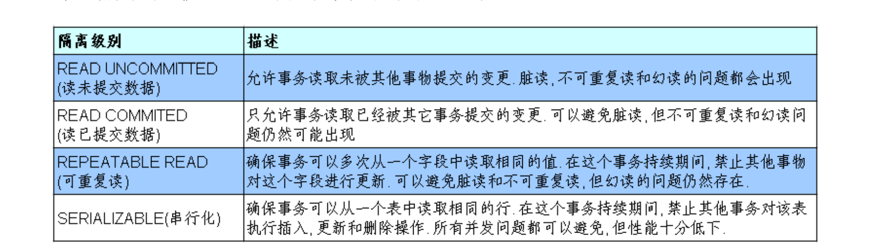
  - 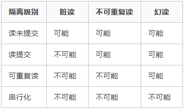
  - 1、READ UNCOMMITTED
  - 2、READ COMMITTED 可以避免脏读
  - 3、REPEATABLE READ 可以避免脏读、不可重复读和一部分幻读
  - 4、SERIALIZABLE 可以避免脏读、不可重复读和幻读
- Oracle 支持的 2 种事务隔离级别：READ COMMITED, SERIALIZABLE。 Oracle 默认的事务隔离级别为: READ COMMITED 
- Mysql 支持 4 种事务隔离级别。Mysql 默认的事务隔离级别为: REPEATABLE READ

在 MySql 中设置隔离级别
- 每启动一个 mysql 程序, 就会获得一个单独的数据库连接. 每个数据库连接都有一个全局变量 @@tx_isolation, 表示当前的事务隔离级别. 
- 查看当前的隔离级别: SELECT @@tx_isolation;
- 设置隔离级别：set session|global transaction isolation level 隔离级别名;
- 设置当前 MySQL 连接的隔离级别: 
  - set transaction isolation level 隔离级别名;
- 设置数据库系统的全局的隔离级别:
  - set global transaction isolation level 隔离级别名;

## 视图

### 什么是视图
视图：MySQL从5.0.1版本开始提供视图功能。一种**虚拟存在的表**（使用SHOW TABLES区分不出来与表的区别的），行和列的数据来自定义视图的查询中使用的表，并且是在使用视图时动态生成的，只保存了sql逻辑，不保存查询结果。
- 应用场景：
  - 多个地方用到同样的查询结果
  - 该查询结果使用的sql语句较复杂
- 语句：CREATE VIEW 视图名 AS 查询语句;
- 示例：
   ```sql
   CREATE VIEW my_v1 AS SELECT
      studentname,
      majorname 
   FROM student s
   INNER JOIN major m ON s.majorid = m.majorid 
   WHERE s.majorid = 1;
   ```

视图的好处
- 简化复杂的sql操作，不必知道它的查询细节
- sql语句提高重用性，效率高
- 和表实现了分离，保护数据，提高了安全性

视图和表的区别：

| 比较项 | 创建语法的关键字 | 是否实际占用物理空间 | 使用                         |
| ------ | ---------------- | -------------------- | ---------------------------- |
| 视图   | CREATE VIEW      | 只是保存了sql逻辑    | 增删改查，只是一般不能增删改 |
| 表     | CREATE TABLE     | 保存了数据           | 增删改查                     |

### 创建或修改视图
创建视图的语法：
```sql
CREATE [ OR REPLACE ] VIEW view_name 
AS select_statement 
[ WITH | CASCADED | LOCAL | CHECK OPTION]
```

修改视图的语法：
```sql
ALTER VIEW view_name 
AS select_statement 
[ WITH | CASCADED | LOCAL | CHECK OPTION]
```

### 删除视图
删除视图的语法：
用户可以一次删除一个或者多个视图，前提是必须有该视图的drop权限。
```sql
DROP VIEW [ IF EXISTS ] view_name,view_name...[ RESTRICT | CASCADE];
```

### 查看视图
查看视图的语法：`DESC view_name;`
如果需要查询某个视图的定义，可以使用：`SHOW CREATE VIEW view_name\G`

### 使用举例
1. 视图的增删改查
   1. 查看视图的数据 ★
      ```sql
      SELECT * FROM my_v4;
      SELECT * FROM my_v1 WHERE last_name='Partners';
      ```
   2. 插入视图的数据
      ```sql
      INSERT INTO my_v4(last_name,department_id) VALUES('虚竹',90);
      ```
   3. 修改视图的数据
      ```sql
      UPDATE my_v4 SET last_name ='梦姑' WHERE last_name='虚竹';
      ```
   4. 删除视图的数据
      ```sql
      DELETE FROM my_v4;
      ```
2. 视图逻辑的更新
   1. 方式一：
      ```sql
      CREATE OR
      REPLACE VIEW test_v7 AS
      SELECT last_name FROM employees WHERE employee_id > 100;
      ```
   2. 方式二:
      ```sql
      ALTER VIEW test_v7 AS
      SELECT employee_id FROM employees;
      SELECT * FROM test_v7;
      ```
3. 视图的删除
   ```sql
   DROP VIEW test_v1,test_v2,test_v3;
   ```
4. 视图结构的查看	
   ```sql
   DESC test_v7; -- 字段
   SHOW CREATE VIEW test_v7; -- 定义
   ```

### 视图的更新
向视图中插入修改或删除数据，会对视图关联的真实表进行修改。
```sql
-- 1. 插入
INSERT INTO myv1 VALUES('张飞','zf@qq.com');
-- 2. 修改
UPDATE myv1 SET last_name = '张无忌' WHERE last_name='张飞';
-- 3. 删除
DELETE FROM myv1 WHERE last_name = '张无忌';
```

视图的可更新性和视图中查询的定义有关系，以下类型的视图是不能更新的。
- 包含以下关键字的sql语句：分组函数、DISTINCT、GROUP BY、HAVING、UNION或者UNION ALL
- 常量视图，如：`CREATE OR REPLACE VIEW myv2 AS SELECT 'john' name;`
- SELECT中包含子查询
- 连接查询，如 INNER LEFT RIGHT FULL CROSS JOIN，可以update不建议。
- FROM一个不能更新的视图
- WHERE子句的子查询引用了FROM子句中的表

## 存储过程和函数

### 什么是存储过程和函数
存储过程和函数：事先经过编译并存储在数据库中的一段sql语句的集合。

分类：
1. 无返回无参
2. 仅仅带in类型，无返回有参
3. 仅仅带out类型，有返回无参
4. 既带in又带out，有返回有参
5. 带inout，有返回有参

注意：in、out、inout都可以在一个存储过程中带多个

### 使用存储过程和函数的好处
1. 提高了sql语句的重用性，简化应用开发人员的很多工作
2. 减少了编译次数并且减少了和数据库服务器的连接次数
3. 提高了数据处理的效率

### 创建存储过程和函数
- 创建存储过程：
   ```sql
   CREATE PROCEDURE 存储过程名 ([ proc_parameter [,...]]) 
      [ characteristic...] routine_body
   ```
- 创建函数：
   ```sql
   CREATE FUNCTION 函数名 ([ func_parameter [,...]]) RETURNS type 
      [ characteristic...] routine_body
   ```
---
- proc_parameter:`[in|out|inout] param_name type`
  - 参数列表：包含参数模式、参数名和参数类型三部分
  - 参数模式：
    - IN：该参数可以作为输入，也就是该参数需要调用方传入值
    - OUT：该参数可以作为输出，也就是该参数可以作为返回值
    - INOUT：该参数既可以作为输入又可以作为输出，也就是该参数既需要传入值，又可以返回值
- Func_paramter:`param_name type`
- Type:任何有效的mysql数据类型
- Characteristic:
  - `language sql`(默认，且推荐)
  - |`[not] deterministic`
  - |`{contains sql|no sql|reads sql data|modifies sql data}`
  - |`sql security{definer|invoker}`
  - |`comment 'string'`
- Rountine_body:有效的sql 过程语句

```sql
CREATE PROCEDURE mylogin (-- 创建存储过程实现验证用户身份
	IN username VARCHAR ( 20 ),
	IN pwd VARCHAR ( 20 ),
   OUT issucc VARCHAR (2)) BEGIN
	DECLARE result INT DEFAULT 0; -- 声明并初始化
	SELECT COUNT(*) INTO result FROM admin 
	WHERE admin.username = username AND admin.pwd = pwd;
	SELECT IF( result > 0, '成功', '失败' ) INTO pwd; -- 使用
END $
```

### 调用存储过程和函数
- 调用存储过程：CALL 存储过程名(参数列表)
- 调用函数：SELECT 函数名(参数列表)

```sql
-- 根据输入的女神名，返回对应的男神名和魅力值
CREATE PROCEDURE mygetxxx ( IN beautyName VARCHAR ( 20 ), OUT boyName VARCHAR ( 20 ), OUT usercp INT ) BEGIN
	SELECT boys.boyname, boys.usercp INTO boyname, usercp 
	FROM boys
	RIGHT JOIN beauty b ON b.boyfriend_id = boys.id 
	WHERE b.NAME = beautyName;
END $ 
CALL mygetxxx ( '小昭', @name, @cp ) $ -- 调用
SELECT @name, @cp$
```

```sql
-- 根据部门名，返回该部门的平均工资
CREATE FUNCTION myf3(deptName VARCHAR(20)) RETURNS DOUBLE
BEGIN
	DECLARE sal DOUBLE ;
	SELECT AVG(salary) INTO sal
	FROM employees e
	JOIN departments d ON e.department_id = d.department_id
	WHERE d.department_name=deptName;
	RETURN sal;
END $
```

### 修改存储过程和函数
- 修改存储过程：
   ```sql
   ALTER PROCEDURE 存储过程名 [ charactristic...]
   ```
- 修改函数：
   ```sql
   ALTER FUNCTION 函数名 [ charactristic...]
   ```
- characteristic:
  - `{contains sql|no sql|reads sql data|modifies sql data}`
  - `|sql security{definer|invoker}`
  - `|comment 'string'`

删除存储过程或函数
- 说明：一次只能删除一个存储过程或者函数，并且要求有该过程或函数的alter routine 权限
- 删除存储过程：
   ```sql
   DROP PROCEDURE [ IF EXISTS ] 存储过程名
   ```
- 删除函数：
   ```sql
   DROP FUNCTION [ IF EXISTS ] 函数名
   ```

### 查看存储过程和函数
1. 查看存储过程或函数的状态：
   ```sql
   SHOW { PROCEDURE | FUNCTION } STATUS LIKE 存储过程或函数名
   ```
2. 查看存储过程或函数的定义：
   ```sql
   SHOW CREATE { PROCEDURE | FUNCTION } 存储过程或函数名
   ```
3. 通过查看information_schema.routines了解存储过程和函数的信息（了解）
   ```sql
   SELECT * FROM rountines WHERE rounine_name=存储过程名|函数名
   ```

### 小结
1. 存储过程
   1. 创建存储过程语法：
      ```sql
      CREATE PROCEDURE 存储过程名(IN|OUT|INOUT 参数名 参数类型,...)
      BEGIN
         存储过程体
      END
      ```
   2. 如果存储过程体仅仅只有一句话，BEGIN END可以省略
   3. 存储过程体中的每条sql语句的结尾要求必须分号。
   4. 结束标记可以使用 `DELIMITER 新的结束标记` 重新设置
      ```sql
      DELIMITER $ -- 结束标记设置为$
      CREATE PROCEDURE 存储过程名(IN|OUT|INOUT 参数名 参数类型,...)
      BEGIN
         存储过程体
      END $
      ```
2. 函数
   1. 创建函数语法：
      ```sql
      -- （学过的函数：LENGTH、SUBSTR、CONCAT等）
      CREATE FUNCTION 函数名(参数名 参数类型,...) RETURNS 返回类型
      BEGIN
         函数体
         RETURN 值;
      END
      ```
   2. 函数体必须有return语句，return语句不强制放在函数体最后。
   3. 如果函数体仅仅只有一句话，BEGIN END可以省略
   4. 函数体中的每条sql语句的结尾要求必须加分号。
3. 函数和存储过程的区别
   | 区别     | 关键字    | 调用语法        | 返回值          | 应用场景               |
   | -------- | --------- | --------------- | --------------- | ---------------------- |
   | 函数     | FUNCTION  | SELECT 函数()   | 有且仅有一个    | 处理数据后返回一个结果 |
   | 存储过程 | PROCEDURE | CALL 存储过程() | 可以有0个或多个 | 批量插入、批量更新     |

## 流程控制结构

### 系统变量
1. 全局变量：由系统定义，不是用户定义，属于服务器层面。作用域：针对于所有会话（连接）有效，但不能跨重启。（跨重启更改需要修改数据库的配置文件，不常用）
2. 会话变量。 作用域：针对于当前会话（连接）有效
3. 注意：全局变量需要添加global关键字，会话变量需要添加session关键字，如果不写，默认会话级别。
   1. 查看所有系统变量 
      ```sql
      SHOW GLOBAL|[SESSION] VARIABLES;
      ```
   2. 查看满足条件的部分系统变量 
      ```sql
      SHOW GLOBAL|[SESSION] VARIABLES LIKE '%char%';
      ```
   3. 查看指定的系统变量的值
      ```sql
      SELECT @@global|[session].系统变量名;
      ```
   4. 为某个系统变量赋值
      1. 方式一： 
         ```sql
         SET GLOBAL|[SESSION].系统变量名 = 值;
         ```
      2. 方式二： 
         ```sql
         SET @@global|[session].系统变量名 = 值;
         ```

### 自定义变量
1. 用户变量
   1. 作用域：针对于当前会话（连接）有效，同于会话变量
   2. 声明并初始化：
      ```sql
      SET @变量名 [:]= 值;
      SELECT @变量名 := 值;
      ```
   3. 赋值：
      1. 方式一：语句同变量声明，一般用于赋简单的值，
      2. 方式二：一般用于赋表中的字段值
         ```sql
         SELECT 字段名或表达式 INTO 变量 FROM 表;
         ```
   4. 使用：
      ```sql
      SELECT @变量名;
      ```
2. 局部变量
   1. 作用域：仅仅在定义它的BEGIN END块中有效。应用在BEGIN END中的第一句话
   2. 声明：
      ```sql
      DECLARE 变量名 类型 [DEFAULT 值];
      ```
   3. 赋值：
      1. 方式一：一般用于赋简单的值
         ```sql
         SET 变量名 [:]= 值;
         SELECT @变量名 := 值;
         ```
      2. 方式二：一般用于赋表 中的字段值
         ```sql
         SELECT 字段名或表达式 INTO 变量 FROM 表;
         ```
   4. 使用：
      ```sql
      SELECT 变量名
      ```
3. 二者的区别：
   | 区别     | 作用域              | 定义位置            | 语法                     |
   | -------- | ------------------- | ------------------- | ------------------------ |
   | 用户变量 | 当前会话            | 会话的任何地方      | 加@符号，不用指定类型    |
   | 局部变量 | 定义它的BEGIN END中 | BEGIN END的第一句话 | 一般不用加@,需要指定类型 |
4. 案例
   ```sql
   -- 用户变量
   SET @m = 1;
   SET @n = 1;
   SET @sum = @m + @n;
   SELECT @sum;
   -- #局部变量
   DECLARE m INT DEFAULT 1;
   DECLARE n INT DEFAULT 1;
   DECLARE SUM INT;
   SET SUM = m + n;
   SELECT SUM;
   ```

### 分支
1. IF函数
   1. 语法：IF(条件, 值1, 值2)
   2. 特点：可以用在任何位置
2. CASE语句
   1. 语法：
      1. 情况一：类似于switch
         ```sql
         CASE 表达式
         WHEN 值1 THEN 结果1或语句1(如果是语句，需要加分号) 
         WHEN 值2 THEN 结果2或语句2(如果是语句，需要加分号)
         ...
         ELSE 结果n或语句n(如果是语句，需要加分号)
         END [CASE] -- 如果是放在BEGIN END中需要加上case，如果放在select后面不需要
         ```
      2. 情况二：类似于多重if
         ```sql
         CASE 
         WHEN 条件1 THEN 结果1或语句1(如果是语句，需要加分号) 
         WHEN 条件2 THEN 结果2或语句2(如果是语句，需要加分号)
         ...
         ELSE 结果n或语句n(如果是语句，需要加分号)
         END [CASE] --- 如果是放在BEGIN END中需要加上case，如果放在select后面不需要
         ```
   2. 特点：可以用在任何位置
3. IF ELSEIF语句
   1. 语法：
      ```sql
      IF 情况1 THEN 语句1;
      ELSEIF 情况2 THEN 语句2;
      ...
      ELSE 语句n;
      END IF;
      ```
   2. 特点：只能用在BEGIN END中！！！
4. 三者比较：
   | 比较项   | 应用场合          |
   | -------- | ----------------- |
   | if函数   | 简单双分支        |
   | case结构 | 等值判断 的多分支 |
   | if结构   | 区间判断 的多分支 |

### 循环
1. 语法：
   ```sql
   [标签:] WHILE 循环条件 -- 先判断后执行
   DO
      循环体
   END WHILE [标签];

   [标签:] REPEAT -- 先执行后判断
      循环体
   UNTIL 循环结束条件 -- 这里的条件是结束条件，为真时循环结束
   END REPEAT [标签];

   [标签:] LOOP -- 死循环
      循环体
   END LOOP [标签];
   ```
2. 特点：
   1. 只能放在BEGIN END里面
   2. `ITERATE [标签]`：类似于continue，继续，结束本次循环，继续下一次循环
   3. `LEAVE [标签]`：类似于break，跳出，结束当前循环
   4. 如果要搭配leave跳转语句，需要使用标签，否则可以不用标签

